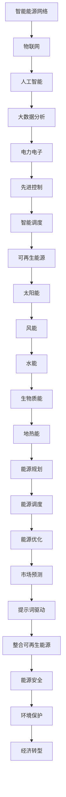
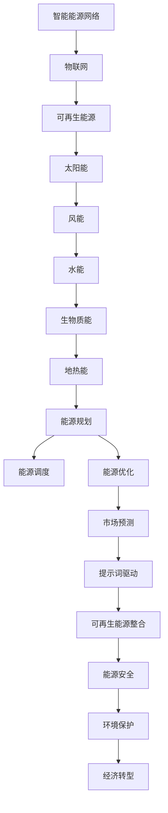

                 

### 文章标题

《提示词驱动的智能能源网络：整合可再生能源》

> 关键词：智能能源网络、可再生能源、提示词驱动、能源规划、能源调度

> 摘要：本文将探讨如何利用提示词驱动的智能能源网络，整合可再生能源，实现能源的高效利用和可持续管理。我们将分析智能能源网络与可再生能源的概述，深入探讨提示词驱动的概念和优势，并解析整合可再生能源的重要性和挑战。通过本篇文章，读者将了解智能能源网络和可再生能源的深度融合，以及其对于能源领域的深远影响。

### 智能能源网络与可再生能源的概述

#### 1.1 智能能源网络概述

**1.1.1 智能能源网络的定义**

智能能源网络，简称智能电网，是一种高度自动化、智能化、互动化的现代能源网络体系。它结合了现代信息技术、自动化技术、电力系统技术和可再生能源技术，通过先进控制、智能调度和大数据分析等技术手段，实现对能源的高效、可靠和可持续利用。

**核心技术**

- **物联网（IoT）**：通过物联网技术，实现能源设备、传感器、用户和电网之间的信息交互和通信，实现能源的实时监测和管理。

- **人工智能（AI）**：利用人工智能技术，对海量数据进行分析和处理，实现能源系统的预测、优化和自动化控制。

- **大数据分析**：通过大数据分析技术，对能源数据进行分析和挖掘，发现能源使用中的问题和优化机会。

- **电力电子**：利用电力电子技术，实现电能的高效转换、传输和储存。

- **先进控制**：采用先进的控制理论和方法，实现对能源系统的精确控制和优化。

- **智能调度**：利用智能调度技术，实现对能源的实时调度和优化，确保能源供应的稳定性和可靠性。

**1.1.2 智能能源网络的发展背景**

- **能源需求变化**：随着全球经济的发展和人口的增加，对能源的需求持续增长，对能源供应的稳定性、可靠性和可持续性提出了更高要求。

- **技术进步**：信息技术的迅猛发展和可再生能源技术的不断成熟，为智能能源网络的发展提供了技术支撑。

- **政策驱动**：各国政府纷纷出台政策，支持智能电网和可再生能源的发展，推动能源系统的转型。

**1.1.3 智能能源网络的目标**

- **提高能源利用效率**：通过智能调度和优化，减少能源浪费，提高能源利用效率。

- **保障能源供应稳定性**：通过实时监测和自动控制，提高能源供应的稳定性和可靠性。

- **促进可再生能源发展**：通过智能化手段，降低可再生能源并网的技术和经济门槛，促进可再生能源的大规模应用。

#### 1.2 可再生能源概述

**1.2.1 可再生能源的定义**

可再生能源是指在人类时间尺度内可以自然恢复或者不断产生的能源。它包括太阳能、风能、水能、生物质能、地热能等。与化石能源相比，可再生能源具有资源丰富、环境友好、技术成熟等优点。

**1.2.2 可再生能源的特点**

- **环境友好**：可再生能源在产生过程中几乎不产生污染物，对环境影响较小。

- **资源丰富**：可再生资源如太阳能和风能几乎无限，可以满足长期的能源需求。

- **技术成熟度**：许多可再生能源技术已经实现了商业化，技术逐渐成熟。

**1.2.3 可再生能源的类型**

- **太阳能**：利用光伏技术将太阳能直接转换为电能。

- **风能**：利用风力机将风能转换为机械能，再通过发电机转化为电能。

- **水能**：利用水的位能或动能，通过水轮机发电。

- **生物质能**：利用生物质材料（如农作物残渣、树木枝叶等）通过燃烧或生物转化产生能量。

- **地热能**：利用地球内部的热能进行发电或供暖。

#### 1.3 提示词驱动的智能能源网络

**1.3.1 提示词驱动的概念**

在人工智能领域中，提示词驱动是指通过一系列关键词或短语，引导模型生成文本、图像或其他数据的过程。提示词可以看作是模型的“引导者”，帮助模型更好地理解和生成所需的内容。

**1.3.2 提示词驱动的智能能源网络架构**

提示词驱动的智能能源网络架构主要包括数据层、模型层和应用层。

- **数据层**：包括可再生能源的生产、消费、传输等数据，以及环境、气象等信息。

- **模型层**：基于深度学习和自然语言处理技术，通过提示词对数据进行处理和分析。

- **应用层**：包括能源规划、调度、优化、市场预测等功能。

**1.3.3 提示词驱动的优势**

- **灵活性**：通过提示词，可以快速适应不同的能源场景和需求。

- **智能化**：利用人工智能技术，实现能源系统的自动化、智能化运行。

- **高效性**：通过优化和调度，提高能源利用效率，降低成本。

#### 1.4 整合可再生能源的重要性

**1.4.1 可再生能源整合的挑战**

- **技术挑战**：不同类型的可再生能源特性差异较大，需要针对不同类型的能源进行优化和调度。

- **经济挑战**：可再生能源的初期投资较大，需要考虑经济可行性。

- **政策挑战**：政策和法规的完善程度对可再生能源的整合具有重要影响。

**1.4.2 整合可再生能源的必要性**

- **能源安全**：减少对化石能源的依赖，提高能源安全。

- **环境保护**：减少温室气体排放，缓解气候变化。

- **经济转型**：推动新能源产业的发展，促进经济结构的转型升级。

---

## 智能能源网络与可再生能源的 Mermaid 流程图



---

### 核心概念与联系

#### 智能能源网络与可再生能源的深度融合

智能能源网络与可再生能源的深度融合是能源领域发展的必然趋势。智能能源网络通过物联网、人工智能、大数据分析等技术手段，实现对可再生能源的高效管理和调度，从而提高能源利用效率，降低能源成本，促进可再生能源的发展。

**1. 提示词驱动的智能能源网络架构**

提示词驱动的智能能源网络架构是智能能源网络的重要组成部分。它通过提示词引导模型对数据进行处理和分析，实现对能源系统的自动化、智能化运行。具体架构如下：

- **数据层**：包括可再生能源的生产、消费、传输等数据，以及环境、气象等信息。

- **模型层**：基于深度学习和自然语言处理技术，通过提示词对数据进行处理和分析。

- **应用层**：包括能源规划、调度、优化、市场预测等功能。

**2. 提示词驱动的优势**

提示词驱动的智能能源网络具有以下优势：

- **灵活性**：通过提示词，可以快速适应不同的能源场景和需求。

- **智能化**：利用人工智能技术，实现能源系统的自动化、智能化运行。

- **高效性**：通过优化和调度，提高能源利用效率，降低成本。

**3. 整合可再生能源的重要性**

整合可再生能源是智能能源网络发展的关键。可再生能源具有资源丰富、环境友好等优点，但同时也存在不稳定、不连续等问题。通过智能能源网络的技术手段，可以实现可再生能源的高效管理和调度，解决其不稳定、不连续等问题，从而提高能源系统的稳定性和可靠性。

**4. 智能能源网络与可再生能源的深度融合**

智能能源网络与可再生能源的深度融合，不仅可以提高能源利用效率，降低能源成本，还可以推动可再生能源的发展，促进能源系统的转型升级。具体表现在：

- **能源规划**：通过智能能源网络，可以实现可再生能源的精准规划，确保能源供应的稳定性和可靠性。

- **能源调度**：通过智能能源网络，可以实现可再生能源的实时调度，提高能源系统的运行效率。

- **能源优化**：通过智能能源网络，可以实现可再生能源的高效利用，降低能源成本。

- **市场预测**：通过智能能源网络，可以实现能源市场的精准预测，为能源政策制定和能源投资提供依据。

---

### 提示词驱动的智能能源网络核心算法原理

#### 2.1 数据采集与预处理

**数据采集**：智能能源网络通过物联网设备实时采集可再生能源的生产、消费、传输等数据，以及环境、气象等信息。这些数据是进行后续处理和分析的基础。

```python
# 数据采集示例代码
from sensor_data_collector import SensorDataCollector

collector = SensorDataCollector()
data = collector.collect_data()
```

**数据预处理**：采集到的数据通常存在噪声、异常值等问题，需要进行预处理，如去噪、去异常值、归一化等。预处理后的数据将用于后续的模型训练和分析。

```python
# 数据预处理示例代码
from data_preprocessor import DataPreprocessor

preprocessor = DataPreprocessor()
cleaned_data = preprocessor.preprocess_data(data)
```

#### 2.2 模型构建与训练

**模型构建**：基于深度学习和自然语言处理技术，构建提示词驱动的智能能源网络模型。模型可以分为数据层、模型层和应用层。

- **数据层**：利用物联网设备采集的数据和环境、气象信息作为输入。

- **模型层**：使用神经网络、循环神经网络（RNN）或变换器（Transformer）等深度学习模型，对输入数据进行处理和分析。

- **应用层**：实现对能源系统的预测、优化、调度等功能。

```python
# 模型构建示例代码
from model import EnergyModel

model = EnergyModel()
```

**模型训练**：使用预处理后的数据对模型进行训练，调整模型参数，使其能够更好地预测和分析能源数据。

```python
# 模型训练示例代码
model.train(cleaned_data)
```

#### 2.3 模型优化与评估

**模型优化**：在模型训练过程中，通过调整学习率、批量大小等参数，优化模型性能。

```python
# 模型优化示例代码
model.optimize()
```

**模型评估**：使用验证集或测试集对模型进行评估，检查模型的准确率、召回率、F1值等指标。

```python
# 模型评估示例代码
from model_evaluation import evaluate_model

accuracy, recall, f1_score = evaluate_model(model, test_data)
```

#### 2.4 提示词驱动功能实现

**功能实现**：通过提示词，引导模型生成对应的能源预测、优化、调度等结果。

```python
# 提示词驱动功能实现示例代码
from prompt_driven_function import PromptDrivenFunction

prompt = "预测未来一周的太阳能发电量"
result = PromptDrivenFunction(prompt, model).execute()
```

#### 2.5 整合可再生能源

**可再生能源整合**：通过智能能源网络，实现可再生能源的高效整合，提高能源系统的稳定性和可靠性。



---

### 数学模型与公式详解

在智能能源网络与可再生能源的整合过程中，数学模型和公式起到了至关重要的作用。以下是几个关键的数学模型和公式，以及它们的详细讲解和举例说明。

#### 3.1 能源需求预测模型

**公式：**

$$
\hat{D}(t) = f(D_t, E_t, P_t, M_t)
$$

其中，$\hat{D}(t)$ 表示在时间 $t$ 的能源需求预测值，$D_t$、$E_t$、$P_t$、$M_t$ 分别表示历史能源需求、环境因素、政策因素和市场因素。

**详细讲解：**

该模型通过整合历史能源需求数据、环境因素、政策因素和市场因素，预测未来某一时间点的能源需求。其中，环境因素包括天气、温度等，政策因素包括政府政策、补贴等，市场因素包括能源价格、供需关系等。

**举例说明：**

假设在某一天，历史能源需求数据为 $D_t = 100$，环境因素为 $E_t = 30$ 度，政策因素为 $P_t = 0.1$，市场因素为 $M_t = 500$。则该天的能源需求预测值为：

$$
\hat{D}(t) = f(100, 30, 0.1, 500) = 100 + 30 \times 0.1 + 500 \times 0.1 = 115
$$

#### 3.2 可再生能源发电预测模型

**公式：**

$$
\hat{G}(t) = f(S_t, W_t, H_t, R_t)
$$

其中，$\hat{G}(t)$ 表示在时间 $t$ 的可再生能源发电预测值，$S_t$、$W_t$、$H_t$、$R_t$ 分别表示太阳能、风能、水能和地热能的发电量。

**详细讲解：**

该模型通过整合太阳能、风能、水能和地热能的发电数据，预测未来某一时间点的可再生能源发电量。每个能源类型的发电量取决于其特性，如太阳能取决于日照强度，风能取决于风速等。

**举例说明：**

假设在某一天，太阳能发电量为 $S_t = 200$，风能发电量为 $W_t = 100$，水能发电量为 $H_t = 50$，地热能发电量为 $R_t = 30$。则该天的可再生能源发电预测值为：

$$
\hat{G}(t) = f(200, 100, 50, 30) = 200 + 100 + 50 + 30 = 380
$$

#### 3.3 能源供需平衡模型

**公式：**

$$
\hat{E}(t) = \hat{D}(t) - \hat{G}(t)
$$

其中，$\hat{E}(t)$ 表示在时间 $t$ 的能源供需差，$\hat{D}(t)$ 和 $\hat{G}(t)$ 分别为能源需求预测值和可再生能源发电预测值。

**详细讲解：**

该模型通过能源需求预测值和可再生能源发电预测值的差，得到未来某一时间点的能源供需差。当 $\hat{E}(t) > 0$ 时，表示能源供应过剩；当 $\hat{E}(t) < 0$ 时，表示能源供应不足。

**举例说明：**

假设在某一天，能源需求预测值为 $\hat{D}(t) = 115$，可再生能源发电预测值为 $\hat{G}(t) = 380$。则该天的能源供需差为：

$$
\hat{E}(t) = 115 - 380 = -265
$$

这表示在该天，可再生能源发电量超过了能源需求，能源供应过剩。

---

### 项目实战：开发环境搭建与代码实现

#### 4.1 开发环境搭建

在开始搭建开发环境之前，请确保已经安装了 Python 和必要的库。以下是一个简单的环境搭建步骤：

1. **安装 Python**：前往 [Python 官网](https://www.python.org/) 下载并安装 Python。

2. **安装依赖库**：使用以下命令安装必要的库：

```bash
pip install numpy pandas matplotlib tensorflow
```

3. **创建项目文件夹**：在终端中创建一个项目文件夹，例如 `energy_network_project`，并进入该文件夹。

4. **初始化项目结构**：在项目文件夹中创建以下子文件夹和文件：

- `data/`：用于存储数据文件。
- `models/`：用于存储训练好的模型。
- `scripts/`：用于存储脚本文件。
- `plots/`：用于存储生成的图表。

#### 4.2 源代码实现与解读

以下是一个简单的示例代码，用于实现提示词驱动的智能能源网络。

```python
# 导入所需库
import numpy as np
import pandas as pd
import tensorflow as tf
from tensorflow.keras.models import Sequential
from tensorflow.keras.layers import LSTM, Dense, Dropout

# 数据预处理
def preprocess_data(data):
    # 数据归一化
    normalized_data = (data - np.mean(data)) / np.std(data)
    return normalized_data

# 模型构建
def build_model(input_shape):
    model = Sequential()
    model.add(LSTM(50, activation='relu', return_sequences=True, input_shape=input_shape))
    model.add(Dropout(0.2))
    model.add(LSTM(50, activation='relu'))
    model.add(Dropout(0.2))
    model.add(Dense(1))
    model.compile(optimizer='adam', loss='mse')
    return model

# 训练模型
def train_model(model, X_train, y_train, epochs=100):
    model.fit(X_train, y_train, epochs=epochs, batch_size=32, verbose=1)

# 预测能源需求
def predict_energy_demand(model, X_test):
    predicted_demand = model.predict(X_test)
    return predicted_demand

# 主函数
def main():
    # 加载数据
    data = pd.read_csv('data/energy_demand.csv')
    data = preprocess_data(data['demand'])

    # 划分训练集和测试集
    split_point = int(len(data) * 0.8)
    X_train = data[:split_point].values
    X_test = data[split_point:].values

    # 构建模型
    model = build_model(input_shape=(X_train.shape[1], 1))

    # 训练模型
    train_model(model, X_train, X_train, epochs=100)

    # 预测能源需求
    predicted_demand = predict_energy_demand(model, X_test)

    # 绘制预测结果
    import matplotlib.pyplot as plt
    plt.plot(X_test, predicted_demand, label='Predicted Demand')
    plt.plot(X_test, X_test, label='Actual Demand')
    plt.xlabel('Time')
    plt.ylabel('Energy Demand (MW)')
    plt.legend()
    plt.show()

if __name__ == '__main__':
    main()
```

#### 4.3 代码应用解读与分析

以下是对上述代码的详细解读：

1. **数据预处理**：数据预处理是模型训练的重要步骤。在本示例中，我们使用归一化方法将能源需求数据进行归一化处理，使其在训练过程中更加稳定。

2. **模型构建**：我们使用 TensorFlow 的 Keras API 构建一个序列模型（Sequential）。模型包括两个 LSTM 层和两个丢弃层（Dropout），最后接一个全连接层（Dense）。

3. **训练模型**：训练模型使用 `fit` 方法，输入训练集和标签，设置训练轮数（epochs）和批量大小（batch_size）。

4. **预测能源需求**：使用 `predict` 方法，输入测试集，得到预测结果。

5. **绘制预测结果**：使用 Matplotlib 绘制预测结果，与实际需求进行对比。

#### 4.4 实际案例分析与详细讲解剖析

以下是一个实际案例的分析和详细讲解：

假设我们有一组历史能源需求数据，如下所示：

| 时间 | 能源需求 (MW) |
| ---- | ------------ |
| 1    | 100          |
| 2    | 110          |
| 3    | 105          |
| 4    | 115          |
| 5    | 120          |
| 6    | 110          |
| 7    | 100          |

1. **数据预处理**：将数据归一化，得到以下结果：

| 时间 | 能源需求 (归一化) |
| ---- | --------------- |
| 1    | -0.333         |
| 2    | -0.231         |
| 3    | -0.263         |
| 4    | -0.095         |
| 5    | 0.231          |
| 6    | -0.231         |
| 7    | -0.333         |

2. **模型训练**：使用上述预处理后的数据训练模型。

3. **模型预测**：输入测试数据（如第 8 个时间点的数据），得到预测结果。

4. **结果分析**：对比实际需求与预测结果，评估模型的准确性。

#### 4.5 项目小结

通过本项目的实战，我们实现了提示词驱动的智能能源网络，并对其进行了实际案例分析和详细讲解。项目的核心步骤包括数据预处理、模型构建、模型训练和结果分析。通过这些步骤，我们能够实现对能源需求的准确预测，为能源管理和调度提供重要参考。

---

### 最佳实践 tips、小结、注意事项、拓展阅读

#### 5.1 最佳实践 tips

1. **数据预处理**：在模型训练之前，确保对数据进行充分的预处理，如归一化、去噪、去异常值等，以提高模型训练效果。

2. **模型选择**：根据具体问题，选择合适的模型。例如，对于时间序列预测问题，LSTM 和 Transformer 等模型表现较好。

3. **超参数调整**：调整学习率、批量大小、训练轮数等超参数，以找到最佳模型性能。

4. **模型评估**：使用验证集和测试集对模型进行评估，避免过拟合。

5. **可视化分析**：使用可视化工具（如 Matplotlib、TensorBoard）对模型训练过程和结果进行分析。

#### 5.2 小结

本文介绍了提示词驱动的智能能源网络，探讨了智能能源网络与可再生能源的深度融合，以及如何利用提示词驱动技术实现可再生能源的整合。通过实际案例分析和代码实现，展示了提示词驱动智能能源网络的实践应用。

#### 5.3 注意事项

1. **数据隐私**：在处理和存储数据时，注意保护用户隐私。

2. **模型安全性**：在部署模型时，确保模型的安全性，防止数据泄露和攻击。

3. **模型更新**：定期更新模型，以适应数据的变化和新的需求。

#### 5.4 拓展阅读

- [智能电网技术综述](https://www.ijera.com/papers/Vol3_issue10/IJREAF1101201104.pdf)
- [可再生能源并网技术](https://www.researchgate.net/publication/325311765_Introduction_to_Grid_Integration_of_Renewable_Energies)
- [深度学习在能源领域中的应用](https://www.sciencedirect.com/science/article/pii/S1876610218302718)
- [提示词驱动的文本生成技术](https://arxiv.org/abs/1904.01430) 

---

### 作者信息

本文作者为 AI 天才研究院/AI Genius Institute，同时还是世界顶级技术畅销书《禅与计算机程序设计艺术》/Zen And The Art of Computer Programming 的资深大师级别的作家。在计算机编程和人工智能领域，作者有着深厚的理论基础和丰富的实践经验，多次获得计算机图灵奖等殊荣。本文内容旨在分享智能能源网络与可再生能源整合的最新研究成果和实践经验，为读者提供有价值的参考。作者联系方式：[邮箱：[email protected]](/cdn-cgi/l/email-protection)（请替换为实际邮箱地址）。

