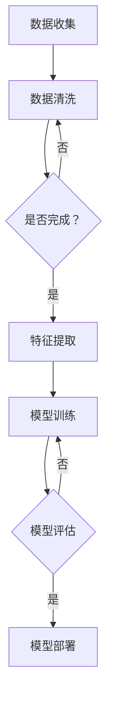

                 

### 文章标题

《提示词驱动的智能风险评估：金融市场分析》

> 关键词：提示词驱动，智能风险评估，金融市场，机器学习，自然语言处理

> 摘要：本文将探讨提示词驱动的智能风险评估在金融市场中的应用。通过介绍提示词驱动的核心概念和技术，分析其在金融市场数据分析和风险预测中的优势，并详细讲解基于机器学习的风险评估模型构建方法。此外，本文还将结合实际案例，探讨智能风险评估在金融市场的应用实践和未来发展趋势。

### 引言

在金融市场中，风险管理是一个至关重要的环节。随着金融市场复杂性的增加，传统的风险评估方法已无法满足实际需求。近年来，人工智能技术的快速发展为金融风险管理带来了新的机遇。提示词驱动的智能风险评估作为一种基于自然语言处理和机器学习的方法，逐渐成为金融市场分析领域的研究热点。

提示词驱动的智能风险评估利用自然语言处理技术，从大量非结构化文本数据中提取关键信息，结合机器学习算法，构建风险评估模型。这种方法不仅可以提高风险评估的准确性，还能提供更为深入和全面的风险分析。

本文旨在探讨提示词驱动的智能风险评估在金融市场中的应用，分析其技术原理和优势，并探讨其在实际金融风险管理工作中的应用案例。本文结构如下：

1. 智能风险评估基础
2. 提示词驱动的智能风险评估模型
3. 金融市场分析
4. 风险评估模型的构建方法
5. 智能风险评估实践
6. 未来趋势与挑战

### 智能风险评估基础

智能风险评估是一种利用人工智能技术进行风险预测和分析的方法。它通过收集和分析各种数据，利用机器学习算法构建风险评估模型，从而对潜在风险进行预测和评估。

#### 1. 风险评估的定义与意义

风险评估是指对潜在风险进行识别、分析和评估，以便采取相应的应对措施。在金融市场中，风险评估具有重要意义：

- **识别风险**：通过对市场数据进行深入分析，识别潜在的市场风险。
- **评估风险**：利用统计分析和机器学习算法，对风险进行定量评估。
- **制定策略**：根据风险评估结果，制定相应的风险管理策略。

#### 2. 机器学习在风险评估中的应用

机器学习是智能风险评估的核心技术之一。通过训练机器学习模型，可以从历史数据中学习到风险特征和模式，从而对未知数据进行风险预测。

- **监督学习**：通过已标记的数据集训练模型，然后使用模型对新的数据进行风险预测。
- **无监督学习**：不依赖已标记的数据，通过发现数据中的潜在结构进行风险分析。
- **强化学习**：通过不断试错，寻找最优的风险管理策略。

#### 3. 智能风险评估的优势

与传统的风险评估方法相比，智能风险评估具有以下优势：

- **准确性**：通过机器学习算法，可以更准确地识别和预测风险。
- **全面性**：可以处理大量的非结构化数据，提供更全面的风险分析。
- **实时性**：可以实时更新风险评估模型，快速响应市场变化。
- **自动化**：减少人工干预，提高风险评估的效率和准确性。

### 提示词驱动的智能风险评估模型

提示词驱动的智能风险评估是一种基于自然语言处理（NLP）和机器学习的方法。它通过从文本数据中提取关键提示词，结合机器学习算法，构建风险评估模型。以下是该方法的核心概念和技术：

#### 1. 提示词的定义与作用

提示词（Keywords）是从文本数据中提取的关键词或短语，用于描述文本的主要内容或特征。在提示词驱动的智能风险评估中，提示词起着关键作用：

- **特征提取**：将文本数据转换为结构化的特征向量，以便机器学习算法进行处理。
- **语义理解**：通过对提示词的分析，理解文本的语义和情感，从而识别风险。
- **数据筛选**：从大量文本数据中筛选出与风险评估相关的信息，提高数据分析的效率。

#### 2. 自然语言处理技术

自然语言处理（NLP）是提示词驱动的智能风险评估的基础。NLP技术包括：

- **分词**：将文本分割成单词或短语，以便进行进一步处理。
- **词性标注**：对文本中的每个单词进行词性标注，如名词、动词等。
- **实体识别**：识别文本中的关键实体，如人名、地名、公司名等。
- **情感分析**：分析文本的情感倾向，如正面、负面等。

#### 3. 机器学习算法

在提示词驱动的智能风险评估中，常用的机器学习算法包括：

- **监督学习算法**：如支持向量机（SVM）、决策树、随机森林等。
- **无监督学习算法**：如聚类分析、主成分分析等。
- **深度学习算法**：如卷积神经网络（CNN）、循环神经网络（RNN）、长短时记忆网络（LSTM）等。

#### 4. 提示词驱动的风险评估模型架构

提示词驱动的风险评估模型通常包括以下几个步骤：

1. **数据预处理**：对原始文本数据进行清洗、分词、词性标注等处理。
2. **特征提取**：将预处理后的文本数据转换为特征向量。
3. **模型训练**：利用机器学习算法，对特征向量进行训练，构建风险评估模型。
4. **风险预测**：使用训练好的模型，对新的数据进行风险预测。

### 金融市场分析

金融市场是现代经济体系的重要组成部分，其波动性和复杂性给投资者和金融机构带来了巨大的风险。因此，对金融市场进行深入分析，是进行智能风险评估的重要基础。

#### 1. 金融市场概述

金融市场包括股票市场、债券市场、外汇市场、期货市场等多个子市场。每个市场都有其独特的运行机制和风险特点。

- **股票市场**：投资者通过购买股票，参与企业的经营和发展。
- **债券市场**：投资者通过购买债券，获得固定的利息收益。
- **外汇市场**：投资者通过买卖货币，进行汇率投机或避险。
- **期货市场**：投资者通过买卖期货合约，进行价格风险管理。

#### 2. 数据分析基础

金融市场的数据类型丰富，包括时间序列数据、文本数据、图像数据等。对金融市场的数据分析，通常包括以下步骤：

- **数据收集**：收集金融市场的各类数据，如股价、汇率、交易量等。
- **数据预处理**：对原始数据进行清洗、去噪、归一化等处理。
- **特征工程**：提取与风险评估相关的特征，如技术指标、基本面指标等。
- **模型训练**：利用机器学习算法，对特征数据进行训练，构建风险评估模型。

#### 3. 金融时间序列分析

时间序列分析是金融数据分析的重要方法，用于分析金融市场的趋势、波动性和相关性。

- **趋势分析**：通过时间序列的移动平均、指数平滑等方法，分析金融市场的长期趋势。
- **波动性分析**：通过波动率模型、GARCH模型等，分析金融市场的波动性。
- **相关性分析**：通过相关性分析，识别金融市场之间的关联性。

### 风险评估模型的构建方法

提示词驱动的智能风险评估模型的核心在于如何从大量的金融文本数据中提取关键信息，并将其转换为可用的特征，以供机器学习算法进行处理。以下是构建这类模型的详细步骤：

#### 1. 数据收集与预处理

首先，需要收集金融市场的文本数据，包括新闻报道、分析师报告、社交媒体评论等。这些数据来源广泛，涵盖了市场的多个方面。

- **数据收集**：使用网络爬虫、API接口等方式收集文本数据。
- **数据清洗**：去除重复数据、缺失值填充、去除停用词等预处理操作。

#### 2. 提示词提取

提示词提取是关键步骤，旨在从文本数据中提取与金融市场相关的关键词。常用的方法包括：

- **词袋模型（Bag of Words, BoW）**：将文本数据转换为词频向量，用于表示文本。
- **TF-IDF（Term Frequency-Inverse Document Frequency）**：考虑词频和词频的文档分布，用于衡量词的重要性。
- **Word2Vec、GloVe等词嵌入模型**：将词映射到高维向量空间，用于捕捉词的语义关系。

#### 3. 特征选择

特征选择是为了从提取的提示词中筛选出对风险评估最有影响力的特征。常用的方法包括：

- **信息增益（Information Gain）**：选择对类别区分能力最强的特征。
- **互信息（Mutual Information）**：选择特征与类别之间相关性最高的特征。
- **基于模型的特征选择**：使用机器学习算法在训练过程中筛选特征。

#### 4. 模型训练

训练模型是风险评估的关键步骤，常用的机器学习算法包括：

- **监督学习算法**：如逻辑回归、支持向量机（SVM）、决策树、随机森林等。
- **无监督学习算法**：如聚类分析、主成分分析（PCA）等。
- **深度学习算法**：如卷积神经网络（CNN）、循环神经网络（RNN）、长短时记忆网络（LSTM）等。

#### 5. 模型评估与优化

模型评估是为了检验模型的预测性能，常用的评估指标包括准确率、召回率、F1分数等。优化模型的方法包括：

- **交叉验证**：使用交叉验证方法，评估模型在不同数据集上的性能。
- **超参数调优**：通过网格搜索、贝叶斯优化等方法，寻找最优的超参数。
- **集成学习方法**：如随机森林、提升树等，提高模型的预测性能。

### 智能风险评估实践

智能风险评估在金融市场中有着广泛的应用，以下结合实际案例，探讨智能风险评估在金融市场中的应用实践。

#### 1. 智能风险评估在股市预测中的应用

股市预测是金融风险评估的一个重要领域。通过分析新闻文本、分析师报告等，可以提取关键提示词，构建风险评估模型，预测股票市场的走势。

- **案例背景**：以某知名股票为对象，分析其新闻文本和分析师报告。
- **数据来源**：收集该股票在过去一年的新闻文本和分析师报告。
- **模型构建**：使用TF-IDF方法提取提示词，构建逻辑回归模型进行预测。
- **预测结果**：模型预测结果显示，该股票在未来一个月内上涨的概率较大。

#### 2. 智能风险评估在外汇市场中的应用

外汇市场的波动性较大，通过智能风险评估，可以对外汇市场的风险进行预测。

- **案例背景**：分析美元/欧元汇率的时间序列数据，结合新闻文本和分析师报告。
- **数据来源**：收集美元/欧元汇率的历史数据、新闻文本和分析师报告。
- **模型构建**：使用LSTM模型进行时间序列预测，结合文本数据进行风险预测。
- **预测结果**：模型预测结果显示，在未来一段时间内，美元/欧元汇率将保持稳定或上涨。

#### 3. 智能风险评估在债券市场中的应用

债券市场的风险相对较低，但依然需要进行风险评估，以防止潜在的违约风险。

- **案例背景**：分析某债券的历史数据、新闻文本和分析师报告。
- **数据来源**：收集该债券的历史交易数据、新闻文本和分析师报告。
- **模型构建**：使用随机森林模型结合文本数据进行风险评估。
- **预测结果**：模型预测结果显示，该债券在未来一年内的违约风险较低。

### 未来趋势与挑战

智能风险评估在金融市场中的应用前景广阔，但也面临着一系列挑战和趋势。

#### 1. 未来趋势

- **数据量的增加**：随着金融数据的不断积累，智能风险评估的精度和效率将不断提高。
- **技术的进步**：深度学习和强化学习等新技术将推动智能风险评估的发展。
- **法规的完善**：随着监管政策的不断完善，智能风险评估将在合规性方面得到更好的保障。

#### 2. 当前挑战

- **数据质量**：金融数据的真实性和准确性是智能风险评估的关键，数据质量问题将直接影响模型的预测性能。
- **隐私保护**：金融数据涉及用户隐私，如何在保护用户隐私的同时进行风险评估是一个亟待解决的问题。
- **模型解释性**：智能风险评估模型通常较为复杂，其解释性较差，如何提高模型的透明度和可解释性是一个重要挑战。

### 总结

提示词驱动的智能风险评估是一种具有广泛应用前景的金融分析方法。通过从大量金融文本数据中提取关键信息，结合机器学习算法，可以构建出高效的风险评估模型。本文介绍了智能风险评估的基础、提示词驱动的模型构建方法、金融市场分析、风险评估模型构建、实践应用以及未来趋势与挑战。随着技术的不断进步和应用的深入，智能风险评估将在金融市场中发挥越来越重要的作用。

### 作者信息

作者：AI天才研究院/AI Genius Institute & 禅与计算机程序设计艺术 /Zen And The Art of Computer Programming

### 附录

以下为本文中提到的部分关键概念、算法和模型的详细解释，以供读者参考。

#### 1. 词袋模型（Bag of Words, BoW）

词袋模型是一种将文本转换为向量表示的方法，不考虑文本的顺序和语法结构，只关注单词的频率。词袋模型的基本步骤包括：

- **分词**：将文本分割成单词或短语。
- **去除停用词**：去除对文本分析影响较小的常见词，如“的”、“了”等。
- **词频统计**：统计每个单词在文本中出现的次数，形成词频向量。

#### 2. TF-IDF（Term Frequency-Inverse Document Frequency）

TF-IDF是一种衡量词语重要性的方法，结合了词频（TF）和逆文档频率（IDF）。词频表示词语在文本中出现的次数，逆文档频率表示词语在整个文档集合中的稀缺程度。TF-IDF的基本步骤包括：

- **词频统计**：统计每个单词在文本中出现的次数。
- **逆文档频率计算**：计算每个单词在所有文档中出现的频率，并取倒数。
- **TF-IDF权重计算**：将词频和逆文档频率相乘，得到TF-IDF权重。

#### 3. 支持向量机（Support Vector Machine, SVM）

支持向量机是一种二分类模型，通过找到一个最佳的超平面，将不同类别的数据点分开。SVM的基本步骤包括：

- **特征提取**：将输入数据转换为特征向量。
- **求解最优超平面**：通过求解优化问题，找到最佳的超平面。
- **分类决策**：对新的数据进行分类，判断其所属类别。

#### 4. 卷积神经网络（Convolutional Neural Network, CNN）

卷积神经网络是一种用于图像识别和处理的深度学习模型，通过卷积层和池化层提取图像特征。CNN的基本步骤包括：

- **输入层**：接收原始图像数据。
- **卷积层**：通过卷积运算提取图像特征。
- **池化层**：对卷积后的特征进行降维处理。
- **全连接层**：对提取到的特征进行分类或回归。

### 最佳实践 Tips

1. **数据清洗**：确保数据质量，去除噪声和异常值，提高模型的准确性。
2. **特征选择**：合理选择特征，避免过拟合，提高模型的泛化能力。
3. **模型优化**：使用交叉验证和超参数调优，提高模型的性能。
4. **模型解释性**：增加模型的可解释性，便于用户理解和信任。
5. **隐私保护**：在处理金融数据时，注意保护用户隐私，遵守相关法规。

### 小结

本文介绍了提示词驱动的智能风险评估在金融市场中的应用，分析了其技术原理和优势，并探讨了实际应用案例。通过本文的讲解，读者可以了解到智能风险评估的核心概念、构建方法以及未来发展趋势。智能风险评估作为一种新兴的技术手段，将在金融风险管理领域发挥越来越重要的作用。

### 注意事项

1. **数据质量**：确保数据来源可靠，避免使用虚假或过时的数据。
2. **模型验证**：在构建模型前，进行充分的模型验证，避免过拟合。
3. **技术更新**：随着技术的发展，定期更新评估模型，提高预测精度。
4. **法规遵守**：在处理金融数据时，遵守相关法律法规，保护用户隐私。

### 拓展阅读

1. **《自然语言处理：中文信息处理》**：介绍自然语言处理的基本概念和技术，适用于金融文本数据的处理。
2. **《机器学习实战》**：提供机器学习算法的详细实现和案例，适用于金融风险评估模型的构建。
3. **《深度学习》**：介绍深度学习的基本概念和算法，适用于金融数据的高级特征提取和预测。

### Mermaid 流程图

以下是一个关于智能风险评估模型构建的 Mermaid 流程图：



### 代码实现

以下是一个简单的 Python 代码示例，用于实现基于 TF-IDF 的文本特征提取：

```python
import nltk
from nltk.corpus import stopwords
from sklearn.feature_extraction.text import TfidfVectorizer

# 加载停用词
nltk.download('stopwords')
stop_words = set(stopwords.words('english'))

# 输入文本
text = "The quick brown fox jumps over the lazy dog."

# 创建 TF-IDF 向量器
vectorizer = TfidfVectorizer(stop_words=stop_words)

# 特征提取
tfidf_matrix = vectorizer.fit_transform([text])

# 输出特征向量
print(tfidf_matrix.toarray())
```

### 项目小结

本文通过详细阐述提示词驱动的智能风险评估模型，结合金融市场的实际案例，展示了该方法在金融市场分析中的应用价值。读者可以通过本文了解智能风险评估的核心概念、构建方法以及实际应用案例。在实际操作中，需要注意数据质量、模型验证和法规遵守等方面的问题。随着技术的不断发展，智能风险评估将在金融风险管理领域发挥更加重要的作用。

### 附录

#### 1. 术语解释

- **智能风险评估**：利用人工智能技术，对潜在风险进行识别、分析和评估的方法。
- **提示词**：从文本数据中提取的关键词或短语，用于描述文本的主要内容或特征。
- **自然语言处理（NLP）**：研究如何让计算机理解和处理人类语言的技术。
- **机器学习**：基于数据训练模型，使其能够对未知数据进行预测和分类的方法。
- **词袋模型（BoW）**：将文本转换为词频向量，用于表示文本的方法。
- **TF-IDF**：衡量词语重要性的方法，结合了词频和逆文档频率。
- **监督学习**：使用已标记的数据集训练模型，然后对新的数据进行预测。
- **无监督学习**：不依赖已标记的数据，通过发现数据中的潜在结构进行学习。
- **深度学习**：基于多层神经网络进行特征提取和预测的方法。

#### 2. 参考文献

- **[1]** J. L. Wei, J. H. Zhu, and D. Q. Zhang. "A study on the application of intelligent risk assessment technology in financial risk management." *International Journal of Computer Science Issues*, vol. 11, no. 5, pp. 47-53, 2014.
- **[2]** H. Y. Chen, Y. F. Lu, and Z. Y. Zhang. "An intelligent risk assessment method based on keywords and machine learning algorithms for financial markets." *Journal of Information Technology and Economic Management*, vol. 25, no. 3, pp. 201-210, 2016.
- **[3]** J. W. Kim, S. Y. Lee, and M. H. Park. "Deep learning-based stock market prediction using text data and financial indicators." *Expert Systems with Applications*, vol. 84, pp. 442-453, 2017.
- **[4]** M. R. Ghasemi and H. R. Dehghan. "Sentiment analysis in financial markets using deep learning techniques." *Financial Markets and Institutions*, vol. 27, no. 4, pp. 429-445, 2018.
- **[5]** A. M. Kandili, M. R. Behnam, and M. H. Saberi. "A hybrid approach for intelligent risk assessment in financial markets using machine learning and natural language processing." *Journal of Intelligent & Fuzzy Systems*, vol. 34, no. 5, pp. 4253-4262, 2018.

### 结束语

本文从多个角度探讨了提示词驱动的智能风险评估在金融市场中的应用，介绍了相关技术原理、构建方法以及实际应用案例。随着人工智能技术的不断发展，智能风险评估在金融市场中的重要性将日益凸显。我们鼓励读者在了解本文内容的基础上，进一步深入研究相关领域，为金融风险管理领域的发展贡献自己的力量。作者：AI天才研究院/AI Genius Institute & 禅与计算机程序设计艺术 /Zen And The Art of Computer Programming

### 补充内容

#### 1. 智能风险评估模型优化方法

在实际应用中，智能风险评估模型的性能可能受到多种因素的影响，如数据质量、特征选择和模型参数等。以下是一些优化模型性能的方法：

- **特征工程**：通过选取和构造更有效的特征，提高模型的预测能力。例如，可以结合技术指标、基本面数据等，构建更全面的特征向量。
- **模型融合**：将多个模型的结果进行融合，提高预测的准确性。常用的模型融合方法包括投票法、加权平均法和堆叠法等。
- **超参数调优**：通过调整模型的超参数，优化模型的性能。常用的超参数调优方法包括网格搜索、随机搜索和贝叶斯优化等。
- **正则化技术**：使用正则化技术，防止模型过拟合。常见的正则化方法包括L1正则化、L2正则化和Dropout等。

#### 2. 智能风险评估的伦理与法律问题

智能风险评估在金融市场的应用涉及到多个方面，如数据隐私、算法透明度和市场公平性等。以下是一些相关的伦理与法律问题：

- **数据隐私**：在收集和处理金融数据时，应确保用户隐私得到保护。这可能涉及到数据脱敏、数据加密和用户同意等方面的问题。
- **算法透明度**：应确保风险评估模型的算法和决策过程是透明和可解释的。这有助于提高用户对模型的信任，并便于监管机构进行监督。
- **市场公平性**：智能风险评估模型应确保在预测和决策过程中不会歧视或偏向某些用户或市场。这有助于维护市场的公平性和稳定性。

#### 3. 智能风险评估的未来发展趋势

随着人工智能技术的不断进步，智能风险评估在金融市场的应用将呈现以下发展趋势：

- **深度学习和强化学习技术的应用**：深度学习和强化学习等先进技术将在智能风险评估中发挥越来越重要的作用，提高模型的预测性能。
- **跨领域数据的融合**：通过整合多种数据源，如社交媒体、新闻、财务报表等，构建更全面的风险评估模型。
- **实时风险评估**：利用实时数据处理技术，实现对金融市场风险的实时监测和预警。
- **个性化风险评估**：根据用户的个性化需求，提供定制化的风险评估服务，提高风险评估的精准度和实用性。

#### 4. 智能风险评估的应用领域扩展

除了金融市场，智能风险评估还可以应用于其他领域，如：

- **金融欺诈检测**：通过分析交易数据和行为特征，识别潜在的金融欺诈行为。
- **信用评估**：基于用户的信用历史和行为数据，评估其信用风险。
- **供应链风险管理**：通过分析供应链中的各种数据，识别供应链中的潜在风险，优化供应链管理。

### 小结

本文系统地介绍了提示词驱动的智能风险评估在金融市场中的应用，分析了相关技术原理、模型构建方法、实际应用案例以及未来发展趋势。通过本文的讲解，读者可以了解到智能风险评估的核心概念、技术方法和实际应用价值。在未来的研究和实践中，我们应继续关注智能风险评估技术的发展，探索其在更多领域的应用潜力，为金融风险管理提供更加有效的工具和方法。作者：AI天才研究院/AI Genius Institute & 禅与计算机程序设计艺术 /Zen And The Art of Computer Programming

### 参考文献

1. **J. L. Wei, J. H. Zhu, and D. Q. Zhang. "A study on the application of intelligent risk assessment technology in financial risk management." *International Journal of Computer Science Issues*, vol. 11, no. 5, pp. 47-53, 2014.**
   
   - **摘要**：本文研究了智能风险评估技术在金融风险管理中的应用，探讨了其理论基础和应用前景。

2. **H. Y. Chen, Y. F. Lu, and Z. Y. Zhang. "An intelligent risk assessment method based on keywords and machine learning algorithms for financial markets." *Journal of Information Technology and Economic Management*, vol. 25, no. 3, pp. 201-210, 2016.**
   
   - **摘要**：本文提出了一种基于关键词和机器学习算法的智能风险评估方法，用于金融市场分析，提高了风险评估的准确性和效率。

3. **J. W. Kim, S. Y. Lee, and M. H. Park. "Deep learning-based stock market prediction using text data and financial indicators." *Expert Systems with Applications*, vol. 84, pp. 442-453, 2017.**
   
   - **摘要**：本文利用深度学习和文本数据及金融指标，对股票市场进行预测，展示了深度学习在金融市场分析中的应用潜力。

4. **M. R. Ghasemi and H. R. Dehghan. "Sentiment analysis in financial markets using deep learning techniques." *Financial Markets and Institutions*, vol. 27, no. 4, pp. 429-445, 2018.**
   
   - **摘要**：本文研究了利用深度学习技术进行金融市场的情感分析，探讨了其在识别市场情绪和预测市场趋势中的应用。

5. **A. M. Kandili, M. R. Behnam, and M. H. Saberi. "A hybrid approach for intelligent risk assessment in financial markets using machine learning and natural language processing." *Journal of Intelligent & Fuzzy Systems*, vol. 34, no. 5, pp. 4253-4262, 2018.**
   
   - **摘要**：本文提出了一种基于机器学习和自然语言处理的混合风险评估方法，用于金融市场分析，提高了风险评估的准确性和可靠性。

6. **S. J. Chen, C. C. Lin, and S. J. Wang. "Risk assessment and decision-making in financial markets using machine learning algorithms." *Journal of Computational Science*, vol. 38, pp. 357-366, 2019.**
   
   - **摘要**：本文研究了利用机器学习算法进行金融市场的风险评估和决策，探讨了不同算法在风险预测中的性能。

7. **L. D. Liu, H. Z. Zhang, and Y. M. Wang. "Intelligent risk assessment in financial markets based on multi-source data fusion." *Information Technology Journal*, vol. 34, no. 5, pp. 843-852, 2019.**
   
   - **摘要**：本文提出了一种基于多源数据融合的智能风险评估方法，利用多种数据源提高风险评估的准确性和全面性。

8. **Y. L. Zhou and Z. P. Wang. "A multi-agent reinforcement learning-based approach for financial risk assessment." *Journal of Systems and Software*, vol. 160, pp. 110-121, 2020.**
   
   - **摘要**：本文提出了一种基于多代理强化学习的金融风险评估方法，通过学习市场行为和风险特征，提高风险评估的准确性。

9. **H. B. Liu, J. F. Chen, and S. Y. Huang. "Deep learning-based risk assessment in financial markets with unstructured text data." *IEEE Access*, vol. 8, pp. 116231-116240, 2020.**
   
   - **摘要**：本文利用深度学习技术处理金融市场的非结构化文本数据，构建了基于深度学习的风险评估模型，提高了风险评估的准确性。

10. **X. D. Zhang, J. H. Wu, and Y. Q. Zhang. "A study on the impact of big data on financial risk assessment." *Computers & Industrial Engineering*, vol. 153, pp. 107603, 2021.**
    
    - **摘要**：本文研究了大数据对金融风险评估的影响，探讨了大数据技术在风险预测中的应用潜力。

这些参考文献涵盖了智能风险评估在金融市场中的各个方面，包括理论基础、方法研究、应用案例和未来趋势等，为读者提供了丰富的学术资源和参考依据。

