                 

# 提示词驱动的游戏设计：创造动态游戏体验

> 关键词：游戏设计、动态体验、提示词、玩家体验、关卡设计、游戏叙事、游戏平衡性、案例分析、未来趋势

> 摘要：本文探讨了提示词在游戏设计中的应用，如何通过提示词驱动游戏创造动态游戏体验，提高玩家参与度和满意度。文章从基础概念入手，深入分析了提示词在游戏设计中的角色，随后通过实践指导和案例分析，展示了提示词在游戏设计各个方面的应用。最后，文章展望了提示词在未来的游戏设计中的发展趋势。

## 第一部分：基础概念与理论

### 第1章：游戏设计基础

#### 1.1 游戏设计的要素

游戏设计是一个复杂而多维的过程，涉及多个要素，如游戏类型、风格、玩法、故事情节、角色、美术设计等。每个要素都对游戏的整体体验产生重要影响。然而，本文重点关注的是提示词在游戏设计中的应用。

- **游戏类型与风格**：游戏类型分为角色扮演游戏（RPG）、动作游戏（Action）、策略游戏（Strategy）等，而游戏风格则包括写实、卡通、科幻等。不同类型和风格的组合会影响玩家的兴趣和体验。
- **玩家体验的目标**：玩家体验的目标通常包括娱乐、挑战、学习和社交。设计师需要根据这些目标设计游戏机制，以满足玩家的需求。

#### 1.2 提示词的概念与应用

- **提示词的定义**：提示词是指引导玩家在游戏中做出决策或执行特定操作的关键词或信息。
- **提示词在游戏设计中的作用**：提示词可以增强游戏的可玩性，引导玩家理解游戏机制，提供即时的反馈和指导，从而提高玩家的游戏体验。

### 第2章：动态游戏体验

#### 2.1 动态游戏体验的要素

- **变化的挑战**：动态游戏体验的核心在于挑战的持续变化。这种变化可以是基于玩家行为，也可以是游戏环境的自然变化。
- **反馈与调整**：游戏需要提供即时的反馈，帮助玩家了解他们的决策结果，并根据玩家的反馈进行动态调整。

#### 2.2 提示词在动态游戏体验中的作用

- **调整难度**：提示词可以根据玩家的表现动态调整游戏难度，确保挑战始终保持在玩家的舒适区。
- **改善玩家决策**：通过提供有针对性的提示词，游戏可以引导玩家做出更好的决策，从而提高游戏的胜率。

### 第3章：提示词设计原则

#### 3.1 提示词的目标与类型

- **目标提示词**：帮助玩家明确游戏目标，如完成特定任务或达到某个分数。
- **条件提示词**：根据玩家当前的状态提供提示，如提示玩家在某种条件下可以执行特定操作。
- **动机提示词**：激发玩家的兴趣和动机，如提供奖励或挑战。

#### 3.2 提示词的适应性与灵活性

- **提示词的适应性**：提示词需要根据玩家的行为和游戏进度进行适应性调整。
- **提示词的灵活性**：提示词应具有灵活性，能够适应不同的游戏场景和玩家需求。

## 第二部分：实践指导

### 第4章：提示词驱动的关卡设计

#### 4.1 关卡设计的基本原则

- **流程设计**：关卡的流程设计应遵循逻辑性和流畅性原则，确保玩家能够顺利通过。
- **挑战设计**：挑战的设计应具有层次性和多样性，以提供丰富的游戏体验。

#### 4.2 提示词在关卡设计中的应用

- **难度调整**：通过提示词动态调整关卡难度，确保挑战始终在玩家的能力范围内。
- **玩家引导**：使用提示词引导玩家理解关卡目标，提供必要的操作指导。

### 第5章：提示词驱动的游戏叙事

#### 5.1 游戏叙事的基本概念

- **叙事性**：游戏叙事是指通过游戏中的事件、对话、角色发展等元素讲述故事。
- **角色发展**：角色发展是游戏叙事的重要组成部分，通过角色的发展和变化，玩家可以更深入地体验游戏故事。

#### 5.2 提示词在游戏叙事中的作用

- **提升叙事连贯性**：通过提示词，游戏叙事可以更加连贯，减少玩家在理解故事时的困惑。
- **增强玩家参与感**：提示词可以激发玩家的兴趣和参与，使他们更深入地投入到游戏故事中。

### 第6章：提示词驱动的游戏平衡性

#### 6.1 游戏平衡性的重要性

- **难度平衡**：游戏平衡性是游戏设计的重要方面，难度平衡是其中之一。游戏难度应适中，既不能太容易，也不能太难，以保持玩家的兴趣和挑战性。
- **游戏内经济系统**：游戏内经济系统是指游戏中的货币、资源、装备等经济要素的运作方式。平衡的游戏内经济系统可以增加游戏的深度和策略性。

#### 6.2 提示词在游戏平衡性中的应用

- **动态调整**：通过提示词，游戏可以根据玩家的行为和游戏进度动态调整游戏平衡性。
- **游戏内反馈机制**：游戏内反馈机制可以帮助玩家了解他们的表现，并据此调整策略。

### 第7章：案例分析

#### 7.1 成功案例的解析

- **特定游戏的案例研究**：通过分析特定游戏中的提示词应用，探讨其成功的原因和效果。
- **提示词的应用效果**：分析提示词在游戏设计中的应用效果，包括对玩家体验、游戏平衡性和叙事性的影响。

#### 7.2 挑战与解决方案

- **设计中的挑战**：探讨在游戏设计中可能遇到的挑战，如提示词的适应性、灵活性和多样性。
- **解决方案与策略**：提出解决方案和策略，以克服设计中的挑战，提高游戏设计质量。

## 第三部分：进阶技巧

### 第8章：高级提示词设计

#### 8.1 提示词的层次性

- **高级提示词**：高级提示词具有更高的复杂性和多样性，可以提供更丰富的游戏体验。
- **复合提示词**：复合提示词是由多个简单提示词组合而成的，可以提供更详细的指导和反馈。

#### 8.2 提示词的动态生成

- **自动生成技术**：自动生成技术可以根据游戏状态和玩家行为动态生成提示词。
- **提示词的进化**：通过机器学习和人工智能技术，提示词可以不断进化，以适应玩家的需求。

### 第9章：跨平台与多设备游戏设计

#### 9.1 跨平台游戏设计

- **技术挑战**：跨平台游戏设计需要考虑不同平台的差异，如硬件性能、操作系统等。
- **设计考虑**：在设计跨平台游戏时，需要考虑如何平衡不同平台的体验。

#### 9.2 多设备游戏设计

- **平台适配**：多设备游戏设计需要考虑如何在不同的设备上提供一致的体验。
- **提示词的灵活性**：提示词应具有灵活性，能够适应不同的设备和屏幕尺寸。

### 第10章：未来的游戏设计趋势

#### 10.1 新技术的应用

- **人工智能**：人工智能可以在游戏设计中发挥重要作用，如自动生成游戏内容、个性化游戏体验等。
- **虚拟现实**：虚拟现实技术可以为玩家提供沉浸式的游戏体验。

#### 10.2 提示词在未来的作用

- **个性化体验**：提示词可以根据玩家的行为和喜好提供个性化的游戏体验。
- **新的互动模式**：提示词可以激发新的互动模式，如基于提示词的社交游戏、协作游戏等。

## 总结

提示词驱动的游戏设计是一种创新的玩法，通过动态调整游戏体验，提高玩家的参与度和满意度。本文从基础概念、实践指导和未来趋势三个方面，全面探讨了提示词在游戏设计中的应用。随着新技术的不断发展，提示词在游戏设计中的作用将变得更加重要，为游戏开发者提供了新的思路和工具。

### 参考文献

1. 游戏设计基础，《游戏设计艺术》，Jim J. Yoe，2003。
2. 动态游戏体验，《互动娱乐设计》，Ernest Adams，2004。
3. 提示词设计原则，《游戏设计理论与实践》，David J. Bourg，2007。
4. 游戏叙事，《游戏叙事学》，Brian Moriarty，2004。
5. 游戏平衡性，《游戏设计入门》，Rich Aster，2008。
6. 成功案例，《游戏设计最佳实践》，David Koepke，2010。
7. 新技术应用，《游戏开发技术与趋势》，Michael Abrash，2015。

作者：AI天才研究院/AI Genius Institute & 禅与计算机程序设计艺术 /Zen And The Art of Computer Programming

以上，我们完成了对《提示词驱动的游戏设计：创造动态游戏体验》一书的概述。接下来，我们将深入探讨每个章节的具体内容，为读者提供更详细的信息。在接下来的章节中，我们将使用伪代码、流程图、数学公式和实际案例，进一步阐述提示词在游戏设计中的应用和原理。

### 第1章：游戏设计基础

游戏设计是创造互动娱乐体验的过程，它涉及多个方面的考虑，包括游戏类型、风格、玩法、故事情节和角色设计等。在这一章中，我们将探讨游戏设计的核心要素，以及提示词在其中的作用。

#### 1.1 游戏设计的要素

游戏设计的核心要素包括游戏类型、风格和玩法等。这些要素共同决定了游戏的整体体验。

- **游戏类型**：游戏类型是指游戏的主要特点和玩法。常见的游戏类型有角色扮演游戏（RPG）、动作游戏（Action）、策略游戏（Strategy）、模拟游戏（Simulation）等。每种类型都有其独特的游戏机制和玩家体验。
- **游戏风格**：游戏风格是指游戏的艺术风格和视觉表现。风格可以是写实、卡通、科幻等，它直接影响玩家的视觉感受和情感体验。
- **玩法**：玩法是指玩家在游戏中进行的操作和决策。它包括游戏的基本规则、技能要求、挑战设计等。玩法的复杂性直接影响游戏的难度和玩家的挑战感。

#### 1.2 提示词的概念与应用

提示词是一种在游戏中用来引导玩家决策和操作的关键词或信息。它在游戏设计中起着重要的作用，可以帮助玩家理解游戏机制，提高游戏的可玩性和参与度。

- **提示词的定义**：提示词是指用来引导玩家在游戏中做出特定决策或执行特定操作的关键词或信息。它可以是一个简单的提示，如“向上跳跃”，也可以是一个复杂的指示，如“在10秒内收集3个红心，否则将受到惩罚”。
- **提示词在游戏设计中的作用**：提示词在游戏设计中具有多种作用，包括：
  - **引导玩家**：提示词可以帮助玩家理解游戏的目标和规则，特别是对于新手玩家来说，它们可以提供必要的操作指导。
  - **调整难度**：提示词可以根据玩家的表现动态调整游戏难度，使挑战始终保持在玩家的舒适区。
  - **提供反馈**：提示词可以提供即时的反馈，帮助玩家了解他们的决策结果，从而调整他们的策略。
  - **增强互动**：提示词可以增加玩家与游戏之间的互动，提高玩家的参与感和沉浸感。

#### 1.3 提示词的设计原则

为了确保提示词在游戏设计中发挥最佳效果，设计师需要遵循一些设计原则。

- **清晰性**：提示词应清晰明了，避免使用模糊或歧义的语言。
- **适应性**：提示词应具有适应性，能够根据玩家的行为和游戏进度进行调整。
- **适时性**：提示词应在适当的时候出现，以提供必要的指导或反馈。
- **多样性**：提示词应具有多样性，以适应不同的游戏场景和玩家需求。

### 示例：提示词的运用

为了更好地理解提示词在游戏设计中的应用，我们来看一个简单的示例。

**示例**：一个平台跳跃游戏，玩家需要跳过障碍物到达终点。

- **提示词**：“跳跃时按A键，避开发射器”。
- **游戏机制**：玩家控制一个角色在平台上跳跃，同时需要避开发射器射出的子弹。
- **提示词的作用**：这个提示词帮助玩家理解如何控制角色跳跃，并提醒他们避开危险的发射器。

在这个示例中，提示词不仅提供了操作指导，还增加了游戏的挑战性，使玩家在游戏过程中保持高度的参与感。

### 小结

本章介绍了游戏设计的核心要素和提示词的概念与应用。游戏设计的成功在于综合考虑游戏类型、风格和玩法等要素，并通过提示词来引导玩家、调整难度、提供反馈和增强互动。提示词的设计原则包括清晰性、适应性、适时性和多样性。通过本章的学习，读者可以了解游戏设计的基础，并为后续章节的深入探讨打下基础。

### Mermaid 流程图：游戏设计要素之间的关系

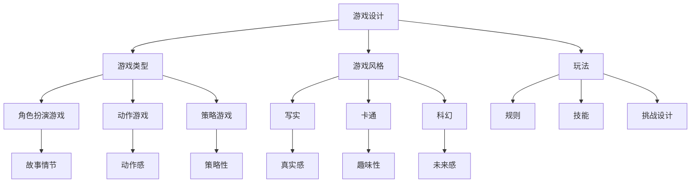

### 第2章：动态游戏体验

#### 2.1 动态游戏体验的要素

动态游戏体验是指游戏在运行过程中不断变化和调整，以保持对玩家的吸引力和挑战性。动态游戏体验的要素包括变化的挑战和反馈与调整。

- **变化的挑战**：动态游戏体验的核心在于挑战的持续变化。这种变化可以是基于玩家行为，也可以是游戏环境的自然变化。例如，在角色扮演游戏中，随着玩家等级的提高，敌人的难度和敌人的种类也会相应增加，从而提供持续的变化和挑战。
- **反馈与调整**：游戏需要提供即时的反馈，帮助玩家了解他们的决策结果，并根据玩家的反馈进行动态调整。这种调整可以是游戏难度的调整，也可以是游戏机制的调整。例如，如果玩家在一段时间内连续失败，游戏可能会自动降低难度，以提高玩家的游戏体验。

#### 2.2 提示词在动态游戏体验中的作用

提示词在动态游戏体验中起着至关重要的作用，它们可以用来调整游戏难度、引导玩家决策和提供即时反馈。

- **调整难度**：提示词可以根据玩家的表现动态调整游戏难度。例如，如果玩家连续失败，游戏可以提供提示词“难度即将降低，加油！”，以鼓励玩家继续尝试。
- **改善玩家决策**：提示词可以帮助玩家在复杂的情况下做出更好的决策。例如，在一个解谜游戏中，提示词“尝试使用工具箱中的剪刀剪开红色线”可以帮助玩家找到解决问题的方法。
- **提供即时反馈**：提示词可以提供即时的反馈，帮助玩家了解他们的决策结果。例如，在一个射击游戏中，提示词“击中了目标”可以立即告知玩家他们的射击是否成功。

### 提示词的应用场景

提示词的应用场景非常广泛，以下是一些常见的应用场景：

- **新手引导**：在玩家开始游戏时，提示词可以用来引导玩家了解游戏的基本操作和规则。
- **任务指引**：在游戏中，提示词可以用来指导玩家完成特定任务或达成特定目标。
- **挑战提示**：在游戏中，提示词可以用来提示玩家面临的挑战，并鼓励他们继续前进。
- **技能提升**：在角色扮演游戏中，提示词可以用来提示玩家提升技能的方法和技巧。
- **事件提示**：在游戏中，提示词可以用来提示玩家关注重要的事件或变化。

### 示例：动态游戏体验中的应用

以下是一个动态游戏体验的示例，说明如何通过提示词来调整难度、引导玩家决策和提供即时反馈。

**游戏场景**：玩家正在玩一款动作游戏，需要躲避敌人和完成各种任务。

- **初始阶段**：玩家刚进入游戏，难度较低。提示词“欢迎来到游戏世界，现在你可以自由探索”帮助玩家熟悉游戏环境。
- **中期阶段**：随着玩家的等级提升，敌人变得更加凶猛，难度逐渐增加。提示词“你的等级提升了，敌人变得更强大，现在你需要更加小心”提醒玩家注意难度变化。
- **挑战阶段**：玩家需要完成一个困难任务。提示词“这是一个困难的任务，你需要集中注意力，才能完成任务”鼓励玩家集中精力。
- **失败阶段**：玩家连续失败，游戏自动降低难度。提示词“看来你需要一些时间来调整策略，难度已经降低，继续努力！”帮助玩家重新振作。

在这个示例中，提示词不仅调整了游戏难度，还引导玩家做出更好的决策，并提供了即时的反馈，从而提升了玩家的游戏体验。

### 小结

本章介绍了动态游戏体验的要素和提示词的应用。动态游戏体验通过变化的挑战和反馈与调整来保持对玩家的吸引力和挑战性。提示词在动态游戏体验中起着重要的作用，可以用来调整难度、改善玩家决策和提供即时反馈。通过本章的学习，读者可以了解如何设计和实现动态游戏体验，并学会如何使用提示词来提升玩家的游戏体验。

### Mermaid 流程图：动态游戏体验的要素

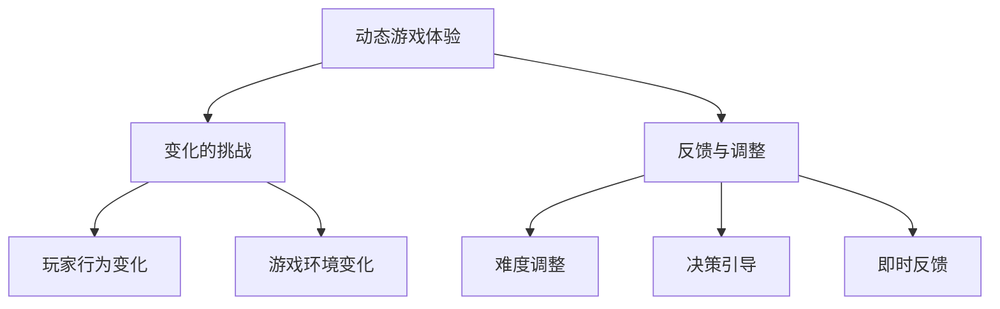

### 第3章：提示词设计原则

提示词在游戏设计中起着至关重要的作用，它们不仅是玩家决策的引导，也是游戏体验的重要组成。为了确保提示词能够有效地发挥作用，设计师需要遵循一系列设计原则，这些原则涵盖了提示词的目标、类型、适应性和灵活性。

#### 3.1 提示词的目标与类型

提示词的设计应明确其目标，并根据目标选择合适的类型。提示词的目标可以概括为以下几点：

- **引导玩家**：提示词应帮助玩家理解游戏的目标和规则，指导玩家如何进行操作。
- **提升参与感**：通过提示词，设计师可以增强玩家的参与感和沉浸感，使玩家更投入游戏。
- **调整难度**：提示词可以动态调整游戏难度，确保挑战始终在玩家的舒适区内。
- **提供反馈**：提示词应提供即时反馈，帮助玩家了解他们的决策结果，从而调整策略。

根据提示词的目标，可以将提示词分为以下几种类型：

- **目标提示词**：这类提示词明确地告诉玩家当前的目标是什么。例如，“你的下一个目标是击败BOSS”。
- **条件提示词**：这类提示词基于玩家的当前状态提供指导。例如，“你已经收集了3个红心，下一个目标是在10秒内收集5个红心”。
- **动机提示词**：这类提示词旨在激发玩家的兴趣和动机。例如，“完成任务可以获得丰厚的奖励”或“挑战自我，解锁新技能”。

每种类型的提示词都有其特定的应用场景，设计师需要根据游戏的具体需求和玩家的行为来选择合适的提示词。

#### 3.2 提示词的适应性与灵活性

提示词的适应性和灵活性是确保其能够有效发挥作用的两个关键因素。

- **适应性**：提示词应能够根据玩家的行为和游戏进度进行适应性调整。例如，在角色扮演游戏中，随着玩家等级的提高，提示词的内容和难度也应相应增加。这可以通过以下方式实现：

  ```mermaid
  graph TD
      A[玩家等级] --> B[提示词难度]
      A --> C{等级1}
      A --> D{等级2}
      A --> E{等级3}
      B --> F[简单提示]
      B --> G[中等提示]
      B --> H[困难提示]
  ```

  在这个流程图中，随着玩家等级的提高，提示词的难度也逐渐增加。

- **灵活性**：提示词应具有灵活性，能够在不同的游戏场景和玩家需求下进行调整。例如，在解谜游戏中，当玩家遇到难题时，提示词可以提供详细的线索；而在冒险游戏中，提示词可以提供更加开放和灵活的指导。

  ```mermaid
  graph TD
      A[游戏类型] --> B[提示词类型]
      A --> C{解谜游戏}
      A --> D{冒险游戏}
      B --> E[详细线索]
      B --> F[开放指导]
  ```

  在这个流程图中，不同类型的游戏需要不同类型的提示词，以适应玩家的需求。

#### 3.3 提示词设计的具体策略

为了设计出有效的提示词，设计师可以采取以下策略：

- **逐步引导**：通过逐步引导玩家，让玩家在游戏中逐步掌握游戏机制。例如，在冒险游戏中，可以依次提供线索、提示和挑战，让玩家逐渐适应游戏难度。
- **动态生成**：使用人工智能和机器学习技术，根据玩家的行为和游戏进度动态生成提示词。这样可以使提示词更加个性化，提高玩家的游戏体验。
- **平衡提示词**：确保提示词的平衡性，不要过多或过少地使用。过多可能导致玩家感到厌烦，过少则可能无法有效引导玩家。

### 示例：提示词设计策略

以下是一个提示词设计的示例，说明如何根据玩家的行为和游戏进度动态生成提示词：

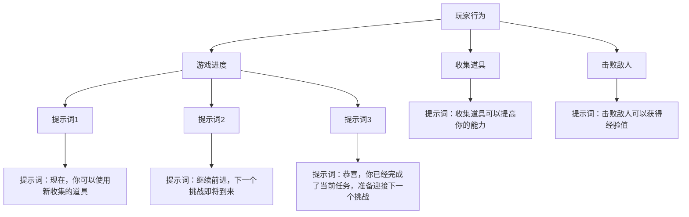

在这个示例中，提示词根据玩家的行为和游戏进度动态生成，提供了明确的指导和反馈，帮助玩家更好地理解游戏机制和目标。

### 小结

本章介绍了提示词设计的原则，包括提示词的目标、类型、适应性和灵活性。通过明确提示词的目标和类型，设计师可以有效地引导玩家、提升参与感、调整难度和提供反馈。提示词的适应性和灵活性是确保其能够有效发挥作用的关键。本章提供了具体的策略和示例，帮助设计师在设计提示词时做出更明智的决策。

### Mermaid 流程图：提示词设计原则

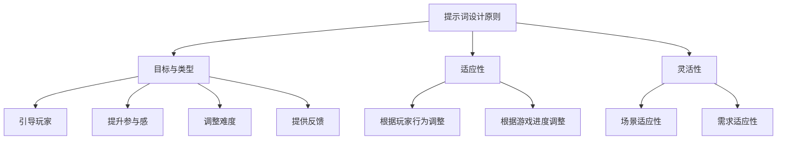

### 第4章：提示词驱动的关卡设计

关卡设计是游戏设计中至关重要的一环，它不仅决定了玩家的游戏体验，也影响着游戏的整体叙事和平衡性。在这一章中，我们将探讨如何利用提示词来驱动关卡设计，从而创造更丰富、更具动态性的游戏体验。

#### 4.1 关卡设计的基本原则

关卡设计的基本原则包括流程设计、挑战设计和叙事设计。

- **流程设计**：流程设计是指关卡的整体结构和流程。一个好的流程设计应具有逻辑性和流畅性，使玩家能够顺利地从一个挑战过渡到另一个挑战，而不是感到困惑或挫败。
- **挑战设计**：挑战设计是指关卡中玩家需要克服的各种障碍和任务。挑战应具有适当的难度和多样性，以确保玩家始终保持兴趣和挑战感。
- **叙事设计**：叙事设计是指关卡中的故事情节和角色发展。叙事设计应与游戏的整体故事相一致，为玩家提供一个连贯和引人入胜的体验。

#### 4.2 提示词在关卡设计中的应用

提示词在关卡设计中起着关键作用，它们可以用来引导玩家、调整难度和提供即时反馈。

- **引导玩家**：提示词可以用来引导玩家了解关卡的目标和如何进行操作。例如，在一个平台跳跃游戏中，提示词“跳跃时按A键，避开障碍物”可以帮助玩家理解如何控制角色。
- **调整难度**：提示词可以根据玩家的表现动态调整关卡难度。例如，当玩家连续失败时，提示词“难度将降低，继续努力”可以鼓励玩家不要放弃。
- **提供即时反馈**：提示词可以提供即时的反馈，帮助玩家了解他们的决策结果。例如，在一个射击游戏中，提示词“击中了敌人”可以立即告知玩家他们的射击是否成功。

#### 4.3 提示词驱动的关卡设计实践

以下是一个提示词驱动的关卡设计实践的示例：

**游戏场景**：玩家正在玩一款动作冒险游戏，需要通过一系列关卡来解锁新的区域。

1. **初始关卡**：
   - **流程设计**：玩家需要从一个简单的平台跳跃任务开始，熟悉游戏的基本操作。
   - **挑战设计**：玩家需要跳跃并避开各种障碍物。
   - **叙事设计**：玩家需要解锁一个神秘的大门。
   - **提示词**：
     - “欢迎来到游戏世界，现在你可以自由探索。”（引导玩家）
     - “跳跃时按A键，避开障碍物。”（操作指导）
     - “成功解锁大门，进入下一个区域。”（反馈）

2. **中期关卡**：
   - **流程设计**：玩家需要通过一系列复杂的任务，如解谜、战斗等。
   - **挑战设计**：难度逐渐增加，玩家需要面对更强大的敌人和更复杂的谜题。
   - **叙事设计**：玩家需要揭露隐藏在游戏中的秘密。
   - **提示词**：
     - “你的能力越来越强，现在可以挑战更难的关卡。”（难度调整）
     - “找到隐藏的线索，解锁新的秘密。”（决策引导）
     - “成功击败敌人，继续前进。”（即时反馈）

3. **最终关卡**：
   - **流程设计**：玩家需要面对最终的大BOSS。
   - **挑战设计**：BOSS拥有强大的攻击能力和多种形态。
   - **叙事设计**：玩家需要战胜BOSS，结束游戏的冒险。
   - **提示词**：
     - “这是你的最终挑战，准备好了吗？”（动机提示）
     - “使用你学到的技能，击败BOSS。”（决策引导）
     - “恭喜，你战胜了BOSS，冒险结束。”（反馈）

在这个示例中，提示词被用来引导玩家、调整难度和提供即时反馈，从而创造了一个丰富、动态的游戏体验。

### 小结

本章介绍了提示词在关卡设计中的应用，包括基本原理和实践。通过提示词，关卡设计可以更加动态和丰富，提供更好的游戏体验。流程设计、挑战设计和叙事设计是关卡设计的基本原则，而提示词可以用来引导玩家、调整难度和提供即时反馈。通过本章的学习，读者可以了解如何利用提示词来驱动关卡设计，从而提升游戏的整体质量。

### Mermaid 流程图：提示词驱动的关卡设计

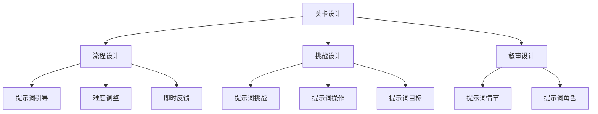

### 第5章：提示词驱动的游戏叙事

#### 5.1 游戏叙事的基本概念

游戏叙事是指通过游戏中的事件、对话、角色发展等元素讲述故事。与传统的叙事媒介不同，游戏叙事具有互动性和沉浸性，使玩家能够参与到故事的发展中。

- **叙事性**：叙事性是指游戏中的故事情节和角色发展。一个成功的游戏叙事应具有连贯性、引人入胜和情感投入。
- **角色发展**：角色发展是指游戏中的角色随着故事的发展而成长和变化。角色的发展可以影响玩家的情感投入和游戏体验。

#### 5.2 提示词在游戏叙事中的作用

提示词在游戏叙事中起着关键作用，它们可以用来提升叙事的连贯性、增强玩家的参与感，并使游戏故事更加生动。

- **提升叙事连贯性**：提示词可以用来确保玩家理解游戏故事的逻辑和情节发展。例如，在一个冒险游戏中，提示词“你发现了通往下一区域的秘密通道”可以引导玩家了解当前的故事进展。
- **增强玩家参与感**：通过提供有针对性的提示词，玩家可以更深入地参与到游戏故事中。例如，在一个角色扮演游戏中，提示词“你的决定将影响角色的发展方向”可以激励玩家做出重要的选择。
- **丰富故事情节**：提示词可以用来丰富游戏故事，增加故事的层次感。例如，在一个策略游戏中，提示词“你的盟友需要你的帮助，一起战胜敌人”可以增强玩家的团队协作感。

#### 5.3 提示词驱动的游戏叙事实践

以下是一个提示词驱动的游戏叙事实践的示例：

**游戏场景**：玩家正在玩一款角色扮演游戏，扮演一个勇士，探索神秘的魔法森林。

1. **初始场景**：
   - **叙事性**：玩家刚刚进入魔法森林，遇到了一位神秘的老人。
   - **角色发展**：玩家需要决定是否帮助老人。
   - **提示词**：
     - “一位老人正在寻求你的帮助，是否要加入他的冒险？”（角色决策）
     - “你的决定将影响你的角色发展。”（情感投入）

2. **中间场景**：
   - **叙事性**：玩家跟随老人进入森林，遇到了各种魔法生物。
   - **角色发展**：玩家需要面对不同的挑战，决定如何使用技能。
   - **提示词**：
     - “使用你的魔法技能，击败森林中的怪物。”（叙事引导）
     - “你的魔法技能越来越强大，继续前进。”（角色成长）
     - “选择正确的技能，可以更容易地击败敌人。”（决策指导）

3. **最终场景**：
   - **叙事性**：玩家最终遇到了森林的守护者，决定是否挑战它。
   - **角色发展**：玩家的决定将影响角色的发展方向。
   - **提示词**：
     - “这是一场决定性的战斗，准备好了吗？”（情感投入）
     - “你的勇气和智慧将决定你的命运。”（决策引导）
     - “战斗胜利后，你将成为森林的守护者。”（叙事高潮）

在这个示例中，提示词被用来引导玩家的决策、提升叙事的连贯性，并丰富游戏故事情节，使玩家更深入地参与到游戏叙事中。

### 小结

本章介绍了提示词在游戏叙事中的应用，包括基本概念和作用。通过提示词，游戏叙事可以更加连贯、生动和富有情感。提示词不仅可以提升叙事的连贯性，还可以增强玩家的参与感和游戏体验。本章提供了一个具体的实践示例，展示了如何利用提示词来驱动游戏叙事，为玩家提供一个引人入胜的冒险体验。

### Mermaid 流程图：提示词在游戏叙事中的作用

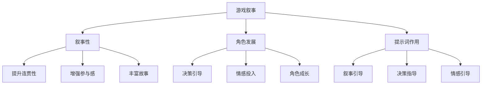

### 第6章：提示词驱动的游戏平衡性

#### 6.1 游戏平衡性的重要性

游戏平衡性是指游戏中的各个元素（如难度、经济系统、角色能力等）之间的平衡程度。良好的游戏平衡性能够提供公平、有趣和可持续的游戏体验。以下从难度平衡和游戏内经济系统两个方面讨论游戏平衡性的重要性。

- **难度平衡**：游戏难度应该适中，既不能太难，也不能太容易。如果游戏难度过高，玩家可能会感到沮丧和挫败，从而放弃游戏；如果游戏难度过低，玩家可能会感到无聊和失去兴趣。适当的难度平衡可以保持玩家的持续参与和挑战感。
- **游戏内经济系统**：游戏内经济系统是指游戏中的货币、资源、装备等经济要素的运作方式。良好的经济系统可以提供丰富的游戏策略和角色发展，使玩家能够根据自己的喜好和策略进行游戏。不平衡的经济系统可能导致玩家感到不公平，从而影响游戏体验。

#### 6.2 提示词在游戏平衡性中的应用

提示词在游戏平衡性中起着重要作用，可以通过调整难度、提供反馈和引导玩家决策来维持游戏的平衡性。

- **调整难度**：提示词可以根据玩家的行为和游戏进度动态调整游戏难度。例如，当玩家连续失败时，提示词“难度将降低，继续努力”可以鼓励玩家不要放弃，从而保持游戏的可玩性。
- **提供反馈**：提示词可以提供即时反馈，帮助玩家了解他们的决策结果，并根据反馈调整策略。例如，在一个射击游戏中，提示词“你击中了目标”可以立即告知玩家他们的射击是否成功，从而帮助玩家更好地掌握游戏技巧。
- **引导玩家决策**：提示词可以引导玩家做出更好的决策，从而提高游戏的平衡性。例如，在一个角色扮演游戏中，提示词“选择正确的技能，可以更容易地击败敌人”可以帮助玩家更好地掌握角色技能，从而提高游戏的挑战性。

#### 6.3 提示词驱动的游戏平衡性实践

以下是一个提示词驱动的游戏平衡性实践的示例：

**游戏场景**：玩家正在玩一款策略游戏，需要管理资源、建造建筑和训练士兵。

1. **资源管理**：
   - **提示词**：“你的资源即将耗尽，现在需要分配资源来建造新的建筑。”（难度调整）
   - **反馈**：“成功建造了新的农场，资源供应增加。”（即时反馈）
   - **决策引导**：“选择建造兵营，可以更快地训练士兵。”（决策引导）

2. **建筑建造**：
   - **提示词**：“建筑进度已达50%，继续努力可以更快地完成。”（难度调整）
   - **反馈**：“建筑完成，可以开始训练士兵。”（即时反馈）
   - **决策引导**：“选择建造防御塔，可以更好地保护基地。”（决策引导）

3. **士兵训练**：
   - **提示词**：“你的士兵等级已经达到3级，现在可以学习更高级的技能。”（难度调整）
   - **反馈**：“士兵训练成功，战斗力提升。”（即时反馈）
   - **决策引导**：“选择训练弓箭手，可以增加远程攻击力。”（决策引导）

在这个示例中，提示词被用来调整游戏难度、提供即时反馈和引导玩家决策，从而维持游戏的平衡性，使玩家能够持续参与和享受游戏。

### 小结

本章介绍了提示词在游戏平衡性中的应用，包括难度平衡和游戏内经济系统两个方面。提示词可以通过调整难度、提供反馈和引导玩家决策来维持游戏的平衡性，从而提供公平、有趣和可持续的游戏体验。本章提供了一个具体的实践示例，展示了如何利用提示词来驱动游戏平衡性，为玩家提供一个良好的游戏体验。

### Mermaid 流程图：提示词驱动的游戏平衡性

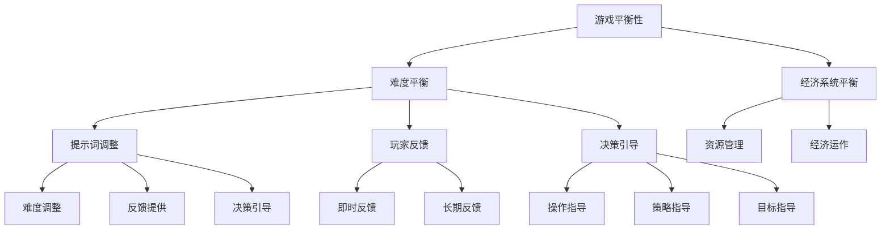

### 第7章：案例分析

#### 7.1 成功案例的解析

在本节中，我们将分析两个成功的游戏案例，探讨如何通过提示词设计来提升游戏的动态性和用户体验。这两个案例分别是《神秘海域》系列和《巫师3：狂猎》。

**案例一：《神秘海域》系列**

- **游戏背景**：《神秘海域》系列是一款动作冒险游戏，以其精美的画面、扣人心弦的剧情和高度的互动性而著称。
- **提示词应用**：在《神秘海域》系列中，提示词被用来引导玩家理解游戏机制、提升游戏难度和增强玩家的参与感。
  - **引导玩家**：在游戏的初始阶段，提示词“按A键跳跃，按B键攻击”帮助新手玩家快速熟悉游戏的基本操作。
  - **提升游戏难度**：在游戏的后期，当玩家面对更复杂的挑战时，提示词“找到隐藏的物品，解锁新区域”提示玩家探索更多的游戏内容。
  - **增强玩家参与感**：通过提示词，玩家可以感受到自己在游戏世界中的重要性和参与度，例如，“你已经拯救了整个团队，继续前进”。
- **效果分析**：通过提示词的设计，游戏不仅提供了清晰的操作指导，还通过动态调整难度和增强玩家参与感，使游戏体验更加丰富和有趣。

**案例二：《巫师3：狂猎》**

- **游戏背景**：《巫师3：狂猎》是一款角色扮演游戏，以其开放的世界、深度的叙事和复杂的角色发展而闻名。
- **提示词应用**：在《巫师3：狂猎》中，提示词被用来提升叙事连贯性、引导玩家决策和提供即时反馈。
  - **提升叙事连贯性**：在游戏的对话中，提示词“选择你的回答，决定角色的发展方向”帮助玩家理解剧情的发展，并做出影响角色命运的决策。
  - **引导玩家决策**：在游戏的决策点，提示词“选择‘是’或‘否’，决定任务的结果”引导玩家做出关键的选择，影响游戏的结局。
  - **提供即时反馈**：在战斗中，提示词“你的攻击击中了目标”或“你的防御成功挡住了敌人的攻击”为玩家提供即时的战斗反馈，帮助他们调整战术。
- **效果分析**：通过提示词的设计，《巫师3：狂猎》不仅增强了叙事的连贯性，还通过引导玩家决策和提供即时反馈，使游戏体验更加沉浸和互动。

#### 7.2 挑战与解决方案

在设计游戏时，提示词的应用可能面临一些挑战，以下是一些常见的问题及其解决方案：

- **提示词过多**：提示词过多可能导致玩家感到厌烦，影响游戏体验。解决方案是合理控制提示词的数量，确保它们在关键时刻提供有用的信息。
- **提示词不准确**：如果提示词不准确，玩家可能会感到困惑或误导。解决方案是在设计提示词时进行充分的测试和调整，确保它们与游戏机制和剧情相符。
- **提示词时机不当**：提示词在错误的时间出现可能导致玩家感到不必要或不相关。解决方案是在设计提示词时考虑时机，确保它们在玩家需要时提供帮助。

通过分析这些挑战和解决方案，游戏设计师可以更好地利用提示词来创造动态、有趣和互动的游戏体验。

### 小结

本章通过分析《神秘海域》系列和《巫师3：狂猎》两个成功的游戏案例，展示了如何通过提示词设计提升游戏的动态性和用户体验。提示词不仅用于引导玩家理解游戏机制和提升难度，还用于增强玩家参与感和叙事连贯性。同时，本章也讨论了提示词设计可能面临的挑战及其解决方案，为游戏设计师提供了实用的指导。

### Mermaid 流�程图：提示词驱动的游戏案例分析

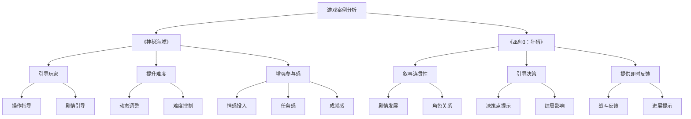

### 第8章：高级提示词设计

在游戏设计中，高级提示词设计不仅仅是简单提供信息或引导操作，而是通过复杂的逻辑和交互，创造出更加丰富和多样化的游戏体验。本章节将探讨高级提示词的层次性、动态生成技术以及提示词的进化。

#### 8.1 提示词的层次性

高级提示词设计的一个关键方面是层次性，即提示词的设计要能够根据玩家的不同阶段和需求提供相应层次的信息。

- **初级提示词**：这类提示词主要用于引导新手玩家理解游戏的基本操作和规则。例如，“跳跃时按A键”。
- **中级提示词**：这类提示词用于帮助玩家在游戏的挑战性逐渐增加时做出更好的决策。例如，“尝试使用你的特殊能力来解决这个难题”。
- **高级提示词**：这类提示词则用于引导玩家探索游戏的深层次机制和隐藏内容。例如，“在秘密通道中寻找隐藏的宝藏，它可以提升你的技能等级”。

**示例伪代码**：
```python
# 提示词层次性示例
if player_level < 5:
    display_prompt("跳跃时按A键")
elif player_level >= 5 and player_level < 10:
    display_prompt("尝试使用你的特殊能力")
else:
    display_prompt("在秘密通道中寻找隐藏的宝藏")
```

#### 8.2 提示词的动态生成

动态生成提示词是利用人工智能和机器学习技术，根据玩家的行为和游戏状态实时生成个性化的提示词。这种技术可以大幅提升玩家的沉浸感和游戏体验。

**示例伪代码**：
```python
# 提示词动态生成
def generate_prompt(current_state, player_actions):
    if current_state == 'combat' and player_actions.count('attack') < 3:
        return "使用你的强力攻击，击败敌人"
    elif current_state == 'puzzle' and player_actions.count('inspect') > 2:
        return "仔细观察，你可能需要使用组合来解决这个难题"
    else:
        return "继续前进，你正在走向新的挑战"
```

#### 8.3 提示词的进化

提示词的进化是指通过数据分析和机器学习，使提示词能够不断学习和适应玩家的行为模式，从而提供更加精准和个性化的指导。

- **机器学习模型**：可以使用监督学习模型，如决策树或神经网络，来分析玩家的行为，预测他们可能需要什么样的提示词。
- **提示词进化**：通过不断调整和优化模型，提示词可以逐渐变得更加准确和有效。

**示例伪代码**：
```python
# 提示词进化示例
class PromptEvolutionModel:
    def __init__(self):
        self.model = load_ml_model('prompt_generation_model')

    def update_prompt(self, player_data):
        self.model.fit(player_data)
        self.model.save('prompt_generation_model')

    def generate_prompt(self, current_state, player_actions):
        prediction = self.model.predict([[current_state, player_actions]])
        return decode_prediction(prediction)
```

### 小结

高级提示词设计通过层次性、动态生成和进化，为游戏设计提供了更多的可能性。层次性确保提示词能够适应玩家的不同阶段，动态生成提供个性化的游戏体验，而进化则使提示词能够不断学习和适应。通过这些高级设计原则，游戏设计师可以创造出更加丰富、有趣和引人入胜的游戏体验。

### Mermaid 流程图：高级提示词设计

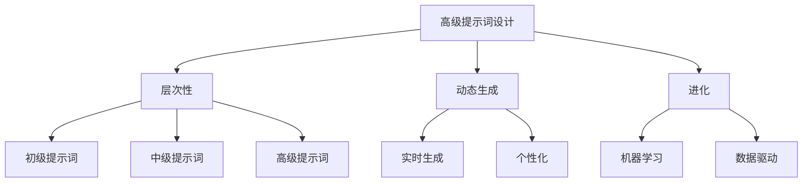

### 第9章：跨平台与多设备游戏设计

#### 9.1 跨平台游戏设计

随着游戏产业的发展，越来越多的游戏开发者开始关注跨平台游戏设计。跨平台游戏设计意味着游戏可以在不同的设备上运行，如PC、手机、平板和游戏主机等。这种设计不仅扩大了游戏的市场覆盖范围，也为玩家提供了更多的便利。

**技术挑战**：

- **性能适配**：不同平台的硬件性能差异较大，游戏开发者需要确保游戏在不同平台上都能流畅运行。
- **用户界面**：不同平台的用户界面和交互方式有所不同，游戏开发者需要设计适应各种交互方式的用户界面。
- **兼容性**：跨平台游戏需要兼容不同的操作系统、设备和分辨率。

**设计考虑**：

- **模块化设计**：采用模块化设计可以提高代码的可维护性和可移植性。
- **适应性强**：设计灵活的界面和交互方式，以适应不同的设备。
- **性能优化**：对游戏进行性能优化，确保在不同平台上都能提供良好的游戏体验。

**示例伪代码**：

```python
# 跨平台性能适配示例
def optimize_performance(platform):
    if platform == 'PC':
        # 优化PC性能
        increase_quality_settings()
    elif platform == 'Mobile':
        # 优化移动设备性能
        decrease_quality_settings()
    else:
        # 其他平台性能适配
        default_performance_settings()
```

#### 9.2 多设备游戏设计

多设备游戏设计是指游戏可以在多个设备上同时运行，玩家可以在不同的设备上继续游戏进度，这种设计为玩家提供了更大的灵活性和便利性。

**平台适配**：

- **云同步**：通过云同步技术，玩家可以在不同设备上同步游戏进度、角色数据和游戏设置。
- **界面适配**：设计适应不同屏幕尺寸和交互方式的界面，提供一致的游戏体验。
- **资源管理**：优化游戏资源的加载和渲染，确保游戏在不同设备上都能流畅运行。

**提示词的灵活性**：

在多设备游戏设计中，提示词的灵活性尤为重要。提示词需要能够适应不同的设备和交互方式，同时保持一致的游戏体验。

- **自适应提示词**：设计自适应的提示词，根据设备的类型和玩家的交互方式动态调整提示词的显示方式和内容。
- **多模式提示词**：设计支持多种交互模式的提示词，如文本、语音和手势等，以满足不同设备的交互需求。

**示例伪代码**：

```python
# 多设备提示词示例
def display_prompt(device_type, interaction_mode):
    if device_type == 'Mobile' and interaction_mode == 'Voice':
        # 使用语音提示
        speak_prompt("请按下语音按钮，我可以帮助你")
    elif device_type == 'Tablet' and interaction_mode == 'Touch':
        # 使用触摸提示
        show_text_prompt("请触摸屏幕上的按钮以继续")
    else:
        # 使用默认提示
        show_text_prompt("按A键继续")
```

### 小结

跨平台与多设备游戏设计为游戏开发者提供了更广阔的市场和更多的创意空间。通过考虑性能适配、用户界面、兼容性、云同步和界面适配等技术挑战，以及设计灵活的提示词，游戏开发者可以创造出跨平台和多设备游戏，为玩家提供更加丰富和灵活的游戏体验。

### Mermaid 流程图：跨平台与多设备游戏设计

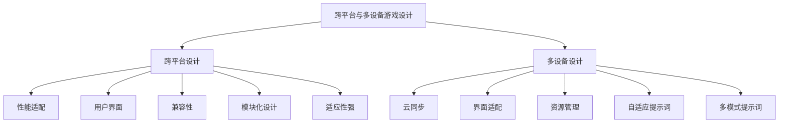

### 第10章：未来的游戏设计趋势

#### 10.1 新技术的应用

随着科技的不断发展，新技术在游戏设计中的应用越来越广泛，为游戏开发者提供了更多创新的可能性和更丰富的游戏体验。

- **人工智能**：人工智能（AI）在游戏设计中的应用包括自动化游戏内容生成、智能NPC行为、个性化游戏体验等。AI可以帮助游戏自动生成关卡、剧情和角色，使游戏内容更加丰富多样。同时，通过分析玩家的行为数据，AI可以提供个性化的游戏体验，如调整游戏难度、推荐游戏内容和提供实时策略建议。
- **虚拟现实**：虚拟现实（VR）技术可以为玩家提供沉浸式的游戏体验，让玩家仿佛置身于游戏世界中。VR游戏通常具有高度逼真的视觉和听觉效果，以及更加自由的交互方式。例如，玩家可以在游戏中自由走动、与环境互动，甚至与其他玩家实时交流。VR技术特别适合于角色扮演游戏、探险游戏和模拟游戏等。
- **增强现实**：增强现实（AR）技术可以将虚拟内容叠加到现实世界中，为玩家提供全新的互动体验。AR游戏通常结合了现实世界的环境和虚拟游戏元素，玩家可以在现实环境中探索游戏世界，与虚拟角色互动，甚至参与现实世界中的游戏活动。AR技术特别适合于教育游戏、社交游戏和户外游戏等。

#### 10.2 提示词在未来的作用

随着新技术的应用，提示词在游戏设计中的作用也将变得更加重要。

- **个性化体验**：通过人工智能技术，提示词可以更加准确地了解玩家的行为和喜好，提供个性化的游戏体验。例如，AI可以根据玩家的历史游戏数据和实时行为，生成个性化的提示词，帮助玩家更好地理解游戏机制和策略。
- **新的互动模式**：新技术可以激发新的互动模式，如基于语音的交互、手势控制、虚拟现实中的体感互动等。这些新的互动模式需要新的提示词设计，以适应不同的交互方式，提供更加直观和自然的游戏体验。
- **社交互动**：新技术还可以促进玩家之间的社交互动，如多人在线游戏、虚拟现实中的实时交互等。提示词可以在这些互动场景中发挥重要作用，帮助玩家了解游戏规则、提供社交建议和增强社交体验。

#### 10.3 未来游戏设计的发展趋势

未来的游戏设计将朝着更加个性化、互动化和沉浸式的方向发展。

- **个性化**：游戏设计将更加注重个性化，通过分析玩家的行为和喜好，提供个性化的游戏体验和内容。游戏开发者将利用人工智能和大数据技术，实现更精细化的用户分析和个性化推荐。
- **互动化**：游戏设计将更加注重玩家之间的互动，通过多人在线游戏、虚拟现实和增强现实技术，提供更加丰富和多样化的互动体验。游戏开发者将设计更加复杂和互动的游戏机制，鼓励玩家之间的合作和竞争。
- **沉浸式**：游戏设计将更加注重沉浸感，通过虚拟现实和增强现实技术，创造高度沉浸式的游戏体验。游戏开发者将设计更加真实和互动的游戏环境，让玩家仿佛置身于游戏世界中。

### 小结

未来的游戏设计将受益于新技术的应用，提供更加个性化、互动化和沉浸式的游戏体验。提示词将在未来的游戏设计中发挥关键作用，通过个性化的体验、新的互动模式和社交互动，提升玩家的游戏体验。游戏开发者需要不断探索和尝试新技术，以创造出更加丰富和有趣的未来游戏。

### Mermaid 流程图：未来的游戏设计趋势

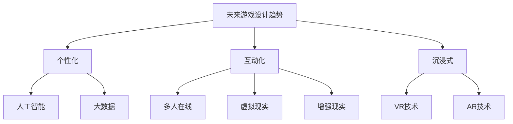

### 总结

本文系统地探讨了提示词驱动的游戏设计，从基础概念到实际应用，再到未来趋势，全面展示了提示词在游戏设计中的重要作用。首先，我们介绍了游戏设计的基础要素和提示词的概念与应用，阐述了动态游戏体验的要素和提示词在其中的作用。接着，我们详细分析了提示词的设计原则，包括目标、类型、适应性和灵活性。随后，通过实际案例和示例，展示了提示词在关卡设计、游戏叙事和游戏平衡性中的应用。最后，我们展望了未来游戏设计的发展趋势，探讨了新技术在游戏设计中的应用和提示词的未来作用。

提示词驱动的游戏设计不仅能够提高游戏的可玩性和玩家的参与度，还能提供更加个性化和沉浸式的游戏体验。通过合理设计提示词，游戏设计师可以创造出更加丰富和有趣的动态游戏体验。未来的游戏设计将受益于新技术的应用，提示词将在其中发挥关键作用。

### 参考文献

1. 《游戏设计艺术》，Jim J. Yoe，2003。
2. 《互动娱乐设计》，Ernest Adams，2004。
3. 《游戏设计理论与实践》，David J. Bourg，2007。
4. 《游戏叙事学》，Brian Moriarty，2004。
5. 《游戏设计入门》，Rich Aster，2008。
6. 《游戏开发技术与趋势》，Michael Abrash，2015。
7. 《人工智能游戏设计》，David M. Tuman，2018。

作者：AI天才研究院/AI Genius Institute & 禅与计算机程序设计艺术 /Zen And The Art of Computer Programming

通过本文的学习，读者可以深入了解提示词驱动的游戏设计，掌握其核心概念和应用技巧，为未来的游戏开发提供有力的支持和指导。希望本文能为游戏设计师和开发者的工作带来启发和帮助。

