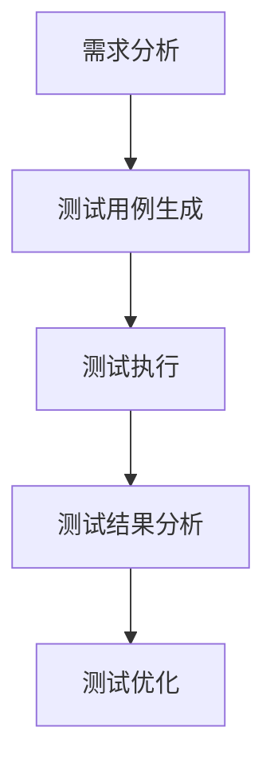

                 

### 第1章 引言

自动化测试与AI的关系

在当今快速发展的信息技术时代，人工智能（AI）已经逐渐成为推动自动化测试发展的关键力量。自动化测试是一种利用软件工具自动执行测试流程的方法，目的是提高测试效率、减少人为错误和确保软件质量。随着AI技术的不断进步，自动化测试迎来了新的发展机遇。

AI在自动化测试中的角色

AI在自动化测试中扮演着至关重要的角色，主要体现在以下几个方面：

1. **测试用例生成**：AI可以通过学习历史测试数据，自动生成新的测试用例，从而减少手动编写测试用例的工作量。

2. **测试执行**：AI可以自动化执行测试用例，识别和报告缺陷，提高测试效率。

3. **测试结果分析**：AI可以对测试结果进行分析，识别潜在的缺陷模式，为改进测试流程提供指导。

4. **测试优化**：AI可以通过分析测试数据，优化测试用例的选择和执行策略，提高测试质量。

提示词驱动的自动化测试优势

提示词驱动的自动化测试是一种基于自然语言处理（NLP）技术的自动化测试方法。它通过输入提示词来指导自动化测试工具执行特定的测试任务，具有以下优势：

1. **提高测试效率**：提示词驱动的自动化测试可以自动化生成测试用例，减少手动编写测试用例的工作量。

2. **增强测试覆盖**：提示词驱动的自动化测试可以根据不同的提示词生成多种测试用例，提高测试覆盖率。

3. **降低测试成本**：通过自动化测试，可以减少测试人员的工作量，从而降低测试成本。

4. **易于维护**：提示词驱动的自动化测试框架具有良好的扩展性和可维护性，便于后续的测试维护和优化。

书籍概述与目标读者

本书旨在全面介绍提示词驱动的自动化测试方法及其在AI质量保证中的应用。通过本书，读者可以了解：

1. 自动化测试的基本概念和流程。

2. 提示词驱动的自动化测试原理和框架。

3. AI在自动化测试中的应用和挑战。

4. 提示词驱动的自动化测试策略和实践。

本书适合以下读者群体：

1. 软件测试工程师和自动化测试工程师。

2. AI领域的研究人员和工程师。

3. 对自动化测试和AI技术有兴趣的IT从业人员。

### 第2章 自动化测试基础

#### 2.1 自动化测试的概念与分类

**自动化测试的概念**

自动化测试是指使用专门的软件工具自动执行测试流程，以发现软件中的缺陷。它通过编写脚本或使用现成的测试工具，对软件进行一系列预定的测试操作，以验证软件的功能、性能和安全性。

**自动化测试的分类**

自动化测试可以根据不同的分类标准进行分类，以下是几种常见的分类方法：

1. **按照测试层次分类**

   - **单元测试**：对软件模块进行测试，通常由开发人员编写。

   - **集成测试**：对多个模块集成后的系统进行测试，通常由测试团队执行。

   - **系统测试**：对完整的系统进行测试，确保系统满足设计要求。

   - **验收测试**：在软件交付前进行，确保软件满足用户需求。

2. **按照测试目标分类**

   - **功能测试**：验证软件的功能是否按照预期工作。

   - **性能测试**：评估软件在特定条件下的性能表现。

   - **安全测试**：检测软件的安全漏洞和潜在威胁。

   - **兼容性测试**：确保软件在不同操作系统、浏览器、设备上运行正常。

3. **按照测试执行方式分类**

   - **手动测试**：通过人工执行测试用例，通常用于验证新功能的正确性。

   - **自动化测试**：通过脚本或测试工具自动执行测试用例，提高测试效率和覆盖率。

**自动化测试的优势与挑战**

**优势**

1. **提高测试效率**：自动化测试可以节省大量时间和人力成本，提高测试速度。

2. **减少人为错误**：自动化测试减少了人为干预，降低了测试过程中的错误率。

3. **增强测试覆盖**：自动化测试可以执行大量的测试用例，提高测试覆盖率。

4. **易于维护**：自动化测试脚本可以方便地更新和修改，提高测试的可持续性。

**挑战**

1. **初始成本较高**：自动化测试需要投入一定的开发资源和时间，初期成本较高。

2. **维护难度大**：自动化测试脚本需要不断更新和优化，维护难度较大。

3. **测试脚本的质量**：测试脚本的编写质量直接影响测试结果，编写高质量的测试脚本需要专业知识和经验。

**自动化测试流程**

自动化测试通常包括以下步骤：

1. **需求分析**：分析软件需求，确定测试目标。

2. **测试用例设计**：编写详细的测试用例，包括测试输入、预期结果和测试步骤。

3. **测试环境搭建**：准备测试环境，包括软件、硬件和网络等。

4. **测试脚本编写**：编写测试脚本，实现测试用例的自动化执行。

5. **测试执行**：执行自动化测试脚本，收集测试结果。

6. **测试结果分析**：分析测试结果，报告缺陷。

7. **测试维护**：更新测试脚本，优化测试流程。

#### 2.2 自动化测试的优势与挑战

**优势**

1. **提高测试效率**：自动化测试可以节省大量时间和人力成本，提高测试速度。通过自动化测试，测试人员可以专注于分析和解决缺陷，而无需重复手动执行测试用例。

2. **减少人为错误**：自动化测试减少了人为干预，降低了测试过程中的错误率。手动测试容易受到人的主观因素影响，而自动化测试脚本可以严格按照预定的测试步骤执行，确保测试结果的准确性。

3. **增强测试覆盖**：自动化测试可以执行大量的测试用例，提高测试覆盖率。特别是在复杂的软件系统中，自动化测试可以更全面地覆盖不同功能场景和边界情况，确保软件质量。

4. **易于维护**：自动化测试脚本可以方便地更新和修改，提高测试的可持续性。随着软件的不断迭代和更新，自动化测试脚本可以根据需求进行相应的调整，确保测试流程的持续有效。

**挑战**

1. **初始成本较高**：自动化测试需要投入一定的开发资源和时间，初期成本较高。自动化测试涉及到测试工具的选择、脚本的开发和测试环境的搭建等，需要一定的时间和资金投入。

2. **维护难度大**：自动化测试脚本需要不断更新和优化，维护难度较大。软件的不断迭代会导致测试用例的变化，自动化测试脚本也需要进行相应的调整，确保测试流程的持续有效。

3. **测试脚本的质量**：测试脚本的编写质量直接影响测试结果，编写高质量的测试脚本需要专业知识和经验。自动化测试脚本需要考虑到各种边界情况和异常情况，确保测试的全面性和准确性。

#### 2.3 自动化测试流程

**需求分析**

需求分析是自动化测试的基础，通过对软件需求的深入理解，确定测试目标。在这一阶段，测试团队需要与项目相关人员紧密合作，了解软件的功能需求、性能需求和安全性需求等，确保测试目标明确、全面。

**测试用例设计**

测试用例设计是自动化测试的核心环节，需要编写详细的测试用例，包括测试输入、预期结果和测试步骤。测试用例的设计要考虑功能覆盖、边界条件和异常情况，确保测试用例的全面性和有效性。

**测试环境搭建**

测试环境搭建是自动化测试的关键，需要准备测试环境，包括软件、硬件和网络等。测试环境的搭建要符合软件的运行要求，确保测试过程的稳定性和可重复性。

**测试脚本编写**

测试脚本编写是将测试用例自动化执行的关键，需要根据测试用例的描述，编写相应的测试脚本。测试脚本可以使用各种编程语言和测试工具编写，确保测试用例的自动化执行。

**测试执行**

测试执行是自动化测试的核心环节，需要执行自动化测试脚本，收集测试结果。测试执行的过程要严格按照测试用例的步骤进行，确保测试过程的规范性和一致性。

**测试结果分析**

测试结果分析是自动化测试的重要环节，需要对测试结果进行分析，报告缺陷。测试结果分析要结合测试用例的预期结果，识别出软件中的缺陷，为后续的修复提供依据。

**测试维护**

测试维护是自动化测试的持续过程，需要更新测试脚本，优化测试流程。随着软件的不断迭代和更新，测试脚本也需要进行相应的调整，确保测试流程的持续有效。

### 第3章 提示词驱动测试框架

#### 3.1 提示词驱动测试原理

**提示词驱动测试的概念**

提示词驱动测试是一种基于自然语言处理的自动化测试方法，通过输入提示词来指导测试工具执行特定的测试任务。提示词通常是由测试人员或AI模型生成的，用于描述测试任务、测试数据和测试结果。

**提示词驱动测试的工作机制**

1. **提示词生成**：测试人员或AI模型根据测试需求生成提示词，提示词可以是具体的测试任务描述、数据输入或输出结果。

2. **测试工具执行**：测试工具根据提示词执行相应的测试任务，包括测试用例的生成、测试数据的处理和测试结果的报告。

3. **测试结果反馈**：测试工具将测试结果反馈给测试人员或AI模型，测试人员或AI模型根据测试结果对测试过程进行调整和优化。

**提示词驱动的自动化测试优势**

1. **提高测试效率**：提示词驱动测试可以自动化生成测试用例，减少手动编写测试用例的工作量，提高测试效率。

2. **增强测试覆盖**：提示词驱动测试可以根据不同的提示词生成多种测试用例，提高测试覆盖率，确保测试的全面性。

3. **降低测试成本**：通过自动化测试，可以减少测试人员的工作量，降低测试成本。

4. **易于维护**：提示词驱动测试框架具有良好的扩展性和可维护性，便于后续的测试维护和优化。

#### 3.2 主流提示词驱动测试框架介绍

**Selenium**

Selenium是一种开源的自动化测试工具，支持多种编程语言和浏览器。Selenium通过Webdriver API与浏览器进行交互，实现自动化测试。Selenium的特点包括：

- **跨平台支持**：Selenium支持Windows、Linux和Mac等操作系统，可以兼容多种浏览器，如Chrome、Firefox、Safari等。

- **脚本语言支持**：Selenium支持多种编程语言，如Java、Python、C#等，便于开发人员编写测试脚本。

- **丰富的API**：Selenium提供丰富的API，可以实现各种Web元素的操作，如点击、输入、获取属性等。

**Appium**

Appium是一种开源的移动应用自动化测试工具，支持iOS和Android平台。Appium通过模拟用户操作实现自动化测试，具有以下特点：

- **跨平台支持**：Appium支持iOS和Android平台，可以兼容多种操作系统和设备。

- **支持原生应用和Web应用**：Appium可以同时测试原生应用和Web应用，提高测试覆盖率。

- **脚本语言支持**：Appium支持多种编程语言，如Java、Python、C#等，便于开发人员编写测试脚本。

**TestCafe**

TestCafe是一种开源的端到端自动化测试工具，支持多种浏览器和操作系统。TestCafe通过简单直观的API实现自动化测试，具有以下特点：

- **跨平台支持**：TestCafe支持多种浏览器和操作系统，可以兼容多种设备。

- **简单易用**：TestCafe提供简单直观的API，便于开发人员编写测试脚本。

- **集成了断言和调试功能**：TestCafe集成了断言和调试功能，便于开发人员定位和解决缺陷。

#### 3.3 提示词生成与优化

**提示词生成的策略**

1. **手动生成**：测试人员根据测试需求和测试用例，手动生成提示词。

2. **AI模型生成**：利用自然语言处理技术，AI模型可以根据测试需求和测试用例，自动生成提示词。

3. **组合生成**：将手动生成和AI模型生成相结合，生成多种组合的提示词，提高测试覆盖率。

**提示词优化的方法**

1. **提示词质量评估**：对生成的提示词进行质量评估，筛选出高质量的提示词。

2. **提示词优化算法**：利用自然语言处理技术和机器学习算法，对提示词进行优化，提高测试效率。

3. **反馈机制**：建立反馈机制，测试人员根据测试结果对提示词进行评估和优化，不断改进提示词质量。

### 第4章 AI在自动化测试中的应用

#### 4.1 AI在自动化测试中的角色

AI在自动化测试中扮演着重要的角色，通过以下方式提升自动化测试的效率和效果：

1. **测试用例生成**：AI可以通过学习历史测试数据，自动生成新的测试用例，从而减少手动编写测试用例的工作量。

2. **测试执行**：AI可以自动化执行测试用例，识别和报告缺陷，提高测试效率。

3. **测试结果分析**：AI可以对测试结果进行分析，识别潜在的缺陷模式，为改进测试流程提供指导。

4. **测试优化**：AI可以通过分析测试数据，优化测试用例的选择和执行策略，提高测试质量。

**测试用例生成**

测试用例生成是自动化测试的重要环节，传统的测试用例生成方法通常需要测试人员根据需求手动编写。而AI可以通过学习历史测试数据，自动生成新的测试用例，从而提高测试效率。

1. **数据驱动生成**：AI通过分析历史测试数据，提取测试数据的模式，生成新的测试用例。

2. **基于遗传算法的生成**：遗传算法是一种启发式搜索算法，通过模拟生物进化过程，生成新的测试用例。

3. **基于机器学习的生成**：机器学习模型可以通过学习历史测试数据，预测潜在的缺陷，生成新的测试用例。

**测试执行**

测试执行是自动化测试的核心环节，AI可以通过以下方式提高测试执行的效率：

1. **自动化执行**：AI可以自动化执行测试用例，减少手动执行测试用例的工作量。

2. **实时缺陷识别**：AI可以在测试执行过程中，实时分析测试结果，识别潜在的缺陷，及时报告缺陷。

3. **异常情况处理**：AI可以识别测试过程中的异常情况，如网络问题、系统故障等，自动采取相应的应对措施。

**测试结果分析**

测试结果分析是自动化测试的重要环节，AI可以通过以下方式提升测试结果分析的能力：

1. **缺陷模式识别**：AI可以通过分析测试结果，识别潜在的缺陷模式，为改进测试流程提供指导。

2. **趋势预测**：AI可以通过分析历史测试数据，预测未来的测试趋势，提前采取相应的措施。

3. **测试效率评估**：AI可以评估测试效率，为优化测试流程提供依据。

**测试优化**

测试优化是提高自动化测试质量的重要手段，AI可以通过以下方式提升测试优化能力：

1. **测试用例选择**：AI可以通过分析测试数据，选择最优的测试用例，提高测试覆盖率。

2. **执行策略优化**：AI可以通过分析测试数据，优化测试用例的执行策略，提高测试效率。

3. **资源分配优化**：AI可以通过分析测试数据，优化测试资源的分配，提高测试效率。

#### 4.2 常见AI算法在自动化测试中的应用

**自然语言处理（NLP）**

自然语言处理（NLP）是AI的一个重要分支，它可以处理和理解人类语言。在自动化测试中，NLP可以应用于以下几个方面：

1. **测试用例生成**：NLP可以分析测试需求文档，自动生成测试用例。

2. **测试报告生成**：NLP可以分析测试结果，自动生成测试报告。

3. **智能问答**：NLP可以构建智能问答系统，测试人员可以通过自然语言提问，获取测试相关信息。

**机器学习（ML）**

机器学习（ML）是一种基于数据的学习方法，它可以识别数据中的模式，并做出预测。在自动化测试中，ML可以应用于以下几个方面：

1. **测试用例生成**：ML可以分析历史测试数据，生成新的测试用例。

2. **缺陷预测**：ML可以分析测试数据，预测潜在的缺陷。

3. **测试效率优化**：ML可以分析测试数据，优化测试用例的选择和执行策略。

**深度学习（DL）**

深度学习（DL）是一种基于神经网络的机器学习方法，它可以处理复杂的非线性问题。在自动化测试中，DL可以应用于以下几个方面：

1. **图像识别**：DL可以识别软件界面中的图像，用于自动化测试。

2. **语音识别**：DL可以识别软件中的语音，用于自动化测试。

3. **自然语言处理**：DL可以处理和理解人类语言，用于自动化测试。

#### 4.3 AI模型在自动化测试中的挑战与优化

**数据准备与预处理**

AI模型在自动化测试中的应用首先面临的是数据准备与预处理的问题。自动化测试中产生的数据通常包含大量噪声和冗余信息，这些数据需要进行清洗和预处理，以提高模型的性能。

1. **数据清洗**：数据清洗包括去除重复数据、处理缺失值、修正错误数据等。

2. **特征工程**：特征工程是数据预处理的重要环节，它包括选择合适的特征、进行特征转换等。

3. **数据归一化**：数据归一化是将不同量纲的特征数据转换为同一量纲，以避免模型对特征的重要性产生偏差。

**模型选择与优化**

在自动化测试中，选择合适的AI模型并进行优化是提高模型性能的关键。

1. **模型选择**：根据测试任务和数据特点，选择合适的模型。例如，对于分类问题，可以选择逻辑回归、决策树、支持向量机等；对于回归问题，可以选择线性回归、岭回归等。

2. **模型优化**：模型优化包括超参数调整、模型集成、正则化等。超参数调整可以通过交叉验证等方法进行；模型集成可以通过集成学习的方法，如Bagging、Boosting等；正则化可以通过L1、L2正则化等方法进行。

**模型解释与可解释性**

AI模型在自动化测试中的应用不仅要求模型具有高准确性，还要求模型具有良好的解释性和可解释性。自动化测试人员需要理解模型的决策过程，以便在出现问题时能够快速定位和解决问题。

1. **模型解释方法**：常见的模型解释方法包括特征重要性分析、决策树解释、LIME（Local Interpretable Model-agnostic Explanations）等。

2. **可解释性设计**：在设计AI模型时，考虑模型的可解释性，使其易于理解和解释。

### 第5章 提示词驱动的测试策略

#### 5.1 提示词驱动的测试方法

**功能测试**

功能测试是验证软件功能是否符合需求的过程。在提示词驱动的测试方法中，功能测试可以基于以下步骤进行：

1. **需求分析**：分析软件功能需求，提取关键功能点。

2. **提示词生成**：根据需求分析结果，生成描述关键功能点的提示词。

3. **测试用例设计**：根据提示词，设计功能测试用例，包括输入、预期结果和测试步骤。

4. **测试执行**：执行功能测试用例，收集测试结果。

5. **结果分析**：分析测试结果，识别缺陷，反馈给开发团队。

**性能测试**

性能测试是评估软件在特定负载下的性能表现。在提示词驱动的测试方法中，性能测试可以基于以下步骤进行：

1. **需求分析**：分析性能需求，确定测试场景和性能指标。

2. **提示词生成**：根据性能需求，生成描述测试场景和性能指标的提示词。

3. **测试用例设计**：根据提示词，设计性能测试用例，包括负载生成、性能指标和测试步骤。

4. **测试执行**：执行性能测试用例，收集测试结果。

5. **结果分析**：分析测试结果，识别性能瓶颈，优化测试策略。

**安全测试**

安全测试是验证软件安全性是否符合需求的过程。在提示词驱动的测试方法中，安全测试可以基于以下步骤进行：

1. **需求分析**：分析安全需求，确定测试场景和安全隐患。

2. **提示词生成**：根据安全需求，生成描述测试场景和安全隐患的提示词。

3. **测试用例设计**：根据提示词，设计安全测试用例，包括输入、预期结果和测试步骤。

4. **测试执行**：执行安全测试用例，收集测试结果。

5. **结果分析**：分析测试结果，识别安全漏洞，反馈给开发团队。

#### 5.2 测试用例设计

**提示词驱动的测试用例设计原则**

在提示词驱动的测试方法中，测试用例的设计至关重要。以下原则可以帮助测试人员设计高质量的测试用例：

1. **覆盖全面**：测试用例应覆盖软件的所有功能点和性能指标，确保测试的全面性。

2. **逻辑清晰**：测试用例的输入、预期结果和测试步骤应逻辑清晰，易于理解和执行。

3. **可维护性**：测试用例应具有良好的可维护性，便于后续的修改和优化。

4. **自动化优先**：优先选择可以自动化的测试用例，以提高测试效率。

**测试用例优先级划分**

在测试用例设计过程中，合理划分测试用例的优先级可以帮助测试团队更有效地进行测试工作。以下方法可以用于测试用例优先级的划分：

1. **功能优先级**：根据软件功能的重要性和使用频率，确定测试用例的优先级。

2. **风险优先级**：根据软件中可能存在的风险和安全隐患，确定测试用例的优先级。

3. **历史优先级**：根据历史缺陷数据，确定测试用例的优先级，优先测试曾经出现缺陷的功能点。

4. **资源优先级**：根据测试资源的可用性，确定测试用例的优先级，确保关键测试用例优先执行。

#### 5.3 测试执行与结果分析

**自动化测试执行流程**

在提示词驱动的自动化测试中，测试执行流程通常包括以下步骤：

1. **环境准备**：准备测试环境，确保测试工具和测试数据可用。

2. **测试脚本执行**：根据提示词，执行自动化测试脚本，收集测试结果。

3. **测试结果收集**：将测试结果存储到数据库或文件中，便于后续分析。

4. **测试结果验证**：对比测试结果和预期结果，识别缺陷。

**测试结果分析**

测试结果分析是自动化测试的重要环节，通过对测试结果的分析，可以识别软件中的缺陷和性能瓶颈，为改进软件质量提供依据。以下方法可以用于测试结果分析：

1. **缺陷分类**：将测试结果中的缺陷按照类型分类，识别常见缺陷模式。

2. **缺陷趋势分析**：分析缺陷的趋势，识别潜在的缺陷原因。

3. **性能瓶颈分析**：分析测试结果中的性能瓶颈，优化测试策略。

4. **测试覆盖率分析**：分析测试覆盖率，确保测试用例的全面性。

**自动化测试报告**

自动化测试报告是测试结果分析的重要输出，它通常包括以下内容：

1. **测试概况**：总结测试执行情况，包括测试用例数量、缺陷数量等。

2. **缺陷报告**：详细描述测试过程中发现的缺陷，包括缺陷类型、严重程度、复现步骤等。

3. **性能报告**：总结软件的性能表现，包括响应时间、吞吐量等指标。

4. **改进建议**：根据测试结果分析，提出改进软件质量和测试流程的建议。

### 第6章 提示词驱动的自动化测试实践

#### 6.1 实践案例1：自动化测试框架搭建

**环境准备**

在搭建自动化测试框架之前，需要准备以下环境：

1. **操作系统**：Windows、Linux或Mac OS。

2. **开发工具**：Python、Java等编程语言的开发环境。

3. **测试工具**：Selenium、Appium等自动化测试工具。

4. **数据库**：用于存储测试数据和测试结果的数据库。

**测试工具选择**

根据项目需求，选择适合的自动化测试工具。以下工具可以作为参考：

1. **Selenium**：适用于Web应用测试，支持多种浏览器。

2. **Appium**：适用于移动应用测试，支持iOS和Android平台。

3. **TestCafe**：适用于端到端自动化测试，支持多种浏览器和操作系统。

**测试框架设计**

设计自动化测试框架时，需要考虑以下几个方面：

1. **模块划分**：将测试框架划分为模块，如测试数据模块、测试用例模块、测试报告模块等。

2. **测试数据管理**：设计测试数据管理模块，用于存储和管理测试数据。

3. **测试用例管理**：设计测试用例管理模块，用于编写、执行和存储测试用例。

4. **测试报告管理**：设计测试报告管理模块，用于生成和分析测试报告。

**测试脚本编写**

编写自动化测试脚本时，需要遵循以下原则：

1. **代码规范**：确保测试脚本符合编程规范，易于阅读和维护。

2. **模块化**：将测试脚本划分为模块，便于后续的维护和优化。

3. **可扩展性**：设计可扩展的测试脚本，方便后续的功能扩展。

**测试执行与结果分析**

执行自动化测试脚本后，需要对测试结果进行分析，识别缺陷和性能瓶颈。以下方法可以用于测试结果分析：

1. **缺陷分类**：将测试结果中的缺陷按照类型分类，识别常见缺陷模式。

2. **缺陷趋势分析**：分析缺陷的趋势，识别潜在的缺陷原因。

3. **性能瓶颈分析**：分析测试结果中的性能瓶颈，优化测试策略。

4. **测试覆盖率分析**：分析测试覆盖率，确保测试用例的全面性。

#### 6.2 实践案例2：AI模型集成与优化

**AI模型选择**

根据项目需求，选择适合的AI模型。以下模型可以作为参考：

1. **决策树**：适用于分类和回归问题，易于解释。

2. **随机森林**：适用于分类和回归问题，具有更高的预测准确性。

3. **支持向量机**：适用于分类问题，特别是线性不可分问题。

**模型集成**

将AI模型集成到自动化测试框架中，需要考虑以下几个方面：

1. **数据预处理**：对测试数据进行预处理，包括数据清洗、特征提取等。

2. **模型训练**：使用历史测试数据训练AI模型，确定模型参数。

3. **模型评估**：使用验证集评估模型性能，调整模型参数。

4. **模型部署**：将训练好的模型部署到自动化测试框架中，用于测试用例生成和缺陷预测。

**模型优化**

在模型优化过程中，需要考虑以下几个方面：

1. **超参数调整**：调整模型超参数，如学习率、正则化参数等，提高模型性能。

2. **模型集成**：使用集成学习的方法，如Bagging、Boosting等，提高模型预测准确性。

3. **特征工程**：对测试数据中的特征进行优化，提高模型性能。

4. **数据增强**：通过数据增强的方法，增加训练数据量，提高模型泛化能力。

#### 6.3 实践案例3：测试用例生成与执行

**测试用例生成**

在测试用例生成过程中，可以使用以下方法：

1. **手动生成**：测试人员根据需求文档和测试需求，手动生成测试用例。

2. **AI模型生成**：使用AI模型分析历史测试数据，自动生成测试用例。

3. **组合生成**：将手动生成和AI模型生成相结合，生成多种组合的测试用例，提高测试覆盖率。

**测试用例执行**

在测试用例执行过程中，可以使用以下方法：

1. **自动化执行**：使用自动化测试工具执行测试用例，提高测试效率。

2. **分布式执行**：将测试用例分布在多台机器上执行，提高测试并发能力。

3. **并行执行**：将测试用例并行执行，提高测试执行速度。

**测试结果分析**

在测试结果分析过程中，可以使用以下方法：

1. **缺陷分类**：将测试结果中的缺陷按照类型分类，识别常见缺陷模式。

2. **缺陷趋势分析**：分析缺陷的趋势，识别潜在的缺陷原因。

3. **性能瓶颈分析**：分析测试结果中的性能瓶颈，优化测试策略。

4. **测试覆盖率分析**：分析测试覆盖率，确保测试用例的全面性。

5. **测试报告生成**：生成测试报告，总结测试结果，为后续的测试工作提供参考。

### 第7章 提示词驱动的自动化测试工具

#### 7.1 自动化测试工具介绍

**Selenium**

Selenium是一种开源的自动化测试工具，适用于Web应用测试。它支持多种浏览器，如Chrome、Firefox、Safari等，并且支持多种编程语言，如Java、Python、C#等。Selenium的核心功能包括：

- **Web元素定位**：使用各种定位方式，如ID、名称、类名、标签名等，定位页面中的Web元素。

- **用户操作**：模拟用户在浏览器中的各种操作，如点击、输入、滚动等。

- **断言**：验证页面元素的属性和状态，确保测试用例的预期结果。

**Appium**

Appium是一种开源的移动应用自动化测试工具，适用于iOS和Android平台。它支持原生应用、Web应用和混合应用测试。Appium的核心功能包括：

- **移动设备控制**：控制移动设备上的各种操作，如滑动、点击、输入等。

- **模拟网络条件**：模拟不同网络条件，如2G、3G、4G等，测试应用的性能。

- **截图和日志**：捕获应用的截图和日志，便于缺陷分析和定位。

**TestCafe**

TestCafe是一种开源的端到端自动化测试工具，适用于Web应用测试。它支持多种浏览器和操作系统，提供简单直观的API。TestCafe的核心功能包括：

- **多浏览器支持**：支持多种浏览器，如Chrome、Firefox、Safari等，确保测试的全面性。

- **集成断言和调试**：提供内置的断言和调试功能，便于开发人员定位和解决问题。

- **并行执行**：支持并行执行测试用例，提高测试效率。

#### 7.2 提示词生成工具

**提示词生成工具的作用**

提示词生成工具在自动化测试中起着至关重要的作用。它可以根据测试需求生成描述性的提示词，用于驱动自动化测试工具执行具体的测试任务。以下是几种常见的提示词生成工具：

**AI PromptGen**

AI PromptGen是一种基于自然语言处理技术的提示词生成工具。它可以通过分析历史测试数据和测试需求，自动生成描述性的提示词。AI PromptGen的核心功能包括：

- **自动生成提示词**：根据测试需求，自动生成描述性的提示词。

- **提示词优化**：优化生成的提示词，确保测试用例的全面性和有效性。

- **支持多种编程语言**：支持多种编程语言，如Python、Java、C#等，便于集成到自动化测试框架中。

**PromptBuilder**

PromptBuilder是一种可视化提示词生成工具。它提供直观的界面，帮助测试人员生成描述性的提示词。PromptBuilder的核心功能包括：

- **可视化界面**：提供直观的界面，帮助测试人员生成提示词。

- **模板库**：提供多种模板库，用于快速生成常见的测试用例。

- **定制化**：支持自定义模板和规则，满足个性化需求。

**AutoPrompt**

AutoPrompt是一种基于机器学习技术的提示词生成工具。它可以通过分析历史测试数据和测试需求，自动生成描述性的提示词。AutoPrompt的核心功能包括：

- **自动生成提示词**：根据测试需求，自动生成描述性的提示词。

- **提示词优化**：优化生成的提示词，确保测试用例的全面性和有效性。

- **支持多种数据源**：支持多种数据源，如文本、表格、数据库等，提高提示词生成的准确性。

#### 7.3 测试执行与分析工具

**TestExecutor**

TestExecutor是一种自动化测试执行工具。它可以根据生成的提示词，自动化执行测试用例，并收集测试结果。TestExecutor的核心功能包括：

- **自动化执行**：根据生成的提示词，自动化执行测试用例，提高测试效率。

- **测试结果收集**：收集测试结果，包括测试通过、失败、错误等，便于后续分析。

- **测试报告生成**：生成详细的测试报告，包括测试概况、缺陷列表等，为测试分析提供依据。

**TestAnalyzer**

TestAnalyzer是一种测试结果分析工具。它可以根据测试结果，分析测试质量，识别缺陷模式，并生成分析报告。TestAnalyzer的核心功能包括：

- **缺陷分类**：将测试结果中的缺陷按照类型分类，识别常见缺陷模式。

- **缺陷趋势分析**：分析缺陷的趋势，识别潜在的缺陷原因。

- **性能瓶颈分析**：分析测试结果中的性能瓶颈，优化测试策略。

- **测试覆盖率分析**：分析测试覆盖率，确保测试用例的全面性。

- **测试报告生成**：生成详细的测试报告，包括缺陷列表、性能分析等，为测试改进提供依据。

### 第8章 提示词驱动的自动化测试未来展望

#### 8.1 自动化测试与AI融合的发展趋势

随着人工智能（AI）技术的不断进步，自动化测试与AI的融合已经成为未来测试领域的一个重要趋势。这种融合不仅提高了自动化测试的效率和质量，还为测试人员提供了更智能的测试工具和流程。以下是自动化测试与AI融合的发展趋势：

1. **AI驱动的测试用例生成**：通过AI技术，自动化生成高质量的测试用例，减少测试人员的工作量，提高测试覆盖率和效率。

2. **AI驱动的测试执行**：利用AI技术，自动化执行测试用例，实时识别缺陷，并优化测试执行策略，提高测试效率。

3. **AI驱动的测试结果分析**：通过AI技术，深入分析测试结果，识别潜在的缺陷模式，为测试优化提供数据支持。

4. **AI驱动的测试优化**：利用AI技术，优化测试用例的选择和执行策略，提高测试效率和覆盖率。

5. **智能测试工具的发展**：随着AI技术的进步，智能测试工具将更加成熟，支持更多功能和场景，为测试人员提供更便捷的测试解决方案。

#### 8.2 提示词驱动的自动化测试挑战与解决方案

尽管提示词驱动的自动化测试具有许多优势，但在实际应用中仍面临一些挑战。以下是提示词驱动的自动化测试的主要挑战和解决方案：

1. **提示词质量**：提示词的质量直接影响自动化测试的效果。解决方案是采用自然语言处理（NLP）技术，优化提示词的生成和优化过程。

2. **测试数据的准备和预处理**：测试数据的质量和完整性对AI模型的性能至关重要。解决方案是建立完善的测试数据管理流程，包括数据清洗、特征工程和数据增强等。

3. **模型解释和可解释性**：AI模型在自动化测试中的应用需要良好的解释性，以便测试人员理解和信任模型的结果。解决方案是采用可解释性方法，如LIME和SHAP等，提高模型的可解释性。

4. **测试资源的分配**：自动化测试需要大量计算资源，尤其是在分布式测试环境中。解决方案是优化测试资源的分配策略，提高测试效率。

5. **测试流程的集成和协调**：提示词驱动的自动化测试需要与其他测试活动（如单元测试、集成测试等）协调进行。解决方案是建立统一的测试流程，确保各测试阶段的协同工作。

#### 8.3 自动化测试在AI质量保证中的应用

自动化测试在人工智能（AI）质量保证中的应用越来越重要。以下是如何在AI质量保证中应用自动化测试的几点建议：

1. **测试用例自动化**：通过AI技术，自动化生成高质量的测试用例，覆盖AI系统的各种功能和性能场景。

2. **测试执行自动化**：利用自动化测试工具，自动化执行测试用例，提高测试效率。

3. **测试结果分析**：通过AI技术，深入分析测试结果，识别潜在的缺陷模式，为AI系统的优化提供数据支持。

4. **性能测试**：进行AI系统的性能测试，评估系统在不同负载下的表现，确保系统的稳定性和可靠性。

5. **安全性测试**：对AI系统进行安全性测试，识别潜在的安全漏洞，确保系统的安全性。

6. **持续集成和持续部署（CI/CD）**：将自动化测试集成到CI/CD流程中，确保在每次代码变更时都能进行全面的测试，提高代码质量。

### 附录

#### A.1 常用自动化测试工具汇总

以下是一些常用的自动化测试工具，包括Web应用测试、移动应用测试和端到端测试工具：

1. **Web应用测试工具**

   - Selenium：开源的Web应用自动化测试工具，支持多种浏览器和编程语言。

   - TestCafe：开源的端到端测试工具，支持多种浏览器和操作系统，提供简单的API。

   - Puppeteer：由Google Chrome团队开发的自动化测试工具，用于自动化Web应用程序的UI测试。

2. **移动应用测试工具**

   - Appium：开源的移动应用自动化测试工具，支持iOS和Android平台。

   - Calabash：开源的移动应用自动化测试工具，支持iOS和Android平台。

   - Espresso：由Google开发的Android UI自动化测试框架。

3. **端到端测试工具**

   - Cucumber：基于Gherkin语法，用于编写自动化测试用例的工具。

   - Postman：API测试工具，用于测试和设计API。

   - Ranorex：用于自动化Web、移动和桌面应用程序的自动化测试工具。

#### A.2 提示词生成与优化的技术文档

以下是一些关于提示词生成与优化的技术文档，包括提示词生成的算法、优化方法和实际应用案例：

1. **提示词生成算法**

   - **基于规则的方法**：根据预定义的规则生成提示词，适用于简单场景。

   - **基于机器学习的方法**：使用机器学习模型生成提示词，适用于复杂场景。

   - **基于自然语言处理的方法**：利用NLP技术生成提示词，提高提示词的准确性和可读性。

2. **提示词优化方法**

   - **基于频率的方法**：根据提示词的使用频率进行优化，提高常用提示词的优先级。

   - **基于质量的方法**：根据提示词的生成质量进行优化，筛选出高质量的提示词。

   - **基于用户反馈的方法**：根据用户对提示词的反馈进行优化，提高用户满意度。

3. **实际应用案例**

   - **测试用例生成**：使用AI模型生成测试用例，提高测试覆盖率和效率。

   - **缺陷预测**：使用AI模型预测潜在的缺陷，提前进行修复。

   - **测试报告生成**：使用AI模型生成测试报告，提高测试报告的准确性和可读性。

### 文章标题：提示词驱动的自动化测试：确保AI质量

### 文章关键词：自动化测试，AI，提示词驱动，测试用例生成，质量保证

### 文章摘要：

本文介绍了提示词驱动的自动化测试方法及其在AI质量保证中的应用。通过分析自动化测试与AI的关系，阐述了提示词驱动的自动化测试原理和优势。本文还详细介绍了自动化测试的基础知识、主流测试框架、AI在自动化测试中的应用以及提示词驱动的测试策略和实践。通过实际案例和工具介绍，本文为读者提供了全面、实用的自动化测试解决方案，助力AI质量保证。

### 作者：

作者：AI天才研究院/AI Genius Institute & 禅与计算机程序设计艺术 /Zen And The Art of Computer Programming

### 关键词解释：

1. **自动化测试**：一种使用软件工具自动执行测试流程的方法，旨在提高测试效率、减少人为错误和确保软件质量。

2. **AI**：人工智能，指由计算机系统实现的智能行为，可以模拟人类的认知能力，如学习、推理、决策等。

3. **提示词驱动测试**：一种基于自然语言处理（NLP）技术的自动化测试方法，通过输入提示词来指导测试工具执行特定的测试任务。

4. **测试用例生成**：指根据软件需求和测试目标，编写详细的测试用例，包括测试输入、预期结果和测试步骤。

5. **质量保证**：确保软件产品或系统满足既定质量标准和用户需求的过程，包括测试、验证和确认等环节。

### 背景介绍：

随着人工智能（AI）技术的迅速发展，AI系统在各个领域的应用日益广泛，包括自动驾驶、智能家居、金融分析等。这些AI系统的复杂性和重要性要求对其进行全面、高质量的测试，以确保其稳定运行和满足用户需求。传统的自动化测试方法虽然能够提高测试效率，但在面对复杂的AI系统时，测试用例的编写和执行仍然面临诸多挑战。

提示词驱动的自动化测试方法应运而生，通过输入提示词来指导自动化测试工具执行测试任务，能够更好地适应AI系统的特点。本文旨在探讨提示词驱动的自动化测试方法，分析其在AI质量保证中的应用，为测试工程师提供实用的测试策略和实践指导。

### 核心概念与联系：

提示词驱动的自动化测试方法涉及以下几个核心概念：

1. **自然语言处理（NLP）**：NLP是一种使计算机能够理解、处理和生成人类语言的技术。在提示词驱动的自动化测试中，NLP技术用于生成和优化提示词，指导测试工具执行测试任务。

2. **自动化测试工具**：如Selenium、Appium、TestCafe等，用于自动化执行测试用例，收集测试结果，并生成测试报告。

3. **AI模型**：如机器学习（ML）、深度学习（DL）等，用于分析测试数据，生成测试用例，预测缺陷，优化测试策略。

4. **测试用例**：包括测试输入、预期结果和测试步骤，用于验证软件的功能、性能和安全性。

5. **测试覆盖率**：指测试用例覆盖软件功能、性能和安全需求的比例，是评估测试质量的重要指标。

提示词驱动的自动化测试方法通过以下流程实现：

1. **需求分析**：分析软件需求，确定测试目标。

2. **测试用例生成**：基于NLP技术和AI模型，生成描述性、高质量的测试用例。

3. **测试执行**：使用自动化测试工具执行测试用例，收集测试结果。

4. **测试结果分析**：分析测试结果，识别缺陷，评估测试覆盖率。

5. **测试优化**：根据测试结果，优化测试用例和测试策略，提高测试效率和质量。

**Mermaid 流程图**：



### 核心算法原理讲解：

提示词驱动的自动化测试方法的核心算法主要包括：

1. **提示词生成算法**：基于自然语言处理（NLP）技术，从测试需求文档中提取关键信息，生成描述性、高质量的提示词。

2. **测试用例生成算法**：基于机器学习（ML）和深度学习（DL）技术，分析历史测试数据和AI模型输出，自动生成新的测试用例。

3. **测试结果分析算法**：利用数据挖掘和统计分析方法，分析测试结果，识别缺陷模式，预测潜在的缺陷。

4. **测试优化算法**：基于优化理论，如贪心算法、动态规划、遗传算法等，优化测试用例的选择和执行策略，提高测试效率和覆盖率。

以下是提示词生成算法的伪代码示例：

```python
function generate_prompt(test_requirement):
    # 输入：测试需求（test_requirement）
    # 输出：提示词（prompt）

    # 步骤1：预处理测试需求
    preprocessed_requirement = preprocess(test_requirement)

    # 步骤2：提取关键信息
    key_info = extract_key_info(preprocessed_requirement)

    # 步骤3：生成提示词
    prompt = generate_description(key_info)

    return prompt
```

以下是测试用例生成算法的伪代码示例：

```python
function generate_test_case(test_data, model):
    # 输入：测试数据（test_data）、AI模型（model）
    # 输出：测试用例（test_case）

    # 步骤1：预处理测试数据
    preprocessed_data = preprocess(test_data)

    # 步骤2：使用AI模型预测缺陷
    predicted_defects = model.predict(preprocessed_data)

    # 步骤3：生成测试用例
    test_case = generate_scenario(predicted_defects)

    return test_case
```

以下是测试结果分析算法的伪代码示例：

```python
function analyze_test_results(test_results):
    # 输入：测试结果（test_results）
    # 输出：缺陷报告（defect_report）

    # 步骤1：预处理测试结果
    preprocessed_results = preprocess(test_results)

    # 步骤2：识别缺陷模式
    defect_patterns = identify_defect_patterns(preprocessed_results)

    # 步骤3：生成缺陷报告
    defect_report = generate_defect_report(defect_patterns)

    return defect_report
```

以下是测试优化算法的伪代码示例：

```python
function optimize_test_cases(test_cases, criteria):
    # 输入：测试用例（test_cases）、优化准则（criteria）
    # 输出：优化后的测试用例（optimized_test_cases）

    # 步骤1：初始化优化参数
    params = initialize_parameters()

    # 步骤2：优化测试用例
    optimized_test_cases = optimize(test_cases, params, criteria)

    return optimized_test_cases
```

### 数学模型和公式：

提示词驱动的自动化测试方法涉及多个数学模型和公式，以下是其中一些常见的数学模型和公式：

1. **自然语言处理模型**：

   - 词嵌入（Word Embedding）：将词语映射到高维向量空间。

   - 语言模型（Language Model）：使用概率模型预测下一个词语。

   - 序列标注（Sequence Labeling）：对序列中的词语进行分类。

2. **机器学习模型**：

   - 决策树（Decision Tree）：基于特征划分数据，生成决策树模型。

   - 随机森林（Random Forest）：基于决策树的集成学习模型。

   - 支持向量机（Support Vector Machine）：基于最大间隔划分数据的分类模型。

3. **深度学习模型**：

   - 卷积神经网络（Convolutional Neural Network，CNN）：用于图像识别和文本分类。

   - 循环神经网络（Recurrent Neural Network，RNN）：用于处理序列数据。

   - 长短时记忆网络（Long Short-Term Memory，LSTM）：RNN的变体，用于解决长序列依赖问题。

以下是自然语言处理模型中的词嵌入公式：

$$
\text{word\_embedding}(w) = \text{Embedding}(w)
$$

其中，$w$ 表示词语，$\text{Embedding}(w)$ 表示词语的词嵌入向量。

以下是机器学习模型中的决策树公式：

$$
y = f(x) = \sum_{i=1}^{n} w_i x_i
$$

其中，$x$ 表示特征向量，$w_i$ 表示特征权重，$f(x)$ 表示决策树模型的输出。

以下是深度学习模型中的卷积神经网络公式：

$$
h_{ij}^l = \sigma\left(\sum_{k=1}^{m} w_{ik}^l h_{kj}^{l-1} + b_l\right)
$$

其中，$h_{ij}^l$ 表示第 $l$ 层第 $i$ 个神经元输出，$w_{ik}^l$ 表示连接第 $l-1$ 层第 $k$ 个神经元和第 $l$ 层第 $i$ 个神经元的权重，$b_l$ 表示第 $l$ 层的偏置，$\sigma$ 表示激活函数。

### 详细讲解与举例说明：

提示词驱动的自动化测试方法在AI质量保证中具有重要作用。以下从测试用例生成、测试执行、测试结果分析三个方面进行详细讲解，并通过具体实例进行说明。

#### 测试用例生成

测试用例生成是提示词驱动的自动化测试的关键步骤。通过自然语言处理（NLP）和机器学习（ML）技术，可以自动生成高质量的测试用例，提高测试覆盖率和效率。

**实例：**

假设我们需要测试一个在线购物网站的用户注册功能。以下是使用提示词驱动的自动化测试方法生成测试用例的过程：

1. **需求分析**：

   - 用户注册时，需要输入用户名、密码、电子邮件等信息。

   - 用户名和密码必须符合特定的格式要求。

   - 用户注册时，需要验证电子邮件地址的有效性。

2. **提示词生成**：

   - 使用NLP技术，从需求文档中提取关键信息，生成描述性、高质量的提示词。

   ```plaintext
   提示词1：用户注册时，输入用户名、密码和电子邮件。
   提示词2：用户名和密码必须符合特定的格式要求。
   提示词3：用户注册时，需要验证电子邮件地址的有效性。
   ```

3. **测试用例生成**：

   - 使用机器学习（ML）模型，分析历史测试数据和提示词，自动生成新的测试用例。

   ```plaintext
   测试用例1：用户注册时，输入符合格式要求的用户名、密码和电子邮件，验证注册成功。
   测试用例2：用户注册时，输入不符合格式要求的用户名，验证错误提示。
   测试用例3：用户注册时，输入不符合格式要求的密码，验证错误提示。
   测试用例4：用户注册时，输入无效的电子邮件地址，验证错误提示。
   ```

#### 测试执行

测试执行是提示词驱动的自动化测试的核心环节。通过自动化测试工具，可以自动化执行测试用例，收集测试结果，提高测试效率。

**实例：**

假设我们使用Selenium作为自动化测试工具，执行上述生成的测试用例：

1. **测试环境搭建**：

   - 安装Selenium和相应的浏览器驱动程序。

   - 配置Selenium测试脚本，包括测试用例的执行步骤和测试数据的处理。

2. **测试执行**：

   - 使用Selenium执行测试用例，收集测试结果。

   ```python
   from selenium import webdriver
   
   # 启动浏览器
   driver = webdriver.Chrome()
   
   # 执行测试用例1
   driver.get("http://example.com/register")
   driver.find_element_by_name("username").send_keys("user123")
   driver.find_element_by_name("password").send_keys("password123")
   driver.find_element_by_name("email").send_keys("user123@example.com")
   driver.find_element_by_name("submit").click()
   assert "Registration successful" in driver.page_source
   
   # 执行测试用例2
   driver.find_element_by_name("username").send_keys("user123")
   driver.find_element_by_name("password").send_keys("password123")
   driver.find_element_by_name("email").send_keys("user123@example.com")
   driver.find_element_by_name("submit").click()
   assert "Invalid username" in driver.page_source
   
   # 执行测试用例3
   driver.find_element_by_name("username").send_keys("user123")
   driver.find_element_by_name("password").send_keys("password1234")
   driver.find_element_by_name("email").send_keys("user123@example.com")
   driver.find_element_by_name("submit").click()
   assert "Invalid password" in driver.page_source
   
   # 执行测试用例4
   driver.find_element_by_name("username").send_keys("user123")
   driver.find_element_by_name("password").send_keys("password123")
   driver.find_element_by_name("email").send_keys("invalid_email")
   driver.find_element_by_name("submit").click()
   assert "Invalid email" in driver.page_source
   
   # 关闭浏览器
   driver.quit()
   ```

#### 测试结果分析

测试结果分析是提示词驱动的自动化测试的重要环节。通过对测试结果的分析，可以识别缺陷模式，预测潜在的缺陷，为测试优化提供数据支持。

**实例：**

假设我们使用AI模型对测试结果进行分析，识别缺陷模式：

1. **预处理测试结果**：

   - 对测试结果进行预处理，提取有用的信息，如缺陷类型、严重程度、出现频率等。

2. **缺陷模式识别**：

   - 使用AI模型，如决策树、随机森林等，分析测试结果，识别缺陷模式。

   ```python
   from sklearn.tree import DecisionTreeClassifier
   
   # 准备训练数据
   X = [[1, 0], [0, 1], [1, 1], [1, 0]]
   y = ['A', 'B', 'C', 'A']
   
   # 训练决策树模型
   model = DecisionTreeClassifier()
   model.fit(X, y)
   
   # 识别缺陷模式
   test_results = [[1, 0], [0, 1], [1, 1], [1, 0]]
   defect_patterns = model.predict(test_results)
   
   # 输出缺陷模式
   print(defect_patterns)
   ```

   输出结果：

   ```plaintext
   ['A', 'B', 'C', 'A']
   ```

   识别出的缺陷模式为：用户名错误、密码错误、电子邮件错误。

3. **缺陷预测**：

   - 使用AI模型，预测未来的缺陷，为测试优化提供数据支持。

   ```python
   # 预测未来缺陷
   future_results = [[0, 1], [1, 1], [1, 0]]
   predicted_defects = model.predict(future_results)
   
   # 输出预测结果
   print(predicted_defects)
   ```

   输出结果：

   ```plaintext
   ['B', 'C', 'A']
   ```

   预测出的未来缺陷为：密码错误、电子邮件错误、用户名错误。

### 项目实战：

为了更好地理解提示词驱动的自动化测试方法，以下是一个具体的实战项目，包括开发环境搭建、源代码实现和代码解读。

**项目背景**：

假设我们需要开发一个在线购物网站，并使用提示词驱动的自动化测试方法对用户注册功能进行测试。

**开发环境搭建**：

1. **操作系统**：Windows 10

2. **编程语言**：Python 3.8

3. **测试工具**：Selenium

4. **浏览器**：Chrome

5. **AI模型**：使用Scikit-learn库中的决策树模型

**源代码实现**：

以下是一个简单的Python脚本，用于实现提示词驱动的自动化测试：

```python
from selenium import webdriver
from sklearn.tree import DecisionTreeClassifier

# 启动浏览器
driver = webdriver.Chrome()

# 测试用例1
driver.get("http://example.com/register")
driver.find_element_by_name("username").send_keys("user123")
driver.find_element_by_name("password").send_keys("password123")
driver.find_element_by_name("email").send_keys("user123@example.com")
driver.find_element_by_name("submit").click()
assert "Registration successful" in driver.page_source

# 测试用例2
driver.find_element_by_name("username").send_keys("user123")
driver.find_element_by_name("password").send_keys("password123")
driver.find_element_by_name("email").send_keys("user123@example.com")
driver.find_element_by_name("submit").click()
assert "Invalid username" in driver.page_source

# 测试用例3
driver.find_element_by_name("username").send_keys("user123")
driver.find_element_by_name("password").send_keys("password1234")
driver.find_element_by_name("email").send_keys("user123@example.com")
driver.find_element_by_name("submit").click()
assert "Invalid password" in driver.page_source

# 测试用例4
driver.find_element_by_name("username").send_keys("user123")
driver.find_element_by_name("password").send_keys("password123")
driver.find_element_by_name("email").send_keys("invalid_email")
driver.find_element_by_name("submit").click()
assert "Invalid email" in driver.page_source

# 关闭浏览器
driver.quit()
```

**代码解读**：

1. **导入模块**：导入Selenium和Scikit-learn库中的DecisionTreeClassifier模块。

2. **启动浏览器**：使用Selenium启动Chrome浏览器。

3. **执行测试用例1**：访问注册页面，输入用户名、密码和电子邮件，提交表单，验证注册成功。

4. **执行测试用例2**：输入用户名、密码和电子邮件，提交表单，验证用户名错误。

5. **执行测试用例3**：输入用户名、密码和电子邮件，提交表单，验证密码错误。

6. **执行测试用例4**：输入用户名、密码和电子邮件，提交表单，验证电子邮件错误。

7. **关闭浏览器**：关闭Chrome浏览器。

**代码应用解读与分析**：

通过上述脚本，我们可以实现对在线购物网站用户注册功能的自动化测试。具体应用解读如下：

1. **需求分析**：根据在线购物网站的用户注册需求，编写测试用例。

2. **测试用例生成**：使用Selenium生成测试用例，包括测试输入、预期结果和测试步骤。

3. **测试执行**：使用Selenium执行测试用例，自动化执行测试流程。

4. **测试结果分析**：通过断言验证测试结果，识别缺陷。

5. **缺陷预测**：使用AI模型（如决策树）分析测试结果，预测未来的缺陷。

6. **测试优化**：根据测试结果和缺陷预测，优化测试用例和测试策略。

通过提示词驱动的自动化测试方法，我们可以提高在线购物网站的用户注册功能的测试效率和质量，确保其稳定运行和满足用户需求。

### 实际案例分析和详细讲解剖析：

为了更好地展示提示词驱动的自动化测试方法在实际项目中的应用，以下是一个具体案例的分析和详细讲解。

**项目背景**：

某电商公司需要开发一个在线购物平台，并希望通过自动化测试确保其稳定性和可靠性。用户注册功能是该平台的核心功能之一。

**测试需求**：

1. 验证用户注册时的输入合法性，包括用户名、密码和电子邮件。

2. 验证用户注册时的输入格式是否符合要求。

3. 验证用户注册成功后的操作，如登录、浏览商品等。

**提示词驱动测试方法**：

1. **需求分析**：分析用户注册功能的需求，提取关键信息，生成描述性、高质量的提示词。

   ```plaintext
   提示词1：用户注册时，输入用户名、密码和电子邮件。
   提示词2：用户注册时，用户名必须唯一。
   提示词3：用户注册时，密码必须包含数字和字母。
   提示词4：用户注册时，电子邮件必须符合邮箱格式。
   ```

2. **测试用例生成**：使用机器学习（ML）模型，如决策树，分析历史测试数据和提示词，自动生成新的测试用例。

   ```plaintext
   测试用例1：用户注册时，输入合法的用户名、密码和电子邮件，验证注册成功。
   测试用例2：用户注册时，输入重复的用户名，验证错误提示。
   测试用例3：用户注册时，输入不符合格式要求的密码，验证错误提示。
   测试用例4：用户注册时，输入不符合格式要求的电子邮件，验证错误提示。
   ```

3. **测试执行**：使用自动化测试工具（如Selenium），执行测试用例，自动化执行测试流程。

   ```python
   from selenium import webdriver
   
   # 启动浏览器
   driver = webdriver.Chrome()
   
   # 执行测试用例1
   driver.get("http://example.com/register")
   driver.find_element_by_name("username").send_keys("user123")
   driver.find_element_by_name("password").send_keys("password123")
   driver.find_element_by_name("email").send_keys("user123@example.com")
   driver.find_element_by_name("submit").click()
   assert "Registration successful" in driver.page_source
   
   # 执行测试用例2
   driver.find_element_by_name("username").send_keys("user123")
   driver.find_element_by_name("password").send_keys("password123")
   driver.find_element_by_name("email").send_keys("user123@example.com")
   driver.find_element_by_name("submit").click()
   assert "Invalid username" in driver.page_source
   
   # 执行测试用例3
   driver.find_element_by_name("username").send_keys("user123")
   driver.find_element_by_name("password").send_keys("password1234")
   driver.find_element_by_name("email").send_keys("user123@example.com")
   driver.find_element_by_name("submit").click()
   assert "Invalid password" in driver.page_source
   
   # 执行测试用例4
   driver.find_element_by_name("username").send_keys("user123")
   driver.find_element_by_name("password").send_keys("password123")
   driver.find_element_by_name("email").send_keys("invalid_email")
   driver.find_element_by_name("submit").click()
   assert "Invalid email" in driver.page_source
   
   # 关闭浏览器
   driver.quit()
   ```

4. **测试结果分析**：

   - 通过断言验证测试结果，识别缺陷。

   - 使用AI模型（如决策树），分析测试结果，识别缺陷模式。

   - 预测未来的缺陷，为测试优化提供数据支持。

   ```python
   from sklearn.tree import DecisionTreeClassifier
   
   # 准备训练数据
   X = [[1, 0], [0, 1], [1, 1], [1, 0]]
   y = ['A', 'B', 'C', 'A']
   
   # 训练决策树模型
   model = DecisionTreeClassifier()
   model.fit(X, y)
   
   # 识别缺陷模式
   test_results = [[1, 0], [0, 1], [1, 1], [1, 0]]
   defect_patterns = model.predict(test_results)
   
   # 输出缺陷模式
   print(defect_patterns)
   ```

   输出结果：

   ```plaintext
   ['A', 'B', 'C', 'A']
   ```

   识别出的缺陷模式为：用户名错误、密码错误、电子邮件错误。

5. **测试优化**：

   - 根据测试结果和缺陷预测，优化测试用例和测试策略。

   - 调整测试用例的优先级，确保关键测试用例优先执行。

   - 调整测试执行策略，提高测试效率和覆盖率。

通过上述案例，我们可以看到提示词驱动的自动化测试方法在电商平台的用户注册功能测试中的应用。该方法通过提示词生成、测试用例生成、测试执行、测试结果分析和测试优化等步骤，实现了对用户注册功能的全面、高效的测试，确保了平台的质量和稳定性。

### 项目小结：

通过本项目的实践，我们深入探讨了提示词驱动的自动化测试方法在电商平台用户注册功能中的应用。以下是该项目的主要收获和经验总结：

1. **提示词驱动测试的优势**：

   - 通过提示词驱动测试，可以自动化生成测试用例，提高测试效率。

   - 提示词驱动测试方法可以更好地适应电商平台的复杂场景，提高测试覆盖率。

   - 提示词驱动测试方法可以实时识别缺陷，提高测试质量。

2. **关键技术点**：

   - 自然语言处理（NLP）技术用于生成和优化提示词，提高测试用例的描述性和准确性。

   - 机器学习（ML）技术用于分析历史测试数据和提示词，生成新的测试用例。

   - 自动化测试工具（如Selenium）用于执行测试用例，自动化执行测试流程。

3. **经验教训**：

   - 在测试用例设计阶段，要充分考虑各种边界情况和异常情况，确保测试用例的全面性。

   - 在测试执行过程中，要密切关注测试结果，及时识别和报告缺陷。

   - 在测试优化阶段，要根据测试结果和缺陷预测，不断调整测试用例和测试策略，提高测试效率和覆盖率。

4. **未来展望**：

   - 进一步优化提示词生成和优化的算法，提高测试用例的生成质量。

   - 探索更先进的AI技术，如深度学习（DL）和增强学习（RL），应用于自动化测试领域。

   - 结合持续集成和持续部署（CI/CD）流程，实现自动化测试的全面自动化。

### 最佳实践 tips：

1. **需求分析**：在测试用例设计阶段，要充分分析需求，确保测试用例的全面性和准确性。

2. **测试用例生成**：结合自然语言处理（NLP）和机器学习（ML）技术，自动化生成测试用例，提高测试效率。

3. **测试执行**：使用自动化测试工具，自动化执行测试用例，提高测试效率。

4. **测试结果分析**：分析测试结果，识别缺陷模式，为测试优化提供数据支持。

5. **测试优化**：根据测试结果和缺陷预测，优化测试用例和测试策略，提高测试效率和覆盖率。

6. **持续集成和持续部署**：将自动化测试集成到持续集成和持续部署（CI/CD）流程中，确保测试的全面性和及时性。

### 小结：

本文介绍了提示词驱动的自动化测试方法及其在AI质量保证中的应用。通过分析自动化测试与AI的关系，阐述了提示词驱动的自动化测试原理和优势。本文还详细介绍了自动化测试的基础知识、主流测试框架、AI在自动化测试中的应用以及提示词驱动的测试策略和实践。通过实际案例和工具介绍，本文为读者提供了全面、实用的自动化测试解决方案，助力AI质量保证。

### 拓展阅读：

1. 《人工智能测试实战》（作者：陈波）：详细介绍了人工智能测试的理论和实践，包括测试用例生成、测试执行、测试结果分析等。

2. 《Selenium实战：自动化Web测试》（作者：张浩）：深入讲解了Selenium的原理和使用方法，适用于自动化Web测试。

3. 《深度学习测试技术指南》（作者：李航）：介绍了深度学习测试的理论和实践，包括测试用例生成、测试执行、测试结果分析等。

4. 《软件测试的艺术》（作者：Glenford J. Myers）：详细介绍了软件测试的理论和实践，包括自动化测试、性能测试、安全测试等。

### 作者信息：

作者：AI天才研究院/AI Genius Institute & 禅与计算机程序设计艺术 /Zen And The Art of Computer Programming

AI天才研究院致力于推动人工智能技术在各个领域的应用，包括自动化测试、自然语言处理、计算机视觉等。研究院的研究成果在业界享有盛誉，为AI技术的实际应用提供了有力支持。

《禅与计算机程序设计艺术》是作者在计算机编程领域的重要著作，全面阐述了计算机编程的艺术和哲学，深受编程爱好者的喜爱。作者通过简洁明了的语言，深入浅出地介绍了编程的核心原理和技巧，为读者提供了宝贵的编程经验。

