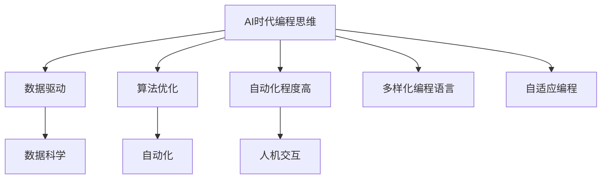
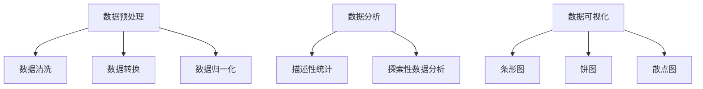
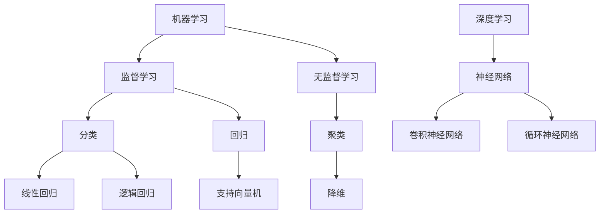
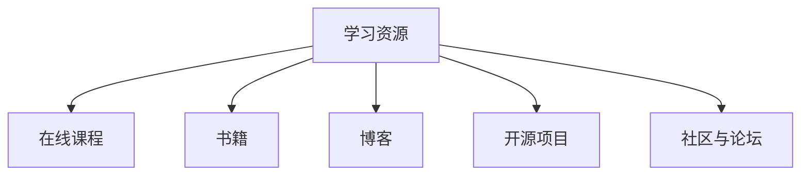

                 

# 《AI时代编程思维的新变革》

> 关键词：人工智能，编程思维，AI编程，机器学习，深度学习，编程语言

> 摘要：本文旨在探讨AI时代编程思维的新变革。随着人工智能技术的快速发展，编程思维正从传统逻辑导向转向数据驱动，算法优化，自动化程度提高。本文将从AI时代编程思维的概念、特点、应用领域，AI编程语言与工具，核心技术与算法，AI编程实战，编程环境与工具以及未来发展趋势等方面，深入分析AI时代编程思维的新变革。

## 《AI时代编程思维的新变革》目录大纲

## 第一部分: AI时代编程思维概述

## 第1章: AI时代编程思维的概念与特点

### 1.1 AI时代编程思维的概念

### 1.2 AI时代编程思维的特点

### 1.3 AI时代编程思维的应用领域

## 第2章: AI编程语言与工具

### 2.1 Python在AI编程中的应用

### 2.2 R语言在AI编程中的应用

### 2.3 其他AI编程语言和工具

## 第二部分: AI编程核心技术与算法

## 第3章: 数据科学基础

### 3.1 数据预处理

### 3.2 数据分析

### 3.3 数据可视化

## 第4章: 机器学习基础

### 4.1 机器学习概述

### 4.2 常见机器学习算法

### 4.3 深度学习基础

## 第5章: AI编程实战

### 5.1 数据科学项目实战

### 5.2 深度学习项目实战

## 第6章: AI编程环境与工具

### 6.1 编程环境搭建

### 6.2 开发工具

### 6.3 数据库与存储

## 第7章: AI编程的未来发展趋势

### 7.1 人工智能与编程的融合

### 7.2 AI编程在教育中的应用

### 7.3 AI编程在社会中的影响

## 附录

### 附录A: 常用AI编程资源

### Mermaid 流程图示例

## 第一部分: AI时代编程思维概述

### 第1章: AI时代编程思维的概念与特点

#### 1.1 AI时代编程思维的概念

AI时代编程思维，是指基于人工智能技术进行编程的一种新的思维模式。它不仅仅涉及编程语言的运用，还包括算法的优化、数据的高效处理以及自动化程度的提高。这种思维模式的特点在于，它更加注重数据的分析、算法的迭代以及系统的智能化。

在传统的编程思维中，开发者更多地依赖于逻辑和流程来解决问题。然而，在AI时代，编程思维开始向数据驱动转变。开发者不再仅仅关注程序的逻辑，而是更多地关注数据的质量、数据的关联性以及数据的可视化。这使得编程不再仅仅是一种编写代码的活动，而是一种数据分析和算法优化的过程。

#### 1.2 AI时代编程思维的特点

1. **数据驱动**：在AI时代，数据是编程的核心。开发者需要收集、处理、分析和利用大量的数据来指导程序的运行和优化。
   
2. **算法优化**：AI编程思维强调对算法的持续优化。开发者需要根据不同的应用场景，选择合适的算法，并对算法进行优化，以提高程序的效率和准确性。

3. **自动化程度高**：AI编程思维注重自动化。通过自动化工具，如集成开发环境（IDE）、代码自动生成工具、智能调试器等，开发者可以大幅度提高编程的效率和准确性。

4. **多样化编程语言**：AI时代编程思维不局限于特定的编程语言。Python、R、Java等都是常用的编程语言，开发者可以根据具体的需求选择合适的语言。

5. **自适应编程**：AI编程思维强调根据项目需求和数据反馈进行代码优化。这意味着开发者需要具备快速适应和调整代码的能力。

#### 1.3 AI时代编程思维的应用领域

AI编程思维广泛应用于多个领域：

1. **数据科学**：在数据科学领域，开发者使用AI编程思维进行数据分析、机器学习模型构建等。

2. **自动化**：在自动化领域，开发者使用AI编程思维进行自动化测试、自动化部署等。

3. **人机交互**：在人机交互领域，开发者使用AI编程思维进行自然语言处理、语音识别等。

### Mermaid 流程图示例



## 第二部分: AI编程核心技术与算法

### 第3章: 数据科学基础

#### 3.1 数据预处理

数据预处理是数据科学的重要环节。它包括数据清洗、数据转换和数据归一化等步骤。

1. **数据清洗**：数据清洗是去除无效数据和噪声的过程。这包括去除重复数据、处理缺失值和异常值等。

2. **数据转换**：数据转换包括将不同类型的数据进行归一化或标准化，以便于后续的分析和处理。

3. **数据归一化**：数据归一化是将数据缩放到相同的范围内，以便于进行比较和分析。

#### 3.2 数据分析

数据分析是数据科学的另一个核心环节。它包括描述性统计和探索性数据分析。

1. **描述性统计**：描述性统计用于描述数据的基本特征，如均值、方差、中位数等。

2. **探索性数据分析**：探索性数据分析用于发现数据中的模式和关系，如可视化、相关性分析等。

#### 3.3 数据可视化

数据可视化是将数据以图表的形式展示出来，以便于理解和分析。常用的图表类型包括条形图、饼图、散点图等。

1. **条形图**：条形图用于比较不同类别或不同时间点的数据。

2. **饼图**：饼图用于展示各部分在整体中的占比。

3. **散点图**：散点图用于展示数据点之间的关系和分布。

### Mermaid 流程图示例



## 第4章: 机器学习基础

### 4.1 机器学习概述

机器学习是AI的核心技术之一。它通过训练模型来让计算机从数据中学习规律，从而实现对未知数据的预测和分类。

1. **监督学习**：监督学习是一种通过已有标记数据进行训练，从而对未知数据进行预测的学习方法。它包括分类和回归两种类型。

2. **无监督学习**：无监督学习是一种在没有标记数据的情况下，通过发现数据中的模式和关系来对数据进行分析的学习方法。它包括聚类和降维两种类型。

### 4.2 常见机器学习算法

以下是几种常见的机器学习算法：

1. **线性回归**：线性回归是一种通过拟合一条直线来预测因变量的方法。

2. **逻辑回归**：逻辑回归是一种通过拟合一个逻辑函数来预测因变量的概率的方法。

3. **支持向量机**：支持向量机是一种通过找到一个最优的超平面来对数据进行分类的方法。

### 4.3 深度学习基础

深度学习是机器学习的一个分支，它通过模拟人脑的神经网络结构来进行数据处理和预测。

1. **神经网络**：神经网络是一种由大量神经元组成的计算模型，通过前向传播和反向传播来学习数据。

2. **卷积神经网络**：卷积神经网络是一种通过卷积操作来提取图像特征的网络，常用于图像识别。

3. **循环神经网络**：循环神经网络是一种通过在时间序列中循环处理数据来学习序列模式的网络，常用于自然语言处理。

### Mermaid 流程图示例



## 第5章: AI编程实战

### 5.1 数据科学项目实战

#### 项目背景：电商用户行为分析

在本项目中，我们将使用数据科学的方法对电商平台的用户行为进行分析，以了解用户的行为模式和购买偏好。

#### 数据预处理：

首先，我们需要对用户行为数据集进行清洗，去除重复数据和异常值。接下来，我们将对数据进行转换，如将类别型数据编码为数值型数据。

```python
# 数据清洗和转换的伪代码
data = read_data('user_behavior.csv')
clean_data = remove_duplicates(data)
normalized_data = normalize(clean_data)
```

#### 数据分析：

接下来，我们将对清洗后的数据进行分析。我们可以使用描述性统计来了解用户行为的基本特征，如用户的平均浏览时长、购买频率等。

```python
# 数据分析的伪代码
import pandas as pd

df = pd.DataFrame(normalized_data)
describe_df = df.describe()
print(describe_df)
```

#### 模型构建：

基于数据分析的结果，我们可以构建一个分类模型来预测用户是否会购买商品。我们可以使用逻辑回归算法来构建模型。

```python
# 模型构建的伪代码
from sklearn.linear_model import LogisticRegression

X = df.drop('purchase', axis=1)
y = df['purchase']

model = LogisticRegression()
model.fit(X, y)
```

#### 模型评估：

最后，我们对模型进行评估，以确定其预测性能。我们可以使用准确率、召回率、F1值等指标来评估模型。

```python
# 模型评估的伪代码
from sklearn.metrics import accuracy_score, recall_score, f1_score

predictions = model.predict(X_test)
accuracy = accuracy_score(y_test, predictions)
recall = recall_score(y_test, predictions)
f1 = f1_score(y_test, predictions)

print('Accuracy:', accuracy)
print('Recall:', recall)
print('F1 Score:', f1)
```

### 5.2 深度学习项目实战

#### 项目背景：图像分类

在本项目中，我们将使用深度学习的方法对图像进行分类。

#### 数据准备：

首先，我们需要准备图像数据集。我们可以使用开源的图像数据集，如CIFAR-10或ImageNet。

```python
# 数据准备的伪代码
import torchvision.transforms as T
import torchvision.datasets as datasets

transform = T.Compose([
    T.Resize(256),
    T.CenterCrop(224),
    T.ToTensor(),
])

train_dataset = datasets.ImageFolder('train_data', transform=transform)
test_dataset = datasets.ImageFolder('test_data', transform=transform)
```

#### 模型构建：

接下来，我们可以构建一个卷积神经网络来对图像进行分类。

```python
# 模型构建的伪代码
import torch
import torch.nn as nn
import torch.optim as optim

class ConvNet(nn.Module):
    def __init__(self):
        super(ConvNet, self).__init__()
        self.conv1 = nn.Conv2d(3, 64, 3, padding=1)
        self.relu = nn.ReLU()
        self.maxpool = nn.MaxPool2d(2, 2)
        self.fc1 = nn.Linear(64 * 56 * 56, 512)
        self.fc2 = nn.Linear(512, 10)
        self.dropout = nn.Dropout(0.5)

    def forward(self, x):
        x = self.maxpool(self.relu(self.conv1(x)))
        x = self.dropout(self.relu(self.fc1(x)))
        x = self.fc2(x)
        return x

model = ConvNet()
```

#### 模型训练与优化：

我们可以使用随机梯度下降（SGD）优化器来训练模型。

```python
# 模型训练与优化的伪代码
optimizer = optim.SGD(model.parameters(), lr=0.001, momentum=0.9)
criterion = nn.CrossEntropyLoss()

for epoch in range(num_epochs):
    running_loss = 0.0
    for inputs, labels in train_loader:
        optimizer.zero_grad()
        outputs = model(inputs)
        loss = criterion(outputs, labels)
        loss.backward()
        optimizer.step()
        running_loss += loss.item()
    print(f'Epoch {epoch+1}, Loss: {running_loss/len(train_loader)}')

```

#### 模型评估：

最后，我们对模型进行评估，以确定其预测性能。

```python
# 模型评估的伪代码
correct = 0
total = 0
with torch.no_grad():
    for inputs, labels in test_loader:
        outputs = model(inputs)
        _, predicted = torch.max(outputs.data, 1)
        total += labels.size(0)
        correct += (predicted == labels).sum().item()

print(f'Accuracy: {100 * correct / total}%')
```

## 第6章: AI编程环境与工具

### 6.1 编程环境搭建

要搭建AI编程环境，首先需要选择合适的操作系统。Windows、Linux和macOS都是常用的操作系统。接下来，我们需要安装Python和相关的库。

```shell
# 安装Python
pip install python

# 安装TensorFlow
pip install tensorflow

# 安装PyTorch
pip install pytorch torchvision
```

### 6.2 开发工具

开发工具是AI编程的重要组成部分。PyCharm和VS Code都是流行的集成开发环境（IDE）。这些IDE提供了丰富的功能，如代码自动补全、调试、版本控制等。

```shell
# 安装PyCharm
sudo snap install pycharm-community --classic

# 安装VS Code
sudo snap install code --classic
```

### 6.3 数据库与存储

在AI编程中，数据库和存储是不可或缺的部分。关系数据库如MySQL和PostgreSQL，以及非关系数据库如MongoDB和Redis，都是常用的数据库和存储解决方案。

```shell
# 安装MySQL
sudo apt-get install mysql-server

# 安装PostgreSQL
sudo apt-get install postgresql

# 安装MongoDB
sudo apt-get install mongodb

# 安装Redis
sudo apt-get install redis-server
```

## 第7章: AI编程的未来发展趋势

### 7.1 人工智能与编程的融合

随着人工智能技术的发展，编程思维将进一步与人工智能融合。编程语言将更加智能化，支持更多AI功能。例如，新的编程语言可能会集成更多的机器学习库和工具，使得开发者可以更加容易地实现AI功能。

### 7.2 AI编程在教育中的应用

AI编程将在教育领域发挥重要作用。编程教育将更加注重AI元素的融入，培养更多的AI编程人才。同时，AI编程也将被用于教育评估和个性化学习，提高教育质量和效率。

### 7.3 AI编程在社会中的影响

AI编程将在社会各个领域产生深远影响。从自动化生产到智能医疗，从智能交通到智慧城市，AI编程将推动社会的发展和进步。然而，AI编程也带来了数据安全和隐私保护等挑战，需要我们共同努力解决。

## 附录

### 附录A: 常用AI编程资源

以下是常用的AI编程学习资源：

- **在线课程**：Coursera、edX、Udacity等平台提供了丰富的AI编程课程。
- **书籍**：如《Python机器学习》、《深度学习》（Goodfellow et al.）等。
- **博客**：如Medium、CSDN、博客园等，提供了大量的AI编程博客和文章。
- **开源项目**：GitHub、GitLab等平台上有大量的AI编程开源项目，供开发者学习和使用。
- **社区与论坛**：Stack Overflow、CSDN等社区和论坛，提供了开发者之间的交流和互助平台。

### Mermaid 流程图示例



作者：AI天才研究院/AI Genius Institute & 禅与计算机程序设计艺术 /Zen And The Art of Computer Programming

