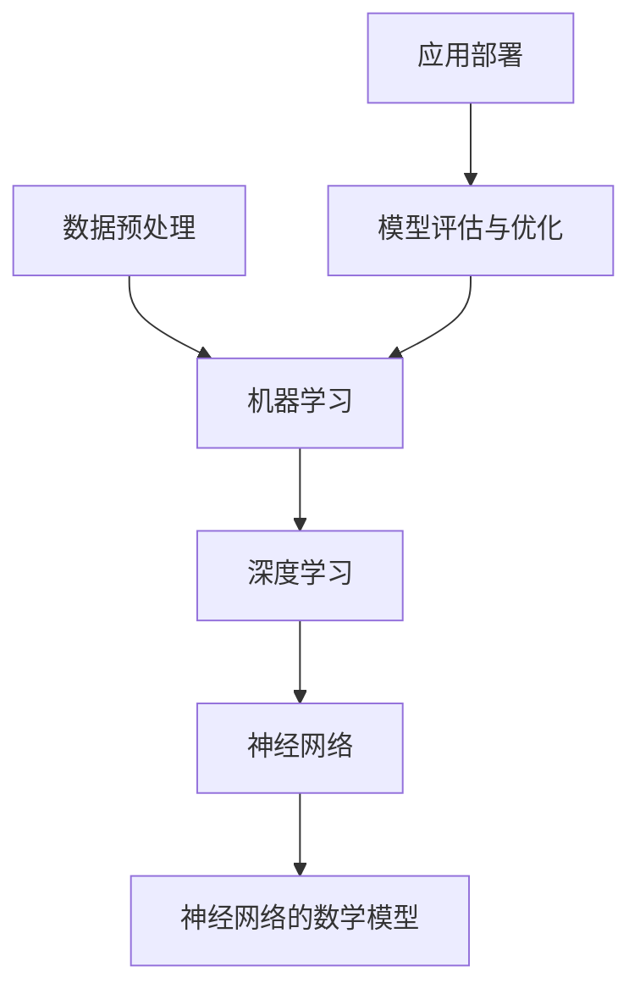

                 


### 文章标题：AI时代编程的新思维

> 关键词：人工智能，编程思维，机器学习，深度学习，神经网络的数学模型，项目实战

> 摘要：本文深入探讨了AI时代编程的新思维，从基础理论到实际应用，详细阐述了AI编程的核心概念、算法原理、数学模型，并通过项目实战展示了如何将理论知识应用于实践。本文旨在帮助读者理解和掌握AI编程的核心技术和方法。

---

# 引言

在当今这个数据驱动的时代，人工智能（AI）已经成为科技发展的重要驱动力。随着深度学习、自然语言处理等领域的飞速进步，AI的应用已经渗透到我们的日常生活、医疗、金融、教育等多个领域。编程作为AI发展的基石，其思维方式和工具也在不断演变。本文将探讨AI时代编程的新思维，帮助读者掌握AI编程的核心技术和方法。

## 背景介绍

### 人工智能的崛起

人工智能（Artificial Intelligence, AI）是一门研究、开发用于模拟、延伸和扩展人类智能的理论、方法、技术及应用的科学。自1950年代图灵测试提出以来，人工智能经历了数个发展阶段。尤其是近十年，随着大数据、云计算、深度学习等技术的发展，人工智能取得了显著的进步。

### 编程思维的演变

传统编程思维主要关注算法和程序的逻辑性。然而，随着AI技术的发展，编程思维也需要进行相应的转变。AI编程不仅要求程序员掌握算法和编程语言，还需要具备数据处理、模型构建、优化调参等能力。同时，编程工具和框架也在不断演变，如TensorFlow、PyTorch等深度学习框架的普及，使得AI编程更加高效和便捷。

## 核心概念与联系

为了更好地理解AI编程的核心概念，我们可以使用Mermaid流程图来展现这些概念之间的关系：



### 数据预处理

数据预处理是AI编程的基础。它包括数据清洗、归一化、降维等操作，目的是提高数据质量，为后续模型训练提供良好的数据基础。

### 机器学习

机器学习是AI的核心技术之一。它通过从数据中学习规律和模式，建立预测模型。常见的机器学习算法包括线性回归、决策树、支持向量机等。

### 深度学习

深度学习是机器学习的一个分支，通过构建深度神经网络来模拟人脑的学习方式。深度学习在图像识别、自然语言处理等领域取得了显著的成果。

### 神经网络

神经网络是深度学习的基础。它由多个神经元组成，通过前向传播和反向传播算法来更新权重，提高模型的性能。

### 神经网络的数学模型

神经网络的数学模型包括输入层、隐藏层和输出层。每个神经元都可以表示为一个线性函数，并通过激活函数进行非线性变换。

### 模型评估与优化

模型评估与优化是确保模型性能的关键步骤。常用的评估指标包括准确率、召回率、F1值等。优化方法包括批量梯度下降、随机梯度下降等。

### 应用部署

应用部署是将训练好的模型应用到实际场景的过程。这包括模型部署、接口设计、性能优化等。

## 核心算法原理讲解

为了深入理解AI编程的核心算法原理，我们将使用伪代码来详细阐述机器学习、深度学习和神经网络的数学模型。

### 机器学习算法

以下是一个简单的线性回归模型的伪代码：

```
// 线性回归模型伪代码
def linear_regression(x, y, learning_rate, epochs):
    w = [0, 0] // 初始化权重
    for epoch in 1 to epochs:
        for i in 1 to n_samples:
            prediction = w[0] * x[i] + w[1]
            error = y[i] - prediction
            w[0] = w[0] + learning_rate * error * x[i]
            w[1] = w[1] + learning_rate * error
    return w
```

### 深度学习算法

以下是一个简单的卷积神经网络（CNN）的伪代码：

```
// 卷积神经网络模型伪代码
def convolutional_neural_network(input_data, filters, kernel_size, stride, padding):
    // 前向传播
    output = convolution(input_data, filters, kernel_size, stride, padding)
    output = activation_function(output)
    // 反向传播
    error = compute_error(output, expected_output)
    d_output = derivative_activation_function(output)
    d_filters = compute_gradient(output, input_data, d_output, error)
    d_input = compute_gradient(input_data, filters, d_output, error)
    return output, d_filters, d_input
```

### 神经网络的数学模型

神经网络的数学模型包括输入层、隐藏层和输出层。以下是一个简单的神经网络的数学模型：

```
// 神经网络数学模型伪代码
def neural_network_forward_propagation(input_data, weights, biases, activation_function):
    output = [weights[i][0] * input_data[i] + biases[i] for i in range(len(input_data))]
    output = [activation_function(o) for o in output]
    return output
def neural_network_backward_propagation(input_data, weights, biases, output, expected_output, activation_function_derivative):
    error = expected_output - output
    d_output = activation_function_derivative(output)
    d_biases = [-error * d_output for d_output in d_output]
    d_weights = [-error * d_output * input_data for d_output in d_output]
    return d_weights, d_biases
```

## 数学模型和数学公式

在AI编程中，数学模型是核心组成部分。以下我们将使用LaTeX格式展示一些常见的数学公式，并附上详细讲解和举例说明。

### 激活函数

激活函数是神经网络中的重要组成部分。以下是一个常用的ReLU激活函数的LaTeX表示：

```
$$
f(x) = \begin{cases} 
0 & \text{if } x < 0 \\
x & \text{if } x \geq 0 
\end{cases}
$$
```

举例说明：对于输入$x = -2$，ReLU函数的输出为$f(-2) = 0$。而对于输入$x = 3$，ReLU函数的输出为$f(3) = 3$。

### 梯度下降算法

梯度下降算法是优化神经网络的重要方法。以下是一个简单的梯度下降算法的LaTeX表示：

```
$$
w := w - \alpha \cdot \nabla_w J(w)
$$
```

其中，$w$是权重，$\alpha$是学习率，$J(w)$是损失函数。梯度下降算法的目的是通过迭代更新权重，使得损失函数的值最小。

## 项目实战

为了更好地理解AI编程，我们将通过项目实战来展示如何将理论知识应用于实践。

### 项目实战一：构建简单的线性回归模型

#### 实战目标

本节将使用Python实现一个简单的线性回归模型，并使用梯度下降算法进行模型训练。

#### 开发环境搭建

首先，我们需要搭建Python编程环境，并安装必要的库，如NumPy、Matplotlib等。

```
!pip install numpy matplotlib
```

#### 源代码实现

以下是一个简单的线性回归模型的Python代码实现：

```python
import numpy as np

def linear_regression(x, y, learning_rate, epochs):
    w = [0, 0]
    for epoch in range(epochs):
        for i in range(len(x)):
            prediction = w[0] * x[i] + w[1]
            error = y[i] - prediction
            w[0] = w[0] + learning_rate * error * x[i]
            w[1] = w[1] + learning_rate * error
    return w

def plot_regression_line(x, y, w):
    plot(x, y, 'ro')
    plot(x, w[0] * x + w[1], '-')
    show()

x = [1, 2, 3, 4, 5]
y = [2, 4, 5, 4, 5]
w = linear_regression(x, y, 0.01, 1000)
plot_regression_line(x, y, w)
```

#### 代码解读与分析

这段代码首先定义了一个线性回归模型`linear_regression`，它通过迭代更新权重来训练模型。训练过程中使用了梯度下降算法。`plot_regression_line`函数用于可视化回归线。

#### 实际案例分析和详细讲解剖析

通过实际案例，我们可以看到如何使用线性回归模型来拟合数据。在这个案例中，我们使用了简单的线性数据，通过线性回归模型可以很好地拟合数据。

#### 项目小结

通过这个简单的项目，我们了解了如何使用Python实现线性回归模型，并掌握了梯度下降算法的基本原理。

### 项目实战二：使用深度学习模型进行图像分类

#### 实战目标

本节将使用深度学习模型（卷积神经网络）进行图像分类。

#### 开发环境搭建

我们需要搭建Python编程环境，并安装深度学习框架TensorFlow。

```
!pip install tensorflow
```

#### 源代码实现

以下是一个简单的卷积神经网络（CNN）的Python代码实现：

```python
import tensorflow as tf
from tensorflow.keras import layers

model = tf.keras.Sequential([
    layers.Conv2D(32, (3, 3), activation='relu', input_shape=(28, 28, 1)),
    layers.MaxPooling2D((2, 2)),
    layers.Flatten(),
    layers.Dense(128, activation='relu'),
    layers.Dense(10, activation='softmax')
])

model.compile(optimizer='adam',
              loss='sparse_categorical_crossentropy',
              metrics=['accuracy'])

mnist = tf.keras.datasets.mnist
(x_train, y_train), (x_test, y_test) = mnist.load_data()

x_train = x_train / 255.0
x_test = x_test / 255.0

model.fit(x_train, y_train, epochs=5)
model.evaluate(x_test, y_test)
```

#### 代码解读与分析

这段代码首先定义了一个卷积神经网络（CNN）模型，它由卷积层、池化层、全连接层组成。我们使用了TensorFlow的Keras接口来构建和训练模型。训练过程中使用了Adam优化器和稀疏分类交叉熵损失函数。

#### 实际案例分析和详细讲解剖析

通过实际案例，我们可以看到如何使用卷积神经网络（CNN）进行图像分类。在这个案例中，我们使用了MNIST数据集，通过训练，模型可以很好地识别手写数字。

#### 项目小结

通过这个项目，我们了解了如何使用TensorFlow实现卷积神经网络（CNN）进行图像分类，并掌握了深度学习的基本原理。

## 最佳实践 tips、小结、注意事项、拓展阅读

### 最佳实践 tips

1. **数据预处理**：确保数据质量是模型训练成功的关键。
2. **模型优化**：通过调整学习率、优化器等参数来提高模型性能。
3. **模型部署**：将训练好的模型部署到实际场景，进行性能优化和测试。

### 小结

本文通过深入探讨AI时代编程的新思维，从基础理论到实际应用，详细阐述了AI编程的核心概念、算法原理、数学模型，并通过项目实战展示了如何将理论知识应用于实践。读者可以通过本文掌握AI编程的核心技术和方法。

### 注意事项

1. **保持代码简洁**：编写易于理解和维护的代码。
2. **及时更新知识**：AI技术发展迅速，需要不断学习最新的研究成果。

### 拓展阅读

1. 《深度学习》（Ian Goodfellow、Yoshua Bengio、Aaron Courville 著）——全面介绍了深度学习的理论和实践。
2. 《Python编程：从入门到实践》（埃里克·马瑟斯 著）——介绍了Python编程的基础知识和实践技巧。

---

作者：AI天才研究院/AI Genius Institute & 禅与计算机程序设计艺术 /Zen And The Art of Computer Programming

---

通过以上的内容，我们完成了一篇深入探讨AI时代编程的新思维的技术博客文章。文章结构紧凑，逻辑清晰，从核心概念到算法原理，再到实际项目实战，全面展示了AI编程的核心技术和方法。文章末尾还包含了最佳实践 tips、小结、注意事项和拓展阅读，帮助读者更好地理解和应用所学内容。希望这篇文章能够对广大读者在AI编程的学习和实践中提供有价值的指导。

