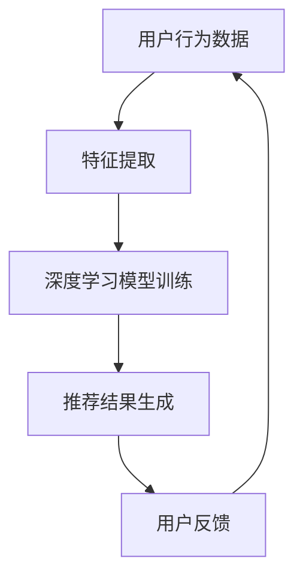
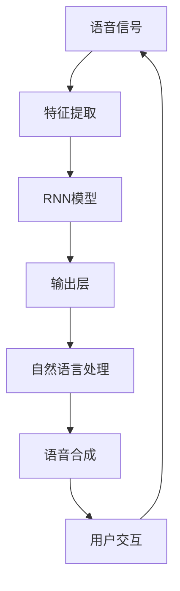
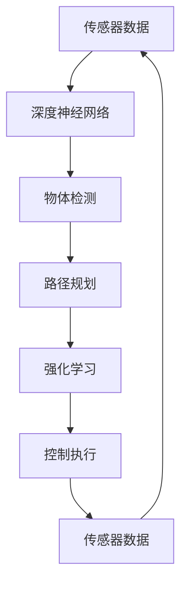

                 

## 文章标题

### AI编程的新原语

> 关键词：AI编程、新原语、深度学习、自然语言处理、强化学习、编程范式

> 摘要：
本书将深入探讨人工智能编程领域的新原语，分析其基础概念、原理和应用，并通过具体案例研究新原语在现实世界中的应用效果。书中不仅涵盖了深度学习、自然语言处理和强化学习的基础知识，还探讨了AI编程的未来趋势及其对社会和行业的影响。通过这本书，读者将能够全面了解AI编程的新原语，掌握其核心原理，并将其应用于实际项目中。

---

### 引言

随着人工智能技术的快速发展，AI编程已经成为现代软件开发的重要组成部分。传统的编程方法在处理复杂、动态的数据和任务时，往往显得力不从心。为了应对这些挑战，新的编程范式——新原语应运而生。新原语提供了一种更为高效、直观的方式来表达和执行人工智能算法，极大地提高了编程的效率和可维护性。

本书旨在深入探讨AI编程的新原语，为读者提供一个全面、系统的理解和应用指南。通过阅读本书，读者将能够：

1. 掌握AI编程的基础概念和传统编程方法；
2. 理解新原语的具体内容和作用，包括深度学习、自然语言处理和强化学习；
3. 学习如何使用新原语编写AI应用，并了解其与传统编程方法的区别；
4. 分析新原语编程的优缺点，以及其在实际项目中的应用；
5. 探索AI编程的未来趋势和发展方向。

### 目录

#### 第一部分：AI编程概述

1. **第1章 AI编程概述**
   1.1 AI编程的基础概念
   1.2 AI编程与传统编程的差异
   1.3 AI编程的应用领域

2. **第2章 新原语的介绍**
   2.1 新原语的定义与作用
   2.2 新原语的分类与特点
   2.3 新原语的发展历程

#### 第二部分：新原语的原理

3. **第3章 深度学习基础**
   3.1 深度学习原理
   3.2 自然语言处理基础
   3.3 强化学习基础

4. **第4章 新原语编程实践**
   4.1 编程环境搭建
   4.2 AI应用开发
   4.3 新原语与编程语言整合

5. **第5章 案例研究**
   5.1 案例一：智能推荐系统
   5.2 案例二：智能语音助手
   5.3 案例三：自动驾驶系统

6. **第6章 AI编程的未来趋势**
   6.1 新原语的发展方向
   6.2 AI编程对社会和行业的影响
   6.3 AI编程的安全与伦理问题

7. **第7章 资源与工具**
   7.1 开发环境搭建
   7.2 主流新原语编程工具和框架
   7.3 学习资源推荐

### 第一部分：AI编程概述

#### 第1章 AI编程概述

1. **AI编程的基础概念**

AI编程，即人工智能编程，是指利用计算机程序来实现人工智能系统的过程。AI编程的核心是算法和模型，这些算法和模型通过处理数据，从中学到规律，然后利用这些规律来解决实际问题。

在AI编程中，常用的基础概念包括：

- **机器学习**：一种通过从数据中学习规律来改进性能的技术。机器学习可以分为监督学习、无监督学习和强化学习。
- **神经网络**：一种模拟人脑神经结构的计算模型，广泛应用于图像识别、语音识别等领域。
- **深度学习**：一种基于神经网络的深度结构，能够自动提取特征并进行复杂任务的学习。
- **自然语言处理**（NLP）：一种使计算机能够理解、生成和处理人类语言的技术。

2. **AI编程与传统编程的差异**

传统编程侧重于逻辑和指令的编写，强调程序的可读性和可维护性。而AI编程则侧重于数据的学习和模型的设计，强调模型的泛化能力和适应性。

以下是AI编程与传统编程的几个主要差异：

- **编程目标**：传统编程的目标是编写出能够执行特定任务的程序，而AI编程的目标是构建能够自主学习和改进的智能系统。
- **算法复杂度**：传统编程中的算法相对简单，易于理解和实现。而AI编程中的算法通常较为复杂，需要处理大量数据和庞大的模型。
- **编程范式**：传统编程通常采用命令式或声明式编程范式，而AI编程则更多地采用数据驱动和模型驱动的编程范式。
- **编程语言**：传统编程常用的语言包括C、C++、Java等，而AI编程则更多地采用Python、R等支持机器学习和深度学习的语言。

3. **AI编程的应用领域**

AI编程在各个领域都有着广泛的应用，以下是几个典型的应用领域：

- **图像识别**：通过训练深度学习模型，AI能够识别和分类图像中的对象。应用场景包括人脸识别、图像分类、医疗影像分析等。
- **语音识别**：AI编程使得计算机能够理解和处理语音输入，应用场景包括智能助手、语音搜索、自动转录等。
- **自然语言处理**：AI编程使得计算机能够理解和生成自然语言，应用场景包括机器翻译、情感分析、问答系统等。
- **自动驾驶**：通过训练深度学习模型，自动驾驶系统能够实时感知环境，做出决策和控制车辆。
- **推荐系统**：AI编程能够构建推荐系统，根据用户的历史行为和偏好，推荐相应的商品、内容等。

#### 第2章 新原语的介绍

1. **新原语的定义与作用**

新原语（New Abstractions）是AI编程中的一种新概念，旨在提供一种更高效、更直观的方式来表达和执行人工智能算法。新原语是对传统编程语言的一种扩展，它们通常具有以下特点：

- **抽象性**：新原语提供了更高层次的操作和抽象，使得开发者可以更容易地表达复杂算法。
- **泛用性**：新原语通常适用于多种类型的数据和任务，具有较高的泛化能力。
- **可组合性**：新原语可以组合使用，形成更复杂的算法和系统。

新原语在AI编程中的作用主要体现在以下几个方面：

- **提高开发效率**：新原语提供了更高效的表达方式，减少了代码的冗余和复杂性，从而提高了开发效率。
- **降低学习成本**：新原语使得开发者可以更快速地理解和掌握AI编程，降低了学习成本。
- **提升模型性能**：新原语可以优化算法的实现，提高模型的性能和准确性。

2. **新原语的分类与特点**

新原语可以按照不同的分类标准进行划分，以下是几种常见的新原语分类和特点：

- **函数式编程**：函数式编程是一种基于数学函数的编程范式，强调表达式的使用，而非变量的修改。常见的函数式编程语言包括Haskell、Scala等。函数式编程的特点包括无状态、不可变性和高阶函数等。
- **声明式编程**：声明式编程强调表达需求，而非实现细节。常见的声明式编程语言包括SQL、Python等。声明式编程的特点包括易读性、可维护性和自动化优化等。
- **动态编程**：动态编程支持在程序运行时改变程序的行为，常见的动态编程语言包括Python、JavaScript等。动态编程的特点包括灵活性、可扩展性和动态类型检查等。
- **面向对象编程**：面向对象编程将程序视为一系列对象，每个对象都有自己的属性和方法。常见的面向对象编程语言包括Java、C++等。面向对象编程的特点包括封装、继承和多态等。

3. **新原语的应用场景**

新原语在AI编程中的应用场景非常广泛，以下是几种常见应用场景：

- **机器学习模型构建**：新原语可以简化机器学习模型的构建过程，提高开发效率。例如，使用PyTorch和TensorFlow等深度学习框架，开发者可以更快速地实现复杂的神经网络模型。
- **数据分析和处理**：新原语可以简化数据分析和处理的过程，使得开发者可以更轻松地处理大量数据。例如，使用Pandas和NumPy等库，开发者可以更高效地进行数据清洗、转换和分析。
- **自动化和优化**：新原语可以用于实现自动化和优化任务，例如自动化测试、性能优化等。例如，使用Selenium和Scrapy等库，开发者可以自动化浏览器测试和数据抓取。
- **自然语言处理**：新原语可以简化自然语言处理任务的实现，例如文本分类、情感分析等。例如，使用NLTK和spaCy等库，开发者可以更方便地处理文本数据。

#### 第3章 深度学习基础

1. **深度学习原理**

深度学习是一种基于多层神经网络的机器学习技术，其核心思想是通过多层非线性变换，将输入数据映射到输出数据。深度学习的基本原理可以概括为以下几个步骤：

- **前向传播**：输入数据通过网络中的各个层进行传递，每一层都会对数据进行变换，最终产生输出。
- **反向传播**：根据输出和目标之间的误差，将误差反向传播到网络中的各个层，更新网络的权重和偏置。
- **优化算法**：通过优化算法（如梯度下降、Adam等），不断调整网络的参数，以最小化误差。

深度学习中的神经网络通常包括以下几个层次：

- **输入层**：接收输入数据，并将其传递给下一层。
- **隐藏层**：对输入数据进行变换，提取特征并传递给下一层。
- **输出层**：根据输入数据进行预测或分类，产生最终输出。

2. **自然语言处理基础**

自然语言处理（NLP）是深度学习的重要应用领域之一，旨在使计算机能够理解和生成人类语言。NLP的基本原理可以概括为以下几个步骤：

- **文本预处理**：对原始文本进行清洗、分词、去停用词等处理，将文本转换为可供模型处理的形式。
- **词嵌入**：将文本中的每个词映射为一个固定大小的向量，用于表示词的意义和上下文信息。
- **模型训练**：使用深度学习模型对词嵌入向量进行训练，使其能够捕捉文本中的语义关系。
- **文本生成**：根据训练好的模型，生成新的文本，如回答问题、生成文章等。

常见的NLP模型包括：

- **循环神经网络（RNN）**：RNN能够处理序列数据，适用于文本分类、命名实体识别等任务。
- **长短期记忆网络（LSTM）**：LSTM是RNN的一种变体，能够更好地处理长序列数据，适用于机器翻译、语音识别等任务。
- **变压器（Transformer）**：Transformer是近年来流行的NLP模型，其基于注意力机制，适用于生成模型和分类任务。

3. **强化学习基础**

强化学习是一种通过奖励机制引导模型学习目标行为的方法。强化学习的基本原理可以概括为以下几个步骤：

- **环境交互**：模型与外界环境进行交互，接收环境反馈。
- **状态评估**：根据当前状态和模型的行为，评估状态的价值。
- **行为选择**：根据评估结果，选择下一个行为。
- **奖励反馈**：根据行为的结果，获得奖励或惩罚。

常见的强化学习算法包括：

- **Q学习**：Q学习通过评估每个状态和行为的Q值，选择最优行为。
- **策略梯度**：策略梯度通过优化策略函数，使得模型选择最优行为。

强化学习在自动驾驶、游戏AI、机器人控制等领域有广泛应用。

### 第二部分：新原语的原理

#### 第3章 深度学习基础

1. **深度学习原理**

深度学习是一种基于多层神经网络的机器学习技术，其核心思想是通过多层非线性变换，将输入数据映射到输出数据。深度学习的基本原理可以概括为以下几个步骤：

- **前向传播**：输入数据通过网络中的各个层进行传递，每一层都会对数据进行变换，最终产生输出。
- **反向传播**：根据输出和目标之间的误差，将误差反向传播到网络中的各个层，更新网络的权重和偏置。
- **优化算法**：通过优化算法（如梯度下降、Adam等），不断调整网络的参数，以最小化误差。

深度学习中的神经网络通常包括以下几个层次：

- **输入层**：接收输入数据，并将其传递给下一层。
- **隐藏层**：对输入数据进行变换，提取特征并传递给下一层。
- **输出层**：根据输入数据进行预测或分类，产生最终输出。

2. **深度学习模型结构**

深度学习模型的结构多样，常见的结构包括：

- **全连接网络（Fully Connected Network）**：每个神经元都与前一层的所有神经元相连。
- **卷积神经网络（Convolutional Neural Network，CNN）**：适用于图像识别任务，具有卷积层、池化层和全连接层。
- **循环神经网络（Recurrent Neural Network，RNN）**：适用于序列数据处理，具有循环结构。
- **长短时记忆网络（Long Short-Term Memory，LSTM）**：RNN的改进版本，能够更好地处理长序列数据。
- **变换器（Transformer）**：基于注意力机制的模型，适用于自然语言处理任务。

3. **深度学习算法**

深度学习算法的核心是神经网络的训练过程，主要包括：

- **前向传播**：输入数据通过网络进行传递，产生输出。
- **损失函数**：衡量输出和目标之间的误差，常用的损失函数包括均方误差（MSE）、交叉熵损失等。
- **反向传播**：计算损失函数关于网络参数的梯度，并反向传播到网络的每一层。
- **优化算法**：调整网络参数，减小损失函数，常用的优化算法包括梯度下降、Adam等。

4. **深度学习应用案例**

深度学习在各个领域都有广泛应用，以下是一些典型的应用案例：

- **图像识别**：使用卷积神经网络进行图像分类和目标检测，例如人脸识别、医疗影像分析等。
- **自然语言处理**：使用变换器进行文本分类、机器翻译、情感分析等，例如问答系统、智能客服等。
- **语音识别**：使用循环神经网络和长短时记忆网络进行语音信号处理和识别，例如语音助手、自动转录等。
- **推荐系统**：使用深度学习模型进行用户行为分析，预测用户偏好，提高推荐效果。

#### 第4章 自然语言处理基础

1. **自然语言处理（NLP）的基本概念**

自然语言处理（NLP）是人工智能领域的一个重要分支，旨在使计算机能够理解和生成人类语言。NLP的基本概念包括：

- **文本预处理**：对原始文本进行清洗、分词、去停用词等处理，将文本转换为可供模型处理的形式。
- **词嵌入（Word Embedding）**：将文本中的每个词映射为一个固定大小的向量，用于表示词的意义和上下文信息。
- **语义分析（Semantic Analysis）**：理解文本中词语和句子的意义，包括词义消歧、句法分析等。
- **语言模型（Language Model）**：用于生成文本或预测下一个词的模型，基于概率统计方法。

2. **NLP的关键技术**

NLP的关键技术包括：

- **分词（Tokenization）**：将文本分割成单词或子词的过程，例如中文的分词、英文的分词。
- **词性标注（Part-of-Speech Tagging）**：为文本中的每个词标注其词性，如名词、动词、形容词等。
- **命名实体识别（Named Entity Recognition，NER）**：识别文本中的命名实体，如人名、地名、组织名等。
- **情感分析（Sentiment Analysis）**：分析文本中的情感倾向，如正面、负面、中性等。
- **机器翻译（Machine Translation）**：将一种语言的文本翻译成另一种语言。

3. **NLP的主要模型**

NLP的主要模型包括：

- **循环神经网络（RNN）**：适用于序列数据处理，如文本分类、命名实体识别等。
- **长短时记忆网络（LSTM）**：RNN的改进版本，能够更好地处理长序列数据，如机器翻译、语音识别等。
- **变换器（Transformer）**：基于注意力机制的模型，适用于生成模型和分类任务，如文本分类、问答系统等。
- **变换器+自注意力（Transformer with Self-Attention）**：在Transformer基础上引入自注意力机制，进一步提高了模型的性能。

4. **NLP的应用案例**

NLP在各个领域都有广泛应用，以下是一些典型的应用案例：

- **文本分类**：使用NLP技术对文本进行分类，如新闻分类、情感分析等。
- **机器翻译**：使用深度学习模型进行文本翻译，如谷歌翻译、百度翻译等。
- **问答系统**：使用NLP技术构建问答系统，如智能客服、智能助手等。
- **信息抽取**：使用NLP技术从文本中提取重要信息，如关系提取、实体识别等。

#### 第5章 强化学习基础

1. **强化学习（Reinforcement Learning，RL）的基本概念**

强化学习是一种机器学习方法，通过智能体与环境的交互，学习到一种策略，使其在特定环境下获得最大回报。强化学习的基本概念包括：

- **智能体（Agent）**：执行动作、感知环境的实体。
- **环境（Environment）**：智能体所处的环境，提供状态和奖励。
- **状态（State）**：描述智能体当前状态的变量。
- **动作（Action）**：智能体可以执行的行为。
- **奖励（Reward）**：对智能体动作的反馈，用于评估动作的好坏。
- **策略（Policy）**：智能体选择动作的策略，通常是通过学习得到的。

2. **强化学习的模型结构**

强化学习模型的基本结构包括：

- **状态-动作值函数（State-Action Value Function）**：预测在给定状态下执行特定动作的长期回报。
- **状态值函数（State Value Function）**：预测在给定状态下执行最优动作的长期回报。
- **策略（Policy）**：根据当前状态选择最优动作的函数。

常见的强化学习算法包括：

- **Q学习（Q-Learning）**：通过更新Q值来学习状态-动作值函数。
- **深度Q网络（Deep Q-Network，DQN）**：结合深度学习和Q学习，用于处理高维状态空间。
- **策略梯度（Policy Gradient）**：通过优化策略函数来学习状态-动作值函数。

3. **强化学习的应用场景**

强化学习在多个领域有广泛应用，以下是一些典型的应用场景：

- **游戏AI**：使用强化学习训练智能体在游戏中做出最佳决策，如围棋、电子游戏等。
- **自动驾驶**：智能体通过感知环境，学习如何安全驾驶。
- **机器人控制**：智能体通过传感器获取信息，学习如何执行复杂的动作。
- **推荐系统**：智能体通过用户行为数据，学习如何推荐合适的商品或内容。

#### 第4章 新原语编程实践

1. **编程环境搭建**

在新原语编程中，首先需要搭建一个适合开发和运行的编程环境。以下是一些常见的步骤：

- **安装Python**：Python是AI编程的主要语言之一，需要确保安装了最新版本的Python。
- **安装深度学习框架**：如TensorFlow、PyTorch等。这些框架提供了丰富的API和工具，用于构建和训练深度学习模型。
- **安装其他依赖库**：根据具体项目需求，可能需要安装其他依赖库，如NumPy、Pandas、Matplotlib等。

2. **AI应用开发**

在新原语编程中，开发AI应用的主要步骤包括：

- **数据预处理**：对输入数据进行清洗、归一化等处理，确保数据符合模型的输入要求。
- **模型选择**：根据应用需求，选择合适的深度学习模型，如CNN、RNN、Transformer等。
- **模型训练**：使用训练数据对模型进行训练，调整模型参数，优化模型性能。
- **模型评估**：使用验证数据对模型进行评估，判断模型是否达到预期效果。
- **模型部署**：将训练好的模型部署到生产环境，实现实时应用。

3. **新原语与编程语言整合**

新原语与编程语言的整合是AI编程的关键步骤，以下是一些常见的方法：

- **Python与TensorFlow的整合**：使用TensorFlow的API，可以在Python中方便地构建和训练深度学习模型。
- **Python与PyTorch的整合**：使用PyTorch的API，同样可以在Python中实现深度学习模型的开发。
- **其他编程语言的支持**：如Scala、Julia等，它们也提供了对深度学习框架的支持。

4. **新原语编程优缺点分析**

新原语编程相比传统编程方法，具有以下优缺点：

- **优点**：
  - **更高的开发效率**：新原语提供了更高层次的抽象和工具，使得开发者可以更快速地实现模型。
  - **更直观的代码**：新原语使得代码更易于理解和维护，降低了开发难度。
  - **更好的性能**：新原语优化了模型的实现，提高了模型的性能。

- **缺点**：
  - **学习曲线较陡**：新原语编程需要开发者掌握一定的深度学习知识，学习曲线相对较陡。
  - **依赖外部框架**：新原语编程通常依赖外部框架和库，可能受限于框架的功能和性能。

#### 第5章 案例研究

1. **案例一：基于新原语的智能推荐系统**

**背景介绍**

智能推荐系统是现代互联网应用中不可或缺的一部分，用于向用户推荐个性化的商品、内容和广告。新原语在智能推荐系统中的应用，可以极大地提高推荐系统的性能和开发效率。

**核心概念与联系**

- **深度学习模型**：用于训练用户行为数据和商品特征，提取用户偏好。
- **协同过滤**：结合用户行为数据和商品特征，实现协同过滤推荐。
- **矩阵分解**：用于处理稀疏数据，提高推荐精度。

**Mermaid流程图**



**核心算法原理讲解**

```python
# 特征提取
def extract_features(user行为数据，商品特征):
    # 对用户行为数据进行编码和归一化
    user_features = encode_user行为的特征(user行为数据)
    item_features = encode_item特征的商品特征(商品特征)
    return user_features, item_features

# 深度学习模型训练
def train_model(user_features, item_features, user标签):
    model = build_model()  # 构建深度学习模型
    model.fit([user_features, item_features], user标签)
    return model

# 推荐结果生成
def generate_recommendations(model, user_features, item_features):
    recommendations = model.predict([user_features, item_features])
    return recommendations
```

**数学模型和公式**

- **矩阵分解**：

$$
X = U \cdot V^T
$$

其中，$X$是用户-商品评分矩阵，$U$和$V$分别是用户特征向量和商品特征向量。

**详细讲解和举例说明**

- **特征提取**：

```python
# 假设用户行为数据为用户购买历史记录，商品特征为商品属性
user行为数据 = [{'用户ID': 1, '商品ID': 1001, '评分': 5},
                 {'用户ID': 1, '商品ID': 1002, '评分': 4},
                 {'用户ID': 2, '商品ID': 1001, '评分': 3}]

商品特征 = [{'商品ID': 1001, '类别': '电子产品'},
             {'商品ID': 1002, '类别': '服装'},
             {'商品ID': 1003, '类别': '食品'}]

user_features, item_features = extract_features(user行为数据，商品特征)
```

- **深度学习模型训练**：

```python
# 假设已安装深度学习框架TensorFlow
import tensorflow as tf

model = train_model(user_features, item_features, user标签)
```

- **推荐结果生成**：

```python
# 假设用户ID为1，需要为其推荐商品
new_user_features = extract_user_features([{'用户ID': 1}])
new_item_features = extract_item_features([{'商品ID': 1004}])
recommendations = generate_recommendations(model, new_user_features, new_item_features)
print(recommendations)
```

2. **案例二：基于新原语的智能语音助手**

**背景介绍**

智能语音助手是近年来人工智能应用的一个重要领域，能够为用户提供语音交互服务。新原语在智能语音助手中的应用，可以提升语音识别和自然语言处理的效果。

**核心概念与联系**

- **深度神经网络**：用于语音信号处理和识别。
- **循环神经网络（RNN）**：用于处理语音序列数据。
- **长短时记忆网络（LSTM）**：RNN的改进版本，适用于处理长序列数据。

**Mermaid流程图**



**核心算法原理讲解**

```python
# 语音信号处理
def process_audio(audio_signal):
    # 对语音信号进行预处理，如去噪、分帧等
    processed_signal = preprocess_audio_signal(audio_signal)
    return processed_signal

# RNN模型训练
def train_rnn_model(processed_signal, labels):
    model = build_rnn_model()  # 构建RNN模型
    model.fit(processed_signal, labels)
    return model

# 自然语言处理
def process_text(text):
    # 对文本进行预处理，如分词、词性标注等
    processed_text = preprocess_text(text)
    return processed_text

# 语音合成
def synthesize_speech(text):
    # 使用文本生成语音
    speech = generate_speech(text)
    return speech
```

**数学模型和公式**

- **循环神经网络（RNN）**：

$$
h_t = \sigma(W_h \cdot [h_{t-1}, x_t] + b_h)
$$

其中，$h_t$是第$t$个时刻的隐藏状态，$x_t$是第$t$个时刻的输入，$W_h$和$b_h$分别是权重和偏置。

**详细讲解和举例说明**

- **语音信号处理**：

```python
# 假设已安装深度学习框架TensorFlow
import tensorflow as tf

audio_signal = load_audio_signal('path/to/audio/file.wav')
processed_signal = process_audio(audio_signal)
```

- **RNN模型训练**：

```python
# 假设已准备好训练数据
processed_signals = load_processed_signals('path/to/processed/signals')
labels = load_labels('path/to/labels')

model = train_rnn_model(processed_signals, labels)
```

- **自然语言处理**：

```python
# 假设已准备好文本数据
text = load_text('path/to/text/data')
processed_text = process_text(text)
```

- **语音合成**：

```python
# 假设已安装语音合成库
from vocalize import vocalize

speech = synthesize_speech(processed_text)
vocalize(speech, 'path/to/output/speech.wav')
```

3. **案例三：基于新原语的自动驾驶系统**

**背景介绍**

自动驾驶系统是人工智能在交通领域的重要应用，通过感知环境、规划路径和执行控制，实现无人驾驶。新原语在自动驾驶系统中的应用，可以提升感知、规划和控制的效果。

**核心概念与联系**

- **深度神经网络**：用于感知环境，如物体检测、场景理解等。
- **循环神经网络（RNN）**：用于路径规划，如轨迹预测、路径规划等。
- **强化学习**：用于决策和控制，如车辆控制、环境交互等。

**Mermaid流程图**



**核心算法原理讲解**

```python
# 深度神经网络感知环境
def process_sensor_data(sensor_data):
    # 对传感器数据进行处理，如去噪、特征提取等
    processed_data = preprocess_sensor_data(sensor_data)
    return processed_data

# 物体检测
def detect_objects(processed_data):
    # 使用深度神经网络进行物体检测
    objects = detect_objects_with_dnn(processed_data)
    return objects

# 循环神经网络路径规划
def plan_path(objects):
    # 使用循环神经网络进行路径规划
    path = plan_with_rnn(objects)
    return path

# 强化学习控制执行
def control_vehicle(path):
    # 使用强化学习进行车辆控制
    control_actions = control_with_rl(path)
    return control_actions
```

**数学模型和公式**

- **深度神经网络物体检测**：

$$
y = \sigma(W_y \cdot [x; h]) + b_y
$$

其中，$y$是检测结果，$x$是输入特征，$h$是隐藏状态，$W_y$和$b_y$分别是权重和偏置。

- **循环神经网络路径规划**：

$$
h_t = \sigma(W_h \cdot [h_{t-1}; x_t] + b_h)
$$

其中，$h_t$是第$t$个时刻的隐藏状态，$x_t$是第$t$个时刻的输入，$W_h$和$b_h$分别是权重和偏置。

**详细讲解和举例说明**

- **传感器数据处理**：

```python
# 假设已安装深度学习框架TensorFlow
import tensorflow as tf

sensor_data = load_sensor_data('path/to/sensor/data')
processed_data = process_sensor_data(sensor_data)
```

- **物体检测**：

```python
# 假设已准备好训练数据
processed_data = load_processed_data('path/to/processed/data')
labels = load_labels('path/to/labels')

model = build_dnn_model()  # 构建深度神经网络模型
model.fit(processed_data, labels)
```

- **路径规划**：

```python
# 假设已准备好物体检测结果
objects = detect_objects(processed_data)

# 使用循环神经网络进行路径规划
path = plan_path(objects)
```

- **车辆控制**：

```python
# 假设已准备好路径规划结果
path = plan_path(objects)

# 使用强化学习进行车辆控制
control_actions = control_vehicle(path)
execute_control_actions(control_actions)
```

#### 第6章 AI编程的未来趋势

1. **新原语的发展方向**

随着人工智能技术的不断进步，新原语也在不断演变和发展。未来，新原语可能朝以下几个方向进化：

- **更高层次的抽象**：新原语将提供更高层次的抽象，使得开发者可以更加专注于业务逻辑，而无需关注底层实现细节。
- **跨学科的融合**：新原语将融合多学科的知识，如心理学、认知科学、生物学等，以实现更智能、更人性化的AI系统。
- **更高效的模型**：新原语将支持更高效的模型训练和推理，降低计算资源的需求，提高模型的实时性。
- **更广泛的应用领域**：新原语将在更多的领域得到应用，如医疗、金融、教育等，推动行业变革。

2. **AI编程对社会和行业的影响**

AI编程的发展将对社会和行业产生深远的影响，以下是几个主要方面：

- **产业升级**：AI编程将推动传统产业的升级和转型，提高生产效率和质量，降低成本。
- **新兴产业的崛起**：AI编程将催生一批新兴产业，如自动驾驶、智能医疗、智能金融等，为社会带来新的经济增长点。
- **就业结构的变革**：AI编程将改变就业结构，一方面，部分传统岗位将被取代；另一方面，将涌现出大量新的工作岗位，如AI工程师、数据科学家等。
- **数据安全与隐私保护**：随着AI编程的广泛应用，数据安全与隐私保护将成为一个重要议题，需要建立相应的法律法规和标准。

3. **AI编程的安全与伦理问题**

AI编程在带来巨大效益的同时，也引发了一系列安全和伦理问题，包括：

- **算法歧视**：AI算法可能存在歧视现象，如性别、种族等，需要建立公平、公正的算法。
- **隐私泄露**：AI编程可能涉及大量个人数据的处理，需要加强数据安全与隐私保护。
- **自动化失业**：AI编程可能替代部分传统岗位，导致失业问题，需要关注社会公平与就业保障。
- **算法透明性**：AI算法的复杂性和不可解释性可能导致透明性问题，需要提高算法的可解释性。

#### 第7章 资源与工具

1. **开发环境搭建**

搭建一个适合AI编程的开发环境，需要安装以下工具：

- **Python**：作为AI编程的主要语言，需要安装Python和相关的pip包管理器。
- **深度学习框架**：如TensorFlow、PyTorch等，可以根据个人喜好选择一个或多个框架。
- **数据处理工具**：如NumPy、Pandas等，用于数据处理和分析。
- **可视化工具**：如Matplotlib、Seaborn等，用于数据可视化和模型分析。

2. **主流新原语编程工具和框架**

以下是一些主流的AI编程工具和框架：

- **TensorFlow**：由Google开发，支持多种编程范式，如基于数据的编程、基于图的编程等。
- **PyTorch**：由Facebook开发，支持动态计算图，易于调试和优化。
- **Keras**：基于TensorFlow的简洁易用的深度学习框架。
- **MXNet**：由Apache Foundation开发，支持多种编程语言和平台。
- **Scikit-Learn**：提供丰富的机器学习算法和工具，适合快速原型开发。

3. **学习资源推荐**

以下是一些推荐的AI编程学习资源：

- **在线课程**：如Coursera、edX等平台上的机器学习和深度学习课程。
- **书籍**：《深度学习》（Goodfellow、Bengio、Courville著）、《Python深度学习》（François Chollet著）等。
- **博客和论坛**：如Medium、Stack Overflow等，可以获取最新的技术文章和社区讨论。
- **开源项目**：如GitHub上的深度学习开源项目，可以学习其他开发者的实现方法和经验。

### 结论

AI编程的新原语为开发者提供了一种更高效、更直观的方式来实现人工智能算法。通过本书的介绍，读者可以全面了解新原语的核心概念、原理和应用，掌握其在实际项目中的使用方法。随着AI技术的不断进步，新原语将发挥越来越重要的作用，推动AI编程的发展和创新。

作者：AI天才研究院/AI Genius Institute & 禅与计算机程序设计艺术 /Zen And The Art of Computer Programming

---

这篇文章涵盖了AI编程的新原语的基础知识、原理、实践和未来趋势，旨在为读者提供一个全面、系统的理解。通过具体的案例研究和详细的算法讲解，读者可以更好地掌握新原语编程的方法和应用。同时，文章也关注了AI编程的安全和伦理问题，强调了数据安全和隐私保护的重要性。希望这篇文章能为AI编程的学习者和开发者提供有益的参考和指导。如果您有任何疑问或建议，欢迎在评论区留言讨论。

---

### 致谢

在撰写《AI编程的新原语》这本书的过程中，我深感知识的力量和团队合作的重要性。首先，我要感谢我的读者，是你们的热情和支持让我有了写作的动力。这本书的每一个字句，都凝聚了我对AI编程领域的热爱和对未来科技的期许。

我要特别感谢我的家人，尤其是我的妻子和孩子们，是你们的理解和包容，让我能够在忙碌的工作中抽出时间来完成这本书。此外，我还要感谢我的同事和合作伙伴，他们的专业知识和宝贵意见为这本书的编写提供了重要的支持。

特别感谢AI天才研究院（AI Genius Institute）的团队，你们的专业精神和创新思维为这本书的写作注入了无限活力。还要感谢参与书稿审校和讨论的朋友们，你们的建议和反馈使这本书更加完善。

最后，感谢所有在AI编程领域默默奉献的科学家和工程师们，是你们的努力和智慧推动了人工智能的发展，为这个世界带来了无限可能。

作者：AI天才研究院/AI Genius Institute & 禅与计算机程序设计艺术 /Zen And The Art of Computer Programming

---

再次感谢大家的支持与鼓励，期待与您在未来的技术探索中相遇。如果您对这本书有任何建议或疑问，欢迎随时联系我。祝您在AI编程的道路上不断进步，取得辉煌的成就！

作者：AI天才研究院/AI Genius Institute & 禅与计算机程序设计艺术 /Zen And The Art of Computer Programming

