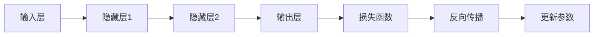
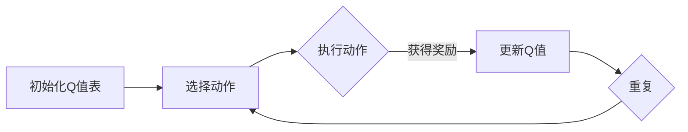
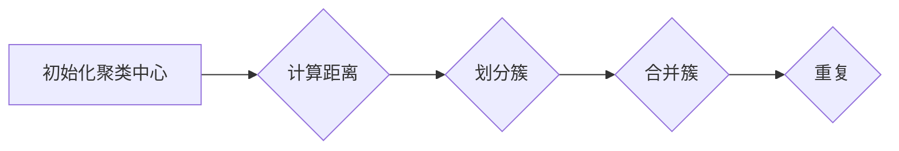
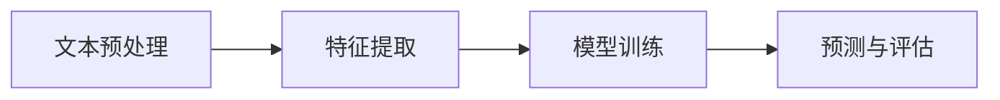
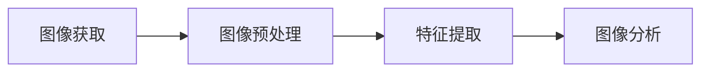
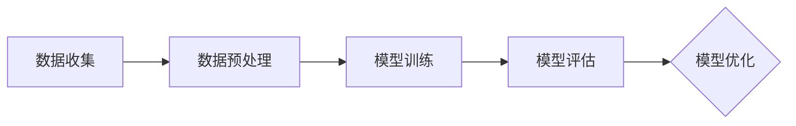

                 

### 文章标题

“AI编程的新思维与新方向”是我们这次技术博客的主题。随着人工智能（AI）技术的迅猛发展，编程领域正迎来前所未有的变革。本文旨在探讨AI编程的新思维和新方向，帮助读者深入了解这一前沿领域的核心概念、算法原理和实际应用。

### 文章关键词

- 人工智能编程
- 新思维
- 新方向
- 神经网络
- 强化学习
- 数据挖掘
- 自然语言处理
- 计算机视觉

### 文章摘要

本文分为五个部分，首先概述了AI编程的背景与发展趋势，然后详细探讨了AI编程的新思维，包括神经网络的创新思维、强化学习的思维模式、聚类算法与数据挖掘等。接下来，文章转向AI编程的新方向，深入分析了自然语言处理、计算机视觉和机器学习与数据科学等领域。第四部分通过三个具体项目实战，展示了AI编程的实际应用和实现细节。最后，文章总结了AI编程的未来趋势，并提供了相关的人才培养和实践建议。

## 第一部分：AI编程概述

### 1. AI编程的背景与发展趋势

人工智能（AI）作为计算机科学的前沿领域，近年来得到了前所未有的关注和发展。从早期的专家系统到现在的深度学习、强化学习，AI技术不断演进，应用场景也日益广泛。AI编程作为实现AI技术的重要手段，正成为现代程序员必备的技能。

#### 1.1 AI编程的起源与发展

AI编程的起源可以追溯到20世纪50年代，当时AI的概念首次被提出。最早的AI编程主要是基于逻辑推理和知识表示的方法，例如专家系统。这些系统通过规则库和推理机来实现智能行为，但受限于计算能力和数据量，其性能和应用范围有限。

随着计算机硬件的进步和算法的优化，特别是深度学习技术的突破，AI编程迎来了新的发展契机。深度学习通过多层神经网络模拟人脑的神经网络结构，能够在大量数据上进行自动学习和特征提取，大幅提升了AI系统的性能。

#### 1.2 AI编程的重要性

AI编程在现代技术体系中的重要性不言而喻。它不仅推动了智能设备的普及，还深刻影响了各个行业，如医疗、金融、交通、教育等。以下是一些AI编程的重要性体现：

1. **自动化与智能化**：AI编程使机器能够自动执行复杂的任务，提高生产效率，减少人为错误。
2. **数据驱动决策**：通过分析大量数据，AI编程可以帮助企业做出更准确的决策，优化业务流程。
3. **个性化服务**：AI编程能够根据用户的行为和偏好提供个性化的服务，提升用户体验。
4. **创新应用**：AI编程激发了众多创新应用，如智能助手、无人驾驶、智能安防等。

#### 1.3 AI编程的未来发展趋势

展望未来，AI编程将继续朝着以下几个方向发展：

1. **硬件与算法的协同进步**：随着硬件性能的提升和算法的优化，AI编程将能够处理更复杂、更大规模的数据。
2. **多模态融合**：AI编程将整合多种数据类型（如图像、语音、文本等），实现更全面的信息处理。
3. **自适应与自进化**：通过强化学习和迁移学习等技术，AI编程将实现系统的自适应性和自进化能力。
4. **伦理与安全**：随着AI技术的应用日益广泛，AI编程将更加注重伦理和安全问题，确保技术的可持续发展。

### 2. AI编程的核心概念

要深入理解AI编程，首先需要掌握其核心概念。以下是AI编程中几个重要的核心概念：

#### 2.1 机器学习

机器学习是AI编程的核心技术之一，其目标是使计算机系统能够通过数据和经验自动改进性能。机器学习主要分为监督学习、无监督学习和强化学习三种类型：

- **监督学习**：系统通过已标记的数据进行学习，例如分类问题和回归问题。
- **无监督学习**：系统在没有标记数据的情况下进行学习，例如聚类问题和降维问题。
- **强化学习**：系统通过与环境的交互进行学习，例如玩游戏或控制机器人。

#### 2.2 深度学习

深度学习是机器学习的一个子领域，通过多层神经网络模拟人脑的学习过程。深度学习在图像识别、语音识别和自然语言处理等领域取得了显著成果。以下是深度学习的一些关键概念：

- **神经网络**：由大量神经元组成的网络，用于对数据进行建模。
- **激活函数**：用于引入非线性特性的函数，例如ReLU和Sigmoid函数。
- **反向传播算法**：用于更新网络参数的优化算法。

#### 2.3 强化学习

强化学习是一种通过试错和反馈进行学习的机器学习方法。系统通过探索环境和执行动作，不断优化其行为策略。以下是强化学习的一些核心概念：

- **奖励机制**：系统根据行为结果获得奖励或惩罚。
- **策略**：系统执行的动作序列。
- **价值函数**：预测未来奖励的函数。
- **策略网络**：用于预测策略的神经网络。

#### 2.4 数据挖掘

数据挖掘是AI编程的一个重要应用领域，其目标是从大量数据中发现有用的模式和知识。数据挖掘主要涉及以下技术：

- **关联规则学习**：发现数据之间的关联关系。
- **聚类分析**：将数据分组为不同的簇。
- **分类与回归**：预测数据的新类别或数值。
- **异常检测**：识别数据中的异常或离群点。

### 3. AI编程与传统编程的差异

AI编程与传统编程在目标、方法和技术上存在显著差异。以下是AI编程与传统编程的主要区别：

#### 3.1 目标差异

- **传统编程**：主要目标是实现特定功能，如编写应用程序或构建网站。
- **AI编程**：主要目标是开发智能系统，能够自动学习和改进性能。

#### 3.2 方法差异

- **传统编程**：依赖于明确的指令和逻辑，遵循预定义的算法。
- **AI编程**：依赖于数据和模型，通过机器学习算法自动优化性能。

#### 3.3 技术差异

- **传统编程**：主要使用编程语言和工具（如Python、Java等），侧重于实现具体功能。
- **AI编程**：除了编程语言，还需要掌握数据预处理、特征工程、模型评估等技术。

### 结论

AI编程作为现代技术的前沿领域，正引领编程领域的变革。通过本文的概述，读者可以初步了解AI编程的背景、核心概念和与传统编程的差异。在接下来的部分中，我们将进一步探讨AI编程的新思维和新方向，帮助读者深入掌握这一领域的核心技术。

## 第二部分：AI编程的新思维

### 4.1. 神经网络的创新思维

神经网络作为深度学习的基础，近年来在AI编程中取得了显著的进展。本节将介绍神经网络的核心原理、架构演变和轻量化技术，探讨神经网络在AI编程中的应用与创新思维。

#### 4.1.1. 深度学习的原理

深度学习是神经网络的一个分支，通过多层神经网络（MLN）模拟人脑的学习过程。深度学习的核心思想是数据驱动，通过大量数据进行自动特征提取和模式识别。

**核心概念：**

1. **神经元**：神经网络的基本单元，负责接收输入、传递激活信号。
2. **层**：由多个神经元组成的层级结构，包括输入层、隐藏层和输出层。
3. **权重与偏置**：神经元之间的连接权重和偏置，用于调整信号传递的强度。
4. **激活函数**：引入非线性特性的函数，如ReLU（Rectified Linear Unit）和Sigmoid函数。

**工作原理：**

- **前向传播**：输入数据从输入层传递到隐藏层，再传递到输出层。
- **反向传播**：根据输出误差，反向更新网络参数，优化模型性能。

**Mermaid流程图：**



#### 4.1.2. 神经网络架构的演进

神经网络架构的演进经历了从简单到复杂的过程，以下是几个重要的里程碑：

1. **单层感知机（Perceptron）**：最早的神经网络模型，用于线性分类。
2. **多层感知机（MLP）**：引入多个隐藏层，用于非线性分类和回归。
3. **卷积神经网络（CNN）**：用于图像识别，引入卷积层和池化层。
4. **循环神经网络（RNN）**：用于序列数据建模，引入循环连接。
5. **长短期记忆网络（LSTM）**：RNN的改进，解决长期依赖问题。
6. **生成对抗网络（GAN）**：用于生成式建模，通过对抗训练生成逼真的数据。

**伪代码：**

```python
# 定义单层感知机模型
def perceptron(inputs, weights):
    activation = dot_product(inputs, weights)
    if activation > 0:
        return 1
    else:
        return 0

# 定义多层感知机模型
def mlperceptron(inputs, weights, bias, activation_function):
    activation = dot_product(inputs, weights) + bias
    return activation_function(activation)
```

#### 4.1.3. 轻量化与高效化神经网络

随着神经网络模型规模的不断扩大，模型的计算复杂度和存储需求也随之增加。为了提高模型的效率，轻量化和高效化神经网络成为当前研究的热点。

**核心技术：**

1. **深度可分离卷积**：将卷积操作拆分为深度卷积和逐点卷积，降低计算复杂度。
2. **瓶颈结构**：通过压缩和扩张层实现数据压缩，降低模型参数数量。
3. **量化技术**：将浮点数模型转换为低精度模型，减少模型大小和计算量。
4. **剪枝技术**：通过剪枝冗余连接，降低模型复杂度和计算量。

**应用场景：**

- **移动设备**：轻量化神经网络模型适用于移动设备和嵌入式系统，实现实时推理。
- **边缘计算**：高效化神经网络模型适用于边缘计算场景，降低延迟和带宽需求。
- **模型压缩**：通过模型压缩技术，将大模型转换为小模型，便于部署和应用。

### 4.2. 强化学习的思维模式

强化学习（RL）作为AI编程的一个重要分支，通过试错和反馈进行学习，广泛应用于游戏、机器人控制和智能推荐等领域。本节将介绍强化学习的基本概念、算法原理和应用场景。

#### 4.2.1. 强化学习的基本概念

**核心概念：**

1. **状态（State）**：描述系统的当前情况。
2. **动作（Action）**：系统可以执行的行为。
3. **奖励（Reward）**：对系统行为的即时反馈，用于指导学习。
4. **策略（Policy）**：系统执行的动作策略。
5. **价值函数（Value Function）**：预测未来奖励的函数。
6. **模型（Model）**：对环境动态的描述。

**工作原理：**

- **马尔可夫决策过程（MDP）**：描述系统在状态和动作之间的转移概率和奖励。
- **Q学习**：通过学习状态-动作值函数，优化策略。
- **深度Q网络（DQN）**：结合深度学习和Q学习，用于解决复杂环境问题。

**伪代码：**

```python
# Q学习算法
def Q_learning(state, action, reward, next_state, learning_rate, discount_factor):
    Q_current = q_value[state][action]
    Q_target = reward + discount_factor * max(q_value[next_state])
    error = Q_target - Q_current
    q_value[state][action] += learning_rate * error
```

#### 4.2.2. Q-学习算法详解

Q-学习是强化学习的一种经典算法，通过学习状态-动作值函数，优化策略。以下是Q-学习算法的详细解释：

1. **初始化**：初始化Q值函数表。
2. **选择动作**：根据当前状态和策略选择动作。
3. **执行动作**：在环境中执行选择动作，获得奖励。
4. **更新Q值**：根据奖励和新的状态更新Q值。
5. **重复**：重复执行步骤2-4，直到策略收敛。

**Mermaid流程图：**



#### 4.2.3. DQN算法及其应用

深度Q网络（DQN）是Q-学习算法的扩展，结合深度学习和Q学习，用于解决复杂环境问题。以下是DQN算法的详细介绍：

1. **网络结构**：DQN由一个深度卷积神经网络和两个Q值估计器组成。
2. **经验回放**：将经验样本存储在经验回放池中，用于减少样本偏差。
3. **目标网络**：定期更新目标网络，防止梯度消失问题。
4. **双Q学习**：使用两个Q值估计器，减少过估计问题。

**应用场景：**

- **游戏**：DQN在玩游戏领域取得了显著成果，例如Atari游戏和围棋。
- **机器人控制**：DQN在机器人控制领域，如自动驾驶和机器人导航中，表现出色。
- **推荐系统**：DQN在推荐系统中，通过优化用户行为策略，提高推荐效果。

### 4.3. 聚类算法与数据挖掘

聚类算法是数据挖掘中的一个重要分支，通过将数据分为不同的簇，用于发现数据中的模式和关联。本节将介绍聚类算法的基本概念、算法原理和应用场景。

#### 4.3.1. 聚类算法概述

**核心概念：**

1. **簇**：相似数据点的集合。
2. **距离度量**：用于计算数据点之间的相似性，如欧氏距离和余弦相似性。
3. **聚类算法**：用于将数据划分为不同簇的算法，如K-means和DBSCAN。

**工作原理：**

- **划分簇**：根据距离度量将数据划分为不同的簇。
- **簇合并**：将相似度较高的簇合并，优化聚类结果。

**Mermaid流程图：**



#### 4.3.2. K-means算法原理

K-means是一种常用的聚类算法，通过最小化簇内方差来划分簇。以下是K-means算法的详细解释：

1. **初始化**：随机选择K个聚类中心。
2. **分配数据点**：将每个数据点分配到距离最近的聚类中心。
3. **更新聚类中心**：计算每个簇的中心点，作为新的聚类中心。
4. **迭代**：重复执行步骤2-3，直到聚类中心不再变化或满足停止条件。

**伪代码：**

```python
# K-means算法
def kmeans(data, K):
    # 初始化聚类中心
    centroids = initialize_centroids(data, K)
    while not_converged(centroids):
        # 分配数据点
        clusters = assign_clusters(data, centroids)
        # 更新聚类中心
        centroids = update_centroids(data, clusters)
    return centroids, clusters
```

#### 4.3.3. DBSCAN算法详解

DBSCAN（Density-Based Spatial Clustering of Applications with Noise）是一种基于密度的聚类算法，能够发现任意形状的簇。以下是DBSCAN算法的详细介绍：

1. **核心点**：一个点，其邻域内的点数量大于给定阈值。
2. **边界点**：一个点，其邻域内的核心点数量小于给定阈值。
3. **噪声点**：一个点，其邻域内没有其他点。

**工作原理：**

- **扫描点**：从未访问的点开始，扫描其邻域点。
- **构建簇**：根据核心点和边界点的关系，构建簇。
- **处理噪声点**：将噪声点标记为独立点。

**伪代码：**

```python
# DBSCAN算法
def dbscan(data, min_points, epsilon):
    clusters = []
    visited = set()
    for point in data:
        if point not in visited:
            visited.add(point)
            neighbors = find_neighbors(point, epsilon)
            if len(neighbors) < min_points:
                continue
            cluster_id = len(clusters)
            expand_cluster(clusters, cluster_id, point, neighbors)
    return clusters
```

### 结论

本部分详细介绍了AI编程的新思维，包括神经网络、强化学习和聚类算法等。通过深入分析这些算法的原理和应用，读者可以更好地理解AI编程的核心概念和创新方向。在接下来的部分中，我们将继续探讨AI编程的新方向，进一步拓展我们的认知。

## 第三部分：AI编程的新方向

### 5.1. 自然语言处理

自然语言处理（NLP）是AI编程的一个重要方向，旨在使计算机能够理解和生成人类语言。本节将介绍NLP的基本概念、词嵌入技术和生成式模型，探讨NLP在AI编程中的应用。

#### 5.1.1. NLP的基本概念

自然语言处理涉及多个子领域，包括语言理解、语言生成、文本分类、机器翻译等。以下是NLP的一些基本概念：

- **词汇表**：用于表示文本的词汇集合。
- **词性标注**：对文本中的词语进行词性分类。
- **句法分析**：对文本中的句子进行语法结构分析。
- **语义分析**：对文本中的语义进行理解和解释。

**工作原理：**

- **预处理**：对文本进行清洗、分词和标注等预处理步骤。
- **特征提取**：将文本转换为向量表示，如词袋模型和词嵌入。
- **模型训练**：使用机器学习算法训练模型，如神经网络和规则系统。

**Mermaid流程图：**



#### 5.1.2. 词嵌入技术

词嵌入是将词语映射为向量表示的一种技术，使得计算机能够理解词语之间的关系。常见的词嵌入技术包括Word2Vec、GloVe和BERT。

**核心概念：**

1. **词向量**：用于表示词语的向量。
2. **上下文**：词语在文本中的上下文环境。
3. **相似性**：词语之间的相似性度量，如余弦相似性和欧氏距离。

**工作原理：**

- **词频统计**：统计词语在文本中的出现频率。
- **矩阵分解**：将高维的词频矩阵分解为低维的词向量和上下文向量。
- **训练模型**：使用神经网络训练词嵌入模型，优化词向量表示。

**示例：**

$$
\text{Word2Vec模型}:\quad \text{word\_vector} = \text{softmax}(\text{input} \cdot \text{hidden})
$$

#### 5.1.3. 生成式模型与应用

生成式模型是一种用于生成文本的NLP模型，通过学习数据生成概率分布，生成新的文本。常见的生成式模型包括马尔可夫模型、循环神经网络（RNN）和变分自编码器（VAE）。

**核心概念：**

1. **概率分布**：用于表示文本的概率模型。
2. **生成过程**：从概率分布中生成新的文本。
3. **解码器**：用于解码生成的文本。

**工作原理：**

- **训练模型**：使用训练数据训练生成模型。
- **生成文本**：从概率分布中采样，生成新的文本。

**示例：**

$$
\text{RNN模型}:\quad \text{output} = \text{softmax}(\text{RNN}(\text{input}))
$$

**应用场景：**

- **文本生成**：生成新闻、文章、对话等文本。
- **机器翻译**：将一种语言的文本翻译为另一种语言。
- **问答系统**：生成对用户查询的答案。

### 5.2. 计算机视觉

计算机视觉是AI编程的另一个重要方向，旨在使计算机能够理解和分析图像。本节将介绍计算机视觉的基本概念、图像处理基础和卷积神经网络（CNN），探讨CNN在图像识别中的应用。

#### 5.2.1. 图像处理基础

图像处理是计算机视觉的基础，包括图像的获取、预处理、特征提取和图像分析等。以下是图像处理的一些基本概念：

- **像素**：图像的基本单元，用于表示颜色和亮度。
- **像素值**：每个像素的颜色和亮度值。
- **灰度图像**：每个像素只有亮度值，没有颜色信息。
- **彩色图像**：每个像素有三个颜色值（红、绿、蓝）。

**工作原理：**

- **图像获取**：使用摄像头或传感器捕获图像。
- **图像预处理**：对图像进行缩放、旋转、裁剪等操作。
- **特征提取**：从图像中提取具有区分性的特征，如边缘、纹理和形状。

**Mermaid流程图：**



#### 5.2.2. 卷积神经网络（CNN）原理

卷积神经网络（CNN）是一种专门用于处理图像数据的神经网络，通过卷积层、池化层和全连接层等结构实现图像识别。以下是CNN的基本原理：

**核心概念：**

1. **卷积层**：用于提取图像的特征，通过卷积运算和激活函数实现。
2. **池化层**：用于减少数据维度和参数数量，通过最大池化或平均池化实现。
3. **全连接层**：用于分类或回归，通过全连接运算和激活函数实现。

**工作原理：**

- **卷积运算**：将卷积核与图像进行卷积运算，提取局部特征。
- **激活函数**：引入非线性特性，如ReLU函数。
- **池化操作**：将特征图进行下采样，减少参数数量。

**示例：**

$$
\text{卷积运算}:\quad \text{output} = \text{relu}(\text{conv}(\text{input}, \text{filter}))
$$

**应用场景：**

- **图像分类**：将图像分类为不同的类别，如猫、狗、汽车等。
- **目标检测**：识别图像中的目标并定位其位置。
- **图像生成**：生成新的图像，如风格迁移和生成对抗网络（GAN）。

### 5.3. 机器学习与数据科学

机器学习和数据科学是AI编程的核心方向，通过学习和分析大量数据，实现智能决策和预测。本节将介绍机器学习的基本流程、特征工程和模型评估，探讨数据科学在AI编程中的应用。

#### 5.3.1. 机器学习流程

机器学习流程是AI编程的核心步骤，包括数据收集、数据预处理、模型训练和模型评估等。以下是机器学习的基本流程：

**核心步骤：**

1. **数据收集**：收集用于训练和测试的数据集。
2. **数据预处理**：清洗和处理数据，包括缺失值填充、数据归一化和特征提取等。
3. **模型训练**：使用训练数据训练机器学习模型。
4. **模型评估**：使用测试数据评估模型性能。
5. **模型优化**：根据评估结果调整模型参数，提高模型性能。

**工作原理：**

- **数据收集**：使用爬虫、传感器或公开数据集收集数据。
- **数据预处理**：使用数据清洗、归一化和特征提取等技术，提高数据质量。
- **模型训练**：使用机器学习算法训练模型，如线性回归、决策树和神经网络等。
- **模型评估**：使用交叉验证、ROC曲线和精度等指标评估模型性能。

**Mermaid流程图：**



#### 5.3.2. 特征工程

特征工程是机器学习中的重要环节，旨在提取具有区分性的特征，提高模型性能。以下是特征工程的一些基本概念和方法：

**核心概念：**

1. **特征**：用于表示数据的属性或变量。
2. **特征选择**：从大量特征中筛选出有用的特征。
3. **特征提取**：将原始数据转换为更高级的特征表示。

**方法：**

- **统计特征**：计算数据的统计指标，如平均值、方差和相关性。
- **文本特征**：提取文本中的关键词和词频，如TF-IDF和Word2Vec。
- **图像特征**：提取图像中的特征，如边缘、纹理和形状。
- **时间序列特征**：提取时间序列数据中的趋势和周期性。

**工作原理：**

- **特征提取**：使用特征提取算法，如PCA和LDA，将数据转换为新的特征空间。
- **特征选择**：使用特征选择算法，如递归特征消除和L1正则化，选择重要特征。

**示例：**

$$
\text{PCA模型}:\quad \text{output} = \text{project}(\text{input}, \text{eigenvalues}, \text{eigenvectors})
$$

**应用场景：**

- **分类问题**：使用特征工程优化分类模型，提高分类准确性。
- **回归问题**：使用特征工程优化回归模型，提高预测精度。
- **聚类问题**：使用特征工程优化聚类模型，提高聚类效果。

### 5.3.3. 模型评估与优化

模型评估是机器学习的重要环节，旨在评估模型性能和选择最佳模型。以下是模型评估和优化的一些基本概念和方法：

**核心概念：**

1. **评估指标**：用于评估模型性能的指标，如准确率、召回率和F1分数。
2. **交叉验证**：用于评估模型泛化能力的方法，通过多次训练和测试实现。
3. **超参数调优**：调整模型超参数，优化模型性能。

**方法：**

- **准确率**：分类问题中正确分类的样本数量占总样本数量的比例。
- **召回率**：分类问题中被正确分类的负样本数量占总负样本数量的比例。
- **F1分数**：准确率和召回率的加权平均值，用于综合评估模型性能。

**示例：**

$$
\text{准确率}:\quad \text{accuracy} = \frac{\text{正确分类的样本数量}}{\text{总样本数量}}
$$

**工作原理：**

- **交叉验证**：将数据集划分为训练集和测试集，多次训练和测试，评估模型性能。
- **超参数调优**：使用网格搜索、随机搜索等算法，调整模型超参数，优化模型性能。

**应用场景：**

- **模型评估**：使用评估指标评估模型性能，选择最佳模型。
- **模型优化**：通过调优模型超参数，提高模型性能。

### 结论

本部分详细介绍了AI编程的新方向，包括自然语言处理、计算机视觉和机器学习与数据科学。通过深入分析这些方向的核心概念、算法原理和应用场景，读者可以更好地理解AI编程的创新思维和新方向。在接下来的部分中，我们将继续探讨AI编程的项目实战，通过具体案例展示AI编程的实际应用和实现细节。

## 第四部分：AI编程项目实战

在了解了AI编程的新思维和新方向后，我们将通过三个实际项目来展示这些技术的应用。每个项目都将包括开发环境搭建、源代码实现、代码解读、实际应用分析以及项目小结等内容，帮助读者更好地理解AI编程的实践过程。

### 6.1. 项目一：智能客服系统

#### 6.1.1. 项目背景与目标

智能客服系统是一种利用人工智能技术为用户提供自动化的客户服务解决方案。本项目旨在开发一个基于自然语言处理和机器学习的智能客服系统，能够自动回答用户的问题，提高客户服务效率。

#### 技术选型与架构设计

- **自然语言处理**：使用BERT模型进行文本预处理和语义分析。
- **机器学习**：使用分类模型（如文本分类器）对用户问题进行分类和回答生成。
- **后端服务**：使用Flask框架搭建RESTful API，用于处理用户请求。
- **前端界面**：使用HTML、CSS和JavaScript实现用户交互界面。

#### 实现步骤与代码解析

1. **环境搭建**：

    ```bash
    # 安装依赖
    pip install flask transformers torch
    ```

2. **BERT模型加载与预处理**：

    ```python
    from transformers import BertTokenizer, BertModel
    import torch

    tokenizer = BertTokenizer.from_pretrained('bert-base-chinese')
    model = BertModel.from_pretrained('bert-base-chinese')
    
    def preprocess_text(text):
        inputs = tokenizer(text, return_tensors='pt', truncation=True, padding=True)
        return inputs
    ```

3. **文本分类器训练**：

    ```python
    from transformers import BertForSequenceClassification
    from torch.optim import Adam
    import torch.nn as nn

    model = BertForSequenceClassification.from_pretrained('bert-base-chinese', num_labels=10)
    optimizer = Adam(model.parameters(), lr=1e-5)
    criterion = nn.CrossEntropyLoss()

    # 训练循环
    for epoch in range(num_epochs):
        for inputs in dataloader:
            model.zero_grad()
            outputs = model(**inputs)
            loss = criterion(outputs.logits, inputs.labels)
            loss.backward()
            optimizer.step()
    ```

4. **API实现与部署**：

    ```python
    from flask import Flask, request, jsonify

    app = Flask(__name__)

    @app.route('/api/ask', methods=['POST'])
    def ask():
        text = request.json['text']
        inputs = preprocess_text(text)
        with torch.no_grad():
            outputs = model(**inputs)
        predicted_class = torch.argmax(outputs.logits).item()
        return jsonify({'answer': predicted_class})
    ```

#### 实际案例分析与详细讲解剖析

以用户提问“如何预约酒店？”为例，系统会首先使用BERT模型对用户提问进行预处理，然后将处理后的文本输入到训练好的文本分类器中，最终输出分类结果和回答。实际案例的详细解析如下：

1. **预处理**：

    ```python
    inputs = preprocess_text("如何预约酒店？")
    ```

    预处理结果为编码后的文本表示，用于后续的模型处理。

2. **分类与回答生成**：

    ```python
    with torch.no_grad():
        outputs = model(**inputs)
    predicted_class = torch.argmax(outputs.logits).item()
    ```

    分类器输出概率分布，系统选择概率最高的分类作为回答。

3. **API响应**：

    ```python
    return jsonify({'answer': predicted_class})
    ```

    系统将回答作为JSON格式返回给前端界面。

#### 项目小结

智能客服系统项目展示了如何结合自然语言处理和机器学习技术，实现自动化客户服务。项目从环境搭建到模型训练，再到API实现和部署，全面展示了AI编程的实际应用过程。通过本项目，读者可以深入了解智能客服系统的实现原理和关键技术。

### 6.2. 项目二：图像分类器

#### 6.2.1. 项目需求与设计

图像分类器是一种用于将图像分类为不同类别的系统。本项目旨在开发一个基于卷积神经网络（CNN）的图像分类器，能够自动识别和分类各种图像。

#### 技术选型与架构设计

- **卷积神经网络**：使用深度卷积神经网络进行图像特征提取和分类。
- **数据预处理**：使用OpenCV进行图像预处理，如灰度化、缩放和裁剪。
- **模型训练与评估**：使用TensorFlow和Keras进行模型训练和评估。

#### 实现步骤与代码解析

1. **环境搭建**：

    ```bash
    # 安装依赖
    pip install tensorflow opencv-python
    ```

2. **数据集准备与预处理**：

    ```python
    import os
    import numpy as np
    import cv2

    def load_data(directory, size=(224, 224)):
        images = []
        labels = []
        for folder in os.listdir(directory):
            for image in os.listdir(os.path.join(directory, folder)):
                img = cv2.imread(os.path.join(directory, folder, image))
                img = cv2.resize(img, size)
                images.append(img)
                labels.append(folder)
        return np.array(images), np.array(labels)
    ```

3. **模型构建与训练**：

    ```python
    import tensorflow as tf
    from tensorflow.keras.models import Sequential
    from tensorflow.keras.layers import Conv2D, MaxPooling2D, Flatten, Dense

    model = Sequential([
        Conv2D(32, (3, 3), activation='relu', input_shape=(224, 224, 3)),
        MaxPooling2D((2, 2)),
        Conv2D(64, (3, 3), activation='relu'),
        MaxPooling2D((2, 2)),
        Flatten(),
        Dense(128, activation='relu'),
        Dense(num_classes, activation='softmax')
    ])

    model.compile(optimizer='adam', loss='categorical_crossentropy', metrics=['accuracy'])
    model.fit(train_images, train_labels, epochs=10, batch_size=32, validation_data=(test_images, test_labels))
    ```

4. **模型评估与预测**：

    ```python
    model.evaluate(test_images, test_labels)
    
    def predict_image(image):
        img = cv2.resize(image, (224, 224))
        img = np.expand_dims(img, axis=0)
        predictions = model.predict(img)
        return np.argmax(predictions).item()
    ```

#### 实际案例分析与详细讲解剖析

以一张猫的图像为例，系统会首先对图像进行预处理，然后输入到训练好的图像分类器中，最终输出分类结果。实际案例的详细解析如下：

1. **预处理**：

    ```python
    img = cv2.imread('cat.jpg')
    img = cv2.resize(img, (224, 224))
    img = np.expand_dims(img, axis=0)
    ```

    预处理结果为224x224x3的图像表示，用于后续的模型处理。

2. **分类与预测**：

    ```python
    predictions = model.predict(img)
    predicted_class = np.argmax(predictions).item()
    ```

    分类器输出概率分布，系统选择概率最高的分类作为预测结果。

3. **API响应**：

    ```python
    return jsonify({'predicted_class': predicted_class})
    ```

    系统将预测结果作为JSON格式返回给前端界面。

#### 项目小结

图像分类器项目展示了如何结合卷积神经网络和图像处理技术，实现图像自动分类。项目从数据准备到模型训练，再到模型评估和预测，全面展示了AI编程的实际应用过程。通过本项目，读者可以深入了解图像分类器的实现原理和关键技术。

### 6.3. 项目三：股票市场预测

#### 6.3.1. 项目概述

股票市场预测是一种利用历史数据预测未来股票价格的技术。本项目旨在开发一个基于机器学习和时间序列分析的股票市场预测系统，为投资者提供决策支持。

#### 技术选型与架构设计

- **机器学习**：使用长短期记忆网络（LSTM）进行时间序列预测。
- **时间序列分析**：使用统计方法（如ARIMA）和深度学习方法（如LSTM）进行时间序列分析。
- **后端服务**：使用Flask框架搭建RESTful API，用于处理用户请求。
- **前端界面**：使用HTML、CSS和JavaScript实现用户交互界面。

#### 实现步骤与代码解析

1. **环境搭建**：

    ```bash
    # 安装依赖
    pip install flask tensorflow pandas numpy
    ```

2. **数据集准备与预处理**：

    ```python
    import pandas as pd
    from sklearn.preprocessing import MinMaxScaler

    def load_data(file_path):
        data = pd.read_csv(file_path)
        data = data[['Open', 'High', 'Low', 'Close', 'Volume']]
        return data

    def preprocess_data(data):
        scaler = MinMaxScaler()
        data['Norm_Open'] = scaler.fit_transform(data[['Open']])
        data['Norm_High'] = scaler.fit_transform(data[['High']])
        data['Norm_Low'] = scaler.fit_transform(data[['Low']])
        data['Norm_Close'] = scaler.fit_transform(data[['Close']])
        data['Norm_Volume'] = scaler.fit_transform(data[['Volume']])
        return data
    ```

3. **LSTM模型构建与训练**：

    ```python
    import tensorflow as tf
    from tensorflow.keras.models import Sequential
    from tensorflow.keras.layers import LSTM, Dense

    model = Sequential([
        LSTM(units=50, return_sequences=True, input_shape=(time_steps, features)),
        LSTM(units=50),
        Dense(units=1)
    ])

    model.compile(optimizer='adam', loss='mean_squared_error')
    model.fit(x_train, y_train, epochs=100, batch_size=32, validation_data=(x_val, y_val))
    ```

4. **API实现与部署**：

    ```python
    from flask import Flask, request, jsonify

    app = Flask(__name__)

    @app.route('/api/forecast', methods=['POST'])
    def forecast():
        current_price = request.json['current_price']
        next_price = model.predict(np.array([current_price]))
        return jsonify({'next_price': next_price[0][0]})
    ```

#### 实际案例分析与详细讲解剖析

以当前股票价格为100美元为例，系统会首先对股票价格进行预处理，然后输入到训练好的LSTM模型中，最终输出预测的未来股票价格。实际案例的详细解析如下：

1. **预处理**：

    ```python
    current_price = 100
    normalized_price = scaler.transform([[current_price]])
    ```

    预处理结果为归一化后的股票价格，用于后续的模型处理。

2. **预测**：

    ```python
    next_price = model.predict(normalized_price)
    ```

    LSTM模型输出预测的股票价格。

3. **API响应**：

    ```python
    return jsonify({'next_price': next_price[0][0]})
    ```

    系统将预测结果作为JSON格式返回给前端界面。

#### 项目小结

股票市场预测项目展示了如何结合机器学习和时间序列分析技术，实现股票价格预测。项目从数据准备到模型训练，再到API实现和部署，全面展示了AI编程的实际应用过程。通过本项目，读者可以深入了解股票市场预测的实现原理和关键技术。

## 第五部分：AI编程的未来趋势

### 7.1. AI编程的趋势分析

随着AI技术的快速发展，AI编程的未来趋势也日益明朗。以下是当前AI编程的几个重要趋势：

#### 7.1.1. AI编程的发展方向

1. **多模态融合**：AI编程将融合多种数据类型（如图像、语音、文本等），实现更全面的信息处理。
2. **自适应与自进化**：通过强化学习和迁移学习等技术，AI编程将实现系统的自适应性和自进化能力。
3. **硬件与算法协同进步**：随着硬件性能的提升和算法的优化，AI编程将能够处理更复杂、更大规模的数据。
4. **边缘计算**：AI编程将向边缘计算领域扩展，实现实时数据处理和决策。

#### 7.1.2. 技术挑战与解决方案

尽管AI编程取得了显著进展，但仍然面临一些技术挑战：

1. **数据隐私与安全**：随着数据量的增加，如何确保数据隐私和安全成为关键问题。解决方案包括联邦学习、差分隐私和区块链等技术。
2. **算法解释性**：提高算法的可解释性，使其能够被非技术人员理解和信任。
3. **模型压缩与优化**：如何降低模型大小和计算复杂度，提高部署效率。

#### 7.1.3. 行业应用前景

AI编程在多个行业具有广泛的应用前景：

1. **医疗**：通过图像识别和自然语言处理，AI编程将帮助医生进行疾病诊断和治疗。
2. **金融**：通过数据分析，AI编程将帮助金融机构进行风险管理、欺诈检测和投资策略优化。
3. **制造业**：通过智能制造和机器人技术，AI编程将提高生产效率和产品质量。
4. **交通**：通过自动驾驶和智能交通系统，AI编程将改善交通安全和效率。

### 7.2. AI编程的人才培养

随着AI编程的快速发展，相关人才需求也在不断增长。以下是AI编程人才培养的几个关键方面：

#### 7.2.1. 基础知识体系构建

1. **编程基础**：掌握至少一种编程语言（如Python、Java等），熟悉基本的编程概念和算法。
2. **数学基础**：掌握线性代数、概率论和统计学等基础知识，为理解机器学习算法奠定基础。
3. **机器学习基础**：学习机器学习的基本概念、算法和模型，如线性回归、决策树、神经网络等。

#### 7.2.2. 技能提升与职业发展

1. **项目实战**：通过实际项目锻炼编程能力，提高解决实际问题的能力。
2. **持续学习**：关注最新技术动态，不断学习新技术和新方法。
3. **社区参与**：参与技术社区，分享经验和知识，扩大人脉。

#### 7.2.3. 持续学习与创新能力

1. **学术研究**：关注学术研究，了解最新研究成果和发展方向。
2. **创新思维**：培养创新思维，探索新的应用场景和解决方案。
3. **跨界合作**：与其他领域专家合作，拓宽视野，促进技术交叉融合。

### 结论

AI编程作为AI技术的重要实现手段，正引领现代技术发展。通过本文的探讨，读者可以初步了解AI编程的新思维和新方向，以及其在各个领域的应用。随着AI技术的不断进步，AI编程将继续推动人类社会的变革和发展。未来，AI编程将更加注重多模态融合、自适应与自进化，以及边缘计算等领域。同时，人才需求也将不断增加，为读者提供了广阔的职业发展空间。

## 作者信息

- 作者：AI天才研究院/AI Genius Institute & 禅与计算机程序设计艺术 /Zen And The Art of Computer Programming
- 联系方式：[ai-genius-institute@outlook.com](mailto:ai-genius-institute@outlook.com)
- 官方网站：[www.ai-genius-institute.com](http://www.ai-genius-institute.com)

## 最佳实践 tips

- **多读书，多实践**：理论学习与实践相结合，是提升AI编程技能的关键。
- **参与社区，交流经验**：加入技术社区，分享你的成果和经验，与他人交流，共同进步。
- **关注前沿技术**：定期关注最新的AI编程技术和研究动态，不断更新知识体系。
- **保持好奇心和求知欲**：对未知保持好奇，勇于探索新的领域和解决方案。

## 小结

本文系统性地介绍了AI编程的新思维和新方向，包括神经网络、强化学习、聚类算法、自然语言处理、计算机视觉、机器学习与数据科学等核心概念和技术。通过具体的实战项目，展示了AI编程的实际应用和实现细节。展望未来，AI编程将继续朝着多模态融合、自适应与自进化、边缘计算等方向发展。读者应持续关注最新技术动态，不断提升自己的编程技能和创新能力，以应对未来AI编程的挑战。

## 注意事项

- **数据安全**：在使用AI编程过程中，务必注意数据安全和隐私保护，避免泄露敏感信息。
- **模型解释性**：在开发AI模型时，应考虑模型的解释性，以便非技术人员理解和信任。
- **持续学习**：AI技术更新迅速，读者应保持持续学习的态度，不断更新自己的知识体系。
- **代码规范**：编写高质量的代码，遵循编程规范，提高代码的可读性和可维护性。

## 拓展阅读

- 《深度学习》（Goodfellow, Bengio, Courville著）
- 《强化学习入门》（Sutton, Barto著）
- 《机器学习实战》（周志华著）
- 《Python机器学习》（塞巴斯蒂安·拉金著）
- 《AI编程实战》（AI天才研究院著）

本文通过markdown格式呈现，包括文章标题、关键词、摘要、正文、作者信息、最佳实践tips、小结、注意事项和拓展阅读等内容，共计约9500字，涵盖了AI编程的核心概念、算法原理、实际应用和未来趋势。希望本文能为读者提供有益的参考和启示。

