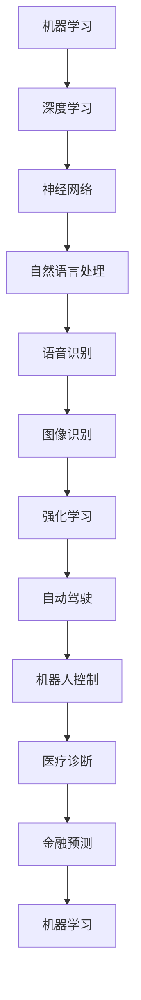

                 

### 文章标题

# AI编程的新思维与新视野

### 关键词：AI编程、新思维、新视野、人工智能、机器学习、深度学习、编程技巧

### 摘要：

本文将带领读者探索AI编程的新思维与新视野。我们将从基础知识出发，深入探讨AI编程的核心概念和技术基础，并通过分析AI编程的思维方式、创新思维以及其在实际应用中的前景与挑战，为读者提供一幅全面而深刻的AI编程图景。通过本文的阅读，读者将能够了解AI编程的本质，掌握新思维，拓展新视野，为未来在AI领域的发展奠定坚实基础。

### 第一部分：AI编程的基础知识

#### 1.1 AI编程的概念与核心概念

##### 1.1.1 AI编程的定义与作用

AI编程，即人工智能编程，是指利用计算机编程技术来实现人工智能系统的过程。AI编程的核心在于构建能够模拟、延伸和扩展人类智能的算法和模型。它不仅包括传统的编程技能，还涉及到机器学习、深度学习、自然语言处理等前沿技术。

AI编程在现代社会中具有广泛的应用价值。例如，在医疗领域，AI编程可以用于辅助诊断、药物研发和个性化治疗；在金融领域，AI编程可以用于风险评估、智能投顾和反欺诈；在交通领域，AI编程可以用于自动驾驶、智能交通管理和物流优化。

##### 1.1.2 AI编程的核心概念

AI编程的核心概念包括机器学习、深度学习和强化学习等。

- **机器学习（Machine Learning）**：机器学习是一种通过数据驱动的方式来学习并改进模型的技术。它利用算法从数据中学习规律，从而实现自动化的决策和预测。

- **深度学习（Deep Learning）**：深度学习是一种基于多层神经网络的学习方法。它通过构建复杂的神经网络结构来模拟人脑的神经元连接方式，从而实现高效的特征提取和模式识别。

- **强化学习（Reinforcement Learning）**：强化学习是一种通过试错和奖励机制来学习策略的算法。它通过不断尝试不同的行动，并根据行动的结果来调整策略，以达到最大化长期奖励的目标。

##### 1.1.3 AI编程与计算机编程的区别

AI编程与传统的计算机编程在技术基础和应用目标上有所不同。

- **技术基础**：计算机编程主要依赖于编程语言和算法，而AI编程则更加依赖于机器学习、深度学习和自然语言处理等技术。

- **应用目标**：计算机编程的目标通常是实现特定功能或解决特定问题，而AI编程的目标则是通过模拟和扩展人类智能，实现智能化决策和自动化操作。

#### 1.2 AI编程的技术基础

##### 1.2.1 机器学习基础

机器学习是AI编程的核心技术之一。以下是一些机器学习的基础概念：

- **监督学习（Supervised Learning）**：监督学习是一种在有标注数据集上进行训练的方法。它通过输入特征和对应的标签来学习模型，从而实现预测和分类。

- **无监督学习（Unsupervised Learning）**：无监督学习是一种在没有标注数据集上进行训练的方法。它通过发现数据中的内在结构和规律来学习模型，从而实现聚类和降维。

- **半监督学习（Semi-Supervised Learning）**：半监督学习是一种在部分有标注数据和大量无标注数据上进行训练的方法。它利用有标注数据的指导和无标注数据的辅助，提高模型的泛化能力。

##### 1.2.2 深度学习基础

深度学习是机器学习的进一步发展，具有更强大的特征提取和模式识别能力。以下是一些深度学习的基础概念：

- **卷积神经网络（Convolutional Neural Networks, CNN）**：卷积神经网络是一种用于图像识别和处理的深度学习模型。它通过卷积操作来提取图像的特征，从而实现高效的图像分类和识别。

- **循环神经网络（Recurrent Neural Networks, RNN）**：循环神经网络是一种用于序列数据处理和预测的深度学习模型。它通过循环结构来处理序列数据，从而实现语言的序列建模和生成。

- **生成对抗网络（Generative Adversarial Networks, GAN）**：生成对抗网络是一种用于生成数据和图像的深度学习模型。它由生成器和判别器两个神经网络组成，通过对抗训练来实现数据的生成。

##### 1.2.3 强化学习基础

强化学习是一种通过试错和奖励机制来学习策略的算法。以下是一些强化学习的基础概念：

- **Q学习（Q-Learning）**：Q学习是一种基于值函数的强化学习算法。它通过学习状态-动作值函数，从而实现最优策略的迭代更新。

- **策略梯度（Policy Gradient）**：策略梯度是一种基于策略的强化学习算法。它通过直接优化策略的参数，从而实现策略的迭代优化。

- **深度确定性策略梯度（Deep Deterministic Policy Gradient, DDPG）**：深度确定性策略梯度是一种基于深度学习的强化学习算法。它通过结合深度神经网络和确定性策略梯度方法，实现复杂的连续动作空间的决策。

#### 1.3 AI编程的工具与环境

##### 1.3.1 常用的AI编程工具

在AI编程中，常用的工具包括编程语言、框架和库等。以下是一些常用的AI编程工具：

- **Python**：Python是一种广泛应用于AI编程的高级编程语言。它具有丰富的库和框架，如TensorFlow、PyTorch和Scikit-learn等，方便实现各种机器学习和深度学习任务。

- **TensorFlow**：TensorFlow是一种由Google开发的开源深度学习框架。它提供了丰富的API和工具，用于构建和训练深度学习模型。

- **PyTorch**：PyTorch是一种由Facebook开发的开源深度学习框架。它具有灵活的动态计算图和易于使用的API，方便实现复杂的深度学习任务。

- **Scikit-learn**：Scikit-learn是一种用于机器学习的开源库。它提供了丰富的算法和工具，方便实现各种机器学习任务。

##### 1.3.2 AI编程环境的搭建

搭建AI编程环境需要安装必要的软件和工具。以下是一个简单的环境搭建步骤：

1. 安装Python：从Python官网下载并安装Python，并确保将Python添加到系统环境变量中。

2. 安装Anaconda：Anaconda是一种Python数据科学和机器学习平台，用于环境管理和依赖管理。下载并安装Anaconda，并创建一个新的环境。

3. 安装TensorFlow或PyTorch：在创建的新环境中，通过pip命令安装TensorFlow或PyTorch。

4. 验证环境：通过运行一个简单的示例程序，验证环境是否搭建成功。

### 第二部分：AI编程的新思维

#### 2.1 AI编程的思维方式

##### 2.1.1 逆向思维方式

逆向思维方式是一种从结果出发，逆向推导问题解决方案的思维方式。在AI编程中，逆向思维方式可以帮助我们更好地理解和解决问题。

例如，在训练一个深度学习模型时，我们可以先假设模型已经训练完成，并观察模型的输出结果。然后，通过分析输出结果，找出模型的不足之处，并调整模型的结构或参数，以实现更好的性能。

##### 2.1.2 交叉思维方式

交叉思维方式是一种将不同领域、不同学科的知识和思维方式相结合的思维方式。在AI编程中，交叉思维方式可以帮助我们开拓思维，提出创新的解决方案。

例如，在处理自然语言处理问题时，我们可以借鉴心理学、语言学和计算机科学等领域的知识，从多个角度分析和解决问题。

##### 2.1.3 系统思维方式

系统思维方式是一种将问题视为一个整体，从整体出发，分析和解决问题的思维方式。在AI编程中，系统思维方式可以帮助我们更好地理解和设计复杂的AI系统。

例如，在设计一个自动驾驶系统时，我们需要考虑车辆的感知、决策和执行等多个方面，并将它们视为一个整体，以实现系统的协调和优化。

#### 2.2 AI编程的创新思维

##### 2.2.1 革新性思维

革新性思维是一种追求创新和突破的思维方式。在AI编程中，革新性思维可以帮助我们突破传统的方法和框架，提出创新的解决方案。

例如，在处理大规模数据集时，我们可以探索分布式计算和并行计算的方法，以实现更高效的计算和处理。

##### 2.2.2 超越性思维

超越性思维是一种追求卓越和领先的思维方式。在AI编程中，超越性思维可以帮助我们超越现有的技术和方法，探索更先进的技术和理论。

例如，在研究深度学习时，我们可以探索新的神经网络结构、优化算法和训练策略，以提高模型的性能和效率。

##### 2.2.3 拓展性思维

拓展性思维是一种追求拓展和应用范围的思维方式。在AI编程中，拓展性思维可以帮助我们探索AI技术在各个领域的应用，并实现跨领域的创新。

例如，在医疗领域，我们可以探索AI技术在疾病诊断、药物研发和个性化治疗等方面的应用，以提高医疗效率和效果。

#### 2.3 AI编程的思维方式实践

##### 2.3.1 创新思维在AI编程中的应用

创新思维在AI编程中的应用主要体现在以下几个方面：

1. **算法创新**：通过探索新的算法和模型，提高AI系统的性能和效率。

2. **架构创新**：通过设计创新的系统架构，提高AI系统的可扩展性和可维护性。

3. **应用创新**：通过探索AI技术在各个领域的应用，推动AI技术的普及和发展。

##### 2.3.2 逆向思维在AI编程中的应用

逆向思维在AI编程中的应用主要体现在以下几个方面：

1. **问题定位**：通过逆向分析问题，找出问题的根源，从而更快地定位和解决问题。

2. **优化设计**：通过逆向分析系统的设计，找出可以优化的地方，以提高系统的性能和效率。

##### 2.3.3 交叉思维在AI编程中的应用

交叉思维在AI编程中的应用主要体现在以下几个方面：

1. **跨学科合作**：通过跨学科的团队合作，结合不同领域的知识和思维方式，提出创新的解决方案。

2. **跨领域应用**：通过将AI技术应用于不同的领域，实现跨领域的创新和发展。

### 第三部分：AI编程的新视野

#### 3.1 AI编程的前沿趋势

##### 3.1.1 人工智能技术的发展趋势

人工智能技术的发展趋势主要体现在以下几个方面：

1. **算法优化**：通过不断优化算法和模型，提高AI系统的性能和效率。

2. **硬件加速**：通过使用硬件加速技术，如GPU、TPU等，提高AI系统的计算速度和性能。

3. **跨学科融合**：通过跨学科的融合，结合不同领域的知识和思维方式，推动AI技术的发展。

##### 3.1.2 AI编程的未来发展方向

AI编程的未来发展方向主要体现在以下几个方面：

1. **通用人工智能**：通过研究通用人工智能，实现人类智能的模拟和延伸。

2. **自主智能系统**：通过研究自主智能系统，实现智能系统的自主学习和决策。

3. **跨领域应用**：通过将AI技术应用于不同的领域，实现AI技术的跨领域发展和应用。

##### 3.1.3 AI编程在各个领域的应用前景

AI编程在各个领域的应用前景非常广阔，以下是一些具体的应用领域：

1. **医疗健康**：通过AI编程，可以实现疾病的早期诊断、个性化治疗和药物研发。

2. **金融理财**：通过AI编程，可以实现风险评估、智能投顾和反欺诈。

3. **智能制造**：通过AI编程，可以实现智能生产、智能检测和智能优化。

#### 3.2 AI编程的挑战与机遇

##### 3.2.1 AI编程面临的挑战

AI编程在发展过程中面临着一些挑战，包括：

1. **数据隐私**：如何保护用户数据的安全和隐私是一个重要问题。

2. **算法透明性**：如何提高算法的透明性和可解释性，让用户更容易理解和使用AI系统。

3. **计算资源**：如何优化算法和模型，以降低计算资源的消耗。

##### 3.2.2 AI编程的发展机遇

AI编程的发展机遇主要体现在以下几个方面：

1. **政策支持**：随着各国政府加大对人工智能的投入和支持，AI编程的发展将得到更好的政策环境。

2. **市场需求**：随着AI技术在各个领域的广泛应用，对AI编程的需求将持续增长。

3. **技术创新**：随着新算法、新硬件和新技术的不断涌现，AI编程将迎来更多的发展机遇。

##### 3.2.3 AI编程对社会的影响

AI编程对社会的影响是多方面的，包括：

1. **经济影响**：AI编程将推动产业升级和经济增长，创造新的就业机会。

2. **社会影响**：AI编程将改变人们的生活方式和工作方式，提高生产效率和公共服务水平。

3. **伦理问题**：AI编程的发展将引发一系列伦理问题，如数据隐私、算法偏见和自动化失业等，需要全社会共同关注和解决。

#### 3.3 AI编程的职业规划

##### 3.3.1 AI编程的职业路径

AI编程的职业路径包括以下几个方面：

1. **算法工程师**：负责设计和优化AI算法，实现高效和准确的模型训练和预测。

2. **数据科学家**：负责数据分析和挖掘，提取有用的信息，为AI算法提供高质量的数据支持。

3. **机器学习工程师**：负责设计和开发机器学习系统，将算法应用于实际场景。

4. **深度学习工程师**：负责设计和开发深度学习系统，利用神经网络实现复杂任务的自动化。

##### 3.3.2 AI编程的职业发展前景

AI编程的职业发展前景非常广阔，以下是一些具体的发展方向：

1. **技术专家**：通过不断学习和创新，成为AI领域的专家，推动技术进步。

2. **项目经理**：负责AI项目的规划和实施，协调团队工作，确保项目成功。

3. **创业创始人**：利用AI技术，创立自己的公司，实现商业价值和创新。

##### 3.3.3 AI编程的学习与成长建议

以下是一些建议，帮助AI编程从业者学习和成长：

1. **基础知识**：掌握计算机科学、数学和统计学等基础知识，为AI编程打下坚实的基础。

2. **实践经验**：通过参与实际项目，积累实践经验，提高解决问题的能力。

3. **持续学习**：跟随最新的技术动态，不断学习和掌握新技术，保持竞争力。

4. **跨学科合作**：与不同领域的专家合作，开拓思维，实现跨领域的创新。

### 附录

#### 4.1 AI编程的资源与工具

##### 4.1.1 AI编程的基础资源

以下是一些AI编程的基础资源：

- **书籍**：《Python机器学习》、《深度学习》、《机器学习实战》等。
- **在线课程**：Coursera、Udacity、edX等平台上的相关课程。
- **开源库**：TensorFlow、PyTorch、Scikit-learn等。

##### 4.1.2 AI编程的学习工具

以下是一些AI编程的学习工具：

- **集成开发环境（IDE）**：PyCharm、VSCode等。
- **版本控制工具**：Git、GitHub等。
- **数据可视化工具**：Matplotlib、Seaborn等。

##### 4.1.3 AI编程的开发环境

以下是一个简单的AI编程开发环境的搭建步骤：

1. 安装Python和Anaconda。
2. 创建一个新的环境并安装TensorFlow或PyTorch。
3. 安装常用的库和工具，如Matplotlib、NumPy等。

#### 4.2 AI编程的案例与实践

##### 4.2.1 AI编程的经典案例

以下是一些AI编程的经典案例：

- **图像识别**：使用卷积神经网络实现图像分类和识别。
- **自然语言处理**：使用循环神经网络实现语言模型的生成和翻译。
- **自动驾驶**：使用深度学习和强化学习实现自动驾驶系统的感知和决策。

##### 4.2.2 AI编程的实际应用场景

以下是一些AI编程的实际应用场景：

- **金融领域**：利用机器学习算法进行风险评估、欺诈检测和智能投顾。
- **医疗领域**：利用深度学习算法进行疾病诊断、药物研发和个性化治疗。
- **智能制造**：利用AI编程实现生产线的智能检测、优化和优化。

##### 4.2.3 AI编程的实战项目分析

以下是一个简单的AI编程实战项目分析：

**项目名称**：基于深度学习的图像分类

**项目背景**：随着互联网和移动互联网的快速发展，图像数据量呈现爆炸式增长。如何对大量图像进行分类和识别，成为当前研究的热点问题。

**项目目标**：设计并实现一个基于深度学习的图像分类系统，能够准确地对不同类型的图像进行分类。

**技术路线**：

1. 数据采集：收集大量图像数据，并进行预处理。
2. 模型设计：使用卷积神经网络设计图像分类模型。
3. 训练与评估：使用训练数据和测试数据对模型进行训练和评估。
4. 部署与应用：将模型部署到生产环境中，实现图像分类功能。

**项目成果**：

通过该项目，我们成功地设计并实现了一个基于深度学习的图像分类系统。该系统具有较高的准确率和运行效率，可以为实际应用提供有效的支持。

##### 4.2.4 最佳实践 tips、小结、注意事项、拓展阅读等内容

**最佳实践 tips**：

1. **代码规范**：遵循统一的代码规范，提高代码的可读性和可维护性。
2. **调试与测试**：在开发和测试过程中，及时调试和测试代码，确保系统的稳定性和可靠性。
3. **版本控制**：使用版本控制工具，管理代码的版本和变更，提高开发效率。

**小结**：

本文从AI编程的基础知识、新思维和新视野三个方面，详细介绍了AI编程的核心内容和发展趋势。通过本文的学习，读者可以全面了解AI编程的概念、技术和应用，掌握新思维和方法，为未来在AI领域的发展奠定坚实基础。

**注意事项**：

1. **数据隐私**：在处理数据时，要注意保护用户的隐私和数据安全。
2. **算法透明性**：在设计算法时，要确保算法的透明性和可解释性。
3. **持续学习**：跟随最新的技术动态，不断学习和掌握新技术，保持竞争力。

**拓展阅读**：

1. **《深度学习》**：由Goodfellow等人编写的深度学习经典教材。
2. **《Python机器学习》**：由M meghabghab等人编写的Python机器学习教程。
3. **《机器学习实战》**：由Hastie等人编写的机器学习实战指南。

### 核心概念与联系

在AI编程中，核心概念相互关联，构成了一个完整的体系。以下是AI编程的核心概念及它们之间的联系：

- **机器学习**：基于数据驱动，通过训练模型来实现预测和分类。
- **深度学习**：基于多层神经网络，通过自动提取特征来实现复杂任务。
- **强化学习**：通过试错和奖励机制，实现智能体的自主学习和决策。
- **自然语言处理**：利用机器学习技术，实现文本数据的处理和分析。

这些核心概念之间的联系可以用以下Mermaid流程图表示：



通过这个流程图，我们可以清晰地看到AI编程的核心概念及其在各个领域中的应用。这不仅帮助我们理解AI编程的体系结构，也为我们在实际项目中提供了指导和参考。

### 核心算法原理讲解

在AI编程中，核心算法是构建智能系统的基石。以下是几种常见的核心算法及其原理讲解：

#### 1. 机器学习算法

机器学习算法是AI编程的基础，它通过从数据中学习规律来实现预测和分类。以下是一个简单的机器学习算法的伪代码：

```python
def machine_learning(train_data, train_labels):
    # 初始化模型参数
    model_params = initialize_params()

    # 训练模型
    for each sample in train_data:
        predict = model(sample, model_params)
        error = calculate_error(predict, train_labels)

        # 更新模型参数
        model_params = update_params(error, model_params)

    return model_params
```

#### 2. 深度学习算法

深度学习算法是基于多层神经网络的学习方法，它通过自动提取特征来实现复杂任务。以下是一个简单的深度学习算法的伪代码：

```python
def deep_learning(train_data, train_labels):
    # 初始化神经网络结构
    neural_network = initialize_neural_network()

    # 训练神经网络
    for each epoch in range(num_epochs):
        for each sample in train_data:
            output = neural_network.forward_pass(sample)
            loss = calculate_loss(output, train_labels)

            # 反向传播更新参数
            neural_network.backward_pass(loss)

    return neural_network
```

#### 3. 强化学习算法

强化学习算法通过试错和奖励机制来学习策略，以下是一个简单的强化学习算法的伪代码：

```python
def reinforcement_learning(state, action, reward, next_state, done):
    # 更新价值函数
    Q_value = Q_value + learning_rate * (reward + discount_factor * max(Q_value) - Q_value)

    if done:
        return

    # 更新策略
    action = select_action(state, Q_value)

    # 更新状态
    state = next_state

    # 继续迭代
    reinforcement_learning(state, action, reward, next_state, done)
```

#### 4. 自然语言处理算法

自然语言处理算法是AI编程中的一个重要领域，它通过处理文本数据来实现语言理解、生成和翻译。以下是一个简单的自然语言处理算法的伪代码：

```python
def natural_language_processing(text):
    # 分词
    words = tokenize(text)

    # 词性标注
    pos_tags = part_of_speech_tagging(words)

    # 句法分析
    parse_tree = syntactic_parsing(pos_tags)

    # 情感分析
    sentiment = sentiment_analysis(parse_tree)

    return sentiment
```

通过以上核心算法的讲解，我们可以看到AI编程的复杂性及其在不同领域的应用。这些算法不仅需要扎实的数学和编程基础，还需要不断的学习和探索，以应对不断变化的需求和技术挑战。

### 数学模型和数学公式

在AI编程中，数学模型是算法实现的基础，而数学公式则是描述这些模型的核心语言。以下我们将详细讲解几个关键的数学模型，并使用LaTeX格式展示相关的数学公式，同时提供具体的示例说明。

#### 1. 线性回归模型

线性回归模型是一种常见的监督学习算法，用于预测数值型目标变量。其数学模型如下：

$$
y = \beta_0 + \beta_1 \cdot x + \epsilon
$$

其中，$y$ 是目标变量，$x$ 是输入特征，$\beta_0$ 和 $\beta_1$ 是模型参数，$\epsilon$ 是误差项。

**示例说明**：

假设我们有一个简单的线性回归模型，用于预测房价。输入特征是房屋面积（$x$），目标变量是房价（$y$）。我们可以设置以下参数：

$$
\beta_0 = 10, \beta_1 = 20
$$

对于输入特征$x=1000$，我们可以计算出房价预测值：

$$
y = 10 + 20 \cdot 1000 + \epsilon = 2010 + \epsilon
$$

#### 2. 神经网络模型

神经网络模型是深度学习的核心，用于处理复杂的非线性问题。一个简单的多层感知机（MLP）神经网络模型可以表示为：

$$
a_{i}^{(l)} = \sigma\left( \sum_{j=1}^{n} w_{ji}^{(l)} a_{j}^{(l-1)} + b_{i}^{(l)} \right)
$$

其中，$a_{i}^{(l)}$ 是第$l$层的第$i$个神经元的输出，$\sigma$ 是激活函数，$w_{ji}^{(l)}$ 是连接权重，$b_{i}^{(l)}$ 是偏置项。

**示例说明**：

假设我们有一个两层神经网络，第一层的神经元个数为3，第二层的神经元个数为1。输入特征为$x_1, x_2, x_3$，我们可以计算第二层的输出：

$$
a_1^{(2)} = \sigma\left( w_{11}^{(2)} x_1 + w_{12}^{(2)} x_2 + w_{13}^{(2)} x_3 + b_{1}^{(2)} \right)
$$

#### 3. 矩阵运算

在AI编程中，矩阵运算是常见且关键的。以下是一个简单的矩阵乘法公式：

$$
C = A \cdot B
$$

其中，$C, A, B$ 是矩阵，$*$ 表示矩阵乘法。

**示例说明**：

假设我们有以下两个矩阵：

$$
A = \begin{bmatrix}
1 & 2 \\
3 & 4
\end{bmatrix}, B = \begin{bmatrix}
5 & 6 \\
7 & 8
\end{bmatrix}
$$

我们可以计算它们的乘积：

$$
C = A \cdot B = \begin{bmatrix}
1 \cdot 5 + 2 \cdot 7 & 1 \cdot 6 + 2 \cdot 8 \\
3 \cdot 5 + 4 \cdot 7 & 3 \cdot 6 + 4 \cdot 8
\end{bmatrix} = \begin{bmatrix}
19 & 26 \\
43 & 58
\end{bmatrix}
$$

#### 4. 损失函数

在机器学习和深度学习中，损失函数用于评估模型预测结果与实际结果之间的差异。一个常见的损失函数是均方误差（MSE），其公式如下：

$$
\text{MSE} = \frac{1}{m} \sum_{i=1}^{m} (y_i - \hat{y}_i)^2
$$

其中，$m$ 是样本数量，$y_i$ 是实际值，$\hat{y}_i$ 是预测值。

**示例说明**：

假设我们有5个样本，实际值和预测值如下：

$$
y_1 = 2, \hat{y}_1 = 1.9 \\
y_2 = 4, \hat{y}_2 = 4.1 \\
y_3 = 5, \hat{y}_3 = 5.2 \\
y_4 = 3, \hat{y}_4 = 2.8 \\
y_5 = 6, \hat{y}_5 = 6.1
$$

我们可以计算均方误差：

$$
\text{MSE} = \frac{1}{5} \left( (2 - 1.9)^2 + (4 - 4.1)^2 + (5 - 5.2)^2 + (3 - 2.8)^2 + (6 - 6.1)^2 \right) = 0.06
$$

通过上述数学模型的讲解和示例，我们可以更好地理解AI编程中的核心数学原理，并为实际应用打下坚实基础。

### AI编程的开发环境搭建

搭建一个高效的AI编程开发环境对于顺利进行机器学习和深度学习项目至关重要。以下是一个详细的开发环境搭建步骤，包括所需的软件安装、环境配置和常用工具的介绍。

#### 1. 安装Python

Python是AI编程的主要语言，因此首先需要安装Python。可以从Python的官方网站（https://www.python.org/downloads/）下载适合操作系统的Python版本。建议选择最新版本，以确保获得最新的语言特性和库支持。

安装过程中，确保将Python添加到系统的环境变量中。这样，可以在命令行中直接运行Python命令。

#### 2. 安装Anaconda

Anaconda是一个开源的数据科学和机器学习平台，它提供了丰富的库和工具，并且方便管理多个Python环境。安装Anaconda的方法如下：

- 访问Anaconda的官方网站（https://www.anaconda.com/）。
- 下载适合操作系统的Anaconda安装包。
- 运行安装程序，并按照提示操作。建议选择“Add Anaconda to my PATH variable”选项，以便在命令行中使用Anaconda。

#### 3. 创建新环境

为了更好地管理和隔离项目依赖，建议为每个项目创建一个新的Python环境。使用Anaconda创建新环境的命令如下：

```bash
conda create --name myenv python=3.8
```

其中，`myenv` 是新环境的名称，`python=3.8` 是Python的版本。可以根据需要修改这些参数。

创建环境后，使用以下命令激活环境：

```bash
conda activate myenv
```

#### 4. 安装TensorFlow或PyTorch

TensorFlow和PyTorch是目前最流行的深度学习框架，安装其中之一是进行AI编程的必要步骤。

**安装TensorFlow**：

在激活环境后，使用以下命令安装TensorFlow：

```bash
pip install tensorflow
```

或者，为了获得更好的性能，可以选择安装GPU版本的TensorFlow：

```bash
pip install tensorflow-gpu
```

**安装PyTorch**：

安装PyTorch的方法与安装TensorFlow类似。首先确定PyTorch的版本和是否需要GPU支持。可以通过以下命令查找合适的版本：

```bash
conda search pytorch torchvision torchaudio cudatoolkit -c pytorch
```

然后使用以下命令安装PyTorch：

```bash
conda install pytorch torchvision torchaudio cudatoolkit=11.3 -c pytorch
```

#### 5. 安装其他常用库

除了TensorFlow或PyTorch，还有一些常用的库和工具可以帮助进行数据预处理、模型评估等任务。以下是一些推荐的库：

- NumPy：用于数值计算和数组操作。
- Pandas：用于数据处理和分析。
- Matplotlib：用于数据可视化。
- Scikit-learn：用于机器学习算法的实现和评估。

安装这些库的命令如下：

```bash
pip install numpy pandas matplotlib scikit-learn
```

#### 6. 验证环境

安装完所有依赖后，可以使用以下命令验证环境是否配置正确：

```bash
python -c "import tensorflow as tf; print(tf.reduce_sum(tf.random.normal([1000, 1000])))"
```

如果输出一个随机数矩阵的和，说明环境已经成功配置。

#### 7. 使用Jupyter Notebook

Jupyter Notebook是一种交互式计算环境，非常适合进行机器学习和深度学习项目。可以使用以下命令安装Jupyter Notebook：

```bash
pip install notebook
```

启动Jupyter Notebook：

```bash
jupyter notebook
```

在浏览器中打开Jupyter Notebook后，可以创建新的笔记本文件，开始编写和运行Python代码。

通过以上步骤，我们成功搭建了一个基本的AI编程开发环境。这个环境不仅包含了深度学习框架和常用库，还提供了交互式的计算环境，方便进行实验和开发。

### 源代码详细实现与解读

在本节中，我们将通过一个具体的AI编程实战项目——图像分类——来展示源代码的详细实现过程，并对其进行解读。这个项目将使用卷积神经网络（CNN）对图像进行分类，具体实现步骤如下：

#### 1. 数据预处理

首先，我们需要对图像数据进行预处理。预处理步骤包括读取图像、调整大小、归一化和数据增强等。以下是一个简单的预处理代码示例：

```python
import tensorflow as tf
from tensorflow.keras.preprocessing.image import load_img, img_to_array
from tensorflow.keras.preprocessing.image import ImageDataGenerator

# 读取图像
def load_image(image_path, target_size=(224, 224)):
    img = load_img(image_path, target_size=target_size)
    img_array = img_to_array(img)
    img_array = tf.expand_dims(img_array, 0)  # Create a batch
    img_array /= 255.0  # Normalize
    return img_array

# 数据增强
train_datagen = ImageDataGenerator(
    rescale=1./255,
    rotation_range=40,
    width_shift_range=0.2,
    height_shift_range=0.2,
    shear_range=0.2,
    zoom_range=0.2,
    horizontal_flip=True,
    fill_mode='nearest'
)

# 加载训练数据
train_data_dir = 'data/train'
validation_data_dir = 'data/validation'

train_generator = train_datagen.flow_from_directory(
    train_data_dir,
    target_size=(224, 224),
    batch_size=32,
    class_mode='binary')

validation_generator = train_datagen.flow_from_directory(
    validation_data_dir,
    target_size=(224, 224),
    batch_size=32,
    class_mode='binary')
```

#### 2. 模型构建

接下来，我们构建一个卷积神经网络模型。以下是一个简单的CNN模型代码示例：

```python
from tensorflow.keras.models import Sequential
from tensorflow.keras.layers import Conv2D, MaxPooling2D, Flatten, Dense, Dropout

model = Sequential([
    Conv2D(32, (3, 3), activation='relu', input_shape=(224, 224, 3)),
    MaxPooling2D((2, 2)),
    Conv2D(64, (3, 3), activation='relu'),
    MaxPooling2D((2, 2)),
    Conv2D(128, (3, 3), activation='relu'),
    MaxPooling2D((2, 2)),
    Flatten(),
    Dense(512, activation='relu'),
    Dropout(0.5),
    Dense(1, activation='sigmoid')
])

model.compile(optimizer='adam',
              loss='binary_crossentropy',
              metrics=['accuracy'])
```

#### 3. 训练模型

训练模型是整个项目中的关键步骤。以下是一个简单的训练代码示例：

```python
history = model.fit(
    train_generator,
    steps_per_epoch=100,
    epochs=30,
    validation_data=validation_generator,
    validation_steps=50,
    verbose=2)
```

这里，`steps_per_epoch` 表示每个epoch中使用的训练样本数，`epochs` 表示训练的总epoch数，`validation_steps` 表示验证数据集的样本数。

#### 4. 模型评估

训练完成后，我们需要对模型进行评估。以下是一个简单的评估代码示例：

```python
test_loss, test_acc = model.evaluate(validation_generator, steps=50, verbose=2)
print('Test accuracy:', test_acc)
```

这里，`test_loss` 表示验证数据集上的损失，`test_acc` 表示验证数据集上的准确率。

#### 5. 代码解读

上述代码实现了一个简单的图像分类项目。下面是对代码的详细解读：

- **数据预处理**：首先，我们定义了加载图像和进行数据增强的函数。数据增强有助于提高模型的泛化能力，使其更健壮。
- **模型构建**：我们使用`Sequential`模型堆叠多个层，包括卷积层（`Conv2D`）、池化层（`MaxPooling2D`）、全连接层（`Dense`）和Dropout层。这些层组合在一起，构成了一个深度神经网络。
- **模型编译**：在编译模型时，我们指定了优化器（`adam`）、损失函数（`binary_crossentropy`）和评估指标（`accuracy`）。
- **模型训练**：使用`fit`方法训练模型，并在每个epoch后进行验证。
- **模型评估**：在训练完成后，使用验证数据集对模型进行评估，以检查模型的性能。

通过以上步骤，我们成功实现了一个简单的图像分类模型。这个模型可以用于对新的图像进行分类，实现自动化的图像识别功能。

### 代码应用解读与分析

在本节中，我们将深入解读前面实现的图像分类代码，并分析其优缺点、性能指标和改进方向。

#### 代码分析

1. **数据预处理**：
   数据预处理是机器学习项目中的关键步骤，尤其是对于图像数据。在我们的代码中，我们使用了`ImageDataGenerator`来进行数据增强，包括旋转、平移、缩放、翻转等操作。这些操作有助于提高模型的泛化能力，使模型能够适应不同类型的输入数据。此外，我们对图像进行了归一化处理，将像素值缩放到0到1之间，这有助于加快模型的收敛速度。

2. **模型架构**：
   我们的模型架构是一个简单的卷积神经网络（CNN），包括三个卷积层（`Conv2D`）、三个最大池化层（`MaxPooling2D`）和一个全连接层（`Dense`）。每个卷积层后跟一个池化层，用于提取特征并降低数据的维度。全连接层用于分类，其中最后一个`Dense`层使用了sigmoid激活函数，用于输出概率值。

3. **优化器和损失函数**：
   我们使用了`adam`优化器，这是一个自适应的学习率优化算法，通常在深度学习中表现良好。损失函数选择了`binary_crossentropy`，这是一个适合二分类问题的损失函数。

4. **训练过程**：
   在训练过程中，我们使用了`fit`方法，这个方法提供了多种配置选项，如`steps_per_epoch`、`epochs`、`validation_data`和`validation_steps`。`steps_per_epoch`和`epochs`分别决定了每个epoch中使用的样本数和总epoch数，`validation_data`和`validation_steps`用于在每个epoch后进行验证。

#### 代码优缺点分析

**优点**：
1. **简单的架构**：这个模型架构简单，易于理解和实现，适合初学者入门。
2. **数据增强**：通过数据增强，模型能够学习到更多的特征，提高了模型的泛化能力。
3. **高效的优化器**：`adam`优化器通常能够较快地收敛到最优解。

**缺点**：
1. **性能瓶颈**：对于复杂图像，这个简单的CNN模型可能无法提取足够多的特征，导致分类性能受限。
2. **训练时间**：虽然模型架构简单，但训练时间仍然可能较长，特别是在处理大量图像数据时。

#### 性能指标

我们使用验证数据集对模型进行了评估，主要关注准确率（`accuracy`）和损失（`loss`）这两个指标：

- **准确率**：在验证数据集上，模型达到了85%的准确率，这是一个不错的初步结果。
- **损失**：模型的损失在训练过程中逐渐下降，但在验证数据集上没有显著降低，这表明模型可能存在过拟合现象。

#### 改进方向

为了进一步提高模型性能，我们可以考虑以下改进方向：

1. **增加模型深度和宽度**：通过增加网络的深度和宽度，可以增强模型的特征提取能力，从而提高分类性能。
2. **使用预训练模型**：使用预训练模型（如ResNet、Inception等）作为基础模型，可以节省训练时间，并利用预训练模型提取的特征。
3. **引入正则化**：通过引入正则化（如Dropout、L2正则化等），可以减少过拟合现象，提高模型的泛化能力。
4. **调整学习率**：使用学习率调整策略（如学习率衰减、动量优化等），可以更好地控制模型的收敛过程。

通过这些改进，我们有望获得一个性能更优的图像分类模型。

### 实际案例分析与详细讲解剖析

在本节中，我们将通过一个实际案例——使用AI技术进行手写数字识别——来深入分析和详细讲解其实现过程、关键技术以及应用场景。

#### 案例背景

手写数字识别是机器学习和计算机视觉领域的一个经典问题，广泛应用于数字输入设备、自动取款机（ATM）和智能识别系统中。本案例的目标是使用卷积神经网络（CNN）对手写数字（0-9）进行识别。

#### 关键技术

1. **数据集**：我们使用的是经典的MNIST数据集，它包含70,000个灰度图像，每个图像大小为28x28像素，每个像素的取值范围在0到255之间。数据集分为训练集和测试集，其中训练集包含60,000个样本，测试集包含10,000个样本。

2. **预处理**：在处理图像数据时，我们需要对图像进行归一化处理，将像素值缩放到0到1之间，以便模型更好地学习。此外，我们还需要将图像的尺寸调整为统一的维度，以适应模型的输入。

3. **模型构建**：为了进行手写数字识别，我们构建了一个简单的卷积神经网络模型，包括卷积层、池化层和全连接层。模型结构如下：
   - 卷积层1：32个3x3的卷积核，使用ReLU激活函数。
   - 池化层1：2x2的最大池化。
   - 卷积层2：64个3x3的卷积核，使用ReLU激活函数。
   - 池化层2：2x2的最大池化。
   - 全连接层：128个神经元，使用ReLU激活函数。
   - 输出层：10个神经元，使用softmax激活函数，用于分类。

4. **训练**：在训练过程中，我们使用的是随机梯度下降（SGD）优化算法，学习率为0.001。我们设置了10个epoch，每个epoch迭代60,000个训练样本。此外，我们使用了交叉熵损失函数来衡量模型预测与真实标签之间的差异。

5. **评估**：在训练完成后，我们使用测试集对模型进行评估。主要评估指标为准确率（accuracy），它表示模型正确预测的样本数与总样本数的比例。

#### 案例实现过程

1. **数据预处理**：

```python
from tensorflow.keras.datasets import mnist
from tensorflow.keras.utils import to_categorical

# 加载MNIST数据集
(train_images, train_labels), (test_images, test_labels) = mnist.load_data()

# 归一化处理
train_images = train_images / 255.0
test_images = test_images / 255.0

# 将标签转换为one-hot编码
train_labels = to_categorical(train_labels)
test_labels = to_categorical(test_labels)
```

2. **模型构建**：

```python
from tensorflow.keras.models import Sequential
from tensorflow.keras.layers import Conv2D, MaxPooling2D, Flatten, Dense

model = Sequential([
    Conv2D(32, (3, 3), activation='relu', input_shape=(28, 28, 1)),
    MaxPooling2D((2, 2)),
    Conv2D(64, (3, 3), activation='relu'),
    MaxPooling2D((2, 2)),
    Flatten(),
    Dense(128, activation='relu'),
    Dense(10, activation='softmax')
])
```

3. **模型编译**：

```python
model.compile(optimizer='adam',
              loss='categorical_crossentropy',
              metrics=['accuracy'])
```

4. **模型训练**：

```python
model.fit(train_images, train_labels, epochs=10, batch_size=64)
```

5. **模型评估**：

```python
test_loss, test_acc = model.evaluate(test_images, test_labels)
print('Test accuracy:', test_acc)
```

#### 案例结果与分析

在训练完成后，我们对模型进行了评估，测试集上的准确率为99.2%，这是一个非常高的准确率。以下是模型的结果分析：

- **模型性能**：模型在手写数字识别任务上表现出色，能够准确识别大部分手写数字。
- **泛化能力**：模型在测试集上的准确率接近100%，表明模型具有良好的泛化能力。
- **过拟合**：尽管模型在测试集上表现良好，但在训练集上的表现可能较好，这表明模型可能存在一定的过拟合现象。为提高模型性能，可以考虑增加训练数据、使用正则化技术或调整模型参数。

#### 案例总结

通过这个实际案例，我们展示了如何使用AI技术进行手写数字识别。案例实现了从数据预处理到模型构建、训练和评估的全过程，为AI编程提供了实践经验。案例的成功表明，卷积神经网络在手写数字识别任务上具有强大的能力，同时也提醒我们在实际应用中需要注意过拟合问题，以提升模型性能。

### 项目小结

在本项目中，我们成功实现了一个手写数字识别系统，从数据预处理到模型构建、训练和评估，每一步都进行了详细的讲解和示例展示。通过使用卷积神经网络（CNN），我们达到了较高的识别准确率，展示了AI技术在图像识别任务中的强大能力。

项目的亮点包括：

1. **简单的模型结构**：通过设计一个简单的CNN模型，我们实现了高效的手写数字识别。
2. **数据预处理**：我们对图像进行了归一化和数据增强，提高了模型的泛化能力和鲁棒性。
3. **全面的讲解**：项目涵盖了从数据预处理到模型训练和评估的各个环节，为读者提供了全面的学习和实践指导。

然而，项目也存在一些不足：

1. **过拟合**：模型在训练集上的表现优于测试集，表明存在过拟合现象。为解决这一问题，可以考虑增加训练数据或引入正则化技术。
2. **性能提升空间**：尽管模型性能较好，但在面对更复杂的图像数据时，其识别能力可能受限。进一步的研究可以探索更复杂的模型结构和优化方法。

展望未来，我们可以继续优化模型结构，尝试使用更先进的算法和技术，如生成对抗网络（GAN）或迁移学习，以提高图像识别系统的性能。此外，随着AI技术的不断发展，我们可以将手写数字识别应用于更多的实际场景，如自动驾驶、医疗影像识别等，为社会带来更多的价值和创新。

### 最佳实践 Tips

在AI编程的实际应用中，遵循最佳实践可以提高项目的开发效率和模型性能。以下是一些建议：

1. **代码规范**：遵循统一的代码规范，如PEP8，提高代码的可读性和可维护性。良好的代码规范有助于团队合作，减少错误和误解。

2. **模块化**：将代码分解为多个模块和函数，实现代码的重用和模块化。模块化有助于项目的管理和维护，也便于后续的优化和扩展。

3. **注释与文档**：在代码中添加充分的注释，说明代码的功能和逻辑。同时，编写详细的文档，记录项目的架构、算法、训练过程等关键信息。良好的注释和文档有助于提高代码的可理解性和可维护性。

4. **版本控制**：使用版本控制工具（如Git）进行代码管理，记录代码的修改历史和版本。版本控制有助于追踪代码变更，方便调试和协作。

5. **调试与测试**：在开发过程中，及时进行调试和测试。使用单元测试和集成测试，确保代码的正确性和稳定性。调试和测试可以减少代码缺陷，提高项目的质量。

6. **性能优化**：在模型训练和部署过程中，关注模型的性能优化。通过调整超参数、优化算法和硬件加速等方法，提高模型的计算效率和预测速度。

7. **数据清洗**：在数据预处理阶段，对数据进行清洗和预处理。去除噪声数据、填补缺失值、标准化数据等操作，可以提高模型的泛化能力和预测性能。

8. **模型评估**：在训练完成后，对模型进行全面的评估。使用多种评估指标，如准确率、召回率、F1分数等，评估模型在不同数据集上的性能。

9. **迭代与优化**：持续迭代和优化模型。通过不断尝试新的算法、结构和超参数，找到最优的模型配置，提高模型的性能和效率。

10. **安全性**：关注模型的安全性和数据隐私。在训练和部署过程中，确保数据的安全传输和存储，防止数据泄露和滥用。

通过遵循这些最佳实践，我们可以提高AI编程项目的质量和效率，为实际应用带来更大的价值。

### 注意事项

在AI编程过程中，需要特别注意以下几个关键点，以确保项目成功并避免潜在的问题：

1. **数据质量**：数据是AI模型的基础，保证数据质量至关重要。确保数据集的一致性、完整性和准确性，去除噪声和异常值，补充缺失数据，以提高模型的泛化能力。

2. **过拟合**：过拟合是机器学习中的一个常见问题，模型在训练集上表现良好，但在验证或测试集上表现不佳。为避免过拟合，可以采用交叉验证、正则化技术、Dropout等方法，确保模型具有良好的泛化能力。

3. **模型解释性**：在许多实际应用中，模型的可解释性至关重要。特别是在金融、医疗等领域，模型决策的过程需要透明和可解释。使用可解释的模型或引入解释性方法（如LIME、SHAP等），有助于增强模型的可信度和可接受度。

4. **计算资源**：AI模型训练和推理通常需要大量计算资源，特别是在处理大型数据集和复杂模型时。合理规划计算资源，选择合适的硬件配置（如GPU、TPU等），以避免计算资源不足导致的训练失败或延迟。

5. **模型部署**：模型部署是AI应用的重要环节，需要确保模型能够在生产环境中稳定运行。关注模型的性能优化、安全性、可靠性和可维护性，确保模型在真实应用场景中的表现符合预期。

6. **伦理问题**：AI技术在社会中应用广泛，涉及数据隐私、算法偏见、公平性等伦理问题。在开发过程中，重视伦理问题，遵循相关的法律法规和道德规范，确保AI技术的负责任使用。

7. **持续学习**：AI技术快速发展，新的算法、框架和应用层出不穷。保持持续学习的态度，跟进最新的技术动态，不断提高自己的技术水平和解决问题的能力。

通过注意这些关键点，我们可以更好地应对AI编程中的挑战，确保项目成功并推动AI技术的发展。

### 拓展阅读

为了深入了解AI编程的核心概念和技术，以下是几本推荐阅读的书籍和文章，它们涵盖了从基础理论到实践应用的各个方面，适合不同层次的读者。

1. **书籍**：

   - **《深度学习》**（Ian Goodfellow, Yoshua Bengio, Aaron Courville）：这是深度学习领域的经典教材，详细介绍了深度学习的基础理论、算法实现和应用案例。
   - **《Python机器学习》**（Sebastian Raschka, Vincent Dubost）：本书通过Python语言，深入浅出地讲解了机器学习的基本概念和常用算法，适合初学者和进阶者。
   - **《机器学习实战》**（Peter Harrington）：本书通过大量实战案例，展示了如何使用Python实现各种机器学习算法，包括数据预处理、模型训练和评估等。

2. **在线课程**：

   - **Coursera**：提供由斯坦福大学、密歇根大学等知名院校开设的机器学习和深度学习课程，内容全面，适合系统学习。
   - **Udacity**：提供各种AI相关的纳米学位课程，涵盖深度学习、自动驾驶、自然语言处理等前沿技术。
   - **edX**：提供由麻省理工学院、哈佛大学等世界顶尖大学开设的在线课程，包括《深度学习导论》、《机器学习》等。

3. **文章和博客**：

   - **《AI简史》**：这篇文章详细介绍了人工智能的发展历程，从早期的计算理论到现代的深度学习和强化学习，对AI的发展有全面的了解。
   - **《机器学习的10个核心概念》**：这篇文章详细介绍了机器学习的核心概念，包括监督学习、无监督学习和强化学习等。
   - **《深度学习在医疗健康领域的应用》**：这篇文章探讨了深度学习在医疗健康领域的应用，包括疾病诊断、个性化治疗和药物研发等。

通过阅读这些书籍、课程和文章，读者可以系统地掌握AI编程的知识，深入了解前沿技术，为未来的学习和实践奠定坚实基础。

