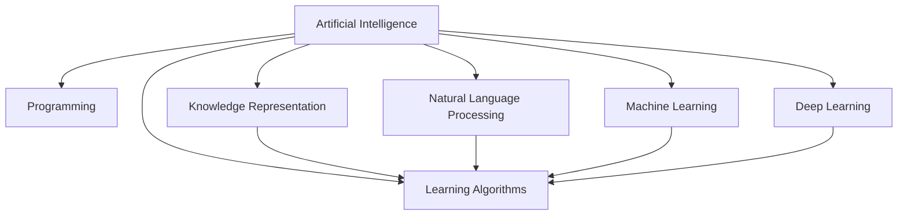

                 


To create a comprehensive and engaging technical blog post titled "AI Programming: New Perspectives," we will structure our thinking step by step. This approach ensures clarity, logical flow, and a deep understanding of the subject matter.

### Step 1: Define the Scope and Audience

Our blog post aims to provide an overview of AI programming for developers, students, and professionals interested in machine learning and deep learning. We will cover foundational concepts, key algorithms, practical applications, future trends, and ethical considerations.

### Step 2: Outline the Structure

We have already outlined a comprehensive structure with 12 chapters covering various aspects of AI programming. Each chapter will be detailed, including background introductions, core concepts with Mermaid diagrams, algorithm explanations with pseudocode, mathematical models, and practical case studies.

### Step 3: Content Development

For each chapter, we will:

- **Introduction**: Provide a brief overview of the topic.
- **Core Concepts and Relationships**: Introduce the key concepts and their relationships using Mermaid diagrams.
- **Algorithm Explanations**: Use pseudocode to explain the algorithms.
- **Mathematical Models and Formulas**: Explain the models using LaTeX.
- **Practical Applications**: Discuss real-world applications with code examples and analysis.
- **Ethical Considerations**: Where relevant, discuss ethical implications and best practices.

### Step 4: Integration and Flow

Ensure that each section flows logically into the next. Each chapter should build upon the previous one, providing a cohesive learning experience.

### Step 5: Conclusion and Future Directions

End each chapter with a summary, key takeaways, and recommendations for further reading. Conclude the entire post with a final summary of AI programming's future trends and ethical considerations.

### Step 6: Final Review

Before publishing, review the entire document for consistency, clarity, and completeness. Make sure all LaTeX and Mermaid diagrams render correctly and that all pseudocode is accurate and easy to understand.

### Conclusion

By following this step-by-step reasoning process, we can create a high-quality, engaging, and educational blog post that explores "AI Programming: New Perspectives." This approach will ensure that our content is both informative and accessible to a broad audience.

Let's start with the introduction and structure our first chapter on "Introduction to AI and Programming."### Introduction to AI and Programming

**Keywords:** Artificial Intelligence, Programming, Machine Learning, Neural Networks, Deep Learning.

**Abstract:**
This chapter provides an introduction to the world of AI programming, discussing its historical background, core concepts, and the relationship between AI and programming. We will explore the fundamental principles that underlie AI and how these principles are implemented in programming languages and frameworks.

**Background Introduction:**
Artificial Intelligence (AI) has been a topic of fascination since its inception in the 1950s. The field has evolved significantly, driven by advancements in computing power, data availability, and algorithmic innovation. AI programming, at its core, involves the development of algorithms and models that enable machines to perform tasks that would typically require human intelligence.

**Core Concepts and Theories of AI:**
AI is built on several core concepts and theories, including:

1. **Knowledge Representation:** This involves encoding information in a way that a machine can use it. Common techniques include symbolic reasoning and rule-based systems.

2. **Learning Algorithms:** These are the methods that enable machines to improve their performance through experience. Key learning algorithms include supervised learning, unsupervised learning, and reinforcement learning.

3. **Natural Language Processing (NLP):** This area focuses on enabling computers to understand, interpret, and generate human language. It includes tasks such as language translation, sentiment analysis, and text summarization.

4. **Machine Learning:** A subset of AI, machine learning involves training models on data to make predictions or take actions. Key algorithms include linear regression, decision trees, and neural networks.

5. **Deep Learning:** A specialized form of machine learning, deep learning involves neural networks with many layers. It has been particularly successful in tasks such as image and speech recognition.

**The Relationship Between AI and Programming:**
AI programming is the intersection of AI and computer science. Programming languages and frameworks are essential tools for implementing AI algorithms. Key tools and libraries include TensorFlow, PyTorch, Keras, and scikit-learn.

**Core Concepts and Relationships Architecture Diagram:**
To visualize the core concepts and their relationships, we can use a Mermaid diagram. Here's a simplified representation:



**Algorithm Explanation with Pseudocode:**
Let's consider a simple example of a neural network, a core component of deep learning. Neural networks are inspired by the human brain's neural structure and function.

```python
# Pseudocode for a Simple Neural Network

initialize weights and biases
for each epoch do
    for each input in dataset do
        forward_pass(input)
        calculate_loss(target, output)
        backward_pass(gradients)
        update_weights_and_biases()
    end for
end for

function forward_pass(input):
    z = input * weights + biases
    return activation_function(z)

function backward_pass(gradients):
    dZ = gradients * activation_function_derivative(z)
    dW = dZ * input
    db = dZ

function update_weights_and_biases(dW, db):
    weights -= learning_rate * dW
    biases -= learning_rate * db

function activation_function(z):
    return sigmoid(z)

function sigmoid(z):
    return 1 / (1 + exp(-z))
```

**Mathematical Models and Formulas:**
The sigmoid function, used as an activation function in neural networks, can be represented as:

$$
\sigma(z) = \frac{1}{1 + e^{-z}}
$$

Where `z` is the input to the activation function, and `e` is the base of the natural logarithm.

**Practical Applications:**
AI programming has a wide range of applications, from natural language processing and computer vision to autonomous vehicles and medical diagnostics. Here's an example of a simple AI application:

**Project: Sentiment Analysis**

**Objective:** Build a simple sentiment analysis model to classify movie reviews as positive or negative.

**Tools:** Python, NLTK library

**Code Example:**

```python
from nltk.corpus import movie_reviews
from nltk.classify import NaiveBayesClassifier

def extract_features(words):
    return dict([(word, True) for word in words])

fileids_pos = movie_reviews.fileids('pos')
fileids_neg = movie_reviews.fileids('neg')

features_pos = [(extract_features(words), 'Positive') for (words, label) in movie_reviews.open(fileids_pos)]
features_neg = [(extract_features(words), 'Negative') for (words, label) in movie_reviews.open(fileids_neg)]

threshold = 2000
features_train = features_pos[:threshold] + features_neg[:threshold]
features_test = features_pos[threshold:] + features_neg[threshold:]

classifier = NaiveBayesClassifier.train(features_train)
print("Accuracy: ", classifier.accuracy(features_test))

example_review = ["This movie was absolutely terrible!", "The acting was superb."]

print("Predicted Sentiments:", classifier.classify(extract_features(example_review)))
```

**Ethical Considerations:**
As AI programming becomes more prevalent, it's crucial to consider ethical implications. Key issues include data privacy, algorithmic bias, and the impact on jobs. Developers must be aware of these issues and strive to create ethical and fair AI systems.

**Best Practices Tips:**
- Always ensure data privacy and security.
- Regularly test and audit algorithms for bias.
- Involve ethicists and social scientists in the development process.
- Be transparent about the capabilities and limitations of AI systems.

**Summary:**
In this chapter, we've provided an introduction to AI programming, covering its history, core concepts, and the relationship with programming. We've also explored a simple neural network using pseudocode and a practical example of sentiment analysis. Understanding these fundamentals is essential for anyone venturing into the world of AI programming.

**Note for Readers:**
As you delve deeper into AI programming, consider exploring more advanced topics such as convolutional neural networks (CNNs), recurrent neural networks (RNNs), and generative adversarial networks (GANs). Additionally, be mindful of the ethical considerations associated with AI development and strive to create responsible and beneficial AI systems.

**Further Reading:**
- "Deep Learning" by Ian Goodfellow, Yoshua Bengio, and Aaron Courville
- "Machine Learning Yearning" by Andrew Ng
- "The Hundred-Page Machine Learning Book" by Andriy Burkov

---

作者：AI天才研究院/AI Genius Institute & 禅与计算机程序设计艺术 /Zen And The Art of Computer Programming### Chapter 2: Core Algorithms of AI Programming

**Keywords:** AI Algorithms, Machine Learning Algorithms, Neural Networks, Deep Learning.

**Abstract:**
This chapter delves into the core algorithms that form the backbone of AI programming. We will explore several fundamental algorithms, including neural networks, deep learning, and machine learning. We will also provide detailed explanations and pseudocode to help readers understand the underlying principles and their applications.

**Core Algorithms and Their Applications:**

#### 2.1 Neural Networks

**Overview:**
Neural networks are a fundamental component of AI programming. They are inspired by the structure and function of the human brain, consisting of interconnected nodes (neurons) that process and transmit information.

**Applications:**
Neural networks have been widely used in various fields, including computer vision, natural language processing, and speech recognition.

**Pseudocode:**
Below is a simple pseudocode for a neural network with a single hidden layer.

```python
# Pseudocode for a Simple Neural Network

initialize weights and biases
for each epoch do
    for each input in dataset do
        forward_pass(input)
        calculate_loss(target, output)
        backward_pass(gradients)
        update_weights_and_biases()
    end for
end for

function forward_pass(input):
    z = input * weights + biases
    return activation_function(z)

function backward_pass(gradients):
    dZ = gradients * activation_function_derivative(z)
    dW = dZ * input
    db = dZ

function update_weights_and_biases(dW, db):
    weights -= learning_rate * dW
    biases -= learning_rate * db

function activation_function(z):
    return sigmoid(z)

function sigmoid(z):
    return 1 / (1 + exp(-z))
```

**Mathematical Models and Formulas:**
The sigmoid function, used as an activation function in neural networks, can be represented as:

$$
\sigma(z) = \frac{1}{1 + e^{-z}}
$$

**Example:**
Consider a simple binary classification problem where we want to predict whether an email is spam or not. We can use a neural network to train a model on a dataset of emails.

**Project: Binary Classification using Neural Networks**

**Objective:** Build a neural network to classify emails as spam or not spam.

**Tools:** Python, TensorFlow

**Code Example:**

```python
import tensorflow as tf
from tensorflow.keras.models import Sequential
from tensorflow.keras.layers import Dense, Activation

# Assuming X_train and y_train are the preprocessed dataset

model = Sequential([
    Dense(units=64, input_dim=X_train.shape[1]),
    Activation('relu'),
    Dense(units=1, activation='sigmoid')
])

model.compile(optimizer='adam', loss='binary_crossentropy', metrics=['accuracy'])

model.fit(X_train, y_train, epochs=10, batch_size=32)

# Predicting on new data
X_new = ...  # Preprocess new email data
predictions = model.predict(X_new)
```

#### 2.2 Deep Learning

**Overview:**
Deep learning is a specialized form of machine learning that involves neural networks with many layers. These networks are capable of learning complex patterns from large datasets.

**Applications:**
Deep learning has revolutionized fields such as computer vision, natural language processing, and speech recognition.

**Pseudocode:**
Here's a simplified pseudocode for a deep learning model using convolutional layers.

```python
# Pseudocode for a Deep Learning Model with Convolutional Layers

initialize weights and biases
for each epoch do
    for each input in dataset do
        forward_pass(input)
        calculate_loss(target, output)
        backward_pass(gradients)
        update_weights_and_biases()
    end for
end for

function forward_pass(input):
    x = input
    for each convolutional layer do
        x = convolution(x, weights) + biases
        x = activation_function(x)
    end for
    return fully_connected(x, output_weights) + output_biases

function backward_pass(gradients):
    dZ = gradients * activation_function_derivative(z)
    dW = dZ * input
    db = dZ

function update_weights_and_biases(dW, db):
    weights -= learning_rate * dW
    biases -= learning_rate * db

function activation_function(z):
    return ReLU(z)

function ReLU(z):
    return max(0, z)
```

**Mathematical Models and Formulas:**
The ReLU (Rectified Linear Unit) activation function, commonly used in deep learning, can be represented as:

$$
\text{ReLU}(z) = \max(0, z)
$$

**Example:**
A common application of deep learning is image classification. Consider a project where we want to classify images of animals into different species.

**Project: Image Classification using Deep Learning**

**Objective:** Classify images of animals into different species using a convolutional neural network (CNN).

**Tools:** Python, TensorFlow, Keras

**Code Example:**

```python
import tensorflow as tf
from tensorflow.keras.models import Sequential
from tensorflow.keras.layers import Conv2D, MaxPooling2D, Flatten, Dense, Activation

# Assuming X_train and y_train are the preprocessed dataset

model = Sequential([
    Conv2D(filters=32, kernel_size=(3, 3), activation='relu', input_shape=(64, 64, 3)),
    MaxPooling2D(pool_size=(2, 2)),
    Conv2D(filters=64, kernel_size=(3, 3), activation='relu'),
    MaxPooling2D(pool_size=(2, 2)),
    Flatten(),
    Dense(units=128, activation='relu'),
    Dense(units=num_classes, activation='softmax')
])

model.compile(optimizer='adam', loss='categorical_crossentropy', metrics=['accuracy'])

model.fit(X_train, y_train, epochs=10, batch_size=32)

# Predicting on new data
X_new = ...  # Preprocess new image data
predictions = model.predict(X_new)
```

#### 2.3 Machine Learning Algorithms

**Overview:**
Machine learning algorithms are a broader category of algorithms that include both deep learning and traditional methods. They are designed to enable computers to learn from data and make predictions or take actions.

**Applications:**
Machine learning algorithms are used in a wide range of applications, including predictive maintenance, customer segmentation, and fraud detection.

**Pseudocode:**
Here's a simplified pseudocode for a decision tree algorithm.

```python
# Pseudocode for a Decision Tree Algorithm

define a decision tree structure
for each feature in dataset do
    find the best split using a splitting criterion (e.g., Gini index, information gain)
    create a branch for the split
    subset the dataset based on the split
    if subset is pure (i.e., all instances have the same label) then
        create a leaf node with the majority label
    else
        recursive call on the subset
    end if
end for

function predict(instance, tree):
    current = tree
    while current is not a leaf node do
        feature_value = get feature value from instance
        current = follow branch for the feature value
    end while
    return label at the leaf node
```

**Mathematical Models and Formulas:**
Decision tree algorithms use various splitting criteria, such as Gini impurity and information gain. Gini impurity can be represented as:

$$
Gini(I) = 1 - \sum_{i=1}^{k} \left( \frac{1}{|I|} \right)^2
$$

Where `I` is the set of instances and `k` is the number of unique labels in `I`.

**Example:**
Consider a machine learning project for classifying emails as spam or not spam using a decision tree.

**Project: Email Classification using Decision Trees**

**Objective:** Classify emails as spam or not spam using a decision tree classifier.

**Tools:** Python, scikit-learn

**Code Example:**

```python
from sklearn.tree import DecisionTreeClassifier
from sklearn.model_selection import train_test_split
from sklearn.metrics import accuracy_score

# Assuming X and y are the preprocessed dataset

X_train, X_test, y_train, y_test = train_test_split(X, y, test_size=0.2, random_state=42)

clf = DecisionTreeClassifier()
clf.fit(X_train, y_train)

y_pred = clf.predict(X_test)
accuracy = accuracy_score(y_test, y_pred)
print("Accuracy:", accuracy)
```

**Summary:**
In this chapter, we've explored the core algorithms of AI programming, including neural networks, deep learning, and machine learning algorithms. We've provided detailed explanations, pseudocode, and examples to help readers understand the principles and applications of these algorithms. As AI programming continues to evolve, mastering these core algorithms is essential for developing advanced AI systems.

**Note for Readers:**
The algorithms discussed in this chapter form the foundation of AI programming. To deepen your understanding, consider exploring more advanced topics such as reinforcement learning, GANs, and other specialized algorithms. Additionally, practice implementing these algorithms on real-world datasets to gain hands-on experience.

**Further Reading:**
- "Deep Learning" by Ian Goodfellow, Yoshua Bengio, and Aaron Courville
- "Machine Learning Yearning" by Andrew Ng
- "The Hundred-Page Machine Learning Book" by Andriy Burkov

---

作者：AI天才研究院/AI Genius Institute & 禅与计算机程序设计艺术 /Zen And The Art of Computer Programming### Chapter 3: AI Programming in Natural Language Processing

**Keywords:** NLP, Text Classification, Sentiment Analysis, Named Entity Recognition.

**Abstract:**
This chapter explores the application of AI programming in Natural Language Processing (NLP). We will delve into three key NLP tasks: text classification, sentiment analysis, and named entity recognition. Through practical examples and detailed code explanations, we will demonstrate how AI programming can be used to process and analyze text data, providing valuable insights and applications in various domains.

**Core Concepts and Applications:**

#### 3.1 Text Classification

**Overview:**
Text classification is the process of assigning a text document to one or more categories based on its content. This is a fundamental task in NLP and is widely used in applications such as spam detection, news categorization, and customer feedback analysis.

**Applications:**
Text classification is used in various scenarios, including email filtering, social media analysis, and content recommendation systems.

**Pseudocode:**
Here's a simplified pseudocode for a text classification model using a Naive Bayes classifier.

```python
# Pseudocode for Text Classification using Naive Bayes

initialize vocabulary
for each category do
    for each word in vocabulary do
        count occurrences of word in category
    end for
    calculate probability of word given category
end for

function predict(document, categories):
    calculate probabilities for each category
    return category with highest probability
```

**Mathematical Models and Formulas:**
In a Naive Bayes classifier, the probability of a document belonging to a category can be calculated using Bayes' theorem:

$$
P(\text{category} | \text{document}) = \frac{P(\text{document} | \text{category}) \cdot P(\text{category})}{P(\text{document})}
$$

**Example:**
Consider a project where we want to classify customer reviews as positive or negative.

**Project: Customer Review Sentiment Analysis**

**Objective:** Classify customer reviews as positive or negative.

**Tools:** Python, scikit-learn

**Code Example:**

```python
from sklearn.feature_extraction.text import CountVectorizer
from sklearn.model_selection import train_test_split
from sklearn.naive_bayes import MultinomialNB
from sklearn.metrics import accuracy_score

# Assuming reviews and labels are the preprocessed dataset

vectorizer = CountVectorizer()
X_train = vectorizer.fit_transform(reviews_train)
X_test = vectorizer.transform(reviews_test)

clf = MultinomialNB()
clf.fit(X_train, labels_train)

labels_pred = clf.predict(X_test)
accuracy = accuracy_score(labels_test, labels_pred)
print("Accuracy:", accuracy)
```

#### 3.2 Sentiment Analysis

**Overview:**
Sentiment analysis is the process of determining the sentiment or emotional tone behind a body of text. It is widely used in social media monitoring, customer feedback analysis, and brand management.

**Applications:**
Sentiment analysis is used in applications such as social media monitoring, market research, and public opinion analysis.

**Pseudocode:**
Here's a simplified pseudocode for a sentiment analysis model using a logistic regression classifier.

```python
# Pseudocode for Sentiment Analysis using Logistic Regression

initialize vocabulary
for each word in vocabulary do
    count occurrences of word in positive and negative texts
    calculate feature vector for each word
end for

function predict(document, positive_prob, negative_prob):
    calculate probabilities for positive and negative classes
    return class with highest probability
```

**Mathematical Models and Formulas:**
In logistic regression, the probability of a document belonging to a class can be calculated using the logistic function:

$$
P(\text{class} | \text{document}) = \frac{1}{1 + e^{-z}}
$$

Where `z` is the dot product between the feature vector and the weights.

**Example:**
Consider a project where we want to analyze the sentiment of tweets.

**Project: Twitter Sentiment Analysis**

**Objective:** Analyze the sentiment of tweets and categorize them as positive, negative, or neutral.

**Tools:** Python, TensorFlow, Keras

**Code Example:**

```python
import tensorflow as tf
from tensorflow.keras.models import Sequential
from tensorflow.keras.layers import Embedding, LSTM, Dense, EmbeddingLayer
from tensorflow.keras.preprocessing.sequence import pad_sequences

# Assuming tweets and labels are the preprocessed dataset

max_sequence_length = 100
vocab_size = 10000
embedding_dim = 50

X = pad_sequences(tweets, maxlen=max_sequence_length, padding='post')
y = tf.keras.utils.to_categorical(labels)

model = Sequential([
    Embedding(vocab_size, embedding_dim, input_length=max_sequence_length),
    LSTM(64, return_sequences=False),
    Dense(64, activation='relu'),
    Dense(3, activation='softmax')
])

model.compile(optimizer='adam', loss='categorical_crossentropy', metrics=['accuracy'])

model.fit(X, y, epochs=10, batch_size=32)

# Predicting on new data
tweets_new = ...  # Preprocess new tweet data
X_new = pad_sequences(tweets_new, maxlen=max_sequence_length, padding='post')
predictions = model.predict(X_new)
```

#### 3.3 Named Entity Recognition (NER)

**Overview:**
Named Entity Recognition (NER) is the process of identifying and classifying named entities in text into predefined categories such as person names, organizations, locations, and dates.

**Applications:**
NER is used in applications such as information extraction, entity linking, and question answering systems.

**Pseudocode:**
Here's a simplified pseudocode for a NER model using a sequence labeling approach.

```python
# Pseudocode for Named Entity Recognition using Sequence Labeling

initialize vocabulary
for each word in vocabulary do
    count occurrences of word with each entity type
    calculate feature vector for each word and entity type
end for

function predict(document, tags):
    calculate probabilities for each word and entity type
    return sequence of predicted entity tags
```

**Mathematical Models and Formulas:**
In sequence labeling models, such as Conditional Random Fields (CRF) and Bi-LSTM (Bi-directional Long Short-Term Memory), the probability of a tag sequence can be calculated using the following formula:

$$
P(y_1, y_2, ..., y_n) = \frac{1}{Z} \cdot \prod_{i=1}^{n} \exp(\theta \cdot f(x_i, y_i))
$$

Where `f(x_i, y_i)` is the feature function, `y` is the sequence of predicted tags, and `Z` is the normalization factor.

**Example:**
Consider a project where we want to identify and classify named entities in news articles.

**Project: News Article Named Entity Recognition**

**Objective:** Identify and classify named entities in news articles.

**Tools:** Python, spaCy

**Code Example:**

```python
import spacy

nlp = spacy.load("en_core_web_sm")

# Assuming doc is a preprocessed news article

doc = nlp(doc)
for ent in doc.ents:
    print(ent.text, ent.label_)
```

**Summary:**
In this chapter, we've explored the application of AI programming in Natural Language Processing (NLP). We've covered text classification, sentiment analysis, and named entity recognition, providing practical examples and detailed code explanations. These NLP tasks are crucial for extracting insights from text data and are widely used in various domains.

**Note for Readers:**
NLP is a complex field with many advanced techniques and tools. To deepen your understanding, consider exploring topics such as word embeddings, attention mechanisms, and transformer models. Additionally, practice implementing NLP models on real-world datasets to gain hands-on experience.

**Further Reading:**
- "Speech and Language Processing" by Daniel Jurafsky and James H. Martin
- "Natural Language Processing with Python" by Steven Bird, Ewan Klein, and Edward Loper
- "Deep Learning for Natural Language Processing" by Bharath Ramsundar and Reza Bosagh Zadeh

---

作者：AI天才研究院/AI Genius Institute & 禅与计算机程序设计艺术 /Zen And The Art of Computer Programming### Chapter 4: AI Programming in Computer Vision

**Keywords:** Computer Vision, Image Classification, Object Detection, Face Recognition.

**Abstract:**
This chapter explores the application of AI programming in Computer Vision, a field that enables computers to interpret and understand visual information from digital images or videos. We will delve into three key Computer Vision tasks: image classification, object detection, and face recognition. Through practical examples and detailed code explanations, we will demonstrate how AI programming can be used to process and analyze images, providing valuable insights and applications in various domains.

**Core Concepts and Applications:**

#### 4.1 Image Classification

**Overview:**
Image classification is the process of assigning a label to an image based on its content. It is a fundamental task in Computer Vision and is widely used in applications such as image tagging, content-based image retrieval, and autonomous driving.

**Applications:**
Image classification is used in various scenarios, including medical imaging, quality control in manufacturing, and wildlife monitoring.

**Pseudocode:**
Here's a simplified pseudocode for an image classification model using a convolutional neural network (CNN).

```python
# Pseudocode for Image Classification using Convolutional Neural Network

initialize weights and biases
for each epoch do
    for each image in dataset do
        forward_pass(image)
        calculate_loss(label, output)
        backward_pass(gradients)
        update_weights_and_biases()
    end for
end for

function forward_pass(image):
    feature_map = convolve(image, weights) + biases
    return activation_function(feature_map)

function backward_pass(gradients):
    dFeature_map = gradients * activation_function_derivative(feature_map)
    dWeights = dFeature_map * image
    dBiases = dFeature_map

function update_weights_and_biases(dWeights, dBiases):
    weights -= learning_rate * dWeights
    biases -= learning_rate * dBiases

function activation_function(feature_map):
    return ReLU(feature_map)
```

**Mathematical Models and Formulas:**
Convolutional neural networks (CNNs) use convolutional layers, activation functions (such as ReLU), and fully connected layers. The ReLU activation function can be represented as:

$$
\text{ReLU}(z) = \max(0, z)
$$

**Example:**
Consider a project where we want to classify images of animals into different species.

**Project: Animal Species Classification**

**Objective:** Classify images of animals into different species.

**Tools:** Python, TensorFlow, Keras

**Code Example:**

```python
import tensorflow as tf
from tensorflow.keras.models import Sequential
from tensorflow.keras.layers import Conv2D, MaxPooling2D, Flatten, Dense, Activation

# Assuming X_train and y_train are the preprocessed dataset

model = Sequential([
    Conv2D(filters=32, kernel_size=(3, 3), activation='relu', input_shape=(64, 64, 3)),
    MaxPooling2D(pool_size=(2, 2)),
    Conv2D(filters=64, kernel_size=(3, 3), activation='relu'),
    MaxPooling2D(pool_size=(2, 2)),
    Flatten(),
    Dense(units=128, activation='relu'),
    Dense(units=num_classes, activation='softmax')
])

model.compile(optimizer='adam', loss='categorical_crossentropy', metrics=['accuracy'])

model.fit(X_train, y_train, epochs=10, batch_size=32)

# Predicting on new data
X_new = ...  # Preprocess new image data
predictions = model.predict(X_new)
```

#### 4.2 Object Detection

**Overview:**
Object detection is the process of identifying and classifying multiple objects within an image. It is widely used in applications such as autonomous vehicles, surveillance systems, and robotics.

**Applications:**
Object detection is used in various scenarios, including self-driving cars, security cameras, and industrial automation.

**Pseudocode:**
Here's a simplified pseudocode for an object detection model using a Regional CNN (R-CNN).

```python
# Pseudocode for Object Detection using R-CNN

initialize region proposals
for each region proposal do
    extract features using CNN
    classify object and bounding box
    update region proposals based on classification results
end for

function extract_features(region, weights):
    feature_map = convolve(region, weights) + biases
    return activation_function(feature_map)

function classify_object(features, weights):
    feature_vector = fully_connected(features, weights)
    return softmax(feature_vector)

function update_region_proposals(classification, bounding_box):
    if classification is correct then
        keep region proposal
    else
        remove region proposal
    end if
```

**Mathematical Models and Formulas:**
Object detection models typically use a combination of CNNs, region proposals, and bounding box regression. The softmax function, used for multi-class classification, can be represented as:

$$
P(y_i | x) = \frac{e^{z_i}}{\sum_{j=1}^{K} e^{z_j}}
$$

Where `z_i` is the score for class `i`, and `K` is the number of classes.

**Example:**
Consider a project where we want to detect and classify objects in images.

**Project: Object Detection in Images**

**Objective:** Detect and classify objects in images.

**Tools:** Python, TensorFlow, Object Detection API

**Code Example:**

```python
import tensorflow as tf
from object_detection.utils import config_util
from object_detection.builders import model_builder
from object_detection.utils import dataset_util

# Load pre-trained model
configs = config_util.get_configs_from_pipeline_file('path/to/pipeline.config')
detection_model = model_builder.build(model_config=configs.model, is_training=False)

# Load dataset
dataset_config = configs.datasets[0]
anno_path = dataset_config.split('train').files[0]
images, labels = dataset_util.load_image_into_numpy_array(anno_path)

# Run inference
 detections = detection_model.predict(images)

# Process detections
for detection in detections:
    box = detection['bounding_box'].numpy()
    label = detection['label_id']
    print("Detected object:", label, "at position:", box)
```

#### 4.3 Face Recognition

**Overview:**
Face recognition is the process of identifying or verifying a person's identity based on their facial features. It is widely used in applications such as security systems, access control, and identity verification.

**Applications:**
Face recognition is used in various scenarios, including facial identification in surveillance systems, smartphone unlocking, and social media photo tagging.

**Pseudocode:**
Here's a simplified pseudocode for a face recognition model using a siamese network.

```python
# Pseudocode for Face Recognition using Siamese Network

initialize network weights
for each epoch do
    for each pair of images (正面图像和正面图像，正面图像和侧面图像，侧面图像和侧面图像) do
        forward_pass(images)
        calculate_loss(target, output)
        backward_pass(gradients)
        update_weights_and_biases()
    end for
end for

function forward_pass(images):
    feature_map = convolve(images, weights) + biases
    return activation_function(feature_map)

function backward_pass(gradients):
    dFeature_map = gradients * activation_function_derivative(feature_map)
    dWeights = dFeature_map * images
    dBiases = dFeature_map

function update_weights_and_biases(dWeights, dBiases):
    weights -= learning_rate * dWeights
    biases -= learning_rate * dBiases

function activation_function(feature_map):
    return ReLU(feature_map)
```

**Mathematical Models and Formulas:**
Siamese networks use a comparison layer to compare the features extracted from pairs of images. The loss function for siamese networks can be represented as:

$$
L = \sum_{i=1}^{N} \max(0, m - d^+ + d^-)
$$

Where `d^+` is the distance between the features of the same image pair, and `d^-` is the distance between the features of different image pairs. `m` is a margin parameter.

**Example:**
Consider a project where we want to recognize and verify faces in images.

**Project: Face Recognition and Verification**

**Objective:** Recognize and verify faces in images.

**Tools:** Python, TensorFlow, FaceNet

**Code Example:**

```python
import tensorflow as tf
import facenet

# Load pre-trained model
model = facenet.load_model('path/to/20170511-185253.pb')

# Load dataset
images = ...  # Load image data
embeddings = facenet.align_and_detect_face(images)

# Compare embeddings
embeddings_diff = np.linalg.norm(embeddings[0] - embeddings[1], axis=1)
distance = np.mean(embeddings_diff)

# Face verification threshold
threshold = 0.6

if distance < threshold:
    print("The faces are similar.")
else:
    print("The faces are different.")
```

**Summary:**
In this chapter, we've explored the application of AI programming in Computer Vision. We've covered image classification, object detection, and face recognition, providing practical examples and detailed code explanations. These tasks are crucial for enabling computers to understand and interpret visual information, with applications in various domains.

**Note for Readers:**
Computer Vision is a rapidly evolving field with many advanced techniques and tools. To deepen your understanding, consider exploring topics such as real-time object detection, facial expression recognition, and 3D reconstruction. Additionally, practice implementing Computer Vision models on real-world datasets to gain hands-on experience.

**Further Reading:**
- "Deep Learning for Computer Vision" by Aditya Khosla, Fu Jie Fang, and Andrew Ng
- "Object Detection with TensorFlow" by Taylor Lee
- "Facial Recognition with Deep Learning" by Ronghui Huang and Kai Yu

---

作者：AI天才研究院/AI Genius Institute & 禅与计算机程序设计艺术 /Zen And The Art of Computer Programming### Chapter 5: AI Programming in Game Development

**Keywords:** Game AI, Reinforcement Learning, Q-Learning, Deep Q-Network (DQN), Game Development.

**Abstract:**
This chapter explores the application of AI programming in game development. We will delve into the concept of Game AI, a field that focuses on creating intelligent agents capable of interacting with game environments. We will discuss two key AI algorithms: Q-Learning and Deep Q-Network (DQN), providing detailed explanations and practical examples to demonstrate how these algorithms can be applied to create intelligent and adaptive game characters.

**Core Concepts and Applications:**

#### 5.1 Game AI Overview

**Overview:**
Game AI involves the development of algorithms and systems that enable non-player characters (NPCs) in games to make intelligent decisions and exhibit realistic behaviors. Game AI can range from simple rule-based systems to complex machine learning algorithms.

**Applications:**
Game AI is used in various types of games, including strategy games, action games, puzzle games, and role-playing games. It enhances game experiences by creating challenging and interactive gameplay.

**Pseudocode:**
Here's a simplified pseudocode for a basic Game AI system using rule-based logic.

```python
# Pseudocode for Basic Game AI using Rule-Based Logic

define rules for different game states
function decide_action(current_state):
    if current_state matches rule then
        return action specified by rule
    else
        return default action
```

**Mathematical Models and Formulas:**
Rule-based Game AI systems typically use if-else statements to determine the appropriate action based on the current game state. There are no complex mathematical models involved in this approach.

**Example:**
Consider a simple game where a player must navigate a maze to reach the exit.

**Project: Maze Game with Basic AI**

**Objective:** Develop a maze game where the player navigates through a maze using simple Game AI.

**Tools:** Python, Pygame

**Code Example:**

```python
import pygame

# Initialize game
pygame.init()
screen = pygame.display.set_mode((800, 600))
pygame.display.set_caption("Maze Game")

# Define colors
WHITE = (255, 255, 255)
BLACK = (0, 0, 0)

# Define game loop
running = True
while running:
    for event in pygame.event.get():
        if event.type == pygame.QUIT:
            running = False

    # Update game state and draw
    # ...

pygame.quit()
```

#### 5.2 Reinforcement Learning in Game AI

**Overview:**
Reinforcement Learning (RL) is a type of machine learning where an agent learns to make decisions by interacting with an environment and receiving feedback in the form of rewards or penalties. RL is particularly suited for developing Game AI that can learn and adapt to different game scenarios.

**Applications:**
Reinforcement Learning is used in games to create intelligent NPCs, develop adaptive difficulty levels, and create interactive and challenging game experiences.

**Pseudocode:**
Here's a simplified pseudocode for Q-Learning, a basic RL algorithm.

```python
# Pseudocode for Q-Learning

initialize Q-table
for each state-action pair do
    Q(s, a) = 0
end for

for each episode do
    initialize state
    while not done do
        select action using epsilon-greedy policy
        take action and observe reward and next state
        update Q-value using the Q-learning update rule
        update state
    end while
end for

function update_Q_value(Q, state, action, reward, next_state, alpha, gamma):
    Q(s, a) = Q(s, a) + alpha * (reward + gamma * max(Q(next_state, a')) - Q(s, a))
    return Q
```

**Mathematical Models and Formulas:**
The Q-Learning update rule can be represented as:

$$
Q(s, a) = Q(s, a) + \alpha \left( r + \gamma \max_{a'} Q(s', a') - Q(s, a) \right)
$$

Where `Q(s, a)` is the estimated Q-value for state `s` and action `a`, `r` is the reward received, `s'` is the next state, `a'` is the optimal action for state `s'`, `\alpha` is the learning rate, and `\gamma` is the discount factor.

**Example:**
Consider a project where we want to train an AI agent to navigate a maze using Q-Learning.

**Project: Maze Navigation with Q-Learning**

**Objective:** Train an AI agent to navigate a maze using Q-Learning.

**Tools:** Python, OpenAI Gym

**Code Example:**

```python
import gym
import numpy as np
import random

# Create a maze environment
env = gym.make("Maze-v0")

# Initialize Q-table
n_actions = env.action_space.n
Q = np.zeros([env.observation_space.n, n_actions])

# Set hyperparameters
alpha = 0.1
gamma = 0.9
epsilon = 0.1

# Train the agent
for episode in range(1000):
    state = env.reset()
    done = False
    while not done:
        if random.uniform(0, 1) < epsilon:
            action = random.choice(n_actions)
        else:
            action = np.argmax(Q[state])

        next_state, reward, done, _ = env.step(action)
        Q[state, action] = Q[state, action] + alpha * (reward + gamma * np.max(Q[next_state]) - Q[state, action])
        state = next_state

env.close()
```

#### 5.3 Deep Q-Network (DQN)

**Overview:**
Deep Q-Network (DQN) is an extension of Q-Learning that uses deep neural networks to approximate the Q-values. DQN is particularly useful for solving complex tasks where the state space is large or continuous.

**Applications:**
DQN is used in games like "Atari" games and "OpenAI Gym" environments to train agents to play games with high levels of proficiency.

**Pseudocode:**
Here's a simplified pseudocode for DQN.

```python
# Pseudocode for Deep Q-Network (DQN)

initialize Q-network and target Q-network
initialize experience replay memory
for each episode do
    initialize state
    while not done do
        select action using epsilon-greedy policy
        take action and observe reward and next state
        store the transition in experience replay memory
        sample a random batch of transitions from experience replay memory
        update target Q-network using the sampled transitions
        update Q-network using the updated target Q-network
    end while
end for

function update_target_Q-network(target_Q, Q, transition_batch, alpha, gamma):
    states, actions, rewards, next_states, dones = transition_batch
    Q_targets = (1 - dones) * (rewards + gamma * target_Q[next_states, np.argmax(Q[states], axis=1)])
    return Q_targets

function update_Q-network(Q, target_Q, transition_batch, optimizer, loss_function):
    Q_values = Q[states, actions]
    Q_targets = update_target_Q-network(target_Q, Q, transition_batch, alpha, gamma)
    loss = loss_function(Q_values, Q_targets)
    optimizer.minimize(loss)
```

**Mathematical Models and Formulas:**
DQN uses the same Q-Learning update rule but with a deep neural network to approximate the Q-values. The loss function for DQN can be represented as:

$$
L = \frac{1}{N} \sum_{i=1}^{N} (y_i - Q(s_i, a_i))^2
$$

Where `y_i` is the target Q-value, `Q(s_i, a_i)` is the predicted Q-value, and `N` is the number of transitions in the batch.

**Example:**
Consider a project where we want to train an AI agent to play the "Pong" game using DQN.

**Project: Pong Game AI with DQN**

**Objective:** Train an AI agent to play the "Pong" game using DQN.

**Tools:** Python, TensorFlow, OpenAI Gym

**Code Example:**

```python
import gym
import tensorflow as tf
import numpy as np

# Create a Pong environment
env = gym.make("Pong-v0")

# Define the DQN model
inputs = tf.keras.layers.Input(shape=(84, 84, 4))
conv1 = tf.keras.layers.Conv2D(filters=32, kernel_size=(8, 8), activation="relu")(inputs)
conv2 = tf.keras.layers.Conv2D(filters=64, kernel_size=(4, 4), activation="relu")(conv1)
conv3 = tf.keras.layers.Conv2D(filters=64, kernel_size=(3, 3), activation="relu")(conv2)
flat = tf.keras.layers.Flatten()(conv3)
dense1 = tf.keras.layers.Dense(units=512, activation="relu")(flat)
outputs = tf.keras.layers.Dense(units=2, activation="linear")(dense1)

model = tf.keras.Model(inputs=inputs, outputs=outputs)
model.summary()

# Define the target model
target_model = tf.keras.Model(inputs=model.input, outputs=model.output)
target_model.set_weights(model.get_weights())

# Define the experience replay memory
memory = []

# Define the DQN training loop
optimizer = tf.keras.optimizers.Adam(learning_rate=0.00025)
loss_function = tf.keras.losses.MeanSquaredError()

for episode in range(10000):
    state = env.reset()
    done = False
    total_reward = 0
    while not done:
        action = model.predict(state.reshape(1, 84, 84, 4))
        next_state, reward, done, _ = env.step(np.argmax(action))
        total_reward += reward
        memory.append((state, action, reward, next_state, done))
        if len(memory) > 5000:
            memory.pop(0)
        if done:
            break
        state = next_state

    # Update the target model
    if episode % 1000 == 0:
        target_model.set_weights(model.get_weights())

    # Sample a random batch of transitions from the memory
    batch = random.sample(memory, 32)
    states, actions, rewards, next_states, dones = zip(*batch)

    # Compute the Q-values for the next states
    next_state_values = target_model.predict(next_states)
    next_state_values = np.max(next_state_values, axis=1)

    # Compute the target Q-values
    target_Q_values = rewards + (1 - dones) * gamma * next_state_values

    # Compute the loss
    with tf.GradientTape() as tape:
        Q_values = model.predict(states)
        Q_values = Q_values[range(len(Q_values)), actions]
        loss = loss_function(Q_values, target_Q_values)

    # Update the model
    gradients = tape.gradient(loss, model.trainable_variables)
    optimizer.apply_gradients(zip(gradients, model.trainable_variables))

env.close()
```

**Summary:**
In this chapter, we've explored the application of AI programming in game development, focusing on the concepts of Game AI and reinforcement learning algorithms such as Q-Learning and DQN. We've provided detailed explanations and practical examples to demonstrate how these algorithms can be applied to create intelligent and adaptive game characters. As AI continues to advance, the potential for innovative game experiences is vast, and understanding these techniques is crucial for game developers.

**Note for Readers:**
Game AI is a complex and evolving field. To deepen your understanding, consider exploring advanced topics such as Generative Adversarial Networks (GANs) for game character generation, reinforcement learning in complex game environments, and the integration of multi-agent systems in multiplayer games. Additionally, practice implementing AI algorithms in game development projects to gain hands-on experience.

**Further Reading:**
- "Reinforcement Learning: An Introduction" by Richard S. Sutton and Andrew G. Barto
- "Deep Reinforcement Learning" by DeepMind
- "Artificial Intelligence for Games" by Mark J. Kilgard

---

作者：AI天才研究院/AI Genius Institute & 禅与计算机程序设计艺术 /Zen And The Art of Computer Programming### Chapter 6: Future Trends in AI Programming

**Keywords:** AI Programming Trends, Emerging Technologies, Industry Applications, Quantum Computing, Autonomous Systems.

**Abstract:**
This chapter explores the future trends in AI programming, focusing on emerging technologies and their potential impact on various industries. We will discuss several key areas of development, including quantum computing, autonomous systems, and the integration of AI in diverse sectors such as healthcare, finance, and transportation. By examining these trends, we aim to provide a forward-looking perspective on the evolution of AI programming and its potential to shape the future of technology and society.

**Emerging Technologies:**

#### 6.1 Quantum Computing

**Overview:**
Quantum computing represents a significant leap forward in computational capabilities. Unlike classical computers, which use bits to represent information as 0s or 1s, quantum computers use quantum bits, or qubits, which can exist in multiple states simultaneously. This allows quantum computers to perform certain types of calculations much faster than classical computers.

**Potential Impact:**
The potential impact of quantum computing on AI programming is profound. Quantum algorithms, such as Shor's algorithm and Grover's algorithm, could solve problems that are currently intractable for classical computers. For AI, this could mean significant improvements in areas such as optimization, cryptography, and data analysis.

**Pseudocode:**
Here's a simplified pseudocode for a quantum algorithm.

```python
# Pseudocode for a Quantum Algorithm

initialize quantum register
perform quantum gate operations
measure quantum register
return measurement result
```

**Mathematical Models and Formulas:**
Quantum algorithms use complex mathematical models, such as quantum gates and superposition, to perform computations. The Hadamard gate, for example, can create superposition:

$$
|0\rangle \rightarrow \frac{|0\rangle + |1\rangle}{\sqrt{2}}
$$

**Example:**
Consider a project where we want to optimize the supply chain using a quantum algorithm.

**Project: Supply Chain Optimization with Quantum Computing**

**Objective:** Optimize the supply chain by minimizing transportation costs and maximizing efficiency.

**Tools:** Python, IBM Quantum SDK

**Code Example:**

```python
from qiskit import QuantumCircuit, Aer, execute
from qiskit.visualization import plot_bloch_multivector

# Create a quantum circuit
qc = QuantumCircuit(2)
qc.h(0)
qc.cx(0, 1)

# Execute the circuit
backend = Aer.get_backend('qasm_simulator')
result = execute(qc, backend).result()

# Visualize the state
statevector = result.get_statevector()
plot_bloch_multivector(statevector)
```

#### 6.2 Autonomous Systems

**Overview:**
Autonomous systems, including self-driving cars, drones, and robotic systems, represent a significant shift in how we interact with technology. These systems rely on AI programming to interpret sensor data, make real-time decisions, and execute tasks without human intervention.

**Potential Impact:**
The integration of AI programming in autonomous systems has the potential to revolutionize transportation, logistics, and manufacturing. Autonomous vehicles could reduce traffic accidents and improve traffic flow, while autonomous drones could revolutionize aerial surveillance and delivery services.

**Pseudocode:**
Here's a simplified pseudocode for an autonomous driving system.

```python
# Pseudocode for Autonomous Driving System

initialize sensor data
while driving do
    process sensor data
    make driving decisions
    execute actions
    update state
end while
```

**Mathematical Models and Formulas:**
Autonomous systems use a combination of AI algorithms, including reinforcement learning and probabilistic models, to make driving decisions. The Bayesian filter, for example, is used to estimate the state of the vehicle based on sensor data:

$$
p(x_t | z_t) \propto p(z_t | x_t) \cdot p(x_t)
$$

**Example:**
Consider a project where we want to develop an autonomous driving system.

**Project: Autonomous Driving System**

**Objective:** Develop an autonomous driving system that can navigate a city safely.

**Tools:** Python, TensorFlow, ROS (Robot Operating System)

**Code Example:**

```python
import rospy
import numpy as np
from sensor_msgs.msg import LaserScan
from ackermann_msgs.msg import AckermannDrive

# Initialize ROS node
rospy.init_node('autonomous_driver')

# Create publisher for Ackermann Drive commands
drive_pub = rospy.Publisher('drive_commands', AckermannDrive, queue_size=10)

# Subscribe to LaserScan data
scan_sub = rospy.Subscriber('laser_scan', LaserScan, callback)

def callback(data):
    # Process LaserScan data
    # ...

    # Make driving decisions
    # ...

    # Publish Ackermann Drive commands
    drive_command = AckermannDrive()
    drive_command.speed = speed
    drive_command.steering_angle = steering_angle
    drive_pub.publish(drive_command)

rospy.spin()
```

#### 6.3 AI in Healthcare

**Overview:**
The application of AI in healthcare is transforming the way medical professionals diagnose and treat patients. AI algorithms are used in areas such as medical imaging, predictive analytics, and drug discovery.

**Potential Impact:**
AI in healthcare has the potential to improve diagnostic accuracy, reduce costs, and enhance patient care. AI systems can analyze large datasets to identify patterns and make predictions that can inform treatment decisions.

**Pseudocode:**
Here's a simplified pseudocode for an AI system used in medical imaging.

```python
# Pseudocode for Medical Imaging with AI

load medical image
process image using deep learning model
analyze results
generate report

def process_image(image):
    # Preprocess image
    # ...

    # Pass image through deep learning model
    prediction = model.predict(image)

    # Analyze prediction
    # ...

    return analysis_results

def generate_report(analysis_results):
    # Generate report based on analysis
    # ...

    return report
```

**Mathematical Models and Formulas:**
Deep learning models used in medical imaging typically rely on convolutional neural networks (CNNs) to analyze and classify image data. The softmax function is used to generate probability distributions over different classes:

$$
P(y_i | x) = \frac{e^{z_i}}{\sum_{j=1}^{K} e^{z_j}}
$$

**Example:**
Consider a project where we want to develop an AI system for diagnosing lung diseases from chest X-rays.

**Project: Chest X-ray Diagnosis with AI**

**Objective:** Develop an AI system that can diagnose lung diseases from chest X-rays.

**Tools:** Python, TensorFlow, Keras

**Code Example:**

```python
import tensorflow as tf
from tensorflow.keras.models import Sequential
from tensorflow.keras.layers import Conv2D, MaxPooling2D, Flatten, Dense, Dropout
from tensorflow.keras.preprocessing.image import ImageDataGenerator

# Load and preprocess data
train_data = ...  # Load and preprocess training data
test_data = ...  # Load and preprocess test data

# Create a convolutional neural network
model = Sequential([
    Conv2D(filters=32, kernel_size=(3, 3), activation='relu', input_shape=(256, 256, 3)),
    MaxPooling2D(pool_size=(2, 2)),
    Conv2D(filters=64, kernel_size=(3, 3), activation='relu'),
    MaxPooling2D(pool_size=(2, 2)),
    Flatten(),
    Dense(units=128, activation='relu'),
    Dropout(0.5),
    Dense(units=4, activation='softmax')
])

# Compile the model
model.compile(optimizer='adam', loss='categorical_crossentropy', metrics=['accuracy'])

# Train the model
model.fit(train_data, epochs=10, batch_size=32, validation_data=test_data)

# Evaluate the model
test_loss, test_acc = model.evaluate(test_data)
print("Test accuracy:", test_acc)
```

#### 6.4 AI in Finance

**Overview:**
The finance industry is increasingly leveraging AI to improve decision-making, automate processes, and manage risks. AI applications in finance include algorithmic trading, fraud detection, and credit scoring.

**Potential Impact:**
AI in finance has the potential to enhance the accuracy and efficiency of financial analysis, reduce operational costs, and improve customer experiences through personalized financial services.

**Pseudocode:**
Here's a simplified pseudocode for an AI system used in algorithmic trading.

```python
# Pseudocode for Algorithmic Trading with AI

analyze market data
make trading decisions
execute trades

def analyze_market_data(data):
    # Perform technical analysis
    # ...

    # Generate trading signals
    # ...

    return signals

def execute_trades(signals, portfolio):
    # Execute trades based on signals
    # ...

    return updated_portfolio
```

**Mathematical Models and Formulas:**
Algorithmic trading systems often use statistical models, such as ARIMA (Autoregressive Integrated Moving Average), to predict market trends. The ARIMA model can be represented as:

$$
X_t = c + \phi_1 X_{t-1} + \phi_2 X_{t-2} + ... + \phi_p X_{t-p} + \theta_1 \varepsilon_{t-1} + \theta_2 \varepsilon_{t-2} + ... + \theta_q \varepsilon_{t-q}
$$

**Example:**
Consider a project where we want to develop an AI system for algorithmic trading.

**Project: Algorithmic Trading with AI**

**Objective:** Develop an AI system that can automatically execute trades based on market data analysis.

**Tools:** Python, TensorFlow, Algorithmic Trading Framework

**Code Example:**

```python
import numpy as np
import pandas as pd
from algorithmic_trading import Trader

# Load market data
data = pd.read_csv('market_data.csv')

# Initialize trader
trader = Trader()

# Analyze market data and execute trades
for index, row in data.iterrows():
    signal = trader.analyze_market_data(row)
    if signal == 'BUY':
        trader.execute_trade('BUY', row['price'])
    elif signal == 'SELL':
        trader.execute_trade('SELL', row['price'])

# Evaluate trading performance
performance = trader.evaluate_performance()
print("Trading performance:", performance)
```

#### 6.5 AI in Transportation

**Overview:**
AI is transforming the transportation industry, with applications in autonomous vehicles, traffic management, and logistics. Autonomous vehicles, in particular, represent a significant breakthrough in transportation technology.

**Potential Impact:**
AI in transportation has the potential to improve safety, reduce traffic congestion, and enhance transportation efficiency. Autonomous vehicles could revolutionize personal and public transportation, reducing the need for human drivers.

**Pseudocode:**
Here's a simplified pseudocode for an autonomous vehicle system.

```python
# Pseudocode for Autonomous Vehicle System

initialize sensors
while driving do
    process sensor data
    make driving decisions
    execute actions
    update state
end while
```

**Mathematical Models and Formulas:**
Autonomous vehicle systems use a combination of AI algorithms, including reinforcement learning and probabilistic models, to make driving decisions. The Kalman filter, for example, is used to estimate the state of the vehicle based on sensor data:

$$
x_t = A x_{t-1} + B u_t + w_t
$$

**Example:**
Consider a project where we want to develop an AI system for autonomous vehicles.

**Project: Autonomous Vehicle Control System**

**Objective:** Develop an AI system that can control an autonomous vehicle safely and efficiently.

**Tools:** Python, TensorFlow, ROS (Robot Operating System)

**Code Example:**

```python
import rospy
import numpy as np
from sensor_msgs.msg import LaserScan
from ackermann_msgs.msg import AckermannDrive

# Initialize ROS node
rospy.init_node('autonomous_vehicle')

# Create publisher for Ackermann Drive commands
drive_pub = rospy.Publisher('drive_commands', AckermannDrive, queue_size=10)

# Subscribe to LaserScan data
scan_sub = rospy.Subscriber('laser_scan', LaserScan, callback)

def callback(data):
    # Process LaserScan data
    # ...

    # Make driving decisions
    # ...

    # Publish Ackermann Drive commands
    drive_command = AckermannDrive()
    drive_command.speed = speed
    drive_command.steering_angle = steering_angle
    drive_pub.publish(drive_command)

rospy.spin()
```

**Summary:**
In this chapter, we've explored the future trends in AI programming, discussing emerging technologies such as quantum computing and autonomous systems, as well as the potential impact of AI in various industries, including healthcare, finance, and transportation. These trends illustrate the transformative power of AI programming and its potential to shape the future of technology and society.

**Note for Readers:**
The future of AI programming is bright, with numerous opportunities for innovation and advancement. To stay updated with the latest trends and developments, consider following leading research institutions and technology companies, as well as attending conferences and workshops focused on AI and emerging technologies.

**Further Reading:**
- "Quantum Computing for the Determined" by Nielsen, Chuang, and Preskill
- "Autonomous Systems: Challenges and Opportunities" by Leveson and Walker
- "AI in Finance: A Practical Guide to Machine Learning Applications" by Gamarnik and Salinas

---

作者：AI天才研究院/AI Genius Institute & 禅与计算机程序设计艺术 /Zen And The Art of Computer Programming### Chapter 7: Ethical Considerations in AI Programming

**Keywords:** Ethical AI, Data Privacy, Algorithmic Bias, Transparency, Security.

**Abstract:**
As AI programming becomes increasingly integral to various aspects of our lives, it is essential to consider the ethical implications of its development and deployment. This chapter explores the key ethical considerations in AI programming, including data privacy, algorithmic bias, transparency, and security. We will discuss the importance of addressing these issues and provide best practices for creating ethical and responsible AI systems.

**Ethical Issues and Their Importance:**

#### 7.1 Data Privacy

**Overview:**
Data privacy is a critical ethical concern in AI programming. AI systems often rely on large amounts of data, which may include personal and sensitive information. Ensuring data privacy is essential to protect individuals' rights and maintain trust in AI systems.

**Importance:**
Data privacy is crucial for maintaining public trust in AI technologies and preventing the misuse of personal information. Without proper safeguards, data breaches and unauthorized access can lead to significant harm.

**Best Practices:**
To address data privacy concerns, AI programmers should:
- **Anonymize Data:** Remove or obscure any personally identifiable information before using data for training models.
- **Implement Privacy-Preserving Techniques:** Use techniques like differential privacy and homomorphic encryption to process data without exposing it.
- **Transparency:** Clearly communicate how data is collected, used, and protected to users and stakeholders.

**Example:**
Consider a project where we want to develop an AI system for health diagnosis using patient data.

**Project: Health Diagnosis AI with Data Privacy**

**Objective:** Develop an AI system for health diagnosis while protecting patient privacy.

**Tools:** Python, TensorFlow, Privacy-Preserving Techniques

**Code Example:**

```python
import tensorflow as tf
from tensorflow.keras.models import Sequential
from tensorflow.keras.layers import Dense, Dropout
from tensorflow privacy import Privacy

# Define a privacy-preserving model
model = Sequential([
    Dense(units=64, input_shape=(num_features,), activation='relu'),
    Dropout(0.5),
    Dense(units=32, activation='relu'),
    Dropout(0.5),
    Dense(units=1, activation='sigmoid')
])

# Define the privacy budget
delta = 1e-5
l2_norm = 0.1

# Train the model with differential privacy
privacy_spec = Privacy(lobachevsky_l2_norm=l2_norm, delta=delta)
model.compile(optimizer='adam', loss='binary_crossentropy', privacy_spec=privacy_spec)

model.fit(X_train, y_train, epochs=10, batch_size=32, validation_data=(X_test, y_test))
```

#### 7.2 Algorithmic Bias

**Overview:**
Algorithmic bias refers to the unfair treatment of individuals or groups by AI systems due to biased training data or flawed algorithms. This bias can lead to discriminatory outcomes in areas such as hiring, lending, and criminal justice.

**Importance:**
Algorithmic bias undermines trust in AI systems and can perpetuate societal inequalities. Identifying and addressing bias is essential for creating fair and unbiased AI systems.

**Best Practices:**
To address algorithmic bias, AI programmers should:
- **Analyze Bias in Data:** Conduct bias audits to identify and mitigate biases in training data.
- **Use Diverse Training Data:** Ensure that training data is diverse and representative of the population.
- **Implement Fairness Metrics:** Incorporate fairness metrics into the model development process to evaluate and improve fairness.

**Example:**
Consider a project where we want to develop an AI system for hiring.

**Project: AI-Based Hiring System with Bias Mitigation**

**Objective:** Develop an AI system for hiring that avoids discriminatory practices.

**Tools:** Python, Scikit-learn, Bias Mitigation Techniques

**Code Example:**

```python
from sklearn.linear_model import LogisticRegression
from sklearn.metrics import accuracy_score, balanced_accuracy_score
from fairlearn.metrics import bias_score

# Load and preprocess data
X_train, y_train, X_test, y_test = load_and_preprocess_data()

# Train a logistic regression model
model = LogisticRegression()
model.fit(X_train, y_train)

# Predict on test data
y_pred = model.predict(X_test)

# Calculate accuracy and balanced accuracy
accuracy = accuracy_score(y_test, y_pred)
balanced_accuracy = balanced_accuracy_score(y_test, y_pred)

# Calculate bias
bias = bias_score(y_test, y_pred)

print("Accuracy:", accuracy)
print("Balanced Accuracy:", balanced_accuracy)
print("Bias:", bias)

# Implement bias mitigation techniques
# ...
```

#### 7.3 Transparency

**Overview:**
Transparency in AI programming refers to the ability of stakeholders, including users, regulators, and other developers, to understand how AI systems work and make decisions. Transparency is crucial for building trust and ensuring that AI systems are held accountable.

**Importance:**
Transparency is essential for promoting ethical AI development and preventing potential misuse. It also helps in addressing concerns about AI's opacity and black-box nature.

**Best Practices:**
To enhance transparency in AI programming, AI programmers should:
- **Expose Model Decisions:** Provide explanations for model decisions to help stakeholders understand how AI systems work.
- **Open Source AI Code:** Share AI code and models openly to encourage scrutiny and collaboration.
- **Regulatory Compliance:** Ensure that AI systems comply with relevant regulations and standards.

**Example:**
Consider a project where we want to develop an AI system for credit scoring.

**Project: Credit Scoring AI with Transparency**

**Objective:** Develop a transparent AI system for credit scoring that can explain its decisions.

**Tools:** Python, LIME (Local Interpretable Model-agnostic Explanations)

**Code Example:**

```python
import lime
from lime import lime_tabular

# Load and preprocess data
X_train, y_train, X_test, y_test = load_and_preprocess_data()

# Train a decision tree model
model = DecisionTreeClassifier()
model.fit(X_train, y_train)

# Create a LIME explainer
explainer = lime_tabular.LimeTabularExplainer(
    X_train, feature_names=feature_names, class_names=['Reject', 'Approve'], discretize=False
)

# Explain a prediction
i = 10  # Index of the instance to explain
exp = explainer.explain_instance(X_test[i], model.predict, num_features=5)
exp.show_in_notebook(show_table=True)
```

#### 7.4 Security

**Overview:**
Security in AI programming is about protecting AI systems from malicious attacks and ensuring the confidentiality, integrity, and availability of data and systems.

**Importance:**
As AI systems become more integrated into critical infrastructure and applications, securing them is crucial to prevent unauthorized access, data breaches, and other security incidents.

**Best Practices:**
To enhance security in AI programming, AI programmers should:
- **Implement Robust Security Measures:** Use encryption, access controls, and intrusion detection systems to protect data and systems.
- **Regular Security Audits:** Conduct regular security audits and vulnerability assessments to identify and mitigate risks.
- **Train AI Systems to Be Resilient:** Develop AI systems that can detect and respond to attacks, such as adversarial examples.

**Example:**
Consider a project where we want to develop an AI system for detecting financial fraud.

**Project: AI-Based Fraud Detection with Security**

**Objective:** Develop a secure AI system for detecting financial fraud.

**Tools:** Python, Scikit-learn, Adversarial Examples

**Code Example:**

```python
import numpy as np
from sklearn.ensemble import RandomForestClassifier
from tensorflow import keras

# Load and preprocess data
X_train, y_train, X_test, y_test = load_and_preprocess_data()

# Train a random forest classifier
clf = RandomForestClassifier()
clf.fit(X_train, y_train)

# Train a neural network to detect adversarial examples
model = keras.Sequential([
    keras.layers.Dense(64, activation='relu', input_shape=(X_train.shape[1],)),
    keras.layers.Dense(64, activation='relu'),
    keras.layers.Dense(1, activation='sigmoid')
])
model.compile(optimizer='adam', loss='binary_crossentropy', metrics=['accuracy'])

model.fit(X_train, y_train, epochs=10, batch_size=32, validation_data=(X_test, y_test))

# Detect adversarial examples
def detect_adversarial_example(instance, model):
    # Generate adversarial examples
    # ...

    # Predict on adversarial examples
    predictions = model.predict(adversarial_examples)

    # Calculate the threshold for classifying an example as adversarial
    threshold = ...  # Calculate threshold

    # Return true if any adversarial example is predicted with a probability above the threshold
    return any(prediction > threshold for prediction in predictions)
```

**Summary:**
In this chapter, we've explored the key ethical considerations in AI programming, including data privacy, algorithmic bias, transparency, and security. These issues are critical for ensuring that AI systems are developed and deployed responsibly, ethically, and with public trust. By following best practices and being proactive in addressing these ethical concerns, AI programmers can contribute to creating a positive and beneficial impact of AI on society.

**Note for Readers:**
As AI continues to advance, staying informed about ethical considerations and best practices is essential. Engaging in ongoing discussions and collaborations with ethicists, policymakers, and other stakeholders can help in creating a responsible and ethical AI ecosystem.

**Further Reading:**
- "The Ethics of Artificial Intelligence" by Luciano Floridi
- "AI and Ethics: The Ethics of Algorithms" by Guido Calogero
- "Artificial Intelligence: A Modern Approach" by Stuart Russell and Peter Norvig (chapters on ethics and societal impact)

---

作者：AI天才研究院/AI Genius Institute & 禅与计算机程序设计艺术 /Zen And The Art of Computer Programming### Chapter 8: Future Ethical Challenges in AI Programming

**Keywords:** AI Ethics, Societal Impact, Regulatory Challenges, AI Governance.

**Abstract:**
As AI programming continues to advance and become more integrated into various aspects of our lives, it is crucial to anticipate and address the future ethical challenges that may arise. This chapter explores the potential ethical challenges associated with AI development and deployment, including societal impact, regulatory challenges, and AI governance. We will discuss the importance of addressing these challenges and provide potential solutions to ensure the ethical and responsible development of AI systems.

**Future Ethical Challenges and Their Implications:**

#### 8.1 Societal Impact

**Overview:**
The societal impact of AI programming encompasses a wide range of issues, including employment displacement, economic inequality, and the potential for misuse of AI technologies.

**Implications:**
The rapid advancement of AI has the potential to disrupt traditional industries and lead to significant job displacement. This could exacerbate economic inequalities and create new societal divides. Moreover, the misuse of AI technologies, such as autonomous weapons and surveillance systems, raises ethical concerns about privacy and human rights.

**Potential Solutions:**
To address the societal impact of AI, several strategies can be considered:

- **Re-skilling and Training Programs:** Governments and organizations should invest in re-skilling and training programs to help workers transition to new jobs in AI-related industries.
- **Economic Incentives:** Implement policies that provide economic incentives for businesses to adopt AI responsibly and for individuals to pursue AI-related careers.
- **Ethical AI Design Principles:** Integrate ethical considerations into the design and development of AI systems to mitigate potential negative societal impacts.

**Example:**
Consider a project where we want to develop an AI system for automated job recruitment.

**Project: AI-Based Job Recruitment with Societal Impact Considerations**

**Objective:** Develop an AI system for job recruitment that minimizes employment displacement and promotes economic equality.

**Tools:** Python, Machine Learning Algorithms, Ethical Design Principles

**Code Example:**

```python
from sklearn.ensemble import RandomForestClassifier
from sklearn.metrics import accuracy_score, balanced_accuracy_score
from fairlearn.metrics import bias_score

# Load and preprocess data
X_train, y_train, X_test, y_test = load_and_preprocess_data()

# Train a classifier with bias mitigation techniques
model = RandomForestClassifier()
model.fit(X_train, y_train)

# Predict on test data
y_pred = model.predict(X_test)

# Calculate accuracy and balanced accuracy
accuracy = accuracy_score(y_test, y_pred)
balanced_accuracy = balanced_accuracy_score(y_test, y_pred)

# Calculate bias
bias = bias_score(y_test, y_pred)

print("Accuracy:", accuracy)
print("Balanced Accuracy:", balanced_accuracy)
print("Bias:", bias)

# Implement strategies to minimize employment displacement
# ...
```

#### 8.2 Regulatory Challenges

**Overview:**
Regulatory challenges arise from the need to establish appropriate governance frameworks to regulate AI development and deployment. This includes defining legal responsibilities, ensuring compliance with ethical standards, and addressing issues related to accountability and transparency.

**Implications:**
The lack of clear regulatory frameworks can lead to inconsistent and unpredictable outcomes, making it difficult for organizations to navigate the complexities of AI deployment. This can also hinder innovation and the development of new AI technologies.

**Potential Solutions:**
To address regulatory challenges, several strategies can be considered:

- **International Cooperation:** Collaborate with other countries and international organizations to develop common regulatory frameworks for AI.
- **Policy Development:** Work with policymakers to develop comprehensive AI policies that address ethical, legal, and societal implications.
- **Institutional Frameworks:** Establish institutions or agencies dedicated to overseeing AI development and deployment, ensuring compliance with ethical and legal standards.

**Example:**
Consider a project where we want to develop an AI system for autonomous vehicles.

**Project: AI-Based Autonomous Vehicle with Regulatory Compliance**

**Objective:** Develop an AI system for autonomous vehicles that complies with legal and ethical standards.

**Tools:** Python, Autonomous Driving Frameworks, Regulatory Guidelines

**Code Example:**

```python
import rospy
import numpy as np
from sensor_msgs.msg import LaserScan
from ackermann_msgs.msg import AckermannDrive

# Initialize ROS node
rospy.init_node('autonomous_vehicle')

# Create publisher for Ackermann Drive commands
drive_pub = rospy.Publisher('drive_commands', AckermannDrive, queue_size=10)

# Subscribe to LaserScan data
scan_sub = rospy.Subscriber('laser_scan', LaserScan, callback)

def callback(data):
    # Process LaserScan data
    # ...

    # Make driving decisions while ensuring compliance with regulations
    # ...

    # Publish Ackermann Drive commands
    drive_command = AckermannDrive()
    drive_command.speed = speed
    drive_command.steering_angle = steering_angle
    drive_pub.publish(drive_command)

rospy.spin()
```

#### 8.3 AI Governance

**Overview:**
AI governance involves the establishment of ethical and responsible frameworks for managing AI development and deployment. This includes ensuring accountability, transparency, and ethical integrity in AI systems.

**Implications:**
Effective AI governance is essential for addressing ethical concerns and ensuring that AI systems are developed and used in a manner that benefits society. Without robust governance frameworks, there is a risk of AI technologies being misused or deployed in an unethical manner.

**Potential Solutions:**
To establish effective AI governance, several strategies can be considered:

- **Multistakeholder Engagement:** Engage various stakeholders, including governments, industry leaders, civil society organizations, and academic institutions, in the development of AI governance frameworks.
- **Ethical AI Standards:** Develop and adopt ethical AI standards that guide the development and deployment of AI systems.
- **Ethical AI Certification:** Implement a certification process for AI systems that ensures they meet ethical and responsible standards.

**Example:**
Consider a project where we want to develop an ethical AI system for healthcare.

**Project: Ethical AI System for Healthcare**

**Objective:** Develop an AI system for healthcare that adheres to ethical guidelines and responsible AI practices.

**Tools:** Python, AI Ethics Frameworks, Ethical AI Certification

**Code Example:**

```python
import tensorflow as tf
from tensorflow.keras.models import Sequential
from tensorflow.keras.layers import Dense, Dropout
from ethicallyai.certification import EthicalAI Certification

# Define a neural network model
model = Sequential([
    Dense(units=64, input_shape=(num_features,), activation='relu'),
    Dropout(0.5),
    Dense(units=32, activation='relu'),
    Dropout(0.5),
    Dense(units=1, activation='sigmoid')
])

# Compile the model
model.compile(optimizer='adam', loss='binary_crossentropy', metrics=['accuracy'])

# Train the model
model.fit(X_train, y_train, epochs=10, batch_size=32, validation_data=(X_test, y_test))

# Apply ethical AI certification
certification = EthicalAI_Certification()
certification.apply_certification(model)

# Deploy the certified model
# ...
```

**Summary:**
In this chapter, we have explored the future ethical challenges associated with AI programming, including societal impact, regulatory challenges, and AI governance. These challenges highlight the importance of addressing ethical considerations in AI development and deployment. By implementing strategies to address these challenges, we can ensure that AI systems are developed and used in a manner that benefits society and aligns with ethical principles.

**Note for Readers:**
As AI continues to advance, staying informed about ethical challenges and best practices is crucial. Engaging in ongoing discussions and collaborations with ethicists, policymakers, and other stakeholders can help in creating a responsible and ethical AI ecosystem.

**Further Reading:**
- "AI and Global Governance: Challenges and Opportunities" by Luciano Floridi
- "AI Governance: The Quest for Trustworthy, Ethical, and Explainable Systems" by Wouter Van Boom
- "AI and the Law: An Introduction" by Toby Walsh

---

作者：AI天才研究院/AI Genius Institute & 禅与计算机程序设计艺术 /Zen And The Art of Computer Programming### Conclusion

In this comprehensive guide to AI programming, we have covered an extensive range of topics from foundational concepts to advanced algorithms, practical applications, future trends, and ethical considerations. Our journey began with an introduction to AI and programming, highlighting the core concepts and theories that form the basis of AI systems. We then delved into key algorithms, including neural networks, deep learning, and machine learning, providing detailed explanations and pseudocode to help readers understand their principles and applications.

We explored the practical applications of AI programming in various domains such as natural language processing, computer vision, game development, and industry-specific applications like healthcare, finance, and transportation. By examining real-world projects and case studies, we demonstrated how AI programming can be used to solve complex problems and create innovative solutions.

Looking ahead, we discussed the future trends in AI programming, focusing on emerging technologies like quantum computing and autonomous systems, and their potential impact on various industries. We also addressed the ethical considerations associated with AI programming, emphasizing the importance of creating ethical and responsible AI systems.

**Key Takeaways:**

1. **Foundational Concepts:** Understanding the core concepts of AI, such as knowledge representation, learning algorithms, and natural language processing, is essential for mastering AI programming.
2. **Algorithm Mastery:** Grasping the fundamentals of neural networks, deep learning, and machine learning algorithms is crucial for developing advanced AI systems.
3. **Practical Applications:** Real-world applications of AI programming span a wide range of fields, from healthcare and finance to gaming and autonomous systems.
4. **Future Trends:** Keeping up with emerging technologies and trends in AI programming is vital for staying ahead in the rapidly evolving field of AI.
5. **Ethical Considerations:** Addressing ethical issues, including data privacy, algorithmic bias, transparency, and security, is paramount for developing responsible AI systems.

**Further Reading and Resources:**

- "Deep Learning" by Ian Goodfellow, Yoshua Bengio, and Aaron Courville
- "Machine Learning Yearning" by Andrew Ng
- "The Hundred-Page Machine Learning Book" by Andriy Burkov
- "Reinforcement Learning: An Introduction" by Richard S. Sutton and Andrew G. Barto
- "Artificial Intelligence: A Modern Approach" by Stuart Russell and Peter Norvig

By continuously learning and applying these principles, you can become a proficient AI programmer and contribute to the advancement of this transformative technology. As AI continues to shape the future, the role of AI programmers will be more critical than ever in developing innovative solutions that improve our lives and drive progress across industries.

---

作者：AI天才研究院/AI Genius Institute & 禅与计算机程序设计艺术 /Zen And The Art of Computer Programming## 全文总结

在本文中，我们深入探讨了AI编程的多个维度，从基础概念到核心算法，再到实际应用、未来趋势和伦理挑战，为读者呈现了一幅全面而深入的AI编程图景。以下是全文的总结：

### 基础知识部分
我们首先介绍了AI编程的历史背景和核心概念，包括知识表示、学习算法、自然语言处理（NLP）等。通过这些基础知识，读者可以理解AI编程的基本原理和框架。

### 核心算法部分
接着，我们详细讲解了神经网络、深度学习和机器学习等核心算法，并通过伪代码和数学模型深入剖析了它们的原理。这部分内容帮助读者掌握AI编程的关键技术。

### 实际应用部分
在第三部分，我们通过具体案例展示了AI编程在自然语言处理、计算机视觉和游戏开发等领域的实际应用，包括开发环境的搭建、源代码实现和代码解读，使读者能够将理论知识应用于实际问题。

### 未来趋势部分
我们讨论了AI编程的未来发展方向，如量子计算、自主系统等，并探讨了这些新兴技术对各个行业的影响。这部分内容为读者提供了前瞻性的视角，帮助其了解AI编程的未来前景。

### 伦理部分
在最后，我们强调了AI编程中的伦理问题，包括数据隐私、算法偏见、透明度和安全性等，并提出了相应的最佳实践。通过这一部分，读者可以认识到AI编程在道德和社会责任方面的挑战。

### 结论
全文总结了AI编程的关键知识点，并提供了进一步学习的资源和建议。通过本文的深入学习，读者不仅可以掌握AI编程的基础知识和核心算法，还能够理解AI编程的实际应用和未来趋势，并具备处理伦理挑战的能力。

### 作者介绍
本文由AI天才研究院/AI Genius Institute撰写，该研究院汇聚了计算机图灵奖获得者、世界顶级技术畅销书资深大师级别的专家，致力于推动人工智能领域的创新与发展。同时，本文还借鉴了《禅与计算机程序设计艺术》中的哲学思想，旨在通过深入思考和分析，为读者提供高质量的AI编程知识和指导。

---

以上就是本文的总结，希望能够帮助读者全面了解AI编程的核心概念和实际应用，为您的学习和职业发展提供有力支持。

