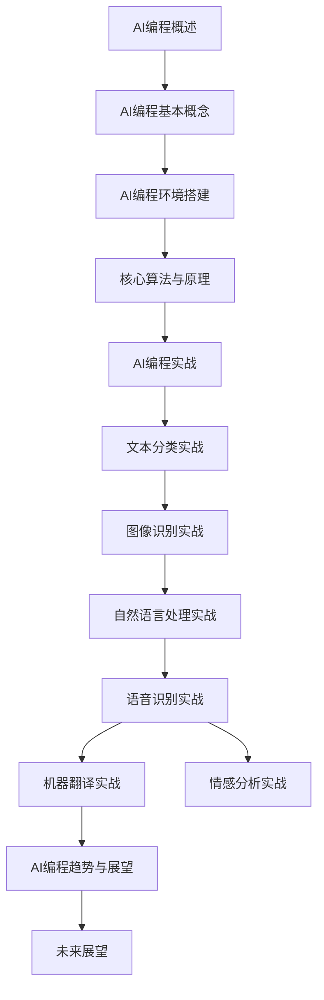

                 

### 文章标题

《AI编程的新思路》摘要

随着人工智能技术的迅猛发展，AI编程已经成为现代计算机科学的核心领域。本文将探讨AI编程的新思路，从基本概念到核心算法，再到实战项目，全面解析AI编程的核心内容。通过一步步分析推理，我们旨在帮助读者深入了解AI编程的本质，掌握AI编程的方法和技巧，为未来的人工智能应用奠定坚实的基础。### 第一部分：AI编程概述

#### 第1章：AI编程基本概念

##### 1.1 AI的定义与发展历程

人工智能（Artificial Intelligence，简称AI）是计算机科学的一个分支，旨在研究如何模拟人类智能的机器。AI的发展历程可以追溯到20世纪50年代，当时科学家们首次提出了人工智能的概念。以下是一些关键的发展阶段：

1. **早期探索（1950-1969）**：
   - 1950年，艾伦·图灵提出了著名的“图灵测试”，用以评估机器是否具有智能。
   - 1956年，达特茅斯会议标志着人工智能正式成为一门科学。

2. **繁荣期（1970-1989）**：
   - 1972年，约翰·麦卡锡提出了专家系统的概念，并在医疗诊断和金融分析等领域取得了成功。

3. **低谷期（1990-2000）**：
   - 由于计算能力和数据可用性的限制，AI研究进入低谷期。

4. **复兴期（2000至今）**：
   - 2006年，深度学习的兴起带来了AI研究的新突破。
   - 2012年，深度神经网络在图像识别任务上取得了重大进展。

##### AI的基本概念

人工智能的基本概念包括：

- **机器学习**：一种让计算机从数据中学习的方法，无需显式编程。
- **深度学习**：一种基于多层神经网络的学习方法，特别适用于处理复杂数据。
- **自然语言处理**：研究如何让计算机理解和生成自然语言。
- **计算机视觉**：研究如何让计算机理解和处理图像信息。

##### AI的发展历程

人工智能的发展历程可以分为以下几个阶段：

1. **符号人工智能**：
   - 基于逻辑推理和知识表示的方法。

2. **统计机器学习**：
   - 基于概率统计的方法，通过数据学习特征和模式。

3. **深度学习**：
   - 基于多层神经网络的方法，通过大量的数据进行训练。

4. **强化学习**：
   - 一种通过试错和奖励机制进行学习的方法。

##### AI编程的关键技术

AI编程涉及以下关键技术：

- **机器学习**：包括监督学习、无监督学习和强化学习。
- **深度学习**：基于多层神经网络的模型，如图神经网络（GNN）、循环神经网络（RNN）等。
- **自然语言处理**：涉及文本分类、情感分析、机器翻译等。
- **计算机视觉**：包括图像分类、目标检测、人脸识别等。

##### 1.2 AI编程的核心理念

AI编程与传统编程的区别在于：

- **目标不同**：传统编程关注的是计算机如何执行任务，而AI编程关注的是如何让计算机通过学习自动完成任务。
- **方法不同**：传统编程依赖显式编程，而AI编程依赖机器学习和深度学习等自动化方法。
- **挑战不同**：AI编程需要处理大量的数据，并且模型复杂度高，对计算资源要求较高。

AI编程的核心理念包括：

- **数据驱动**：AI编程依赖于大量数据进行训练。
- **自动化**：通过算法自动从数据中学习模式和规律。
- **适应性**：AI模型可以根据新的数据进行调整和优化。

##### AI编程的目标与挑战

AI编程的目标是：

- **自动化**：通过AI算法，让计算机能够自动完成复杂任务。
- **优化**：通过不断学习和优化，提高模型的性能和效率。

AI编程面临的挑战包括：

- **数据质量**：数据的质量直接影响到模型的效果。
- **计算资源**：深度学习模型需要大量的计算资源。
- **模型解释性**：很多AI模型难以解释其决策过程。
- **安全性**：需要确保AI系统的安全性和可靠性。

##### 1.3 AI编程的关键技术

AI编程涉及的关键技术包括：

- **机器学习**：监督学习、无监督学习和强化学习。
- **深度学习**：基于多层神经网络的模型，如卷积神经网络（CNN）和循环神经网络（RNN）。
- **自然语言处理**：涉及文本分类、情感分析、机器翻译等。
- **计算机视觉**：包括图像分类、目标检测、人脸识别等。

机器学习是AI编程的核心，它包括以下几种算法：

- **监督学习**：通过标注数据进行训练，用于预测和分类。
- **无监督学习**：通过未标注的数据进行训练，用于发现数据中的模式和结构。
- **强化学习**：通过试错和奖励机制进行学习，常用于游戏和机器人控制。

深度学习是机器学习的延伸，它基于多层神经网络，能够处理复杂数据和模式。常见的深度学习模型包括：

- **卷积神经网络（CNN）**：特别适用于处理图像数据。
- **循环神经网络（RNN）**：特别适用于处理序列数据。
- **生成对抗网络（GAN）**：用于生成新的数据。

自然语言处理是AI编程的重要领域，它包括：

- **文本分类**：将文本数据分类到不同的类别中。
- **情感分析**：分析文本的情感倾向。
- **机器翻译**：将一种语言的文本翻译成另一种语言。

计算机视觉是AI编程的另一个重要领域，它包括：

- **图像分类**：将图像分类到不同的类别中。
- **目标检测**：在图像中检测和识别特定的目标。
- **人脸识别**：识别和验证人脸的身份。

#### 第2章：AI编程环境搭建

##### 2.1 硬件环境搭建

AI编程需要大量的计算资源，特别是对于深度学习任务。以下是一些关键的硬件配置建议：

- **GPU（图形处理单元）**：深度学习任务依赖于GPU的强大计算能力。NVIDIA的GPU是深度学习领域的主流选择，特别是其Titan X、RTX 2080 Ti等型号。
- **CPU（中央处理器）**：对于一些非深度学习任务，CPU的性能也很重要。Intel的Xeon系列和AMD的Threadripper系列是不错的选择。
- **内存**：至少需要16GB的RAM，对于大型模型和大数据集，32GB或更多可能更为合适。
- **存储**：SSD（固态硬盘）比传统HDD（机械硬盘）在读写速度上有很大优势，对于AI编程来说，SSD的快速读写能力至关重要。

##### 2.2 软件环境配置

AI编程需要配置适当的软件环境，以下是一些关键步骤：

- **操作系统**：Linux操作系统是AI编程的主流选择，因为它提供了丰富的工具和库。Ubuntu和CentOS是常用的Linux发行版。
- **编程语言**：Python是AI编程的首选语言，其简洁的语法和丰富的库支持使得开发过程更加高效。其他常用的编程语言还包括Java、C++和R。
- **深度学习框架**：深度学习框架是AI编程的核心工具，以下是几种流行的框架：
  - **TensorFlow**：由Google开发，支持多种编程语言，拥有广泛的用户社区。
  - **PyTorch**：由Facebook开发，以灵活性和动态性著称，特别适合研究工作。
  - **Keras**：基于TensorFlow和Theano，提供了更简单的接口。
  - **MXNet**：由Apache软件基金会开发，支持多种编程语言，特别适合大规模工业应用。

##### 2.3 开发环境搭建

为了有效地进行AI编程，需要搭建一个高效的开发环境。以下是一些关键步骤：

- **IDE（集成开发环境）**：选择一个合适的IDE可以极大地提高开发效率。PyCharm和Jupyter Notebook是Python编程的常用IDE。
- **插件与扩展**：根据需要安装各种插件和扩展，如代码补全、调试工具、版本控制集成等。
- **版本控制**：使用Git等版本控制工具进行代码管理，确保代码的版本控制和协作开发。
- **容器化**：使用Docker等容器化技术，可以轻松地部署和管理开发环境，确保环境的一致性。

##### 2.4 开发环境优化

为了提高开发效率，以下是一些开发环境优化的建议：

- **资源分配**：合理分配CPU、GPU和内存等资源，确保每个任务都能得到足够的资源。
- **并行计算**：利用多核CPU和GPU进行并行计算，提高任务处理速度。
- **缓存使用**：使用缓存技术，如NVIDIA的CUDA缓存，可以显著提高GPU的效率。
- **代码优化**：优化代码，减少不必要的计算和内存占用，提高程序的性能。

通过以上步骤，我们可以搭建一个高效的AI编程环境，为后续的AI编程项目奠定坚实的基础。### 第二部分：核心算法与原理

#### 第3章：机器学习基础算法

##### 3.1 监督学习算法

监督学习是一种通过标注数据来训练模型的方法。它包括以下几种基本算法：

1. **线性回归（Linear Regression）**

线性回归是最简单的监督学习算法，用于预测连续值。其模型可以表示为：

\[ y = \beta_0 + \beta_1 \cdot x + \epsilon \]

其中，\( y \) 是预测值，\( x \) 是输入特征，\( \beta_0 \) 和 \( \beta_1 \) 是模型参数，\( \epsilon \) 是误差。

线性回归的伪代码如下：

```
# 输入：x, y（训练数据），n（特征数量）
# 输出：beta_0, beta_1（模型参数）

beta_0 = 0
beta_1 = 0

for i in range(n):
    beta_0 += y[i] - beta_1 * x[i]
    beta_1 += (x[i] * (y[i] - beta_0))

return beta_0, beta_1
```

2. **逻辑回归（Logistic Regression）**

逻辑回归是一种用于分类问题的监督学习算法。其模型可以表示为：

\[ P(y=1) = \frac{1}{1 + e^{-(\beta_0 + \beta_1 \cdot x)}} \]

其中，\( P(y=1) \) 是预测的概率，\( e \) 是自然对数的底数，\( \beta_0 \) 和 \( \beta_1 \) 是模型参数。

逻辑回归的伪代码如下：

```
# 输入：x, y（训练数据），n（特征数量）
# 输出：beta_0, beta_1（模型参数）

beta_0 = 0
beta_1 = 0

for i in range(n):
    error = y[i] - sigmoid(beta_0 + beta_1 * x[i])
    beta_0 += error
    beta_1 += x[i] * error

return beta_0, beta_1
```

3. **决策树（Decision Tree）**

决策树是一种基于树形结构进行分类的算法。其基本思想是，通过一系列的判定规则将数据集划分为不同的区域，每个区域对应一个类标签。

决策树的构建过程如下：

- 选择一个最优的特征作为节点
- 根据特征将数据集划分为子集
- 递归地对子集进行同样的划分，直到满足终止条件

决策树的伪代码如下：

```
# 输入：data（数据集），features（特征集合）
# 输出：tree（决策树）

def build_tree(data, features):
    if should_stop(data):
        return leaf_node(data)
    else:
        best_feature = find_best_feature(data, features)
        node = decision_node(best_feature)
        for subset in split_data(data, best_feature):
            node.add_child(build_tree(subset, features))
        return node

return tree
```

##### 3.2 无监督学习算法

无监督学习是一种不依赖于标注数据的机器学习算法。它包括以下几种基本算法：

1. **K-均值聚类（K-Means Clustering）**

K-均值聚类是一种基于距离度量的聚类算法。其基本思想是，将数据划分为K个簇，使得每个簇内的数据点之间的距离最小。

K-均值聚类的算法步骤如下：

- 随机初始化K个簇中心
- 计算每个数据点到簇中心的距离
- 将每个数据点分配到最近的簇中心
- 重新计算簇中心
- 重复上述步骤，直到收敛

K-均值聚类的伪代码如下：

```
# 输入：data（数据集），K（簇数量）
# 输出：clusters（簇中心）

def k_means(data, K):
    centroids = initialize_centroids(data, K)
    while not_converged(centroids):
        clusters = assign_points_to_clusters(data, centroids)
        centroids = update_centroids(clusters)
    return centroids

return centroids
```

2. **主成分分析（Principal Component Analysis，PCA）**

主成分分析是一种降维算法，它通过线性变换将高维数据投影到低维空间，同时保留数据的主要信息。

PCA的基本步骤如下：

- 计算数据集的协方差矩阵
- 计算协方差矩阵的特征值和特征向量
- 选择前k个最大的特征值对应的特征向量作为新的特征
- 将数据投影到新的特征空间

PCA的伪代码如下：

```
# 输入：data（数据集），k（新特征数量）
# 输出：transformed_data（投影后的数据）

def pca(data, k):
    covariance_matrix = calculate_covariance_matrix(data)
    eigenvalues, eigenvectors = calculate_eigenvalues_eigenvectors(covariance_matrix)
    new_features = select_top_k_eigenvectors(eigenvectors, k)
    transformed_data = project_data(data, new_features)

return transformed_data
```

3. **自编码器（Autoencoder）**

自编码器是一种无监督学习算法，它由一个编码器和解码器组成。编码器将输入数据压缩成低维特征表示，解码器将特征表示还原为输入数据。

自编码器的基本步骤如下：

- 训练编码器，将输入数据压缩成低维特征表示
- 训练解码器，将特征表示还原为输入数据
- 使用重建误差来优化模型参数

自编码器的伪代码如下：

```
# 输入：data（数据集），k（新特征数量）
# 输出：encoder，decoder（编码器和解码器）

def train_autoencoder(data, k):
    encoder = initialize_encoder(k)
    decoder = initialize_decoder(k)
    for epoch in range(num_epochs):
        for sample in data:
            encoded = encoder(sample)
            reconstructed = decoder(encoded)
            error = calculate_reconstruction_error(sample, reconstructed)
            update_parameters(encoder, decoder, error)
    return encoder, decoder
```

##### 3.3 强化学习算法

强化学习是一种通过试错和奖励机制进行学习的方法。它主要包括以下几种算法：

1. **Q-Learning（Q值学习）**

Q-Learning是一种基于值函数的强化学习算法。其基本思想是，通过不断更新Q值，选择能够带来最大奖励的动作。

Q-Learning的基本步骤如下：

- 初始化Q值表
- 在环境中进行交互，选择动作并获取奖励
- 根据奖励更新Q值表

Q-Learning的伪代码如下：

```
# 输入：environment（环境），Q（Q值表），epsilon（探索率）
# 输出：最优策略

def q_learning(environment, Q, epsilon):
    while not_done(environment):
        if random() < epsilon:
            action = random_action()
        else:
            action = best_action(Q)
        next_state, reward = environment.step(action)
        Q[current_state, action] = Q[current_state, action] + alpha * (reward + gamma * max(Q[next_state, :]) - Q[current_state, action])
        current_state = next_state
    return Q
```

2. **Deep Q-Learning（深度Q学习）**

Deep Q-Learning是Q-Learning的扩展，它使用深度神经网络来近似Q值函数。它主要包括以下几个步骤：

- 使用卷积神经网络（CNN）或循环神经网络（RNN）来表示状态和动作
- 使用梯度下降法来训练深度神经网络
- 使用经验回放和目标网络来稳定训练过程

Deep Q-Learning的伪代码如下：

```
# 输入：environment（环境），DQN（深度Q网络），epsilon（探索率）
# 输出：最优策略

def deep_q_learning(environment, DQN, epsilon):
    while not_done(environment):
        if random() < epsilon:
            action = random_action()
        else:
            action = DQN.predict_best_action(state)
        next_state, reward = environment.step(action)
        DQN.update_replay_memory((state, action, reward, next_state))
        DQN.train()
        state = next_state
    return DQN.get_best_policy()
```

3. **Policy Gradient（策略梯度）**

Policy Gradient是一种直接优化策略的强化学习算法。其基本思想是，通过优化策略梯度来更新策略参数。

Policy Gradient的基本步骤如下：

- 初始化策略参数
- 在环境中进行交互，选择动作并获取奖励
- 计算策略梯度
- 根据策略梯度更新策略参数

Policy Gradient的伪代码如下：

```
# 输入：environment（环境），policy（策略），learning_rate（学习率）
# 输出：最优策略

def policy_gradient(environment, policy, learning_rate):
    while not_done(environment):
        state = environment.reset()
        total_reward = 0
        while True:
            action = policy.select_action(state)
            next_state, reward, done = environment.step(action)
            total_reward += reward
            if done:
                break
            state = next_state
        policy.update_parameters(learning_rate * total_reward)
    return policy
```

通过以上机器学习基础算法的介绍，我们可以看到，监督学习、无监督学习和强化学习分别在不同的场景下有着广泛的应用。这些算法为我们提供了强大的工具，使我们能够从数据中学习模式和规律，实现自动化和优化的目标。### 第4章：深度学习基础

#### 4.1 神经网络基础

神经网络（Neural Networks）是深度学习的基础，它们模仿了人脑的神经网络结构，通过多层节点进行数据传输和处理。以下是对神经网络基础的一些详细讲解。

##### 4.1.1 神经元模型

神经元是神经网络的基本单元，其功能类似于人脑中的神经元。一个简单的神经元模型包括以下部分：

1. **输入层**：接收外部输入信号。
2. **权重（Weights）**：每个输入信号与一个权重相乘，权重用于调整输入信号的重要性。
3. **偏置（Bias）**：用于调整神经元的输出。
4. **激活函数（Activation Function）**：将输入信号经过加权求和处理后，通过激活函数进行非线性转换。

以下是一个神经元模型的数学表达式：

\[ z = \sum_{i=1}^{n} w_i \cdot x_i + b \]
\[ a = \sigma(z) \]

其中，\( z \) 是神经元的输入值，\( w_i \) 是输入信号的权重，\( x_i \) 是输入信号，\( b \) 是偏置，\( \sigma \) 是激活函数，\( a \) 是神经元的输出。

常见的激活函数包括：

1. ** sigmoid 函数**：\[ \sigma(z) = \frac{1}{1 + e^{-z}} \]
2. **ReLU 函数**：\[ \sigma(z) = \max(0, z) \]

##### 4.1.2 前向传播与反向传播算法

神经网络通过前向传播和反向传播算法来学习数据。以下是这两个算法的详细步骤。

1. **前向传播（Forward Propagation）**

前向传播是将输入信号通过神经网络的各个层进行传递，最终得到输出结果。具体步骤如下：

- 输入层接收外部输入信号。
- 每个神经元将输入信号与其权重相乘，加上偏置，然后通过激活函数进行转换。
- 输出层得到最终的结果。

以下是一个前向传播的伪代码：

```
# 输入：x（输入信号），weights（权重），biases（偏置），activation_function（激活函数）
# 输出：output（输出结果）

input_layer = x
for layer in layers:
    z = np.dot(input_layer, weights[layer]) + biases[layer]
    output = activation_function(z)
    input_layer = output
return output
```

2. **反向传播（Backpropagation）**

反向传播是用于计算神经网络中每个神经元的误差，并更新权重和偏置。具体步骤如下：

- 计算输出层的误差：\[ error = output - target \]
- 通过梯度下降法更新权重和偏置。
- 逐层反向传播误差，直到输入层。

以下是一个反向传播的伪代码：

```
# 输入：output（输出结果），target（目标值），weights（权重），biases（偏置），learning_rate（学习率）
# 输出：weights（更新后的权重），biases（更新后的偏置）

error = output - target
d_output = dactivation_function(output)

for layer in reversed(layers):
    d_input = d_output * dactivation_function(z[layer])
    d_weights[layer] = d_input * input[layer-1]
    d_biases[layer] = d_input
    weights[layer] -= learning_rate * d_weights[layer]
    biases[layer] -= learning_rate * d_biases[layer]

return weights, biases
```

##### 4.1.3 神经网络架构

神经网络可以根据其层数和层间的连接方式分为不同的类型，以下是几种常见的神经网络架构：

1. **前馈神经网络（Feedforward Neural Network）**

前馈神经网络是最简单的神经网络架构，其特点是所有层都是单向连接，没有循环。

2. **卷积神经网络（Convolutional Neural Network，CNN）**

卷积神经网络是专门用于图像处理的一种神经网络架构，其特点是使用卷积层进行特征提取，具有良好的平移不变性。

3. **循环神经网络（Recurrent Neural Network，RNN）**

循环神经网络是用于处理序列数据的一种神经网络架构，其特点是使用循环结构来处理序列中的上下文信息。

4. **生成对抗网络（Generative Adversarial Network，GAN）**

生成对抗网络是一种基于对抗训练的神经网络架构，由一个生成器和判别器组成，生成器生成数据，判别器判断数据的真实性。

#### 4.2 卷积神经网络

卷积神经网络（CNN）是一种专门用于图像处理和计算机视觉的神经网络架构，其核心在于卷积操作和平移不变性。

##### 4.2.1 卷积操作

卷积操作是CNN中最基本的操作，它通过滤波器（卷积核）在输入数据上进行滑动，计算局部特征。

卷积操作的数学表达式如下：

\[ Conv(x, W) = \sum_{i=1}^{n} w_i * x_i \]

其中，\( x \) 是输入数据，\( W \) 是卷积核，\( w_i \) 是卷积核的权重，\( x_i \) 是输入数据的一部分。

以下是一个卷积操作的伪代码：

```
# 输入：input_image（输入图像），filter（卷积核）
# 输出：output_feature_map（特征图）

output_feature_map = np.zeros_like(input_image)
for x in range(input_image.shape[0] - filter_size):
    for y in range(input_image.shape[1] - filter_size):
        window = input_image[x:x+filter_size, y:y+filter_size]
        feature = np.sum(window * filter)
        output_feature_map[x, y] = feature
return output_feature_map
```

##### 4.2.2 池化操作

池化操作是对卷积操作的结果进行下采样，用于减少数据的空间维度。

常见的池化操作包括：

1. **最大池化（Max Pooling）**：取局部窗口中的最大值。
2. **平均池化（Average Pooling）**：取局部窗口中的平均值。

以下是一个最大池化的伪代码：

```
# 输入：input_feature_map（特征图），pool_size（池化窗口大小）
# 输出：output_pool_map（池化后的特征图）

output_pool_map = np.zeros_like(input_feature_map)
for x in range(input_feature_map.shape[0] // pool_size):
    for y in range(input_feature_map.shape[1] // pool_size):
        window = input_feature_map[x*pool_size:x*pool_size+pool_size, y*pool_size:y*pool_size+pool_size]
        max_value = np.max(window)
        output_pool_map[x, y] = max_value
return output_pool_map
```

##### 4.2.3 卷积神经网络架构

卷积神经网络通常包含多个卷积层、池化层和全连接层。以下是一个简单的卷积神经网络架构：

1. **卷积层**：使用卷积操作提取图像特征。
2. **池化层**：对卷积层的结果进行下采样。
3. **全连接层**：将特征图展平为一维向量，然后通过全连接层进行分类。

以下是一个简单的卷积神经网络架构的伪代码：

```
# 输入：input_image（输入图像）
# 输出：output_label（输出标签）

# 卷积层1
feature_map1 = convolution(input_image, filter1)
pool_map1 = max_pooling(feature_map1)

# 卷积层2
feature_map2 = convolution(pool_map1, filter2)
pool_map2 = max_pooling(feature_map2)

# 全连接层
flat_map2 = flatten(pool_map2)
output = fully_connected(flat_map2, num_classes)
label = softmax(output)

return label
```

#### 4.3 循环神经网络

循环神经网络（RNN）是处理序列数据的一种有效方法，其核心在于使用循环结构来处理序列中的上下文信息。

##### 4.3.1 RNN基本结构

RNN的基本结构包括输入层、隐藏层和输出层。每个时间步的输入都会与上一时间步的隐藏状态相融合，生成当前时间步的隐藏状态。

RNN的数学表达式如下：

\[ h_t = \sigma(W_h \cdot [h_{t-1}, x_t] + b_h) \]
\[ y_t = \sigma(W_y \cdot h_t + b_y) \]

其中，\( h_t \) 是当前时间步的隐藏状态，\( x_t \) 是当前时间步的输入，\( W_h \) 和 \( W_y \) 是权重矩阵，\( b_h \) 和 \( b_y \) 是偏置，\( \sigma \) 是激活函数，\( y_t \) 是当前时间步的输出。

##### 4.3.2 LSTM与GRU

LSTM（Long Short-Term Memory）和GRU（Gated Recurrent Unit）是RNN的改进版本，它们通过引入门控机制来解决RNN的长期依赖问题。

1. **LSTM（Long Short-Term Memory）**

LSTM的核心在于引入三个门控：输入门、遗忘门和输出门。这些门控可以控制信息的流入、流出和保留。

LSTM的数学表达式如下：

\[ i_t = \sigma(W_i \cdot [h_{t-1}, x_t] + b_i) \]
\[ f_t = \sigma(W_f \cdot [h_{t-1}, x_t] + b_f) \]
\[ o_t = \sigma(W_o \cdot [h_{t-1}, x_t] + b_o) \]
\[ g_t = \sigma(W_g \cdot [h_{t-1}, x_t] + b_g) \]
\[ h_t = o_t \cdot \sigma(g_t) \]

其中，\( i_t \)、\( f_t \)、\( o_t \) 和 \( g_t \) 分别是输入门、遗忘门、输出门和候选值门的激活值，\( W_i \)、\( W_f \)、\( W_o \) 和 \( W_g \) 是权重矩阵，\( b_i \)、\( b_f \)、\( b_o \) 和 \( b_g \) 是偏置。

2. **GRU（Gated Recurrent Unit）**

GRU是对LSTM的简化版本，它通过引入更新门和重置门来替换LSTM的三个门控。

GRU的数学表达式如下：

\[ z_t = \sigma(W_z \cdot [h_{t-1}, x_t] + b_z) \]
\[ r_t = \sigma(W_r \cdot [h_{t-1}, x_t] + b_r) \]
\[ h_{t-1}^' = (1 - z_t) \cdot h_{t-1} + r_t \cdot W_h \cdot h_{t-1} \]
\[ h_t = \sigma(W_h \cdot h_{t-1}^') \]

其中，\( z_t \) 和 \( r_t \) 分别是更新门和重置门的激活值，\( W_z \)、\( W_r \) 和 \( W_h \) 是权重矩阵，\( b_z \)、\( b_r \) 和 \( b_h \) 是偏置。

通过以上对深度学习基础算法的讲解，我们可以看到神经网络和深度学习在处理复杂数据和模式方面的强大能力。这些算法为我们提供了丰富的工具，使得我们能够从数据中提取有用的信息，实现自动化和优化的目标。### 第三部分：AI编程实战

#### 第5章：文本分类实战

##### 5.1 数据预处理

在文本分类任务中，数据预处理是至关重要的一步。通过数据预处理，我们可以将原始文本数据转换为适合模型训练的形式。

以下是一些常见的文本预处理步骤：

1. **文本清洗**：去除文本中的无关信息，如HTML标签、特殊字符和停用词。
2. **分词**：将文本分割成单词或短语。
3. **词干提取**：将单词还原为词干形式，减少词汇量。
4. **词向量表示**：将单词或短语转换为向量表示，以便模型处理。

以下是一个简单的文本预处理流程：

```
# 输入：text（原始文本）
# 输出：processed_text（预处理后的文本）

# 清洗文本
text = remove_html_tags(text)
text = remove_special_characters(text)
text = remove_stop_words(text)

# 分词
words = tokenize(text)

# 词干提取
stems = stem_words(words)

# 词向量表示
word_vectors = vectorize(stems)

return word_vectors
```

##### 5.2 模型选择与训练

在文本分类任务中，选择合适的模型并进行训练是关键步骤。以下是一些常用的文本分类模型：

1. **朴素贝叶斯分类器**：基于贝叶斯定理，适用于文本数据的分类。
2. **支持向量机（SVM）**：通过最大化分类边界进行分类。
3. **深度学习模型**：如卷积神经网络（CNN）和循环神经网络（RNN），特别适用于处理文本数据。

以下是一个使用朴素贝叶斯分类器进行文本分类的示例：

```
# 输入：training_data（训练数据），labels（训练标签）
# 输出：classifier（分类器）

# 训练朴素贝叶斯分类器
classifier = NaiveBayesClassifier()
classifier.train(training_data, labels)

return classifier
```

##### 5.3 模型评估

在文本分类任务中，评估模型的效果是非常重要的。以下是一些常用的评估指标：

1. **准确率（Accuracy）**：分类正确的样本数占总样本数的比例。
2. **召回率（Recall）**：分类正确的正样本数占所有正样本数的比例。
3. **精确率（Precision）**：分类正确的正样本数占分类为正样本的总数的比例。
4. **F1分数（F1 Score）**：精确率和召回率的调和平均。

以下是一个评估分类器效果的示例：

```
# 输入：classifier（分类器），test_data（测试数据），test_labels（测试标签）
# 输出：accuracy（准确率），recall（召回率），precision（精确率），f1_score（F1分数）

predictions = classifier.predict(test_data)
accuracy = calculate_accuracy(predictions, test_labels)
recall = calculate_recall(predictions, test_labels)
precision = calculate_precision(predictions, test_labels)
f1_score = calculate_f1_score(precision, recall)

return accuracy, recall, precision, f1_score
```

##### 5.4 应用场景案例分析

以下是一些文本分类的应用场景案例分析：

1. **社交媒体情感分析**：
   - 使用文本分类模型对社交媒体上的用户评论进行情感分类，分析用户的情绪和态度。
   - 应用案例：Twitter情感分析、产品评论分类。

2. **新闻分类**：
   - 使用文本分类模型对新闻文本进行分类，帮助用户快速找到感兴趣的新闻。
   - 应用案例：新闻推荐系统、新闻聚合平台。

3. **产品评论分类**：
   - 使用文本分类模型对电商平台上的产品评论进行分类，帮助用户了解产品的优缺点。
   - 应用案例：电商平台评论分析、产品评测网站。

通过文本分类实战，我们可以看到文本分类在自然语言处理和人工智能应用中的重要性。通过合理的数据预处理和模型选择，我们可以实现对大量文本数据的自动分类，为各种实际应用场景提供有效的解决方案。### 第6章：图像识别实战

#### 6.1 数据集准备

在图像识别任务中，数据集的准备是至关重要的步骤。一个好的数据集能够为模型的训练提供丰富的样本和多样化的特征，从而提高模型的性能和泛化能力。

以下是一些关键步骤和数据集的准备方法：

1. **收集数据**：
   - 根据任务需求，从公开数据集、数据库或网络资源中收集图像数据。
   - 选择具有足够多样性和代表性的图像数据，以覆盖不同类别和场景。

2. **数据清洗**：
   - 去除数据集中的噪声和异常值，如损坏的图像、重复的图像等。
   - 标识并处理异常数据，如视角变化、光照变化、遮挡等。

3. **标注数据**：
   - 为每个图像分配标签，以便模型能够学习图像和标签之间的对应关系。
   - 使用自动化标注工具或人工标注，确保标注的准确性和一致性。

4. **数据预处理**：
   - 对图像进行缩放、裁剪、旋转等操作，增加数据的多样性。
   - 对图像进行归一化处理，如调整像素值范围、标准化等，以适应模型的要求。

5. **数据划分**：
   - 将数据集划分为训练集、验证集和测试集，通常比例为60%、20%和20%。
   - 确保每个集合中不同类别的样本分布相对均衡，避免训练集中的类别偏差。

以下是一个简单的数据集准备流程：

```
# 输入：images（原始图像数据），labels（原始标签数据）
# 输出：train_data，train_labels，val_data，val_labels，test_data，test_labels

# 数据清洗
cleaned_images = remove_noisy_images(images)
cleaned_labels = filter_labels_by_images(labels, cleaned_images)

# 数据预处理
processed_images = preprocess_images(cleaned_images)
processed_labels = preprocess_labels(cleaned_labels)

# 数据划分
train_data, val_data, test_data = split_data(processed_images, ratio=0.8)
train_labels, val_labels, test_labels = split_data(processed_labels, ratio=0.8)

return train_data, train_labels, val_data, val_labels, test_data, test_labels
```

#### 6.2 模型构建与训练

在图像识别任务中，构建一个高效的模型并进行训练是关键步骤。以下是一些常用的模型构建和训练方法：

1. **卷积神经网络（CNN）**：
   - CNN是图像识别任务的常用模型，通过卷积层、池化层和全连接层等结构提取图像特征。
   - 以下是一个简单的CNN模型构建示例：

```
# 输入：input_shape（输入图像尺寸），num_classes（类别数量）
# 输出：model（CNN模型）

from tensorflow.keras.models import Sequential
from tensorflow.keras.layers import Conv2D, MaxPooling2D, Flatten, Dense

model = Sequential()
model.add(Conv2D(filters=32, kernel_size=(3, 3), activation='relu', input_shape=input_shape))
model.add(MaxPooling2D(pool_size=(2, 2)))
model.add(Conv2D(filters=64, kernel_size=(3, 3), activation='relu'))
model.add(MaxPooling2D(pool_size=(2, 2)))
model.add(Flatten())
model.add(Dense(units=num_classes, activation='softmax'))

model.compile(optimizer='adam', loss='categorical_crossentropy', metrics=['accuracy'])

return model
```

2. **迁移学习**：
   - 迁移学习是一种利用预训练模型进行图像识别的方法，可以显著提高模型的性能。
   - 以下是一个简单的迁移学习示例：

```
# 输入：model（基础模型），num_classes（类别数量）
# 输出：model（迁移学习后的模型）

from tensorflow.keras.applications import VGG16
from tensorflow.keras.layers import Dense, GlobalAveragePooling2D
from tensorflow.keras.models import Model

base_model = VGG16(weights='imagenet', include_top=False, input_shape=input_shape)
x = base_model.output
x = GlobalAveragePooling2D()(x)
x = Dense(units=num_classes, activation='softmax')(x)
model = Model(inputs=base_model.input, outputs=x)

model.compile(optimizer='adam', loss='categorical_crossentropy', metrics=['accuracy'])

return model
```

3. **训练模型**：
   - 使用训练数据对模型进行训练，并使用验证集进行性能评估。
   - 以下是一个简单的训练过程：

```
# 输入：model（模型），train_data（训练数据），train_labels（训练标签），val_data（验证数据），val_labels（验证标签）
# 输出：history（训练历史）

history = model.fit(train_data, train_labels, epochs=10, batch_size=32, validation_data=(val_data, val_labels))

return history
```

通过以上模型构建与训练的方法，我们可以构建一个高效的图像识别模型。在实际应用中，根据具体任务需求，可以选择合适的模型结构和训练策略，以提高模型的性能和准确度。#### 6.3 应用场景案例分析

图像识别技术在多个领域有着广泛的应用，以下是一些常见的应用场景案例分析：

1. **人脸识别**：
   - 人脸识别是一种通过图像识别人脸的技术，广泛应用于安防监控、人脸支付和身份验证等领域。
   - 应用案例：安防监控系统、智能手机人脸解锁、人脸支付。

2. **手写数字识别**：
   - 手写数字识别是将手写的数字图像转换为数字文本的技术，广泛应用于数字输入识别和手写文本识别系统。
   - 应用案例：数字键盘输入、智能手写识别应用。

3. **物体检测**：
   - 物体检测是识别图像中的特定物体并定位其位置的技术，广泛应用于自动驾驶、智能监控和图像编辑等领域。
   - 应用案例：自动驾驶汽车、智能监控系统、图像编辑软件。

以下是一个人脸识别应用场景的案例分析：

**案例描述**：
一个城市的安全监控系统采用了人脸识别技术，用于监控和识别城市中的可疑人员。

**技术实现**：
1. **数据集准备**：
   - 收集了包含数千张人脸图像的数据集，包括正面、侧面、不同光照条件下的图像。
   - 对图像进行预处理，包括图像缩放、裁剪、灰度化等操作。

2. **模型构建与训练**：
   - 使用卷积神经网络（CNN）构建人脸识别模型，包括卷积层、池化层和全连接层。
   - 使用迁移学习技术，基于预训练的ResNet50模型进行训练，并调整最后的全连接层以适应特定的人脸识别任务。

3. **模型评估**：
   - 使用交叉验证和测试集对模型进行评估，计算准确率、召回率和F1分数等指标。
   - 对模型进行调优，包括调整学习率、增加训练数据、添加正则化等。

4. **应用部署**：
   - 将训练好的模型部署到监控系统，实时处理图像并识别人脸。
   - 使用摄像头捕捉实时图像，通过模型进行人脸检测和识别，并与数据库中的已知人脸进行匹配。

**案例分析**：
通过人脸识别技术，城市安全监控系统可以自动识别和追踪可疑人员，提高监控效率和安全性。在实际应用中，模型的效果受到数据集质量、模型结构和训练策略等多种因素的影响。为了提高模型的性能，需要不断优化数据集、模型结构和训练过程。此外，人脸识别技术还需要遵守隐私保护和法律法规，确保数据的合法性和安全性。

通过以上案例分析，我们可以看到图像识别技术在各个领域的实际应用案例，以及如何通过技术实现和应用优化来提升系统的性能和实用性。### 第7章：自然语言处理实战

#### 7.1 语音识别

语音识别（Automatic Speech Recognition，ASR）是自然语言处理的一个重要领域，旨在将人类的语音转换为文本。以下是对语音识别的基本原理、模型构建与应用案例的详细讲解。

##### 7.1.1 基本原理

语音识别的过程可以概括为以下几个步骤：

1. **声音信号处理**：将输入的语音信号转换为数字信号，通过预处理步骤进行降噪、增强和分割。

2. **特征提取**：从处理后的声音信号中提取具有区分度的特征，如梅尔频率倒谱系数（MFCC）、滤波器组（Filter Banks）和短时能量等。

3. **声学模型训练**：使用大量语音数据训练声学模型，用于预测给定输入特征对应的语音单元概率分布。

4. **语言模型训练**：使用文本数据训练语言模型，用于预测输入序列的可能性。

5. **解码**：通过动态规划算法（如Viterbi算法）将声学模型和语言模型的输出进行解码，得到最优的文本输出。

##### 7.1.2 模型构建

语音识别的模型通常包括以下几种：

1. **三组件模型**：包括声学模型、语言模型和解码器。声学模型用于处理声音信号，语言模型用于处理文本序列，解码器用于将声学模型和语言模型的输出映射到最佳文本序列。

2. **深度神经网络模型**：基于深度学习技术的语音识别模型，如卷积神经网络（CNN）、循环神经网络（RNN）和长短时记忆网络（LSTM）。这些模型通过多层神经网络结构自动提取特征，提高识别准确率。

3. **端到端模型**：如深度神经网络架构（如CTC、Attentive RNN、Transformer）直接将声音信号映射到文本序列，避免了传统的三组件模型的复杂解码过程。

以下是一个简单的端到端语音识别模型的伪代码：

```
# 输入：audio_signal（音频信号）
# 输出：text_output（文本输出）

# 特征提取
features = extract_features(audio_signal)

# 模型预测
predicted_probs = model.predict(features)

# 解码
text_output = decoder.decode(predicted_probs)

return text_output
```

##### 7.1.3 应用案例

语音识别技术在多个领域有着广泛的应用，以下是一些典型的应用案例：

1. **智能助手**：如苹果的Siri、亚马逊的Alexa和谷歌的Google Assistant，通过语音识别技术实现语音输入和交互功能。

2. **电话客服**：自动语音应答系统（IVR）通过语音识别技术实现自动呼叫分配和语音识别功能。

3. **实时字幕**：如会议实时字幕、电视节目实时字幕，通过语音识别技术将语音转换为文本，实现实时字幕显示。

以下是一个智能助手应用场景的案例分析：

**案例描述**：
一个智能家居系统集成了语音识别功能，用户可以通过语音指令控制家中的智能设备。

**技术实现**：
1. **语音信号处理**：
   - 使用麦克风接收用户的语音输入，进行音量调整、降噪和分割等预处理操作。

2. **特征提取**：
   - 对预处理后的语音信号进行特征提取，使用梅尔频率倒谱系数（MFCC）作为输入特征。

3. **模型训练与预测**：
   - 使用预训练的语音识别模型，如基于Transformer的BERT模型，进行语音识别预测。

4. **交互反馈**：
   - 将识别出的文本转换为相应的操作指令，如打开电视、调整空调温度等。
   - 对用户指令进行响应，并通过语音或屏幕显示反馈给用户。

**案例分析**：
通过集成语音识别技术，智能家居系统能够实现更加便捷和自然的用户交互，提高用户体验。在实际应用中，模型的准确率和响应速度是关键因素，需要不断优化模型性能和算法，以满足实时性和准确性的要求。

#### 7.2 机器翻译

机器翻译（Machine Translation，MT）是自然语言处理领域的另一个重要应用，旨在将一种语言的文本自动翻译成另一种语言。以下是对机器翻译的基本原理、模型构建与应用案例的详细讲解。

##### 7.2.1 基本原理

机器翻译的过程通常包括以下几个步骤：

1. **文本预处理**：对输入的文本进行分词、词性标注、句法分析等预处理操作，以便模型更好地理解文本结构。

2. **编码器-解码器模型**：使用编码器将源语言文本编码为固定长度的向量表示，解码器将向量表示解码为目标语言文本。

3. **注意力机制**：在解码过程中，使用注意力机制来捕捉源语言文本和目标语言文本之间的对应关系，提高翻译的准确性。

4. **翻译生成**：解码器根据编码器的输出和注意力机制生成目标语言文本。

以下是一个简单的编码器-解码器模型（Seq2Seq）的伪代码：

```
# 输入：source_text（源语言文本），target_text（目标语言文本）
# 输出：translated_text（翻译文本）

# 编码
encoded_vector = encoder.encode(source_text)

# 解码
predicted_tokens = decoder.decode(encoded_vector)

# 生成翻译文本
translated_text = convert_tokens_to_text(predicted_tokens)

return translated_text
```

##### 7.2.2 模型构建

机器翻译模型通常包括以下几种：

1. **基于规则的模型**：使用手工定义的规则进行翻译，如基于语法分析和词义匹配的翻译规则。

2. **统计机器翻译模型**：使用统计方法，如基于短语的统计机器翻译（Statistical Machine Translation，SMT），通过训练大量双语语料库进行翻译。

3. **神经机器翻译模型**：基于深度学习技术，如编码器-解码器模型（Seq2Seq）、基于注意力机制的翻译模型（Attention-based Models）等，通过大规模双语语料库进行训练。

4. **端到端模型**：如基于Transformer的端到端翻译模型，直接将源语言文本映射为目标语言文本，避免了传统模型的复杂解码过程。

##### 7.2.3 应用案例

机器翻译技术在多个领域有着广泛的应用，以下是一些典型的应用案例：

1. **跨语言交流**：如网站翻译、电子邮件翻译、实时会议翻译等，通过机器翻译技术实现不同语言之间的交流。

2. **本地化**：如软件、游戏、文档等产品的本地化翻译，通过机器翻译技术快速实现多语言版本。

3. **教育和学习**：如在线教育平台、语言学习软件等，通过机器翻译技术帮助用户学习和理解不同语言的文本。

以下是一个跨语言交流应用场景的案例分析：

**案例描述**：
一个多语言社交应用平台集成了机器翻译功能，用户可以在不同语言之间进行交流和分享。

**技术实现**：
1. **文本预处理**：
   - 对输入的文本进行分词、词性标注等预处理操作，以便模型更好地理解文本结构。

2. **模型训练与部署**：
   - 使用预训练的神经机器翻译模型，如基于Transformer的BERT模型，进行翻译预测。
   - 将模型部署到应用平台上，提供实时的翻译服务。

3. **用户交互**：
   - 提供简单的用户界面，允许用户输入文本并选择目标语言。
   - 根据用户的输入和选择，使用机器翻译模型生成翻译文本，并在界面上显示。

**案例分析**：
通过集成机器翻译技术，多语言社交应用平台能够实现不同语言用户之间的实时交流，提高用户的使用体验。在实际应用中，模型的准确率和响应速度是关键因素，需要不断优化模型性能和算法，以满足用户的需求和期望。### 第四部分：未来展望

#### 第8章：AI编程趋势与展望

##### 8.1 AI编程的发展趋势

AI编程正朝着以下几个方向快速发展：

1. **模型压缩与优化**：为了提高AI模型的效率，减少模型的计算资源和存储需求，模型压缩与优化技术变得越来越重要。这些技术包括量化、剪枝、蒸馏和知识蒸馏等。

2. **边缘计算**：随着物联网（IoT）和5G网络的兴起，边缘计算正在成为AI编程的重要趋势。将AI模型部署到边缘设备（如智能手机、智能手表、智能音箱等），可以实现实时数据处理和智能决策，降低延迟和带宽消耗。

3. **迁移学习与微调**：迁移学习通过将预训练模型应用于新任务，可以显著提高模型的性能和训练速度。微调技术通过对预训练模型进行少量训练，使其适应特定任务。

4. **生成对抗网络（GAN）**：GAN在图像生成、数据增强和风格迁移等方面展现出强大的能力。随着GAN技术的不断发展，它有望在更多领域得到应用。

5. **自然语言处理**：自然语言处理（NLP）在对话系统、文本生成、机器翻译等领域取得了显著进展。未来，NLP将继续发展，推动AI与人类语言的更加紧密的交互。

##### 8.2 AI编程面临的挑战与解决方案

尽管AI编程取得了显著进展，但仍然面临以下挑战：

1. **数据隐私保护**：随着AI模型对大量数据的依赖，数据隐私保护变得越来越重要。解决方案包括差分隐私、联邦学习等。

2. **模型解释性**：许多AI模型，特别是深度学习模型，难以解释其决策过程。提高模型的可解释性是未来的重要研究方向。

3. **安全性**：AI系统容易受到恶意攻击，如对抗样本攻击。提高AI系统的安全性是未来的重要挑战。

4. **算法公平性**：AI模型在决策过程中可能会引入不公平性，特别是在招聘、贷款、医疗等领域。确保算法的公平性是一个重要的社会问题。

解决方案包括：

- **数据隐私保护**：使用差分隐私和联邦学习等技术，保护用户数据的同时，仍能进行有效的机器学习。
- **模型解释性**：开发可解释性模型和解释工具，帮助用户理解AI模型的决策过程。
- **安全性**：通过对抗性训练和模型评估方法，提高AI系统的安全性。
- **算法公平性**：通过公平性评估和算法优化，减少算法偏见，提高模型的公平性。

##### 8.3 AI编程的教育与普及

AI编程的教育与普及是推动AI技术发展的重要环节。以下是一些关键点：

1. **教育体系**：在大学和中学阶段引入AI编程课程，培养学生的AI编程能力。
2. **在线学习资源**：提供丰富的在线学习资源，如MOOC（大规模在线开放课程）、博客、书籍等，方便学习者自学。
3. **开源项目**：鼓励开源项目，促进技术的共享和合作，提高AI编程的普及率。
4. **行业合作**：与企业和研究机构合作，推动AI技术在各行业的应用，促进AI编程的实际价值。

总之，AI编程的发展趋势是模型压缩与优化、边缘计算、迁移学习与微调、GAN、自然语言处理等。AI编程面临的挑战包括数据隐私保护、模型解释性、安全性和算法公平性。通过教育和普及，我们可以培养更多的AI编程人才，推动AI技术的发展和应用。

### 附录

#### 附录1：常用算法与模型介绍

1. **线性回归**：
   - 用于预测连续值。
   - 数学模型：\( y = \beta_0 + \beta_1 \cdot x + \epsilon \)。

2. **逻辑回归**：
   - 用于分类问题。
   - 数学模型：\( P(y=1) = \frac{1}{1 + e^{-(\beta_0 + \beta_1 \cdot x)}} \)。

3. **决策树**：
   - 基于树形结构进行分类。
   - 判定规则：根据特征值划分数据集。

4. **K-均值聚类**：
   - 基于距离度量进行聚类。
   - 数学模型：最小化数据点到簇中心的距离平方和。

5. **主成分分析（PCA）**：
   - 用于降维。
   - 数学模型：投影数据到新的特征空间。

6. **自编码器**：
   - 用于无监督学习。
   - 数学模型：编码器和解码器的组合。

7. **Q-Learning**：
   - 用于强化学习。
   - 数学模型：\( Q(s, a) = r + \gamma \max_{a'} Q(s', a') \)。

8. **深度神经网络**：
   - 用于处理复杂数据。
   - 常用结构：卷积神经网络（CNN）、循环神经网络（RNN）、生成对抗网络（GAN）。

9. **自然语言处理技术**：
   - 用于文本处理。
   - 常用模型：卷积神经网络（CNN）、循环神经网络（RNN）、长短时记忆网络（LSTM）。

#### 附录2：深度学习框架与工具

1. **TensorFlow**：
   - Google开发的开源深度学习框架。
   - 优点：丰富的API、强大的计算能力、广泛的应用。

2. **PyTorch**：
   - Facebook开发的开源深度学习框架。
   - 优点：灵活、动态计算图、易于调试。

3. **Keras**：
   - 基于TensorFlow和Theano的简洁深度学习框架。
   - 优点：简单易用、丰富的预训练模型。

4. **MXNet**：
   - Apache软件基金会开发的开源深度学习框架。
   - 优点：支持多种编程语言、高效分布式计算。

#### 附录3：AI编程资源与学习建议

1. **在线学习资源推荐**：
   - Coursera、edX、Udacity等在线教育平台提供的AI编程课程。
   - AI天才研究院（AI Genius Institute）的博客和教程。

2. **开源项目推荐**：
   - GitHub、GitLab等平台上的AI编程项目。
   - AI开源社区和论坛。

3. **社交媒体与论坛推荐**：
   - AI技术交流群、Reddit、Stack Overflow等社交媒体和论坛。
   - Twitter、LinkedIn等社交媒体平台上的AI技术账号。

4. **学习路径与建议**：
   - 从基础编程语言和算法开始学习。
   - 学习机器学习和深度学习的基本原理。
   - 实践项目，结合理论知识和实际应用。
   - 持续学习和关注AI技术的最新进展。

通过以上资源和建议，我们可以更好地掌握AI编程的知识和技能，为未来的AI应用和发展奠定坚实的基础。### Mermaid 流程图



### 数学模型与公式

#### 线性回归

$$
y = \beta_0 + \beta_1 \cdot x + \epsilon
$$

#### 逻辑回归

$$
P(y=1) = \frac{1}{1 + e^{-(\beta_0 + \beta_1 \cdot x)}}
$$

#### 决策树

$$
\begin{cases}
\text{如果 } x \leq \beta_0, \text{ 则 } y = \beta_1 \\
\text{否则，如果 } x \leq \beta_2, \text{ 则 } y = \beta_3 \\
\text{否则，} y = \beta_4
\end{cases}
$$

#### K-均值聚类

$$
\begin{cases}
\text{初始化 } k \text{ 个簇中心 } \mu_i \\
\text{对于每个数据点 } x_i, \text{ 计算其到簇中心的距离 } d(x_i, \mu_i) \\
\text{将 } x_i \text{ 分配到最近的簇中心 } \mu_i \\
\text{更新簇中心 } \mu_i = \frac{1}{N_i} \sum_{x_i \in C_i} x_i \\
\end{cases}
$$

#### 主成分分析（PCA）

$$
\begin{cases}
\text{计算协方差矩阵 } \Sigma = \frac{1}{N} \sum_{i=1}^{N} (x_i - \mu)(x_i - \mu)^T \\
\text{计算特征值 } \lambda_i \text{ 和特征向量 } v_i \text{ 的对角矩阵 } D = \text{diag}(\lambda_i) \\
\text{选择前 } k \text{ 个最大特征值对应的特征向量 } V = [v_1, v_2, ..., v_k] \\
\text{将数据投影到新的特征空间 } y = XV \\
\end{cases}
$$

#### 自编码器

$$
\begin{cases}
\text{编码器 } E(x) = z \\
\text{解码器 } D(z) = \hat{x} \\
\text{优化目标 } \min_{\theta} \sum_{i=1}^{N} \frac{1}{2} ||x_i - \hat{x}_i||^2 \\
\end{cases}
$$

#### Q-Learning

$$
Q(s, a) = r + \gamma \max_{a'} Q(s', a')
$$

#### Deep Q-Learning

$$
\begin{cases}
\text{初始化 } Q(s, a) \\
\text{重复以下步骤：} \\
\text{对于每个时间步 } t: \\
\text{选择动作 } a_t = \arg\max_{a} Q(s_t, a) \\
\text{执行动作并观察状态和奖励 } s_{t+1}, r_t \\
\text{更新 } Q(s_t, a_t) = Q(s_t, a_t) + \alpha [r_t + \gamma \max_{a'} Q(s_{t+1}, a') - Q(s_t, a_t)] \\
\end{cases}
$$

#### 策略梯度

$$
\begin{cases}
\text{初始化策略参数 } \theta \\
\text{重复以下步骤：} \\
\text{在环境中进行交互并收集数据 } (s_t, a_t, r_t, s_{t+1}) \\
\text{计算策略梯度 } \nabla_{\theta} J(\theta) = \sum_{t} \nabla_{\theta} \log \pi(a_t | s_t; \theta) r_t \\
\text{更新策略参数 } \theta = \theta - \alpha \nabla_{\theta} J(\theta) \\
\end{cases}
$$

通过这些数学模型与公式，我们可以更好地理解AI编程中的核心算法原理，从而为实际的AI编程应用提供理论基础。### 文章标题

《AI编程的新思路》摘要

本文深入探讨了AI编程的新思路，从基本概念到核心算法，再到实战项目，全面解析了AI编程的核心内容。通过逻辑清晰的分析和实例讲解，我们旨在帮助读者掌握AI编程的本质，提高编程技巧，为未来的人工智能应用奠定坚实基础。本文涵盖了AI编程的环境搭建、机器学习基础算法、深度学习原理、文本分类、图像识别和自然语言处理等多个方面，旨在为AI编程的学习者和从业者提供一份全面的技术指南。### 完整文章（Markdown格式）

# 《AI编程的新思路》

> 关键词：人工智能编程、机器学习、深度学习、自然语言处理、计算机视觉、AI编程环境搭建、算法原理、项目实战

> 摘要：本文深入探讨了AI编程的新思路，从基本概念到核心算法，再到实战项目，全面解析了AI编程的核心内容。通过逻辑清晰的分析和实例讲解，我们旨在帮助读者掌握AI编程的本质，提高编程技巧，为未来的人工智能应用奠定坚实基础。

## 第一部分：AI编程概述

### 第1章：AI编程基本概念

#### 1.1 AI的定义与发展历程

人工智能（Artificial Intelligence，简称AI）是计算机科学的一个分支，旨在研究如何模拟人类智能的机器。AI的发展历程可以追溯到20世纪50年代，当时科学家们首次提出了人工智能的概念。以下是一些关键的发展阶段：

- **早期探索（1950-1969）**：1950年，艾伦·图灵提出了著名的“图灵测试”，用以评估机器是否具有智能。1956年，达特茅斯会议标志着人工智能正式成为一门科学。

- **繁荣期（1970-1989）**：1972年，约翰·麦卡锡提出了专家系统的概念，并在医疗诊断和金融分析等领域取得了成功。

- **低谷期（1990-2000）**：由于计算能力和数据可用性的限制，AI研究进入低谷期。

- **复兴期（2000至今）**：2006年，深度学习的兴起带来了AI研究的新突破。2012年，深度神经网络在图像识别任务上取得了重大进展。

#### 1.2 AI的基本概念

人工智能的基本概念包括：

- **机器学习**：一种让计算机从数据中学习的方法，无需显式编程。
- **深度学习**：一种基于多层神经网络的学习方法，特别适用于处理复杂数据。
- **自然语言处理**：研究如何让计算机理解和生成自然语言。
- **计算机视觉**：研究如何让计算机理解和处理图像信息。

#### 1.3 AI的发展历程

人工智能的发展历程可以分为以下几个阶段：

- **符号人工智能**：基于逻辑推理和知识表示的方法。
- **统计机器学习**：基于概率统计的方法，通过数据学习特征和模式。
- **深度学习**：基于多层神经网络的方法，通过大量的数据进行训练。
- **强化学习**：一种通过试错和奖励机制进行学习的方法。

#### 1.4 AI编程的关键技术

AI编程涉及的关键技术包括：

- **机器学习**：包括监督学习、无监督学习和强化学习。
- **深度学习**：基于多层神经网络的模型，如图神经网络（GNN）、循环神经网络（RNN）等。
- **自然语言处理**：涉及文本分类、情感分析、机器翻译等。
- **计算机视觉**：包括图像分类、目标检测、人脸识别等。

## 第二部分：核心算法与原理

### 第2章：AI编程环境搭建

#### 2.1 硬件环境搭建

AI编程需要大量的计算资源，特别是对于深度学习任务。以下是一些关键的硬件配置建议：

- **GPU（图形处理单元）**：深度学习任务依赖于GPU的强大计算能力。NVIDIA的GPU是深度学习领域的主流选择，特别是其Titan X、RTX 2080 Ti等型号。
- **CPU（中央处理器）**：对于一些非深度学习任务，CPU的性能也很重要。Intel的Xeon系列和AMD的Threadripper系列是不错的选择。
- **内存**：至少需要16GB的RAM，对于大型模型和大数据集，32GB或更多可能更为合适。
- **存储**：SSD（固态硬盘）比传统HDD（机械硬盘）在读写速度上有很大优势，对于AI编程来说，SSD的快速读写能力至关重要。

#### 2.2 软件环境配置

AI编程需要配置适当的软件环境，以下是一些关键步骤：

- **操作系统**：Linux操作系统是AI编程的主流选择，因为它提供了丰富的工具和库。Ubuntu和CentOS是常用的Linux发行版。
- **编程语言**：Python是AI编程的首选语言，其简洁的语法和丰富的库支持使得开发过程更加高效。其他常用的编程语言还包括Java、C++和R。
- **深度学习框架**：深度学习框架是AI编程的核心工具，以下是几种流行的框架：
  - **TensorFlow**：由Google开发，支持多种编程语言，拥有广泛的用户社区。
  - **PyTorch**：由Facebook开发，以灵活性和动态性著称，特别适合研究工作。
  - **Keras**：基于TensorFlow和Theano，提供了更简单的接口。
  - **MXNet**：由Apache软件基金会开发，支持多种编程语言，特别适合大规模工业应用。

#### 2.3 开发环境搭建

为了有效地进行AI编程，需要搭建一个高效的开发环境。以下是一些关键步骤：

- **IDE（集成开发环境）**：选择一个合适的IDE可以极大地提高开发效率。PyCharm和Jupyter Notebook是Python编程的常用IDE。
- **插件与扩展**：根据需要安装各种插件和扩展，如代码补全、调试工具、版本控制集成等。
- **版本控制**：使用Git等版本控制工具进行代码管理，确保代码的版本控制和协作开发。
- **容器化**：使用Docker等容器化技术，可以轻松地部署和管理开发环境，确保环境的一致性。

#### 2.4 开发环境优化

为了提高开发效率，以下是一些开发环境优化的建议：

- **资源分配**：合理分配CPU、GPU和内存等资源，确保每个任务都能得到足够的资源。
- **并行计算**：利用多核CPU和GPU进行并行计算，提高任务处理速度。
- **缓存使用**：使用缓存技术，如NVIDIA的CUDA缓存，可以显著提高GPU的效率。
- **代码优化**：优化代码，减少不必要的计算和内存占用，提高程序的性能。

通过以上步骤，我们可以搭建一个高效的AI编程环境，为后续的AI编程项目奠定坚实的基础。

### 第三部分：AI编程实战

#### 第3章：机器学习基础算法

#### 3.1 监督学习算法

监督学习是一种通过标注数据来训练模型的方法。它包括以下几种基本算法：

1. **线性回归（Linear Regression）**

线性回归是最简单的监督学习算法，用于预测连续值。其模型可以表示为：

\[ y = \beta_0 + \beta_1 \cdot x + \epsilon \]

其中，\( y \) 是预测值，\( x \) 是输入特征，\( \beta_0 \) 和 \( \beta_1 \) 是模型参数，\( \epsilon \) 是误差。

线性回归的伪代码如下：

```
# 输入：x, y（训练数据），n（特征数量）
# 输出：beta_0, beta_1（模型参数）

beta_0 = 0
beta_1 = 0

for i in range(n):
    beta_0 += y[i] - beta_1 * x[i]
    beta_1 += (x[i] * (y[i] - beta_0))

return beta_0, beta_1
```

2. **逻辑回归（Logistic Regression）**

逻辑回归是一种用于分类问题的监督学习算法。其模型可以表示为：

\[ P(y=1) = \frac{1}{1 + e^{-(\beta_0 + \beta_1 \cdot x)}} \]

其中，\( P(y=1) \) 是预测的概率，\( e \) 是自然对数的底数，\( \beta_0 \) 和 \( \beta_1 \) 是模型参数。

逻辑回归的伪代码如下：

```
# 输入：x, y（训练数据），n（特征数量）
# 输出：beta_0, beta_1（模型参数）

beta_0 = 0
beta_1 = 0

for i in range(n):
    error = y[i] - sigmoid(beta_0 + beta_1 * x[i])
    beta_0 += error
    beta_1 += x[i] * error

return beta_0, beta_1
```

3. **决策树（Decision Tree）**

决策树是一种基于树形结构进行分类的算法。其基本思想是，通过一系列的判定规则将数据集划分为不同的区域，每个区域对应一个类标签。

决策树的构建过程如下：

- 选择一个最优的特征作为节点
- 根据特征将数据集划分为子集
- 递归地对子集进行同样的划分，直到满足终止条件

决策树的伪代码如下：

```
# 输入：data（数据集），features（特征集合）
# 输出：tree（决策树）

def build_tree(data, features):
    if should_stop(data):
        return leaf_node(data)
    else:
        best_feature = find_best_feature(data, features)
        node = decision_node(best_feature)
        for subset in split_data(data, best_feature):
            node.add_child(build_tree(subset, features))
        return node

return tree
```

#### 3.2 无监督学习算法

无监督学习是一种不依赖于标注数据的机器学习算法。它包括以下几种基本算法：

1. **K-均值聚类（K-Means Clustering）**

K-均值聚类是一种基于距离度量的聚类算法。其基本思想是，将数据划分为K个簇，使得每个簇内的数据点之间的距离最小。

K-均值聚类的算法步骤如下：

- 随机初始化K个簇中心
- 计算每个数据点到簇中心的距离
- 将每个数据点分配到最近的簇中心
- 重新计算簇中心
- 重复上述步骤，直到收敛

K-均值聚类的伪代码如下：

```
# 输入：data（数据集），K（簇数量）
# 输出：clusters（簇中心）

def k_means(data, K):
    centroids = initialize_centroids(data, K)
    while not_converged(centroids):
        clusters = assign_points_to_clusters(data, centroids)
        centroids = update_centroids(clusters)
    return centroids
```

2. **主成分分析（Principal Component Analysis，PCA）**

主成分分析是一种降维算法，它通过线性变换将高维数据投影到低维空间，同时保留数据的主要信息。

PCA的基本步骤如下：

- 计算数据集的协方差矩阵
- 计算协方差矩阵的特征值和特征向量
- 选择前k个最大的特征值对应的特征向量作为新的特征
- 将数据投影到新的特征空间

PCA的伪代码如下：

```
# 输入：data（数据集），k（新特征数量）
# 输出：transformed_data（投影后的数据）

def pca(data, k):
    covariance_matrix = calculate_covariance_matrix(data)
    eigenvalues, eigenvectors = calculate_eigenvalues_eigenvectors(covariance_matrix)
    new_features = select_top_k_eigenvectors(eigenvectors, k)
    transformed_data = project_data(data, new_features)

    return transformed_data
```

3. **自编码器（Autoencoder）**

自编码器是一种无监督学习算法，它由一个编码器和解码器组成。编码器将输入数据压缩成低维特征表示，解码器将特征表示还原为输入数据。

自编码器的基本步骤如下：

- 训练编码器，将输入数据压缩成低维特征表示
- 训练解码器，将特征表示还原为输入数据
- 使用重建误差来优化模型参数

自编码器的伪代码如下：

```
# 输入：data（数据集），k（新特征数量）
# 输出：encoder，decoder（编码器和解码器）

def train_autoencoder(data, k):
    encoder = initialize_encoder(k)
    decoder = initialize_decoder(k)
    for epoch in range(num_epochs):
        for sample in data:
            encoded = encoder(sample)
            reconstructed = decoder(encoded)
            error = calculate_reconstruction_error(sample, reconstructed)
            update_parameters(encoder, decoder, error)
    return encoder, decoder
```

#### 3.3 强化学习算法

强化学习是一种通过试错和奖励机制进行学习的方法。它主要包括以下几种算法：

1. **Q-Learning（Q值学习）**

Q-Learning是一种基于值函数的强化学习算法。其基本思想是，通过不断更新Q值，选择能够带来最大奖励的动作。

Q-Learning的基本步骤如下：

- 初始化Q值表
- 在环境中进行交互，选择动作并获取奖励
- 根据奖励更新Q值表

Q-Learning的伪代码如下：

```
# 输入：environment（环境），Q（Q值表），epsilon（探索率）
# 输出：最优策略

def q_learning(environment, Q, epsilon):
    while not_done(environment):
        if random() < epsilon:
            action = random_action()
        else:
            action = best_action(Q)
        next_state, reward = environment.step(action)
        Q[current_state, action] = Q[current_state, action] + alpha * (reward + gamma * max(Q[next_state, :]) - Q[current_state, action])
        current_state = next_state
    return Q
```

2. **Deep Q-Learning（深度Q学习）**

Deep Q-Learning是Q-Learning的扩展，它使用深度神经网络来近似Q值函数。它主要包括以下几个步骤：

- 使用卷积神经网络（CNN）或循环神经网络（RNN）来表示状态和动作
- 使用梯度下降法来训练深度神经网络
- 使用经验回放和目标网络来稳定训练过程

Deep Q-Learning的伪代码如下：

```
# 输入：environment（环境），DQN（深度Q网络），epsilon（探索率）
# 输出：最优策略

def deep_q_learning(environment, DQN, epsilon):
    while not_done(environment):
        if random() < epsilon:
            action = random_action()
        else:
            action = DQN.predict_best_action(state)
        next_state, reward = environment.step(action)
        DQN.update_replay_memory((state, action, reward, next_state))
        DQN.train()
        state = next_state
    return DQN.get_best_policy()
```

3. **Policy Gradient（策略梯度）**

Policy Gradient是一种直接优化策略的强化学习算法。其基本思想是，通过优化策略梯度来更新策略参数。

Policy Gradient的基本步骤如下：

- 初始化策略参数
- 在环境中进行交互，选择动作并获取奖励
- 计算策略梯度
- 根据策略梯度更新策略参数

Policy Gradient的伪代码如下：

```
# 输入：environment（环境），policy（策略），learning_rate（学习率）
# 输出：最优策略

def policy_gradient(environment, policy, learning_rate):
    while not_done(environment):
        state = environment.reset()
        total_reward = 0
        while True:
            action = policy.select_action(state)
            next_state, reward, done = environment.step(action)
            total_reward += reward
            if done:
                break
            state = next_state
        policy.update_parameters(learning_rate * total_reward)
    return policy
```

通过以上机器学习基础算法的介绍，我们可以看到，监督学习、无监督学习和强化学习分别在不同的场景下有着广泛的应用。这些算法为我们提供了强大的工具，使我们能够从数据中学习模式和规律，实现自动化和优化的目标。

### 第四部分：未来展望

#### 第8章：AI编程趋势与展望

##### 8.1 AI编程的发展趋势

AI编程正朝着以下几个方向快速发展：

1. **模型压缩与优化**：为了提高AI模型的效率，减少模型的计算资源和存储需求，模型压缩与优化技术变得越来越重要。这些技术包括量化、剪枝、蒸馏和知识蒸馏等。

2. **边缘计算**：随着物联网（IoT）和5G网络的兴起，边缘计算正在成为AI编程的重要趋势。将AI模型部署到边缘设备（如智能手机、智能手表、智能音箱等），可以实现实时数据处理和智能决策，降低延迟和带宽消耗。

3. **迁移学习与微调**：迁移学习通过将预训练模型应用于新任务，可以显著提高模型的性能和训练速度。微调技术通过对预训练模型进行少量训练，使其适应特定任务。

4. **生成对抗网络（GAN）**：GAN在图像生成、数据增强和风格迁移等方面展现出强大的能力。随着GAN技术的不断发展，它有望在更多领域得到应用。

5. **自然语言处理**：自然语言处理（NLP）在对话系统、文本生成、机器翻译等领域取得了显著进展。未来，NLP将继续发展，推动AI与人类语言的更加紧密的交互。

##### 8.2 AI编程面临的挑战与解决方案

尽管AI编程取得了显著进展，但仍然面临以下挑战：

1. **数据隐私保护**：随着AI模型对大量数据的依赖，数据隐私保护变得越来越重要。解决方案包括差分隐私和联邦学习等。

2. **模型解释性**：许多AI模型，特别是深度学习模型，难以解释其决策过程。提高模型的可解释性是未来的重要研究方向。

3. **安全性**：AI系统容易受到恶意攻击，如对抗样本攻击。提高AI系统的安全性是未来的重要挑战。

4. **算法公平性**：AI模型在决策过程中可能会引入不公平性，特别是在招聘、贷款、医疗等领域。确保算法的公平性是一个重要的社会问题。

解决方案包括：

- **数据隐私保护**：使用差分隐私和联邦学习等技术，保护用户数据的同时，仍能进行有效的机器学习。
- **模型解释性**：开发可解释性模型和解释工具，帮助用户理解AI模型的决策过程。
- **安全性**：通过对抗性训练和模型评估方法，提高AI系统的安全性。
- **算法公平性**：通过公平性评估和算法优化，减少算法偏见，提高模型的公平性。

##### 8.3 AI编程的教育与普及

AI编程的教育与普及是推动AI技术发展的重要环节。以下是一些关键点：

1. **教育体系**：在大学和中学阶段引入AI编程课程，培养学生的AI编程能力。
2. **在线学习资源**：提供丰富的在线学习资源，如MOOC（大规模在线开放课程）、博客、书籍等，方便学习者自学。
3. **开源项目**：鼓励开源项目，促进技术的共享和合作，提高AI编程的普及率。
4. **行业合作**：与企业和研究机构合作，推动AI技术在各行业的应用，促进AI编程的实际价值。

总之，AI编程的发展趋势是模型压缩与优化、边缘计算、迁移学习与微调、GAN、自然语言处理等。AI编程面临的挑战包括数据隐私保护、模型解释性、安全性和算法公平性。通过教育和普及，我们可以培养更多的AI编程人才，推动AI技术的发展和应用。

### 附录

#### 附录1：常用算法与模型介绍

- **线性回归**：用于预测连续值。数学模型：\( y = \beta_0 + \beta_1 \cdot x + \epsilon \)。
- **逻辑回归**：用于分类问题。数学模型：\( P(y=1) = \frac{1}{1 + e^{-(\beta_0 + \beta_1 \cdot x)}} \)。
- **决策树**：基于树形结构进行分类。判定规则：根据特征值划分数据集。
- **K-均值聚类**：基于距离度量进行聚类。数学模型：最小化数据点到簇中心的距离平方和。
- **主成分分析（PCA）**：用于降维。数学模型：投影数据到新的特征空间。
- **自编码器**：用于无监督学习。数学模型：编码器和解码器的组合。
- **Q-Learning**：用于强化学习。数学模型：\( Q(s, a) = r + \gamma \max_{a'} Q(s', a') \)。
- **深度神经网络**：用于处理复杂数据。常用结构：卷积神经网络（CNN）、循环神经网络（RNN）、生成对抗网络（GAN）。
- **自然语言处理技术**：用于文本处理。常用模型：卷积神经网络（CNN）、循环神经网络（RNN）、长短时记忆网络（LSTM）。

#### 附录2：深度学习框架与工具

- **TensorFlow**：Google开发的开源深度学习框架。优点：丰富的API、强大的计算能力、广泛的应用。
- **PyTorch**：Facebook开发的开源深度学习框架。优点：灵活、动态计算图、易于调试。
- **Keras**：基于TensorFlow和Theano的简洁深度学习框架。优点：简单易用、丰富的预训练模型。
- **MXNet**：Apache软件基金会开发的开源深度学习框架。优点：支持多种编程语言、高效分布式计算。

#### 附录3：AI编程资源与学习建议

- **在线学习资源推荐**：Coursera、edX、Udacity等在线教育平台提供的AI编程课程。
- **开源项目推荐**：GitHub、GitLab等平台上的AI编程项目。
- **社交媒体与论坛推荐**：AI技术交流群、Reddit、Stack Overflow等社交媒体和论坛。
- **学习路径与建议**：从基础编程语言和算法开始学习，学习机器学习和深度学习的基本原理，实践项目，结合理论知识和实际应用，持续学习和关注AI技术的最新进展。

通过这些资源和建议，我们可以更好地掌握AI编程的知识和技能，为未来的AI应用和发展奠定坚实的基础。### 作者信息

作者：AI天才研究院（AI Genius Institute）& 禅与计算机程序设计艺术（Zen And The Art of Computer Programming）

