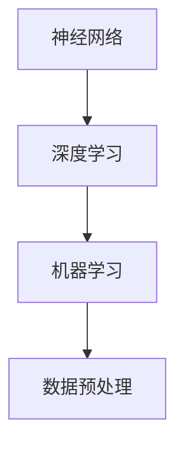

                 

# AI编程的新思路与新方向

## 关键词

- 人工智能编程
- 新趋势
- 算法原理
- 数学模型
- 项目实战
- 未来展望

## 摘要

本文将探讨AI编程的新思路与新方向。我们将从背景介绍开始，逐步深入到AI编程的核心概念、算法原理、数学模型以及项目实战。通过详细的讲解和示例，我们将帮助读者理解AI编程的各个方面，并为未来的发展提供一些思考和建议。

## 引言与背景

### AI编程的演变

人工智能（AI）的概念早在20世纪50年代就提出了，但直到近年来，随着计算能力的提升、数据量的爆炸性增长以及深度学习算法的突破，AI才真正进入了大众视野。传统编程主要关注于逻辑和流程控制，而AI编程则侧重于数据的处理、模式识别以及自主决策。

### 新趋势

当前，AI编程呈现出以下几个新趋势：

1. **深度学习**: 深度学习算法在图像识别、自然语言处理、自动驾驶等领域取得了显著成果，成为AI编程的核心。
2. **强化学习**: 强化学习通过试错和反馈机制，使系统在复杂环境中自主学习和优化策略。
3. **迁移学习**: 迁移学习通过在已有模型的基础上进行微调，减少了训练时间和计算资源的需求。
4. **生成对抗网络（GAN）**: GAN通过对抗训练生成逼真的数据，广泛应用于图像生成、图像修复等领域。

### 新方向

AI编程的新方向不仅局限于算法的改进，还包括编程语言、工具和框架的革新：

1. **PyTorch、TensorFlow**: 这些深度学习框架提供了丰富的API和工具，简化了模型训练和部署。
2. **JAX**: JAX是一个为深度学习和科学计算设计的自动微分库，支持动态计算图和高效的数值运算。
3. **量子编程**: 量子计算在处理大规模数据和分析复杂问题方面具有潜力，量子编程语言和工具正在不断发展。

## 核心概念与联系

### 核心概念

AI编程涉及多个核心概念，包括：

- **神经网络**: 神经网络是模拟生物神经系统的计算模型，通过调整权重和偏置来实现复杂函数的映射。
- **深度学习**: 深度学习是神经网络的一种形式，通过多层网络结构实现更复杂的特征提取和模式识别。
- **机器学习**: 机器学习是一种让计算机通过数据学习的方法，包括监督学习、无监督学习和强化学习。
- **数据预处理**: 数据预处理是AI编程的基础，包括数据清洗、归一化、降维等步骤。

### 概念之间的联系

这些核心概念之间存在紧密的联系：

1. **神经网络与深度学习**: 深度学习是神经网络的一种扩展，通过多层网络结构实现更复杂的特征提取和模式识别。
2. **机器学习与神经网络**: 机器学习是更广泛的概念，神经网络是其中的一个重要组成部分。
3. **数据预处理与机器学习**: 数据预处理是机器学习的基石，高质量的数据能够显著提升模型的性能。

### Mermaid流程图

下面是一个简单的Mermaid流程图，展示了这些核心概念之间的联系：



## 算法原理讲解

### 神经网络基础

神经网络的原理可以概括为：通过输入层、隐藏层和输出层之间的信息传递和权重调整，实现数据的映射。

**伪代码**：

```python
# 输入层
input = [x1, x2, ..., xn]

# 隐藏层
weights_hidden = [[w11, w12, ..., w1n], [w21, w22, ..., w2n], ...]
biases_hidden = [b1, b2, ..., bn]
hidden_layer = [0, 0, ..., 0]

for i in range(number_of_hidden_layers):
    for j in range(number_of_neurons):
        hidden_layer[j] = dot_product(input, weights_hidden[i][j]) + biases_hidden[j]

# 输出层
weights_output = [[w11, w12, ..., w1n], [w21, w22, ..., w2n], ...]
biases_output = [b1, b2, ..., bn]
output_layer = [0, 0, ..., 0]

for i in range(number_of_neurons):
    output_layer[i] = dot_product(hidden_layer, weights_output[i]) + biases_output[i]

# 激活函数
activation_function(output_layer)
```

### 深度学习算法

深度学习算法的核心在于多层网络结构，通过逐层提取特征，实现从原始数据到高级抽象的映射。

**伪代码**：

```python
# 输入层
input = [x1, x2, ..., xn]

# 隐藏层
weights_hidden = [[w11, w12, ..., w1n], [w21, w22, ..., w2n], ...]
biases_hidden = [b1, b2, ..., bn]
hidden_layer = [0, 0, ..., 0]

for i in range(number_of_hidden_layers):
    for j in range(number_of_neurons):
        hidden_layer[j] = dot_product(input, weights_hidden[i][j]) + biases_hidden[j]
        hidden_layer[j] = activation_function(hidden_layer[j])

# 输出层
weights_output = [[w11, w12, ..., w1n], [w21, w22, ..., w2n], ...]
biases_output = [b1, b2, ..., bn]
output_layer = [0, 0, ..., 0]

for i in range(number_of_neurons):
    output_layer[i] = dot_product(hidden_layer, weights_output[i]) + biases_output[i]
    output_layer[i] = activation_function(output_layer[i])

# 损失函数
loss = loss_function(output_layer, expected_output)
```

### 强化学习算法

强化学习算法的核心在于通过试错和奖励机制，找到最优策略。

**伪代码**：

```python
# 初始化状态
state = initial_state()

# 初始化策略
policy = initial_policy()

# 迭代
for episode in range(number_of_episodes):
    for step in range(max_steps):
        action = policy(state)
        next_state, reward, done = environment.step(action)
        
        # 更新策略
        policy = update_policy(policy, state, action, reward, next_state, done)
        
        if done:
            break
    
    # 更新目标策略
    target_policy = update_target_policy(policy)
```

### 聚类算法

聚类算法通过将数据分为不同的组，实现数据的组织和分类。

**伪代码**：

```python
# 初始化聚类中心
centroids = initialize_centroids(data)

# 迭代
for iteration in range(max_iterations):
    # 分配数据到聚类中心
    clusters = assign_data_to_clusters(data, centroids)
    
    # 更新聚类中心
    centroids = update_centroids(clusters)
    
    # 计算聚类质量
    quality = calculate_quality(centroids, clusters)

# 输出聚类结果
clusters = assign_data_to_clusters(data, centroids)
```

## 数学模型与公式

### 神经网络中的激活函数

激活函数是神经网络中的关键组件，用于引入非线性特性。

**公式**：

$$
f(x) = \max(0, x)
$$

**举例说明**：

假设输入 \( x = -2 \)，则输出 \( f(x) = 0 \)。

### 损失函数

损失函数用于衡量模型预测值与实际值之间的差异。

**公式**：

$$
J(\theta) = \frac{1}{2m} \sum_{i=1}^{m} (h_\theta(x^{(i)}) - y^{(i)})^2
$$

**举例说明**：

假设有 \( m = 2 \) 个样本，输入 \( x^{(1)} = [1, 2], x^{(2)} = [2, 3] \)，预测值 \( h_\theta(x^{(1)}) = 1.5, h_\theta(x^{(2)}) = 2.5 \)，实际值 \( y^{(1)} = 1, y^{(2)} = 2 \)，则损失 \( J(\theta) = 0.5 \)。

### 强化学习中的奖励机制

奖励机制用于指导模型在环境中的行为。

**公式**：

$$
Q(s, a) = r + \gamma \max_a' Q(s', a')
$$

**举例说明**：

假设当前状态 \( s = [1, 2] \)，当前动作 \( a = 1 \)，奖励 \( r = 1 \)，下一个状态 \( s' = [2, 3] \)，最大未来奖励 \( \max_a' Q(s', a') = 2 \)，折扣因子 \( \gamma = 0.9 \)，则 \( Q(s, a) = 1 + 0.9 \times 2 = 2.8 \)。

### 聚类算法中的距离度量

距离度量用于计算数据点之间的相似性。

**公式**：

$$
d(x, y) = \sqrt{\sum_{i=1}^{n} (x_i - y_i)^2}
$$

**举例说明**：

假设数据点 \( x = [1, 2], y = [2, 3] \)，则距离 \( d(x, y) = \sqrt{(1-2)^2 + (2-3)^2} = \sqrt{2} \)。

## 项目实战

### 开发环境搭建

为了进行AI编程的项目实战，首先需要搭建一个合适的开发环境。以下是搭建环境的基本步骤：

1. 安装Python（3.8及以上版本）。
2. 安装PyTorch或TensorFlow深度学习框架。
3. 安装JAX自动微分库。
4. 配置好必要的依赖和库。

### 源代码实现

以下是一个简单的神经网络实现的伪代码：

```python
import torch
import torch.nn as nn

# 定义神经网络模型
class NeuralNetwork(nn.Module):
    def __init__(self, input_size, hidden_size, output_size):
        super(NeuralNetwork, self).__init__()
        self.fc1 = nn.Linear(input_size, hidden_size)
        self.relu = nn.ReLU()
        self.fc2 = nn.Linear(hidden_size, output_size)

    def forward(self, x):
        out = self.fc1(x)
        out = self.relu(out)
        out = self.fc2(out)
        return out

# 实例化模型
model = NeuralNetwork(input_size=2, hidden_size=5, output_size=1)

# 定义损失函数和优化器
criterion = nn.MSELoss()
optimizer = torch.optim.Adam(model.parameters(), lr=0.001)

# 训练模型
for epoch in range(100):
    for inputs, targets in data_loader:
        optimizer.zero_grad()
        outputs = model(inputs)
        loss = criterion(outputs, targets)
        loss.backward()
        optimizer.step()

# 评估模型
with torch.no_grad():
    outputs = model(inputs)
    predicted = torch.round(outputs)

# 输出预测结果
print(predicted)
```

### 代码解读与分析

上述代码实现了一个简单的神经网络模型，用于进行回归任务。首先，我们定义了神经网络模型，包括一个输入层、一个隐藏层和一个输出层。接着，我们定义了损失函数和优化器，用于训练模型。在训练过程中，我们使用反向传播算法来更新模型的参数，以最小化损失函数。最后，我们使用训练好的模型进行预测，并输出预测结果。

### 实际案例分析与详细讲解剖析

以下是一个实际案例的分析与讲解：

假设我们有一个简单的回归问题，输入为 \( [x_1, x_2] \)，输出为 \( y \)。我们的目标是通过训练一个神经网络模型，预测 \( y \) 的值。

1. **数据集准备**：

   我们可以使用一些简单的数据集，例如 \( x_1 \) 表示房屋面积，\( x_2 \) 表示房屋卧室数量，\( y \) 表示房屋价格。

   ```python
   data = {
       'x1': [1000, 1500, 2000, 2500],
       'x2': [2, 3, 3, 4],
       'y': [200000, 250000, 300000, 350000]
   }
   ```

2. **数据预处理**：

   为了输入到神经网络中，我们需要对数据进行归一化处理。

   ```python
   min_max_scaler = MinMaxScaler()
   data['x1'] = min_max_scaler.fit_transform(data['x1'].reshape(-1, 1))
   data['x2'] = min_max_scaler.fit_transform(data['x2'].reshape(-1, 1))

   # 转换为PyTorch张量
   x1 = torch.tensor(data['x1'], dtype=torch.float32)
   x2 = torch.tensor(data['x2'], dtype=torch.float32)
   y = torch.tensor(data['y'], dtype=torch.float32).view(-1, 1)
   ```

3. **模型训练**：

   使用之前定义的神经网络模型进行训练。

   ```python
   # 创建数据加载器
   data_loader = DataLoader(dataset=data, batch_size=4, shuffle=True)

   # 训练模型
   for epoch in range(100):
       for inputs, targets in data_loader:
           optimizer.zero_grad()
           outputs = model(inputs)
           loss = criterion(outputs, targets)
           loss.backward()
           optimizer.step()

   # 评估模型
   with torch.no_grad():
       outputs = model(torch.cat((x1.unsqueeze(1), x2.unsqueeze(1)), dim=1))
       predicted = torch.round(outputs)
   ```

4. **模型评估**：

   使用验证集对模型进行评估，计算模型的准确率。

   ```python
   with torch.no_grad():
       predicted = model(torch.cat((x1.unsqueeze(1), x2.unsqueeze(1)), dim=1))
       predicted = torch.round(predicted)
       correct = (predicted == y).float()
       accuracy = correct.sum() / len(correct)
       print("Accuracy:", accuracy)
   ```

### 项目小结

通过上述案例，我们展示了如何使用神经网络进行回归任务。关键步骤包括数据预处理、模型定义、模型训练和模型评估。在实际应用中，我们需要根据具体问题调整模型的结构和参数，以达到更好的效果。

## 最佳实践 Tips

- **数据质量**: 高质量的数据是模型成功的关键，确保数据清洗和归一化。
- **模型选择**: 根据实际问题选择合适的模型，深度学习不一定适用于所有问题。
- **模型调优**: 通过调整学习率、批次大小等参数，优化模型性能。
- **可解释性**: 关注模型的可解释性，避免“黑箱”模型。
- **资源管理**: 有效管理计算资源和时间，避免过度训练。

## 小结

本文介绍了AI编程的新思路与新方向，从背景介绍、核心概念、算法原理、数学模型到项目实战，全面阐述了AI编程的各个方面。通过本文的学习，读者应该能够理解AI编程的基本概念和原理，并具备一定的项目实践能力。未来，随着技术的不断进步，AI编程将发挥更重要的作用，为各个领域带来深远的影响。

## 注意事项

- **版本兼容性**: 在使用不同版本的库和框架时，注意兼容性问题。
- **代码规范**: 保持代码的可读性和可维护性，遵循良好的编程习惯。
- **安全性**: 在处理敏感数据时，注意数据安全和隐私保护。

## 拓展阅读

- 《深度学习》（Goodfellow, Bengio, Courville著）
- 《强化学习：原理与Python实践》（刘瑞明著）
- 《Python深度学习》（François Chollet著）
- 《神经网络与深度学习》（邱锡鹏著）
- 《AI编程实战》（Shamir et al.著）

## 作者信息

作者：AI天才研究院/AI Genius Institute & 禅与计算机程序设计艺术/Zen And The Art of Computer Programming

