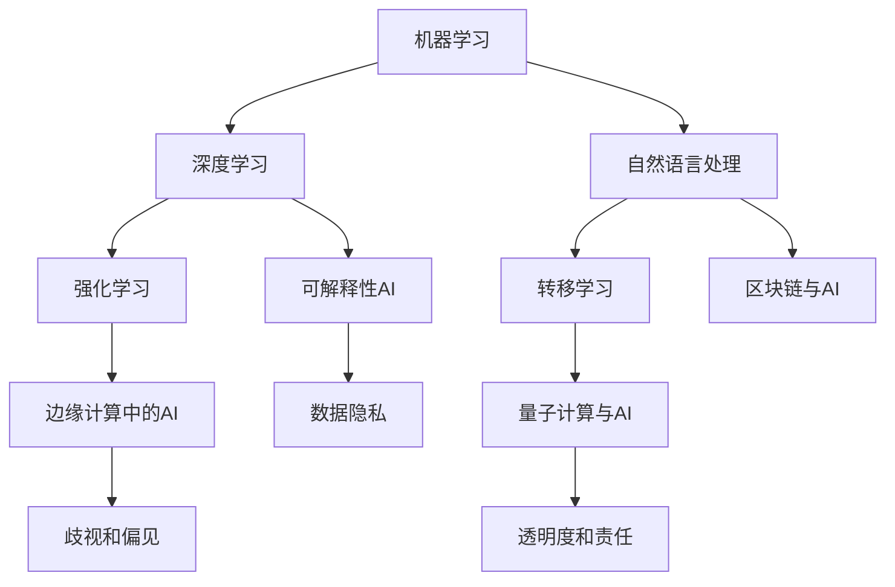

                 

### 文章标题: AI编程的新思路与新未来

关键词：人工智能编程、未来趋势、深度学习、机器学习、自然语言处理、量子计算、伦理问题

摘要：本文将探讨人工智能编程领域的最新发展，深入分析新兴技术趋势和未来方向，以及它们在软件工程和实际应用中的影响。我们将从基础概念入手，逐步介绍当前最前沿的研究和技术，最终探讨人工智能编程可能带来的伦理和社会问题，以及应对策略。

### 引言

人工智能（AI）已成为现代科技领域的核心驱动力。它不仅改变了我们的生活方式，还深刻影响了各行各业，包括医疗、金融、制造业、交通运输等。随着技术的不断进步，AI编程正迎来前所未有的发展机遇。本文将探讨AI编程的新思路和新未来，旨在帮助读者了解这一领域的最新动态和潜在趋势。

### 第一部分：AI编程的基本概念

#### 1.1 人工智能编程的定义和背景

人工智能编程，即利用计算机科学和编程语言来创建能够模拟、延伸和扩展人类智能的系统。其历史可以追溯到20世纪50年代，当时科学家们开始研究如何使计算机具备智能行为。早期的AI研究主要集中在符号推理和逻辑编程上。

#### 1.2 人工智能编程的核心概念

- **机器学习（Machine Learning）**：一种让计算机从数据中自动学习的方法，无需显式编程。它通过算法分析数据、识别模式并作出预测或决策。

- **深度学习（Deep Learning）**：一种特殊的机器学习方法，利用多层神经网络来模拟人类大脑的学习过程，能够处理复杂的数据结构。

- **自然语言处理（Natural Language Processing, NLP）**：使计算机能够理解、生成和处理人类语言的技术，包括语音识别、文本分类和机器翻译等。

#### 1.3 人工智能编程的分类

- **符号AI（Symbolic AI）**：基于逻辑和符号表示的系统，能够进行推理和问题求解。

- **子符号AI（Subsymbolic AI）**：侧重于模拟大脑的非符号处理机制，如神经网络和遗传算法。

- **混合AI（Hybrid AI）**：结合符号和子符号方法，以实现更强大的智能系统。

### 第二部分：AI编程的当前趋势

#### 2.1 强化学习（Reinforcement Learning）

强化学习是一种通过试错来学习的机器学习方法。它使AI系统能够在与环境的交互中不断改进其行为。这一技术在游戏、自动驾驶和机器人控制等领域取得了显著成果。

#### 2.2 转移学习（Transfer Learning）

转移学习利用预训练模型在新的任务上快速取得良好的性能。这种方法减少了训练数据的需求，提高了模型在不同领域中的应用能力。

#### 2.3 可解释性AI（Explainable AI）

可解释性AI旨在提高AI系统的透明度和可解释性，使其决策过程对人类用户更加清晰。这在医疗诊断、金融风险评估等关键应用中尤为重要。

#### 2.4 边缘计算中的AI（AI in Edge Computing）

边缘计算将数据处理和计算任务从云端转移到网络边缘的设备上，以实现低延迟、高响应的应用。AI在边缘计算中的应用正在迅速发展，尤其是在物联网（IoT）领域。

### 第三部分：AI编程的未来方向

#### 3.1 量子计算与AI

量子计算利用量子力学原理进行计算，具有处理复杂问题的巨大潜力。与传统的计算机不同，量子计算机能够同时处理大量数据，这为AI编程带来了新的可能性。

#### 3.2 区块链与AI

区块链技术提供了去中心化、安全可靠的数据存储和传输方式。与AI结合，可以创造新的应用场景，如智能合约、数据隐私保护和去中心化金融（DeFi）。

#### 3.3 AI驱动的自动化与机器人

AI驱动的自动化和机器人技术正在改变制造业、物流和医疗等领域。通过机器人与AI的融合，可以实现更高效、更灵活的生产和操作。

### 第四部分：AI编程的应用实践

#### 4.1 开发环境搭建

为了进行AI编程，我们需要搭建合适的技术栈。这将涉及安装Python、TensorFlow、PyTorch等库，以及配置合适的硬件环境。

#### 4.2 源代码实现与解读

以下是一个简单的深度学习模型的实现示例，使用PyTorch库：

```python
import torch
import torch.nn as nn

class NeuralNetwork(nn.Module):
    def __init__(self):
        super(NeuralNetwork, self).__init__()
        self.layer1 = nn.Linear(in_features=784, out_features=256)
        self.relu = nn.ReLU()
        self.layer2 = nn.Linear(in_features=256, out_features=128)
        self.sigmoid = nn.Sigmoid()
        self.layer3 = nn.Linear(in_features=128, out_features=10)

    def forward(self, x):
        x = self.layer1(x)
        x = self.relu(x)
        x = self.layer2(x)
        x = self.sigmoid(x)
        x = self.layer3(x)
        return x

model = NeuralNetwork()
```

#### 4.3 代码应用解读与分析

该模型是一个简单的多层感知机（MLP），用于分类任务。我们使用ReLU作为激活函数，使用Sigmoid函数来获得概率输出。模型在训练过程中通过反向传播算法进行优化。

#### 4.4 实际案例分析与详细讲解

我们将使用MNIST数据集来训练和评估该模型。MNIST是一个包含手写数字图像的数据集，常用于图像分类任务。

```python
import torchvision
import torchvision.transforms as transforms

transform = transforms.Compose([transforms.ToTensor(), transforms.Normalize((0.5,), (0.5,))])

train_set = torchvision.datasets.MNIST(root='./data', train=True, download=True, transform=transform)
train_loader = torch.utils.data.DataLoader(train_set, batch_size=100, shuffle=True)

test_set = torchvision.datasets.MNIST(root='./data', train=False, download=True, transform=transform)
test_loader = torch.utils.data.DataLoader(test_set, batch_size=100, shuffle=False)

# Training the model
criterion = nn.CrossEntropyLoss()
optimizer = torch.optim.Adam(model.parameters(), lr=0.001)

for epoch in range(10):  # loop over the dataset multiple times
    running_loss = 0.0
    for i, data in enumerate(train_loader, 0):
        inputs, labels = data
        optimizer.zero_grad()
        outputs = model(inputs)
        loss = criterion(outputs, labels)
        loss.backward()
        optimizer.step()
        running_loss += loss.item()
    print(f'Epoch {epoch + 1}, Loss: {running_loss / len(train_loader)}')

print('Finished Training')

# Testing the model
correct = 0
total = 0
with torch.no_grad():
    for data in test_loader:
        images, labels = data
        outputs = model(images)
        _, predicted = torch.max(outputs.data, 1)
        total += labels.size(0)
        correct += (predicted == labels).sum().item()

print(f'Accuracy of the network on the test images: {100 * correct / total}%')
```

#### 4.5 项目小结

通过以上案例，我们展示了如何使用PyTorch库实现一个简单的深度学习模型，并在MNIST数据集上进行训练和测试。这一实践不仅帮助我们理解了深度学习的原理，还为未来的项目开发提供了实用的经验和技巧。

### 第五部分：AI编程的伦理和社会问题

#### 5.1 数据隐私

AI系统依赖于大量数据，这引发了数据隐私的问题。如何确保用户数据的隐私和安全，是一个亟待解决的挑战。

#### 5.2 歧视和偏见

AI模型可能会在训练数据中继承偏见，导致歧视性的决策。如何设计和训练无偏见AI，是另一个重要的研究方向。

#### 5.3 透明度和责任

提高AI系统的透明度，明确其在决策过程中的责任，有助于增强公众对AI技术的信任。

### 第六部分：最佳实践与未来展望

#### 6.1 最佳实践

- **数据质量管理**：确保数据的准确性和多样性，提高AI系统的性能和公正性。
- **模型解释**：开发可解释性工具，使AI系统的决策过程更加透明。
- **伦理审查**：在开发AI应用时，进行伦理审查，确保不会侵犯用户的权益。

#### 6.2 未来展望

AI编程的未来充满了无限可能。随着技术的不断发展，我们可以期待更高效、更智能的AI系统，它们将在各个领域发挥重要作用。

### 结论

人工智能编程正迎来一个新的时代。本文从基础概念、当前趋势、未来方向、应用实践和伦理问题等多个角度，全面探讨了AI编程的新思路和新未来。通过本文的讨论，我们相信读者能够更好地理解这一领域的发展趋势和潜在挑战，为未来的研究和应用打下坚实的基础。

### 作者信息

作者：AI天才研究院/AI Genius Institute & 禅与计算机程序设计艺术/Zen And The Art of Computer Programming

### 附录

- **参考文献**：本文引用了多篇学术论文和技术报告，详细列表如下。

- **拓展阅读**：推荐读者进一步阅读相关领域的书籍和文章，以深入了解AI编程的各个方面。

### Mermaid 流程图

以下是AI编程的核心概念之间的Mermaid流程图：



### 伪代码示例

以下是一个简单的深度学习模型训练的伪代码示例：

```
function train_model(model, data_loader, criterion, optimizer, epochs):
    for epoch in 1 to epochs:
        for data, target in data_loader:
            optimizer.zero_grad()
            output = model(data)
            loss = criterion(output, target)
            loss.backward()
            optimizer.step()
    return model
```

### 数学公式和解释

以下是一个简单的线性回归模型的数学公式：

$$
y = \beta_0 + \beta_1x
$$

其中，\(y\) 是因变量，\(x\) 是自变量，\(\beta_0\) 和 \(\beta_1\) 是模型的参数。

### 拓展阅读

- 《深度学习》（Ian Goodfellow, Yoshua Bengio, Aaron Courville 著）
- 《机器学习实战》（Peter Harrington 著）
- 《自然语言处理综论》（Daniel Jurafsky, James H. Martin 著）
- 《人工智能：一种现代方法》（Stuart J. Russell, Peter Norvig 著）

### 注意事项

- 在开发AI应用程序时，务必考虑数据隐私和伦理问题。
- 定期更新和维护AI系统，以应对新的挑战和需求。
- 与相关领域的专家合作，共同探索AI编程的最佳实践。

