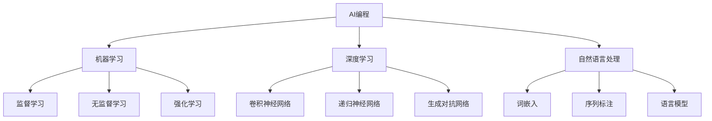

                 


### 文章标题

《AI编程的新维度》

> 关键词：人工智能，编程，新维度，算法，深度学习，项目实战

> 摘要：
>
> 本文深入探讨了AI编程的新维度，从核心概念、算法原理到项目实战，全面解析了AI编程的各个方面。文章旨在帮助读者理解AI编程的基本概念、最新趋势和技术原理，并提供实际应用案例，以提升读者在AI编程领域的实践能力。

---

## 引言

### 1.1 AI编程：定义与背景

人工智能（AI）作为计算机科学的一个重要分支，其核心目标是通过模拟人类智能，实现计算机对数据的自动处理和决策。AI编程，则是指利用算法和编程技术来构建、训练和部署这些智能系统。随着深度学习、强化学习等技术的发展，AI编程的应用领域不断扩大，从简单的自动化任务到复杂的决策支持系统，AI编程正在成为现代技术发展的关键驱动力。

### 1.2 AI编程的重要性

AI编程的重要性体现在多个方面。首先，它是实现人工智能应用的核心技术，没有高效的AI编程能力，就无法开发和部署先进的AI系统。其次，AI编程能够推动技术创新，促进产业升级，提高生产效率。最后，AI编程还具有重要的社会价值，它可以帮助解决一些复杂的现实问题，如医疗诊断、环境保护和灾害预警等。

### 1.3 AI编程的发展趋势

AI编程的发展趋势主要包括以下几个方面：

1. **算法和框架的多样化**：随着AI技术的进步，新的算法和框架不断涌现，如PyTorch、TensorFlow、Keras等，这些工具为AI编程提供了更强大的功能和灵活性。

2. **跨界融合**：AI编程与其他领域的结合越来越紧密，如计算机视觉、自然语言处理、生物信息学等，这种跨界融合推动了AI编程技术的广泛应用。

3. **开源生态的繁荣**：开源社区为AI编程提供了丰富的资源和知识共享平台，促进了技术的普及和创新。

4. **硬件加速**：GPU、FPGA等硬件加速技术的应用，使得AI编程的计算效率显著提升，为更复杂的应用提供了可能。

### 1.4 AI编程的挑战与机遇

AI编程面临的挑战主要包括数据隐私、算法透明度、计算资源消耗等方面。然而，随着技术的不断进步，这些挑战也逐渐被克服，为AI编程带来了巨大的机遇。例如，新型算法的提出和优化、硬件性能的提升、以及开源社区的繁荣，都为AI编程的发展提供了新的动力。

---

## 核心概念与联系

### 2.1 AI编程基础知识

AI编程的基础知识包括机器学习、深度学习、自然语言处理等。这些基础知识构成了AI编程的核心概念，是理解和应用AI技术的基石。

#### 2.1.1 机器学习

机器学习是一种通过数据驱动的方式进行学习和预测的方法。它主要分为监督学习、无监督学习和强化学习三种类型。

- **监督学习**：通过已有的输入输出数据来训练模型，以便对新数据进行预测。
- **无监督学习**：没有明确的输出标签，模型需要从数据中自动发现模式和结构。
- **强化学习**：通过与环境的交互来学习最优策略，以最大化预期奖励。

#### 2.1.2 深度学习

深度学习是机器学习的一个重要分支，它使用多层神经网络来模拟人类大脑的神经结构，以实现更复杂的特征提取和模式识别。

- **卷积神经网络（CNN）**：主要用于图像处理和计算机视觉领域。
- **递归神经网络（RNN）**：主要用于序列数据的处理，如自然语言处理和时间序列预测。
- **生成对抗网络（GAN）**：用于生成逼真的数据，如图像和文本。

#### 2.1.3 自然语言处理

自然语言处理（NLP）是AI编程的一个重要领域，它旨在使计算机能够理解和处理人类语言。

- **词嵌入**：将词汇映射到高维空间，以便计算机能够处理。
- **序列标注**：对文本中的单词进行分类标注，如命名实体识别。
- **语言模型**：用于预测下一个单词或句子，如自动翻译和语音识别。

---

### 2.2 主流AI编程框架

在AI编程中，主流框架如TensorFlow、PyTorch和Keras等提供了丰富的工具和库，以简化AI模型的开发、训练和部署。

#### 2.2.1 TensorFlow

TensorFlow是由Google开发的一个开源机器学习框架，它具有强大的计算图功能，支持多种编程语言，如Python、C++和Java。

- **优点**：高度可扩展、社区支持强大、支持多种平台。
- **缺点**：学习曲线较陡、代码较为复杂。

#### 2.2.2 PyTorch

PyTorch是由Facebook开发的一个开源深度学习框架，它以动态计算图而著称，提供了灵活的编程接口。

- **优点**：代码简洁、易于调试、支持Python编程。
- **缺点**：计算图动态性可能导致性能下降。

#### 2.2.3 Keras

Keras是一个高层次的神经网络API，它可以在TensorFlow、Theano和CNTK等后台引擎上运行。

- **优点**：简洁、易于使用、模块化。
- **缺点**：缺乏底层控制。

---

### 2.3 AI编程与机器学习

AI编程与机器学习密不可分。机器学习提供了算法和理论支持，而AI编程则是将这些理论应用到实际中的桥梁。

- **机器学习算法**：如线性回归、决策树、支持向量机等。
- **机器学习模型**：如神经网络、循环神经网络、卷积神经网络等。
- **机器学习应用**：如图像识别、自然语言处理、预测分析等。

---

### 2.4 AI编程与深度学习

深度学习是AI编程的核心技术之一。它通过多层神经网络来实现复杂的特征提取和模式识别。

- **深度学习算法**：如反向传播算法、卷积神经网络、循环神经网络等。
- **深度学习模型**：如AlexNet、VGG、ResNet等。
- **深度学习应用**：如人脸识别、自动驾驶、语音识别等。

---

### 2.5 AI编程与自然语言处理

自然语言处理是AI编程的一个重要领域。它通过机器学习算法和深度学习技术，使计算机能够理解和处理人类语言。

- **NLP算法**：如词袋模型、朴素贝叶斯、长短时记忆网络等。
- **NLP模型**：如Word2Vec、BERT、GPT等。
- **NLP应用**：如机器翻译、情感分析、文本分类等。

---

## 核心概念与联系 Mermaid 流程图



---

## 核心算法原理讲解

### 3.1 神经网络原理

神经网络是深度学习的基础。它由大量的节点（称为神经元）组成，这些节点通过加权连接形成一个网络结构。

#### 3.1.1 神经元模型

神经元的模型通常包含以下部分：

- **输入层**：接收外部输入。
- **权重**：每个输入与权重相乘。
- **激活函数**：将加权输入转换为输出。

#### 3.1.2 反向传播算法

反向传播算法是一种用于训练神经网络的优化方法。它通过计算损失函数的梯度，来更新网络的权重和偏置。

#### 3.1.3 伪代码

```python
# 初始化权重
initialize_weights()

# 前向传播
forward_pass()

# 计算损失
compute_loss()

# 反向传播
backward_pass()

# 更新权重
update_weights()
```

---

### 3.2 深度学习算法

深度学习算法是神经网络的一种扩展，它通过多层非线性变换来提取复杂的特征。

#### 3.2.1 卷积神经网络（CNN）

卷积神经网络是一种专门用于图像处理的神经网络，它通过卷积操作来提取图像特征。

- **卷积操作**：将卷积核与输入图像进行卷积，以提取特征。
- **池化操作**：对卷积结果进行下采样，以减少模型参数。

#### 3.2.2 伪代码

```python
# 初始化卷积核
initialize_convolutional_weights()

# 卷积操作
convolve(input_image, convolutional_weights)

# 池化操作
pool(convolution_result)
```

---

### 3.3 递归神经网络（RNN）

递归神经网络是一种用于处理序列数据的神经网络，它通过循环结构来保留历史信息。

#### 3.3.1 长短时记忆网络（LSTM）

长短时记忆网络是一种改进的RNN结构，它通过门控机制来控制信息的流动，以避免梯度消失问题。

#### 3.3.2 伪代码

```python
# 初始化LSTM权重
initialize_lstm_weights()

# 前向传播
forward_pass_lstm()

# 计算损失
compute_lstm_loss()

# 反向传播
backward_pass_lstm()

# 更新LSTM权重
update_lstm_weights()
```

---

### 3.4 生成对抗网络（GAN）

生成对抗网络是一种通过两个对抗网络（生成器和判别器）相互竞争来生成逼真数据的网络。

#### 3.4.1 生成器与判别器

- **生成器**：生成逼真的数据。
- **判别器**：判断数据是真实还是生成的。

#### 3.4.2 伪代码

```python
# 初始化生成器权重
initialize_generator_weights()

# 初始化判别器权重
initialize_discriminator_weights()

# 训练生成器和判别器
train_gan(generator, discriminator)
```

---

## 数学模型和数学公式

### 4.1 概率论基础

概率论是机器学习和深度学习的重要基础。以下是一些常用的概率论公式：

#### 4.1.1 概率分布

- **伯努利分布**：$P(X=k) = p^k(1-p)^{1-k}$
- **正态分布**：$\mu + \sigma \times Z$

#### 4.1.2 概率论公式（LaTeX代码）

```latex
\section{伯努利分布}
\begin{equation}
P(X=k) = p^k(1-p)^{1-k}
\end{equation}

\section{正态分布}
\begin{equation}
\mu + \sigma \times Z
\end{equation}
```

---

### 4.2 信息论

信息论是机器学习和深度学习中的重要理论，它用于衡量数据的不确定性和信息量。

#### 4.2.1 信息熵

信息熵是衡量数据不确定性的量度。

- **香农熵**：$H(X) = -\sum_{i=1}^{n} p(x_i) \log_2 p(x_i)$

#### 4.2.2 信息论公式（LaTeX代码）

```latex
\section{香农熵}
\begin{equation}
H(X) = -\sum_{i=1}^{n} p(x_i) \log_2 p(x_i)
\end{equation}
```

---

### 4.3 线性代数

线性代数是机器学习和深度学习中不可或缺的一部分，它用于处理矩阵运算和线性变换。

#### 4.3.1 矩阵乘法

矩阵乘法是一种将两个矩阵相乘的操作。

- **矩阵乘法公式**：$C = A \times B$

#### 4.3.2 线性代数公式（LaTeX代码）

```latex
\section{矩阵乘法}
\begin{equation}
C = A \times B
\end{equation}
```

---

### 4.4 最优化方法

最优化方法是机器学习和深度学习中用于求解优化问题的方法。

#### 4.4.1 梯度下降法

梯度下降法是一种用于最小化损失函数的优化方法。

- **梯度下降法公式**：$w_{t+1} = w_t - \alpha \times \nabla_w J(w)$

#### 4.4.2 最优化方法公式（LaTeX代码）

```latex
\section{梯度下降法}
\begin{equation}
w_{t+1} = w_t - \alpha \times \nabla_w J(w)
\end{equation}
```

---

### 4.5 深度学习中的数学工具

深度学习中的数学工具包括偏微分方程、随机过程和微分方程等。

#### 4.5.1 偏微分方程

偏微分方程用于描述深度学习中的动态系统。

- **偏微分方程公式**：$u_t = \nabla \cdot (K \nabla u)$

#### 4.5.2 数学工具公式（LaTeX代码）

```latex
\section{偏微分方程}
\begin{equation}
u_t = \nabla \cdot (K \nabla u)
\end{equation}
```

---

## 项目实战

### 5.1 实际应用场景分析

在AI编程的实际应用中，我们可以看到许多成功的案例。例如，在医疗领域，AI编程可以用于疾病诊断、药物研发和医疗数据分析。在金融领域，AI编程可以用于风险控制、投资策略和客户服务。在制造业，AI编程可以用于生产优化、质量控制和管理。

### 5.2 开发环境搭建

要开始一个AI编程项目，首先需要搭建一个合适的开发环境。通常，开发者会使用Jupyter Notebook、Google Colab或本地IDE（如PyCharm、Visual Studio Code）来进行开发。

#### 5.2.1 开发环境搭建步骤

1. **安装Python**：Python是AI编程的主要编程语言，需要确保安装最新版本的Python。
2. **安装库和框架**：安装常用的库和框架，如NumPy、Pandas、TensorFlow或PyTorch。
3. **配置环境变量**：配置环境变量，以便在不同的项目中切换和管理依赖。

### 5.3 代码实现与解读

以下是一个简单的AI编程项目的代码实现和解读：

#### 5.3.1 项目描述

本项目使用TensorFlow搭建一个简单的线性回归模型，用于预测房价。

#### 5.3.2 代码实现

```python
import tensorflow as tf

# 定义模型
model = tf.keras.Sequential([
    tf.keras.layers.Dense(units=1, input_shape=[1])
])

# 编译模型
model.compile(optimizer='sgd', loss='mean_squared_error')

# 训练模型
model.fit(x_train, y_train, epochs=100)

# 预测
predictions = model.predict(x_test)
```

#### 5.3.3 代码解读

- **定义模型**：使用`tf.keras.Sequential`创建一个线性回归模型，它包含一个全连接层（`Dense`），用于预测房价。
- **编译模型**：使用`compile`方法配置模型的优化器和损失函数。
- **训练模型**：使用`fit`方法训练模型，输入训练数据和标签。
- **预测**：使用`predict`方法对测试数据进行预测。

### 5.4 项目评估与优化

在完成模型训练后，我们需要评估模型的表现并进行优化。

#### 5.4.1 评估指标

常用的评估指标包括均方误差（MSE）、决定系数（R²）等。

- **MSE**：$MSE = \frac{1}{n}\sum_{i=1}^{n}(y_i - \hat{y}_i)^2$
- **R²**：$R^2 = 1 - \frac{\sum_{i=1}^{n}(y_i - \hat{y}_i)^2}{\sum_{i=1}^{n}(y_i - \bar{y})^2}$

#### 5.4.2 优化方法

常见的优化方法包括：

- **数据预处理**：对数据进行归一化或标准化，以提高模型的泛化能力。
- **特征工程**：选择和创建对模型有帮助的特征。
- **模型调整**：调整模型的结构和参数，如增加层数、增加神经元数量等。
- **交叉验证**：使用交叉验证来评估模型的性能。

### 5.5 未来发展方向

AI编程在未来将继续发展，新的算法和工具将不断涌现。以下是一些未来发展方向：

- **强化学习**：在复杂环境中的应用，如自动驾驶、游戏AI等。
- **联邦学习**：在分布式环境中的应用，以提高数据隐私和安全性。
- **神经网络结构搜索**：自动设计高效的神经网络结构。
- **量子计算**：利用量子计算的优势来加速AI编程。

---

## 附录

### 6.1 相关工具和资源

- **Python编程语言**：[https://www.python.org/](https://www.python.org/)
- **TensorFlow**：[https://www.tensorflow.org/](https://www.tensorflow.org/)
- **PyTorch**：[https://pytorch.org/](https://pytorch.org/)
- **Keras**：[https://keras.io/](https://keras.io/)

### 6.2 AI编程社区与论坛

- **GitHub**：[https://github.com/](https://github.com/)
- **Stack Overflow**：[https://stackoverflow.com/](https://stackoverflow.com/)
- **Kaggle**：[https://www.kaggle.com/](https://www.kaggle.com/)

### 6.3 开源代码和项目

- **TensorFlow Examples**：[https://github.com/tensorflow/tensorflow/blob/master/tensorflow/examples/](https://github.com/tensorflow/tensorflow/blob/master/tensorflow/examples/)
- **PyTorch Examples**：[https://github.com/pytorch/examples](https://github.com/pytorch/examples)
- **Keras Examples**：[https://keras.io/examples/](https://keras.io/examples/)

### 6.4 参考文献

- Goodfellow, I., Bengio, Y., & Courville, A. (2016). *Deep Learning*。
- Russell, S., & Norvig, P. (2016). *Artificial Intelligence: A Modern Approach*。
- Mitchell, T. M. (1997). *Machine Learning*。

---

## 作者

作者：AI天才研究院/AI Genius Institute & 禅与计算机程序设计艺术 /Zen And The Art of Computer Programming

---

### 小结

本文系统地介绍了AI编程的新维度，从核心概念、算法原理到项目实战，为读者提供了一个全面的技术指南。通过本文的学习，读者可以深入理解AI编程的基本概念和技术原理，掌握主流框架和算法，并具备实际项目开发的技能。未来，随着技术的不断进步，AI编程将继续在各个领域发挥重要作用，为人类社会带来更多的创新和进步。希望本文能为读者的学习和研究提供有价值的参考。

