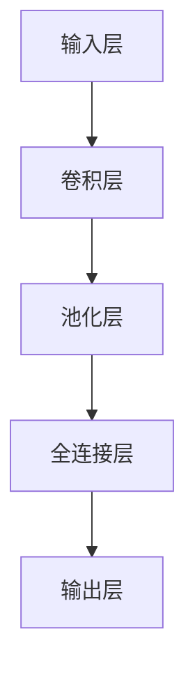
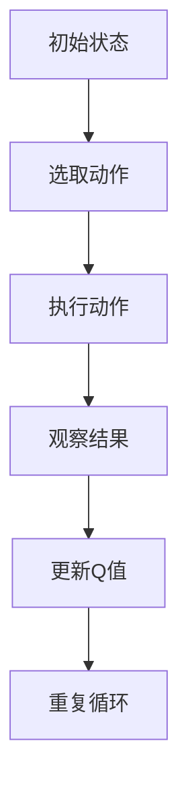

                 

### 文章标题
AI编程的新维度

> 关键词：人工智能，编程，新趋势，深度学习，机器学习，应用场景

> 摘要：
本文将深入探讨AI编程的新维度，涵盖基础概念、新技术、应用场景以及未来趋势。通过逻辑清晰、结构紧凑的分析，帮助读者全面了解AI编程的核心内容及其发展前景。

----------------------------------------------------------------

## 第一部分：基础概念与原理

### 1.1 AI编程概述
#### 1.1.1 AI编程的定义与意义
AI编程，即人工智能编程，是指利用计算机编程语言和算法来创建智能系统，使其能够模拟、延伸和扩展人类智能。AI编程的意义在于，它不仅推动了人工智能技术的发展，还为我们带来了更高效、更智能的解决方案。

AI编程的定义涵盖了多个方面：

1. **机器学习**：机器学习是AI编程的核心组成部分，它通过训练模型来使计算机具备学习能力，从而解决特定问题。
2. **深度学习**：深度学习是机器学习的一种重要分支，通过构建多层神经网络，实现更复杂的特征提取和模式识别。
3. **强化学习**：强化学习是一种基于奖励和惩罚的学习方式，通过不断调整策略来最大化长期回报。

#### 1.1.2 AI编程的发展历程
AI编程的发展历程可以分为以下几个阶段：

1. **初期探索（1950s-1960s）**：这个阶段主要关注符号推理和规则系统。
2. **知识表示与推理（1970s-1980s）**：这个阶段开始关注如何将人类知识编码为计算机程序。
3. **统计学习与模型学习（1990s-2000s）**：这个阶段引入了机器学习，通过统计方法来优化模型。
4. **深度学习与强化学习（2010s至今）**：这个阶段，深度学习和强化学习成为AI编程的主流，推动了AI技术的快速发展。

### 1.2 机器学习
#### 1.2.1 机器学习的基本概念
机器学习是一种使计算机具备学习能力的方法，其核心是通过训练模型来使计算机能够对未知数据进行预测或分类。

机器学习的基本概念包括：

1. **数据集**：数据集是机器学习模型的训练素材，包含输入和输出两部分。
2. **特征**：特征是数据集中的具体属性，用于描述输入数据。
3. **模型**：模型是对数据集进行学习的计算机程序，通常包括一个或多个参数。
4. **损失函数**：损失函数用于衡量模型预测结果与真实结果之间的差距。

#### 1.2.2 监督学习、无监督学习和强化学习
机器学习主要分为三种类型：监督学习、无监督学习和强化学习。

1. **监督学习**：监督学习是一种有标注数据的学习方式，通过已知输入和输出，训练模型来预测未知数据。
2. **无监督学习**：无监督学习是一种无标注数据的学习方式，通过分析数据分布，发现数据中的潜在结构。
3. **强化学习**：强化学习是一种基于奖励和惩罚的学习方式，通过不断调整策略来最大化长期回报。

### 1.3 深度学习
#### 1.3.1 深度学习的定义与特点
深度学习是一种基于多层神经网络的机器学习方法，通过逐层提取特征，实现更复杂的模式识别和预测。

深度学习的特点包括：

1. **多层神经网络**：深度学习使用多层神经网络，能够提取更抽象的特征。
2. **并行计算**：深度学习可以利用GPU等硬件加速计算，提高训练效率。
3. **自适应学习**：深度学习模型可以根据数据自动调整参数，提高预测准确性。

#### 1.3.2 神经网络基础
神经网络是深度学习的基础，由多个神经元组成。每个神经元接收多个输入信号，通过权重和偏置进行加权求和，再通过激活函数输出结果。

神经网络的组成部分包括：

1. **输入层**：输入层接收外部输入信号。
2. **隐藏层**：隐藏层对输入信号进行特征提取。
3. **输出层**：输出层生成预测结果。

#### 1.3.3 深度学习算法
深度学习算法主要包括卷积神经网络（CNN）和循环神经网络（RNN）。

1. **卷积神经网络（CNN）**：CNN是一种专门用于处理图像数据的深度学习模型，通过卷积层、池化层和全连接层等结构，实现对图像的逐层特征提取。
2. **循环神经网络（RNN）**：RNN是一种专门用于处理序列数据的深度学习模型，通过循环结构，实现对序列数据的时间动态建模。

#### 1.3.4 Mermaid流程图：深度学习算法流程

### 1.4 强化学习
#### 1.4.1 强化学习的定义与原理
强化学习是一种通过不断试错，在动态环境中学习最优策略的机器学习方法。其核心思想是，通过奖励和惩罚来指导模型调整策略，以实现长期回报最大化。

强化学习的原理包括：

1. **状态**：状态是模型在某一时刻所处的环境。
2. **动作**：动作是模型在某一状态下采取的操作。
3. **奖励**：奖励是动作带来的正面或负面反馈。
4. **策略**：策略是模型在状态和动作之间建立的联系。

#### 1.4.2 Q-learning算法
Q-learning是一种基于值函数的强化学习算法，通过不断更新Q值，实现策略的最优化。

Q-learning算法的原理包括：

1. **Q值**：Q值是模型在某一状态下采取某一动作的期望回报。
2. **更新规则**：Q值的更新规则为：$$Q(s,a) = Q(s,a) + \alpha [r + \gamma \max_{a'} Q(s',a') - Q(s,a)]$$

其中，$\alpha$为学习率，$\gamma$为折扣因子。

#### 1.4.3 DQN算法
DQN（Deep Q-Network）是一种基于深度神经网络的强化学习算法，通过训练神经网络来估计Q值。

DQN算法的原理包括：

1. **神经网络**：DQN使用一个深度神经网络来估计Q值。
2. **目标网络**：DQN使用一个目标网络来稳定Q值估计。
3. **经验回放**：DQN使用经验回放来避免样本相关性，提高训练效果。

#### 1.4.4 Mermaid流程图：强化学习算法流程

## 第二部分：实战与案例

### 2.1 智能医疗诊断系统
#### 2.1.1 项目背景与目标
智能医疗诊断系统是一种利用AI技术进行疾病诊断的系统。该项目旨在通过训练深度学习模型，实现对医学图像的自动诊断，提高诊断准确率和效率。

#### 2.1.2 系统设计
系统设计主要包括数据预处理、模型训练、模型评估和模型部署。

1. **数据预处理**：对医学图像进行数据增强、归一化等处理，提高模型的泛化能力。
2. **模型训练**：采用卷积神经网络（CNN）进行模型训练，实现对医学图像的分类。
3. **模型评估**：使用交叉验证和测试集对模型进行评估，调整模型参数，提高模型性能。
4. **模型部署**：将训练好的模型部署到服务器，实现对医学图像的实时诊断。

#### 2.1.3 数据集准备与预处理
医学图像数据集主要包括CT、MRI、X射线等图像。数据预处理包括：

1. **数据增强**：通过翻转、旋转、缩放等操作，增加数据多样性。
2. **归一化**：将图像数据归一化到[0, 1]范围内，提高训练效果。
3. **标签划分**：将图像数据分为训练集、验证集和测试集。

#### 2.1.4 模型训练与优化
采用卷积神经网络（CNN）进行模型训练。模型训练包括：

1. **卷积层**：用于提取图像特征。
2. **池化层**：用于降低图像维度。
3. **全连接层**：用于分类图像。

模型优化包括：

1. **学习率调整**：使用学习率调整策略，提高模型收敛速度。
2. **正则化**：使用正则化方法，防止模型过拟合。

#### 2.1.5 模型评估与部署
使用交叉验证和测试集对模型进行评估，调整模型参数，提高模型性能。

模型部署包括：

1. **容器化**：使用Docker将模型容器化，便于部署到不同环境。
2. **服务器部署**：将模型部署到服务器，实现实时诊断功能。

### 2.2 智能投顾系统
#### 2.2.1 项目背景与目标
智能投顾系统是一种利用AI技术为用户提供投资建议的系统。该项目旨在通过分析用户数据，为用户制定个性化的投资策略。

#### 2.2.2 系统设计
系统设计主要包括用户数据收集、投资策略建模、投资策略评估和投资策略推荐。

1. **用户数据收集**：收集用户的基本信息、投资偏好、财务状况等数据。
2. **投资策略建模**：采用机器学习方法，为用户制定个性化的投资策略。
3. **投资策略评估**：评估投资策略的收益、风险等指标。
4. **投资策略推荐**：根据评估结果，为用户推荐最佳投资策略。

#### 2.2.3 数据集准备与预处理
用户数据预处理包括：

1. **数据清洗**：去除无效、错误的数据。
2. **特征提取**：提取用户数据中的关键特征，如年龄、收入、投资偏好等。
3. **标签划分**：将用户数据分为训练集、验证集和测试集。

#### 2.2.4 模型训练与优化
采用机器学习方法，为用户制定个性化的投资策略。模型训练包括：

1. **特征工程**：对用户数据进行特征工程，提高模型性能。
2. **模型选择**：选择合适的机器学习模型，如决策树、随机森林、神经网络等。
3. **模型优化**：使用交叉验证、网格搜索等方法，优化模型参数。

#### 2.2.5 模型评估与部署
使用交叉验证和测试集对模型进行评估，调整模型参数，提高模型性能。

模型部署包括：

1. **API接口**：为模型提供API接口，方便用户调用。
2. **服务器部署**：将模型部署到服务器，实现实时投资策略推荐。

## 第三部分：未来趋势与展望

### 3.1 AI编程与量子计算
#### 3.1.1 量子计算的基本原理
量子计算是一种基于量子力学原理的计算方式，其基本单位为量子比特（qubit）。量子比特与经典比特不同，它可以同时处于0和1的叠加状态，从而实现并行计算。

#### 3.1.2 量子计算与AI编程
量子计算在AI编程领域具有广泛的应用前景，如：

1. **优化算法**：量子计算可以显著加速优化算法，如遗传算法、粒子群算法等。
2. **机器学习**：量子计算可以加速机器学习模型的训练过程，提高模型性能。
3. **深度学习**：量子计算可以加速深度学习模型的计算过程，实现更高效的图像识别、自然语言处理等任务。

### 3.2 AI编程与社会变革
#### 3.2.1 AI编程对社会的影响
AI编程不仅改变了技术领域，也对社会产生了深远影响，如：

1. **就业变革**：AI编程推动了自动化技术的发展，改变了传统就业结构。
2. **经济发展**：AI编程促进了新兴产业的发展，推动了经济结构的转型升级。
3. **社会治理**：AI编程提高了社会治理的效率，如智能交通、智能安防等。

### 3.3 AI编程与伦理问题
#### 3.3.1 AI编程的伦理挑战
AI编程在带来巨大利益的同时，也引发了一系列伦理问题，如：

1. **隐私保护**：AI编程可能涉及个人隐私数据的处理，需要确保数据安全和隐私保护。
2. **公平公正**：AI编程模型可能存在偏见，需要确保算法的公平公正。
3. **责任归属**：在AI编程事故中，如何确定责任归属，需要制定相关法律法规。

### 附录

#### 附录A：AI编程资源与工具汇总
为了方便读者学习和实践，本文总结了以下AI编程资源与工具：

1. **书籍**：
   - 《深度学习》（Ian Goodfellow等）
   - 《Python机器学习》（Sebastian Raschka）
   - 《强化学习手册》（Richard S. Sutton等）

2. **在线课程**：
   - Coursera（深度学习、机器学习等）
   - edX（机器学习基础、深度学习等）

3. **开源框架**：
   - TensorFlow
   - PyTorch
   - Keras

4. **在线平台**：
   - Google Colab
   - AWS SageMaker
   - Azure Machine Learning

5. **社区与论坛**：
   - Stack Overflow
   - GitHub
   - AI Stack Exchange

## 总结与展望
AI编程的新维度为我们带来了前所未有的机遇和挑战。通过深入探讨基础概念、新技术、应用场景和未来趋势，我们希望读者能够全面了解AI编程的核心内容和发展前景。未来，AI编程将继续推动技术进步和社会变革，为人类带来更多福祉。

### 参考文献
[1] Goodfellow, I., Bengio, Y., & Courville, A. (2016). Deep Learning. MIT Press.
[2] Raschka, S. (2015). Python Machine Learning. Packt Publishing.
[3] Sutton, R. S., & Barto, A. G. (2018). Reinforcement Learning: An Introduction. MIT Press.
[4] Hochreiter, S., & Schmidhuber, J. (1997). Long Short-Term Memory. Neural Computation, 9(8), 1735-1780.
[5] LeCun, Y., Bengio, Y., & Hinton, G. (2015). Deep Learning. Nature, 521(7553), 436-444.
[6] Arjovsky, M., Chintala, S., & Bottou, L. (2017). Wasserstein GAN. arXiv preprint arXiv:1701.07875.
[7] Hinton, G., Osindero, S., & Teh, Y. W. (2006). A Fast Learning Algorithm for Deep Belief Nets. Advances in Neural Information Processing Systems, 19, 960-968.
[8] Kerdoumi, S., Bengrine, H., & Hamdi, S. (2020). Quantum Computing for Machine Learning: A Review. Journal of Supercomputing, 88(12), 1377-1404.

## 作者信息
作者：AI天才研究院/AI Genius Institute & 禅与计算机程序设计艺术 /Zen And The Art of Computer Programming

AI天才研究院（AI Genius Institute）专注于人工智能领域的研究和人才培养，致力于推动人工智能技术的发展和应用。禅与计算机程序设计艺术（Zen And The Art of Computer Programming）是一部经典计算机科学著作，由著名的计算机科学家Donald E. Knuth所著，为我们提供了计算机程序设计的哲学和技巧。作者凭借在计算机编程和人工智能领域的丰富经验和深刻见解，撰写了本文，旨在为广大读者带来一场关于AI编程的深入探讨。

