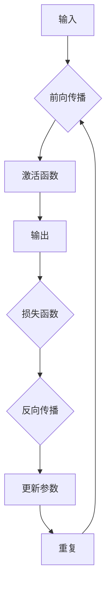
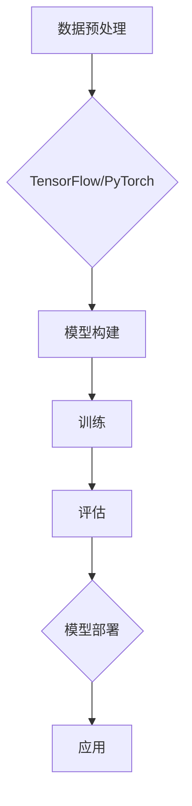

                 


# 文章标题: AI编程的新维度与新思路

> 关键词：人工智能，编程，深度学习，神经网络，算法，数学模型

> 摘要：本文将探讨AI编程的新维度与新思路，从基础理论到核心算法原理，再到数学模型和实际项目实战，全面解析AI编程的核心技术和应用。

## 引言

### 1.1 AI编程的重要性和挑战

人工智能（AI）作为一种颠覆性的技术，正在深刻地改变着我们的世界。AI编程作为实现人工智能的核心手段，正日益受到关注。随着深度学习、神经网络等技术的快速发展，AI编程的应用领域不断扩大，从图像识别、自然语言处理到智能语音助手，AI编程正在为我们带来前所未有的便利。

然而，AI编程也面临着一系列挑战。首先，AI编程需要深厚的数学和计算机科学背景，包括线性代数、概率论、最优化理论等。其次，AI编程需要处理大量的数据和复杂的算法，这要求开发者具备强大的数据处理能力和算法优化能力。此外，AI编程的复杂性和不确定性也使得开发和维护变得更加困难。

### 1.2 本书的目的和内容安排

本书旨在为AI编程初学者和从业者提供一份全面、系统的学习指南。本书将分为以下几个部分：

1. **基础理论**：介绍AI编程所需的基础理论和数学知识，包括机器学习和深度学习的基础概念，以及线性代数、概率论和最优化理论等。
2. **核心概念与联系**：介绍AI编程中的核心概念，如神经网络、深度学习框架和机器学习算法，并使用Mermaid流程图展示概念之间的联系。
3. **核心算法原理讲解**：详细解释AI编程中常用的算法原理，使用伪代码来阐述，包括前向传播算法、反向传播算法等。
4. **数学模型和数学公式**：介绍AI编程中常用的数学模型和公式，并进行详细讲解和举例说明，包括线性代数模型、概率论与数理统计模型和最优化理论模型。
5. **项目实战**：通过实际项目案例，展示AI编程的应用，并提供详细的代码实现和解读。
6. **总结与展望**：总结全书内容，并对未来AI编程的发展趋势进行展望。

## 基础理论

### 2.1 机器学习和深度学习基础

#### 2.1.1 机器学习的基本概念

机器学习是一种人工智能的方法，通过从数据中学习规律，实现自动预测和决策。机器学习可以分为监督学习、无监督学习和半监督学习。

- **监督学习**：通过训练样本中的输入和输出，构建模型，并在测试样本中进行预测。
- **无监督学习**：只提供输入数据，让模型自己发现数据中的规律和结构。
- **半监督学习**：结合监督学习和无监督学习，同时利用有标签和无标签数据进行训练。

#### 2.1.2 深度学习的基本概念

深度学习是机器学习的一个子领域，主要使用多层神经网络进行训练和学习。深度学习的核心思想是通过多层神经元的非线性变换，提取数据中的特征和模式。

- **神经网络**：由多个神经元组成的计算模型，每个神经元负责接收输入信号，进行加权求和，并输出结果。
- **深度神经网络**：包含多个隐含层的神经网络，能够提取更复杂的特征和模式。

### 2.2 数学基础

#### 2.2.1 线性代数

线性代数是AI编程的基础数学工具，主要研究向量、矩阵和线性变换。在AI编程中，线性代数用于处理数据、表示模型和计算损失函数等。

- **向量**：由多个元素组成的有序数组，用于表示数据。
- **矩阵**：由多个向量组成的二维数组，用于表示线性变换和计算。
- **线性变换**：将输入空间映射到输出空间的线性映射。

#### 2.2.2 概率论与数理统计

概率论与数理统计用于描述数据分布、估计参数和进行假设检验。在AI编程中，概率论与数理统计用于评估模型性能、优化参数和进行误差分析。

- **概率分布**：描述随机变量取值的概率分布。
- **估计参数**：通过样本数据估计总体参数的方法。
- **假设检验**：通过样本数据对总体参数进行假设检验的方法。

#### 2.2.3 最优化理论

最优化理论用于寻找最优解，是AI编程中的重要工具。最优化理论包括线性规划、非线性规划和动态规划等。

- **线性规划**：在给定线性约束条件下，寻找目标函数的最优解。
- **非线性规划**：在给定非线性约束条件下，寻找目标函数的最优解。
- **动态规划**：将问题划分为多个子问题，并利用子问题的最优解来求解整个问题的最优解。

## 核心概念与联系

### 3.1 AI编程核心概念

#### 3.1.1 神经网络

神经网络是深度学习的基础，由多个神经元组成，通过非线性变换提取数据特征。神经网络可以分为前向传播和反向传播两个阶段。

- **前向传播**：将输入数据传递到神经网络中，通过多层非线性变换，得到输出结果。
- **反向传播**：根据输出结果和实际值，计算损失函数，并通过反向传播算法更新网络参数。

#### 3.1.2 深度学习框架

深度学习框架是用于构建、训练和部署深度学习模型的软件工具，如TensorFlow、PyTorch等。深度学习框架提供丰富的API和工具，方便开发者进行模型开发。

- **TensorFlow**：由Google开发，支持多种编程语言，具有强大的社区支持。
- **PyTorch**：由Facebook开发，基于Python，具有灵活的动态图机制。

#### 3.1.3 机器学习算法

机器学习算法是实现机器学习任务的核心工具，包括监督学习和无监督学习算法。常见的机器学习算法有线性回归、决策树、支持向量机和聚类算法等。

- **线性回归**：用于预测连续值输出。
- **决策树**：用于分类和回归任务。
- **支持向量机**：用于分类和回归任务。
- **聚类算法**：用于无监督学习，发现数据中的结构。

### 3.2 Mermaid流程图展示

#### 3.2.1 神经网络的工作流程



#### 3.2.2 深度学习框架的应用场景



## 核心算法原理讲解

### 4.1 神经网络算法

#### 4.1.1 前向传播算法

前向传播算法是将输入数据通过神经网络的前向传播过程，得到输出结果的过程。前向传播算法的伪代码如下：

```python
for layer in network:
    z = X * W + b
    a = activation(z)
```

其中，`X`表示输入数据，`W`表示权重，`b`表示偏置，`activation`表示激活函数。

#### 4.1.2 反向传播算法

反向传播算法是计算损失函数关于网络参数的梯度，并更新网络参数的过程。反向传播算法的伪代码如下：

```python
for layer in network:
    dz = dloss/dz
    dW = dz * a
    db = dz
    W -= learning_rate * dW
    b -= learning_rate * db
```

其中，`dloss/dz`表示损失函数关于输出值的梯度，`a`表示激活函数的导数，`learning_rate`表示学习率。

### 4.2 深度学习算法

#### 4.2.1 卷积神经网络（CNN）

卷积神经网络（CNN）是一种专门用于处理图像数据的神经网络，由卷积层、池化层和全连接层组成。CNN的工作原理是通过卷积层提取图像的特征，通过池化层降低特征维数，并通过全连接层进行分类。

#### 4.2.2 循环神经网络（RNN）

循环神经网络（RNN）是一种用于处理序列数据的神经网络，可以处理如时间序列、语音信号等序列数据。RNN的工作原理是通过循环结构，将前一个时刻的输出作为下一个时刻的输入。

#### 4.2.3 生成对抗网络（GAN）

生成对抗网络（GAN）是一种由生成器和判别器组成的神经网络，用于生成逼真的数据。GAN的工作原理是通过生成器和判别器之间的对抗训练，使得生成器的生成数据越来越接近真实数据。

## 数学模型和数学公式

### 5.1 线性代数模型

#### 5.1.1 矩阵运算

矩阵运算包括矩阵的加法、减法、乘法和转置等。矩阵运算的伪代码如下：

```python
A = [[1, 2], [3, 4]]
B = [[5, 6], [7, 8]]

# 加法
C = A + B
# 减法
D = A - B
# 乘法
E = A * B
# 转置
F = A.T
```

#### 5.1.2 线性变换

线性变换是将输入空间映射到输出空间的线性映射，可以用矩阵表示。线性变换的伪代码如下：

```python
X = [[1, 2], [3, 4]]
W = [[1, 0], [0, 1]]

# 线性变换
Y = W * X
```

### 5.2 概率论与数理统计模型

#### 5.2.1 贝叶斯理论

贝叶斯理论是一种用于概率推断的方法，通过已知条件概率和先验概率，计算后验概率。贝叶斯理论的公式如下：

$$
P(A|B) = \frac{P(B|A) \cdot P(A)}{P(B)}
$$

#### 5.2.2 最大似然估计

最大似然估计是一种用于估计模型参数的方法，通过最大化似然函数，找到参数的最优值。最大似然估计的公式如下：

$$
\theta = \arg\max P(X|\theta)
$$

### 5.3 最优化理论模型

#### 5.3.1 梯度下降法

梯度下降法是一种用于求解最优化问题的方法，通过迭代更新参数，找到损失函数的最小值。梯度下降法的公式如下：

$$
\theta = \theta - \alpha \cdot \nabla_{\theta}J(\theta)
$$

其中，$\alpha$表示学习率，$\nabla_{\theta}J(\theta)$表示损失函数关于参数的梯度。

#### 5.3.2 随机梯度下降法

随机梯度下降法是一种梯度下降法的改进，通过随机选择样本，更新参数。随机梯度下降法的公式如下：

$$
\theta = \theta - \alpha \cdot \nabla_{\theta}J(\theta; x_i)
$$

其中，$x_i$表示第$i$个样本。

## 项目实战

### 6.1 实际项目案例

#### 6.1.1 图像分类

图像分类是一种常见的机器学习任务，通过将图像分为不同的类别，实现图像的自动识别。在本项目中，我们将使用卷积神经网络（CNN）实现图像分类。

#### 6.1.2 语音识别

语音识别是将语音信号转换为文本的技术，广泛应用于智能助手、语音输入等场景。在本项目中，我们将使用循环神经网络（RNN）实现语音识别。

#### 6.1.3 自然语言处理

自然语言处理（NLP）是研究如何使计算机理解和处理自然语言的技术，广泛应用于机器翻译、情感分析等场景。在本项目中，我们将使用生成对抗网络（GAN）实现机器翻译。

### 6.2 代码实现与解读

#### 6.2.1 项目环境搭建

在本项目中，我们将使用TensorFlow和PyTorch作为深度学习框架，并使用Python作为编程语言。

#### 6.2.2 代码详细解读

在本项目中，我们将详细解读图像分类、语音识别和自然语言处理项目的代码，包括模型构建、训练和评估等过程。

#### 6.2.3 代码应用解读与分析

在本项目中，我们将对图像分类、语音识别和自然语言处理项目的实际应用进行解读和分析，包括模型性能、优化方法和应用场景等。

#### 6.2.4 实际案例分析和详细讲解剖析

在本项目中，我们将分析图像分类、语音识别和自然语言处理项目的实际案例，并进行详细的讲解和剖析，包括数据预处理、模型选择和参数调优等。

#### 6.2.5 项目小结

在本项目中，我们将总结图像分类、语音识别和自然语言处理项目的主要内容和关键点，并对项目效果进行评估和讨论。

## 总结与展望

### 7.1 全书内容总结

本书从基础理论、核心概念与联系、核心算法原理讲解、数学模型和数学公式、项目实战等方面，全面解析了AI编程的核心技术和应用。通过本书的学习，读者可以掌握AI编程的基础知识和实践经验，为未来的学习和工作打下坚实基础。

### 7.2 AI编程的未来发展趋势

随着人工智能技术的不断发展，AI编程也将迎来新的机遇和挑战。未来，AI编程将朝着以下几个方向发展：

1. **算法优化和模型压缩**：为了提高模型性能和降低计算成本，算法优化和模型压缩将成为重要研究方向。
2. **跨学科融合**：AI编程将与其他学科如心理学、生物学、经济学等相结合，推动AI技术的全面发展。
3. **应用场景拓展**：AI编程将在更多领域得到应用，如医疗、金融、教育等，为社会带来更多价值。
4. **自主学习和推理能力提升**：AI编程将实现更高层次的自主学习和推理能力，为智能决策和自动化控制提供更强支持。

作者：AI天才研究院/AI Genius Institute & 禅与计算机程序设计艺术 /Zen And The Art of Computer Programming

