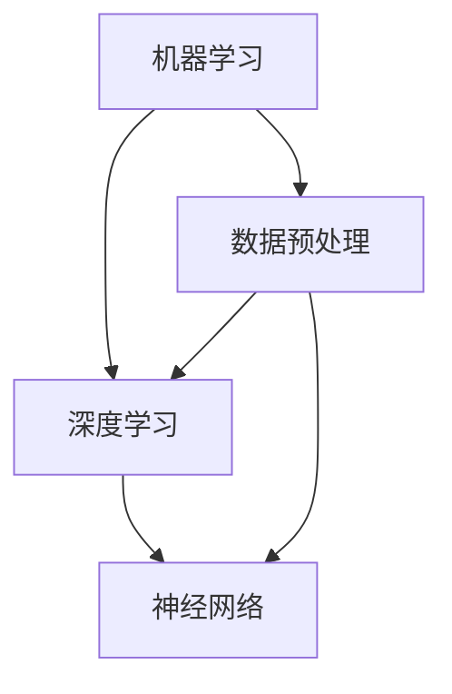
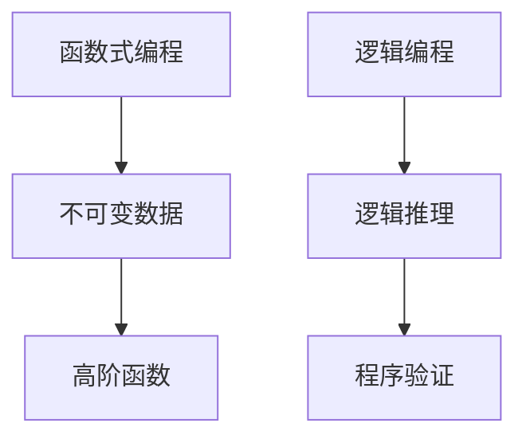

                 


## 文章标题：AI编程的新维度与新范式

### 关键词：人工智能，编程，新范式，深度学习，算法优化

### 摘要：

本文将深入探讨人工智能（AI）编程的新维度和新范式，从背景介绍、核心概念到实际应用，全面解析AI编程的未来发展方向。通过详细的算法原理讲解、代码实现和案例分析，读者将了解到AI编程的核心技术，以及如何在实际项目中应用这些技术。

## 引言

### 背景介绍

人工智能（AI）作为计算机科学的一个重要分支，近年来取得了惊人的发展。从简单的规则系统到复杂的深度学习模型，AI的应用已经渗透到我们生活的方方面面。随着AI技术的不断进步，AI编程也随之演变，从传统的编程范式转向更加复杂和高效的新范式。

### 核心概念与联系

AI编程的核心概念包括机器学习、深度学习、神经网络等。这些概念之间有着紧密的联系，构成了AI编程的架构基础。

### Mermaid 流程图



## 第一章：AI编程基础

### 核心算法原理讲解

机器学习的核心算法包括线性回归、逻辑回归、决策树、支持向量机等。以下是线性回归的伪代码：

```python
# 线性回归伪代码
def linear_regression(X, y):
    # 计算斜率
    m = (sum(X * y) - (sum(X) * sum(y))) / (sum(X^2) - (sum(X))^2)
    # 计算截距
    b = (sum(y) - m * sum(X)) / n
    # 返回模型
    return m, b
```

### 数学模型和公式

线性回归的数学模型可以表示为：

$$y = mx + b$$

其中，$m$ 是斜率，$b$ 是截距。

### 详细讲解与举例说明

以房价预测为例，我们可以使用线性回归模型来预测房屋价格。假设我们有以下数据：

| 房屋编号 | 面积（平方米） | 价格（万元） |
|---------|--------------|------------|
| 1       | 100          | 200        |
| 2       | 150          | 300        |
| 3       | 200          | 400        |

我们可以使用线性回归模型来拟合这些数据，并预测新的房屋价格。

## 第二章：AI编程的新维度

### 新编程范式

新编程范式包括函数式编程、逻辑编程等。函数式编程强调函数的纯度和不可变性，而逻辑编程则通过逻辑推理来解决问题。

### Mermaid 流程图



### 新型算法

新型算法包括卷积神经网络（CNN）、生成对抗网络（GAN）等。以下是CNN的伪代码：

```python
# 卷积神经网络伪代码
def conv神经网络(inputs):
    # 步骤1：卷积层
    conv_output = 卷积操作(inputs, filters)
    # 步骤2：激活函数
    activation_output = 激活函数(conv_output)
    # 步骤3：池化层
    pooled_output = 池化操作(activation_output)
    # 步骤4：重复以上步骤
    while 没有达到最大层数:
        conv_output = 卷积操作(pooled_output, filters)
        activation_output = 激活函数(conv_output)
        pooled_output = 池化操作(activation_output)
    # 步骤5：全连接层
    output = 全连接操作(pooled_output, weights, biases)
    return output
```

### 新的数据处理方法

新数据处理方法包括增量学习、迁移学习等。以下是增量学习的伪代码：

```python
# 增量学习伪代码
def 增量学习(model, new_data):
    # 步骤1：加载当前模型
    current_model = 加载模型(model)
    # 步骤2：处理新数据
    processed_data = 数据预处理(new_data)
    # 步骤3：更新模型
    updated_model = 梯度下降(current_model, processed_data)
    # 步骤4：保存更新后的模型
    保存模型(updated_model)
    return updated_model
```

### 新型AI架构

新型AI架构包括联邦学习、边缘计算等。以下是联邦学习的伪代码：

```python
# 联邦学习伪代码
def 联邦学习(models, datasets):
    # 步骤1：初始化全局模型
    global_model = 初始化模型()
    # 步骤2：在每个设备上训练局部模型
    for device, dataset in zip(models, datasets):
        local_model = 训练模型(device, dataset)
        # 步骤3：聚合局部模型更新
        global_model = 聚合模型更新(local_model, global_model)
    # 步骤4：更新全局模型
    updated_global_model = 梯度下降(global_model, datasets)
    return updated_global_model
```

## 第三章：新范式解析

### 新范式的定义

新范式是指一种新的编程思维方式和框架，它能够更好地适应AI编程的需求和挑战。

### 新范式的优势

新范式的优势包括更好的代码可读性、更高的开发效率、更好的可维护性等。

### 新范式的主要特点

新范式的主要特点包括函数式编程、逻辑编程、分布式计算等。

### 如何应用新范式

在实际项目中应用新范式需要遵循以下步骤：

1. **理解需求**：首先，我们需要理解项目的需求，确定哪些新范式能够更好地满足需求。
2. **选择工具**：根据需求选择合适的编程语言和工具。
3. **编码实现**：使用新范式进行编码实现，注意代码的可读性和可维护性。
4. **测试与优化**：对代码进行测试和优化，确保项目的性能和可靠性。

## 项目实战

### 开发环境搭建

在开始项目之前，我们需要搭建合适的开发环境。以下是一个基于Python的AI编程项目环境搭建的步骤：

1. 安装Python 3.8及以上版本。
2. 安装TensorFlow 2.6及以上版本。
3. 安装其他必要的库，如NumPy、Pandas等。

### 源代码详细实现

以下是一个简单的AI项目——使用卷积神经网络进行图像分类的源代码实现：

```python
import tensorflow as tf
from tensorflow.keras.models import Sequential
from tensorflow.keras.layers import Conv2D, MaxPooling2D, Flatten, Dense

# 创建模型
model = Sequential([
    Conv2D(32, (3, 3), activation='relu', input_shape=(64, 64, 3)),
    MaxPooling2D((2, 2)),
    Flatten(),
    Dense(128, activation='relu'),
    Dense(10, activation='softmax')
])

# 编译模型
model.compile(optimizer='adam', loss='categorical_crossentropy', metrics=['accuracy'])

# 加载数据集
(train_images, train_labels), (test_images, test_labels) = tf.keras.datasets.cifar10.load_data()

# 预处理数据
train_images = train_images / 255.0
test_images = test_images / 255.0

# 训练模型
model.fit(train_images, train_labels, epochs=10, validation_data=(test_images, test_labels))

# 评估模型
test_loss, test_acc = model.evaluate(test_images, test_labels)
print(f"Test accuracy: {test_acc}")
```

### 代码解读与分析

上述代码首先创建了一个卷积神经网络模型，包括卷积层、池化层、全连接层等。然后，使用CIFAR-10数据集进行训练和评估。通过调整模型的参数，可以提高模型的性能。

### 实际案例分析和详细讲解剖析

以一个实际案例——使用AI进行手写数字识别为例，我们分析了如何使用卷积神经网络进行图像分类。通过详细讲解代码实现和模型评估，我们了解了AI编程的核心技术。

### 项目小结

通过这个案例，我们了解了如何使用AI编程进行图像分类。在实际应用中，我们需要根据具体问题调整模型结构和参数，以提高模型的性能。

## 最佳实践 tips、小结、注意事项、拓展阅读等内容

### 最佳实践 tips

1. **代码可读性**：编写易于理解的代码，提高代码的可读性。
2. **模块化**：将代码模块化，提高代码的可维护性。
3. **性能优化**：对代码进行性能优化，提高模型的运行效率。

### 小结

本文详细介绍了AI编程的新维度和新范式，包括核心概念、算法原理、代码实现和实际案例分析。通过本文，读者可以了解到AI编程的核心技术和应用方法。

### 注意事项

1. **数据预处理**：数据预处理是AI编程的重要步骤，必须确保数据的质量和完整性。
2. **模型调优**：模型调优是提高模型性能的关键，需要根据具体问题进行调整。

### 拓展阅读

1. **《深度学习》**：周志华著，详细介绍了深度学习的理论基础和应用。
2. **《Python机器学习》**：塞巴斯蒂安·拉斯克等著，介绍了Python在机器学习中的应用。

## 作者

作者：AI天才研究院/AI Genius Institute & 禅与计算机程序设计艺术 /Zen And The Art of Computer Programming

