                 

### 文章标题
《AI编程的新维度与新领域》

### 关键词
AI编程，新维度，新领域，自然语言处理，深度学习，计算机视觉

### 摘要
本文深入探讨了AI编程的新维度和新领域。我们首先概述了AI编程的核心概念和基本原理，然后分析了当前AI编程的新技术和新工具，探讨了AI编程在新兴领域中的应用，最后通过实战案例展示了AI编程的实际应用和优化技巧。

---

### 引言
AI编程作为人工智能的重要组成部分，正在逐步改变我们的工作和生活方式。然而，随着AI技术的不断发展，AI编程也面临着新的挑战和机遇。本文将逐步分析AI编程的新维度和新领域，帮助读者更好地理解和应用AI编程技术。

---

### 第一部分：AI编程基础

#### 第1章：AI编程概述

##### 1.1 AI编程的核心概念

AI编程是指使用编程语言和工具来实现人工智能系统的过程。与传统的编程不同，AI编程更加强调机器学习和深度学习等技术的应用。

- **核心概念**：机器学习、深度学习和神经网络是AI编程的三大核心概念。
  - **机器学习**：通过数据训练模型，使计算机能够自主学习和改进。
  - **深度学习**：一种特殊的机器学习方法，使用多层神经网络进行特征提取和学习。
  - **神经网络**：一种模仿人脑结构的计算模型，用于处理复杂数据。

##### 1.2 AI编程的基本原理

- **基本原理**：AI编程的基本原理包括数据预处理、模型训练与优化、模型评估与部署。

  - **数据预处理**：包括数据清洗、归一化、特征提取等步骤，目的是提高模型训练的效果。
  - **模型训练与优化**：通过迭代训练，优化模型参数，使模型在训练数据上的表现达到最佳。
  - **模型评估与部署**：使用验证数据和测试数据评估模型性能，并在实际环境中部署模型。

##### 1.3 AI编程的关键技术

- **关键技术**：数据预处理、模型训练与优化、模型评估与部署。

  - **数据预处理**：数据预处理是AI编程的重要步骤，直接影响模型训练的效果。常用的预处理方法包括数据清洗、归一化、特征提取等。
  - **模型训练与优化**：模型训练与优化是AI编程的核心，需要选择合适的算法和优化方法，提高模型性能。
  - **模型评估与部署**：模型评估与部署是AI编程的最后一步，需要确保模型在实际应用中的性能和稳定性。

#### 第2章：AI编程新趋势

##### 2.1 当前AI编程的新技术

- **新技术**：当前AI编程的新技术包括自然语言处理、计算机视觉和强化学习。

  - **自然语言处理**：自然语言处理是AI编程的重要方向，旨在使计算机理解和处理自然语言。常用的技术包括词向量、序列模型、文本分类等。
  - **计算机视觉**：计算机视觉是AI编程的另一个重要方向，旨在使计算机理解和解释图像和视频。常用的技术包括卷积神经网络、目标检测、图像分割等。
  - **强化学习**：强化学习是一种通过不断试错来学习策略的机器学习方法。它广泛应用于游戏、机器人、推荐系统等领域。

##### 2.2 AI编程的新工具

- **新工具**：AI编程的新工具包括TensorFlow、PyTorch和Keras。

  - **TensorFlow**：TensorFlow是谷歌开发的一款开源深度学习框架，具有强大的功能和灵活性。
  - **PyTorch**：PyTorch是Facebook开发的一款开源深度学习框架，具有动态图模型的优势。
  - **Keras**：Keras是一个高级神经网络API，可以简化TensorFlow和PyTorch的使用。

##### 2.3 AI编程的新架构

- **新架构**：AI编程的新架构包括分布式计算、边缘计算和云计算。

  - **分布式计算**：分布式计算是将计算任务分布在多台计算机上进行处理，提高计算效率。
  - **边缘计算**：边缘计算是将计算任务在靠近数据源的设备上进行处理，减少延迟和提高响应速度。
  - **云计算**：云计算是一种基于互联网的计算服务，提供可扩展的计算资源和存储服务。

#### 第三部分：AI编程新领域

##### 3.1 AI编程在医疗领域的应用

- **应用**：AI编程在医疗领域的应用包括诊断系统、药物研发和医疗影像分析。

  - **诊断系统**：AI编程可以开发出智能诊断系统，辅助医生进行疾病诊断。
  - **药物研发**：AI编程可以加速药物研发过程，提高药物发现的成功率。
  - **医疗影像分析**：AI编程可以辅助医生进行医疗影像分析，提高诊断准确率。

##### 3.2 AI编程在金融领域的应用

- **应用**：AI编程在金融领域的应用包括风险管理、量化交易和信用评分。

  - **风险管理**：AI编程可以帮助金融机构进行风险管理，降低金融风险。
  - **量化交易**：AI编程可以开发出量化交易策略，提高交易收益。
  - **信用评分**：AI编程可以开发出智能信用评分系统，提高信用评估的准确性。

##### 3.3 AI编程在自动驾驶领域的应用

- **应用**：AI编程在自动驾驶领域的应用包括感知系统、控制系统和通信系统。

  - **感知系统**：AI编程可以开发出自动驾驶车辆的感知系统，提高自动驾驶的准确性和安全性。
  - **控制系统**：AI编程可以开发出自动驾驶车辆的控制系统，实现车辆的自主驾驶。
  - **通信系统**：AI编程可以开发出自动驾驶车辆的通信系统，实现车辆与周围环境的通信。

#### 第四部分：AI编程实战案例

##### 4.1 实战案例一：基于深度学习的图像分类

- **背景**：图像分类是计算机视觉的一个重要任务。本文将介绍一个基于深度学习的图像分类项目。

  - **需求分析**：实现一个能够自动分类图像的模型。
  - **项目目标**：使用卷积神经网络（CNN）进行图像分类，并在测试集上取得较高的准确率。

- **系统设计与实现**

  - **硬件选型**：使用GPU进行加速训练。
  - **软件架构**：采用CNN模型进行图像分类。
  - **数据处理流程**：包括图像数据集的收集、预处理和分割。

- **项目评估与优化**

  - **性能评估**：在测试集上的准确率、召回率和F1值。
  - **用户体验优化**：提高模型的响应速度和准确性。

##### 4.2 实战案例二：基于强化学习的游戏AI

- **背景**：游戏AI是强化学习的一个重要应用。本文将介绍一个基于强化学习的游戏AI项目。

  - **需求分析**：实现一个能够自主学习和改进的游戏AI。
  - **项目目标**：使用强化学习算法，使游戏AI在多个关卡上达到较高的得分。

- **系统设计与实现**

  - **硬件选型**：使用CPU进行训练，以提高训练效率。
  - **软件架构**：采用强化学习算法，如Q-Learning和深度Q网络（DQN）。
  - **数据处理流程**：包括游戏数据集的收集、预处理和状态动作值的估计。

- **项目评估与优化**

  - **性能评估**：在多个关卡上的得分和稳定性。
  - **用户体验优化**：提高游戏AI的学习速度和适应性。

### 结论

- **未来趋势**：随着AI技术的不断发展，AI编程将面临更多新的维度和领域。未来，我们将看到更多基于AI的应用场景，如智能家居、智慧城市和智能医疗等。
- **对读者的建议**：希望读者能够持续关注AI编程的最新动态，不断学习新知识和技能，以应对未来AI编程的挑战。

---

### 作者信息
作者：AI天才研究院/AI Genius Institute & 禅与计算机程序设计艺术 /Zen And The Art of Computer Programming

### 最佳实践 tips
- 在AI编程中，数据质量直接影响模型性能。因此，确保数据质量是AI编程的重要一环。
- 选择合适的算法和工具是成功的关键。需要根据具体应用场景选择合适的算法和工具。
- 优化模型参数是提高模型性能的有效方法。可以使用超参数优化技术，如网格搜索和贝叶斯优化。
- 在实际应用中，要充分考虑用户体验。性能和准确性的平衡是关键。

### 注意事项
- AI编程涉及大量的计算资源，合理分配和管理计算资源是重要的。
- AI编程过程中，要遵守数据安全和隐私保护的相关法规和规定。
- 持续学习和更新知识是AI编程的重要要求。需要关注AI领域的最新研究和进展。

### 拓展阅读
- [《深度学习》（Goodfellow, Bengio, Courville著）](https://www.deeplearningbook.org/)
- [《强化学习：原理与Python实践》（刘知远著）](https://book.douban.com/subject/30203535/)
- [《自然语言处理入门教程》（吴恩达著）](https://www.classcentral.com/report/nlp-tutorial-machine-learning-course-content-by-ndu/)

---

### Mermaid 流程图

```mermaid
graph TD
    A[AI编程概述] --> B[核心概念]
    B --> C[机器学习]
    B --> D[深度学习]
    B --> E[神经网络]
    F[基本原理] --> G[数据预处理]
    G --> H[数据清洗]
    G --> I[归一化]
    G --> J[特征提取]
    F --> K[模型训练与优化]
    K --> L[迭代训练]
    K --> M[参数优化]
    F --> N[模型评估与部署]
    N --> O[验证集评估]
    N --> P[测试集评估]
    N --> Q[模型部署]
    R[新技术与工具] --> S[自然语言处理]
    S --> T[词向量]
    S --> U[序列模型]
    S --> V[文本分类]
    R --> W[计算机视觉]
    W --> X[卷积神经网络]
    W --> Y[目标检测]
    W --> Z[图像分割]
    R --> AA[强化学习]
    AA --> BB[Q-Learning]
    AA --> CC[深度Q网络（DQN）]
    DD[新架构] --> EE[分布式计算]
    EE --> FF[任务分配]
    EE --> GG[负载均衡]
    DD --> HH[边缘计算]
    HH --> II[近数据源处理]
    HH --> JJ[延迟减少]
    DD --> KK[云计算]
    KK --> LL[计算资源分配]
    KK --> MM[存储服务]
    NN[新兴领域应用] --> OO[医疗领域]
    OO --> PP[诊断系统]
    OO --> QQ[药物研发]
    OO --> RR[医疗影像分析]
    NN --> SS[金融领域]
    SS --> TT[风险管理]
    SS --> UU[量化交易]
    SS --> VV[信用评分]
    NN --> WW[自动驾驶领域]
    WW --> XX[感知系统]
    WW --> YY[控制系统]
    WW --> ZZ[通信系统]
    AAA[实战案例] --> BBB[图像分类项目]
    BBB --> CCC[硬件选型]
    CCC --> DDD[GPU加速]
    BBB --> EEE[软件架构]
    EEE --> FFF[CNN模型]
    BBB --> GGG[数据处理流程]
    GGG --> HHH[数据收集]
    GGG --> IIII[预处理]
    GGG --> JJJJ[分割]
    BBB --> KKKK[项目评估与优化]
    KKKK --> LLLL[测试集准确率]
    KKKK --> MMMM[用户体验优化]
    AAA --> NNNN[游戏AI项目]
    NNNN --> OOOO[需求分析]
    OOOO --> PPPP[自主学习和改进]
    NNNN --> QQQQ[项目目标]
    QQQQ --> RRRR[高分]
    NNNN --> SSSS[系统设计与实现]
    SSSS --> TTTT[CPU训练]
    SSSS --> UUUU[强化学习算法]
    NNNN --> VVVV[项目评估与优化]
    VVVV --> WWWW[得分稳定性]
```

---

### 总结
本文通过逐步分析AI编程的新维度和新领域，帮助读者深入了解AI编程的核心概念、基本原理、新技术和新工具、新领域以及实战案例。随着AI技术的不断发展，AI编程将迎来更多的机遇和挑战。希望读者能够持续关注AI编程的最新动态，不断提升自己的技术能力，为AI技术的发展和应用贡献力量。

