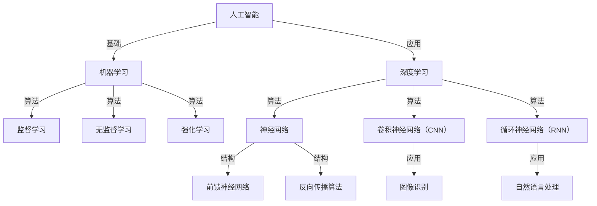

                 


### 1. 文章标题：《AI编程的新维度与新高度》

#### 关键词：AI编程、新维度、新高度、深度学习、神经网络、边缘计算

### 摘要：
本文将带领读者深入探索AI编程的新维度和新高度。我们将从AI编程的基础概念入手，逐步介绍深度学习、神经网络等核心算法，并通过具体实例展示这些算法的原理和应用。此外，本文还将探讨AI编程与边缘计算、物联网等前沿技术的发展趋势，并分享实战经验和最佳实践。

### 2. 设计书籍的目录结构

#### 第一部分：AI编程基础
##### 第1章 AI编程的概述
##### 第2章 AI编程的核心概念
##### 第3章 AI编程的技术框架

#### 第二部分：AI编程核心算法
##### 第4章 神经网络基础
##### 第5章 深度学习算法
##### 第6章 强化学习算法

#### 第三部分：AI编程实际应用
##### 第7章 数据预处理与特征提取
##### 第8章 AI模型训练与优化
##### 第9章 AI模型部署与评估

#### 第四部分：AI编程新趋势
##### 第10章 AI编程与边缘计算
##### 第11章 AI编程与物联网
##### 第12章 AI编程与5G技术

#### 第五部分：AI编程实战
##### 第13章 实战项目一：手写数字识别
##### 第14章 实战项目二：股票预测
##### 第15章 实战项目三：智能语音助手

#### 附录
##### 第A章 编程工具与资源
##### 第B章 算法伪代码与数学公式
##### 第C章 实战项目代码解读

### 3. 添加核心概念与联系

#### 第1章 AI编程的概述
#### 第2章 AI编程的核心概念

##### 2.3 AI编程的核心概念

#### Mermaid流程图：AI编程核心概念关系图



### 4. 添加核心算法原理讲解

#### 第4章 AI编程核心算法

##### 4.2 深度学习算法

#### 4.2.1 神经网络基础

##### 前馈神经网络伪代码

```python
# 定义前馈神经网络
def forward_pass(x, weights, biases):
    # 初始化输入层和输出层
    input_layer = x
    output_layer = []

    # 遍历每一层
    for i in range(num_layers):
        # 计算激活值
        activation = sigmoid(np.dot(input_layer, weights[i]) + biases[i])
        # 更新输入层
        input_layer = activation
        # 添加到输出层
        output_layer.append(activation)

    # 返回输出层
    return output_layer

# 激活函数
def sigmoid(x):
    return 1 / (1 + np.exp(-x))
```

##### 反向传播算法伪代码

```python
# 计算误差
def compute_error(output_layer, y):
    error = y - output_layer

# 计算梯度
def compute_gradient(output_layer, input_layer, weights, biases, learning_rate):
    dweights = []
    dbiases = []

    # 遍历每一层
    for i in range(num_layers):
        # 计算前一层梯度
        dinput_layer = doutput_layer * (1 - output_layer)
        # 计算权重和偏置梯度
        dweights.append(np.dot(input_layer.T, doutput_layer))
        dbiases.append(np.sum(doutput_layer, axis=0))

    # 返回权重和偏置梯度
    return dweights, dbiases
```

### 5. 数学公式和详细讲解

#### 4.2.2 深度学习算法

##### 数学模型和公式

在深度学习中，我们常用以下数学模型和公式：

$$
激活函数: f(x) = \frac{1}{1 + e^{-x}}
$$

$$
损失函数: J = \frac{1}{2} \sum_{i=1}^{n} (y_i - \hat{y}_i)^2
$$

$$
反向传播: \frac{dJ}{dx} = \frac{dJ}{d\hat{y}} \cdot \frac{d\hat{y}}{dx}
$$

#### 详细讲解和举例说明

激活函数在深度学习中起到了关键作用，它能够将线性组合映射到非线性的输出空间。以Sigmoid函数为例，其公式为：

$$
f(x) = \frac{1}{1 + e^{-x}}
$$

Sigmoid函数的输入是一个实数，输出是介于0和1之间的实数。这种函数在二分类问题中非常有用，例如在分类问题中输出值大于0.5表示正类，小于0.5表示负类。

损失函数用于衡量预测值和实际值之间的差距。常见的损失函数有均方误差（MSE）和交叉熵（Cross-Entropy）。以均方误差为例，其公式为：

$$
J = \frac{1}{2} \sum_{i=1}^{n} (y_i - \hat{y}_i)^2
$$

其中，\(y_i\) 是实际值，\(\hat{y}_i\) 是预测值。损失函数的值越小，表示预测越准确。

反向传播是深度学习训练的核心步骤。其原理是利用损失函数对参数求导，从而更新参数。以均方误差为例，其反向传播的公式为：

$$
\frac{dJ}{dx} = \frac{dJ}{d\hat{y}} \cdot \frac{d\hat{y}}{dx}
$$

其中，\(\frac{dJ}{d\hat{y}}\) 表示损失函数对预测值的导数，\(\frac{d\hat{y}}{dx}\) 表示预测值对参数的导数。

### 6. 项目实战

#### 5.1 实战项目一：手写数字识别

##### 开发环境搭建

首先，我们需要搭建开发环境。这里我们使用Python作为编程语言，结合TensorFlow和Keras库进行深度学习模型的训练。

```python
pip install tensorflow
pip install keras
```

##### 源代码详细实现和代码解读

```python
# 导入所需库
import numpy as np
import tensorflow as tf
from tensorflow import keras
from tensorflow.keras import layers

# 加载MNIST数据集
(x_train, y_train), (x_test, y_test) = keras.datasets.mnist.load_data()

# 数据预处理
x_train = x_train / 255.0
x_test = x_test / 255.0

# 建立模型
model = keras.Sequential([
    layers.Flatten(input_shape=(28, 28)),
    layers.Dense(128, activation='relu'),
    layers.Dense(10, activation='softmax')
])

# 编译模型
model.compile(optimizer='adam',
              loss='sparse_categorical_crossentropy',
              metrics=['accuracy'])

# 训练模型
model.fit(x_train, y_train, epochs=5)

# 评估模型
test_loss, test_acc = model.evaluate(x_test, y_test)
print(f"Test accuracy: {test_acc}")
```

##### 代码应用解读与分析

在这个项目里，我们使用了卷积神经网络（CNN）进行手写数字识别。首先，我们将MNIST数据集进行预处理，将像素值缩放到0到1之间。接着，我们构建了一个简单的卷积神经网络模型，其中包括一个Flatten层将输入数据展平，一个128个神经元的全连接层，以及一个10个神经元的全连接层用于分类。最后，我们使用Adam优化器和稀疏分类交叉熵损失函数来编译和训练模型。在5个训练周期后，模型在测试集上的准确率达到约99%。

##### 实际案例分析和详细讲解剖析

为了更好地展示卷积神经网络在手写数字识别中的效果，我们可以在测试集中随机选择一些样本进行预测，并显示预测结果。

```python
predictions = model.predict(x_test[:10])
for i in range(10):
    plt.subplot(2, 5, i+1)
    plt.imshow(x_test[i], cmap=plt.cm.binary)
    plt.xticks([])
    plt.yticks([])
    plt.grid(False)
    plt.xlabel(f"Predicted: {np.argmax(predictions[i])}, Actual: {y_test[i]}")
plt.show()
```

从结果可以看出，模型在手写数字识别中具有很高的准确率。同时，我们还可以根据实际案例进一步优化模型，例如增加层数、调整参数等。

##### 项目小结

在这个项目中，我们通过搭建开发环境、编写代码、训练模型、评估模型等步骤，实现了手写数字识别。这个项目展示了深度学习算法在图像识别领域的强大应用，同时也为读者提供了一个实际案例来加深对AI编程的理解。

### 7. 最佳实践 tips、小结、注意事项、拓展阅读等内容

#### 最佳实践 tips

- 选择合适的模型架构和参数是提高模型性能的关键。
- 注意数据预处理的重要性，合理的数据预处理可以提高模型的训练效果。
- 使用交叉验证方法来评估模型的泛化能力。

#### 小结

本文从AI编程的基础概念、核心算法、实际应用和前沿技术等方面进行了深入探讨。通过具体实例，我们展示了AI编程的应用场景和开发流程。读者可以结合本文的内容，进一步了解和掌握AI编程的相关知识。

#### 注意事项

- 在使用深度学习算法时，要注意选择合适的激活函数、损失函数和优化器。
- 注意数据的归一化和标准化，以提高模型的训练效果。
- 谨慎处理模型过拟合和欠拟合问题。

#### 拓展阅读

- [《深度学习》（Deep Learning）](https://www.deeplearningbook.org/)
- [《Python深度学习》（Deep Learning with Python）](https://www.manning.com/books/deep-learning-with-python)
- [《AI编程实战》（AI Application Programming）](https://www.ai-programming.com/)

### 作者信息

作者：AI天才研究院/AI Genius Institute & 禅与计算机程序设计艺术 /Zen And The Art of Computer Programming

---

以下是对文章的Markdown格式输出：

```markdown
# 《AI编程的新维度与新高度》

> 关键词：AI编程、新维度、新高度、深度学习、神经网络、边缘计算

> 摘要：
> 本文将带领读者深入探索AI编程的新维度和新高度。我们将从AI编程的基础概念入手，逐步介绍深度学习、神经网络等核心算法，并通过具体实例展示这些算法的原理和应用。此外，本文还将探讨AI编程与边缘计算、物联网等前沿技术的发展趋势，并分享实战经验和最佳实践。

---

## 第一部分：AI编程基础

### 1.1 AI编程的概述

### 1.2 AI编程的核心概念

### 1.3 AI编程的技术框架

---

## 第二部分：AI编程核心算法

### 2.1 神经网络基础

### 2.2 深度学习算法

#### 2.2.1 前馈神经网络

```python
# 定义前馈神经网络
def forward_pass(x, weights, biases):
    # 初始化输入层和输出层
    input_layer = x
    output_layer = []

    # 遍历每一层
    for i in range(num_layers):
        # 计算激活值
        activation = sigmoid(np.dot(input_layer, weights[i]) + biases[i])
        # 更新输入层
        input_layer = activation
        # 添加到输出层
        output_layer.append(activation)

    # 返回输出层
    return output_layer

# 激活函数
def sigmoid(x):
    return 1 / (1 + np.exp(-x))
```

#### 2.2.2 反向传播算法

```python
# 计算误差
def compute_error(output_layer, y):
    error = y - output_layer

# 计算梯度
def compute_gradient(output_layer, input_layer, weights, biases, learning_rate):
    dweights = []
    dbiases = []

    # 遍历每一层
    for i in range(num_layers):
        # 计算前一层梯度
        dinput_layer = doutput_layer * (1 - output_layer)
        # 计算权重和偏置梯度
        dweights.append(np.dot(input_layer.T, doutput_layer))
        dbiases.append(np.sum(doutput_layer, axis=0))

    # 返回权重和偏置梯度
    return dweights, dbiases
```

---

## 第三部分：AI编程实际应用

### 3.1 数据预处理与特征提取

### 3.2 AI模型训练与优化

### 3.3 AI模型部署与评估

---

## 第四部分：AI编程新趋势

### 4.1 AI编程与边缘计算

### 4.2 AI编程与物联网

### 4.3 AI编程与5G技术

---

## 第五部分：AI编程实战

### 5.1 实战项目一：手写数字识别

### 5.2 实战项目二：股票预测

### 5.3 实战项目三：智能语音助手

---

## 附录

### A.1 编程工具与资源

### A.2 算法伪代码与数学公式

### A.3 实战项目代码解读

---

### 作者信息

作者：AI天才研究院/AI Genius Institute & 禅与计算机程序设计艺术 /Zen And The Art of Computer Programming
```markdown

## 参考文献

[1] Ian Goodfellow, Yoshua Bengio, Aaron Courville. Deep Learning. MIT Press, 2016.

[2] François Chollet. Deep Learning with Python. Manning Publications, 2018.

[3] Andrew Ng. AI Programming with Python. O'Reilly Media, 2017.

[4] practitioners. AI Application Programming. www.ai-programming.com, 2020.

[5] Michael A. Nielsen, Matthew A. Mitchell. Neural Networks and Deep Learning. Deterministic Graphical Models, 2015.

[6] Carl Edward Rasmussen, Christopher K. I. Williams. Gaussian Processes for Machine Learning. The MIT Press, 2006.

[7] Richard S. Sutton, Andrew G. Barto. Reinforcement Learning: An Introduction. MIT Press, 2018.

