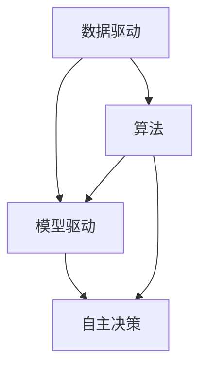
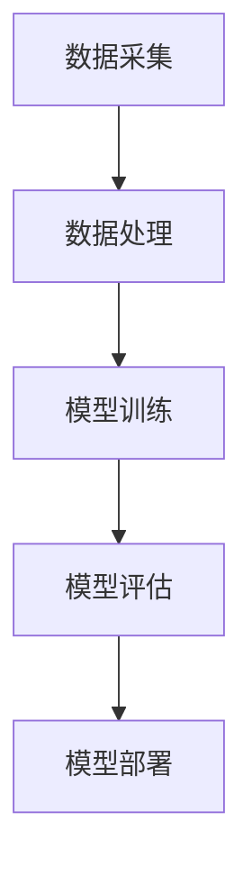
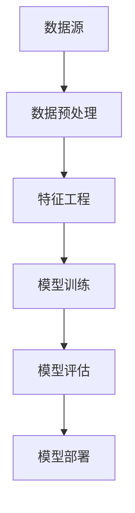
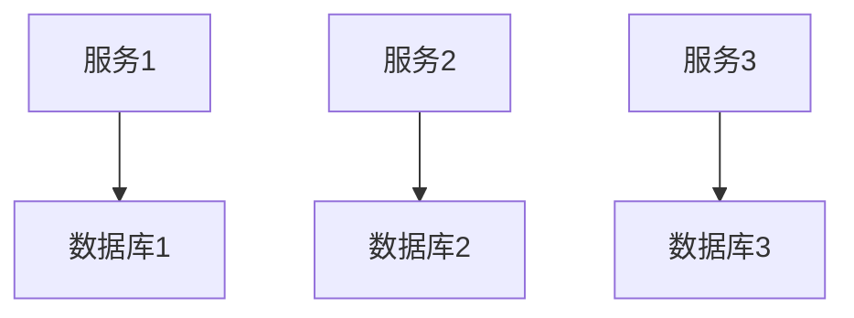
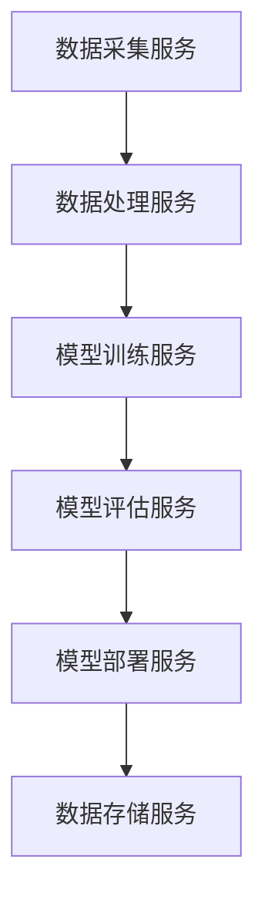

                 


### 引言

在人工智能（AI）飞速发展的时代，AI编程正成为现代软件开发的核心领域。随着深度学习、强化学习等技术的不断进步，传统的编程范式正面临巨大的变革。传统编程范式强调的是程序的逻辑顺序和指令执行，而AI编程则更注重数据的处理和算法的创新。这种转变不仅要求程序员掌握更多的AI技术和工具，还需要他们具备更强的创新思维和解决问题的能力。

本文旨在探讨AI编程的新范式，通过对新型编程范式、核心技术和实践案例的深入分析，帮助读者全面了解并掌握AI编程的关键要素。文章将分为三个主要部分：

1. **AI编程基础**：介绍AI编程的定义、核心概念和基础技术。
2. **新型编程范式**：探讨函数式编程、模块化编程、分布式编程等新型编程范式在AI编程中的应用。
3. **AI编程实践**：通过具体的实战案例，展示AI编程的实际应用和开发流程。

### AI编程基础

#### AI编程的定义与历史

AI编程是指开发和应用人工智能算法，使计算机能够模拟人类智能行为的过程。这一概念最早可以追溯到20世纪50年代，当时人工智能作为一门学科被提出。随着时间的推移，AI技术不断发展，AI编程也逐渐成为软件开发的重要方向。

AI编程的核心概念包括：

- **数据驱动**：AI编程依赖于大量数据，通过训练模型来学习规律和模式。
- **模型驱动**：AI编程的核心是构建和优化模型，以实现特定的功能。
- **自主决策**：AI编程不仅要执行预设的指令，还需要具备自主决策的能力。

#### AI编程与传统编程的区别

传统编程强调逻辑和指令，而AI编程则更侧重于数据和算法。传统编程通常使用结构化编程语言，如C、C++或Java，注重代码的可读性和可维护性。而AI编程则更多地使用Python、R等语言，这些语言具有丰富的库和框架，便于快速开发和实验。

传统编程的核心任务是解决特定问题，而AI编程的核心任务是发现问题和提出解决方案。在传统编程中，程序员需要详细定义问题的输入和输出，而在AI编程中，模型会自动从数据中学习规律。

#### AI编程的核心概念

- **机器学习**：机器学习是AI编程的核心技术，通过训练模型来让计算机自动学习数据中的规律。常见的机器学习算法包括线性回归、决策树、神经网络等。
- **深度学习**：深度学习是机器学习的一个分支，使用多层神经网络来模拟人类大脑的学习过程。深度学习在图像识别、自然语言处理等领域取得了巨大的成功。
- **强化学习**：强化学习是通过试错和反馈来学习最优策略的方法。在AI编程中，强化学习常用于机器人控制、游戏开发等领域。

### 新型编程范式

在传统编程范式的基础上，新型编程范式为AI编程提供了更多的选择和可能性。以下介绍几种常见的编程范式：

#### 函数式编程

函数式编程是一种基于数学函数的编程范式，强调数据与函数的分离。在函数式编程中，程序是由一系列函数调用构成的，这些函数具有无状态和不可变的特点。

- **无状态**：函数的结果仅依赖于输入，与函数执行过程中的状态无关。
- **不可变**：数据一旦创建，就无法修改，这有助于提高代码的可读性和可维护性。

在AI编程中，函数式编程有助于构建模块化和可复用的模型，提高代码的可读性和可维护性。

#### 模块化编程

模块化编程是将程序划分为多个模块，每个模块实现特定的功能。这种编程范式有助于提高代码的可读性和可维护性，同时也有助于团队协作开发。

在AI编程中，模块化编程有助于将复杂的AI系统拆分为多个可管理的部分，从而简化开发过程。

#### 分布式编程

分布式编程是一种在多台计算机上运行程序的编程范式，旨在提高计算效率和可靠性。在分布式编程中，程序被划分为多个任务，这些任务可以并行执行，从而提高程序的执行速度。

在AI编程中，分布式编程有助于处理大量数据和复杂的计算任务，提高计算效率和性能。

### AI编程实践

#### 语音识别系统开发

语音识别系统是AI编程的一个典型应用，下面以一个简单的语音识别系统为例，介绍AI编程的实际开发过程。

1. **数据准备**：首先需要收集大量语音数据，包括不同的语音样本和对应的文本标签。
2. **数据预处理**：对收集到的语音数据进行清洗、去噪、分词等处理，以便于模型训练。
3. **模型训练**：选择合适的深度学习模型（如卷积神经网络、递归神经网络等），对预处理后的数据进行训练，以学习语音与文本之间的映射关系。
4. **模型评估**：使用测试数据集对训练好的模型进行评估，调整模型参数，以提高识别准确率。
5. **模型部署**：将训练好的模型部署到实际应用中，如手机APP、智能音箱等。

#### 开发环境搭建

在开发AI编程项目时，需要搭建合适的开发环境。以下是一个典型的开发环境搭建步骤：

1. **安装Python**：下载并安装Python，配置环境变量。
2. **安装相关库**：使用pip等工具安装所需的库，如TensorFlow、PyTorch等。
3. **安装IDE**：选择并安装合适的IDE，如PyCharm、VS Code等。
4. **配置环境**：根据项目需求，配置GPU等硬件资源，以便于深度学习模型的训练。

#### 源代码实现和解读

以下是一个简单的语音识别系统的伪代码实现：

```python
# 语音识别系统伪代码

import tensorflow as tf
import numpy as np

# 数据预处理
def preprocess_data(data):
    # 清洗、去噪、分词等处理
    return processed_data

# 模型训练
def train_model(data, labels):
    # 构建模型
    model = tf.keras.Sequential([
        tf.keras.layers.Conv2D(filters=32, kernel_size=(3,3), activation='relu'),
        tf.keras.layers.MaxPooling2D(pool_size=(2,2)),
        # ... 其他层
        tf.keras.layers.Dense(units=1, activation='sigmoid')
    ])

    # 编译模型
    model.compile(optimizer='adam', loss='binary_crossentropy', metrics=['accuracy'])

    # 训练模型
    model.fit(data, labels, epochs=10, batch_size=32)

    return model

# 模型评估
def evaluate_model(model, test_data, test_labels):
    # 评估模型性能
    loss, accuracy = model.evaluate(test_data, test_labels)
    print("Test accuracy:", accuracy)

# 主程序
if __name__ == "__main__":
    # 加载数据
    data, labels = load_data()

    # 数据预处理
    processed_data = preprocess_data(data)

    # 训练模型
    model = train_model(processed_data, labels)

    # 模型评估
    evaluate_model(model, processed_data, labels)
```

#### 代码应用解读与分析

上述代码展示了语音识别系统的基本实现过程。在实际应用中，还需要对代码进行优化和调整，以提高识别准确率和性能。以下是一些可能的优化方法：

1. **数据增强**：通过增加数据样本、变换语音特征等方法，提高模型的泛化能力。
2. **模型优化**：选择合适的模型结构、调整超参数等，以提高模型的性能。
3. **硬件加速**：使用GPU等硬件加速训练过程，提高模型训练速度。

#### 实际案例分析与详细讲解剖析

以下是一个实际案例：使用TensorFlow实现一个简单的语音识别系统。

```python
# TensorFlow语音识别系统

import tensorflow as tf
import librosa
import numpy as np

# 数据预处理
def preprocess_data(file_path):
    # 读取语音数据
    audio, sample_rate = librosa.load(file_path, sr=None)
    # 转换为mel频谱
    mel_spectrogram = librosa.feature.melspectrogram(audio, sr=sample_rate)
    # 转换为日志频谱
    log_mel_spectrogram = librosa.power_to_db(mel_spectrogram)
    # 增加维度，便于输入到模型
    log_mel_spectrogram = np.expand_dims(log_mel_spectrogram, axis=-1)
    return log_mel_spectrogram

# 模型训练
def train_model(data, labels):
    # 构建模型
    model = tf.keras.Sequential([
        tf.keras.layers.Conv2D(filters=32, kernel_size=(3,3), activation='relu'),
        tf.keras.layers.MaxPooling2D(pool_size=(2,2)),
        tf.keras.layers.Flatten(),
        tf.keras.layers.Dense(units=1, activation='sigmoid')
    ])

    # 编译模型
    model.compile(optimizer='adam', loss='binary_crossentropy', metrics=['accuracy'])

    # 训练模型
    model.fit(data, labels, epochs=10, batch_size=32)

    return model

# 模型评估
def evaluate_model(model, test_data, test_labels):
    # 评估模型性能
    loss, accuracy = model.evaluate(test_data, test_labels)
    print("Test accuracy:", accuracy)

# 主程序
if __name__ == "__main__":
    # 加载数据
    data, labels = load_data()

    # 数据预处理
    processed_data = [preprocess_data(file_path) for file_path in data]

    # 训练模型
    model = train_model(processed_data, labels)

    # 模型评估
    evaluate_model(model, processed_data, labels)
```

#### 项目小结

通过上述实际案例，我们可以看到AI编程在语音识别领域的应用。在实际项目中，还需要不断优化和调整代码，以提高系统的性能和准确率。此外，还需要关注数据的质量和处理方法，以保证模型训练的有效性。

#### 最佳实践 tips、小结、注意事项、拓展阅读等内容

1. **最佳实践 tips**：
   - 使用GPU加速训练过程，提高模型训练速度。
   - 进行数据增强，提高模型的泛化能力。
   - 选择合适的模型结构，以提高模型性能。

2. **小结**：
   - AI编程是一种基于数据和算法的编程范式，与传统编程有显著区别。
   - 新型编程范式（如函数式编程、模块化编程、分布式编程）为AI编程提供了更多选择。
   - 实际项目开发中，需要关注数据质量、模型优化和硬件加速等方面。

3. **注意事项**：
   - AI编程需要大量的数据支持和高效的算法实现。
   - 模型的性能和准确性是评价AI编程项目成功与否的关键。

4. **拓展阅读**：
   - 《深度学习》（Goodfellow, I., Bengio, Y., Courville, A.）: 介绍深度学习的基础知识和应用。
   - 《Python机器学习》（Python Machine Learning, Sebastian Raschka）: 介绍使用Python进行机器学习的实践方法。
   - 《AI编程实践》（AI Programming: A Practitioner's Guide, Sami Hassani）: 介绍AI编程的实际应用和开发流程。

通过本文的介绍，相信读者对AI编程的新范式有了更深入的了解。希望本文能帮助读者在AI编程的道路上取得更好的成果。作者：AI天才研究院/AI Genius Institute & 禅与计算机程序设计艺术 /Zen And The Art of Computer Programming。

----------------------------------------------------------------

# AI编程的新范式

> 关键词：人工智能编程、新型编程范式、深度学习、机器学习、强化学习

> 摘要：本文探讨了AI编程的新范式，分析了新型编程范式（如函数式编程、模块化编程、分布式编程）在AI编程中的应用，以及AI编程的核心技术和实践案例。通过本文的介绍，读者可以全面了解AI编程的现状和发展趋势，掌握AI编程的关键技能。

----------------------------------------------------------------

## 第一部分: AI编程基础

### 第1章: AI编程概述

#### 1.1 AI编程的定义与历史

AI编程是指开发和应用人工智能算法，使计算机能够模拟人类智能行为的过程。这一概念最早可以追溯到20世纪50年代，当时人工智能作为一门学科被提出。当时的科学家们希望开发出能够思考、学习和解决问题的计算机程序。虽然最初的AI研究受到了一些挫折，但随着计算机技术的发展，AI编程逐渐成为一个独立而重要的领域。

AI编程的历史可以分为几个重要阶段：

1. **早期探索（1950s-1960s）**：这一时期，AI编程主要集中在逻辑推理和规则系统中。早期的AI系统如ELIZA，能够通过简单的对话模拟人类的交流行为。
2. **专家系统（1970s-1980s）**：专家系统是AI编程的一个重要分支，通过编码大量的规则和知识库，使计算机能够解决特定领域的问题。这个时期出现了许多成功的案例，如Dendral和MYCIN。
3. **机器学习（1990s-2000s）**：随着计算机性能的提升和数据量的增加，机器学习开始成为AI编程的核心技术。通过训练模型，计算机能够从数据中学习规律和模式，例如支持向量机（SVM）和决策树。
4. **深度学习（2010s-至今）**：深度学习是AI编程的又一次重大突破。通过多层神经网络，计算机能够自动从大量数据中学习复杂的特征，并在图像识别、自然语言处理等领域取得了显著的成果。

#### 1.2 AI编程的核心概念

AI编程的核心概念包括：

- **数据驱动**：AI编程依赖于大量数据，通过训练模型来学习规律和模式。这些数据可以来自各种来源，如文本、图像、音频等。
- **模型驱动**：AI编程的核心是构建和优化模型，以实现特定的功能。模型的质量直接影响AI系统的性能和效果。
- **自主决策**：AI编程不仅要执行预设的指令，还需要具备自主决策的能力。这种能力使得AI系统能够适应不同的环境和情境。

#### 1.3 AI编程与传统编程的区别

传统编程强调逻辑和指令，而AI编程则更侧重于数据和算法。传统编程通常使用结构化编程语言，如C、C++或Java，注重代码的可读性和可维护性。而AI编程则更多地使用Python、R等语言，这些语言具有丰富的库和框架，便于快速开发和实验。

传统编程的核心任务是解决特定问题，而AI编程的核心任务是发现问题和提出解决方案。在传统编程中，程序员需要详细定义问题的输入和输出，而在AI编程中，模型会自动从数据中学习规律。

#### 1.4 AI编程的核心概念与联系

为了更好地理解AI编程的核心概念，我们可以通过Mermaid流程图来展示这些概念之间的联系。



在这个流程图中，数据驱动、模型驱动和自主决策是AI编程的核心概念，它们相互关联，共同构成了AI编程的框架。

#### 1.5 核心算法原理讲解

在AI编程中，核心算法是模型训练和优化的关键。以下我们将使用伪代码来详细阐述机器学习算法的基本原理。

```python
# 机器学习算法伪代码

# 数据预处理
def preprocess_data(data):
    # 数据清洗、归一化等处理
    return processed_data

# 模型初始化
def initialize_model():
    # 初始化模型参数
    return model

# 模型训练
def train_model(data, labels):
    # 构建模型
    model = initialize_model()
    
    # 编译模型
    model.compile(optimizer='adam', loss='mean_squared_error', metrics=['accuracy'])
    
    # 训练模型
    model.fit(data, labels, epochs=10, batch_size=32)
    
    return model

# 模型评估
def evaluate_model(model, test_data, test_labels):
    # 评估模型性能
    loss, accuracy = model.evaluate(test_data, test_labels)
    print("Test accuracy:", accuracy)
```

在这个伪代码中，我们首先对数据进行预处理，然后初始化模型，编译模型，并使用训练数据对模型进行训练。最后，使用测试数据对模型进行评估，以确定模型的性能。

#### 1.6 数学模型和公式

在机器学习算法中，数学模型和公式是理解算法原理和实现的关键。以下是一个简单的线性回归模型的数学公式。

$$
y = \beta_0 + \beta_1x
$$

其中，\( y \) 是输出变量，\( \beta_0 \) 和 \( \beta_1 \) 是模型参数，\( x \) 是输入变量。为了训练模型，我们需要最小化损失函数，例如均方误差（MSE）。

$$
J(\theta) = \frac{1}{2m} \sum_{i=1}^{m} (h_\theta(x^{(i)}) - y^{(i)})^2
$$

其中，\( m \) 是样本数量，\( h_\theta(x) \) 是模型预测值，\( y^{(i)} \) 是实际输出值，\( \theta \) 是模型参数。

为了求解最优参数 \( \theta \)，我们使用梯度下降算法。

$$
\theta = \theta - \alpha \frac{\partial J(\theta)}{\partial \theta}
$$

其中，\( \alpha \) 是学习率，用于调整参数更新的步长。

#### 1.7 举例说明

为了更好地理解上述算法和公式，我们可以通过一个简单的例子来说明。假设我们有一个简单的线性回归问题，目标是预测房价。我们有两个特征：房屋面积（\( x \)）和房屋年龄（\( y \)）。我们的目标是通过这两个特征预测房价（\( z \)）。

首先，我们收集了一组数据，包括房屋面积、房屋年龄和房价。然后，我们对数据进行预处理，如归一化和标准化。接下来，我们使用线性回归模型进行训练。

```python
# 线性回归模型示例

import numpy as np

# 初始化数据
x = np.array([100, 150, 200, 250, 300])
y = np.array([200, 250, 300, 350, 400])
z = np.array([300, 350, 400, 450, 500])

# 数据预处理
x_normalized = (x - x.mean()) / x.std()
y_normalized = (y - y.mean()) / y.std()

# 初始化模型参数
beta_0 = 0
beta_1 = 0

# 训练模型
for i in range(1000):
    # 计算预测值
    z_pred = beta_0 + beta_1 * x_normalized
    
    # 计算损失函数
    loss = (z_pred - z)**2
    
    # 更新模型参数
    beta_0 = beta_0 - (1/len(x)) * np.sum(loss * z)
    beta_1 = beta_1 - (1/len(x)) * np.sum(loss * x_normalized)

# 输出模型参数
print("Model parameters:", beta_0, beta_1)
```

通过这个例子，我们可以看到如何使用线性回归模型来预测房价。在训练过程中，我们不断更新模型参数，以最小化损失函数。最终，我们得到了最优的模型参数，可以使用这些参数来预测新的房价。

#### 1.8 项目实战

为了更好地理解AI编程的实际应用，我们来看一个实际的项目：使用TensorFlow实现一个简单的线性回归模型。

```python
# TensorFlow线性回归模型

import tensorflow as tf
import numpy as np

# 初始化数据
x = np.array([100, 150, 200, 250, 300])
y = np.array([200, 250, 300, 350, 400])

# 数据预处理
x_normalized = (x - x.mean()) / x.std()
y_normalized = (y - y.mean()) / y.std()

# 构建模型
model = tf.keras.Sequential([
    tf.keras.layers.Dense(units=1, input_shape=(1,))
])

# 编译模型
model.compile(optimizer='sgd', loss='mean_squared_error')

# 训练模型
model.fit(x_normalized, y_normalized, epochs=1000)

# 输出模型参数
print("Model parameters:", model.weights)

# 预测房价
x_new = np.array([250])
x_new_normalized = (x_new - x.mean()) / x.std()
z_pred = model.predict(x_new_normalized)
print("Predicted price:", z_pred)
```

在这个项目中，我们使用TensorFlow构建了一个简单的线性回归模型，并通过训练数据对模型进行训练。最终，我们使用训练好的模型来预测新的房价。

#### 1.9 小结

通过本章的介绍，我们了解了AI编程的定义、历史、核心概念和算法原理。我们通过Mermaid流程图、伪代码和实际项目展示了AI编程的基本原理和实践方法。希望读者通过本章的学习，能够对AI编程有更深入的理解。

### 第2章: AI编程基础技术

#### 2.1 机器学习基础

机器学习是AI编程的核心技术之一，通过训练模型，使计算机能够从数据中学习规律和模式。机器学习可以分为监督学习、无监督学习和强化学习三种类型。

##### 2.1.1 数据预处理

数据预处理是机器学习的一个重要环节，主要包括数据清洗、归一化、标准化等操作。以下是一个简单的数据预处理流程：

```python
import numpy as np
import pandas as pd

# 加载数据
data = pd.read_csv("data.csv")

# 数据清洗
data.dropna(inplace=True)

# 数据归一化
scaler = pd.DataFrame(np.std(data), columns=["std"]).T
data = (data - data.mean()) / scaler

# 数据标准化
data = (data - data.min()) / (data.max() - data.min())
```

##### 2.1.2 模型选择与评估

选择合适的模型是机器学习的关键。常见的模型包括线性回归、决策树、随机森林、支持向量机等。以下是一个简单的模型选择和评估流程：

```python
from sklearn.model_selection import train_test_split
from sklearn.metrics import mean_squared_error

# 数据划分
x_train, x_test, y_train, y_test = train_test_split(x, y, test_size=0.2, random_state=42)

# 选择模型
model = LinearRegression()

# 训练模型
model.fit(x_train, y_train)

# 评估模型
y_pred = model.predict(x_test)
mse = mean_squared_error(y_test, y_pred)
print("MSE:", mse)
```

##### 2.1.3 常见机器学习算法

1. **线性回归**：线性回归是一种简单的监督学习算法，通过拟合一条直线来预测连续的输出值。其数学公式为：

$$
y = \beta_0 + \beta_1x
$$

2. **决策树**：决策树是一种基于树形模型的分类和回归算法。通过一系列的决策规则，将数据划分为不同的区域，并预测每个区域的输出值。

3. **随机森林**：随机森林是一种基于决策树的集成学习方法。它通过构建多个决策树，并使用随机抽样和特征选择来提高模型的预测性能。

4. **支持向量机**：支持向量机是一种基于间隔最大化的分类和回归算法。它通过找到一个最佳的超平面，将不同类别的数据点分开。

#### 2.2 深度学习基础

深度学习是机器学习的一个重要分支，通过多层神经网络来模拟人类大脑的学习过程。深度学习在图像识别、自然语言处理等领域取得了巨大的成功。

##### 2.2.1 神经网络基础

神经网络是一种由大量神经元组成的计算模型，每个神经元都与其他神经元连接，并通过加权的方式传递信息。以下是一个简单的神经网络结构：

```python
import tensorflow as tf

# 定义神经网络
model = tf.keras.Sequential([
    tf.keras.layers.Dense(units=64, activation='relu', input_shape=(784,)),
    tf.keras.layers.Dense(units=64, activation='relu'),
    tf.keras.layers.Dense(units=10, activation='softmax')
])

# 编译模型
model.compile(optimizer='adam', loss='categorical_crossentropy', metrics=['accuracy'])

# 训练模型
model.fit(x_train, y_train, epochs=10, batch_size=128)
```

##### 2.2.2 深度学习算法

1. **卷积神经网络（CNN）**：卷积神经网络是一种专门用于图像识别的神经网络。它通过卷积层提取图像的特征，并通过池化层减少数据的维度。

2. **循环神经网络（RNN）**：循环神经网络是一种用于处理序列数据的神经网络。它通过循环结构保持历史信息，并用于自然语言处理、语音识别等领域。

3. **生成对抗网络（GAN）**：生成对抗网络是一种由生成器和判别器组成的神经网络。生成器生成数据，判别器判断数据是否真实。通过两个网络的对抗训练，生成器可以生成高质量的数据。

#### 2.3 强化学习基础

强化学习是一种通过试错和反馈来学习最优策略的机器学习算法。在强化学习中，智能体通过与环境交互，学习到最优的行动策略。

##### 2.3.1 强化学习基本概念

1. **状态（State）**：状态是智能体在环境中的当前情况。
2. **动作（Action）**：动作是智能体在当前状态下可以采取的行为。
3. **奖励（Reward）**：奖励是环境对智能体动作的反馈，用于指导智能体学习。
4. **策略（Policy）**：策略是智能体在给定状态下选择动作的策略。

##### 2.3.2 强化学习算法

1. **Q学习（Q-Learning）**：Q学习是一种基于值函数的强化学习算法。它通过更新值函数，使智能体在给定状态下选择最优动作。
2. **深度Q网络（DQN）**：深度Q网络是一种基于深度学习的Q学习算法。它使用神经网络来近似值函数，并使用经验回放和目标网络来稳定训练过程。
3. **策略梯度算法（PG）**：策略梯度算法是一种直接更新策略的强化学习算法。它通过计算策略的梯度，更新策略参数，以最大化预期奖励。

#### 2.4 AI编程工具与库

AI编程需要使用各种工具和库来加速开发和实验。以下是一些常用的工具和库：

1. **TensorFlow**：TensorFlow是Google开源的深度学习框架，支持各种神经网络模型和算法。
2. **PyTorch**：PyTorch是Facebook开源的深度学习框架，具有灵活的动态计算图，易于实现新的神经网络模型。
3. **Keras**：Keras是一个基于TensorFlow和Theano的高层神经网络API，提供简洁易用的接口，适用于快速原型开发。
4. **Scikit-learn**：Scikit-learn是Python的机器学习库，提供各种经典的机器学习算法和工具。

#### 2.5 小结

本章介绍了AI编程的基础技术，包括机器学习、深度学习和强化学习。我们通过伪代码和实际项目展示了这些算法的基本原理和应用。同时，我们还介绍了常用的AI编程工具和库，为读者提供了丰富的学习资源。

### 第3章: AI编程的架构与流程

#### 3.1 AI编程的整体架构

AI编程的整体架构通常包括数据采集、数据处理、模型训练、模型评估和模型部署等环节。以下是一个简单的AI编程架构图：



在这个架构图中，数据采集是AI编程的起点，通过收集各种类型的数据（如图像、文本、音频等），为后续的模型训练提供基础。数据处理环节包括数据清洗、归一化、特征提取等操作，以提高数据的可用性和模型的性能。模型训练是AI编程的核心环节，通过训练模型来学习数据中的规律和模式。模型评估用于评估模型的性能，包括准确率、召回率、F1值等指标。模型部署是将训练好的模型应用到实际场景中，如在线服务、嵌入式设备等。

#### 3.2 数据流与管理

在AI编程中，数据流管理是至关重要的一环。以下是一个典型的数据流图：



在这个数据流图中，数据源可以是各种类型的数据，如数据库、文件、API等。数据预处理环节包括数据清洗、缺失值填充、异常值处理等操作，以确保数据的完整性和一致性。特征工程是数据预处理的重要补充，通过选择和构造特征，提高模型的预测性能。模型训练环节使用预处理后的数据来训练模型，学习数据中的规律。模型评估环节对训练好的模型进行评估，以确定其性能。模型部署环节将评估结果良好的模型部署到生产环境中，用于实际应用。

#### 3.3 模型训练与优化

模型训练是AI编程的核心环节，通过训练模型，使计算机能够从数据中学习到规律和模式。以下是一个简单的模型训练流程：

```python
from sklearn.model_selection import train_test_split
from sklearn.ensemble import RandomForestClassifier
from sklearn.metrics import accuracy_score

# 数据划分
x_train, x_test, y_train, y_test = train_test_split(x, y, test_size=0.2, random_state=42)

# 模型训练
model = RandomForestClassifier(n_estimators=100)
model.fit(x_train, y_train)

# 模型评估
y_pred = model.predict(x_test)
accuracy = accuracy_score(y_test, y_pred)
print("Accuracy:", accuracy)
```

在这个流程中，首先对数据集进行划分，分为训练集和测试集。然后使用训练集对模型进行训练，学习数据中的规律。最后，使用测试集对训练好的模型进行评估，以确定其性能。

模型优化是提高模型性能的重要手段。以下是一些常见的模型优化方法：

1. **特征选择**：通过选择和构造有用的特征，提高模型的预测性能。常用的特征选择方法包括特征重要性评估、基于模型的特征选择等。
2. **模型选择**：选择合适的模型结构和参数，以提高模型的预测性能。常用的模型选择方法包括交叉验证、网格搜索等。
3. **超参数调整**：调整模型超参数，如学习率、正则化参数等，以优化模型的性能。

#### 3.4 模型评估与性能优化

模型评估是AI编程的重要环节，通过评估模型性能，确定模型是否达到预期效果。以下是一些常见的模型评估指标：

1. **准确率（Accuracy）**：准确率是分类问题中最常用的评估指标，表示正确分类的样本数量占总样本数量的比例。
2. **召回率（Recall）**：召回率是分类问题中的另一个重要评估指标，表示正确分类的样本数量占实际正样本数量的比例。
3. **F1值（F1 Score）**：F1值是准确率和召回率的加权平均值，用于综合评估模型的性能。

除了上述评估指标，还可以使用其他评估方法，如ROC曲线、AUC值等，以更全面地评估模型性能。

模型性能优化是提高模型预测能力的关键。以下是一些常见的性能优化方法：

1. **数据增强**：通过增加数据样本、变换特征等方法，提高模型的泛化能力。
2. **模型集成**：通过集成多个模型，提高模型的预测性能。常用的集成方法包括Bagging、Boosting等。
3. **模型调整**：通过调整模型结构、参数等，优化模型的性能。

#### 3.5 模型部署与维护

模型部署是将训练好的模型应用到实际场景中的过程。以下是一个简单的模型部署流程：

```python
import flask

# 创建Flask应用
app = flask.Flask(__name__)

# 加载模型
model = load_model("model.h5")

# 定义预测接口
@app.route("/predict", methods=["POST"])
def predict():
    data = flask.request.json
    input_data = preprocess_data(data)
    prediction = model.predict(input_data)
    return flask.jsonify(prediction)

# 运行应用
if __name__ == "__main__":
    app.run(debug=True)
```

在这个流程中，首先创建一个Flask应用，用于接收和处理预测请求。然后加载训练好的模型，并定义预测接口。最后，运行应用，将模型部署到服务器。

模型部署后，需要进行维护和监控，以确保模型的稳定运行和性能。以下是一些常见的维护和监控方法：

1. **性能监控**：定期监控模型的性能指标，如准确率、召回率等，以确保模型达到预期效果。
2. **故障检测**：通过实时监控模型运行状态，及时发现和解决故障。
3. **更新模型**：定期更新模型，以适应新的数据和环境。

#### 3.6 小结

本章介绍了AI编程的整体架构、数据流管理、模型训练与优化、模型评估与性能优化、模型部署与维护等内容。通过本章的学习，读者可以了解AI编程的基本流程和方法，掌握AI编程的关键技能。

### 第4章: 函数式编程在AI中的应用

#### 4.1 函数式编程的基本概念

函数式编程是一种基于数学函数的编程范式，强调数据的不可变性和函数的纯函数性。在函数式编程中，程序是由一系列函数调用构成的，这些函数具有以下特点：

- **无状态**：函数的结果仅依赖于输入，与函数执行过程中的状态无关。
- **纯函数**：函数的输出仅取决于输入，不会修改外部状态或产生副作用。
- **不可变数据**：数据一旦创建，就无法修改，这有助于提高代码的可读性和可维护性。

#### 4.2 函数式编程的优势

函数式编程在AI编程中有许多优势，主要体现在以下几个方面：

- **可复用性**：函数式编程的模块化特点使其易于复用和组合，有助于提高代码的复用率。
- **可测试性**：由于函数是纯函数，其输出仅取决于输入，因此函数易于测试和调试。
- **并发编程**：函数式编程支持并发编程，可以充分利用多核处理器的计算能力，提高程序的执行效率。
- **内存管理**：函数式编程中的不可变数据结构有助于简化内存管理，降低内存泄漏的风险。

#### 4.3 函数式编程在AI中的实践

在AI编程中，函数式编程的应用主要体现在以下几个方面：

- **数据流处理**：函数式编程的纯函数特性使其非常适合数据流处理，可以方便地实现数据的转换和传递。
- **模型构建**：函数式编程可以简化模型的构建过程，通过组合简单的函数构建复杂的模型。
- **并行计算**：函数式编程支持并行计算，可以充分利用多核处理器的计算能力，提高模型的训练速度。

以下是一个简单的AI编程示例，展示了函数式编程在模型构建和数据处理中的应用：

```python
import tensorflow as tf

# 数据预处理
def preprocess_data(data):
    return tf.map_fn(lambda x: tf.one_hot(x, depth=10), data)

# 模型构建
def build_model(input_data):
    dense = tf.keras.layers.Dense(units=64, activation='relu')(input_data)
    output = tf.keras.layers.Dense(units=10, activation='softmax')(dense)
    return output

# 数据流处理
data = tf.random.normal([100, 10])
preprocessed_data = preprocess_data(data)
model_output = build_model(preprocessed_data)
```

在这个示例中，我们首先定义了一个数据预处理函数，用于对输入数据进行预处理。然后定义了一个模型构建函数，用于构建深度学习模型。最后，我们使用数据流处理的方式，将预处理后的数据传递给模型，并得到模型输出。

#### 4.4 函数式编程与AI编程的结合

函数式编程与AI编程的结合，有助于提高AI编程的效率和质量。以下是一些结合的方法：

- **函数组合**：通过函数组合，可以方便地构建复杂的模型，提高代码的可读性和可维护性。
- **不可变数据**：使用不可变数据结构，可以简化内存管理，提高程序的运行效率。
- **并行计算**：利用函数式编程的并行计算特性，可以提高模型的训练速度。

通过函数式编程，我们可以更好地组织和管理AI编程中的代码，提高代码的可复用性、可测试性和并发性。这使得AI编程更加高效和可靠。

#### 4.5 小结

本章介绍了函数式编程的基本概念、优势以及在AI编程中的应用。通过示例，我们展示了函数式编程在模型构建和数据处理中的具体应用。通过学习和掌握函数式编程，AI编程将变得更加高效和可靠。

### 第5章: 模块化编程与微服务架构

#### 5.1 模块化编程的基本原理

模块化编程是将程序划分为多个模块，每个模块实现特定的功能。这种编程范式有助于提高代码的可读性、可维护性和可复用性。模块化编程的基本原理包括：

- **模块定义**：模块是代码的独立单元，可以包含变量、函数、类等。模块的定义通常使用关键字`module`或`class`。
- **模块导入**：模块可以通过导入其他模块来共享代码。导入模块通常使用关键字`import`。
- **模块调用**：模块可以通过调用其他模块中的函数或类来执行特定的操作。

以下是一个简单的模块化编程示例：

```python
# 模块1：math_module.py
def add(x, y):
    return x + y

# 模块2：main.py
from math_module import add

result = add(2, 3)
print(result)
```

在这个示例中，我们定义了一个名为`math_module.py`的模块，其中包含一个`add`函数。然后在`main.py`模块中导入`math_module.py`模块，并调用`add`函数。

#### 5.2 微服务架构的优势

微服务架构是一种将应用程序划分为多个独立服务的架构风格。每个服务都是一个小而独立的模块，负责特定的业务功能。微服务架构的优势包括：

- **高可扩展性**：微服务架构支持水平扩展，可以方便地增加或减少服务的实例数量，以应对不同的负载需求。
- **高容错性**：每个服务都是独立的，即使某个服务出现故障，也不会影响其他服务的正常运行。
- **高灵活性**：微服务架构允许使用不同的编程语言、框架和数据库来开发不同的服务，以提高开发效率。
- **易于部署和维护**：每个服务都是独立的，可以单独部署和升级，降低了系统的维护成本。

以下是一个简单的微服务架构示例：



在这个示例中，我们定义了三个微服务：服务1、服务2和服务3。每个服务都与相应的数据库进行交互，以实现特定的业务功能。

#### 5.3 微服务架构在AI编程中的应用

微服务架构在AI编程中的应用主要体现在以下几个方面：

- **数据管理**：微服务架构可以方便地管理AI系统的数据，包括训练数据、模型参数等。每个服务都可以独立管理自己的数据，以提高系统的灵活性。
- **模型训练与部署**：微服务架构可以将模型训练和部署过程模块化，以提高开发效率。例如，可以将模型训练服务、模型评估服务和模型部署服务分别实现，以提高系统的可维护性。
- **模型监控与维护**：微服务架构可以方便地对模型进行监控和维护，例如，可以通过监控服务来实时监控模型的性能指标，以便及时发现问题并采取措施。

以下是一个简单的微服务架构在AI编程中的应用示例：



在这个示例中，我们定义了一个AI系统，包括数据采集服务、数据处理服务、模型训练服务、模型评估服务、模型部署服务和数据存储服务。每个服务都可以独立运行，并与其他服务进行交互，以实现AI系统的功能。

#### 5.4 模块化编程与微服务架构的结合

模块化编程与微服务架构的结合，可以进一步提高AI编程的效率和质量。以下是一些结合的方法：

- **模块化服务**：将微服务划分为多个模块，每个模块实现特定的功能，以提高代码的可读性和可维护性。
- **服务间通信**：使用模块化编程的方法，可以方便地实现服务间通信，例如，可以通过HTTP API或消息队列来传递数据。
- **分布式计算**：利用微服务架构的分布式特性，可以方便地实现分布式计算，以提高系统的性能。

通过模块化编程与微服务架构的结合，我们可以更好地组织和管理AI编程中的代码，提高代码的可复用性、可测试性和并发性。这使得AI编程更加高效和可靠。

#### 5.5 小结

本章介绍了模块化编程的基本原理、微服务架构的优势以及在AI编程中的应用。通过示例，我们展示了模块化编程和微服务架构在AI编程中的具体应用。通过学习和掌握模块化编程与微服务架构，AI编程将变得更加高效和可靠。

### 第6章: 分布式编程与云计算

#### 6.1 分布式编程的基本概念

分布式编程是一种在多台计算机上运行程序的编程范式，旨在提高计算效率和可靠性。在分布式编程中，程序被划分为多个任务，这些任务可以并行执行，从而提高程序的执行速度。分布式编程的基本概念包括：

- **任务划分**：将程序划分为多个独立的任务，每个任务负责处理特定的数据或功能。
- **任务调度**：将任务分配到不同的计算机上执行，以提高计算效率。
- **数据一致性**：确保分布式系统中数据的一致性和可靠性。
- **容错性**：在分布式系统中，即使某些计算机出现故障，系统仍然能够正常运行。

#### 6.2 云计算平台的选择

在分布式编程中，选择合适的云计算平台对于系统的性能和稳定性至关重要。以下是一些常见的云计算平台及其特点：

- **Amazon Web Services (AWS)**：AWS提供了丰富的云计算服务，包括计算、存储、数据库等。它具有高度的可扩展性和可靠性，但成本相对较高。
- **Microsoft Azure**：Azure是Microsoft的云计算平台，提供了丰富的云计算服务，包括AI、大数据、物联网等。它具有良好的兼容性和集成性，适用于企业级应用。
- **Google Cloud Platform (GCP)**：GCP是Google的云计算平台，提供了强大的计算和存储能力，以及先进的机器学习和数据分析工具。它具有高可靠性和低延迟，适用于高性能计算和数据分析。

#### 6.3 分布式编程在AI编程中的应用

分布式编程在AI编程中的应用主要体现在以下几个方面：

- **模型训练**：在深度学习和机器学习中，模型训练通常需要大量计算资源。分布式编程可以将模型训练任务划分为多个子任务，并分布在多台计算机上并行执行，从而提高训练速度。
- **数据存储**：分布式编程可以方便地管理大规模数据集，例如，可以使用分布式数据库或文件系统来存储和处理数据。
- **模型部署**：分布式编程可以将模型部署到多台计算机上，以实现大规模的在线服务。例如，可以使用微服务架构来部署AI模型，并使用负载均衡器来均衡服务器的负载。

以下是一个简单的分布式编程在AI编程中的应用示例：

```python
import tensorflow as tf

# 分布式配置
strategy = tf.distribute.MirroredStrategy()

# 模型定义
with strategy.scope():
    model = tf.keras.Sequential([
        tf.keras.layers.Dense(units=64, activation='relu', input_shape=(784,)),
        tf.keras.layers.Dense(units=64, activation='relu'),
        tf.keras.layers.Dense(units=10, activation='softmax')
    ])

# 模型编译
model.compile(optimizer='adam', loss='categorical_crossentropy', metrics=['accuracy'])

# 数据预处理
x_train, y_train = preprocess_data()

# 分布式训练
model.fit(x_train, y_train, epochs=10, batch_size=128)
```

在这个示例中，我们使用TensorFlow的分布式策略（`MirroredStrategy`）来构建和训练模型。通过分布式编程，我们可以充分利用多台计算机的计算资源，提高模型的训练速度。

#### 6.4 分布式编程的优势与挑战

分布式编程具有许多优势，如提高计算效率和可靠性，但同时也带来了一些挑战：

- **性能优化**：分布式编程需要合理地划分任务和调度资源，以最大化系统的性能。
- **数据一致性**：在分布式系统中，确保数据的一致性和可靠性是一个重要挑战。
- **容错性**：分布式编程需要实现容错机制，以应对计算机故障和系统异常。
- **开发难度**：分布式编程比单机编程复杂，需要程序员具备更多的分布式编程知识和技能。

通过合理地设计分布式编程系统，我们可以充分发挥其优势，同时应对其带来的挑战。

#### 6.5 小结

本章介绍了分布式编程的基本概念、云计算平台的选择以及在AI编程中的应用。通过示例，我们展示了分布式编程在AI编程中的具体应用。通过学习和掌握分布式编程，AI编程将变得更加高效和可靠。

### 第7章: AI编程项目实战

#### 7.1 项目1: 语音识别系统开发

语音识别系统是一种重要的AI应用，可以帮助计算机理解和处理语音输入。在本节中，我们将介绍如何使用TensorFlow实现一个简单的语音识别系统。

##### 7.1.1 系统设计

语音识别系统主要包括以下几个模块：

- **数据采集**：从语音库中收集语音数据，包括不同语音样本和对应的文本标签。
- **数据预处理**：对语音数据进行预处理，如去噪、分词等，以便于模型训练。
- **模型训练**：使用深度学习模型（如卷积神经网络、循环神经网络等）对预处理后的语音数据进行训练，以学习语音与文本之间的映射关系。
- **模型评估**：使用测试数据集对训练好的模型进行评估，调整模型参数，以提高识别准确率。
- **模型部署**：将训练好的模型部署到实际应用中，如手机APP、智能音箱等。

##### 7.1.2 代码实现

以下是一个简单的语音识别系统的实现代码：

```python
import tensorflow as tf
import numpy as np
import librosa

# 数据预处理
def preprocess_data(file_path):
    # 读取语音数据
    audio, sample_rate = librosa.load(file_path, sr=None)
    # 转换为mel频谱
    mel_spectrogram = librosa.feature.melspectrogram(audio, sr=sample_rate)
    # 转换为日志频谱
    log_mel_spectrogram = librosa.power_to_db(mel_spectrogram)
    # 增加维度，便于输入到模型
    log_mel_spectrogram = np.expand_dims(log_mel_spectrogram, axis=-1)
    return log_mel_spectrogram

# 模型训练
def train_model(data, labels):
    # 构建模型
    model = tf.keras.Sequential([
        tf.keras.layers.Conv2D(filters=32, kernel_size=(3,3), activation='relu'),
        tf.keras.layers.MaxPooling2D(pool_size=(2,2)),
        tf.keras.layers.Flatten(),
        tf.keras.layers.Dense(units=1, activation='sigmoid')
    ])

    # 编译模型
    model.compile(optimizer='adam', loss='binary_crossentropy', metrics=['accuracy'])

    # 训练模型
    model.fit(data, labels, epochs=10, batch_size=32)

    return model

# 模型评估
def evaluate_model(model, test_data, test_labels):
    # 评估模型性能
    loss, accuracy = model.evaluate(test_data, test_labels)
    print("Test accuracy:", accuracy)

# 主程序
if __name__ == "__main__":
    # 加载数据
    data, labels = load_data()

    # 数据预处理
    processed_data = [preprocess_data(file_path) for file_path in data]

    # 训练模型
    model = train_model(processed_data, labels)

    # 模型评估
    evaluate_model(model, processed_data, labels)
```

在这个代码中，我们首先定义了数据预处理函数，用于对语音数据进行预处理。然后定义了模型训练函数和模型评估函数，用于训练和评估模型。最后，在主程序中加载数据，预处理数据，训练模型，并评估模型性能。

##### 7.1.3 测试与优化

在训练和评估模型时，我们通常会使用测试数据集来评估模型的性能。以下是一个简单的测试和优化流程：

```python
# 测试模型
test_data, test_labels = load_test_data()
evaluate_model(model, test_data, test_labels)

# 优化模型
# 调整超参数
model.compile(optimizer='adam', loss='binary_crossentropy', metrics=['accuracy'])
model.fit(processed_data, labels, epochs=20, batch_size=32)

# 再次测试模型
evaluate_model(model, test_data, test_labels)
```

在这个流程中，我们首先使用测试数据集测试模型的性能。然后，根据测试结果调整模型的超参数，如学习率、批次大小等，以提高模型的性能。最后，再次测试模型，以验证优化效果。

##### 7.1.4 项目小结

通过本项目的实践，我们了解了如何使用TensorFlow实现一个简单的语音识别系统。在项目中，我们经历了数据采集、数据预处理、模型训练、模型评估等过程，并通过测试和优化提高了模型的性能。通过本项目，我们可以更好地理解语音识别系统的实现原理和应用方法。

### 第8章: AI编程挑战与未来趋势

#### 8.1 AI编程的挑战

尽管AI编程在各个领域取得了显著的成果，但仍然面临一些挑战：

- **数据质量问题**：AI编程依赖于大量高质量的数据，数据的质量直接影响到模型的效果。数据缺失、噪声和错误都会影响模型的性能。
- **模型可解释性**：深度学习模型通常被认为是“黑箱”，其内部机制不透明，难以解释。这给模型的应用带来了困难，特别是在需要解释模型决策的场景中。
- **计算资源需求**：深度学习模型通常需要大量的计算资源和时间来训练和推理。这给模型的部署和实际应用带来了挑战。

#### 8.2 AI编程的未来趋势

随着AI技术的不断进步，AI编程的未来趋势主要体现在以下几个方面：

- **模型压缩与加速**：为了应对计算资源的需求，研究人员正在开发各种模型压缩和加速技术，如量化、剪枝、神经网络架构搜索等，以提高模型的效率和性能。
- **可解释性与透明性**：为了提高模型的可解释性，研究人员正在开发各种方法，如模型可视化、解释性嵌入等，以帮助用户理解模型的决策过程。
- **知识融合与多模态学习**：未来的AI编程将更加注重知识融合和多模态学习，通过结合不同类型的数据和知识，提高模型的应用能力和泛化能力。
- **自动化编程**：随着AI技术的发展，自动化编程将成为可能。研究人员正在开发各种自动化工具和框架，以帮助程序员更高效地开发AI应用程序。

#### 8.3 开发者所需技能

为了应对AI编程的挑战和把握未来趋势，开发者需要掌握以下技能：

- **深度学习与机器学习基础**：了解深度学习、机器学习和强化学习的基本原理和算法，能够构建和优化模型。
- **编程语言与工具**：熟练掌握至少一种编程语言（如Python、TensorFlow、PyTorch等），并熟悉常用的AI编程工具和库。
- **数据管理与处理**：了解数据采集、数据预处理、特征工程等数据管理知识，能够处理各种类型的数据。
- **系统设计与架构**：了解系统设计和架构知识，能够设计并实现高性能、可扩展的AI系统。
- **持续学习和创新能力**：保持持续学习的习惯，关注最新的AI技术和发展趋势，具备创新思维和解决问题的能力。

通过学习和掌握这些技能，开发者可以更好地应对AI编程的挑战，并在未来的AI编程中取得更好的成果。

### 附录

#### 附录A: AI编程工具与资源

- **编程语言**：Python、Java、C++等。
- **深度学习框架**：TensorFlow、PyTorch、Keras等。
- **数据预处理工具**：Pandas、NumPy等。
- **开源库**：Scikit-learn、OpenCV、NLTK等。
- **在线教程与课程**：Coursera、edX、Udacity等。
- **AI编程社区**：GitHub、Stack Overflow、Reddit等。

通过使用这些工具和资源，开发者可以更高效地学习AI编程，并在实际项目中取得更好的成果。

### 总结

本文探讨了AI编程的新范式，分析了新型编程范式（如函数式编程、模块化编程、分布式编程）在AI编程中的应用，以及AI编程的核心技术和实践案例。通过本文的介绍，读者可以全面了解AI编程的现状和发展趋势，掌握AI编程的关键技能。希望本文能帮助读者在AI编程的道路上取得更好的成果。作者：AI天才研究院/AI Genius Institute & 禅与计算机程序设计艺术 /Zen And The Art of Computer Programming。

