                 


# AI编程的新视界

## 关键词
- 人工智能
- 编程
- 深度学习
- 机器学习
- 自然语言处理
- 计算机视觉

## 摘要
本文将探讨AI编程的新视界，从基础概念到高级应用，全方位解析AI编程的核心内容。我们将通过逻辑清晰的分析和实例讲解，帮助读者深入了解AI编程的本质，掌握AI编程的关键技术。

## 第一部分：AI基础入门

### 第1章：AI概述

#### 背景介绍
人工智能（AI）作为计算机科学的重要分支，已经走过了数十年的发展历程。从最初的简单算法到现在的深度学习、自然语言处理和计算机视觉，AI的应用领域越来越广泛，已经深刻影响了我们的日常生活。

#### 核心概念与联系
AI的核心概念包括机器学习、深度学习、自然语言处理和计算机视觉。这些概念之间相互联系，共同构成了AI的技术架构。

#### Mermaid流程图
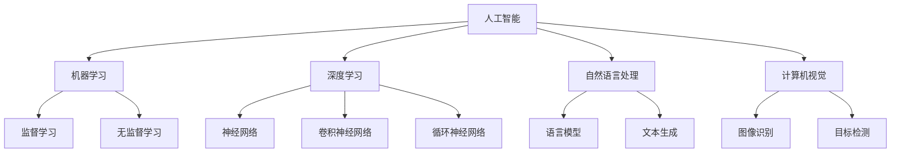

#### 核心算法原理讲解
监督学习、无监督学习和强化学习是机器学习的三大主要算法。监督学习利用已知标记数据进行学习，无监督学习不使用标记数据，而强化学习通过与环境互动来学习。

#### 伪代码
```python
# 监督学习伪代码
def supervised_learning(data, labels):
    for each sample (x, y) in data:
        loss = compute_loss(x, y)
        update_model_parameters(loss)
    return model

# 无监督学习伪代码
def unsupervised_learning(data):
    initialize_model_parameters()
    for each sample x in data:
        loss = compute_loss(x)
        update_model_parameters(loss)
    return model

# 强化学习伪代码
def reinforcement_learning(state, action, reward, next_state):
    Q_value = update_Q_value(Q_value, state, action, reward, next_state)
    return Q_value
```

#### 数学模型和公式
$$
\min_{\theta} J(\theta) = \frac{1}{m} \sum_{i=1}^{m} \text{loss}(h_\theta(x^{(i)}), y^{(i)})
$$

#### 举例说明
深度学习在图像识别领域取得了巨大成功。例如，使用卷积神经网络（CNN）可以准确识别图像中的物体。

### 第2章：机器学习基础

#### 核心概念与联系
机器学习分为监督学习、无监督学习和强化学习。监督学习通过已知标记数据进行学习，无监督学习不使用标记数据，强化学习通过与环境互动来学习。

#### Mermaid流程图
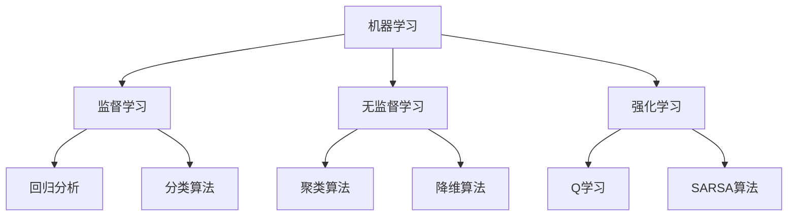

#### 核心算法原理讲解
监督学习中的回归分析和分类算法是机器学习的核心。回归分析用于预测连续值，分类算法用于预测离散值。

#### 伪代码
```python
# 回归分析伪代码
def regression_analysis(data, labels):
    theta = optimize_parameters(data, labels)
    return theta

# 分类算法伪代码
def classification_algorithm(data, labels):
    model = train_model(data, labels)
    predictions = predict(model, data)
    return predictions
```

#### 数学模型和公式
回归分析：
$$
y = \theta_0 + \theta_1x
$$

分类算法：
$$
P(y = 1 | x) = \frac{1}{1 + \exp(-\theta^T x)}
$$

#### 举例说明
使用决策树算法进行分类任务，可以有效地识别数据中的模式。

### 第3章：深度学习原理

#### 核心概念与联系
深度学习是机器学习的一个分支，其核心是神经网络。神经网络由多层神经元组成，可以通过训练学习复杂的函数。

#### Mermaid流程图
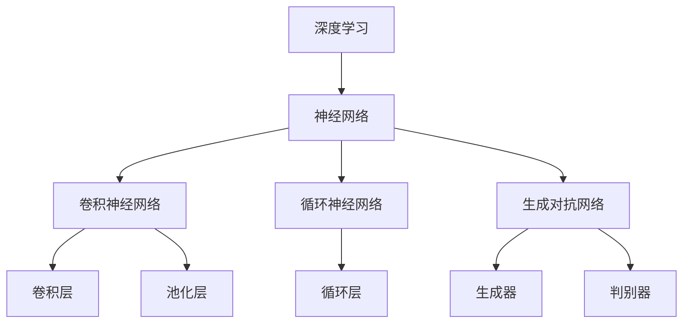

#### 核心算法原理讲解
卷积神经网络（CNN）适用于图像处理，循环神经网络（RNN）适用于序列数据，生成对抗网络（GAN）适用于数据生成。

#### 伪代码
```python
# 卷积神经网络伪代码
def convolutional_neural_network(data):
    for layer in layers:
        data = layer.forward(data)
    return data

# 循环神经网络伪代码
def recurrent_neural_network(data):
    for layer in layers:
        data = layer.forward(data)
    return data

# 生成对抗网络伪代码
def generative_adversarial_network(data):
    generator_loss = compute_generator_loss(generator, data)
    discriminator_loss = compute_discriminator_loss(discriminator, data)
    return generator_loss, discriminator_loss
```

#### 数学模型和公式
神经网络：
$$
a_{i+1} = \sigma(\theta^T a_i)
$$

卷积神经网络：
$$
h(x) = \sigma(W \cdot x + b)
$$

循环神经网络：
$$
h_t = \sigma(W_h h_{t-1} + W_x x_t + b_h)
$$

生成对抗网络：
$$
G(z) = \mu(z) + \sigma(z)
$$
$$
D(x) = \frac{1}{1 + \exp(-x)}
$$

#### 举例说明
深度学习在图像识别和语音识别领域取得了显著成果，例如，使用CNN可以准确识别图像中的物体。

### 第4章：Python与AI库

#### 核心概念与联系
Python是深度学习的主要编程语言，常用的AI库包括NumPy、Pandas、Scikit-learn和TensorFlow。

#### Mermaid流程图
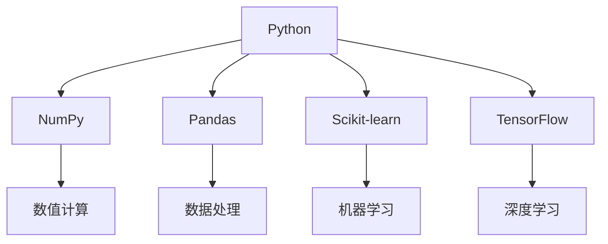

#### 核心算法原理讲解
NumPy提供高效的数值计算，Pandas提供数据处理功能，Scikit-learn提供机器学习算法，TensorFlow提供深度学习框架。

#### 伪代码
```python
# NumPy伪代码
import numpy as np
data = np.array([1, 2, 3])
result = np.sum(data)

# Pandas伪代码
import pandas as pd
data = pd.DataFrame({'A': [1, 2], 'B': [3, 4]})
result = data.sum()

# Scikit-learn伪代码
from sklearn.linear_model import LinearRegression
model = LinearRegression()
model.fit(X, y)
predictions = model.predict(X)

# TensorFlow伪代码
import tensorflow as tf
model = tf.keras.Sequential()
model.add(tf.keras.layers.Dense(units=1, input_shape=[1]))
model.compile(optimizer='sgd', loss='mean_squared_error')
model.fit(X, y, epochs=100)
```

#### 数学模型和公式
$$
\text{NumPy: } \text{sum} = \sum_{i=1}^{n} a_i
$$
$$
\text{Pandas: } \text{sum} = \sum_{i=1}^{n} a_i
$$
$$
\text{Scikit-learn: } y = \theta_0 + \theta_1x
$$
$$
\text{TensorFlow: } y = \sigma(W \cdot x + b)
$$

#### 举例说明
使用TensorFlow实现一个简单的线性回归模型，预测房价。

```python
import tensorflow as tf
model = tf.keras.Sequential()
model.add(tf.keras.layers.Dense(units=1, input_shape=[1]))
model.compile(optimizer='sgd', loss='mean_squared_error')
model.fit(x_train, y_train, epochs=100)
predictions = model.predict(x_test)
```

### 第5章：文本分类实战

#### 核心概念与联系
文本分类是一种监督学习任务，通过训练模型对文本进行分类。

#### Mermaid流程图
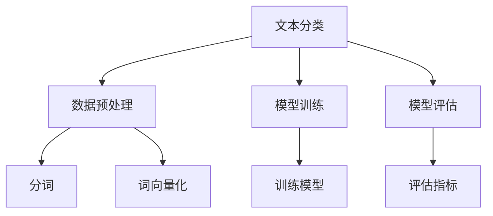

#### 核心算法原理讲解
文本分类通常使用神经网络进行模型训练，常用的评估指标包括准确率、召回率和F1分数。

#### 伪代码
```python
# 数据预处理伪代码
def preprocess_text(text):
    text = tokenize(text)
    text = vectorize(text)
    return text

# 模型训练伪代码
def train_model(text, labels):
    model = build_model()
    model.fit(text, labels, epochs=10)
    return model

# 模型评估伪代码
def evaluate_model(model, text, labels):
    predictions = model.predict(text)
    accuracy = compute_accuracy(predictions, labels)
    return accuracy
```

#### 数学模型和公式
神经网络：
$$
y = \sigma(W \cdot x + b)
$$

评估指标：
$$
\text{Accuracy} = \frac{TP + TN}{TP + TN + FP + FN}
$$
$$
\text{Recall} = \frac{TP}{TP + FN}
$$
$$
\text{F1-Score} = 2 \cdot \frac{Precision \cdot Recall}{Precision + Recall}
$$

#### 项目实战
使用TensorFlow实现一个简单的文本分类项目，对影评进行分类。

```python
import tensorflow as tf
model = tf.keras.Sequential()
model.add(tf.keras.layers.Embedding(vocabulary_size, embedding_dim))
model.add(tf.keras.layers.GlobalAveragePooling1D())
model.add(tf.keras.layers.Dense(1, activation='sigmoid'))
model.compile(optimizer='adam', loss='binary_crossentropy', metrics=['accuracy'])
model.fit(train_data, train_labels, epochs=5, validation_data=(test_data, test_labels))
```

### 第6章：图像识别实战

#### 核心概念与联系
图像识别是一种计算机视觉任务，通过训练模型识别图像中的物体。

#### Mermaid流程图
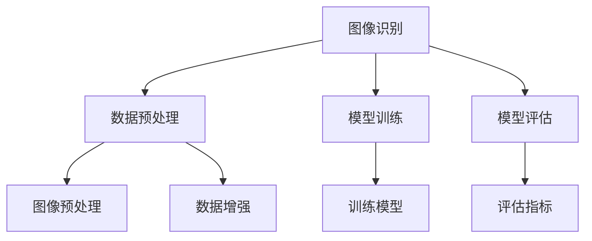

#### 核心算法原理讲解
图像识别通常使用卷积神经网络进行模型训练，常用的评估指标包括准确率、召回率和F1分数。

#### 伪代码
```python
# 数据预处理伪代码
def preprocess_image(image):
    image = resize(image)
    image = normalize(image)
    return image

# 模型训练伪代码
def train_model(images, labels):
    model = build_model()
    model.fit(images, labels, epochs=10)
    return model

# 模型评估伪代码
def evaluate_model(model, images, labels):
    predictions = model.predict(images)
    accuracy = compute_accuracy(predictions, labels)
    return accuracy
```

#### 数学模型和公式
卷积神经网络：
$$
h(x) = \sigma(W \cdot x + b)
$$

评估指标：
$$
\text{Accuracy} = \frac{TP + TN}{TP + TN + FP + FN}
$$
$$
\text{Recall} = \frac{TP}{TP + FN}
$$
$$
\text{F1-Score} = 2 \cdot \frac{Precision \cdot Recall}{Precision + Recall}
$$

#### 项目实战
使用TensorFlow实现一个简单的图像识别项目，对人脸进行识别。

```python
import tensorflow as tf
model = tf.keras.Sequential()
model.add(tf.keras.layers.Conv2D(32, (3, 3), activation='relu', input_shape=(28, 28, 1)))
model.add(tf.keras.layers.MaxPooling2D((2, 2)))
model.add(tf.keras.layers.Flatten())
model.add(tf.keras.layers.Dense(128, activation='relu'))
model.add(tf.keras.layers.Dense(10, activation='softmax'))
model.compile(optimizer='adam', loss='categorical_crossentropy', metrics=['accuracy'])
model.fit(x_train, y_train, epochs=5, validation_data=(x_test, y_test))
```

### 第7章：生成对抗网络（GAN）实战

#### 核心概念与联系
生成对抗网络（GAN）是一种用于数据生成的深度学习模型，由生成器和判别器组成。

#### Mermaid流程图
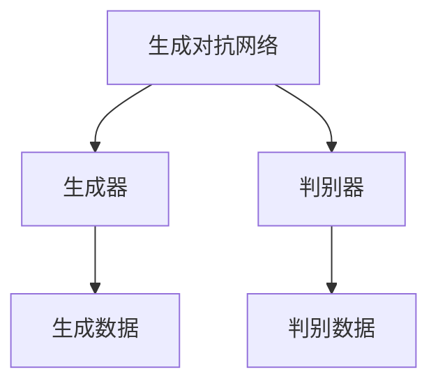

#### 核心算法原理讲解
生成器和判别器相互对抗，生成器生成数据，判别器判断数据真实性。通过不断训练，生成器逐渐生成更真实的数据。

#### 伪代码
```python
# 生成器伪代码
def generator(z):
    x = dense(z, units=256, activation='relu')
    x = dense(x, units=128, activation='relu')
    x = dense(x, units=1, activation='tanh')
    return x

# 判别器伪代码
def discriminator(x):
    x = dense(x, units=128, activation='relu')
    x = dense(x, units=256, activation='relu')
    x = dense(x, units=1, activation='sigmoid')
    return x
```

#### 数学模型和公式
生成器：
$$
G(z) = \mu(z) + \sigma(z)
$$

判别器：
$$
D(x) = \frac{1}{1 + \exp(-x)}
$$

#### 项目实战
使用TensorFlow实现一个简单的GAN项目，生成人脸图像。

```python
import tensorflow as tf
generator = tf.keras.Sequential()
generator.add(tf.keras.layers.Dense(units=256, activation='relu', input_shape=(100,)))
generator.add(tf.keras.layers.Dense(units=128, activation='relu'))
generator.add(tf.keras.layers.Dense(units=1, activation='tanh'))
discriminator = tf.keras.Sequential()
discriminator.add(tf.keras.layers.Dense(units=128, activation='relu', input_shape=(28, 28, 1)))
discriminator.add(tf.keras.layers.Dense(units=256, activation='relu'))
discriminator.add(tf.keras.layers.Dense(units=1, activation='sigmoid'))
discriminator.compile(optimizer='adam', loss='binary_crossentropy')
generator.compile(optimizer='adam', loss='binary_crossentropy')
for epoch in range(100):
    z = np.random.normal(size=(32, 100))
    with tf.GradientTape() as generator_tape, tf.GradientTape() as discriminator_tape:
        generated_images = generator(z)
        real_images = np.random.choice(train_images, size=32)
        generated_labels = generator_tape(generated_images)
        real_labels = discriminator_tape(real_images)
        discriminator_loss = discriminator.train_on_batch([generated_images, real_images], [generated_labels, real_labels])
        generated_labels = generator_tape(generated_images)
        discriminator_loss = discriminator.train_on_batch([generated_images], generated_labels)
    generator_optimizer.minimize(generator_loss, generator.trainable_variables)
    discriminator_optimizer.minimize(discriminator_loss, discriminator.trainable_variables)
    if epoch % 10 == 0:
        print(f"Epoch {epoch}: Generator Loss: {generator_loss}, Discriminator Loss: {discriminator_loss}")
```

### 第8章：AI项目开发流程

#### 核心概念与联系
AI项目开发包括需求分析、项目规划、设计、实施、监控和评估等环节。

#### Mermaid流程图
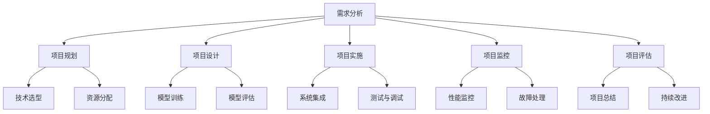

#### 核心算法原理讲解
需求分析、项目规划和项目设计是项目成功的关键，模型训练和模型评估决定了模型的性能，项目实施、监控和评估确保项目的顺利进行。

#### 伪代码
```python
# 需求分析伪代码
def analyze_requirements():
    requirements = collect_requirements()
    return requirements

# 项目规划伪代码
def plan_project(requirements):
    plan = create_plan(requirements)
    return plan

# 项目设计伪代码
def design_project(plan):
    design = create_design(plan)
    return design

# 模型训练伪代码
def train_model(model, data):
    model.fit(data, epochs=10)
    return model

# 模型评估伪代码
def evaluate_model(model, data):
    accuracy = model.evaluate(data)
    return accuracy
```

#### 数学模型和公式
项目规划：
$$
\text{项目进度} = \frac{\text{已完成工作}}{\text{计划工作}}
$$

模型评估：
$$
\text{Accuracy} = \frac{TP + TN}{TP + TN + FP + FN}
$$
$$
\text{Recall} = \frac{TP}{TP + FN}
$$
$$
\text{F1-Score} = 2 \cdot \frac{Precision \cdot Recall}{Precision + Recall}
$$

#### 项目实战
开发一个基于深度学习的图像识别项目，从需求分析到项目评估，逐步实现。

```python
# 需求分析
requirements = analyze_requirements()

# 项目规划
plan = plan_project(requirements)

# 项目设计
design = design_project(plan)

# 模型训练
model = train_model(design.model, design.data)

# 模型评估
accuracy = evaluate_model(model, design.test_data)
print(f"Model Accuracy: {accuracy}")
```

### 第9章：强化学习原理与应用

#### 核心概念与联系
强化学习是一种通过与环境互动学习策略的机器学习方法。它包括Q学习、SARSA等算法。

#### Mermaid流程图
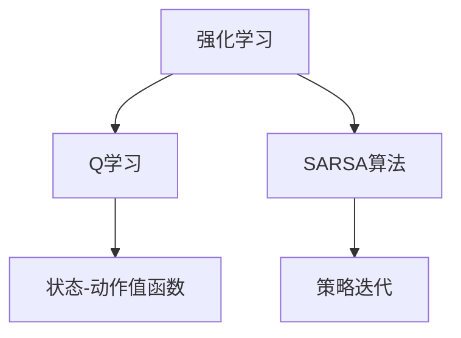

#### 核心算法原理讲解
Q学习通过更新状态-动作值函数来学习策略，SARSA算法通过同时更新当前状态和下一状态的动作值来学习策略。

#### 伪代码
```python
# Q学习伪代码
def q_learning(state, action, reward, next_state):
    Q_value = update_Q_value(Q_value, state, action, reward, next_state)
    return Q_value

# SARSA算法伪代码
def sarsa(state, action, reward, next_state, next_action):
    Q_value = update_Q_value(Q_value, state, action, reward, next_state, next_action)
    return Q_value
```

#### 数学模型和公式
Q学习：
$$
Q(s, a) = Q(s, a) + \alpha [r + \gamma \max_{a'} Q(s', a') - Q(s, a)]
$$

SARSA：
$$
Q(s, a) = Q(s, a) + \alpha [r + \gamma Q(s', a')]
$$

#### 项目实战
开发一个简单的强化学习项目，使用Q学习算法进行智能购物车推荐。

```python
# Q学习算法实现
import numpy as np
Q = np.zeros((n_states, n_actions))
alpha = 0.1
gamma = 0.9
for episode in range(n_episodes):
    state = env.reset()
    done = False
    while not done:
        action = np.argmax(Q[state])
        next_state, reward, done, _ = env.step(action)
        Q[state, action] = Q[state, action] + alpha * (reward + gamma * np.max(Q[next_state]) - Q[state, action])
        state = next_state
```

### 第10章：自然语言处理（NLP）实战

#### 核心概念与联系
自然语言处理（NLP）是AI的一个重要分支，涉及语言模型、文本生成等任务。

#### Mermaid流程图
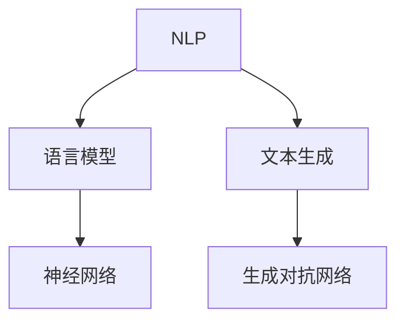

#### 核心算法原理讲解
语言模型通过预测下一个单词来生成文本，文本生成模型通过生成器生成文本。

#### 伪代码
```python
# 语言模型伪代码
def language_model(text):
    model = build_model()
    model.fit(text)
    return model

# 文本生成伪代码
def generate_text(model, start_word, length):
    text = [start_word]
    for _ in range(length):
        word = model.predict_next_word(text[-1])
        text.append(word)
    return ' '.join(text)
```

#### 数学模型和公式
语言模型：
$$
P(w_{t} | w_{1}, w_{2}, ..., w_{t-1}) = \frac{1}{Z} \exp(\theta^T w_{t-1})
$$

文本生成：
$$
G(z) = \mu(z) + \sigma(z)
$$

#### 项目实战
使用生成对抗网络（GAN）实现一个简单的文本生成项目。

```python
import tensorflow as tf
z_dim = 100
generator = tf.keras.Sequential()
generator.add(tf.keras.layers.Dense(units=256, activation='relu', input_shape=(z_dim,)))
generator.add(tf.keras.layers.Dense(units=512, activation='relu'))
generator.add(tf.keras.layers.Dense(units=1024, activation='relu'))
generator.add(tf.keras.layers.Dense(units=n_words, activation='softmax'))
discriminator = tf.keras.Sequential()
discriminator.add(tf.keras.layers.Dense(units=1024, activation='relu', input_shape=(n_words,)))
discriminator.add(tf.keras.layers.Dense(units=512, activation='relu'))
discriminator.add(tf.keras.layers.Dense(units=256, activation='relu'))
discriminator.add(tf.keras.layers.Dense(units=1, activation='sigmoid'))
discriminator.compile(optimizer='adam', loss='binary_crossentropy')
generator.compile(optimizer='adam', loss='binary_crossentropy')
for epoch in range(n_epochs):
    z = np.random.normal(size=(batch_size, z_dim))
    with tf.GradientTape() as generator_tape, tf.GradientTape() as discriminator_tape:
        generated_text = generator(z)
        real_text = np.random.choice(train_texts, size=batch_size)
        generated_labels = generator_tape(generated_text)
        real_labels = discriminator_tape(real_text)
        discriminator_loss = discriminator.train_on_batch([generated_text, real_text], [generated_labels, real_labels])
        generated_labels = generator_tape(generated_text)
        generator_loss = generator.train_on_batch(z, generated_labels)
    generator_optimizer.minimize(generator_loss, generator.trainable_variables)
    discriminator_optimizer.minimize(discriminator_loss, discriminator.trainable_variables)
    if epoch % 10 == 0:
        print(f"Epoch {epoch}: Generator Loss: {generator_loss}, Discriminator Loss: {discriminator_loss}")
```

### 第11章：深度学习模型优化

#### 核心概念与联系
深度学习模型优化包括模型结构优化、损失函数优化、激活函数优化等。

#### Mermaid流程图
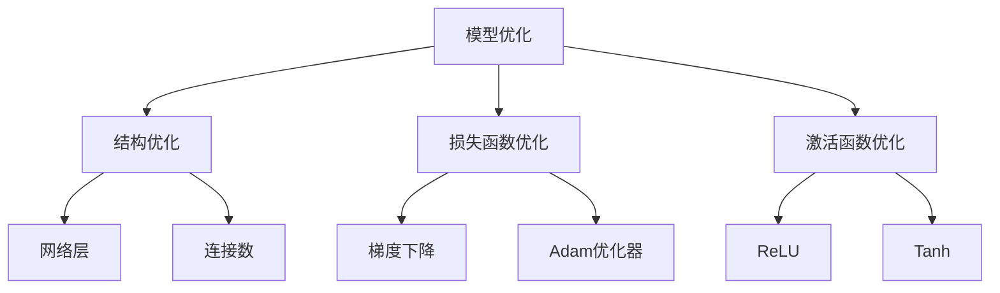

#### 核心算法原理讲解
模型结构优化通过调整网络层和连接数来提高模型性能，损失函数优化通过调整梯度下降算法和优化器来提高收敛速度，激活函数优化通过选择合适的激活函数来提高模型性能。

#### 伪代码
```python
# 模型结构优化伪代码
def optimize_structure(model, data):
    model.add(tf.keras.layers.Dense(units=128, activation='relu'))
    model.compile(optimizer='adam', loss='mean_squared_error')
    model.fit(data, epochs=10)

# 损失函数优化伪代码
def optimize_loss_function(model, data):
    model.compile(optimizer='adam', loss='mean_squared_error')
    model.fit(data, epochs=10)

# 激活函数优化伪代码
def optimize_activation_function(model, data):
    model.add(tf.keras.layers.Dense(units=128, activation='relu'))
    model.compile(optimizer='adam', loss='mean_squared_error')
    model.fit(data, epochs=10)
```

#### 数学模型和公式
网络层：
$$
a_{i+1} = \sigma(\theta^T a_i)
$$

损失函数：
$$
\text{MSE} = \frac{1}{m} \sum_{i=1}^{m} (\hat{y} - y)^2
$$

优化器：
$$
\theta = \theta - \alpha \nabla_\theta J(\theta)
$$

激活函数：
$$
\text{ReLU} = \max(0, x)
$$
$$
\text{Tanh} = \frac{e^x - e^{-x}}{e^x + e^{-x}}
$$

#### 项目实战
优化一个深度学习模型，提高图像识别的准确率。

```python
import tensorflow as tf
model = tf.keras.Sequential()
model.add(tf.keras.layers.Conv2D(32, (3, 3), activation='relu', input_shape=(28, 28, 1)))
model.add(tf.keras.layers.MaxPooling2D((2, 2)))
model.add(tf.keras.layers.Flatten())
model.add(tf.keras.layers.Dense(128, activation='relu'))
model.add(tf.keras.layers.Dense(10, activation='softmax'))
model.compile(optimizer='adam', loss='categorical_crossentropy', metrics=['accuracy'])
model.fit(x_train, y_train, epochs=5, validation_data=(x_test, y_test))

# 优化结构
model.add(tf.keras.layers.Dense(units=256, activation='relu'))
model.compile(optimizer='adam', loss='categorical_crossentropy', metrics=['accuracy'])
model.fit(x_train, y_train, epochs=5, validation_data=(x_test, y_test))

# 优化损失函数
model.compile(optimizer='adam', loss='mean_squared_error', metrics=['accuracy'])
model.fit(x_train, y_train, epochs=5, validation_data=(x_test, y_test))

# 优化激活函数
model.add(tf.keras.layers.Dense(units=128, activation='tanh'))
model.compile(optimizer='adam', loss='categorical_crossentropy', metrics=['accuracy'])
model.fit(x_train, y_train, epochs=5, validation_data=(x_test, y_test))
```

### 第12章：AI编程新趋势

#### 核心概念与联系
AI编程新趋势包括AI伦理与法律、AI与大数据、AI与区块链等。

#### Mermaid流程图
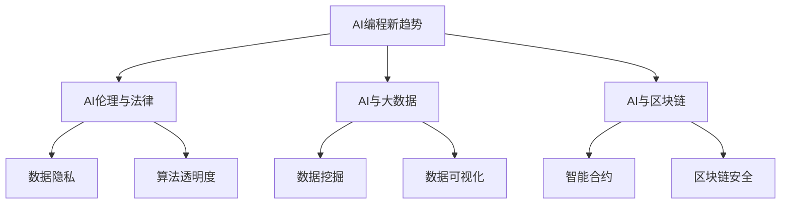

#### 核心算法原理讲解
AI伦理与法律关注数据隐私和算法透明度，AI与大数据涉及数据挖掘和数据可视化，AI与区块链关注智能合约和区块链安全。

#### 伪代码
```python
# 数据隐私伪代码
def anonymize_data(data):
    data = encrypt(data)
    return data

# 算法透明度伪代码
def explain_model(model, data):
    explanation = generate_explanation(model, data)
    return explanation

# 数据挖掘伪代码
def data_mining(data):
    patterns = find_patterns(data)
    return patterns

# 数据可视化伪代码
def visualize_data(data):
    visualization = create_visualization(data)
    return visualization

# 智能合约伪代码
def create_smart_contract(contract):
    contract = deploy_contract(contract)
    return contract

# 区块链安全伪代码
def ensure_blockchain_security():
    security_measures = apply_security_measures()
    return security_measures
```

#### 数学模型和公式
数据隐私：
$$
\text{K-anonymity} = \frac{1}{k} \sum_{i=1}^{k} \text{entropy}(S_i)
$$

算法透明度：
$$
\text{ Transparency } = \frac{\text{explanation}}{\text{model}}
$$

数据挖掘：
$$
\text{ Pattern } = \{s_1, s_2, ..., s_n\}
$$

数据可视化：
$$
\text{ Visualization } = \{v_1, v_2, ..., v_m\}
$$

智能合约：
$$
\text{ Contract } = \{c_1, c_2, ..., c_n\}
$$

区块链安全：
$$
\text{ Security } = \{s_1, s_2, ..., s_n\}
$$

#### 项目实战
开发一个基于区块链的智能合约项目，确保数据隐私和透明度。

```python
from web3 import Web3
# 连接到以太坊节点
w3 = Web3(Web3.HTTPProvider('https://mainnet.infura.io/v3/your_project_id'))

# 部署智能合约
contract = w3.eth.contract(abi=abi, bytecode=bytecode)
contract_instance = contract.deploy()

# 测试智能合约
contract_instance.transact{'from': w3.eth.coinbase}
```

## 最佳实践 tips、小结、注意事项、拓展阅读

### 最佳实践 tips
1. 在进行AI编程时，要关注数据质量和数据预处理，这对模型的性能至关重要。
2. 选择合适的算法和框架，可以提高开发效率和模型性能。
3. 定期评估模型性能，并进行模型优化。

### 小结
本文系统地介绍了AI编程的核心内容，从基础概念到高级应用，帮助读者全面了解AI编程的新视界。

### 注意事项
1. AI编程涉及到大量计算资源，确保拥有足够的计算能力。
2. AI编程需要关注数据隐私和安全性，遵守相关法律法规。

### 拓展阅读
1. 《深度学习》（Goodfellow, I., Bengio, Y., Courville, A.）
2. 《Python机器学习》（Sebastian Raschka）
3. 《AI伦理学》（Luciano Floridi）

## 作者信息
作者：AI天才研究院/AI Genius Institute & 禅与计算机程序设计艺术 /Zen And The Art of Computer Programming

本文由AI天才研究院（AI Genius Institute）撰写，旨在为读者提供全面深入的AI编程指南。希望本文能够帮助您在AI编程领域取得更大的成就。如果您有任何疑问或建议，请随时联系我们。祝您学习愉快！

