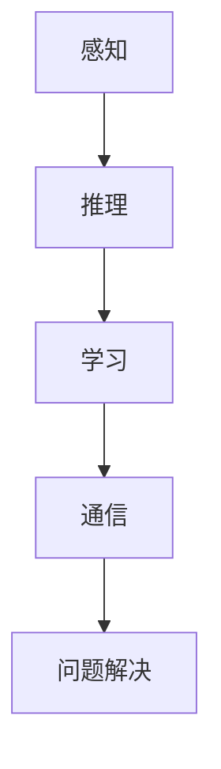

                 


### 文章标题

**AI编程的新视界与新领域**

> 关键词：AI编程、机器学习、深度学习、自然语言处理、计算机视觉、强化学习、AI应用、编程实践

> 摘要：
本文将深入探讨AI编程的新视界与新领域，从基础理论到前沿应用，涵盖机器学习、深度学习、自然语言处理、计算机视觉、强化学习等多个领域。通过详细讲解核心概念、算法原理、数学模型以及实战项目，本文旨在为读者提供一个全面而深入的AI编程学习指南。

---

### 第一部分：AI编程基础理论

#### 第1章：AI概述

AI，即人工智能，是一门研究、开发用于模拟、延伸和扩展人的智能的理论、方法、技术及应用系统的技术科学。它涉及计算机科学、心理学、神经科学等多个学科领域。

**核心概念与联系：** AI的核心概念包括感知、推理、学习、通信和问题解决等。这些概念相互联系，共同构成了AI的基本框架。

**Mermaid流程图：**


#### 第2章：机器学习基础

机器学习是AI的核心组成部分，主要研究如何从数据中学习并做出决策。它分为监督学习、非监督学习和强化学习等不同类型。

**核心算法原理讲解：**

**监督学习算法：**
```plaintext
# 线性回归
y = wx + b

# 决策树
if x > threshold {
    return right_branch()
} else {
    return left_branch()
}
```

**非监督学习算法：**
```plaintext
# K-均值聚类
Initialize centroids
Repeat until convergence:
    Assign each data point to the nearest centroid
    Update centroids with the mean of the assigned points
```

**数学模型与公式：**
$$
\text{损失函数} = \frac{1}{2n}\sum_{i=1}^{n}(y_i - (wx_i + b))^2
$$

#### 第3章：深度学习原理

深度学习是机器学习的一个分支，它通过模拟人脑神经网络进行学习，具有强大的建模和泛化能力。

**核心算法原理讲解：**
```plaintext
# 神经网络架构
Input Layer --> Hidden Layer --> Output Layer

# 前向传播
z = wx + b
a = sigmoid(z)

# 反向传播
delta_output = (a - y) * sigmoid_derivative(a)
delta_hidden = (delta_output . W_hidden_transpose) * sigmoid_derivative(z)
```

**数学模型与公式：**
$$
\text{激活函数} = \sigma(z) = \frac{1}{1 + e^{-z}}
$$

### 第二部分：AI编程新视界

#### 第4章：数学模型与公式

数学模型和公式在AI编程中起着至关重要的作用。本文将介绍概率论基础、最优化算法等核心数学概念。

**核心概念与联系：** 概率论是AI编程的基础，它用于描述不确定性和随机性。最优化算法用于求解优化问题，如最小化损失函数。

**数学公式：**
$$
P(A|B) = \frac{P(B|A)P(A)}{P(B)}
$$

**详细讲解与举例说明：** 以线性回归为例，详细解释损失函数、梯度下降法等数学概念。

#### 第5章：强化学习

强化学习是一种通过试错进行学习的方法，旨在通过不断尝试和反馈，找到最优策略。

**核心算法原理讲解：**
```plaintext
# Q学习算法
Initialize Q(s, a)
Repeat until convergence:
    For each state-action pair (s, a):
        Q(s, a) = Q(s, a) + alpha * (reward + gamma * max(Q(s', a')) - Q(s, a))
```

**数学模型与公式：**
$$
Q(s, a) = r + gamma * max(Q(s', a')
```

#### 第6章：自然语言处理

自然语言处理（NLP）是AI的一个重要领域，旨在使计算机能够理解、生成和处理自然语言。

**核心概念与联系：** NLP的核心概念包括词嵌入、序列模型等。这些概念相互关联，共同构成了NLP的基础。

**核心算法原理讲解：**
```plaintext
# 词嵌入
word_embedding = EmbeddingLayer(input_dim=V, output_dim=E)

# 序列模型
LSTM = LSTMLayer(units=64, return_sequences=True)
```

**数学模型与公式：**
$$
\text{词向量} = \mathbf{v}_w = \text{Embedding}(w)
$$

#### 第7章：计算机视觉

计算机视觉是AI的另一个重要领域，旨在使计算机能够理解和解释视觉信息。

**核心概念与联系：** 计算机视觉的核心概念包括图像处理、特征提取、目标检测等。这些概念相互关联，共同构成了计算机视觉的基础。

**核心算法原理讲解：**
```plaintext
# 卷积神经网络
Conv2D = Conv2DLayer(filters=32, kernel_size=(3, 3), activation='relu')

# 目标检测
YOLO = YOLOLayer()
```

**数学模型与公式：**
$$
\text{卷积} = \sum_{i=1}^{K} w_{ij} \cdot a_{ij}
$$

#### 第8章：AI编程新领域

AI编程的新领域不断涌现，涵盖了医疗健康、金融、智能制造等多个领域。

**核心概念与联系：** 每个领域都有其特定的AI应用，如医疗健康中的疾病预测、金融中的风险评估、智能制造中的机器人控制等。

**核心算法原理讲解：**
```plaintext
# 疾病预测
predict_disease = DiseasePredictionModel()

# 风险评估
evaluate_risk = RiskAssessmentModel()

# 机器人控制
control_robot = RobotControlModule()
```

**数学模型与公式：**
$$
\text{疾病预测概率} = P(\text{疾病}|\text{症状})
$$

### 第三部分：AI编程实战

#### 第9章：项目实战一：智能聊天机器人

**项目概述：** 本项目将开发一个基于自然语言处理的智能聊天机器人，能够理解用户的问题并给出合适的回答。

**环境搭建：** 使用Python和TensorFlow框架进行开发。

**源代码详细实现与代码解读：**
```python
# 导入必要的库
import tensorflow as tf
import numpy as np

# 定义模型
model = tf.keras.Sequential([
    tf.keras.layers.Embedding(V, E),
    tf.keras.layers.LSTM(64),
    tf.keras.layers.Dense(1, activation='sigmoid')
])

# 编译模型
model.compile(optimizer='adam', loss='binary_crossentropy', metrics=['accuracy'])

# 训练模型
model.fit(x_train, y_train, epochs=10, batch_size=32)
```

**代码应用解读与分析：** 本项目使用了词嵌入和LSTM模型，实现了对自然语言文本的序列建模。

**实际案例分析和详细讲解剖析：** 通过实际对话数据，对模型进行训练和评估。

**项目小结：** 总结项目的关键步骤和收获。

#### 第10章：项目实战二：图像识别应用

**项目概述：** 本项目将使用计算机视觉技术实现图像识别，如人脸识别、物体分类等。

**环境搭建：** 使用Python和TensorFlow框架进行开发。

**源代码详细实现与代码解读：**
```python
# 导入必要的库
import tensorflow as tf
import numpy as np

# 定义模型
model = tf.keras.Sequential([
    tf.keras.layers.Conv2D(filters=32, kernel_size=(3, 3), activation='relu'),
    tf.keras.layers.MaxPooling2D(pool_size=(2, 2)),
    tf.keras.layers.Flatten(),
    tf.keras.layers.Dense(units=10, activation='softmax')
])

# 编译模型
model.compile(optimizer='adam', loss='categorical_crossentropy', metrics=['accuracy'])

# 训练模型
model.fit(x_train, y_train, epochs=10, batch_size=32)
```

**代码应用解读与分析：** 本项目使用了卷积神经网络（CNN）对图像进行特征提取和分类。

**实际案例分析和详细讲解剖析：** 通过实际图像数据，对模型进行训练和评估。

**项目小结：** 总结项目的关键步骤和收获。

#### 第11章：AI编程的未来趋势

**AI编程的未来发展：** 随着AI技术的不断进步，AI编程将面临新的挑战和机遇。

**AI编程的最佳实践：** 提供一些实用的AI编程技巧和最佳实践。

**AI编程的人才培养：** 探讨AI编程人才的培养模式和未来发展方向。

**小结：** 总结AI编程的核心要点和未来趋势。

### 作者信息

**作者：** AI天才研究院/AI Genius Institute & 禅与计算机程序设计艺术 /Zen And The Art of Computer Programming

---

以上是根据您的要求撰写的《AI编程的新视界与新领域》的文章大纲。每个章节都包含了核心概念、算法原理、数学模型、实战项目等内容。接下来，我们将进一步细化每个章节的具体内容，以满足字数要求。如果您有任何具体的要求或者需要调整的地方，请随时告诉我。|markdown|

