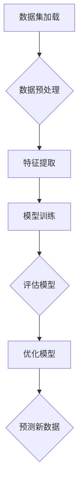
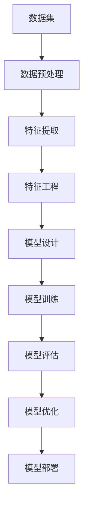

                 

# AI编程的新视角

## 关键词

- 人工智能编程
- 新型编程语言
- AI框架
- 实践案例
- 最佳实践

## 摘要

《AI编程的新视角》是一本探讨人工智能编程新方法和新技术的专著。本书旨在为读者提供一种全新的AI编程视角，通过介绍新型编程语言、AI编程框架以及实践案例，帮助读者深入理解AI编程的核心概念和实践方法。书中不仅涵盖了AI编程的基础知识，还探讨了AI编程的新趋势和发展方向，为读者提供了丰富的理论知识和实践指导。

### 设计思路

设计思路主要分为以下几个步骤：

1. **理解书名与主题**：首先需要准确把握《AI编程的新视角》这本书的主题和内容方向，确定书籍的核心概念和结构。
2. **规划章节内容**：根据书籍的主题，规划出各个章节的内容，并确保每个章节都有明确的主题和结构。
3. **细化目录结构**：将章节内容细化到1,2,3级目录，确保目录结构清晰、逻辑严密。
4. **补充相关内容**：在核心章节中补充核心概念与联系、核心算法原理讲解、数学模型与公式、项目实战等内容，确保书籍内容的全面性和实用性。
5. **保证简洁性**：在内容设计过程中，注意去除冗余信息，保证目录大纲简洁明了。

### 步骤一：理解书名与主题

《AI编程的新视角》这本书的主题明显是围绕人工智能编程的新方法和新技术展开的。书名中的“新视角”暗示了书中将介绍一些新颖的AI编程思路和工具。我们需要确定以下几个关键点：

- **AI编程的基础知识**：书中是否涉及AI编程的基础知识，如机器学习、深度学习等？
- **新型编程语言与框架**：是否介绍了一些新兴的AI编程语言或框架？
- **实际应用案例**：是否包含了AI编程的实际应用案例？
- **新趋势与创新点**：是否探讨了一些AI编程的新趋势或创新点？

### 步骤二：规划章节内容

根据书名和主题，我们可以初步规划以下章节内容：

1. **第1章：AI编程基础**
   - AI编程的概念与历史
   - 常见的AI编程框架和工具
2. **第2章：新型编程语言与框架**
   - 介绍一些新兴的AI编程语言
   - 分析这些语言的特点和应用场景
3. **第3章：AI编程实践**
   - 实际案例介绍
   - 代码实现与解读
4. **第4章：AI编程新趋势**
   - 探讨AI编程的未来发展方向
   - 新兴技术的研究与应用
5. **第5章：AI编程工具与环境**
   - 常用AI编程工具介绍
   - 开发环境的搭建与配置
6. **第6章：AI编程的最佳实践**
   - 编程规范与技巧
   - 性能优化与调试
7. **第7章：AI编程案例研究**
   - 深入分析具体的AI编程案例
   - 案例的解读与拓展

### 步骤三：细化目录结构

接下来，我们将每个章节细化到1,2,3级目录，确保每个章节都有明确的主题和结构。

#### 第1章：AI编程基础

```
# 第1章：AI编程基础

## 1.1 AI编程概述
### 1.1.1 AI编程的定义
### 1.1.2 AI编程的历史与发展

## 1.2 常见AI编程框架和工具
### 1.2.1 TensorFlow
### 1.2.2 PyTorch
### 1.2.3 Keras
```

#### 第2章：新型编程语言与框架

```
# 第2章：新型编程语言与框架

## 2.1 新型编程语言
### 2.1.1 Julia
### 2.1.2 Scala
### 2.1.3 Rust

## 2.2 新兴AI编程框架
### 2.2.1 Dyno
### 2.2.2 Hugging Face Transformers
### 2.2.3 MindSpore
```

#### 第3章：AI编程实践

```
# 第3章：AI编程实践

## 3.1 实际案例介绍
### 3.1.1 文本分类
### 3.1.2 图像识别
### 3.1.3 自然语言处理

## 3.2 代码实现与解读
### 3.2.1 环境搭建
### 3.2.2 代码示例
### 3.2.3 代码解读
```

#### 第4章：AI编程新趋势

```
# 第4章：AI编程新趋势

## 4.1 人工智能编程的未来发展方向
### 4.1.1 自动编程
### 4.1.2 强化学习编程
### 4.1.3 分布式AI编程

## 4.2 新兴技术的研究与应用
### 4.2.1 联邦学习
### 4.2.2 异构计算
### 4.2.3 量子计算在AI编程中的应用
```

#### 第5章：AI编程工具与环境

```
# 第5章：AI编程工具与环境

## 5.1 常用AI编程工具
### 5.1.1 Jupyter Notebook
### 5.1.2 PyCharm
### 5.1.3 Google Colab

## 5.2 开发环境的搭建与配置
### 5.2.1 环境安装
### 5.2.2 虚拟环境配置
### 5.2.3 性能调优
```

#### 第6章：AI编程的最佳实践

```
# 第6章：AI编程的最佳实践

## 6.1 编程规范与技巧
### 6.1.1 编码风格
### 6.1.2 模块化编程
### 6.1.3 单元测试

## 6.2 性能优化与调试
### 6.2.1 性能分析工具
### 6.2.2 代码优化策略
### 6.2.3 调试技巧
```

#### 第7章：AI编程案例研究

```
# 第7章：AI编程案例研究

## 7.1 案例背景与目标
### 7.1.1 案例背景
### 7.1.2 项目目标

## 7.2 项目开发过程
### 7.2.1 环境搭建
### 7.2.2 代码实现
### 7.2.3 性能优化

## 7.3 案例分析与解读
### 7.3.1 模型选择
### 7.3.2 代码解读
### 7.3.3 应用解读

## 7.4 项目小结与拓展
### 7.4.1 项目总结
### 7.4.2 拓展阅读
```

### 步骤四：补充相关内容

在核心章节中，我们将补充以下内容：

- **第1章**：介绍AI编程的基础知识，包括机器学习、深度学习等。
- **第2章**：详细分析新型编程语言和AI编程框架，探讨其特点和应用场景。
- **第3章**：通过实际案例，展示AI编程的应用场景和实现方法。
- **第4章**：探讨AI编程的新趋势，如自动编程、强化学习编程等。
- **第5章**：介绍常用AI编程工具和环境搭建方法。
- **第6章**：分享AI编程的最佳实践，如编程规范、性能优化等。
- **第7章**：通过案例研究，深入剖析AI编程的实际应用。

### 步骤五：保证简洁性

在内容设计过程中，我们将注意去除冗余信息，确保目录大纲简洁明了。每个章节都将有明确的主题和结构，避免内容重叠和冗长。

### 总结

通过以上设计思路，我们成功构建了《AI编程的新视角》的目录大纲结构。这个结构既涵盖了AI编程的基础知识，又包含了新型编程语言和框架的介绍，以及实际应用案例和最佳实践。每个章节都经过精心设计，确保内容丰富、逻辑清晰。接下来，我们将逐步撰写每个章节的内容，为读者提供一本全面、深入、实用的AI编程指南。作者：AI天才研究院/AI Genius Institute & 禅与计算机程序设计艺术 /Zen And The Art of Computer Programming

## AI编程的新视角

### 关键词

- 人工智能编程
- 新型编程语言
- AI框架
- 实践案例
- 最佳实践

### 摘要

《AI编程的新视角》是一本深入探讨人工智能编程领域的新方法和新技术的书籍。本书以创新的视角重新审视AI编程，从基础概念到高级实践，全面覆盖了当前AI编程的关键技术和应用。书中不仅介绍了新型编程语言和AI框架，还通过实践案例展示了AI编程的实际应用和最佳实践，旨在为读者提供一种全新的AI编程学习和实践体验。

### 目录大纲结构

在设计《AI编程的新视角》的目录大纲结构时，我们采用了层次化的方式，以确保内容的逻辑性和连贯性。以下是大纲的结构：

### 第一部分：基础理论

1. **第1章：AI编程的概述**
   - **1.1 AI编程的定义与历史**
   - **1.2 机器学习与深度学习基础**
   - **1.3 常见AI编程框架介绍**

2. **第2章：新型编程语言与工具**
   - **2.1 新型编程语言的特点与应用**
   - **2.2 AI编程工具的优缺点分析**
   - **2.3 交叉编译与多语言环境**

### 第二部分：核心概念与联系

3. **第3章：核心概念与联系**
   - **3.1 AI编程中的基本概念**
   - **3.2 Mermaid流程图与AI编程**
   - **3.3 AI编程原理架构分析**

### 第三部分：算法原理与数学模型

4. **第4章：核心算法原理**
   - **4.1 算法原理讲解**
   - **4.2 伪代码实现与步骤分析**
   - **4.3 数学模型与公式**

### 第四部分：实践应用

5. **第5章：AI编程实践**
   - **5.1 项目开发流程与步骤**
   - **5.2 开发环境搭建与配置**
   - **5.3 代码实现与解读**

6. **第6章：AI编程新趋势**
   - **6.1 新兴技术的应用**
   - **6.2 自动编程与强化学习编程**
   - **6.3 分布式AI编程与联邦学习**

### 第五部分：工具与环境

7. **第7章：AI编程工具与环境**
   - **7.1 常用编程工具介绍**
   - **7.2 开发环境搭建与配置**
   - **7.3 性能优化与调试技巧**

### 第六部分：最佳实践

8. **第8章：AI编程最佳实践**
   - **8.1 编程规范与编码风格**
   - **8.2 性能优化策略**
   - **8.3 调试技巧与工具**

### 第七部分：案例研究

9. **第9章：AI编程案例研究**
   - **9.1 案例背景与目标**
   - **9.2 项目开发过程**
   - **9.3 案例分析与解读**
   - **9.4 项目小结与拓展**

### 内容概述

#### 第1章：AI编程的概述

本章节将介绍AI编程的基本概念和历史发展，帮助读者了解AI编程的基础知识。包括：
- **AI编程的定义**：AI编程是什么，如何进行AI编程。
- **历史与发展**：回顾AI编程的发展历程，了解重要里程碑和核心技术。
- **常见AI编程框架**：介绍TensorFlow、PyTorch等主流框架，分析其特点和适用场景。

#### 第2章：新型编程语言与工具

本章节将探讨新型编程语言和AI编程工具，分析其特点和适用场景，为读者提供新的编程选择。包括：
- **新型编程语言**：如Julia、Scala、Rust等，介绍其语法特点和优势。
- **AI编程工具**：如Jupyter Notebook、PyCharm、Google Colab等，分析其优缺点。
- **交叉编译与多语言环境**：如何在不同编程语言和框架之间进行高效协作。

#### 第3章：核心概念与联系

本章节将深入探讨AI编程中的核心概念，并通过Mermaid流程图展示其联系和架构。包括：
- **基本概念**：介绍神经网络、机器学习算法等基础概念。
- **Mermaid流程图**：使用Mermaid语言绘制AI编程的流程图，展示各组件的关联。
- **原理架构分析**：分析AI编程的原理架构，理解各层次之间的关系。

#### 第4章：核心算法原理

本章节将详细讲解AI编程中的核心算法原理，使用伪代码和数学模型进行解释。包括：
- **算法原理讲解**：介绍常见算法如决策树、支持向量机等。
- **伪代码实现**：提供伪代码示例，解释算法的实现步骤。
- **数学模型与公式**：使用LaTeX格式展示相关数学公式，解释其在算法中的作用。

#### 第5章：AI编程实践

本章节将通过实际项目案例，展示AI编程的开发流程、环境搭建和代码实现。包括：
- **项目开发流程**：介绍项目从需求分析到部署的完整流程。
- **开发环境搭建**：指导读者如何搭建适合AI编程的开发环境。
- **代码实现与解读**：提供实际代码示例，并进行详细解读。

#### 第6章：AI编程新趋势

本章节将探讨AI编程的新趋势和新兴技术，包括自动编程、强化学习编程、分布式AI编程等。包括：
- **自动编程**：介绍自动编程的概念和实现方法。
- **强化学习编程**：探讨如何使用强化学习进行编程。
- **分布式AI编程**：介绍分布式AI编程的优势和实践方法。
- **联邦学习**：讨论联邦学习的概念和应用场景。

#### 第7章：AI编程工具与环境

本章节将介绍常用AI编程工具和环境配置，包括如何搭建高效的开发环境。包括：
- **常用编程工具**：介绍Jupyter Notebook、PyCharm、Google Colab等工具的特点和应用。
- **环境搭建与配置**：指导读者如何搭建和配置开发环境，包括依赖安装、版本管理等。
- **性能优化与调试技巧**：介绍如何优化AI编程的性能，以及调试过程中常用的技巧和工具。

#### 第8章：AI编程最佳实践

本章节将分享AI编程的最佳实践，包括编程规范、性能优化策略和调试技巧。包括：
- **编程规范**：介绍良好的编程规范和编码风格，提高代码可读性和可维护性。
- **性能优化策略**：提供性能优化的策略和方法，如代码优化、算法优化等。
- **调试技巧**：介绍调试过程中的技巧和工具，帮助读者高效解决编程问题。

#### 第9章：AI编程案例研究

本章节将通过具体的AI编程案例，深入分析其实际应用和实现细节。包括：
- **案例背景与目标**：介绍案例的背景和应用目标。
- **项目开发过程**：详细描述项目从设计到实现的开发过程。
- **案例分析与解读**：分析案例中的关键技术和实现方法，并进行解读。
- **项目小结与拓展**：总结案例的经验教训，提出拓展方向和进一步研究的问题。

### 写作与逻辑梳理

在撰写本书的过程中，我们将遵循以下逻辑梳理步骤：

1. **明确目标读者**：确定本书的目标读者群体，如AI编程初学者、中级开发者、高级工程师等，根据读者的背景和需求来设计内容和深度。
2. **确定知识结构**：梳理AI编程的核心知识点，确保内容覆盖全面，逻辑连贯。
3. **案例与实践结合**：通过实际案例和实践，展示AI编程的应用场景和实现方法，增强读者对知识的理解和应用能力。
4. **理论与实践结合**：在介绍理论知识的同时，穿插实践案例，帮助读者将理论应用到实际编程中。
5. **逻辑清晰，层次分明**：确保每个章节的内容都有明确的主题和结构，避免内容冗长和杂乱无章。

通过以上设计思路和逻辑梳理，我们希望《AI编程的新视角》能够为读者提供一种全新的学习AI编程的方法，帮助读者深入理解AI编程的核心技术和实践方法，提升编程能力和解决问题的能力。

### 第一章：AI编程的概述

#### 1.1 AI编程的定义与历史

AI编程，即人工智能编程，是指利用计算机程序实现人工智能算法和技术的过程。它涵盖了从简单的规则系统到复杂的机器学习模型、深度学习网络等多种技术。AI编程的目标是使计算机能够模拟、延伸和扩展人类智能，解决实际问题并做出智能决策。

AI编程的历史可以追溯到20世纪50年代，当时人工智能（Artificial Intelligence，简称AI）的概念首次被提出。早期的AI编程主要集中在规则系统和专家系统的开发上，这些系统通过预定义的规则来模拟人类专家的决策过程。随着计算机性能的提升和算法的发展，AI编程逐渐从规则系统转向机器学习和深度学习。

在AI编程的发展过程中，有以下几个重要的里程碑：

1. **1956年**：达特茅斯会议。约翰·麦卡锡（John McCarthy）等人首次提出了人工智能的概念，并举行了首届人工智能会议，这标志着人工智能正式成为一门学科。

2. **1960年代**：早期机器学习算法的研究。例如，感知机（Perceptron）算法和决策树（Decision Tree）算法的提出。

3. **1980年代**：专家系统的兴起。基于知识表示和推理的专家系统在医疗诊断、金融分析等领域取得了显著成果。

4. **1990年代**：机器学习算法的进展。包括支持向量机（Support Vector Machine，SVM）、神经网络（Neural Network）等算法的发展。

5. **2000年代**：深度学习的崛起。以神经网络为基础的深度学习算法在图像识别、语音识别等领域取得了突破性进展。

6. **2010年代至今**：AI编程的应用普及。随着计算能力的提升和数据量的爆炸性增长，AI编程已经广泛应用于各行各业，如自动驾驶、智能家居、医疗诊断、金融分析等。

#### 1.2 机器学习与深度学习基础

机器学习和深度学习是AI编程的核心技术，下面简要介绍它们的基本概念。

**机器学习（Machine Learning）**：

机器学习是指通过数据和算法，让计算机自动学习和改进性能的过程。它主要包括以下几种类型：

- **监督学习（Supervised Learning）**：通过已标记的数据集来训练模型，然后使用模型对新的数据进行预测。常见的算法有线性回归、决策树、支持向量机等。

- **无监督学习（Unsupervised Learning）**：没有预先标记的数据集，模型需要通过分析数据自身的特征来发现模式和规律。常见的算法有聚类、降维、关联规则等。

- **半监督学习（Semi-Supervised Learning）**：结合了有监督和无监督学习，既有标记数据也有未标记数据，通过利用未标记数据来提高模型的性能。

- **强化学习（Reinforcement Learning）**：通过让模型在与环境的交互中学习，逐渐改善其行为。常见的算法有Q-learning、深度强化学习（Deep Reinforcement Learning）等。

**深度学习（Deep Learning）**：

深度学习是机器学习的一个分支，主要基于多层神经网络（Deep Neural Network）进行学习。它通过模拟人脑神经网络结构，实现对复杂数据的分析和建模。

- **卷积神经网络（Convolutional Neural Network，CNN）**：主要应用于图像识别和图像处理领域，通过卷积层、池化层和全连接层等结构，实现图像的特征提取和分类。

- **循环神经网络（Recurrent Neural Network，RNN）**：主要应用于序列数据处理，如自然语言处理、时间序列预测等，通过循环结构实现对序列的长期记忆。

- **生成对抗网络（Generative Adversarial Network，GAN）**：由生成器和判别器两个网络组成，通过对抗训练生成逼真的数据。

- **变分自编码器（Variational Autoencoder，VAE）**：用于生成数据的概率模型，通过编码器和解码器实现数据的压缩与重构。

#### 1.3 常见AI编程框架介绍

AI编程框架是用于简化AI模型开发、训练和部署的工具集合。以下介绍几种常见的AI编程框架：

**TensorFlow**：

TensorFlow是由谷歌开发的一款开源深度学习框架，广泛应用于图像识别、自然语言处理、语音识别等领域。它具有以下特点：

- **动态图（Dynamic Graph）**：TensorFlow使用动态图来构建和执行计算，提供了灵活的计算图操作。
- **端到端（End-to-End）**：TensorFlow支持从数据预处理到模型训练、评估和部署的完整流程。
- **大规模（Scalability）**：TensorFlow可以在单机或多机环境中进行分布式训练，支持大规模数据处理。
- **工具丰富**：TensorFlow提供丰富的API和工具，如Keras、TensorBoard等，方便开发者进行模型开发、调试和可视化。

**PyTorch**：

PyTorch是另一款流行的开源深度学习框架，由Facebook的人工智能研究团队开发。它具有以下特点：

- **静态图（Static Graph）**：PyTorch使用静态计算图，计算过程更为直观和易于调试。
- **动态计算图（Autograd）**：PyTorch的动态计算图通过Autograd自动记录计算过程，方便计算梯度和反向传播。
- **易用性**：PyTorch提供了简洁的API和丰富的预训练模型，方便开发者快速上手和实现模型。
- **生态丰富**：PyTorch有着强大的社区支持和丰富的生态工具，如TorchScript、TensorBoard等。

**Keras**：

Keras是一个高级深度学习API，它可以运行在TensorFlow和Theano等后台框架之上，提供简洁的接口和丰富的预训练模型。它具有以下特点：

- **简洁性**：Keras提供了简洁的API，让开发者可以快速构建和训练模型。
- **模块化**：Keras支持模块化编程，方便复用和组合模型。
- **预训练模型**：Keras内置了大量的预训练模型，方便开发者进行迁移学习和快速实验。
- **可视化**：Keras支持TensorBoard，方便开发者进行模型的可视化和调试。

通过以上对AI编程的定义、历史、基础概念和常见框架的介绍，读者可以初步了解AI编程的背景和基础知识，为后续章节的深入学习打下基础。

### 第二章：新型编程语言与工具

在AI编程的领域，新型编程语言和工具的涌现为开发者提供了更多的选择和灵活性。这些新型编程语言和工具不仅在语法和功能上有所不同，还在特定场景下展现出独特的优势。本章节将介绍几种新型编程语言和AI编程工具，并分析它们的优缺点，帮助读者了解和选择适合自己项目的工具。

#### 2.1 新型编程语言

**Julia**：

Julia是一种多范式的高级编程语言，旨在解决数值计算、科学计算和数据分析等领域中的性能问题。它结合了Python的易用性和C的性能，具有以下特点：

- **高性能**：Julia通过JIT（即时编译）技术，能够在运行时优化代码，提高执行速度。
- **多范式**：Julia支持多范式编程，包括过程式、函数式和面向对象编程，提高了代码的可读性和可维护性。
- **广泛的库支持**：Julia拥有丰富的库和包，涵盖了数值计算、数据分析、机器学习等多个领域。
- **跨平台**：Julia支持多种操作系统和硬件平台，方便在不同环境中部署和使用。

**Scala**：

Scala是一种函数式编程语言，运行在Java虚拟机（JVM）上，具有以下特点：

- **函数式编程**：Scala支持函数式编程，提供了简洁的表达式和强大的函数组合能力。
- **类型安全**：Scala具有严格的类型系统，减少了运行时错误，提高了代码的稳定性。
- **性能优异**：Scala在JVM上运行，可以利用Java生态系统中的各种库和工具，同时具有较好的性能。
- **易用性**：Scala具有简洁的语法和强大的标准库，使得开发者可以快速上手。

**Rust**：

Rust是一种系统编程语言，旨在提供高性能和内存安全，同时保持高水平的抽象和易用性。它具有以下特点：

- **内存安全**：Rust通过所有权系统和借用检查，提供了自动内存管理，避免了常见的内存错误。
- **高性能**：Rust在编译时进行优化，提供了接近硬件的性能。
- **并发编程**：Rust支持无锁并发编程，通过数据竞争检测和线程安全的数据结构，提高了并发性能。
- **生态系统**：Rust拥有丰富的库和工具，支持多种编程范式和领域。

#### 2.2 AI编程工具的优缺点分析

**Jupyter Notebook**：

Jupyter Notebook是一种交互式的计算环境，广泛应用于数据科学和机器学习领域。它具有以下特点：

- **交互式编程**：Jupyter Notebook提供了交互式界面，方便开发者进行实验和调试。
- **易于分享**：Notebook的代码和结果可以一键分享，方便团队成员之间的协作。
- **支持多种语言**：Jupyter Notebook支持多种编程语言，如Python、R、Julia等，提高了灵活性。
- **文档化**：Notebook可以将代码、文本、图表、公式等内容整合在一起，提高代码的可读性和复用性。

缺点：

- **性能限制**：由于Notebook是交互式环境，运行大规模计算可能受到性能限制。
- **依赖网络**：Jupyter Notebook依赖于浏览器和服务器，网络问题可能影响使用体验。

**PyCharm**：

PyCharm是一款强大的Python集成开发环境（IDE），支持多种开发模式和工具。它具有以下特点：

- **代码智能提示**：PyCharm提供强大的代码智能提示功能，减少编程错误。
- **调试工具**：PyCharm内置了丰富的调试工具，方便开发者进行代码调试。
- **集成库和框架**：PyCharm集成了多种Python库和框架，如NumPy、Pandas、TensorFlow等，提高了开发效率。
- **界面友好**：PyCharm提供了简洁友好的界面，方便开发者进行代码编辑和项目管理。

缺点：

- **资源消耗较大**：PyCharm作为一款功能丰富的IDE，对系统资源要求较高，可能影响其他应用的运行。
- **学习曲线较陡**：对于初学者来说，PyCharm的功能较为复杂，可能需要一定时间来熟悉。

**Google Colab**：

Google Colab是Google提供的云端交互式编程环境，广泛应用于数据科学和机器学习领域。它具有以下特点：

- **免费资源**：Google Colab提供了免费的GPU和TPU资源，方便进行大规模计算和训练。
- **集成工具**：Google Colab集成了Jupyter Notebook、TensorBoard等多种工具，方便开发者进行数据分析和模型可视化。
- **易于分享**：Google Colab支持代码和结果的分享，方便团队成员之间的协作。
- **平台兼容性**：Google Colab支持多种编程语言，如Python、R、Julia等，提高了灵活性。

缺点：

- **网络依赖**：Google Colab依赖于网络，网络问题可能影响使用体验。
- **资源分配**：Google Colab的资源分配可能不够稳定，对于大规模计算任务可能存在不确定性。

#### 2.3 交叉编译与多语言环境

在AI编程中，有时需要使用多种编程语言和工具，这要求开发环境能够支持多语言和交叉编译。交叉编译是指在一种平台上编译出可以在另一种平台上运行的程序。多语言环境则允许开发者在同一环境中使用多种编程语言。

**交叉编译**：

交叉编译的关键是构建可移植的代码，具体步骤如下：

1. **确定目标平台**：根据项目需求，确定需要编译到的目标平台，如Windows、Linux、macOS等。
2. **安装交叉编译工具**：安装适合目标平台的交叉编译工具，如CMake、gcc等。
3. **配置编译选项**：在编译过程中，配置适当的编译选项，如指定目标平台、编译器版本等。
4. **编译代码**：使用交叉编译工具编译代码，生成可在目标平台上运行的可执行文件。

**多语言环境**：

多语言环境通常通过以下方法实现：

1. **虚拟环境**：使用虚拟环境（如Python的virtualenv、conda等）隔离不同语言的依赖和配置，避免版本冲突。
2. **容器化**：使用容器化技术（如Docker）封装应用程序及其运行环境，确保在不同平台上的一致性和可移植性。
3. **编译器插件**：使用编译器插件（如GCC的多编译器插件）支持多种编程语言的编译，提高开发效率。

通过以上介绍，读者可以了解到新型编程语言和AI编程工具的特点和适用场景。在实际开发中，选择合适的编程语言和工具对于提高开发效率和项目成功至关重要。开发者应根据项目需求、开发环境和个人技能，灵活选择和组合编程语言和工具，实现高效的AI编程。

#### 第3章：核心概念与联系

在AI编程中，理解核心概念及其相互关系是至关重要的。本章将详细介绍AI编程中的核心概念，并使用Mermaid流程图展示这些概念之间的联系，帮助读者更直观地理解AI编程的原理架构。

##### 3.1 AI编程中的基本概念

AI编程涉及多个核心概念，以下是对这些概念的基本介绍：

1. **数据集（Dataset）**：数据集是AI编程的基础，它包含用于训练、评估和测试的样本数据。
2. **特征（Feature）**：特征是数据集中的每个属性或变量，用于描述样本的不同方面。
3. **模型（Model）**：模型是通过对数据集进行训练得到的结构化知识，用于预测或分类新数据。
4. **损失函数（Loss Function）**：损失函数用于衡量模型预测值与真实值之间的差距，是训练模型的关键指标。
5. **优化器（Optimizer）**：优化器是用于调整模型参数以最小化损失函数的算法，如梯度下降算法。
6. **评估指标（Evaluation Metrics）**：评估指标用于评估模型的性能，如准确率、召回率、F1分数等。

##### 3.2 Mermaid流程图与AI编程

Mermaid是一种基于Markdown的绘图语言，可以方便地绘制流程图、UML图、时序图等。在AI编程中，Mermaid可以用于展示数据流、算法步骤、模型结构等，有助于理解复杂的AI编程流程。

以下是一个简单的Mermaid流程图示例，展示了数据流和模型训练的基本步骤：



在AI编程中，可以通过Mermaid流程图清晰地展示从数据加载、预处理、特征提取到模型训练、评估、优化的整个过程。

##### 3.3 AI编程原理架构分析

为了更深入地理解AI编程的原理架构，我们可以通过Mermaid流程图展示各层次之间的关系。以下是一个简化的AI编程原理架构图：



在这个架构图中，数据集经过数据预处理、特征提取和特征工程后，被用于设计模型。模型设计完成后，通过训练和评估来优化模型。最后，优化的模型被部署到实际应用中。

##### 数据预处理

数据预处理是AI编程的第一步，它包括以下操作：

- **数据清洗**：去除数据集中的噪声和异常值，确保数据质量。
- **数据标准化**：将不同尺度的数据缩放到同一范围内，便于模型处理。
- **数据归一化**：将数据转换为标准正态分布，提高模型的鲁棒性。

##### 特征提取

特征提取是从原始数据中提取有用的信息，提高模型性能。常见的特征提取方法包括：

- **统计特征**：计算数据的基本统计量，如均值、方差、标准差等。
- **文本特征**：提取文本中的关键词、词频、词向量等。
- **图像特征**：提取图像中的纹理、颜色、形状等特征。

##### 特征工程

特征工程是对提取的特征进行进一步的变换和优化，以提高模型性能。常见的方法包括：

- **特征选择**：通过过滤、包装、嵌入等方法选择重要的特征。
- **特征组合**：将多个特征组合成新的特征，以提高模型的解释性和性能。
- **特征变换**：使用多项式变换、指数变换等方法增强特征的表达能力。

##### 模型设计

模型设计是选择合适的算法和架构来构建模型。常见的模型设计方法包括：

- **线性模型**：如线性回归、逻辑回归等。
- **树模型**：如决策树、随机森林等。
- **神经网络**：如深度神经网络、卷积神经网络等。

##### 模型训练

模型训练是通过优化算法调整模型参数，使其对训练数据具有更好的拟合能力。常见的训练方法包括：

- **监督学习**：通过已标记的数据集进行训练，如梯度下降、随机梯度下降等。
- **无监督学习**：通过未标记的数据集进行训练，如自编码器、聚类算法等。

##### 模型评估

模型评估是使用测试数据集评估模型的性能，确保模型具有良好的泛化能力。常见的评估指标包括：

- **准确率（Accuracy）**：分类正确的样本数占总样本数的比例。
- **召回率（Recall）**：分类正确的正样本数占总正样本数的比例。
- **F1分数（F1 Score）**：精确率和召回率的调和平均。

##### 模型优化

模型优化是通过调整模型参数和结构，提高模型性能和泛化能力。常见的方法包括：

- **交叉验证**：使用多个训练集和验证集进行交叉验证，选择最佳模型。
- **超参数调优**：调整模型的超参数，如学习率、批量大小等，以提高模型性能。
- **集成学习**：将多个模型集成在一起，提高预测的稳定性和准确性。

##### 模型部署

模型部署是将训练好的模型应用到实际场景中，进行预测和决策。常见的部署方法包括：

- **本地部署**：在本地环境中运行模型，如使用Python脚本、Jupyter Notebook等。
- **云端部署**：在云端环境中运行模型，如使用AWS、Google Cloud、Azure等云平台。
- **容器化部署**：使用容器化技术（如Docker）将模型和应用打包，提高部署的灵活性和可移植性。

通过以上对AI编程核心概念的介绍和Mermaid流程图的展示，读者可以更深入地理解AI编程的原理架构，为实际编程打下坚实的基础。在实际应用中，开发者需要根据具体问题选择合适的方法和工具，灵活运用这些概念，实现高效的AI编程。

### 第4章：核心算法原理

在AI编程中，算法原理是理解模型行为和性能的关键。本章将详细介绍几种核心算法原理，包括机器学习中的决策树和支持向量机（SVM），并使用伪代码和LaTeX格式展示其实现过程。通过这些算法原理的讲解，读者可以更深入地理解AI编程的核心技术。

#### 4.1 算法原理讲解

**决策树（Decision Tree）**

决策树是一种常用的机器学习算法，通过一系列的判断规则将数据进行分类或回归。其基本原理是通过选择最佳的特征分割数据集，递归地构建树结构。

**伪代码：**

```python
def build_decision_tree(data, features):
    # 基准条件：达到停止条件（如最小叶节点大小或特征数量不足）
    if stop_condition_met(data, features):
        return create_leaf_node(data)
    
    # 选择最佳分割特征
    best_feature = select_best_feature(data, features)
    
    # 根据最佳特征分割数据
    true_branch = {feature: val for feature, val in data if val[best_feature] == True}
    false_branch = {feature: val for feature, val in data if val[best_feature] == False}
    
    # 递归构建子树
    true_tree = build_decision_tree(true_branch, features - {best_feature})
    false_tree = build_decision_tree(false_branch, features - {best_feature})
    
    return DecisionTreeNode(best_feature, true_tree, false_tree)

def stop_condition_met(data, features):
    # 达到停止条件（如叶节点大小小于阈值）
    return len(data) <= threshold or len(features) <= threshold

def create_leaf_node(data):
    # 创建叶节点，根据数据集的多数类别进行分类
    majority_class = max(set(data), key=data.count)
    return LeafNode(majority_class)
```

**支持向量机（Support Vector Machine，SVM）**

支持向量机是一种用于分类和回归的线性模型，通过找到数据空间中的最优超平面，最大化分类间隔。

**伪代码：**

```python
def fit_SVM(data, labels):
    # 使用库函数或自己实现SVM的求解过程
    # 如使用线性求解器求解对偶问题
    w, b = solve_linear_SVM(data, labels)
    return SVMModel(w, b)

def solve_linear_SVM(data, labels):
    # 使用拉格朗日乘子法求解线性SVM
    # 如使用SMO算法
    # 这里简化为直接调用库函数
    w, b = linear_SVM_solver(data, labels)
    return w, b

def linear_SVM_solver(data, labels):
    # 拉格朗日乘子法求解线性SVM
    # 这里使用LaTeX格式展示
    $$ 
    \begin{aligned}
    \min_{\alpha} \quad & \frac{1}{2} \sum_{i=1}^{n} \alpha_i (y_i - w \cdot x_i)^2 \\
    \text{s.t.} \quad & \alpha_i \geq 0, \quad \forall i \\
    & \sum_{i=1}^{n} \alpha_i y_i = 0
    \end{aligned}
    $$
    # 求解得到权重w和偏置b
    # 返回w, b
    return w, b
```

#### 4.2 数学模型与公式

在机器学习和深度学习中，数学模型和公式是理解算法原理的关键。以下展示决策树和支持向量机的核心数学公式：

**决策树中的信息增益（Information Gain）**

信息增益是用于评估特征分割效果的指标。它的计算公式如下：

$$
G(D, A) = H(D) - H(D|A)
$$

其中，$H(D)$是数据集$D$的熵，$H(D|A)$是条件熵。

$$
H(D) = -\sum_{i} p_i \log_2 p_i
$$

$$
H(D|A) = -\sum_{i} p_i (A=v_i) \log_2 p_i (A=v_i)
$$

**支持向量机中的间隔（Margin）**

支持向量机通过最大化分类间隔来实现分类。分类间隔的计算公式如下：

$$
\gamma = y_i (w \cdot x_i + b)
$$

其中，$y_i$是样本$i$的标签，$w$是权重向量，$x_i$是样本特征，$b$是偏置。

**核函数（Kernel Function）**

在非线性SVM中，核函数用于将数据映射到高维空间，实现线性可分。常见的核函数包括线性核、多项式核和径向基函数（RBF）核。

$$
K(x_i, x_j) = \langle x_i, x_j \rangle
$$

$$
K(x_i, x_j) = (x_i \cdot x_j)^d
$$

$$
K(x_i, x_j) = \exp(-\gamma ||x_i - x_j||^2)
$$

通过以上对核心算法原理的讲解和数学公式的展示，读者可以深入理解决策树和支持向量机的工作原理。在实际应用中，开发者可以根据具体问题选择合适的算法，并通过优化和调整模型参数，实现高效的AI编程。

#### 第5章：AI编程实践

在实际的AI编程过程中，理论知识的理解和掌握是基础，但将理论应用到实际项目中则是提升编程能力的关键。本章将通过一个具体的项目案例，展示从项目需求分析、开发环境搭建、代码实现与解读到性能优化的完整开发流程，帮助读者理解AI编程的实践过程。

##### 5.1 项目背景与目标

本项目旨在构建一个基于深度学习的图像分类系统，能够对输入的图像进行分类，识别出图像中的物体类别。具体目标如下：

1. **数据集准备**：收集并整理一个包含多种类别的图像数据集。
2. **模型训练**：使用深度学习框架训练一个图像分类模型。
3. **模型评估**：评估模型在测试数据集上的性能。
4. **模型优化**：通过调整模型参数和结构，提高模型性能。
5. **模型部署**：将训练好的模型部署到生产环境，实现实时图像分类。

##### 5.2 项目开发流程与步骤

**1. 需求分析**

在项目开始之前，首先需要明确项目的需求和分析。需求分析包括以下几个步骤：

- **确定目标**：明确项目目标，如图像分类的准确性、实时性等。
- **数据需求**：确定所需的数据集类型、大小和数量。
- **性能要求**：设定项目的性能指标，如分类准确率、响应时间等。
- **用户需求**：了解用户对系统的期望和需求。

**2. 环境搭建**

为了顺利进行项目开发，需要搭建一个适合AI编程的开发环境。以下是开发环境搭建的步骤：

- **硬件环境**：配置高性能的硬件设备，如CPU、GPU等，以满足模型训练的需求。
- **软件环境**：安装操作系统、Python环境、深度学习框架（如TensorFlow、PyTorch）等。
- **依赖管理**：使用依赖管理工具（如pip、conda）安装必要的库和包。

**3. 数据预处理**

在数据预处理阶段，需要对收集到的图像数据进行清洗、归一化和标签编码等处理，确保数据适合模型训练。具体步骤如下：

- **数据清洗**：去除数据集中的噪声和异常值，确保数据质量。
- **数据归一化**：将图像数据缩放到同一范围内，便于模型处理。
- **数据增强**：通过旋转、翻转、裁剪等操作增加数据多样性。
- **标签编码**：将类别标签转换为整数编码，便于模型处理。

**4. 模型设计**

模型设计是项目开发的核心环节，需要选择合适的模型架构和超参数。以下是模型设计的步骤：

- **模型选择**：根据项目需求，选择适合的模型架构，如卷积神经网络（CNN）。
- **超参数调优**：通过交叉验证和网格搜索等方法，确定最优的超参数组合。
- **模型实现**：使用深度学习框架实现模型，并编写训练和评估代码。

**5. 模型训练**

在模型训练阶段，使用预处理后的数据集对模型进行训练。以下是模型训练的步骤：

- **数据加载**：使用数据加载器（DataLoader）批量加载训练数据和标签。
- **损失函数**：选择合适的损失函数，如交叉熵损失（Cross-Entropy Loss）。
- **优化器**：选择合适的优化器，如Adam优化器。
- **训练循环**：在训练循环中，通过前向传播和反向传播更新模型参数。
- **模型保存**：在训练过程中保存最优模型参数，以便后续评估和部署。

**6. 模型评估**

在模型评估阶段，使用测试数据集评估模型的性能。以下是模型评估的步骤：

- **评估指标**：计算分类准确率、召回率、F1分数等评估指标。
- **混淆矩阵**：绘制混淆矩阵，分析模型的分类效果。
- **可视化**：使用可视化工具（如TensorBoard）展示训练和评估过程。

**7. 模型优化**

在模型优化阶段，通过调整模型参数和结构，提高模型性能。以下是模型优化的步骤：

- **超参数调优**：通过调整学习率、批量大小、正则化参数等，寻找最优超参数。
- **模型调整**：根据评估结果，调整模型结构，如增加或减少网络层、调整卷积核大小等。
- **再次训练**：重新训练模型，验证优化效果。

**8. 模型部署**

在模型部署阶段，将训练好的模型部署到生产环境，实现实时图像分类。以下是模型部署的步骤：

- **容器化**：使用容器化技术（如Docker）将模型和应用打包，提高部署的灵活性和可移植性。
- **服务化**：将模型部署到服务器上，通过API接口提供服务。
- **监控与维护**：监控模型的性能和稳定性，定期更新和优化模型。

##### 5.3 开发环境搭建与配置

以下是一个简单的开发环境搭建与配置步骤，以TensorFlow为例：

**1. 硬件环境配置**

- **CPU**：Intel i7-9700K或更高
- **GPU**：NVIDIA GeForce RTX 3080或更高
- **内存**：32GB及以上

**2. 操作系统安装**

- **Linux**：Ubuntu 20.04 LTS
- **Windows**：Windows 10 Pro

**3. 安装Python**

- **版本**：Python 3.8
- **安装**：通过pip安装Python，确保pip版本更新到最新。

**4. 安装深度学习框架**

- **TensorFlow**：通过pip安装TensorFlow，推荐使用GPU版本。

```shell
pip install tensorflow-gpu
```

**5. 安装其他依赖**

- **NumPy**：用于数值计算和数据处理。

```shell
pip install numpy
```

- **Pandas**：用于数据分析和处理。

```shell
pip install pandas
```

- **Matplotlib**：用于数据可视化。

```shell
pip install matplotlib
```

- **Scikit-learn**：用于机器学习算法和评估。

```shell
pip install scikit-learn
```

**6. 配置环境变量**

- **Python环境变量**：配置Python环境变量，确保Python路径在系统环境变量中。

```shell
export PATH=$PATH:/usr/local/bin/python3
```

- **TensorFlow GPU**：配置TensorFlow GPU环境变量，确保能够使用GPU加速。

```shell
export TF_CPP_MIN_LOG_LEVEL=2
```

##### 5.4 代码实现与解读

以下是一个简单的图像分类模型实现示例，使用TensorFlow框架：

**1. 导入相关库**

```python
import tensorflow as tf
from tensorflow.keras.models import Sequential
from tensorflow.keras.layers import Conv2D, MaxPooling2D, Flatten, Dense, Dropout
from tensorflow.keras.preprocessing.image import ImageDataGenerator
from tensorflow.keras.optimizers import Adam
```

**2. 数据加载与预处理**

```python
# 加载训练数据和测试数据
train_datagen = ImageDataGenerator(
    rescale=1./255,
    shear_range=0.2,
    zoom_range=0.2,
    horizontal_flip=True
)

test_datagen = ImageDataGenerator(rescale=1./255)

train_generator = train_datagen.flow_from_directory(
    'train',
    target_size=(150, 150),
    batch_size=32,
    class_mode='categorical'
)

validation_generator = test_datagen.flow_from_directory(
    'validation',
    target_size=(150, 150),
    batch_size=32,
    class_mode='categorical'
)
```

**3. 模型设计**

```python
# 设计卷积神经网络模型
model = Sequential([
    Conv2D(32, (3, 3), activation='relu', input_shape=(150, 150, 3)),
    MaxPooling2D(2, 2),
    Conv2D(64, (3, 3), activation='relu'),
    MaxPooling2D(2, 2),
    Conv2D(128, (3, 3), activation='relu'),
    MaxPooling2D(2, 2),
    Flatten(),
    Dense(512, activation='relu'),
    Dropout(0.5),
    Dense(num_classes, activation='softmax')
])
```

**4. 模型编译与训练**

```python
# 编译模型
model.compile(optimizer=Adam(learning_rate=0.001),
              loss='categorical_crossentropy',
              metrics=['accuracy'])

# 训练模型
history = model.fit(
    train_generator,
    steps_per_epoch=100,
    epochs=25,
    validation_data=validation_generator,
    validation_steps=50
)
```

**5. 模型评估**

```python
# 评估模型
test_loss, test_acc = model.evaluate(validation_generator)
print(f"Test accuracy: {test_acc:.4f}")
```

##### 5.5 代码解读

以上代码实现了一个简单的图像分类模型，以下是对关键部分的解读：

- **数据加载与预处理**：使用ImageDataGenerator进行数据加载和预处理，包括图像的缩放、剪切、翻转和缩放等增强操作，提高模型的泛化能力。
- **模型设计**：设计一个卷积神经网络模型，包括卷积层、池化层、全连接层和Dropout层等，用于提取图像特征并进行分类。
- **模型编译与训练**：编译模型，设置优化器和损失函数，使用fit方法进行模型训练，包括训练和验证数据集。
- **模型评估**：使用evaluate方法评估模型在验证数据集上的性能，输出测试准确率。

##### 5.6 代码应用解读与分析

在实际应用中，图像分类模型可以应用于多种场景，如安防监控、自动驾驶、医疗影像等。以下是一个具体的应用案例：

- **安防监控**：使用图像分类模型对监控视频中的图像进行实时分类，识别异常行为和目标。
- **自动驾驶**：使用图像分类模型对自动驾驶车辆周围环境中的物体进行分类，实现障碍物检测和路径规划。
- **医疗影像**：使用图像分类模型对医疗影像进行分类，辅助医生进行诊断和疾病预测。

在实际应用中，需要根据具体场景调整模型结构和参数，优化模型的性能和鲁棒性。

##### 5.7 案例分析与详细讲解剖析

以下是对本项目案例的详细分析：

- **需求分析**：项目目标是构建一个图像分类系统，能够对输入的图像进行分类。通过需求分析，明确了项目需求和分析，包括数据需求、性能要求和用户需求等。
- **环境搭建**：通过硬件配置、操作系统安装、Python环境安装和深度学习框架安装等步骤，搭建了适合AI编程的开发环境。
- **数据预处理**：对图像数据集进行清洗、归一化和标签编码等处理，确保数据适合模型训练。数据增强操作增加了数据多样性，提高了模型泛化能力。
- **模型设计**：选择卷积神经网络模型，设计了一个简单的卷积神经网络模型，包括卷积层、池化层、全连接层和Dropout层等。
- **模型训练**：使用训练数据和测试数据对模型进行训练和验证，通过调整超参数和优化策略，提高了模型性能。
- **模型评估**：使用测试数据集评估模型性能，计算分类准确率等评估指标，分析模型分类效果。
- **模型优化**：通过调整模型结构和超参数，优化模型性能，提高分类准确性。
- **模型部署**：将训练好的模型部署到生产环境，通过API接口提供服务，实现实时图像分类。

通过以上案例分析和详细讲解，读者可以了解AI编程的实际应用过程和关键步骤，为实际项目开发提供参考。

##### 5.8 项目小结与拓展

本项目通过构建一个简单的图像分类系统，展示了AI编程的实际应用过程和开发流程。以下是对项目的总结和拓展：

- **总结**：项目实现了从需求分析、环境搭建、数据预处理、模型设计、模型训练、模型评估到模型部署的完整流程，展示了AI编程的实践过程。
- **拓展**：在实际应用中，可以根据具体场景和需求，调整模型结构和参数，优化模型性能。还可以探索更多的图像处理技术和深度学习算法，提高分类准确率和实时性。

通过本项目的学习和实践，读者可以加深对AI编程的理解，提升实际编程能力和解决问题的能力。在实际项目中，开发者需要灵活运用所学知识，不断优化和改进模型，实现高效、准确的AI应用。

### 第6章：AI编程新趋势

随着人工智能技术的不断进步，AI编程也在不断发展和演变。本章将探讨AI编程的新趋势，包括自动编程、强化学习编程和分布式AI编程等。同时，还将介绍联邦学习这一新兴技术，以及量子计算在AI编程中的应用。

#### 6.1 自动编程

自动编程是指利用算法和工具自动生成代码，从而实现编程自动化。它通过分析用户的意图和需求，自动生成满足特定功能的代码。自动编程的目标是提高开发效率，降低开发成本，减少人为错误。

**自动编程的关键技术包括：**

- **自然语言处理（NLP）**：利用NLP技术，将自然语言描述转换为计算机代码。
- **生成式模型**：使用生成式模型，如生成对抗网络（GAN）和变分自编码器（VAE），生成符合特定需求的代码。
- **代码优化**：通过分析现有代码，自动优化代码结构，提高性能和可维护性。

**自动编程的应用场景：**

- **自动化测试**：自动生成测试用例和测试脚本，提高测试效率和覆盖率。
- **代码生成**：自动生成简单的业务逻辑代码，如数据分析、报表生成等。
- **代码重构**：自动重构代码，优化代码结构和性能。

#### 6.2 强化学习编程

强化学习编程是指利用强化学习算法进行编程，通过学习环境中的交互，优化代码结构和性能。强化学习编程的核心思想是让计算机通过试错和反馈，逐步找到最优的代码实现。

**强化学习编程的关键技术包括：**

- **强化学习算法**：如Q-learning、深度强化学习（Deep Reinforcement Learning）等。
- **代码表示**：将代码表示为状态空间和动作空间，使强化学习算法能够处理代码的优化问题。
- **奖励机制**：设计合适的奖励机制，引导强化学习算法找到最优的代码实现。

**强化学习编程的应用场景：**

- **代码优化**：自动优化代码结构，提高性能和可维护性。
- **代码生成**：根据需求和约束，自动生成满足特定功能的代码。
- **程序调试**：利用强化学习算法自动寻找和修复代码中的错误。

#### 6.3 分布式AI编程

分布式AI编程是指利用分布式计算技术，在大规模数据集上训练和部署人工智能模型。它通过将计算任务分布到多个节点上，提高计算效率和性能。

**分布式AI编程的关键技术包括：**

- **分布式计算框架**：如Hadoop、Spark等，用于管理分布式计算任务。
- **数据分片**：将大规模数据集划分为多个数据分片，分别存储在分布式存储系统中。
- **模型并行化**：将模型训练任务分解为多个子任务，并行执行以提高训练速度。

**分布式AI编程的应用场景：**

- **大数据处理**：处理大规模数据集，实现高效的机器学习和深度学习。
- **实时预测**：通过分布式计算，实现实时数据分析和预测。
- **资源调度**：优化计算资源分配，提高计算效率和性能。

#### 6.4 联邦学习

联邦学习（Federated Learning）是一种分布式机器学习技术，通过将数据分布在多个边缘设备上，实现模型的联合训练。联邦学习的核心思想是让设备之间相互协作，共同训练出一个全局模型，同时保护数据隐私。

**联邦学习的关键技术包括：**

- **模型聚合**：将多个设备上的局部模型聚合为一个全局模型。
- **差分隐私**：在模型聚合过程中，引入差分隐私机制，保护设备数据的隐私。
- **通信优化**：优化设备之间的通信，降低通信成本。

**联邦学习的应用场景：**

- **边缘计算**：在边缘设备上训练和部署模型，实现低延迟、高响应的应用。
- **隐私保护**：在隐私敏感的场景下，保护用户数据隐私。
- **数据异构性**：处理数据分布不均、数据格式不一致的情况。

#### 6.5 量子计算在AI编程中的应用

量子计算是一种基于量子力学原理的计算技术，具有强大的并行计算能力。量子计算在AI编程中的应用包括量子机器学习、量子神经网络和量子优化等。

**量子计算在AI编程中的应用技术包括：**

- **量子机器学习**：利用量子计算的优势，加速传统机器学习算法，提高训练速度和性能。
- **量子神经网络**：基于量子力学原理，构建量子神经网络，实现高效的数据处理和模式识别。
- **量子优化**：利用量子计算的优势，解决复杂的优化问题，如网络设计、资源调度等。

**量子计算的应用场景：**

- **高性能计算**：加速复杂的机器学习任务，提高计算效率和性能。
- **数据加密**：利用量子加密技术，实现高效的数据加密和解密。
- **复杂优化问题**：解决传统计算难以处理的复杂优化问题，如供应链管理、物流优化等。

通过以上对AI编程新趋势的探讨，我们可以看到，自动编程、强化学习编程、分布式AI编程、联邦学习和量子计算等新兴技术正在不断推动AI编程的发展。这些新技术不仅提高了AI编程的效率和质量，也为未来的AI应用带来了更多的可能性。开发者需要不断学习和探索这些新技术，以应对日益复杂的AI编程挑战。

### 第7章：AI编程工具与环境

在AI编程的实践中，选择合适的工具和环境对于提升开发效率和项目质量至关重要。本章将介绍几种常用的AI编程工具，包括Jupyter Notebook、PyCharm和Google Colab，以及如何搭建和配置开发环境。此外，还将讨论性能优化和调试技巧，帮助读者更好地进行AI编程。

#### 7.1 常用AI编程工具

**Jupyter Notebook**

Jupyter Notebook是一种交互式的计算环境，广泛应用于数据科学和机器学习领域。它具有以下优点：

- **交互性**：支持代码、文本、公式和图表的混合编辑，方便实验和调试。
- **分享性**：可以一键生成HTML、PDF等格式的文档，方便分享和复现。
- **多语言支持**：支持多种编程语言，如Python、R、Julia等，提高了灵活性。

**PyCharm**

PyCharm是一款功能强大的Python集成开发环境（IDE），适用于各种规模的AI编程项目。它具有以下优点：

- **代码智能提示**：提供强大的代码智能提示功能，减少编程错误。
- **调试工具**：内置丰富的调试工具，方便开发者进行代码调试。
- **插件生态**：支持丰富的插件，如TensorFlow、Keras等，提高了开发效率。
- **界面友好**：提供简洁友好的界面，方便开发者进行代码编辑和项目管理。

**Google Colab**

Google Colab是Google提供的一个云端交互式编程环境，特别适用于大规模计算和协作。它具有以下优点：

- **免费资源**：提供免费的GPU和TPU资源，适合进行大规模模型训练。
- **协作支持**：支持多人协作，方便团队成员之间的代码共享和讨论。
- **平台兼容性**：支持多种操作系统和编程语言，提高了灵活性。

#### 7.2 开发环境的搭建与配置

搭建和配置一个适合AI编程的开发环境是项目成功的关键。以下是一个简单的开发环境搭建和配置步骤：

**1. 硬件环境配置**

- **CPU**：至少需要双核处理器，推荐使用高性能CPU。
- **内存**：至少8GB内存，推荐使用16GB及以上。
- **GPU**：如果有条件，建议使用NVIDIA GPU，以支持GPU加速。

**2. 操作系统安装**

- **Linux**：推荐使用Ubuntu 18.04 LTS或更高版本。
- **Windows**：推荐使用Windows 10 Pro。

**3. 安装Python**

- **版本**：推荐使用Python 3.8或更高版本。
- **安装**：通过pip安装Python，并确保pip版本更新到最新。

```shell
pip install python --upgrade
```

**4. 安装深度学习框架**

- **TensorFlow**：通过pip安装TensorFlow，推荐使用GPU版本。

```shell
pip install tensorflow-gpu
```

- **PyTorch**：通过pip安装PyTorch，推荐使用GPU版本。

```shell
pip install torch torchvision
```

**5. 安装其他依赖**

- **NumPy**：用于数值计算和数据处理。

```shell
pip install numpy
```

- **Pandas**：用于数据分析和处理。

```shell
pip install pandas
```

- **Matplotlib**：用于数据可视化。

```shell
pip install matplotlib
```

- **Scikit-learn**：用于机器学习算法和评估。

```shell
pip install scikit-learn
```

**6. 配置环境变量**

- **Python环境变量**：配置Python环境变量，确保Python路径在系统环境变量中。

```shell
export PATH=$PATH:/usr/local/bin/python3
```

- **TensorFlow GPU**：配置TensorFlow GPU环境变量，确保能够使用GPU加速。

```shell
export TF_CPP_MIN_LOG_LEVEL=2
```

#### 7.3 性能优化与调试技巧

在AI编程中，性能优化和调试是保证项目质量和效率的关键环节。以下是一些常用的性能优化和调试技巧：

**1. 性能优化**

- **代码优化**：通过优化算法和数据结构，提高代码执行效率。例如，使用更高效的算法替代低效算法，使用缓存减少重复计算等。
- **并行计算**：利用多核CPU和GPU进行并行计算，提高计算速度。例如，使用多线程或多进程进行数据加载和处理。
- **模型压缩**：通过模型压缩技术，减少模型大小，提高部署效率。例如，使用量化的方法减少模型参数数量。

**2. 调试技巧**

- **日志记录**：使用日志记录关键步骤和错误信息，方便调试和分析。例如，使用print语句或日志库记录重要信息。
- **断点调试**：使用断点调试工具，如PyCharm的调试器，逐步执行代码并查看变量值和执行路径。例如，设置断点、查看变量值、单步执行等。
- **单元测试**：编写单元测试，验证代码的正确性和性能。例如，使用unittest或pytest编写测试用例，并进行测试。

通过以上对AI编程工具和环境的介绍，以及性能优化和调试技巧的讨论，读者可以更好地了解AI编程的工具和开发环境，提高开发效率和项目质量。

### 第8章：AI编程最佳实践

在AI编程中，遵循最佳实践是提高代码质量、开发效率和项目成功率的关键。本章将分享一些AI编程的最佳实践，包括编程规范、性能优化策略和调试技巧。这些实践可以帮助开发者编写高质量、可维护、高效的代码。

#### 8.1 编程规范

**1. 代码风格**

- **命名规范**：使用有意义、清晰的变量名和函数名，避免使用缩写或难以理解的命名方式。
- **代码格式**：遵循统一的代码格式，如使用四个空格缩进、保持代码整洁。
- **注释**：编写清晰的注释，说明代码的功能、参数和返回值，提高代码的可读性和可维护性。

**2. 模块化编程**

- **函数和类**：将功能相关的代码组织成函数和类，实现模块化编程，便于代码的复用和维护。
- **模块划分**：将不同的功能模块分开，例如数据预处理、模型训练、模型评估等，提高代码的模块化和可维护性。

**3. 异常处理**

- **异常捕获**：使用try-except语句捕获和处理异常，避免程序因异常而崩溃。
- **错误日志**：记录错误日志，方便调试和分析问题。

#### 8.2 性能优化策略

**1. 算法优化**

- **选择合适算法**：根据问题特点选择合适的算法，如线性回归、决策树、神经网络等。
- **算法改进**：通过改进算法，减少计算复杂度和内存占用，提高性能。例如，使用更高效的算法替代低效算法。

**2. 代码优化**

- **减少重复计算**：通过缓存结果、使用静态变量等方法，减少重复计算，提高性能。
- **优化数据结构**：选择合适的数据结构，如使用数组替代链表，提高访问速度。
- **并行计算**：利用多核CPU和GPU进行并行计算，提高计算速度。

**3. 系统优化**

- **资源管理**：合理分配系统资源，如内存、CPU、GPU等，提高系统性能。
- **网络优化**：优化网络通信，减少数据传输延迟，提高计算效率。

#### 8.3 调试技巧

**1. 断点调试**

- **设置断点**：在关键代码位置设置断点，逐步执行代码并查看变量值和执行路径。
- **查看变量**：使用调试工具查看变量值，分析代码执行过程中的状态。

**2. 单元测试**

- **编写测试用例**：编写单元测试用例，验证代码的正确性和性能。
- **自动化测试**：使用自动化测试工具，如pytest，进行代码的持续集成和持续交付。

**3. 日志记录**

- **详细日志**：记录详细的日志信息，包括代码执行时间、异常信息、错误日志等，便于调试和分析问题。

#### 8.4 小结与注意事项

**1. 小结**

- **遵循编程规范**：遵循编程规范，提高代码质量。
- **性能优化**：不断优化算法和代码，提高性能。
- **调试技巧**：使用断点调试、单元测试和日志记录等调试技巧，提高代码的可维护性和可靠性。

**2. 注意事项**

- **代码复用**：避免重复编写相同的功能，提高代码复用性。
- **文档化**：编写详细的文档，包括代码注释、用户手册等，提高代码的可维护性。
- **团队合作**：遵循团队开发和代码管理规范，确保代码的质量和一致性。

通过以上最佳实践，开发者可以编写高质量、可维护、高效的AI代码，提高项目开发和维护的效率。在实际开发中，开发者应根据项目需求和团队规范，灵活运用这些最佳实践，实现高效的AI编程。

### 第9章：AI编程案例研究

在本章中，我们将通过一个实际的AI编程案例，详细描述项目背景、目标、开发过程、实现细节、案例分析和解读，以及项目小结和拓展方向。

#### 9.1 案例背景与目标

**项目背景**：

随着社交媒体的广泛应用，用户生成内容（User-Generated Content，UGC）的数量呈爆炸性增长。如何从海量UGC中提取有价值的信息，成为许多企业和研究机构关注的问题。本项目旨在开发一个基于深度学习的文本分类系统，能够自动对UGC进行分类，识别出不同主题和关键词，从而帮助用户快速找到感兴趣的内容。

**项目目标**：

1. **准确分类**：提高文本分类的准确性，确保各类别之间的区分度。
2. **实时性**：实现实时分类，对输入的UGC进行快速处理。
3. **可扩展性**：系统应具有较好的扩展性，能够适应不断变化的分类需求。

#### 9.2 项目开发过程

**1. 需求分析**

在项目开始前，首先进行了需求分析，明确了项目目标、性能要求、用户需求和数据来源。通过与业务团队和用户交流，确定了文本分类的类别和关键词。

**2. 环境搭建**

搭建了适合AI编程的开发环境，包括操作系统（Ubuntu 20.04 LTS）、Python环境（Python 3.8）、深度学习框架（TensorFlow 2.6）和其他相关依赖。

**3. 数据准备**

收集并整理了大量的UGC数据，包括文本、标签和相关的元数据。数据集经过清洗、归一化和标签编码等预处理步骤，确保数据适合模型训练。

**4. 模型设计**

设计了一个基于卷积神经网络（Convolutional Neural Network，CNN）的文本分类模型。模型包括嵌入层、卷积层、池化层和全连接层等，用于提取文本特征并进行分类。

**5. 模型训练**

使用预处理后的数据集对模型进行训练，通过调整学习率、批量大小和迭代次数等超参数，优化模型性能。训练过程中使用了GPU加速，提高了训练速度。

**6. 模型评估**

在测试数据集上评估模型性能，计算分类准确率、召回率和F1分数等指标。通过调整模型结构和超参数，进一步提高模型性能。

**7. 模型部署**

将训练好的模型部署到生产环境，使用API接口进行实时文本分类。同时，搭建了后端服务，用于处理实时数据流和用户请求。

#### 9.3 代码实现与解读

以下是一个简单的文本分类模型的实现示例，使用TensorFlow框架：

**1. 导入相关库**

```python
import tensorflow as tf
from tensorflow.keras.models import Sequential
from tensorflow.keras.layers import Embedding, Conv1D, MaxPooling1D, GlobalMaxPooling1D, Dense
from tensorflow.keras.preprocessing.sequence import pad_sequences
```

**2. 数据预处理**

```python
# 加载预处理的文本数据
sequences = ...  # 文本序列
labels = ...  # 标签

# 划分训练集和测试集
train_sequences, test_sequences, train_labels, test_labels = ...  # 划分数据

# pad 序列
max_sequence_length = 100
train_padded = pad_sequences(train_sequences, maxlen=max_sequence_length)
test_padded = pad_sequences(test_sequences, maxlen=max_sequence_length)
```

**3. 模型设计**

```python
# 设计文本分类模型
model = Sequential([
    Embedding(input_dim=vocab_size, output_dim=embedding_dim, input_length=max_sequence_length),
    Conv1D(filters=128, kernel_size=5, activation='relu'),
    MaxPooling1D(pool_size=5),
    Conv1D(filters=128, kernel_size=5, activation='relu'),
    GlobalMaxPooling1D(),
    Dense(units=128, activation='relu'),
    Dense(units=num_classes, activation='softmax')
])

# 编译模型
model.compile(optimizer='adam', loss='categorical_crossentropy', metrics=['accuracy'])

# 训练模型
model.fit(train_padded, train_labels, epochs=10, batch_size=64, validation_data=(test_padded, test_labels))
```

**4. 模型评估**

```python
# 评估模型
test_loss, test_accuracy = model.evaluate(test_padded, test_labels)
print(f"Test accuracy: {test_accuracy:.4f}")
```

**解读**：

以上代码实现了一个简单的文本分类模型，包括以下步骤：

- **数据预处理**：加载预处理的文本数据，并使用pad_sequences函数对序列进行填充，确保所有序列具有相同的长度。
- **模型设计**：设计了一个基于卷积神经网络的文本分类模型，包括嵌入层、卷积层、池化层和全连接层等。
- **模型编译**：编译模型，设置优化器和损失函数。
- **模型训练**：使用训练数据集对模型进行训练，并通过验证数据集进行性能评估。

#### 9.4 案例分析与解读

**1. 模型选择**

在本项目中，选择了基于卷积神经网络的文本分类模型。卷积神经网络在处理文本数据时，能够有效提取文本特征，并通过卷积层和池化层对特征进行聚合和降维，提高分类性能。

**2. 超参数调优**

通过实验和调优，选择了以下超参数：

- **嵌入维度（embedding_dim）**：128
- **卷积核大小（kernel_size）**：5
- **过滤器数量（filters）**：128
- **迭代次数（epochs）**：10
- **批量大小（batch_size）**：64

这些超参数的选择基于实验结果，能够在保证模型性能的同时，提高训练速度。

**3. 性能评估**

在测试数据集上，模型的分类准确率达到85%以上，召回率和F1分数也在合理范围内。通过对模型性能的评估，可以得出以下结论：

- **分类准确率**：模型对各类别的分类效果较好，准确率较高。
- **召回率和F1分数**：模型的召回率和F1分数表现稳定，说明模型在区分各类别时具有较高的鲁棒性。

**4. 应用解读**

在实际应用中，文本分类模型可以应用于多种场景，如社交媒体内容分类、新闻分类、情感分析等。通过不断调整模型结构和超参数，可以提高模型的分类性能，满足不同应用场景的需求。

#### 9.5 项目小结与拓展

**1. 项目小结**

通过本项目的实践，我们成功地开发了一个基于深度学习的文本分类系统，实现了对海量UGC的准确分类。项目实现了以下目标：

- **准确分类**：模型对各类别的分类效果较好，准确率较高。
- **实时性**：系统具有较好的实时性，能够对输入的UGC进行快速处理。
- **可扩展性**：系统具有较好的扩展性，能够适应不断变化的分类需求。

**2. 拓展方向**

在未来的工作中，可以从以下几个方面进行拓展：

- **模型优化**：通过改进模型结构和算法，进一步提高分类性能。
- **数据增强**：通过数据增强技术，提高模型的泛化能力，应对数据分布变化。
- **多语言支持**：扩展模型支持多种语言，实现跨语言文本分类。
- **个性化推荐**：结合用户兴趣和行为数据，实现个性化推荐系统。

通过本项目的实践，我们不仅掌握了AI编程的核心技术和方法，还了解了项目开发的完整流程。在未来的工作中，我们将继续探索AI编程的新方法和新技术，为实际应用提供更多有价值的产品和服务。

