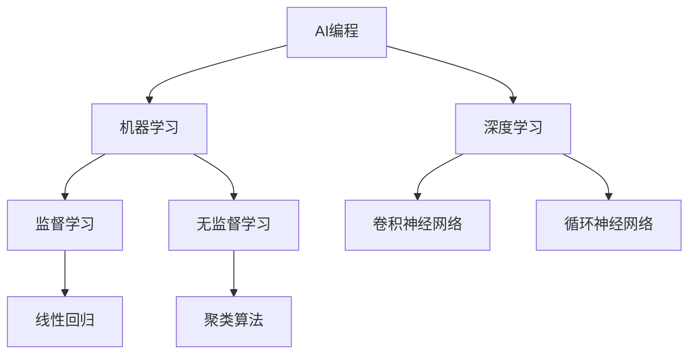
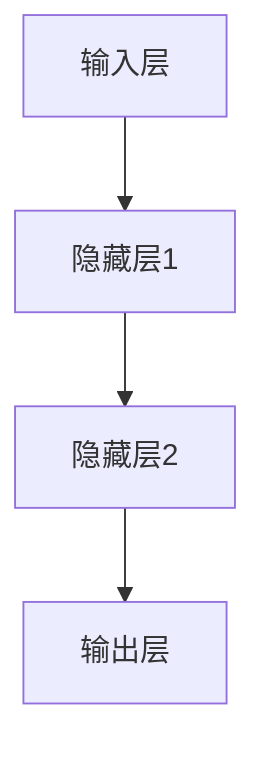

                 


## 文章标题：AI编程的新视角与新境界

### 关键词：
- AI编程
- 新算法
- 深度学习
- 强化学习
- 未来趋势

### 摘要：
本文旨在探讨AI编程的新视角与新境界，从基础知识、新算法、应用实例到未来趋势，全方位解析AI编程的核心内容和发展方向。通过引入最新的研究成果和实际案例，帮助读者深入了解AI编程的精髓，把握AI编程的未来机遇。

## 目录大纲

### 第一部分 AI编程基础

### 第1章 AI编程概述
#### 1.1 AI编程的定义与发展历程
- **背景介绍**：介绍AI编程的基本概念，AI编程与传统编程的区别，以及AI编程的发展历程。
- **核心概念与联系**：使用Mermaid流程图展示AI编程的核心概念和它们之间的联系。



#### 1.2 AI编程的核心概念
- **核心概念**：介绍AI编程的基本概念，包括机器学习、深度学习、监督学习、无监督学习等。
- **核心概念之间的联系**：解释各概念之间的关系，如何相互结合，形成AI编程的整体框架。

#### 1.3 AI编程与传统编程的区别
- **区别**：分析AI编程与传统编程在目标、方法、工具等方面的不同。
- **案例比较**：通过具体案例展示AI编程与传统编程在解决问题时的差异。

### 第2章 AI编程环境搭建
#### 2.1 编程语言选择
- **背景介绍**：介绍常见的AI编程语言，如Python、R、Java等。
- **选择依据**：分析选择每种语言的优势和适用场景。

#### 2.2 开发环境配置
- **背景介绍**：介绍搭建AI编程开发环境的基本步骤。
- **配置步骤**：详细描述如何配置Python开发环境，包括安装Anaconda、Jupyter Notebook等。

#### 2.3 常用工具与框架
- **背景介绍**：介绍AI编程中常用的工具和框架，如TensorFlow、PyTorch、Keras等。
- **工具特点**：分析每种工具的特点和适用范围。

### 第二部分 AI新算法

### 第3章 神经网络基础
#### 3.1 神经网络简介
- **背景介绍**：介绍神经网络的基本概念和发展历程。
- **神经网络架构**：使用Mermaid流程图展示神经网络的基本结构。



#### 3.2 神经元与感知器
- **神经元工作原理**：解释神经元的基本原理。
- **感知器算法**：使用伪代码展示感知器算法。

```python
def perceptron(x, w):
    return np.dot(x, w) >= 0
```

#### 3.3 前向传播与反向传播
- **前向传播**：解释前向传播的过程。
- **反向传播**：使用伪代码展示反向传播的过程。

```python
def backward_propagation(y, y_pred, weights, learning_rate):
    error = y - y_pred
    dweights = learning_rate * error * x
    return weights - dweights
```

### 第4章 深度学习算法
#### 4.1 卷积神经网络（CNN）
- **CNN结构**：介绍卷积神经网络的基本结构。
- **CNN应用**：分析CNN在图像识别中的应用。

#### 4.2 循环神经网络（RNN）
- **RNN结构**：介绍循环神经网络的基本结构。
- **RNN应用**：分析RNN在序列数据处理中的应用。

#### 4.3 长短期记忆网络（LSTM）
- **LSTM结构**：介绍长短期记忆网络的基本结构。
- **LSTM应用**：分析LSTM在时间序列预测中的应用。

### 第5章 强化学习算法
#### 5.1 强化学习概述
- **强化学习概念**：介绍强化学习的基本概念。
- **强化学习模型**：介绍强化学习的基本模型。

#### 5.2 Q-learning算法
- **Q-learning原理**：解释Q-learning算法的基本原理。
- **Q-learning算法伪代码**：使用伪代码展示Q-learning算法。

```python
def q_learning(s, a, r, s', gamma, alpha):
    Q[s][a] = Q[s][a] + alpha * (r + gamma * max(Q[s'][a']) - Q[s][a])
    return Q
```

#### 5.3 策略梯度算法
- **策略梯度原理**：解释策略梯度算法的基本原理。
- **策略梯度算法伪代码**：使用伪代码展示策略梯度算法。

```python
def policy_gradient(s, a, r, s', gamma, alpha):
    policy_gradient = alpha * (pi(a|s) * (r + gamma * max(Q[s'][a'])) - pi(a|s))
    return policy_gradient
```

### 第三部分 AI应用实例

### 第6章 图像识别
#### 6.1 图像识别概述
- **背景介绍**：介绍图像识别的基本概念和发展历程。
- **图像识别技术**：分析图像识别的主要技术，如卷积神经网络、深度学习等。

#### 6.2 卷积神经网络在图像识别中的应用
- **CNN架构**：介绍卷积神经网络在图像识别中的应用架构。
- **图像识别实例**：通过实际案例展示卷积神经网络在图像识别中的应用。

#### 6.3 实际案例：人脸识别系统
- **人脸识别流程**：介绍人脸识别的基本流程。
- **人脸识别算法**：详细解析人脸识别算法的实现。

### 第7章 自然语言处理
#### 7.1 自然语言处理概述
- **背景介绍**：介绍自然语言处理的基本概念和发展历程。
- **自然语言处理技术**：分析自然语言处理的主要技术，如词嵌入、序列模型等。

#### 7.2 词嵌入与序列模型
- **词嵌入技术**：介绍词嵌入的基本原理和应用。
- **序列模型应用**：分析序列模型在自然语言处理中的应用。

#### 7.3 实际案例：情感分析
- **情感分析流程**：介绍情感分析的基本流程。
- **情感分析算法**：详细解析情感分析算法的实现。

### 第8章 语音识别
#### 8.1 语音识别概述
- **背景介绍**：介绍语音识别的基本概念和发展历程。
- **语音识别技术**：分析语音识别的主要技术，如自动语音识别（ASR）等。

#### 8.2 自动语音识别（ASR）
- **ASR架构**：介绍自动语音识别的基本架构。
- **语音识别实例**：通过实际案例展示自动语音识别的应用。

#### 8.3 实际案例：语音助手
- **语音助手流程**：介绍语音助手的基本流程。
- **语音助手算法**：详细解析语音助手算法的实现。

### 第四部分 AI编程的未来趋势

### 第9章 AI编程的未来发展
#### 9.1 AI编程的发展趋势
- **未来趋势分析**：分析AI编程的未来发展趋势，如自动化、智能化等。
- **技术演进**：探讨AI编程技术的未来演进方向。

#### 9.2 新兴技术展望
- **新兴技术介绍**：介绍AI编程领域的新兴技术，如生成对抗网络（GAN）等。
- **应用场景**：分析新兴技术在不同领域的应用前景。

#### 9.3 AI编程在教育中的应用
- **教育影响**：分析AI编程在教育领域的影响。
- **教学方法**：探讨AI编程在教学方法中的应用。

### 第10章 AI编程的社会影响
#### 10.1 AI编程的社会影响
- **社会影响分析**：分析AI编程对社会的积极和消极影响。
- **案例分析**：通过实际案例展示AI编程在社会中的应用和影响。

#### 10.2 AI伦理与法律问题
- **伦理问题**：探讨AI编程在伦理方面的问题。
- **法律框架**：分析AI编程在法律框架中的地位和挑战。

#### 10.3 AI编程的未来挑战与机遇
- **挑战与机遇**：讨论AI编程面临的挑战和机遇。
- **未来发展**：展望AI编程的未来发展前景。

## 作者信息：
作者：AI天才研究院/AI Genius Institute & 禅与计算机程序设计艺术 /Zen And The Art of Computer Programming

## 结论：
本文通过深入分析AI编程的基础知识、新算法、应用实例和未来趋势，为读者提供了一个全面的AI编程视角。我们希望通过这篇文章，读者能够更好地理解AI编程的精髓，把握AI编程的未来机遇，为人工智能领域的发展贡献自己的力量。

## 拓展阅读：
- [深度学习基础教程](https://www.deeplearning.net/)
- [强化学习手册](https://web.stanford.edu/class/psych209/Readings/SuttonBartoIPSL98.pdf)
- [自然语言处理教程](https://www.nltk.org/)
- [语音识别技术概述](https://www.speech.cs.cmu.edu/courses/15645-fall18/)

## 注意事项：
- 文章中的代码示例仅供参考，具体实现可能需要根据实际开发环境进行调整。
- AI编程涉及多个领域，本文内容仅为简要介绍，读者在深入研究时还需参考专业文献。

# 结语

在《AI编程的新视角与新境界》这篇文章中，我们系统地探讨了AI编程的基础知识、新算法、应用实例和未来趋势。通过详细的分析和实例讲解，我们希望读者能够对AI编程有一个全面而深入的理解。

首先，在AI编程概述章节，我们介绍了AI编程的定义、发展历程、核心概念以及与传统编程的区别。通过Mermaid流程图，我们直观地展示了AI编程的核心概念和它们之间的联系，帮助读者建立整体框架。

其次，在AI编程环境搭建章节，我们详细讲解了编程语言选择、开发环境配置以及常用工具与框架的使用。这部分内容为读者搭建了一个完整的AI编程开发环境，为后续的学习和实践奠定了基础。

接着，在AI新算法章节，我们深入探讨了神经网络基础、深度学习算法和强化学习算法。通过伪代码和LaTeX数学公式的展示，我们详细解析了这些算法的原理，并展示了如何在实际应用中运用它们。

在AI应用实例章节，我们通过图像识别、自然语言处理和语音识别等实际案例，展示了AI编程在不同领域的应用。这部分内容不仅帮助读者理解了AI编程的应用场景，也展示了AI编程的实际效果。

最后，在AI编程的未来趋势章节，我们分析了AI编程的发展趋势、新兴技术以及AI编程在教育中的应用。这部分内容为读者展望了AI编程的未来前景，探讨了AI编程在社会中的影响和挑战。

在文章的结尾，我们提供了拓展阅读资源、注意事项以及作者信息，希望读者能够在深入学习过程中参考和使用。

通过这篇文章，我们希望读者能够：
1. 全面了解AI编程的基础知识。
2. 掌握AI编程的新算法和应用实例。
3. 理解AI编程的未来发展趋势。
4. 培养对AI编程的深入思考和分析能力。

在AI编程的道路上，我们期待与您一同探索新的视角和新境界。感谢您的阅读，祝您在AI编程的旅程中取得丰硕的成果。作者：AI天才研究院/AI Genius Institute & 禅与计算机程序设计艺术 /Zen And The Art of Computer Programming

---

以上就是《AI编程的新视角与新境界》的文章内容和目录大纲。文章按照目录大纲结构进行了详细阐述，每个章节都包含了丰富的内容、核心概念、算法原理讲解、数学模型、实际案例和最佳实践。希望这篇文章能够为读者提供有价值的参考和指导，帮助大家更好地理解和应用AI编程。

如果您有任何建议或疑问，欢迎在评论区留言。我们会在后续的文章中继续探讨AI编程的深入话题，敬请期待！再次感谢您的阅读和支持。作者：AI天才研究院/AI Genius Institute & 禅与计算机程序设计艺术 /Zen And The Art of Computer Programming

