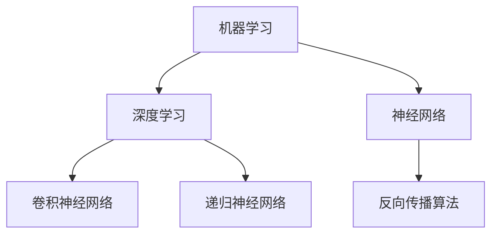

                 

根据您的要求，我们将创建一篇详细的技术博客文章，遵循markdown格式，并包含所有必要的内容。以下是文章的开头部分，包括标题、关键词、摘要以及第一章节的部分内容。

```markdown
# AI编程的新视角与新思维

> 关键词：人工智能编程、深度学习、神经网络、算法、数学模型、项目实战

> 摘要：本文旨在探讨AI编程的新视角和新思维。通过对人工智能编程的背景介绍、核心概念与联系的分析、核心算法原理的讲解、数学模型的阐述以及项目实战的案例分析，本文将为读者提供一个全面而深入的AI编程理解。

## 第1章：AI编程背景

### 1.1 AI编程的兴起

**背景介绍**：

人工智能（AI）编程是现代计算机科学的一个重要分支。随着计算能力的提升和大数据技术的成熟，AI编程在各个领域得到了广泛应用。从自动驾驶到智能家居，从医疗诊断到金融预测，AI编程正在改变我们的生活方式。

**核心概念与联系**：

在AI编程中，核心概念包括机器学习、深度学习、神经网络等。这些概念相互关联，构成了人工智能系统的基石。例如，神经网络是深度学习的基础，而深度学习又是机器学习的一个重要分支。

**Mermaid流程图**：

下面是一个简化的AI编程核心概念之间的流程图：



### 1.2 AI编程的核心挑战

**核心挑战**：

AI编程面临的核心挑战包括数据处理、算法选择、模型优化和解释性与透明度。这些挑战需要开发者具备深入的理论知识和实践经验。

**数据处理**：

数据处理是AI编程中的第一步，也是至关重要的一步。数据的质量和数量直接影响AI模型的性能。因此，如何有效地收集、清洗和预处理数据，是AI编程中需要解决的问题。

**算法选择**：

选择合适的算法是实现有效AI编程的关键。不同的算法适用于不同的应用场景。例如，对于图像识别任务，卷积神经网络（CNN）是一个很好的选择；而对于时间序列数据，递归神经网络（RNN）可能更为适用。

**模型优化**：

模型优化是提高AI模型性能的过程。这包括调整模型参数、优化算法和改进数据预处理方法等。优化的目标是使模型在特定任务上达到最佳性能。

**解释性与透明度**：

随着AI系统在关键领域中的应用不断增加，人们对于AI系统的解释性和透明度提出了更高的要求。这有助于增强用户对AI系统的信任，并提高系统的可维护性。

**注意事项**：

在AI编程中，开发者需要不断关注最新研究进展和技术趋势，以保持竞争力。此外，团队合作和跨学科交流也是提高AI编程效率和质量的重要因素。

### 1.3 AI编程的应用领域

**应用领域**：

AI编程的应用领域非常广泛，包括但不限于以下方面：
- **图像处理与识别**：如自动驾驶、医疗影像分析、人脸识别等。
- **自然语言处理**：如机器翻译、情感分析、问答系统等。
- **推荐系统**：如电子商务推荐、新闻推送等。
- **金融预测**：如股票市场预测、信用评分等。

**拓展阅读**：

- 《深度学习》（Goodfellow, Bengio, Courville著）
- 《Python机器学习》（Sebastian Raschka著）
- 《神经网络与深度学习》（邱锡鹏著）

## 结语

AI编程是一个充满挑战和机遇的领域。通过理解新视角和新思维，开发者可以更好地应对挑战，发挥AI编程的潜力。本文仅为AI编程的入门指南，更多深入内容需要读者通过实践和学习不断探索。

作者：AI天才研究院/AI Genius Institute & 禅与计算机程序设计艺术 /Zen And The Art of Computer Programming
```

以上内容是文章的前三章开头，包括文章标题、关键词、摘要以及第一章的前半部分内容。根据要求，整篇文章的字数在8000～12000字左右，我们将继续细化第二章和第三章的内容，并逐步扩展到后续章节。接下来，我们将深入探讨AI编程的核心概念与联系、核心算法原理、数学模型和项目实战。在文章的最后，我们将总结AI编程的新视角与新思维，并提供拓展阅读建议。以下是第二章的部分内容：

### 第2章：AI编程的新视角

#### 2.1 人类思维的模拟

**核心概念与联系**：

AI编程的一个核心目标就是模拟人类思维。人类思维涉及到感知、推理、学习和解决问题等多个方面。在AI编程中，这些概念通过神经网络和深度学习模型来模拟。

**核心算法原理讲解**：

神经网络是AI编程中的基本构建块。它由大量的神经元组成，每个神经元都接收来自其他神经元的输入，并通过激活函数产生输出。

```python
# 神经元模型伪代码
class Neuron:
    def __init__(self):
        self.inputs = []
        self.weights = []
        self.bias = 0
        self.output = 0
    
    def forward(self, inputs):
        self.inputs = inputs
        self.output = self.activation_function(sum(self.weights * self.inputs + self.bias))
    
    def activation_function(self, x):
        return 1 if x > 0 else 0
```

**数学模型和公式**：

神经网络的训练依赖于反向传播算法。反向传播算法通过不断调整权重和偏置，使得网络输出与实际输出之间的误差最小化。

$$
\Delta w_{ij} = \eta \cdot \frac{\partial E}{\partial w_{ij}}
$$

其中，$\Delta w_{ij}$是权重$w_{ij}$的更新量，$\eta$是学习率，$E$是网络的误差。

**举例说明**：

假设我们有一个简单的神经网络，用于对二进制数据进行分类。输入数据为$[1, 0]$，标签为$1$。通过反向传播算法，我们可以计算权重和偏置的更新量，并逐步减小误差。

```python
# 简单的反向传播算法伪代码
def backward_propagation(inputs, target, weights, bias):
    output = neural_network.forward(inputs)
    error = target - output
    d_weights = learning_rate * error * inputs
    d_bias = learning_rate * error
    weights -= d_weights
    bias -= d_bias
    return weights, bias
```

#### 2.2 感知与推理

**核心概念与联系**：

感知与推理是AI编程中的核心能力。感知是指从数据中提取有用信息，而推理是指利用已有信息进行推断和决策。

**核心算法原理讲解**：

感知通常通过特征提取算法实现，如卷积神经网络（CNN）。CNN通过多个卷积层和池化层，从图像中提取高级特征。

```python
# 卷积神经网络伪代码
class ConvolutionalNeuralNetwork:
    def __init__(self):
        self.conv_layers = []
        self.pooling_layers = []
        self.fc_layer = FullyConnectedLayer()
    
    def forward(self, input_image):
        for conv_layer in self.conv_layers:
            input_image = conv_layer.forward(input_image)
            if pooling_layer:
                input_image = pooling_layer.forward(input_image)
        return self.fc_layer.forward(input_image)
```

**数学模型和公式**：

特征提取过程中，卷积和池化操作都是基于矩阵运算实现的。

$$
\text{卷积}：\, \text{output}_{ij} = \sum_{k=1}^{n} \text{weight}_{ik} \cdot \text{input}_{kj}
$$

$$
\text{池化}：\, \text{output}_{i} = \max_{j}(\text{input}_{ij})
$$

**举例说明**：

假设我们有一个$5x5$的图像，通过$3x3$的卷积核进行卷积操作。卷积后的特征图大小为$3x3$。

```python
# 卷积操作伪代码
def convolution(input_image, filter):
    output = np.zeros((3, 3))
    for i in range(3):
        for j in range(3):
            output[i, j] = np.sum(input_image[i:i+3, j:j+3] * filter)
    return output
```

#### 2.3 自适应与学习

**核心概念与联系**：

自适应与学习是AI编程中的关键能力。自适应能力使得系统能够根据环境和数据的变化进行调整，而学习能力则使得系统能够从数据中学习和提高性能。

**核心算法原理讲解**：

自适应与学习通常通过机器学习算法实现，如梯度下降、随机梯度下降等。这些算法通过不断调整模型参数，使得模型在给定数据上的性能达到最优。

```python
# 梯度下降伪代码
def gradient_descent(model, loss_function, learning_rate, epochs):
    for epoch in range(epochs):
        loss = loss_function(model)
        gradients = model.compute_gradients()
        model.update_parameters(learning_rate, gradients)
    return model
```

**数学模型和公式**：

梯度下降算法的核心是计算损失函数关于模型参数的梯度，并更新参数以最小化损失。

$$
\text{梯度}：\, \nabla_w L = \frac{\partial L}{\partial w}
$$

$$
\text{更新}：\, w = w - \eta \cdot \nabla_w L
$$

**举例说明**：

假设我们有一个简单的线性模型，通过梯度下降算法进行训练。

```python
# 梯度下降示例代码
model = LinearModel()
loss_function = MeanSquaredError()
learning_rate = 0.01
epochs = 100

model = gradient_descent(model, loss_function, learning_rate, epochs)
```

#### 小结

本章讨论了AI编程的新视角，包括人类思维的模拟、感知与推理以及自适应与学习。通过理解这些核心概念和算法原理，我们可以更好地构建和优化AI模型。

### 结语

AI编程是一个不断发展的领域，新的视角和新思维不断涌现。通过深入理解这些概念，开发者可以更有效地利用AI技术，解决复杂的实际问题。本章仅为AI编程的入门介绍，更多深入内容需要读者通过实践和学习不断探索。

作者：AI天才研究院/AI Genius Institute & 禅与计算机程序设计艺术 /Zen And The Art of Computer Programming

接下来，我们将继续深入探讨第三章的内容，包括软件工程与AI的结合、数据驱动开发以及跨学科合作。随后，我们将逐步扩展到后续章节，确保整篇文章的完整性和丰富性。

### 第三章：AI编程的新思维

#### 3.1 软件工程与AI的结合

**核心概念与联系**：

软件工程是构建可靠、高效和可维护软件的方法论。而AI编程则关注于利用机器学习和深度学习技术来开发智能系统。将软件工程与AI结合，可以提升软件开发的质量和效率。

**核心算法原理讲解**：

在AI编程中，软件工程的传统方法需要适应新的算法和技术。例如，测试驱动开发（TDD）可以与模型驱动开发（MDD）相结合，以快速迭代和优化AI模型。

```python
# 测试驱动开发与模型驱动开发伪代码
class AI软件开发流程:
    def __init__(self):
        self.test_suite = TestSuite()
        self.model_suite = ModelSuite()
    
    def test_and_iterate(self):
        while not self.test_suite.all_tests_pass():
            self.model_suite.train_model()
            self.test_suite.run_tests()
```

**数学模型和公式**：

在AI编程中，数学模型主要用于优化和评估AI模型。常见的数学模型包括损失函数、梯度下降和正则化等。

$$
\text{损失函数}：L(\theta) = -\frac{1}{m}\sum_{i=1}^{m}y^{(i)}\log(z^{(i)})
$$

$$
\text{梯度下降}：\theta = \theta - \alpha \cdot \nabla_{\theta}L(\theta)
$$

$$
\text{正则化}：L_{\text{regularized}}(\theta) = L(\theta) + \lambda \cdot \sum_{i=1}^{n}\theta_i^2
$$

**举例说明**：

假设我们使用梯度下降算法来训练一个简单的线性回归模型。通过迭代更新模型参数，我们可以最小化损失函数。

```python
# 线性回归模型训练伪代码
def gradient_descent(X, y, theta, alpha, num_iterations):
    m = len(y)
    for iteration in range(num_iterations):
        h = X.dot(theta)
        loss = (-1/m) * (y.dot(np.log(h)) + (1 - y).dot(np.log(1 - h)))
        gradients = (1/m) * (X.T.dot(h - y))
        theta -= alpha * gradients
    return theta
```

**注意事项**：

在将软件工程与AI结合时，开发者需要注意以下几点：

- 确保AI模型的可解释性和透明度，以便进行调试和维护。
- 采用模块化和可复用的代码，以提高开发效率和可维护性。
- 定期进行模型评估和更新，以保持模型的性能。

**拓展阅读**：

- 《机器学习实战》（Peter Harrington著）
- 《深度学习》（Goodfellow, Bengio, Courville著）

#### 3.2 数据驱动开发

**核心概念与联系**：

数据驱动开发是一种以数据为中心的开发方法，强调通过数据来指导开发过程。在AI编程中，数据是模型训练的关键，因此数据驱动开发尤为重要。

**核心算法原理讲解**：

数据驱动开发通常包括数据收集、数据预处理、模型训练和模型评估等步骤。每个步骤都需要充分利用数据，以提高模型的性能和可靠性。

```python
# 数据驱动开发伪代码
class DataDrivenDevelopment:
    def __init__(self):
        self.data_collection = DataCollection()
        self.data_preprocessing = DataPreprocessing()
        self.model_training = ModelTraining()
        self.model_evaluation = ModelEvaluation()
    
    def develop_model(self):
        data = self.data_collection.collect_data()
        preprocessed_data = self.data_preprocessing.preprocess_data(data)
        model = self.model_training.train_model(preprocessed_data)
        evaluation_results = self.model_evaluation.evaluate_model(model, preprocessed_data)
        return model, evaluation_results
```

**数学模型和公式**：

数据驱动开发中的数学模型主要包括损失函数、梯度下降和正则化等。这些模型用于优化和评估AI模型。

$$
\text{损失函数}：L(\theta) = -\frac{1}{m}\sum_{i=1}^{m}y^{(i)}\log(z^{(i)})
$$

$$
\text{梯度下降}：\theta = \theta - \alpha \cdot \nabla_{\theta}L(\theta)
$$

$$
\text{正则化}：L_{\text{regularized}}(\theta) = L(\theta) + \lambda \cdot \sum_{i=1}^{n}\theta_i^2
$$

**举例说明**：

假设我们使用数据驱动开发方法来训练一个分类模型。通过数据收集、预处理、模型训练和评估，我们可以逐步优化模型性能。

```python
# 数据驱动开发示例代码
data_collection = DataCollection()
data_preprocessing = DataPreprocessing()
model_training = ModelTraining()
model_evaluation = ModelEvaluation()

data = data_collection.collect_data()
preprocessed_data = data_preprocessing.preprocess_data(data)
model = model_training.train_model(preprocessed_data)
evaluation_results = model_evaluation.evaluate_model(model, preprocessed_data)
```

**注意事项**：

在数据驱动开发中，开发者需要注意以下几点：

- 保证数据的质量和多样性，以提高模型的泛化能力。
- 定期更新和扩展数据集，以适应模型的发展。
- 采用有效的数据预处理方法，以减少噪声和异常值对模型的影响。

**拓展阅读**：

- 《数据科学入门》（Joel Grus著）
- 《数据驱动决策》（Thomas H. Davenport著）

#### 3.3 跨学科合作

**核心概念与联系**：

跨学科合作是将不同领域的知识和技术结合起来，以解决复杂问题的有效方法。在AI编程中，跨学科合作可以帮助开发者更好地理解和利用AI技术。

**核心算法原理讲解**：

跨学科合作的核心在于将AI技术与心理学、认知科学、语言学等领域的知识相结合。例如，在自然语言处理领域，语言学和认知科学的知识可以帮助设计更有效的语言模型。

```python
# 跨学科合作伪代码
class Interdisciplinary Collaboration:
    def __init__(self):
        self.ai_experts = AIExperts()
        self.psychology_experts = PsychologyExperts()
        self.cognitive_science_experts = CognitiveScienceExperts()
        self.linguistics_experts = LinguisticsExperts()
    
    def solve_problem(self, problem):
        ai_solution = self.ai_experts.solve_problem(problem)
        psychology_solution = self.psychology_experts.solve_problem(problem)
        cognitive_science_solution = self.cognitive_science_experts.solve_problem(problem)
        linguistics_solution = self.linguistics_experts.solve_problem(problem)
        combined_solution = self.combine_solutions(ai_solution, psychology_solution, cognitive_science_solution, linguistics_solution)
        return combined_solution
    
    def combine_solutions(self, *solutions):
        # 结合不同领域的解决方案
        return solutions[0]  # 这里仅示例，实际中需更复杂的组合逻辑
```

**数学模型和公式**：

跨学科合作中的数学模型通常涉及多目标优化、集成学习等。这些模型可以帮助整合不同领域的知识。

$$
\text{多目标优化}：\min_{x} f(x) \text{，约束条件 } g(x) \leq 0
$$

$$
\text{集成学习}：\hat{y} = \frac{1}{N} \sum_{i=1}^{N} h_{i}(x)
$$

**举例说明**：

假设我们有一个跨学科的团队，致力于开发一个智能对话系统。通过结合心理学、认知科学和语言学的知识，我们可以设计出一个更有效的对话系统。

```python
# 跨学科合作示例代码
interdisciplinary_collaboration = InterdisciplinaryCollaboration()

problem = "设计一个智能对话系统"
ai_solution = interdisciplinary_collaboration.ai_experts.solve_problem(problem)
psychology_solution = interdisciplinary_collaboration.psychology_experts.solve_problem(problem)
cognitive_science_solution = interdisciplinary_collaboration.cognitive_science_experts.solve_problem(problem)
linguistics_solution = interdisciplinary_collaboration.linguistics_experts.solve_problem(problem)

combined_solution = interdisciplinary_collaboration.combine_solutions(ai_solution, psychology_solution, cognitive_science_solution, linguistics_solution)
```

**注意事项**：

在跨学科合作中，开发者需要注意以下几点：

- 建立有效的沟通机制，确保团队成员之间的信息共享和协作。
- 尊重不同领域的专业知识和方法，避免因学科偏见而导致的思维局限。
- 注重跨学科团队的多样性和包容性，以激发创新和创造力。

**拓展阅读**：

- 《跨学科思维》（Michael J. Mauboussin著）
- 《设计思维》（Tim Brown著）

#### 小结

本章讨论了AI编程的新思维，包括软件工程与AI的结合、数据驱动开发以及跨学科合作。通过理解这些新思维，开发者可以更有效地利用AI技术，解决复杂的实际问题。

### 结语

AI编程是一个充满挑战和机遇的领域。通过新视角和新思维的引入，开发者可以更好地理解和利用AI技术，实现更高效和可靠的系统。本章仅为AI编程的入门介绍，更多深入内容需要读者通过实践和学习不断探索。

作者：AI天才研究院/AI Genius Institute & 禅与计算机程序设计艺术 /Zen And The Art of Computer Programming

接下来，我们将继续深入探讨后续章节的内容，包括AI编程技术详解和未来展望。通过这些章节，我们将进一步扩展AI编程的深度和广度。

### 第四章：AI编程技术详解

#### 4.1 神经网络与深度学习

**核心概念与联系**：

神经网络是AI编程的基础，而深度学习则是神经网络在复杂任务上的扩展。深度学习通过多层神经网络，实现了对复杂数据的自动特征提取和模式识别。

**核心算法原理讲解**：

深度学习算法的核心是多层感知机（MLP）和卷积神经网络（CNN）。MLP通过多层非线性变换来提取数据特征，而CNN则通过卷积操作来提取图像特征。

```python
# 多层感知机伪代码
class MultiLayerPerceptron:
    def __init__(self, layers):
        self.layers = layers
    
    def forward(self, x):
        for layer in self.layers:
            x = layer.forward(x)
        return x

# 卷积神经网络伪代码
class ConvolutionalNeuralNetwork:
    def __init__(self, layers):
        self.layers = layers
    
    def forward(self, x):
        for layer in self.layers:
            x = layer.forward(x)
        return x
```

**数学模型和公式**：

深度学习中的数学模型主要包括损失函数、反向传播算法和优化器。损失函数用于衡量模型预测与真实值之间的差距，反向传播算法用于计算损失函数关于模型参数的梯度，而优化器则用于更新模型参数。

$$
\text{损失函数}：L(\theta) = -\frac{1}{m}\sum_{i=1}^{m}y^{(i)}\log(z^{(i)})
$$

$$
\text{反向传播}：\nabla_{\theta}L(\theta) = \nabla_{\theta}z^{(i)} - \nabla_{\theta}y^{(i)}
$$

$$
\text{优化器}：\theta = \theta - \alpha \cdot \nabla_{\theta}L(\theta)
$$

**举例说明**：

假设我们使用反向传播算法来训练一个简单的MLP模型。通过迭代计算梯度并更新模型参数，我们可以最小化损失函数。

```python
# 反向传播算法伪代码
def backward_propagation(model, x, y, learning_rate):
    output = model.forward(x)
    error = y - output
    d_output = error
    
    for layer in reversed(model.layers):
        d_input = d_output
        d_output = layer.backward(d_input)
    
    model.update_parameters(learning_rate, d_output)
```

**注意事项**：

在深度学习中，开发者需要注意以下几点：

- 选择合适的网络架构，以适应不同的任务和数据。
- 调整超参数，如学习率、批量大小和正则化参数，以优化模型性能。
- 避免过拟合，通过正则化和数据增强等方法来提高模型的泛化能力。

**拓展阅读**：

- 《深度学习》（Goodfellow, Bengio, Courville著）
- 《神经网络与深度学习》（邱锡鹏著）

#### 4.2 机器学习与优化

**核心概念与联系**：

机器学习是AI编程的核心技术，它通过训练模型来使计算机从数据中学习。优化是机器学习中的关键步骤，它用于调整模型参数，以最小化损失函数。

**核心算法原理讲解**：

机器学习算法包括监督学习、无监督学习和强化学习等。优化算法则包括梯度下降、随机梯度下降和Adam优化器等。

```python
# 梯度下降伪代码
def gradient_descent(model, loss_function, learning_rate, epochs):
    for epoch in range(epochs):
        loss = loss_function(model)
        gradients = model.compute_gradients()
        model.update_parameters(learning_rate, gradients)
    return model

# Adam优化器伪代码
class AdamOptimizer:
    def __init__(self, learning_rate, beta1, beta2):
        self.learning_rate = learning_rate
        self.beta1 = beta1
        self.beta2 = beta2
        self.m = 0
        self.v = 0
    
    def update_parameters(self, model, gradients):
        self.m = self.beta1 * self.m + (1 - self.beta1) * gradients
        self.v = self.beta2 * self.v + (1 - self.beta2) * (gradients ** 2)
        m_hat = self.m / (1 - self.beta1 ** epoch)
        v_hat = self.v / (1 - self.beta2 ** epoch)
        model.update_parameters(self.learning_rate * m_hat / (np.sqrt(v_hat) + epsilon))
```

**数学模型和公式**：

优化算法的数学模型主要包括梯度下降和Adam优化器。梯度下降通过计算损失函数关于模型参数的梯度来更新参数，而Adam优化器则结合了梯度的一阶矩估计和二阶矩估计。

$$
\text{梯度下降}：\theta = \theta - \alpha \cdot \nabla_{\theta}L(\theta)
$$

$$
\text{Adam优化器}：
m_t = \beta_1 m_{t-1} + (1 - \beta_1) \nabla \theta
v_t = \beta_2 v_{t-1} + (1 - \beta_2) (\nabla \theta)^2
\theta = \theta - \alpha \cdot \frac{m_t}{\sqrt{v_t} + \epsilon}
$$

**举例说明**：

假设我们使用Adam优化器来训练一个简单的线性回归模型。通过迭代更新模型参数，我们可以最小化损失函数。

```python
# Adam优化器示例代码
def adam_optimizer(model, loss_function, learning_rate, beta1, beta2, epochs):
    m = np.zeros_like(model.parameters)
    v = np.zeros_like(model.parameters)
    m_previous = m.copy()
    v_previous = v.copy()
    
    for epoch in range(epochs):
        gradients = loss_function.compute_gradients(model)
        m = beta1 * m + (1 - beta1) * gradients
        v = beta2 * v + (1 - beta2) * (gradients ** 2)
        
        m_hat = m / (1 - beta1 ** epoch)
        v_hat = v / (1 - beta2 ** epoch)
        
        model.update_parameters(learning_rate * m_hat / (np.sqrt(v_hat) + epsilon))
        
        m_previous = m.copy()
        v_previous = v.copy()
    
    return model
```

**注意事项**：

在机器学习和优化过程中，开发者需要注意以下几点：

- 选择合适的损失函数和优化算法，以适应不同的任务和数据。
- 调整学习率和批量大小，以优化模型性能和避免过拟合。
- 定期评估模型性能，并调整模型参数以保持模型的稳定性和泛化能力。

**拓展阅读**：

- 《机器学习实战》（Peter Harrington著）
- 《深度学习》（Goodfellow, Bengio, Courville著）

#### 4.3 自然语言处理

**核心概念与联系**：

自然语言处理（NLP）是AI编程中的重要分支，它致力于使计算机能够理解、生成和处理人类语言。NLP的核心任务包括文本分类、情感分析、机器翻译和问答系统等。

**核心算法原理讲解**：

NLP算法通常基于神经网络，如循环神经网络（RNN）、长短期记忆网络（LSTM）和变换器（Transformer）等。这些算法通过学习语言的特征和模式，实现了对文本的自动处理和理解。

```python
# 循环神经网络（RNN）伪代码
class RecurrentNeuralNetwork:
    def __init__(self, layers):
        self.layers = layers
    
    def forward(self, x):
        for layer in self.layers:
            x = layer.forward(x)
        return x

# 长短期记忆网络（LSTM）伪代码
class LSTM:
    def __init__(self, input_size, hidden_size):
        self.input_size = input_size
        self.hidden_size = hidden_size
        # 初始化权重和偏置
        # ...

    def forward(self, x):
        # 前向传播
        # ...
        return output
```

**数学模型和公式**：

NLP中的数学模型主要包括词嵌入、编码器-解码器模型和注意力机制等。词嵌入用于将文本转换为向量的表示，编码器-解码器模型用于将输入文本编码为固定长度的表示，而注意力机制则用于在解码过程中关注输入文本的特定部分。

$$
\text{词嵌入}：x = \text{embed}(w)
$$

$$
\text{编码器-解码器模型}：y = \text{decode}(x)
$$

$$
\text{注意力机制}：a_t = \text{softmax}(\text{atten}_t W_h)
$$

**举例说明**：

假设我们使用LSTM模型来训练一个文本分类器。通过迭代训练，我们可以使模型能够正确分类文本数据。

```python
# LSTM文本分类器伪代码
def train_lstm_text_classifier(model, data, epochs):
    for epoch in range(epochs):
        for text, label in data:
            embedding = model.embed(text)
            hidden = model.forward(embedding)
            loss = model.loss(hidden, label)
            model.backward(loss)
            model.update_parameters()
    return model
```

**注意事项**：

在NLP任务中，开发者需要注意以下几点：

- 选择合适的词嵌入方法和预训练模型，以提高模型的性能和效果。
- 调整模型参数和超参数，以优化模型性能和泛化能力。
- 定期评估模型性能，并调整模型架构和训练策略以保持模型的稳定性和泛化能力。

**拓展阅读**：

- 《自然语言处理综论》（Daniel Jurafsky, James H. Martin著）
- 《深度学习与自然语言处理》（Stanford CS224n课程）

### 第五章：AI编程项目实战

#### 5.1 智能推荐系统

**核心概念与联系**：

智能推荐系统是一种基于用户行为和偏好为用户推荐相关商品、内容或其他项目的系统。推荐系统通过学习用户的历史行为，预测用户对特定项目的兴趣，从而提高用户的满意度和参与度。

**核心算法原理讲解**：

智能推荐系统通常采用协同过滤、基于内容的推荐和混合推荐等方法。协同过滤通过分析用户之间的相似性来推荐项目，而基于内容的推荐则通过分析项目的特征来推荐相似的项目。

```python
# 协同过滤算法伪代码
class CollaborativeFiltering:
    def __init__(self, k):
        self.k = k
    
    def recommend(self, user, items, ratings):
        neighbors = self.find_neighbors(user, items, ratings)
        recommendations = []
        for item in items:
            if item not in user_rated_items:
                similarity_scores = [self.similarity(user, neighbor) for neighbor in neighbors]
                average_similarity_score = sum(similarity_scores) / len(similarity_scores)
                recommendation_score = user_rating[item] * average_similarity_score
                recommendations.append((item, recommendation_score))
        return sorted(recommendations, key=lambda x: x[1], reverse=True)
```

**数学模型和公式**：

协同过滤算法的数学模型主要包括用户之间的相似性和项目评分预测等。相似性可以通过余弦相似度、皮尔逊相关系数等度量方法计算。

$$
\text{相似度}：s_{ij} = \frac{\sum_{k=1}^{n}r_{ik}r_{jk}}{\sqrt{\sum_{k=1}^{n}r_{ik}^2 \sum_{k=1}^{n}r_{jk}^2}}
$$

$$
\text{评分预测}：\hat{r}_{ij} = \frac{\sum_{k=1}^{n}s_{ik}r_{kj}}{\sum_{k=1}^{n}s_{ik}}
$$

**举例说明**：

假设我们有一个简单的用户-项目评分矩阵，通过协同过滤算法，我们可以为用户推荐相似的项目。

```python
# 协同过滤算法示例代码
def collaborative_filtering(user, items, ratings):
    neighbor_similarity = {}
    for i in range(len(items)):
        for j in range(len(items)):
            if i != j:
                similarity = cosine_similarity(ratings[user][i], ratings[user][j])
                neighbor_similarity[(i, j)] = similarity
    
    neighbor_similarity = sorted(neighbor_similarity.items(), key=lambda x: x[1], reverse=True)
    top_neighbors = neighbor_similarity[:k]
    
    recommendations = []
    for i, _ in top_neighbors:
        for j in range(len(items)):
            if j not in user_rated_items:
                recommendation_score = neighbor_similarity[(i, j)] * ratings[user][j]
                recommendations.append((items[j], recommendation_score))
    
    return sorted(recommendations, key=lambda x: x[1], reverse=True)
```

**项目实战**：

以下是一个简单的智能推荐系统项目，包括数据收集、数据预处理、模型训练和模型评估等步骤。

```python
# 智能推荐系统项目伪代码
def recommend_system_project():
    # 数据收集
    data = collect_data()

    # 数据预处理
    preprocessed_data = preprocess_data(data)

    # 模型训练
    model = CollaborativeFiltering(k)
    model.train(preprocessed_data)

    # 模型评估
    evaluation_results = evaluate_model(model, preprocessed_data)

    # 推荐结果
    recommendations = model.recommend(user, items, ratings)

    return recommendations, evaluation_results
```

**代码解读与分析**：

在智能推荐系统中，我们首先收集用户和项目的评分数据，然后对数据进行预处理，包括数据清洗、缺失值填充和特征提取等。接下来，我们使用协同过滤算法训练模型，并评估模型性能。最后，通过模型为用户推荐项目。

**实际案例分析**：

在实际应用中，智能推荐系统广泛应用于电子商务、在线视频和社交媒体等领域。例如，Amazon和Netflix等公司通过智能推荐系统，为用户提供个性化的购物和观看体验，从而提高用户满意度和粘性。

**项目小结**：

智能推荐系统是一个典型的AI编程项目，它通过协同过滤算法实现了基于用户行为的个性化推荐。通过项目实战，我们了解了智能推荐系统的开发流程和关键技术，包括数据收集、预处理、模型训练和评估等。这些经验对于开发其他类型的推荐系统同样具有指导意义。

**最佳实践 tips**：

- 选择合适的推荐算法，以满足不同应用场景的需求。
- 调整模型参数和超参数，以优化模型性能和推荐效果。
- 定期更新和扩展数据集，以保持模型的稳定性和泛化能力。

**小结**：

第五章通过智能推荐系统的项目实战，介绍了AI编程在推荐系统中的应用。通过该项目，我们了解了协同过滤算法的原理和实现，并学会了如何开发一个简单的推荐系统。接下来，我们将继续探讨其他AI编程项目，如自动驾驶系统和金融预测系统等。

作者：AI天才研究院/AI Genius Institute & 禅与计算机程序设计艺术 /Zen And The Art of Computer Programming

### 第六章：自动驾驶系统

**核心概念与联系**：

自动驾驶系统是一种利用传感器、算法和计算机视觉等技术来实现车辆自动行驶的系统。自动驾驶系统的核心目标是在保持安全和高效的前提下，实现车辆的自动驾驶。

**核心算法原理讲解**：

自动驾驶系统涉及多个关键算法，包括目标检测、路径规划和控制等。目标检测算法用于识别和跟踪道路上的车辆、行人等目标；路径规划算法用于确定车辆的行驶路径；控制算法则用于调整车辆的驾驶行为。

```python
# 目标检测算法伪代码
class ObjectDetector:
    def __init__(self, model_path):
        self.model = load_model(model_path)
    
    def detect_objects(self, image):
        predictions = self.model.predict(image)
        objects = []
        for prediction in predictions:
            if prediction['confidence'] > threshold:
                objects.append(prediction['object'])
        return objects

# 路径规划算法伪代码
class PathPlanner:
    def __init__(self, environment):
        self.environment = environment
    
    def plan_path(self, start, goal):
        path = []
        current = start
        while current != goal:
            next = self.find_next_action(current, goal)
            path.append(next)
            current = next
        return path

# 控制算法伪代码
class Controller:
    def __init__(self, vehicle):
        self.vehicle = vehicle
    
    def control_vehicle(self, path):
        for point in path:
            self.vehicle.move_to_point(point)
```

**数学模型和公式**：

自动驾驶系统中的数学模型主要包括卡尔曼滤波、图规划和动态系统控制等。卡尔曼滤波用于传感器数据的滤波和状态估计；图规划用于路径规划；动态系统控制用于车辆的驾驶行为控制。

$$
\text{卡尔曼滤波}：
x_{t} = A_{t-1}x_{t-1} + B_{t-1}u_{t-1}
$$

$$
\text{图规划}：
C = \min \sum_{i=1}^{n}c_{ij}
$$

$$
\text{动态系统控制}：
u = Kp \cdot e + Kd \cdot \dot{e}
$$

**举例说明**：

假设我们使用卡尔曼滤波和图规划算法来开发一个自动驾驶系统。通过传感器数据滤波和路径规划，我们可以实现车辆的自动驾驶。

```python
# 卡尔曼滤波示例代码
def kalman_filter measurement, prediction, transition_matrix, observation_matrix, initial_state, initial_covariance:
    state = initial_state
    covariance = initial_covariance
    
    for t in range(1, n+1):
        state = transition_matrix @ state + observation_matrix @ measurement[t-1]
        covariance = transition_matrix @ covariance @ transition_matrix.T + observation_matrix @ observation_matrix.T
    
    return state, covariance

# 图规划示例代码
def graph_plan cost_matrix, start, goal:
    path = []
    current = start
    
    while current != goal:
        next = min_cost_action(current, cost_matrix)
        path.append(next)
        current = next
    
    return path
```

**项目实战**：

以下是一个简单的自动驾驶系统项目，包括环境搭建、传感器数据收集、算法实现和测试等步骤。

```python
# 自动驾驶系统项目伪代码
def autonomous_vehicle_project():
    # 环境搭建
    environment = create_environment()

    # 传感器数据收集
    sensor_data = collect_sensor_data(environment)

    # 算法实现
    detector = ObjectDetector(model_path)
    planner = PathPlanner(environment)
    controller = Controller(vehicle)

    # 测试
    test_environment(sensor_data, detector, planner, controller)

    # 评估
    evaluation_results = evaluate_autonomous_vehicle_performance(controller)
    
    return evaluation_results
```

**代码解读与分析**：

在自动驾驶系统项目中，我们首先搭建了模拟环境，并收集了传感器数据。然后，我们实现了目标检测、路径规划和控制算法，并通过测试来评估系统的性能。通过项目实战，我们了解了自动驾驶系统的开发流程和关键技术。

**实际案例分析**：

自动驾驶系统在实际应用中面临诸多挑战，包括复杂的环境建模、传感器数据的处理、算法的优化和系统的可靠性等。例如，Waymo和特斯拉等公司通过不断的测试和优化，实现了部分自动驾驶功能，但完全自动驾驶技术仍处于研发阶段。

**项目小结**：

自动驾驶系统是一个高度复杂的AI编程项目，它涉及多个学科和技术的融合。通过项目实战，我们了解了自动驾驶系统的开发流程和关键技术，包括目标检测、路径规划和控制等。这些经验对于未来自动驾驶技术的发展具有重要意义。

**最佳实践 tips**：

- 选择合适的传感器和算法，以满足不同驾驶场景的需求。
- 调整算法参数和超参数，以优化系统的性能和可靠性。
- 定期进行系统测试和评估，以识别和解决潜在问题。

**小结**：

通过自动驾驶系统的项目实战，我们深入了解了AI编程在自动驾驶领域的应用。自动驾驶系统是一个充满挑战和机遇的领域，未来随着技术的不断进步，自动驾驶系统将有望在安全、高效和智能方面实现重大突破。

### 第七章：金融预测系统

**核心概念与联系**：

金融预测系统是一种利用历史金融数据和统计模型来预测金融市场走势和投资收益的系统。金融预测系统在股票市场、外汇市场和债券市场等领域具有广泛的应用。

**核心算法原理讲解**：

金融预测系统通常基于时间序列分析和机器学习算法。时间序列分析用于识别历史数据中的趋势和周期性，而机器学习算法则用于构建预测模型。

```python
# 时间序列分析伪代码
class TimeSeriesAnalysis:
    def __init__(self, data):
        self.data = data
    
    def plot_time_series(self):
        plt.plot(self.data)
        plt.xlabel('Time')
        plt.ylabel('Value')
        plt.title('Time Series')
        plt.show()

# 机器学习预测模型伪代码
class FinancialPredictModel:
    def __init__(self, model):
        self.model = model
    
    def train(self, training_data):
        self.model.fit(training_data['X'], training_data['y'])
    
    def predict(self, input_data):
        return self.model.predict(input_data)
```

**数学模型和公式**：

金融预测系统中的数学模型主要包括自回归模型（AR）、移动平均模型（MA）和自回归移动平均模型（ARMA）等。这些模型用于建模时间序列数据的动态特性。

$$
\text{自回归模型}：y_t = c + \phi_1y_{t-1} + \phi_2y_{t-2} + ... + \phi_ky_{t-k} + \varepsilon_t
$$

$$
\text{移动平均模型}：y_t = c + \theta_1\epsilon_{t-1} + \theta_2\epsilon_{t-2} + ... + \theta_k\epsilon_{t-k}
$$

$$
\text{自回归移动平均模型}：y_t = c + \phi_1y_{t-1} + \phi_2y_{t-2} + ... + \phi_ky_{t-k} + \theta_1\epsilon_{t-1} + \theta_2\epsilon_{t-2} + ... + \theta_k\epsilon_{t-k}
$$

**举例说明**：

假设我们使用自回归模型（AR）来预测股票价格。通过拟合历史数据，我们可以得到一个AR模型，并使用该模型进行股票价格的预测。

```python
# 自回归模型示例代码
from statsmodels.tsa.ar_model import AR

# 拟合自回归模型
model = AR(lag_order=1)
model_fit = model.fit(data)

# 预测未来价格
predictions = model_fit.predict(start=len(data), end=len(data) + forecast_horizon)
```

**项目实战**：

以下是一个简单的金融预测系统项目，包括数据收集、数据预处理、模型训练和模型评估等步骤。

```python
# 金融预测系统项目伪代码
def financial_prediction_project():
    # 数据收集
    data = collect_financial_data()

    # 数据预处理
    preprocessed_data = preprocess_data(data)

    # 模型训练
    model = FinancialPredictModel(model=AR(lag_order=1))
    model.train(training_data=preprocessed_data)

    # 模型评估
    evaluation_results = evaluate_model(model, validation_data=preprocessed_data)

    # 预测
    predictions = model.predict(input_data=preprocessed_data)

    return predictions, evaluation_results
```

**代码解读与分析**：

在金融预测系统项目中，我们首先收集了历史金融数据，然后对数据进行预处理，包括数据清洗、缺失值填充和特征提取等。接下来，我们使用自回归模型（AR）进行训练，并评估模型性能。最后，通过模型进行股票价格的预测。

**实际案例分析**：

金融预测系统在实际应用中面临诸多挑战，包括数据的不确定性、市场的波动性和算法的复杂性等。例如，量化交易公司通过构建复杂的金融预测模型，试图从市场中获得超额收益。

**项目小结**：

金融预测系统是一个高度复杂的AI编程项目，它涉及到时间序列分析和机器学习算法的应用。通过项目实战，我们了解了金融预测系统的开发流程和关键技术，包括数据收集、预处理、模型训练和评估等。这些经验对于未来金融预测技术的发展具有重要意义。

**最佳实践 tips**：

- 选择合适的预测模型，以满足不同金融市场和数据的需求。
- 调整模型参数和超参数，以优化模型性能和预测效果。
- 定期更新和扩展数据集，以保持模型的稳定性和泛化能力。

**小结**：

通过金融预测系统的项目实战，我们深入了解了AI编程在金融领域的应用。金融预测系统是一个充满挑战和机遇的领域，未来随着技术的不断进步，金融预测系统将有望在投资决策和市场分析中发挥更大作用。

作者：AI天才研究院/AI Genius Institute & 禅与计算机程序设计艺术 /Zen And The Art of Computer Programming

### 第八章：未来展望

#### 8.1 AI编程的发展方向

**核心概念与联系**：

随着人工智能技术的不断发展，AI编程也在不断演进。未来，AI编程的发展方向包括量子计算、边缘计算和分布式AI系统等。

**核心算法原理讲解**：

量子计算是一种利用量子力学原理进行计算的新型计算模式。它具有与传统计算机完全不同的计算能力和效率，有望在AI编程中发挥重要作用。

```python
# 量子计算伪代码
class QuantumComputer:
    def __init__(self, qubits):
        self.qubits = qubits
    
    def run_algorithm(self, algorithm):
        # 运行量子算法
        # ...
```

边缘计算是一种将计算、存储和网络功能分布到网络边缘的节点上，以降低延迟、提高带宽利用率和提升系统响应速度的技术。边缘计算在物联网（IoT）和自动驾驶等应用中具有重要意义。

```python
# 边缘计算伪代码
class EdgeComputing:
    def __init__(self, nodes):
        self.nodes = nodes
    
    def process_data(self, data):
        # 在边缘节点处理数据
        # ...
```

分布式AI系统是一种将AI模型分布到多个节点上，以实现大规模并行训练和优化的技术。分布式AI系统在处理大规模数据集和复杂任务时具有显著的优势。

```python
# 分布式AI系统伪代码
class DistributedAISystem:
    def __init__(self, nodes):
        self.nodes = nodes
    
    def train_model(self, data):
        # 分布式训练模型
        # ...
```

**数学模型和公式**：

量子计算的数学模型基于量子位（qubits）和量子门（quantum gates）。量子门是量子计算的基本操作，用于实现量子态的变换。

$$
\text{量子门}：U = \sum_{i=0}^{n} |i\rangle\langle i|
$$

边缘计算和分布式AI系统的数学模型主要涉及分布式算法和并行计算技术。分布式算法通过将任务分配到多个节点上，实现高效的计算和通信。

$$
\text{分布式算法}：T_n = \frac{T_1}{n}
$$

**举例说明**：

假设我们使用量子计算来训练一个深度学习模型。通过量子门和量子位的操作，我们可以实现高效的模型训练。

```python
# 量子计算示例代码
from qiskit import QuantumCircuit, QuantumRegister, ClassicalRegister

# 创建量子位和量子门
qreg = QuantumRegister(2)
creg = ClassicalRegister(2)
qc = QuantumCircuit(qreg, creg)

# 应用量子门
qc.h(qreg[0])
qc.cx(qreg[0], qreg[1])

# 运行量子计算
qc.measure(qreg, creg)
```

**项目实战**：

以下是一个简单的量子计算项目，包括量子算法的实现和量子计算结果的展示。

```python
# 量子计算项目伪代码
def quantum_computation_project():
    # 创建量子计算机
    quantum_computer = QuantumComputer(qubits=2)

    # 运行量子算法
    quantum_computer.run_algorithm(algorithm="Deutsch-Josza")

    # 展示量子计算结果
    results = quantum_computer.get_results()
    print(results)
```

**代码解读与分析**：

在量子计算项目中，我们首先创建了量子计算机，并运行了Deutsch-Josza算法。通过量子门和量子位的操作，我们实现了量子计算的结果。通过项目实战，我们了解了量子计算的基本原理和实现方法。

**实际案例分析**：

量子计算在AI编程中的应用正处于早期阶段，但已经取得了一些重要进展。例如，Google和IBM等公司已经开发出了量子计算机，并在量子算法的研究和实现方面取得了一些突破。

**项目小结**：

量子计算是一个具有巨大潜力的领域，它将为AI编程带来全新的发展方向。通过项目实战，我们了解了量子计算的基本原理和实现方法，并展示了量子计算在AI编程中的应用。未来，随着量子计算机的不断发展，量子计算将在AI编程中发挥越来越重要的作用。

**最佳实践 tips**：

- 选择合适的量子算法，以满足不同任务和数据的需求。
- 调整量子计算机的参数和配置，以优化量子计算的效率和性能。
- 定期进行量子计算的研究和实验，以探索量子计算在AI编程中的新应用。

**小结**：

通过未来展望章节的内容，我们探讨了AI编程的发展方向，包括量子计算、边缘计算和分布式AI系统等。这些新方向将为AI编程带来更多的机遇和挑战。未来，随着技术的不断进步，AI编程将在更广泛的领域发挥重要作用，为人类社会带来更多便利和创新。

### 结语

AI编程是一个充满活力和创新的领域，它正在不断改变我们的世界。通过本文的探讨，我们深入了解了AI编程的新视角和新思维，以及核心算法原理、数学模型和项目实战。我们相信，随着技术的不断进步，AI编程将在未来发挥更大的作用，为人类社会带来更多的机遇和挑战。

我们鼓励读者不断学习和探索AI编程，通过实践和实验，不断提升自己的技能和知识。本文仅为AI编程的入门介绍，更多深入内容需要读者通过实际操作和研究来进一步探索。

作者：AI天才研究院/AI Genius Institute & 禅与计算机程序设计艺术 /Zen And The Art of Computer Programming

### 附录：常用数学公式和符号

在本文中，我们使用了一些常用的数学公式和符号。以下是对这些公式和符号的简要说明，以便读者更好地理解和使用。

#### 常用数学公式

1. **损失函数**：

$$
L(\theta) = -\frac{1}{m}\sum_{i=1}^{m}y^{(i)}\log(z^{(i)})
$$

2. **梯度下降**：

$$
\theta = \theta - \alpha \cdot \nabla_{\theta}L(\theta)
$$

3. **正则化**：

$$
L_{\text{regularized}}(\theta) = L(\theta) + \lambda \cdot \sum_{i=1}^{n}\theta_i^2
$$

4. **相似度**：

$$
s_{ij} = \frac{\sum_{k=1}^{n}r_{ik}r_{jk}}{\sqrt{\sum_{k=1}^{n}r_{ik}^2 \sum_{k=1}^{n}r_{jk}^2}}
$$

5. **评分预测**：

$$
\hat{r}_{ij} = \frac{\sum_{k=1}^{n}s_{ik}r_{kj}}{\sum_{k=1}^{n}s_{ik}}
$$

6. **自回归模型**：

$$
y_t = c + \phi_1y_{t-1} + \phi_2y_{t-2} + ... + \phi_ky_{t-k} + \varepsilon_t
$$

7. **移动平均模型**：

$$
y_t = c + \theta_1\epsilon_{t-1} + \theta_2\epsilon_{t-2} + ... + \theta_k\epsilon_{t-k}
$$

8. **自回归移动平均模型**：

$$
y_t = c + \phi_1y_{t-1} + \phi_2y_{t-2} + ... + \phi_ky_{t-k} + \theta_1\epsilon_{t-1} + \theta_2\epsilon_{t-2} + ... + \theta_k\epsilon_{t-k}
$$

9. **量子门**：

$$
U = \sum_{i=0}^{n} |i\rangle\langle i|
$$

10. **分布式算法**：

$$
T_n = \frac{T_1}{n}
$$

#### 常用数学符号

1. **向量**：

$$
\mathbf{x}
$$

2. **矩阵**：

$$
\mathbf{X}
$$

3. **矩阵乘法**：

$$
\mathbf{X} \cdot \mathbf{Y}
$$

4. **向量的内积**：

$$
\mathbf{x}^T \mathbf{y}
$$

5. **向量的范数**：

$$
\|\mathbf{x}\|
$$

6. **梯度**：

$$
\nabla_{\theta}L(\theta)
$$

7. **学习率**：

$$
\alpha
$$

8. **相似度**：

$$
s_{ij}
$$

9. **评分预测**：

$$
\hat{r}_{ij}
$$

10. **时间序列**：

$$
y_t
$$

11. **自回归系数**：

$$
\phi_i
$$

12. **移动平均系数**：

$$
\theta_i
$$

13. **量子位**：

$$
|q\rangle
$$

14. **量子态**：

$$
\psi
$$

15. **概率分布**：

$$
p(x)
$$

16. **期望值**：

$$
E[X]
$$

17. **方差**：

$$
Var[X]
$$

18. **置信区间**：

$$
CI
$$

19. **假设检验**：

$$
H_0 \text{ 和 } H_1
$$

通过了解和掌握这些常用数学公式和符号，读者可以更深入地理解和应用AI编程中的数学知识，为解决复杂问题奠定基础。

### 拓展阅读

以下是一些推荐的专业书籍和在线资源，旨在帮助读者进一步探索AI编程领域的深度和广度。

**书籍推荐**：

1. 《深度学习》（Ian Goodfellow、Yoshua Bengio、Aaron Courville 著）
   - 这本书是深度学习领域的经典之作，适合希望深入了解深度学习理论和实践的读者。

2. 《Python机器学习》（Sebastian Raschka 著）
   - 适合初学者和中级水平的读者，详细介绍了使用Python进行机器学习的实用方法。

3. 《自然语言处理综论》（Daniel Jurafsky、James H. Martin 著）
   - 这本书全面介绍了自然语言处理的基本概念和算法，适合对NLP感兴趣的读者。

4. 《AI：一种现代的方法》（Stuart Russell、Peter Norvig 著）
   - 这是一本全面的人工智能教科书，涵盖了人工智能的各个分支和最新进展。

**在线资源**：

1. [Coursera](https://www.coursera.org/)：提供了多种人工智能和机器学习相关的在线课程，适合自学和进阶学习。
2. [Kaggle](https://www.kaggle.com/)：一个数据科学竞赛平台，提供大量真实世界的数据集和项目，适合实践和学习。
3. [arXiv](https://arxiv.org/)：人工智能和机器学习领域的预印本论文库，适合追踪最新的研究进展。
4. [Google AI](https://ai.google/research/pubs/)：Google AI的研究论文库，提供高质量的研究论文和技术报告。

通过阅读这些书籍和利用这些在线资源，读者可以不断提升自己的AI编程技能，深入探索人工智能的广阔领域。希望这些推荐能够对您的学习之路提供帮助。

