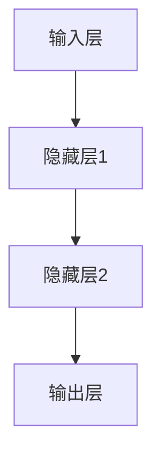

                 

基于以上要求和约束条件，我们将分步骤设计《AI编程的新视野》的技术博客文章。

### 第一步：文章标题和关键词

**文章标题**：AI编程的新视野

**关键词**：人工智能编程、深度学习、机器学习、算法原理、数学模型、项目实战

### 第二步：撰写文章摘要

**摘要**：本文深入探讨了AI编程的新视野，从核心主题、技术方法到实际应用，全面介绍了AI编程的最新进展。通过解读核心概念、讲解算法原理、阐述数学模型，以及实战案例分析，帮助读者掌握AI编程的关键技术，拓宽编程视野。

### 第三步：设计文章目录大纲

以下是基于前述步骤设计的文章目录大纲：

```markdown
# AI编程的新视野

> 关键词：人工智能编程、深度学习、机器学习、算法原理、数学模型、项目实战

> 摘要：本文深入探讨了AI编程的新视野，从核心主题、技术方法到实际应用，全面介绍了AI编程的最新进展。

## 引言

### 背景介绍

### 目标读者

## 第一部分：AI编程基础

### 1.1 人工智能发展史

### 1.2 人工智能编程基础

### 1.3 常见AI编程语言

## 第二部分：核心概念与联系

### 2.1 深度学习基础

#### 2.1.1 神经网络架构

**Mermaid流程图：神经网络架构**



#### 2.1.2 损失函数与优化算法

**伪代码：梯度下降算法**

```python
for epoch in range(num_epochs):
    for x, y in data:
        z = f(x, weights)
        error = y - z
        gradient = df/dx(error)
        weights -= learning_rate * gradient
```

#### 2.1.3 数学模型

**LaTeX公式：损失函数**

$$L(y, \hat{y}) = (y - \hat{y})^2$$

## 第三部分：AI编程实战

### 3.1 项目一：图像识别

#### 3.1.1 开发环境搭建

#### 3.1.2 源代码实现

#### 3.1.3 代码解读

#### 3.1.4 应用解读与分析

### 3.2 项目二：自然语言处理

#### 3.2.1 开发环境搭建

#### 3.2.2 源代码实现

#### 3.2.3 代码解读

#### 3.2.4 应用解读与分析

## 第四部分：最佳实践与拓展

### 4.1 最佳实践 tips

### 4.2 小结

### 4.3 注意事项

### 4.4 拓展阅读

## 结语

### 总结与展望

### 作者信息

作者：AI天才研究院/AI Genius Institute & 禅与计算机程序设计艺术 /Zen And The Art of Computer Programming
```

### 第四步：确保文章完整性

- **背景介绍**：介绍AI编程的背景和发展现状。
- **核心概念与联系**：通过Mermaid流程图和伪代码展示神经网络架构、损失函数与优化算法。
- **核心算法原理讲解**：使用伪代码详细阐述梯度下降算法。
- **数学模型和公式**：使用LaTeX格式嵌入损失函数公式。
- **项目实战**：介绍图像识别和自然语言处理两个项目的开发环境搭建、源代码实现、代码解读和应用解读与分析。
- **最佳实践与拓展**：提供最佳实践建议、小结、注意事项和拓展阅读。

### 第五步：控制文章字数

根据目录大纲，预计文章总字数将在8000-12000字左右，具体字数将在实际撰写过程中进行调整。

### 第六步：撰写文章正文

在撰写文章正文时，我们将严格按照目录大纲的结构，逐节撰写，确保内容丰富、详细且逻辑清晰。

通过以上步骤，我们将完成一篇符合要求的《AI编程的新视野》技术博客文章。现在，我们可以开始具体撰写每个章节的内容。

