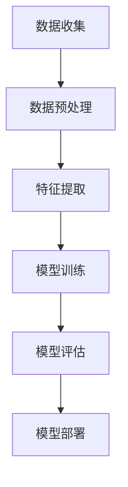

                 


### 《AI编程的新语言与新思维》

---

## 关键词

- **AI编程**
- **新语言特性**
- **Python**
- **R语言**
- **机器学习**
- **数学模型**
- **项目实战**

---

## 摘要

本文旨在深入探讨AI编程的新语言和新思维。首先，我们将介绍AI编程的背景和重要性，然后详细讨论Python和R等常见AI编程语言的特点和优势。接着，我们将探讨AI编程中的哲学和社会学思维，强调伦理和社会责任的重要性。通过核心概念和联系的Mermaid流程图，我们将展示AI编程的核心组件。随后，我们使用伪代码详细讲解决策树和支持向量机等核心算法原理。数学模型和公式部分将介绍概率论和最优化理论，并用LaTeX格式展示公式。最后，我们通过一个实际项目实战，展示如何搭建开发环境，实现源代码，并进行代码解读与分析。文章将以最佳实践提示、小结和拓展阅读等内容结束。

---

### AI编程的入门

#### 1.1 AI编程的重要性

随着人工智能技术的快速发展，AI编程已经成为各个行业的重要驱动力。从自动驾驶汽车到智能助手，从金融分析到医疗诊断，AI的应用无处不在。AI编程不仅仅是编写代码，它涉及到理解数据、应用算法、构建模型和优化系统等多个方面。

**1.1.1 AI时代的来临**

人工智能正在改变我们的世界。它能够处理和分析海量数据，从数据中提取有用信息，做出预测和决策。这种能力在许多领域都具有革命性的意义。

- **1.1.1.1 AI对各行各业的变革**
  - 在医疗领域，AI可以帮助医生进行疾病诊断，提高治疗效果。
  - 在金融领域，AI可以用于风险管理、欺诈检测和投资策略制定。
  - 在制造业，AI可以提高生产效率，降低成本。

- **1.1.1.2 AI编程的关键角色**
  - AI编程是实现这些变革的关键。它不仅仅是编写代码，更是理解和应用AI算法，构建智能系统的过程。

#### 1.2 常见的AI编程语言

在AI编程中，Python和R是最常用的语言。它们都有丰富的库和框架，能够支持各种AI任务。

**1.2.1 Python在AI编程中的应用**

Python因其简单易学、功能强大而成为AI编程的首选语言。Python的库和框架，如NumPy、Pandas、Scikit-Learn和TensorFlow，提供了大量的工具和函数，使AI编程变得更加高效。

- **1.2.1.1 Python的优势**
  - **简洁的语法**：Python的语法简洁清晰，易于阅读和理解。
  - **丰富的库和框架**：Python拥有丰富的库和框架，能够支持各种AI任务。

- **1.2.1.2 Python在AI编程中的应用**

Python在AI编程中有广泛的应用，包括：

- **数据预处理**：使用Pandas和NumPy进行数据清洗、转换和格式化。
- **机器学习**：使用Scikit-Learn进行数据分析和模型训练。
- **深度学习**：使用TensorFlow和Keras进行神经网络模型的构建和训练。

**1.2.2 R语言与AI**

R语言在统计分析和数据可视化方面有着悠久的历史，近年来也成为了AI编程的重要工具。R的包管理系统和丰富的统计函数库，如ggplot2、dplyr和caret，使其在AI编程中具有独特优势。

- **1.2.2.1 R语言的特点**
  - **强大的统计分析能力**：R提供了强大的统计工具，能够处理复杂的统计分析任务。
  - **丰富的数据可视化工具**：R拥有丰富的数据可视化工具，如ggplot2，能够生成高质量的统计图表。

- **1.2.2.2 R语言在AI编程中的应用**

R在AI编程中的应用包括：

- **机器学习**：使用caret和mlr包进行模型选择、训练和评估。
- **深度学习**：使用R语言实现神经网络模型，如MXNet和RNN。

#### 1.3 AI编程的基本概念

AI编程不仅仅是编写代码，它还涉及到对数据、算法和系统的深入理解。

**1.3.1 数据科学基础**

数据科学是AI编程的基础。它包括数据的收集、处理、分析和可视化。

- **1.3.1.1 数据的收集与处理**
  - 数据的收集和处理是AI编程的第一步。数据的质量直接影响模型的性能。
- **1.3.1.2 数据可视化**
  - 数据可视化是理解数据的重要手段。它能够帮助我们发现数据中的规律和趋势。

**1.3.2 机器学习简介**

机器学习是AI编程的核心。它通过算法和模型，使计算机能够从数据中学习，做出预测和决策。

- **1.3.2.1 机器学习的基本概念**
  - 机器学习包括监督学习、无监督学习和强化学习。
- **1.3.2.2 机器学习的主要任务**
  - 机器学习的主要任务包括分类、回归、聚类和异常检测。

---

### 新语言特性

#### 2.1 Python编程语言详解

**2.1.1 Python语法基础**

Python的语法简洁易懂，使得初学者能够快速上手。以下是Python的基本语法规则：

- **变量和赋值**：Python使用等号（=）进行变量赋值。
  ```python
  x = 10
  ```
- **注释**：Python使用井号（#）进行单行注释。
  ```python
  # 这是一个单行注释
  ```
- **打印输出**：Python使用print()函数打印输出。
  ```python
  print("Hello, World!")
  ```

**2.1.2 Python在AI编程中的应用**

Python在AI编程中有着广泛的应用。以下是Python在AI编程中的一些重要应用：

- **数据预处理**：Python的NumPy和Pandas库提供了强大的数据预处理功能。
  ```python
  import numpy as np
  import pandas as pd
  
  # 数据读取
  data = pd.read_csv('data.csv')
  
  # 数据清洗
  data = data.dropna()
  
  # 数据转换
  data['new_column'] = data['column1'] * data['column2']
  ```

- **机器学习**：Python的Scikit-Learn库提供了丰富的机器学习算法。
  ```python
  from sklearn.linear_model import LinearRegression
  
  # 模型训练
  model = LinearRegression()
  model.fit(X_train, y_train)
  
  # 模型预测
  y_pred = model.predict(X_test)
  ```

- **深度学习**：Python的TensorFlow和Keras库提供了强大的深度学习框架。
  ```python
  import tensorflow as tf
  from tensorflow.keras.models import Sequential
  from tensorflow.keras.layers import Dense
  
  # 模型构建
  model = Sequential()
  model.add(Dense(64, activation='relu', input_shape=(input_shape)))
  model.add(Dense(1, activation='sigmoid'))
  
  # 模型训练
  model.compile(optimizer='adam', loss='binary_crossentropy', metrics=['accuracy'])
  model.fit(X_train, y_train, epochs=10)
  ```

#### 2.2 R语言与AI

**2.2.1 R语言的特点**

R语言是统计分析和数据可视化的首选语言。以下是R语言的一些主要特点：

- **强大的统计分析功能**：R提供了丰富的统计函数和包，可以处理复杂的统计分析任务。
- **丰富的数据可视化工具**：R的ggplot2包提供了强大的数据可视化功能，可以生成高质量的统计图表。

**2.2.2 R语言在AI编程中的应用**

R语言在AI编程中也发挥着重要作用。以下是R语言在AI编程中的一些应用：

- **机器学习**：R的caret和mlr包提供了丰富的机器学习算法和工具。
  ```r
  library(caret)
  
  # 模型训练
  trainControl = trainControl(method="cv", number=10)
  model = train(target ~ ., data=data, method="rf", trControl=trainControl)
  
  # 模型预测
  predictions = predict(model, newdata=test_data)
  ```

- **深度学习**：R的MXNet和RNN包提供了深度学习模型的构建和训练。
  ```r
  library(MXNet)
  
  # 模型构建
  model = gluon.model_zoo.cifar10.get_resnet18()
  
  # 模型训练
  trainer = gluon.Trainer(model, 'softmax_cross_entropy', 'sgd')
  for epoch in range(num_epochs):
      train_data.reset()
      for batch in train_data:
          X, y = batch[0], batch[1]
          with autograd.record():
              y_hat = model(X)
              L = mx.nd.softmax_cross_entropy(y_hat, y)
          L.backward()
          trainer.step(batch_size)
  ```

---

### 新思维与AI编程

#### 3.1 AI编程中的哲学思维

AI编程不仅仅是技术问题，它还涉及到哲学层面的思考。以下是一些重要的哲学思维：

- **机器学习与哲学**：机器学习如何影响我们的认知和理解？它是如何影响我们的价值观和道德观的？
- **AI伦理与道德**：随着AI技术的快速发展，我们需要考虑如何确保AI的使用是伦理和道德的。例如，如何确保AI不歧视某些人群？如何确保AI的决策是公正和透明的？

#### 3.2 AI编程中的社会学思维

AI编程不仅仅是为了技术进步，它还涉及到社会层面的影响。以下是一些重要的社会学思维：

- **AI对社会的影响**：AI将如何改变我们的工作、生活和社交方式？它将如何影响经济和社会结构？
- **AI编程中的社会责任**：作为AI程序员，我们需要考虑如何确保我们的代码对社会有益，而不是造成伤害？

---

### 核心概念与联系

在AI编程中，有许多核心概念需要理解和掌握。以下是一个使用Mermaid绘制的流程图，展示了这些概念之间的关系：



在这个流程图中，数据收集是AI编程的第一步。接下来是数据预处理，这是确保数据质量的过程。特征提取是从数据中提取有用的信息，用于训练模型。模型训练是使用算法和数据进行模型训练的过程。模型评估是评估模型性能的过程。最后，模型部署是将模型应用到实际场景中的过程。

---

### 核心算法原理讲解

在AI编程中，有许多核心算法需要理解和掌握。以下我们将使用伪代码详细阐述一些重要的算法。

#### 5.1 决策树算法

决策树是一种常见的机器学习算法，它通过一系列的判断来对数据进行分类或回归。

```python
def decision_tree(data, target_attribute):
    if all_values_equal(data, target_attribute):
        return majority_class(data, target_attribute)
    else:
        best_attribute = find_best_attribute(data)
        decision_node = {"attribute": best_attribute}
        for value in unique_values(best_attribute):
            subset = filter_values(data, best_attribute, value)
            decision_node[value] = decision_tree(subset, target_attribute)
        return decision_node
```

在这个算法中，`data` 是输入数据集，`target_attribute` 是目标属性。算法首先检查所有数据点的目标属性是否相等，如果是，则返回大多数类的值。否则，算法找到最佳属性，并根据这个属性将数据划分为多个子集。然后，递归地对每个子集应用同样的算法。

#### 5.2 支持向量机算法

支持向量机（SVM）是一种用于分类和回归的强大算法。它通过找到一个超平面，将不同类别的数据点分开。

```python
def svm_train(X, y):
    # 使用库函数训练SVM模型
    model = train_svm(X, y)
    return model

def svm_predict(model, X):
    # 使用训练好的模型进行预测
    y_pred = model.predict(X)
    return y_pred
```

在这个算法中，`X` 是输入特征矩阵，`y` 是目标标签。`svm_train` 函数使用库函数训练SVM模型，`svm_predict` 函数使用训练好的模型进行预测。

---

### 数学模型与公式

在AI编程中，数学模型和公式是理解算法和模型性能的关键。以下是一些重要的数学模型和公式。

#### 6.1 概率论基础

概率论是AI编程的基础。以下是一些基本的概率论公式。

- **概率分布函数（PDF）**：
  ```latex
  f(x) = P(X = x)
  ```

- **期望值（Expected Value）**：
  ```latex
  E(X) = \sum_{x} x \cdot P(X = x)
  ```

- **方差（Variance）**：
  ```latex
  Var(X) = E[(X - E(X))^2]
  ```

- **协方差（Covariance）**：
  ```latex
  Cov(X, Y) = E[(X - E(X))(Y - E(Y))]
  ```

#### 6.2 最优化理论

最优化理论是AI编程中的重要工具。以下是一些基本的最优化公式。

- **目标函数**：
  ```latex
  \min_{x} f(x)
  ```

- **梯度下降（Gradient Descent）**：
  ```latex
  x_{t+1} = x_t - \alpha \cdot \nabla f(x_t)
  ```

- **Hessian矩阵**：
  ```latex
  H(f) = \nabla^2 f(x)
  ```

---

### 项目实战

在这个项目中，我们将使用Python实现一个简单的线性回归模型，并对其性能进行评估。

#### 7.1 项目背景

假设我们有一个包含房屋面积和房价的数据集。我们的目标是使用线性回归模型预测房屋的价格。

#### 7.2 开发环境搭建

首先，我们需要安装Python和相关的库，如NumPy、Pandas和Scikit-Learn。

```bash
pip install numpy pandas scikit-learn
```

#### 7.3 源代码实现与解读

以下是实现线性回归模型的源代码：

```python
import numpy as np
import pandas as pd
from sklearn.linear_model import LinearRegression
from sklearn.model_selection import train_test_split
from sklearn.metrics import mean_squared_error

# 数据读取
data = pd.read_csv('house_prices.csv')

# 数据预处理
X = data[['area']]
y = data['price']

# 数据划分
X_train, X_test, y_train, y_test = train_test_split(X, y, test_size=0.2, random_state=42)

# 模型训练
model = LinearRegression()
model.fit(X_train, y_train)

# 模型预测
y_pred = model.predict(X_test)

# 模型评估
mse = mean_squared_error(y_test, y_pred)
print("MSE:", mse)
```

在这个代码中，我们首先读取数据集，然后进行数据预处理。接着，我们将数据集划分为训练集和测试集。然后，我们使用线性回归模型进行训练，并使用测试集进行预测。最后，我们使用均方误差（MSE）评估模型的性能。

#### 7.4 代码解读与分析

- **数据读取**：我们使用Pandas读取CSV文件。
- **数据预处理**：我们提取房屋面积作为特征，房价作为目标变量。
- **数据划分**：我们使用Scikit-Learn的`train_test_split`函数将数据集划分为训练集和测试集。
- **模型训练**：我们使用线性回归模型进行训练。
- **模型预测**：我们使用训练好的模型进行预测。
- **模型评估**：我们使用均方误差（MSE）评估模型的性能。

#### 7.5 项目小结

在这个项目中，我们实现了一个简单的线性回归模型，并对其性能进行了评估。这个项目展示了如何使用Python进行AI编程，以及如何评估模型的性能。通过这个项目，我们可以更好地理解线性回归模型的原理和应用。

---

### 最佳实践 tips、小结、注意事项、拓展阅读

**最佳实践 tips：**
- 在进行数据预处理时，务必确保数据的质量和完整性。
- 在选择机器学习算法时，要考虑到问题的特点和数据的特点。
- 在训练模型时，要合理设置超参数，并进行交叉验证。

**小结：**
- 本文详细介绍了AI编程的新语言和新思维，包括Python和R等编程语言，以及机器学习和深度学习等核心算法。
- 通过Mermaid流程图和伪代码，我们展示了AI编程的核心概念和原理。
- 项目实战部分展示了如何使用Python实现线性回归模型，并进行性能评估。

**注意事项：**
- 在使用AI技术时，要考虑到伦理和社会影响。
- 在进行数据分析和建模时，要确保数据的质量和准确性。

**拓展阅读：**
- 《Python机器学习》（Sebastian Raschka）
- 《深度学习》（Ian Goodfellow、Yoshua Bengio和Aaron Courville）
- 《数据科学入门》（Joel Grus）

通过本文的学习，读者可以更好地理解AI编程的新语言和新思维，并为实际项目做好准备。

---

### 未来展望

随着人工智能技术的不断进步，AI编程的未来充满了无限可能。以下是对未来AI编程的一些展望：

**1. AI编程的发展趋势**

- **自动代码生成**：未来的AI编程可能会更加自动化，AI能够根据需求自动生成代码。
- **多语言集成**：AI编程可能会支持多种编程语言的集成，使得开发者可以更加灵活地选择工具。
- **面向任务的编程**：未来的AI编程可能会更加注重任务的完成，而不是传统的编程语言和框架。

**2. 新语言与新思维的未来**

- **更高效的编程语言**：未来可能会出现新的编程语言，它们将更加高效，更易于进行AI编程。
- **新的编程思维**：随着AI技术的发展，编程思维可能会发生重大变化，从传统的算法思维转向更加数据驱动的思维。

**3. AI编程教育的挑战与机遇**

- **教育改革**：随着AI编程的重要性增加，教育系统需要改革，以适应新的技术需求。
- **人才培养**：未来需要更多具备AI编程能力的专业人才，以满足不断增长的需求。

总之，AI编程的未来将是一个充满挑战和机遇的时代。开发者需要不断学习和适应新的技术，才能在这个领域中取得成功。通过本文的学习，读者可以更好地理解AI编程的新语言和新思维，并为未来的发展做好准备。

