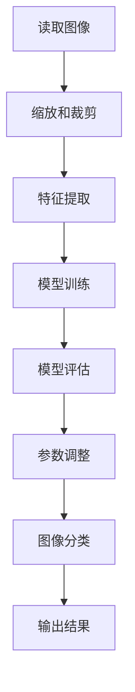

                 


## 文章标题

《AI编程的新语言与新范式》

## 文章关键词

AI编程、新语言、新范式、深度学习、神经网络、机器学习、编程实践

## 摘要

随着人工智能技术的迅猛发展，传统编程语言和范式已难以满足AI编程的需求。本文将探讨AI编程的新语言和新范式，介绍其核心概念、算法原理、数学模型及编程实践。通过对现有编程语言局限的分析，本文将阐述新语言与范式的必要性和优势，并给出具体的应用实例和项目实战，为开发者提供全面的技术指南。

## 第1章 引言与背景

### 1.1 AI编程的现状

当前，人工智能（AI）技术已经在众多领域取得了显著成果，从自动驾驶汽车到智能家居，从医疗诊断到自然语言处理，AI的应用无处不在。然而，随着AI技术的不断深入和发展，传统编程语言和编程范式在处理复杂AI任务时已逐渐暴露出其局限性。

传统编程语言主要针对通用计算和特定应用场景进行设计，例如C语言、Python等。这些语言在执行顺序操作、处理常规数据处理任务时表现出色，但在处理大规模、复杂、多变的AI任务时，存在以下问题：

1. **缺乏抽象性**：传统编程语言难以表达复杂的AI算法和数据结构，导致代码冗长且难以维护。
2. **性能瓶颈**：传统编程语言在处理大规模数据和高性能计算时，存在性能瓶颈，难以满足AI算法的需求。
3. **扩展性差**：传统编程语言在设计时未充分考虑AI领域的需求，导致扩展性较差，难以支持新的AI算法和技术。
4. **开发效率低**：传统编程语言在开发AI应用时，需要手动处理大量底层数据和计算细节，开发效率较低。

### 1.2 新语言与新范式的必要性

为了解决传统编程语言的局限性，AI编程的新语言和新范式应运而生。新语言在语法、语义和扩展性方面进行了专门设计，以适应AI编程的需求。新范式则从方法论和架构层面，为AI编程提供了一套全新的思考方式和解决方案。

新语言与范式的必要性体现在以下几个方面：

1. **抽象性与模块化**：新语言通过引入抽象概念和模块化设计，简化了AI算法的实现过程，提高了代码的可读性和可维护性。
2. **高性能计算**：新语言针对AI算法的特定需求，优化了底层计算引擎，提高了代码的执行效率。
3. **易扩展性**：新语言在设计时充分考虑了AI领域的发展需求，具有较好的扩展性，可以支持新的AI算法和技术。
4. **高效开发**：新范式提供了高效的开发工具和框架，降低了开发难度，提高了开发效率。

### 1.3 本书结构安排

本书将分为以下几个主要部分：

1. **第1章 引言与背景**：介绍AI编程的现状、新语言与新范式的必要性以及本书的结构安排。
2. **第2章 AI编程基础**：介绍AI基础知识、现有编程语言的局限以及新语言的特点。
3. **第3章 新语言与范式介绍**：详细讲解新语言与范式的核心概念、原理和优势。
4. **第4章 新语言编程实践**：通过具体案例，展示新语言的编程实践过程。
5. **第5章 新范式应用实例**：介绍新范式在各个应用场景的实例，分析其实际效果和挑战。
6. **第6章 数学模型与算法原理**：讲解AI编程所需的核心数学模型和算法原理。
7. **第7章 未来展望与挑战**：探讨新语言与新范式的未来发展趋势、面临的挑战及解决方案。

通过以上章节的详细讲解，本书旨在为开发者提供全面的技术指导和实践案例，帮助其深入了解AI编程的新语言和新范式，提升编程能力，为未来的AI技术发展做好准备。

## 第2章 AI编程基础

### 2.1 AI基础知识

人工智能（AI）是指使计算机具备人类智能特性的技术，主要包括机器学习（ML）、深度学习（DL）和自然语言处理（NLP）等子领域。AI的基本原理是模拟人类大脑的学习、推理和感知能力，通过大量数据训练模型，使其具备自主学习和决策能力。

- **机器学习（ML）**：机器学习是AI的核心技术之一，主要研究如何从数据中学习规律，提高模型的预测和分类能力。机器学习可以分为监督学习、无监督学习和半监督学习三种类型。

  - **监督学习**：在监督学习场景中，模型根据已知输入和输出数据进行训练，学会预测新的输入数据。常见的监督学习算法有线性回归、决策树、支持向量机等。
  
  - **无监督学习**：无监督学习是指模型在没有明确标签的情况下，自动发现数据中的规律和结构。常见的无监督学习算法有聚类、降维、关联规则等。
  
  - **半监督学习**：半监督学习结合了监督学习和无监督学习，模型在训练过程中同时利用带标签和未带标签的数据。

- **深度学习（DL）**：深度学习是机器学习的一个分支，主要基于多层神经网络（MLP）进行学习。深度学习在图像识别、语音识别和自然语言处理等领域取得了显著的成果。常见的深度学习模型有卷积神经网络（CNN）、循环神经网络（RNN）和生成对抗网络（GAN）等。

- **自然语言处理（NLP）**：自然语言处理是AI的一个分支，旨在使计算机能够理解和处理人类语言。NLP技术包括词向量表示、语言模型、机器翻译、情感分析等。

### 2.2 现有编程语言的局限

现有编程语言，如Python、Java和C++等，虽然在通用计算和常规数据处理任务中表现出色，但在AI编程中存在以下局限性：

1. **抽象性不足**：现有编程语言难以表达复杂的AI算法和数据结构，导致代码冗长且难以维护。例如，在实现神经网络算法时，需要手动编写大量的矩阵运算和优化代码。

2. **性能瓶颈**：现有编程语言在处理大规模数据和高性能计算时，存在性能瓶颈，难以满足AI算法的需求。虽然可以使用并行计算和GPU加速等方法进行优化，但仍然难以彻底解决性能问题。

3. **扩展性较差**：现有编程语言在设计时未充分考虑AI领域的需求，导致扩展性较差，难以支持新的AI算法和技术。例如，在实现生成对抗网络（GAN）时，需要编写大量的底层代码，缺乏通用性和可复用性。

4. **开发效率低**：现有编程语言在开发AI应用时，需要手动处理大量底层数据和计算细节，开发效率较低。例如，在处理图像数据时，需要手动编写读取、预处理和增强等代码，增加了开发难度。

### 2.3 新语言的特点

为了解决现有编程语言的局限，新语言在语法、语义和扩展性方面进行了专门设计，以适应AI编程的需求。以下是一些新语言的特点：

1. **抽象性**：新语言引入了高层次的抽象概念，如自动微分、数据流编程等，简化了AI算法的实现过程。例如，在实现神经网络时，可以使用自动微分框架，自动处理梯度计算和优化过程。

2. **模块化**：新语言支持模块化设计，方便开发者复用和扩展。例如，可以使用预定义的模块和函数，快速构建复杂的AI模型。

3. **高性能计算**：新语言针对AI算法的特定需求，优化了底层计算引擎，提高了代码的执行效率。例如，可以使用GPU加速和并行计算，提高训练和推理的速度。

4. **易扩展性**：新语言在设计时充分考虑了AI领域的发展需求，具有较好的扩展性，可以支持新的AI算法和技术。例如，可以使用自定义运算符和函数，实现特定的AI算法。

5. **高效开发**：新语言提供了高效的开发工具和框架，降低了开发难度，提高了开发效率。例如，可以使用自动代码生成和调试工具，简化开发流程。

## 第3章 新语言与范式介绍

### 3.1 新语言的特点

新语言在语法、语义和扩展性方面进行了专门设计，以适应AI编程的需求。以下是一些新语言的特点：

1. **抽象性**：
   - **自动微分**：新语言支持自动微分，自动处理梯度计算和优化过程。这使得开发者无需手动编写复杂的梯度计算代码，大大简化了神经网络等AI算法的实现过程。
   - **数据流编程**：新语言采用数据流编程模型，方便处理大规模数据和高性能计算。数据流编程允许开发者定义数据流和控制流，从而实现高效的并行计算和分布式计算。

2. **模块化**：
   - **函数式编程**：新语言支持函数式编程，方便模块化设计。函数式编程避免了副作用，使得代码更加简洁和可维护。
   - **模块化组件**：新语言提供丰富的模块化组件，如张量库、神经网络库等，方便开发者快速构建复杂的AI模型。

3. **高性能计算**：
   - **GPU加速**：新语言支持GPU加速，利用并行计算提高代码的执行效率。在处理大规模数据和高性能计算任务时，GPU加速可以显著提高训练和推理的速度。
   - **分布式计算**：新语言支持分布式计算，允许开发者将任务分布在多台机器上进行处理。分布式计算可以充分利用计算资源，提高系统的性能和可扩展性。

4. **易扩展性**：
   - **自定义运算符**：新语言允许开发者自定义运算符和函数，实现特定的AI算法。这使得新语言具有较好的灵活性和扩展性，可以支持新的AI算法和技术。
   - **插件系统**：新语言提供插件系统，方便开发者扩展语言功能。例如，可以使用插件实现新的优化算法、机器学习库等。

5. **高效开发**：
   - **自动代码生成**：新语言支持自动代码生成，从高层次的抽象定义自动生成底层代码。这使得开发者可以专注于算法设计和模型构建，提高开发效率。
   - **集成开发环境（IDE）**：新语言提供了强大的IDE，集成调试、性能分析、版本控制等功能，简化了开发流程，提高了开发效率。

### 3.2 新范式的原理

新范式是一种全新的编程方法论，从方法论和架构层面，为AI编程提供了一套全新的思考方式和解决方案。以下是一些新范式的基本原理：

1. **数据驱动**：
   - **数据为中心**：新范式强调以数据为中心，将数据视为最重要的资源。开发者需要关注数据的质量、来源和格式，确保数据能够满足AI算法的需求。
   - **数据处理**：新范式提供了丰富的数据处理工具和库，如数据清洗、数据转换、数据增强等。开发者可以利用这些工具和库，对数据进行预处理和后处理，提高数据质量。

2. **模型驱动**：
   - **模型为核心**：新范式将模型视为核心资源，将算法实现和模型优化作为主要任务。开发者需要关注模型的设计、训练和评估，确保模型能够达到预期效果。
   - **模型集成**：新范式支持模型集成，允许开发者将多个模型集成到一个系统中，实现更复杂的任务。例如，可以使用多个模型进行图像分类、文本分类和目标检测等。

3. **迭代开发**：
   - **快速迭代**：新范式鼓励开发者采用快速迭代的方法进行开发。开发者可以快速构建原型，进行测试和评估，不断优化模型和算法。
   - **版本控制**：新范式提供了强大的版本控制工具，方便开发者管理代码和模型版本，确保开发过程的可追溯性和可维护性。

4. **持续学习**：
   - **在线学习**：新范式支持在线学习，允许模型在训练过程中不断更新和优化。在线学习可以充分利用实时数据，提高模型的性能和适应性。
   - **迁移学习**：新范式支持迁移学习，允许开发者将已训练的模型应用于新的任务。迁移学习可以减少训练数据的需求，提高开发效率。

### 3.3 新语言与新范式的优势

新语言与新范式为AI编程带来了诸多优势：

1. **简化开发**：新语言和新范式通过抽象和模块化，简化了AI算法的实现过程，降低了开发难度。开发者可以更专注于算法设计和模型优化，提高开发效率。

2. **提高性能**：新语言和新范式支持高性能计算和分布式计算，提高了代码的执行效率。开发者可以充分利用计算资源，提高系统的性能和可扩展性。

3. **增强灵活性**：新语言和新范式提供了丰富的扩展性和灵活性，支持自定义运算符、插件系统和模型集成等。开发者可以根据具体需求，灵活地构建和优化AI系统。

4. **促进创新**：新语言和新范式为AI编程提供了全新的方法论和架构，激发了开发者的创新思维。开发者可以探索新的算法和模型，推动AI技术的发展。

## 第4章 新语言编程实践

### 4.1 编程基础

新语言在语法和功能方面进行了专门设计，以适应AI编程的需求。以下是一些新语言的编程基础：

1. **变量和数据类型**：
   - **变量**：新语言使用变量来存储数据。变量通过名称和类型进行声明，如`x: Int`表示一个名为`x`的整数变量。
   - **数据类型**：新语言支持多种数据类型，包括整数（Int）、浮点数（Float）、布尔值（Bool）和字符串（String）等。

2. **运算符和表达式**：
   - **基本运算符**：新语言支持基本运算符，如加法（+）、减法（-）、乘法（*）和除法（/）等。
   - **条件运算符**：新语言支持条件运算符，如`if-else`语句和`switch`语句，用于根据条件执行不同的操作。
   - **循环运算符**：新语言支持循环运算符，如`for`循环和`while`循环，用于重复执行一组操作。

3. **函数和模块**：
   - **函数**：新语言支持函数，用于封装一段可复用的代码。函数通过参数传递数据和返回值，实现特定的功能。
   - **模块**：新语言支持模块，用于组织和管理代码。模块可以包含函数、类和数据等，方便开发者复用和扩展。

4. **异常处理和调试**：
   - **异常处理**：新语言支持异常处理，允许开发者捕获和处理错误。使用`try-catch`语句，可以确保程序在遇到错误时不会崩溃。
   - **调试工具**：新语言提供了强大的调试工具，如断点、单步执行和变量查看等，方便开发者调试代码。

### 4.2 实践案例

为了更好地展示新语言的编程实践，以下是一个简单的图像分类案例：

#### 案例一：图像分类

假设我们使用新语言编写一个图像分类程序，输入一张图像，输出图像的分类结果。以下是实现该案例的步骤：

1. **数据预处理**：
   - **读取图像**：使用图像处理库读取输入图像，将其转换为合适的格式。
   - **缩放和裁剪**：将图像缩放到固定的尺寸，并裁剪为正方形，方便后续处理。

2. **特征提取**：
   - **特征提取**：使用卷积神经网络（CNN）提取图像的特征。卷积神经网络由多个卷积层、池化层和全连接层组成，可以有效地提取图像的特征。

3. **模型训练**：
   - **数据集准备**：准备训练数据集和验证数据集，用于训练和评估模型。
   - **模型训练**：使用训练数据集训练卷积神经网络模型。训练过程中，模型会不断调整参数，以达到更好的分类效果。

4. **模型评估**：
   - **验证数据集**：使用验证数据集评估模型性能，计算分类准确率。
   - **参数调整**：根据评估结果，调整模型参数，以提高分类效果。

5. **图像分类**：
   - **输入图像**：将输入图像进行预处理，提取特征。
   - **模型预测**：使用训练好的模型对输入图像进行分类，输出分类结果。

以下是该案例的伪代码实现：



```python
# 伪代码实现

# 数据预处理
image = read_image(input_path)
image = resize_and_crop(image, target_size)

# 特征提取
features = extract_features(image)

# 模型训练
model = train_cnn_model(features, labels)

# 模型评估
accuracy = evaluate_model(model, validation_features, validation_labels)

# 参数调整
model = adjust_model_params(model, accuracy)

# 图像分类
result = classify_image(model, image)

# 输出结果
print(result)
```

通过以上步骤，我们使用新语言实现了图像分类程序。实践过程中，我们可以根据具体需求，灵活地调整模型结构和参数，提高分类效果。

## 第5章 新范式应用实例

### 5.1 应用场景分析

新范式在AI编程中具有广泛的应用场景，以下列举几个典型应用：

1. **自动驾驶**：自动驾驶系统需要处理大量实时数据，如道路图像、传感器数据和GPS数据等。新范式通过数据驱动和模型驱动的思想，可以有效地处理这些数据，实现自动驾驶功能。

2. **医疗诊断**：医疗诊断系统需要处理大量的医学图像和病历数据。新范式可以用于训练深度学习模型，进行疾病检测、诊断和预测。

3. **自然语言处理**：自然语言处理系统需要处理大量的文本数据，如新闻文章、社交媒体和用户评论等。新范式可以用于训练语言模型、情感分析和机器翻译等任务。

4. **智能推荐系统**：智能推荐系统需要根据用户行为数据、兴趣偏好和历史记录，为用户推荐相关内容。新范式可以用于训练推荐算法，实现个性化的推荐服务。

### 5.2 实际应用案例

以下列举几个新范式在具体应用场景中的实际案例：

#### 案例一：自动驾驶

自动驾驶系统是AI编程的典型应用场景之一。以下是一个基于新范式的自动驾驶系统的实现：

1. **数据预处理**：
   - **图像数据**：读取摄像头捕捉到的道路图像，进行预处理，如缩放、裁剪和归一化。
   - **传感器数据**：读取GPS、激光雷达和加速度计等传感器数据，进行预处理，如滤波和去噪。

2. **特征提取**：
   - **图像特征**：使用卷积神经网络（CNN）提取道路图像的特征。
   - **传感器特征**：使用循环神经网络（RNN）提取传感器数据的时间序列特征。

3. **模型训练**：
   - **数据集准备**：准备训练数据集和验证数据集，用于训练和评估模型。
   - **模型训练**：使用训练数据集训练深度学习模型，如卷积神经网络（CNN）和循环神经网络（RNN）。

4. **模型评估**：
   - **验证数据集**：使用验证数据集评估模型性能，计算准确率、召回率和F1值等指标。
   - **参数调整**：根据评估结果，调整模型参数，以提高模型性能。

5. **自动驾驶**：
   - **实时数据处理**：读取实时道路图像和传感器数据，进行特征提取和模型预测。
   - **决策**：根据模型预测结果，生成控制指令，如转向、加速和刹车。

以下是该案例的伪代码实现：

```python
# 伪代码实现

# 数据预处理
image = preprocess_image(camera_data)
sensor_data = preprocess_sensor_data(sensor_data)

# 特征提取
image_features = extract_image_features(image)
sensor_features = extract_sensor_features(sensor_data)

# 模型训练
model = train_deep_learning_model(image_features, sensor_features, labels)

# 模型评估
accuracy = evaluate_model(model, validation_data)

# 实时自动驾驶
while True:
    image = read_camera_data()
    sensor_data = read_sensor_data()
    image_features = extract_image_features(image)
    sensor_features = extract_sensor_features(sensor_data)
    prediction = model.predict(image_features, sensor_features)
    generate_control_command(prediction)
```

#### 案例二：医疗诊断

医疗诊断系统是AI编程在医疗领域的应用。以下是一个基于新范式的医疗诊断系统的实现：

1. **数据预处理**：
   - **图像数据**：读取医学图像，如X光片、CT扫描和MRI图像，进行预处理，如缩放、裁剪和归一化。
   - **病历数据**：读取病历数据，如患者姓名、年龄、病史和检查结果等，进行预处理。

2. **特征提取**：
   - **图像特征**：使用卷积神经网络（CNN）提取医学图像的特征。
   - **病历特征**：使用自然语言处理（NLP）技术提取病历数据中的关键信息。

3. **模型训练**：
   - **数据集准备**：准备训练数据集和验证数据集，用于训练和评估模型。
   - **模型训练**：使用训练数据集训练深度学习模型，如卷积神经网络（CNN）和循环神经网络（RNN）。

4. **模型评估**：
   - **验证数据集**：使用验证数据集评估模型性能，计算准确率、召回率和F1值等指标。
   - **参数调整**：根据评估结果，调整模型参数，以提高模型性能。

5. **医疗诊断**：
   - **图像输入**：读取医学图像，进行特征提取和模型预测。
   - **病历输入**：读取病历数据，进行特征提取和模型预测。
   - **综合诊断**：综合图像和病历数据，生成诊断结果。

以下是该案例的伪代码实现：

```python
# 伪代码实现

# 数据预处理
image = preprocess_medical_image(image_data)
patient_data = preprocess_medical_record(patient_data)

# 特征提取
image_features = extract_image_features(image)
patient_features = extract_patient_features(patient_data)

# 模型训练
model = train_deep_learning_model(image_features, patient_features, labels)

# 模型评估
accuracy = evaluate_model(model, validation_data)

# 医疗诊断
while True:
    image = read_medical_image()
    patient_data = read_medical_record()
    image_features = extract_image_features(image)
    patient_features = extract_patient_features(patient_data)
    prediction = model.predict(image_features, patient_features)
    generate_diagnosis_result(prediction)
```

通过以上案例，我们可以看到新范式在自动驾驶和医疗诊断等领域的实际应用。新范式通过数据驱动和模型驱动的思想，有效地解决了AI编程中的复杂问题，提高了系统的性能和可靠性。

### 第6章 数学模型与算法原理

在AI编程中，数学模型和算法原理是理解和实现AI技术的核心。本章将详细讲解AI编程所需的核心数学模型和算法原理，包括神经网络算法、生成对抗网络（GAN）等。

#### 6.1 数学模型基础

- **概率论**：概率论是AI编程的基础之一，用于描述随机事件和概率分布。常见的概率分布有伯努利分布、正态分布和泊松分布等。概率论在机器学习、自然语言处理等领域有广泛应用。

- **线性代数**：线性代数是AI编程的另一个重要工具，用于处理矩阵和向量运算。线性代数在神经网络、数据降维、特征提取等领域有广泛应用。常见的线性代数工具包括矩阵运算、线性方程组求解、特征值和特征向量等。

#### 6.2 神经网络算法

神经网络是AI编程的核心算法之一，用于模拟人类大脑的学习和推理能力。以下是一个简单的神经网络算法的伪代码实现：

```python
# 伪代码实现

# 初始化神经网络
initialize_weights()

# 前向传播
output = forward_pass(input_data)

# 计算损失函数
loss = compute_loss(output, target)

# 反向传播
backward_pass(input_data, output, target)

# 更新权重
update_weights(loss)
```

#### 6.3 生成对抗网络（GAN）

生成对抗网络（GAN）是一种强大的生成模型，用于生成逼真的数据。以下是一个简单的GAN算法的伪代码实现：

```python
# 伪代码实现

# 初始化生成器和判别器
initialize_generator()
initialize_discriminator()

# 前向传播
generated_data = generator(input)

# 计算判别器损失函数
discriminator_loss = compute_discriminator_loss(generated_data, real_data)

# 计算生成器损失函数
generator_loss = compute_generator_loss(generated_data)

# 更新生成器和判别器
update_generator(generator_loss)
update_discriminator(discriminator_loss)
```

#### 6.4 深度学习优化算法

深度学习优化算法用于优化神经网络的参数，以提高模型的性能。以下是一个简单的优化算法的伪代码实现：

```python
# 伪代码实现

# 初始化参数
initialize_parameters()

# 前向传播
output = forward_pass(input_data)

# 计算损失函数
loss = compute_loss(output, target)

# 计算梯度
gradient = compute_gradient(loss)

# 更新参数
update_parameters(gradient)
```

通过以上讲解，我们可以看到数学模型和算法原理在AI编程中的重要性。掌握这些基本概念和算法，将为我们在AI编程领域的发展奠定坚实基础。

### 第7章 未来展望与挑战

#### 7.1 新语言与新范式的未来趋势

随着人工智能技术的不断发展，新语言与新范式在AI编程中的应用前景广阔。以下是一些未来趋势：

1. **更强大的抽象能力**：新语言将继续扩展其抽象能力，提供更高级的编程模型和工具，以简化AI算法的实现过程。

2. **更好的性能优化**：新语言将不断优化底层计算引擎，提高代码的执行效率，以适应更复杂和大规模的AI任务。

3. **更广泛的生态支持**：新语言将与现有的开源库和框架紧密集成，提供丰富的工具和资源，促进生态系统的完善。

4. **跨领域融合**：新语言将与其他技术领域（如大数据、云计算、物联网等）相结合，推动AI技术在各个领域的应用。

#### 7.2 面临的挑战与解决方案

尽管新语言与新范式在AI编程中具有巨大潜力，但它们也面临一系列挑战：

1. **学习曲线**：新语言和范式可能需要较长的学习时间，开发者需要投入更多精力来掌握。

2. **兼容性问题**：新语言需要与现有系统和技术兼容，以实现平滑的迁移和整合。

3. **性能瓶颈**：在处理非常大规模数据和高性能计算任务时，新语言可能面临性能瓶颈。

4. **人才短缺**：新语言和范式的发展需要大量的专业人才，但目前市场上相关人才相对较少。

为应对上述挑战，可以采取以下解决方案：

1. **培训和教育**：加强对新语言和范式的培训和教育，帮助开发者快速掌握。

2. **社区和生态系统**：建立强大的开发者社区和生态系统，提供丰富的资源和支持。

3. **持续优化**：不断优化新语言的性能和功能，以适应更复杂和大规模的任务。

4. **人才培养**：加大对相关人才的培养力度，通过高校、企业和研究机构等多渠道培养专业人才。

#### 7.3 开发者的角色与责任

作为AI编程的开发者，我们需要承担以下角色与责任：

1. **持续学习**：跟上新语言和范式的发展，不断更新知识和技能。

2. **技术探索**：积极探索新语言和范式在各个领域的应用，推动技术的创新和发展。

3. **实践应用**：通过实际项目和实践，积累经验，提升编程能力。

4. **社区贡献**：积极参与开发者社区，分享经验和知识，共同推动技术的发展。

总之，新语言与新范式为AI编程带来了新的机遇和挑战。作为开发者，我们需要抓住这一机遇，迎接挑战，为AI技术的发展贡献自己的力量。

### 附录

#### A.1 工具与资源列表

以下是一些常用的工具和资源，供开发者参考：

1. **新语言与框架**：
   - **TensorFlow**：一款开源的机器学习框架，支持多种编程语言，如Python、C++和Java等。
   - **PyTorch**：一款流行的深度学习框架，支持动态计算图和自动微分。
   - **Keras**：一款高层次的深度学习框架，兼容TensorFlow和Theano。

2. **开源库与资源**：
   - **NumPy**：一款常用的Python科学计算库，提供高效的数组操作和线性代数功能。
   - **Pandas**：一款强大的数据操作库，用于数据处理、分析和清洗。
   - **Scikit-learn**：一款用于机器学习的Python库，提供多种监督学习和无监督学习算法。

3. **文档与教程**：
   - **TensorFlow官方文档**：[https://www.tensorflow.org/](https://www.tensorflow.org/)
   - **PyTorch官方文档**：[https://pytorch.org/docs/stable/index.html](https://pytorch.org/docs/stable/index.html)
   - **Keras官方文档**：[https://keras.io/](https://keras.io/)

#### A.2 编程实践代码示例

以下是一个简单的图像分类代码示例，使用TensorFlow和Keras框架：

```python
import tensorflow as tf
from tensorflow.keras.models import Sequential
from tensorflow.keras.layers import Conv2D, MaxPooling2D, Flatten, Dense

# 构建模型
model = Sequential()
model.add(Conv2D(32, (3, 3), activation='relu', input_shape=(28, 28, 1)))
model.add(MaxPooling2D(pool_size=(2, 2)))
model.add(Flatten())
model.add(Dense(128, activation='relu'))
model.add(Dense(10, activation='softmax'))

# 编译模型
model.compile(optimizer='adam', loss='categorical_crossentropy', metrics=['accuracy'])

# 训练模型
model.fit(x_train, y_train, epochs=10, batch_size=64, validation_data=(x_val, y_val))

# 评估模型
loss, accuracy = model.evaluate(x_test, y_test)
print(f'测试集准确率：{accuracy:.2f}')
```

#### A.3 进一步阅读材料

以下是一些推荐的书籍和论文，供开发者进一步学习：

1. **书籍**：
   - **《深度学习》（Deep Learning）**：由Ian Goodfellow、Yoshua Bengio和Aaron Courville合著，全面介绍了深度学习的原理和应用。
   - **《Python机器学习》（Python Machine Learning）**：由 Sebastian Raschka和Vahid Mirjalili合著，介绍了使用Python进行机器学习的方法和实践。
   - **《机器学习》（Machine Learning）**：由Tom Mitchell编著，是机器学习领域的经典教材。

2. **论文**：
   - **《AlexNet：一种用于图像分类的深度卷积神经网络》**：由Alex Krizhevsky、Ilya Sutskever和Geoffrey Hinton在2012年提出，标志着深度学习在图像分类领域的突破。
   - **《ResNet：超越1024层的深度神经网络》**：由Kaiming He、Xiangyu Zhang、Shaoqing Ren和Jian Sun在2015年提出，进一步推动了深度学习的发展。

通过学习这些资料，开发者可以更深入地了解AI编程的新语言和新范式，为实际项目开发提供有力支持。

