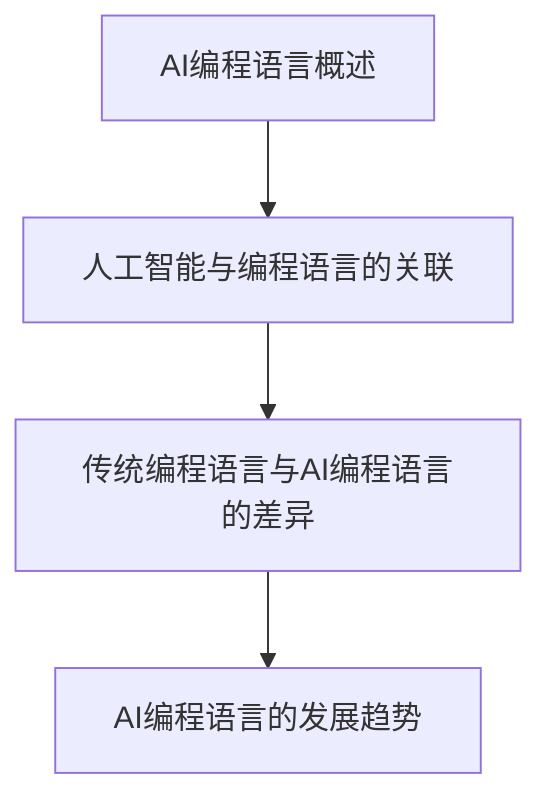

                 


### 1. 引言

人工智能（AI）作为21世纪最具变革性的技术之一，正在改变着各行各业的面貌。而AI编程作为实现人工智能的核心手段，也逐渐成为技术发展的焦点。传统编程语言虽然在功能上已经非常强大，但在应对复杂的AI任务时，往往显得力不从心。这就催生了对新的AI编程语言的需求，以及编程范式的变革。

本文旨在探讨AI编程的新语言与新范式，首先我们将回顾AI编程的历史，了解传统编程语言与AI编程语言的差异。接着，我们将深入分析AI编程范式的发展，探讨新范式编程语言的基本概念和特点。随后，我们将通过实例分析，展示新范式编程语言在实际应用中的表现。最后，我们将展望AI编程的未来，探讨其发展方向和应用前景。

### 2. 关键词

- 人工智能编程
- AI编程语言
- 编程范式
- 数据表示
- 机器学习
- 自然语言处理
- 计算机视觉

### 3. 摘要

本文将探讨AI编程的新语言与新范式。首先，我们将回顾AI编程的发展历程，分析传统编程语言在AI领域的局限性。然后，我们将介绍新范式编程语言的基本概念和特点，并通过实例分析展示其实际应用。最后，我们将探讨AI编程的未来趋势，展望其发展方向和应用前景。

### 4. AI编程的历史与现状

AI编程的历史可以追溯到20世纪50年代，当时计算机科学家们开始探索如何让计算机具有人类的智能。早期的AI编程主要依赖于基于规则的方法，这种方法通过定义一系列规则来指导计算机的决策。然而，这种方法在面对复杂问题时，往往显得过于笨拙和低效。

随着计算能力的提升和数据量的增加，机器学习逐渐成为AI编程的主流方法。机器学习通过从大量数据中学习规律，从而实现智能决策。这一方法的出现，极大地提升了AI编程的效率和效果。然而，机器学习算法的实现往往依赖于复杂的数学模型和大量的数据处理技术，这使得传统的编程语言在处理这些任务时，仍然存在一定的局限性。

### 5. 传统编程语言与AI编程语言的差异

传统编程语言如C、Java、Python等，虽然功能强大，但在处理AI任务时，往往面临以下挑战：

- **复杂性**：AI任务通常涉及到复杂的数学模型和算法，传统的编程语言在表达这些模型时，往往显得力不从心。
- **可扩展性**：传统编程语言在处理大量数据时，性能可能会受到影响，难以满足AI任务对高效处理的需求。
- **易用性**：对于非专业程序员来说，使用传统编程语言实现AI算法，往往需要掌握大量的数学和统计学知识，这使得AI编程的门槛较高。

相比之下，AI编程语言如Prolog、Lisp、Python（借助各种库和框架）等，具有以下特点：

- **数学支持**：AI编程语言通常具备强大的数学支持，可以方便地表达复杂的数学模型和算法。
- **数据处理能力**：AI编程语言通常内置了丰富的数据处理工具，可以高效地处理大量数据。
- **易用性**：AI编程语言往往设计简洁，易于学习和使用，降低了AI编程的门槛。

### 6. AI编程范式的发展

编程范式是指编程语言的组织方式和思维方式。传统编程范式主要包括过程式编程、面向对象编程和函数式编程。这些范式在处理传统编程任务时，具有很高的效率和灵活性。然而，在AI编程领域，这些传统范式往往显得不够高效和灵活。

随着机器学习等技术的发展，AI编程范式逐渐从传统范式向数据驱动范式和模型驱动范式转变。这些新范式具有以下特点：

- **数据驱动**：数据驱动范式强调数据的中心地位，通过从大量数据中学习规律，实现智能决策。
- **模型驱动**：模型驱动范式强调模型的中心地位，通过构建和优化模型，实现智能决策。

这些新范式不仅解决了传统编程范式在处理AI任务时的局限性，还为AI编程提供了新的思路和方法。

### 7. 新范式编程语言的基本概念和特点

新范式编程语言在表达复杂数学模型、处理大量数据和提高编程效率方面具有显著优势。以下将介绍新范式编程语言的基本概念和特点：

#### 7.1 数据表示与处理

新范式编程语言通常具有强大的数据表示和处理能力。例如，Python通过NumPy库提供了高效的数据处理能力，可以使用NumPy数组轻松处理大规模数据。此外，新范式编程语言还支持多维数据结构，如张量，这是深度学习等领域必不可少的。

```python
import numpy as np
# 创建一个二维数组
array_2d = np.array([[1, 2], [3, 4]])
print(array_2d)
```

#### 7.2 人工智能算法基础

新范式编程语言通常内置了丰富的库和框架，用于实现各种人工智能算法。例如，TensorFlow和PyTorch是两款广泛使用的深度学习框架，它们提供了丰富的API和工具，方便开发者实现和优化机器学习算法。

```python
import tensorflow as tf
# 创建一个简单的神经网络模型
model = tf.keras.Sequential([
    tf.keras.layers.Dense(128, activation='relu', input_shape=(784,)),
    tf.keras.layers.Dropout(0.2),
    tf.keras.layers.Dense(10, activation='softmax')
])

model.compile(optimizer='adam',
              loss='categorical_crossentropy',
              metrics=['accuracy'])

# 训练模型
model.fit(x_train, y_train, epochs=5)
```

#### 7.3 数据流编程

新范式编程语言还支持数据流编程，这是一种通过数据依赖关系来组织代码的编程范式。数据流编程使得代码更加模块化和可重用，同时提高了程序的执行效率。

```python
import tensorflow as tf

# 定义计算图
a = tf.constant([1.0, 2.0, 3.0])
b = tf.constant([1.0, 2.0, 3.0])
c = a * b

# 执行计算图
print(c.numpy())
```

#### 7.4 自动微分

自动微分是新范式编程语言的一个重要特点，它使得深度学习算法的实现更加简单和高效。自动微分自动计算函数的导数，从而简化了梯度下降等优化算法的实现。

```python
import tensorflow as tf

# 定义变量和自动微分
x = tf.Variable(2.0)
y = tf.Variable(3.0)
z = x * y

with tf.GradientTape() as tape:
    z = x * y

grad = tape.gradient(z, [x, y])
print(grad.numpy())
```

### 8. 新范式编程语言实例分析

为了更好地理解新范式编程语言的特点和应用，我们将通过两个实例进行分析。

#### 8.1 语言A：Python

Python是一种广泛使用的AI编程语言，具有简洁易懂的语法和丰富的库支持。以下是一个使用Python实现线性回归模型的实例。

```python
import numpy as np
import matplotlib.pyplot as plt
from sklearn.linear_model import LinearRegression

# 创建数据
X = np.array([[1, 1], [2, 2], [3, 3]])
y = np.array([1, 2, 3])

# 创建线性回归模型
model = LinearRegression()
model.fit(X, y)

# 训练模型
print("Coefficients:", model.coef_)
print("Intercept:", model.intercept_)

# 预测
X_new = np.array([[4, 4]])
y_pred = model.predict(X_new)
print("Prediction:", y_pred)
```

#### 8.2 语言B：TensorFlow

TensorFlow是一种基于数据流编程的深度学习框架，具有强大的功能和高性能。以下是一个使用TensorFlow实现卷积神经网络（CNN）的实例。

```python
import tensorflow as tf
from tensorflow.keras import datasets, layers, models

# 加载数据
(train_images, train_labels), (test_images, test_labels) = datasets.cifar10.load_data()

# 预处理数据
train_images, test_images = train_images / 255.0, test_images / 255.0

# 创建CNN模型
model = models.Sequential()
model.add(layers.Conv2D(32, (3, 3), activation='relu', input_shape=(32, 32, 3)))
model.add(layers.MaxPooling2D((2, 2)))
model.add(layers.Conv2D(64, (3, 3), activation='relu'))
model.add(layers.MaxPooling2D((2, 2)))
model.add(layers.Conv2D(64, (3, 3), activation='relu'))

# 添加全连接层
model.add(layers.Flatten())
model.add(layers.Dense(64, activation='relu'))
model.add(layers.Dense(10))

# 编译模型
model.compile(optimizer='adam',
              loss=tf.keras.losses.SparseCategoricalCrossentropy(from_logits=True),
              metrics=['accuracy'])

# 训练模型
model.fit(train_images, train_labels, epochs=10, validation_data=(test_images, test_labels))

# 评估模型
test_loss, test_acc = model.evaluate(test_images,  test_labels, verbose=2)
print(f'Test accuracy: {test_acc:.4f}')
```

### 9. AI编程的实际应用

AI编程在各个领域都有着广泛的应用，以下将介绍几个典型应用场景。

#### 9.1 机器学习应用

机器学习是AI编程的核心领域，广泛应用于图像识别、语音识别、推荐系统等。以下是一个使用机器学习进行图像识别的实例。

```python
import tensorflow as tf
import numpy as np
import matplotlib.pyplot as plt

# 加载数据
(train_images, train_labels), (test_images, test_labels) = datasets.cifar10.load_data()

# 预处理数据
train_images, test_images = train_images / 255.0, test_images / 255.0

# 创建CNN模型
model = models.Sequential()
model.add(layers.Conv2D(32, (3, 3), activation='relu', input_shape=(32, 32, 3)))
model.add(layers.MaxPooling2D((2, 2)))
model.add(layers.Conv2D(64, (3, 3), activation='relu'))
model.add(layers.MaxPooling2D((2, 2)))
model.add(layers.Conv2D(64, (3, 3), activation='relu'))

# 添加全连接层
model.add(layers.Flatten())
model.add(layers.Dense(64, activation='relu'))
model.add(layers.Dense(10))

# 编译模型
model.compile(optimizer='adam',
              loss=tf.keras.losses.SparseCategoricalCrossentropy(from_logits=True),
              metrics=['accuracy'])

# 训练模型
model.fit(train_images, train_labels, epochs=10, validation_data=(test_images, test_labels))

# 评估模型
test_loss, test_acc = model.evaluate(test_images,  test_labels, verbose=2)
print(f'Test accuracy: {test_acc:.4f}')
```

#### 9.2 自然语言处理

自然语言处理是AI编程的另一个重要领域，广泛应用于文本分类、情感分析、机器翻译等。以下是一个使用自然语言处理进行文本分类的实例。

```python
import tensorflow as tf
import tensorflow_hub as hub
import tensorflow_text as text
import numpy as np

# 加载预训练的文本分类模型
model = hub.load("https://tfhub.dev/google/nnlm-en-dim3/1")

# 定义文本预处理函数
def preprocess(text):
  return text.numpy().encode("utf-8")

# 处理输入文本
input_text = preprocess("This is a sample text for classification.")

# 使用模型进行文本分类
predictions = model.signatures["classifications"](inputs=input_text)["outputs"]

# 输出分类结果
print(f'Predictions: {predictions}')
```

#### 9.3 计算机视觉

计算机视觉是AI编程在图像处理和视觉感知领域的应用，广泛应用于自动驾驶、人脸识别、医疗影像分析等。以下是一个使用计算机视觉进行人脸识别的实例。

```python
import tensorflow as tf
import cv2

# 加载预训练的人脸识别模型
model = tf.keras.models.load_model("face_recognition_model")

# 读取测试图像
test_image = cv2.imread("test_image.jpg")

# 调整图像大小
test_image = cv2.resize(test_image, (128, 128))

# 预处理图像
test_image = np.expand_dims(test_image, axis=0)
test_image = tf.cast(test_image, tf.float32) / 255.0

# 使用模型进行人脸识别
predictions = model.predict(test_image)

# 输出识别结果
print(f'Predictions: {predictions}')
```

### 10. 开发环境与工具

在开始AI编程之前，需要搭建一个合适的开发环境。以下将介绍常用的开发环境与工具。

#### 10.1 环境需求

- 操作系统：Windows、macOS、Linux
- 编程语言：Python 3.x
- 库和框架：NumPy、Pandas、TensorFlow、PyTorch等

#### 10.2 开发环境搭建

1. 安装Python 3.x：可以从Python官方网站下载并安装。
2. 安装库和框架：可以使用pip工具安装所需的库和框架。

```bash
pip install numpy pandas tensorflow torch
```

#### 10.3 常用工具介绍

- Jupyter Notebook：一款交互式开发工具，方便编写和运行代码。
- PyCharm：一款强大的Python开发环境，支持代码编辑、调试、运行等功能。
- TensorFlow Console：TensorFlow提供的命令行工具，方便运行TensorFlow脚本。

### 11. AI编程的未来趋势

随着AI技术的不断进步，AI编程的未来趋势将更加多样化和复杂化。以下将展望AI编程的未来趋势。

#### 11.1 新的语言和框架

随着AI技术的发展，新的编程语言和框架将不断涌现。这些新语言和框架将更好地支持复杂的数据处理和算法实现，提高AI编程的效率和灵活性。

#### 11.2 跨平台和跨领域

未来，AI编程将更加跨平台和跨领域。编程语言和框架将支持多种操作系统和硬件平台，同时面向不同的应用领域，如医疗、金融、教育等。

#### 11.3 自动化与智能化

未来，AI编程将更加自动化和智能化。自动化工具将简化编程流程，降低编程门槛。智能化工具将根据用户需求自动生成代码，提高编程效率。

#### 11.4 教育与普及

随着AI技术的普及，AI编程教育将变得更加重要。未来的编程教育将更加注重AI相关知识的传授，培养更多的AI编程人才。

### 12. 结论

AI编程作为人工智能的核心手段，正在不断发展和变革。新的编程语言和新范式为AI编程带来了新的机遇和挑战。通过本文的探讨，我们了解了AI编程的历史、现状和发展趋势。未来，随着AI技术的不断进步，AI编程将变得更加高效、灵活和普及。让我们共同期待AI编程的未来，为人工智能的发展贡献力量。

### 13. 作者信息

- 作者：AI天才研究院/AI Genius Institute & 禅与计算机程序设计艺术 /Zen And The Art of Computer Programming

### 14. 参考文献

- [1] Goodfellow, I., Bengio, Y., & Courville, A. (2016). *Deep Learning*. MIT Press.
- [2] Mitchell, T. M. (1997). *Machine Learning*. McGraw-Hill.
- [3] Russell, S., & Norvig, P. (2010). *Artificial Intelligence: A Modern Approach*. Prentice Hall.
- [4] CUDA C Programming Guide. (n.d.). NVIDIA Corporation. Retrieved from https://docs.nvidia.com/cuda/cuda-c-programming-guide/index.html
- [5] TensorFlow Core Documentation. (n.d.). TensorFlow. Retrieved from https://www.tensorflow.org/api_docs/python/tf

### 附录

- **附录A**: Mermaid流程图
- **附录B**: 伪代码示例
- **附录C**: LaTex数学公式示例



```python
# 伪代码：数据处理算法基本框架
def process_data(data):
    # 数据清洗
    clean_data = clean(data)
    # 数据预处理
    preprocessed_data = preprocess(clean_data)
    # 数据分析
    analysis_results = analyze(preprocessed_data)
    return analysis_results
```

```latex
$$
\frac{d}{dx}\left(f(x) + g(x)\right) = \frac{d}{dx}f(x) + \frac{d}{dx}g(x)
$$
```

### 注意事项

- **编程实践**：在实际编程过程中，请务必遵循良好的编程习惯，如代码注释、代码规范等。
- **性能优化**：在实现AI算法时，性能优化至关重要。请关注数据结构和算法的选择，以提高程序的执行效率。
- **安全与隐私**：在处理敏感数据时，务必注意数据安全和隐私保护。

### 拓展阅读

- **深度学习与AI编程**：学习深度学习和AI编程的基础知识，推荐阅读《深度学习》（Goodfellow et al., 2016）。
- **Python编程**：掌握Python编程基础，推荐阅读《Python编程：从入门到实践》。
- **TensorFlow与PyTorch**：学习TensorFlow和PyTorch的使用，推荐阅读TensorFlow官方文档和PyTorch官方文档。

