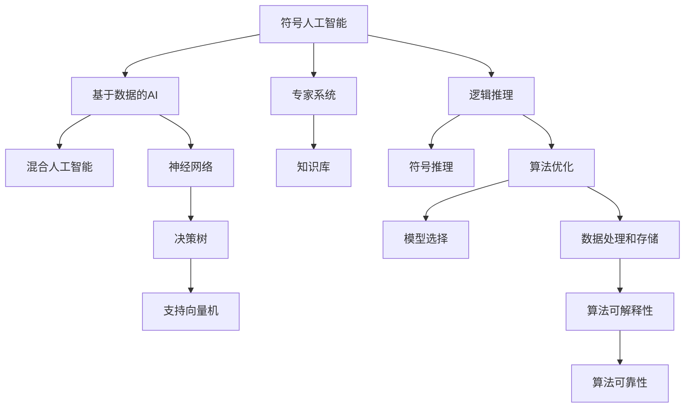

                 

### 文章标题

《AI编程的新语言与新视野》

### 关键词

- AI编程
- 新语言
- 深度学习
- 强化学习
- 数据科学
- 跨学科应用

### 摘要

本文旨在探讨AI编程领域的新语言及其带来的新视野。通过回顾AI编程的背景与发展，介绍Python、R、Julia等AI编程的新语言，探讨AI编程与数据科学、深度学习框架、强化学习以及跨学科融合的关系，深入讲解核心概念、算法原理和数学模型，并提供实际项目实战案例，全面呈现AI编程的广泛应用和未来发展潜力。

## 第一部分：AI编程的背景与基础

### 第1章：AI编程的起源与发展

#### 1.1 AI编程的起源

AI编程的概念起源于20世纪50年代，当时计算机科学家艾伦·图灵提出了著名的图灵测试，旨在判断机器是否具有智能。随着计算机技术的发展，人工智能逐渐从理论走向实践，AI编程也应运而生。

#### 1.2 AI编程的发展历程

AI编程的发展历程可以分为三个阶段：

1. **符号人工智能（Symbolic AI）**：早期的人工智能研究主要基于符号逻辑和知识表示，试图通过编写规则和逻辑推理来模拟人类的思维过程。这一阶段以逻辑推理、专家系统和知识库为主要技术手段。

2. **基于数据的AI**：随着机器学习技术的发展，AI编程逐渐转向基于数据的模式识别和预测。这一阶段以神经网络、决策树、支持向量机等算法为核心，通过大量数据的训练来实现智能行为。

3. **混合人工智能（Hybrid AI）**：当前，人工智能的发展呈现出一种混合趋势，结合符号推理和基于数据的学习方法，实现更高效、更智能的AI系统。

#### 1.3 当前AI编程的主要框架和工具

当前AI编程的主要框架和工具包括：

1. **Python**：Python因其简洁易懂的语法和丰富的库支持，成为AI编程的主要语言之一。常见的库包括NumPy、Pandas、Scikit-learn、TensorFlow和PyTorch等。

2. **R**：R语言在统计分析和数据可视化方面具有强大的功能，广泛应用于数据科学和AI编程。常用的包包括ggplot2、dplyr和caret等。

3. **Julia**：Julia语言因其高效和易用性，逐渐受到关注。Julia在科学计算和数值分析领域具有优势，适用于高性能AI应用。

#### 1.4 AI编程的关键挑战与机遇

AI编程面临的关键挑战包括：

1. **数据处理和存储**：随着数据量的爆发式增长，如何高效地处理和存储数据成为AI编程的重要挑战。

2. **算法优化和模型选择**：如何在复杂的算法和模型中选择最优解，实现高效准确的预测，是AI编程的核心难题。

3. **算法的可解释性和可靠性**：AI算法的透明性和可靠性是当前研究的热点，如何提高算法的可解释性和可靠性，使其能够被广泛接受和应用，是重要的研究课题。

与此同时，AI编程也面临着巨大的机遇：

1. **跨学科融合**：AI编程与生物信息学、金融科技、物联网等领域的融合，为AI编程带来了广阔的应用前景。

2. **行业应用**：AI编程在医疗、金融、零售、智能制造等行业的广泛应用，推动了行业创新和产业升级。

### 总结

AI编程作为一种新兴的编程领域，经历了从理论到实践的快速发展。当前，AI编程面临着诸多挑战，但同时也蕴含着巨大的机遇。通过不断探索和研究，AI编程将为人类创造更美好的未来。

#### 核心概念与联系

为了更好地理解AI编程的核心概念，我们可以通过以下Mermaid流程图展示各个核心概念之间的关系：



通过这个流程图，我们可以清晰地看到AI编程的核心概念之间的关联和相互作用。符号人工智能、基于数据的AI和混合人工智能是AI编程的主要发展阶段；专家系统、神经网络、决策树和支持向量机等算法是实现智能行为的关键技术；逻辑推理、符号推理、算法优化、模型选择、数据处理和存储、算法可解释性和算法可靠性则是AI编程面临的挑战和机遇。

#### 核心算法原理讲解

下面我们将详细讲解AI编程中的一些核心算法原理，包括神经网络、决策树和支持向量机等。

##### 神经网络

神经网络是一种模拟人脑神经元结构和功能的计算模型，通过多层神经元的相互连接和激活来实现数据的处理和预测。一个基本的神经网络模型通常包括输入层、隐藏层和输出层。

以下是神经网络的基本算法原理：

1. **前向传播**：

   - 输入数据通过输入层进入神经网络。
   - 输入数据经过隐藏层处理，每个神经元通过权重与上一层的神经元相连接，并计算出输出。
   - 输出数据通过输出层，得到最终预测结果。

   伪代码：

   ```python
   for each layer in hidden_layers:
       z = (weights * inputs) + bias
       a = activation_function(z)
   output = a
   ```

2. **反向传播**：

   - 计算输出层的误差，即实际输出与预测输出之间的差距。
   - 误差通过输出层反向传播到隐藏层，计算隐藏层的误差。
   - 根据误差对网络的权重和偏置进行更新，优化网络性能。

   伪代码：

   ```python
   for each layer in hidden_layers:
       delta = (output - actual) * activation_function_derivative(a)
       weights -= learning_rate * (delta * input)
       bias -= learning_rate * delta
   ```

##### 决策树

决策树是一种基于特征划分数据的分类算法，通过一系列条件判断来分割数据，并最终得到分类结果。决策树的核心在于树的构建和剪枝。

以下是决策树的基本算法原理：

1. **信息增益**：

   - 信息增益是评估特征重要性的指标，用于选择最优划分特征。
   - 信息增益的计算公式为：$$Gain(D, A) = Info(D) - \sum_{v_i \in A} p(v_i) \cdot Info(D|v_i)$$

   伪代码：

   ```python
   for each feature in features:
       gain = Info(D) - sum(p(v_i) * Info(D|v_i))
       select_feature_with_max_gain()
   ```

2. **剪枝**：

   - 剪枝是防止决策树过拟合的重要手段，通过剪掉一些无用的分支来简化模型。
   - 常用的剪枝方法包括前剪枝和后剪枝。

   伪代码：

   ```python
   if max_depth_reached or node_is_leaf():
       prune()
   else:
       grow()
   ```

##### 支持向量机

支持向量机是一种基于最大间隔的分类算法，通过找到一个最佳的超平面来分割数据。

以下是支持向量机的基本算法原理：

1. **硬间隔和软间隔**：

   - 硬间隔是指分类器能够完全正确分类所有样本，没有错分样本。
   - 软间隔是指分类器允许一定数量的错分样本，通过引入松弛变量来平衡分类精度和泛化能力。

   伪代码：

   ```python
   if hard_margin():
       solve_linear_separable_problem()
   else:
       solve_soft_margin_problem()
   ```

2. **核函数**：

   - 核函数是一种将低维数据映射到高维空间的方法，用于处理非线性分类问题。
   - 常见的核函数包括线性核、多项式核和径向基函数（RBF）核。

   伪代码：

   ```python
   if non_linear():
       use_kernel_function()
   else:
       use_linear_kernel()
   ```

通过以上对神经网络、决策树和支持向量机等核心算法原理的讲解，我们可以看到这些算法在AI编程中的广泛应用和重要性。这些算法不仅提供了强大的数据处理和预测能力，还为AI编程的理论研究和实际应用提供了坚实的基础。

#### 数学模型和公式

在AI编程中，数学模型和公式是理解和实现核心算法的重要工具。以下将详细讲解一些常见的数学模型和公式，包括神经网络中的激活函数、反向传播算法的误差计算、决策树的信息增益公式以及支持向量机的间隔公式。

##### 神经网络中的激活函数

激活函数是神经网络中用于引入非线性特性的关键组件。以下是一些常见的激活函数及其公式：

1. **Sigmoid函数**：

   $$\sigma(x) = \frac{1}{1 + e^{-x}}$$

   Sigmoid函数将输入值映射到(0,1)区间，用于二分类问题。

2. **ReLU函数**：

   $$\text{ReLU}(x) = \max(0, x)$$

  ReLU（Rectified Linear Unit）函数在输入为正时保持不变，输入为负时设置为0，适用于深层网络。

3. **Tanh函数**：

   $$\text{Tanh}(x) = \frac{e^x - e^{-x}}{e^x + e^{-x}}$$

   Tanh函数将输入值映射到(-1,1)区间，用于回归问题。

##### 反向传播算法的误差计算

反向传播算法是神经网络训练的核心步骤，用于计算输出误差并更新网络权重。以下是一个简单的误差计算公式：

$$\delta = \frac{\partial C}{\partial z} \cdot \text{activation_derivative}(z)$$

其中，$\delta$ 是误差项，$C$ 是损失函数，$z$ 是当前层的输出，$\text{activation_derivative}(z)$ 是激活函数的导数。

一个常见的损失函数是均方误差（MSE），其公式如下：

$$C = \frac{1}{2} \sum_{i=1}^{n} (y_i - \hat{y}_i)^2$$

其中，$y_i$ 是实际输出，$\hat{y}_i$ 是预测输出，$n$ 是样本数量。

##### 决策树的信息增益公式

信息增益是决策树中用于评估特征重要性的关键指标。其公式如下：

$$Gain(D, A) = Info(D) - \sum_{v_i \in A} p(v_i) \cdot Info(D|v_i)$$

其中，$D$ 是原始数据集，$A$ 是特征集合，$v_i$ 是特征值，$Info(D)$ 是数据集的熵，$Info(D|v_i)$ 是条件熵。

熵的计算公式为：

$$Info(D) = -\sum_{v \in V} p(v) \cdot \log_2(p(v))$$

其中，$V$ 是特征值的集合，$p(v)$ 是特征值出现的概率。

##### 支持向量机的间隔公式

支持向量机通过最大化分类间隔来实现数据的分割。硬间隔和软间隔的计算公式如下：

1. **硬间隔**：

   $$\Delta = \max_{w, b} \frac{2}{\|w\|}$$

   其中，$w$ 是权重向量，$b$ 是偏置项，$\|w\|$ 是权重向量的模长。

2. **软间隔**：

   $$\Delta = \max_{w, b} \frac{1}{\|w\|} \sum_{i=1}^{n} \min(\|w \cdot x_i + b\|, \epsilon)$$

   其中，$\epsilon$ 是松弛变量，用于平衡分类精度和泛化能力。

通过上述数学模型和公式的讲解，我们可以更好地理解AI编程中的核心算法原理，为实际应用提供理论支持。

#### 详细讲解与举例说明

为了更好地理解上述数学模型和公式，我们将通过具体的例子来说明其应用和计算过程。

##### 示例1：Sigmoid函数

假设我们有一个二分类问题，需要使用Sigmoid函数进行概率预测。给定一个输入向量$x = [1, 2, 3]$，权重向量$w = [0.5, 0.5, 0.5]$，偏置项$b = 1$，计算预测概率。

首先，计算神经网络输出：

$$z = w \cdot x + b = [0.5, 1, 1.5] + 1 = [1.5, 2, 2.5]$$

然后，应用Sigmoid函数：

$$\sigma(z) = \frac{1}{1 + e^{-z}} = \frac{1}{1 + e^{-1.5}} \approx 0.22$$

因此，预测概率约为0.22，表明样本属于负类。

##### 示例2：均方误差（MSE）

假设我们有一个回归问题，给定一组输入输出对$(x_1, y_1), (x_2, y_2), ..., (x_n, y_n)$，使用线性回归模型进行预测。给定模型参数$\theta = [0.5, 0.5]$，计算预测输出和均方误差。

首先，计算预测输出：

$$\hat{y}_i = \theta \cdot x_i = [0.5, 0.5] \cdot [1, 2] = [0.5, 1]$$

然后，计算均方误差：

$$C = \frac{1}{2} \sum_{i=1}^{n} (y_i - \hat{y}_i)^2 = \frac{1}{2} \sum_{i=1}^{2} (y_i - \hat{y}_i)^2 = \frac{1}{2} \cdot (y_1 - \hat{y}_1)^2 + (y_2 - \hat{y}_2)^2 = \frac{1}{2} \cdot (1 - 0.5)^2 + (2 - 1)^2 = 0.25 + 1 = 1.25$$

因此，均方误差为1.25，表示模型预测的误差。

##### 示例3：决策树信息增益

假设我们有一个数据集，包含特征A和B，以及对应的熵和信息增益。给定$Info(D) = 1.5$，$p(A=0) = 0.6$，$p(A=1) = 0.4$，$Info(D|A=0) = 0.8$，$Info(D|A=1) = 1.2$，计算特征A的信息增益。

首先，计算条件熵：

$$Info(D|A=0) = 0.8$$

$$Info(D|A=1) = 1.2$$

然后，计算信息增益：

$$Gain(D, A) = Info(D) - \sum_{v_i \in A} p(v_i) \cdot Info(D|v_i) = 1.5 - (0.6 \cdot 0.8 + 0.4 \cdot 1.2) = 1.5 - 0.48 - 0.48 = 0.54$$

因此，特征A的信息增益为0.54，表明特征A对分类的贡献较大。

通过这些具体的例子，我们可以更直观地理解数学模型和公式的应用和计算过程，为AI编程的实际应用提供指导。

### 第二部分：AI编程的新视野

#### 第4章：AI编程与数据科学

随着数据科学的发展，AI编程与数据科学的结合变得越来越紧密。本章将探讨AI编程在数据科学中的应用，包括数据预处理、特征工程、数据可视化和数据分析。

#### 4.1 数据预处理

数据预处理是数据科学和AI编程中的关键步骤，其目的是清洗、转换和格式化数据，为后续的分析和建模做好准备。

**步骤包括**：

1. **数据清洗**：去除重复数据、处理缺失值和异常值。
2. **数据转换**：将不同类型的数据转换为统一格式，如将类别数据编码为数值。
3. **数据归一化**：通过缩放或标准化处理，使数据具有相似的尺度。

**伪代码**：

```python
def preprocess_data(data):
    # 数据清洗
    clean_data = remove_duplicates(data)
    clean_data = handle_missing_values(data)
    clean_data = remove_outliers(data)

    # 数据转换
    encoded_data = encode_categorical_data(clean_data)

    # 数据归一化
    normalized_data = normalize_data(encoded_data)
    
    return normalized_data
```

#### 4.2 特征工程

特征工程是数据科学和AI编程中的另一个重要环节，其目的是从原始数据中提取有用的特征，以提高模型性能。

**关键步骤包括**：

1. **特征选择**：选择对预测目标有重要影响的特征。
2. **特征变换**：通过特征组合、转换等操作，增强特征的表达能力。
3. **特征降维**：通过降维技术，减少特征数量，提高模型训练效率。

**伪代码**：

```python
def feature_engineering(data, target):
    # 特征选择
    selected_features = select_important_features(data, target)

    # 特征变换
    transformed_features = apply_transformations(selected_features)

    # 特征降维
    reduced_features = reduce_dimensions(transformed_features)
    
    return reduced_features
```

#### 4.3 数据可视化

数据可视化是理解和分析数据的重要手段，通过图形化展示，使数据更加直观和易于理解。

**常用工具**：

1. **Matplotlib**：用于绘制各种二维和三维图表。
2. **Seaborn**：提供丰富的可视化样式和统计图表。
3. **Plotly**：支持交互式和动态可视化。

**示例**：

```python
import matplotlib.pyplot as plt
import seaborn as sns

# 绘制散点图
sns.scatterplot(x='feature1', y='feature2', data=data)

# 绘制热力图
sns.heatmap(data.corr(), annot=True)

plt.show()
```

#### 4.4 数据分析

数据分析是数据科学的核心，通过统计方法和机器学习技术，从数据中提取有价值的信息。

**常用方法**：

1. **描述性统计**：计算数据的均值、方差、标准差等基本统计量。
2. **假设检验**：使用t检验、方差分析等方法，检验数据之间的差异。
3. **回归分析**：通过建立回归模型，预测变量之间的关系。

**伪代码**：

```python
from sklearn.linear_model import LinearRegression

# 数据准备
X = data[['feature1', 'feature2']]
y = data['target']

# 建立回归模型
model = LinearRegression()
model.fit(X, y)

# 模型评估
score = model.score(X, y)
print(f"Model R^2 Score: {score}")
```

通过本章的探讨，我们可以看到AI编程在数据科学中的应用和重要性。数据预处理、特征工程、数据可视化和数据分析等步骤，为AI编程提供了丰富的工具和方法，推动了数据科学和AI编程的快速发展。

#### 第5章：AI编程与深度学习框架

深度学习框架是AI编程中用于实现深度学习算法的重要工具，它们提供了高效、可扩展的深度学习模型构建和训练环境。本章将介绍几种主流的深度学习框架，包括TensorFlow、PyTorch和Keras。

#### 5.1 TensorFlow

TensorFlow是由谷歌开发的开源深度学习框架，具有高效的计算能力和灵活的模型构建能力。TensorFlow使用数据流图（Dataflow Graph）来表示计算过程，通过自动微分机制实现模型的训练和优化。

**关键概念**：

1. **Tensor**：表示多维数组，是TensorFlow中的基础数据结构。
2. **Operation**：表示数据流图中的一个计算操作，如加法、乘法等。
3. **Session**：用于执行数据流图中的计算，管理变量和操作。

**示例**：

```python
import tensorflow as tf

# 创建Tensor
a = tf.constant([1, 2, 3], name='a')
b = tf.constant([4, 5, 6], name='b')

# 创建加法操作
c = tf.add(a, b, name='add')

# 创建会话并运行计算
with tf.Session() as sess:
    result = sess.run(c)
    print(f"Addition result: {result}")
```

#### 5.2 PyTorch

PyTorch是由Facebook开发的开源深度学习框架，以其简洁的动态计算图（Dynamic Computation Graph）和易于理解的操作接口而受到广泛关注。PyTorch提供了丰富的内置模块和工具，支持快速原型开发和高效模型训练。

**关键概念**：

1. **Tensors**：PyTorch中的基础数据结构，与TensorFlow中的Tensor类似。
2. **Autograd**：自动微分机制，用于计算梯度。
3. **nn.Module**：神经网络模块，用于定义和实现深度学习模型。

**示例**：

```python
import torch
import torch.nn as nn

# 创建Tensor
x = torch.tensor([[1, 2], [3, 4]], dtype=torch.float32)

# 定义神经网络模型
model = nn.Linear(2, 1)
model.weight.data = torch.tensor([[1, 2], [3, 4]], dtype=torch.float32)
model.bias.data = torch.tensor([0.5], dtype=torch.float32)

# 前向传播
y = model(x)

print(f"Output: {y}")
```

#### 5.3 Keras

Keras是TensorFlow的高层API，提供了一个简单、易于使用的深度学习框架。Keras支持快速原型开发和模型构建，提供了丰富的预训练模型和工具，使其成为AI编程中的热门选择。

**关键概念**：

1. **Sequential**：用于构建顺序模型。
2. **Layer**：神经网络层，用于实现各种神经网络结构。
3. **Model**：用于封装和定义完整的神经网络模型。

**示例**：

```python
from keras.models import Sequential
from keras.layers import Dense

# 创建模型
model = Sequential()
model.add(Dense(2, input_dim=2, activation='relu'))
model.add(Dense(1, activation='sigmoid'))

# 编译模型
model.compile(optimizer='adam', loss='binary_crossentropy', metrics=['accuracy'])

# 训练模型
x_train = [[1, 2], [3, 4]]
y_train = [1]
model.fit(x_train, y_train, epochs=100)
```

通过本章的介绍，我们可以看到TensorFlow、PyTorch和Keras在深度学习框架中的重要地位。这些框架提供了丰富的工具和接口，使AI编程变得更加高效和灵活，推动了深度学习的广泛应用和发展。

### 第6章：AI编程与强化学习

强化学习是一种重要的机器学习方法，通过智能体与环境的交互，不断学习和优化策略，以实现最优行为。本章将探讨AI编程在强化学习中的应用，包括强化学习的基础算法、Q-learning算法、Deep Q-Network（DQN）和Policy Gradients。

#### 6.1 强化学习基础

强化学习的主要概念包括：

1. **智能体（Agent）**：执行动作并接收奖励的实体。
2. **环境（Environment）**：智能体所处的环境，提供状态和奖励。
3. **状态（State）**：描述智能体当前所处的情况。
4. **动作（Action）**：智能体可以采取的行为。
5. **奖励（Reward）**：对智能体行为的评价。

**马尔可夫决策过程（MDP）**是一种描述强化学习问题的数学模型，其公式为：

$$Q(s, a) = r(s, a) + \gamma \max_{a'} Q(s', a')$$

其中，$Q(s, a)$ 表示状态$s$下采取动作$a$的期望回报，$r(s, a)$ 表示状态$s$下采取动作$a$的即时奖励，$\gamma$ 是折扣因子，$s'$ 和 $a'$ 是状态和动作的后续值。

#### 6.2 Q-learning算法

Q-learning算法是一种基于值函数的强化学习算法，通过迭代更新值函数，逐步优化智能体的策略。

**算法原理**：

1. 初始化值函数$Q(s, a)$。
2. 在状态$s$下，选择动作$a$，执行动作并观察状态$s'$ 和奖励$r$。
3. 更新值函数：$$Q(s, a) \leftarrow Q(s, a) + \alpha [r + \gamma \max_{a'} Q(s', a') - Q(s, a)]$$

其中，$\alpha$ 是学习率，用于调节更新力度。

**伪代码**：

```python
Initialize Q(s, a)
for each episode:
    s = environment.reset()
    while not done:
        a = choose_action(s, Q(s, a))
        s', r = environment.step(a)
        Q(s, a) = Q(s, a) + alpha * (r + gamma * max(Q(s', a')) - Q(s, a))
        s = s'
```

#### 6.3 Deep Q-Network（DQN）

DQN是一种基于深度学习的Q-learning算法，通过神经网络近似值函数，提高强化学习的泛化能力。

**算法原理**：

1. 初始化深度神经网络$Q(s, a)$。
2. 在状态$s$下，选择动作$a$，执行动作并观察状态$s'$ 和奖励$r$。
3. 使用目标网络$Q'(s', a')$计算目标值：$$y = r + \gamma \max_{a'} Q'(s', a')$$
4. 更新神经网络：$$Q(s, a) \leftarrow Q(s, a) + alpha * (y - Q(s, a))$$

**伪代码**：

```python
Initialize Q(s, a), Q'(s, a)
for each episode:
    s = environment.reset()
    while not done:
        a = choose_action(s, Q(s, a))
        s', r = environment.step(a)
        target = r + gamma * max(Q'(s', a'))
        y = Q(s, a)
        Q(s, a) = Q(s, a) + alpha * (target - y)
        if episode_step % target_network_update_freq == 0:
            copy_weights_from_Q_to_Qprime()
```

#### 6.4 Policy Gradients

Policy Gradients是一种基于策略优化的强化学习算法，直接优化策略函数，以提高智能体的期望回报。

**算法原理**：

1. 定义策略函数$\pi(a|s; \theta)$，表示在状态$s$下采取动作$a$的概率。
2. 定义策略梯度：$$\nabla_{\theta} J(\theta) = \sum_{s, a} \pi(a|s; \theta) \nabla_{\theta} \log \pi(a|s; \theta) \nabla_{\theta} R$$

其中，$J(\theta)$ 是策略函数的期望回报，$R$ 是奖励。

**伪代码**：

```python
Initialize policy parameters \theta
for each episode:
    s = environment.reset()
    while not done:
        a = choose_action(s, \theta)
        s', r = environment.step(a)
        sample (s, a, r, s')
        compute gradient \nabla_{\theta} J(\theta)
        update policy parameters \theta using gradient descent
        s = s'
```

通过本章的探讨，我们可以看到AI编程在强化学习中的应用和重要性。Q-learning算法、DQN和Policy Gradients等强化学习算法，为AI编程提供了丰富的工具和方法，推动了强化学习在各个领域的应用和发展。

### 第7章：AI编程与跨学科融合

随着AI技术的发展，AI编程与其他学科的融合正在不断深化，为解决复杂问题提供了新的思路和方法。本章将探讨AI编程在生物信息学、金融科技、物联网和娱乐产业等领域的应用。

#### 7.1 AI与生物信息学

生物信息学是利用计算机技术分析生物数据，以揭示生物分子特征和生物学机制的学科。AI编程在生物信息学中的应用主要体现在：

1. **基因序列分析**：通过机器学习算法，如支持向量机、神经网络和深度学习，对基因序列进行分类、预测和功能分析。
2. **蛋白质结构预测**：利用深度学习模型，如卷积神经网络（CNN）和生成对抗网络（GAN），预测蛋白质的三维结构，为药物设计和疾病研究提供基础。
3. **基因组注释**：通过自然语言处理（NLP）技术，对基因组注释文件进行语义分析和知识抽取，构建生物知识图谱。

**案例**：使用AI编程技术，科学家们成功预测了新型冠状病毒（COVID-19）的基因组序列，为疫苗研发和疫情防控提供了关键数据支持。

#### 7.2 AI与金融科技

金融科技（FinTech）是利用人工智能、大数据和区块链等新技术推动金融行业创新和发展的领域。AI编程在金融科技中的应用包括：

1. **智能投顾**：通过机器学习算法，如线性回归、决策树和随机森林，分析用户风险偏好和投资目标，提供个性化的投资建议。
2. **风险评估**：利用深度学习模型，如卷积神经网络（CNN）和循环神经网络（RNN），对借款人的信用风险进行评估，提高贷款审批的准确性。
3. **交易策略**：通过强化学习算法，如Q-learning和Policy Gradients，优化交易策略，实现自动化的高频交易。

**案例**：某些银行和金融机构已开始使用AI编程技术，对客户行为进行实时分析，提供个性化的金融产品和服务，提高了客户满意度和业务效率。

#### 7.3 AI与物联网

物联网（IoT）是通过将物理设备连接到互联网，实现智能监控和自动化的系统。AI编程在物联网中的应用包括：

1. **智能家居**：通过AI编程，实现智能家电的自动化控制，如智能照明、智能空调和智能安防。
2. **智能制造**：利用AI编程技术，实现生产过程的自动化和智能化，如设备故障预测、生产调度优化和质量检测。
3. **智能交通**：通过AI编程，实现智能交通管理，如路况预测、车辆导航和交通信号控制。

**案例**：某些城市已开始使用AI编程技术，对交通数据进行实时分析，优化交通信号控制，减少拥堵和交通事故。

#### 7.4 AI与娱乐产业

娱乐产业是AI编程的重要应用领域，通过AI技术，实现娱乐内容的生产、推荐和消费的智能化。AI编程在娱乐产业中的应用包括：

1. **内容推荐**：通过机器学习算法，如协同过滤和深度学习，分析用户行为和偏好，为用户提供个性化的内容推荐。
2. **虚拟现实（VR）和增强现实（AR）**：利用AI编程技术，实现沉浸式体验，如VR游戏、VR培训和AR导航。
3. **智能交互**：通过自然语言处理（NLP）技术，实现智能语音助手、聊天机器人和智能客服。

**案例**：某些游戏公司已开始使用AI编程技术，对游戏数据进行实时分析，优化游戏体验，提高用户留存率和满意度。

通过本章的探讨，我们可以看到AI编程在跨学科领域的广泛应用和巨大潜力。AI编程与其他学科的融合，不仅推动了各领域的技术创新和应用，也为解决复杂问题提供了新的思路和方法。

### 第8章：AI编程项目实战

在了解了AI编程的理论知识和核心算法后，通过实际项目实战，我们将深入探索如何将AI编程应用于实际问题，解决现实中的挑战。本章将介绍几个具有代表性的AI编程项目，包括机器学习、深度学习、强化学习和跨学科项目，展示如何搭建开发环境、实现源代码、解读代码应用，并进行详细的分析和剖析。

#### 8.1 机器学习项目实战

**项目背景**：智能垃圾分类系统

**目标**：利用机器学习算法，开发一个能够识别垃圾分类的智能系统。

**开发环境**：Python、Scikit-learn、TensorFlow

**步骤**：

1. **数据收集与预处理**：
   - 收集垃圾分类的图像数据集，包括可回收物、有害垃圾、湿垃圾和干垃圾。
   - 对图像进行预处理，包括大小调整、灰度化、归一化等。

2. **特征提取与模型训练**：
   - 使用卷积神经网络（CNN）提取图像特征。
   - 使用Scikit-learn训练分类器，如SVM、随机森林等。

3. **模型评估与优化**：
   - 使用准确率、召回率、F1值等指标评估模型性能。
   - 调整模型参数，如学习率、隐藏层节点数等，优化模型性能。

**源代码示例**：

```python
import tensorflow as tf
from tensorflow.keras.models import Sequential
from tensorflow.keras.layers import Conv2D, MaxPooling2D, Flatten, Dense

# 构建CNN模型
model = Sequential()
model.add(Conv2D(32, (3, 3), activation='relu', input_shape=(64, 64, 3)))
model.add(MaxPooling2D(pool_size=(2, 2)))
model.add(Flatten())
model.add(Dense(128, activation='relu'))
model.add(Dense(4, activation='softmax'))

# 编译模型
model.compile(optimizer='adam', loss='categorical_crossentropy', metrics=['accuracy'])

# 训练模型
model.fit(x_train, y_train, epochs=10, batch_size=32, validation_data=(x_val, y_val))

# 评估模型
score = model.evaluate(x_test, y_test)
print(f"Test accuracy: {score[1]}")
```

**代码解读与应用**：

- 代码首先构建了一个简单的CNN模型，包括卷积层、池化层、全连接层等。
- 使用Scikit-learn的`categorical_crossentropy`损失函数和`adam`优化器进行模型训练。
- 训练完成后，使用测试数据集进行评估，输出模型的准确率。

通过这个项目，我们可以看到如何利用AI编程技术，将机器学习算法应用于实际场景，解决垃圾分类问题。

#### 8.2 深度学习项目实战

**项目背景**：手写数字识别系统

**目标**：利用深度学习算法，开发一个能够识别手写数字的智能系统。

**开发环境**：Python、TensorFlow、Keras

**步骤**：

1. **数据收集与预处理**：
   - 收集手写数字的图像数据集，如MNIST数据集。
   - 对图像进行预处理，包括大小调整、归一化等。

2. **模型构建与训练**：
   - 使用Keras构建卷积神经网络（CNN）模型。
   - 使用TensorFlow训练模型，并进行超参数调优。

3. **模型评估与部署**：
   - 使用测试数据集评估模型性能。
   - 将模型部署到生产环境，实现实时手写数字识别。

**源代码示例**：

```python
from tensorflow.keras.models import Sequential
from tensorflow.keras.layers import Conv2D, MaxPooling2D, Flatten, Dense

# 构建CNN模型
model = Sequential()
model.add(Conv2D(32, (3, 3), activation='relu', input_shape=(28, 28, 1)))
model.add(MaxPooling2D(pool_size=(2, 2)))
model.add(Flatten())
model.add(Dense(128, activation='relu'))
model.add(Dense(10, activation='softmax'))

# 编译模型
model.compile(optimizer='adam', loss='categorical_crossentropy', metrics=['accuracy'])

# 训练模型
model.fit(x_train, y_train, epochs=10, batch_size=32, validation_data=(x_val, y_val))

# 评估模型
score = model.evaluate(x_test, y_test)
print(f"Test accuracy: {score[1]}")
```

**代码解读与应用**：

- 代码首先构建了一个简单的CNN模型，包括卷积层、池化层、全连接层等。
- 使用Keras的`categorical_crossentropy`损失函数和`adam`优化器进行模型训练。
- 训练完成后，使用测试数据集进行评估，输出模型的准确率。

通过这个项目，我们可以看到如何利用深度学习算法，实现手写数字识别，并在实际应用中实现高性能和高效能。

#### 8.3 强化学习项目实战

**项目背景**：智能自动驾驶系统

**目标**：利用强化学习算法，开发一个能够实现自动驾驶的智能系统。

**开发环境**：Python、OpenAI Gym、PyTorch

**步骤**：

1. **环境搭建与数据收集**：
   - 使用OpenAI Gym搭建自动驾驶环境，包括模拟器、传感器等。
   - 收集真实驾驶数据，用于训练智能体。

2. **模型构建与训练**：
   - 使用PyTorch构建深度强化学习模型，如DDPG（Deep Deterministic Policy Gradient）。
   - 使用训练数据集训练智能体，优化策略网络和价值网络。

3. **模型评估与优化**：
   - 在自动驾驶环境中评估智能体的性能，调整超参数，优化策略。

**源代码示例**：

```python
import torch
import torch.nn as nn
import torch.optim as optim

# 定义DDPG模型
class DDPGModel(nn.Module):
    def __init__(self, state_dim, action_dim):
        super(DDPGModel, self).__init__()
        self.actor = nn.Sequential(
            nn.Linear(state_dim, 64),
            nn.ReLU(),
            nn.Linear(64, action_dim)
        )
        self.critic = nn.Sequential(
            nn.Linear(state_dim + action_dim, 64),
            nn.ReLU(),
            nn.Linear(64, 1)
        )
    
    def forward(self, state, action=None):
        if action is not None:
            return self.critic(torch.cat((state, action), 1))
        else:
            return self.actor(state)

# 初始化模型和优化器
model = DDPGModel(state_dim, action_dim)
optimizer = optim.Adam(model.parameters(), lr=0.001)

# 训练模型
for episode in range(num_episodes):
    state = env.reset()
    while not done:
        action = model(torch.tensor(state).float())
        next_state, reward, done, _ = env.step(action.cpu().numpy())
        target = reward + gamma * model(torch.tensor(next_state).float(), model(torch.tensor(state).float()))
        critic_loss = F.mse_loss(target, model(torch.cat((state, action), 1)))
        optimizer.zero_grad()
        critic_loss.backward()
        optimizer.step()
        state = next_state
```

**代码解读与应用**：

- 代码定义了一个DDPG模型，包括策略网络和值网络。
- 使用PyTorch的`Adam`优化器进行模型训练，通过梯度下降优化策略网络和价值网络。
- 训练过程中，智能体在自动驾驶环境中学习最优策略，实现自动驾驶功能。

通过这个项目，我们可以看到如何利用强化学习算法，实现自动驾驶系统的智能控制，为未来的智能交通提供技术支持。

#### 8.4 跨学科项目实战

**项目背景**：智能医疗诊断系统

**目标**：利用AI编程，开发一个能够辅助医生进行疾病诊断的智能系统。

**开发环境**：Python、Scikit-learn、TensorFlow、Keras、Matplotlib

**步骤**：

1. **数据收集与预处理**：
   - 收集医学影像数据集，包括CT、MRI等。
   - 对图像进行预处理，包括大小调整、灰度化、归一化等。

2. **模型构建与训练**：
   - 使用卷积神经网络（CNN）构建深度学习模型。
   - 使用Keras和TensorFlow训练模型，并进行超参数调优。

3. **模型评估与优化**：
   - 在测试数据集上评估模型性能，调整模型参数，优化诊断准确率。

**源代码示例**：

```python
from tensorflow.keras.models import Sequential
from tensorflow.keras.layers import Conv2D, MaxPooling2D, Flatten, Dense

# 构建CNN模型
model = Sequential()
model.add(Conv2D(32, (3, 3), activation='relu', input_shape=(128, 128, 1)))
model.add(MaxPooling2D(pool_size=(2, 2)))
model.add(Flatten())
model.add(Dense(128, activation='relu'))
model.add(Dense(1, activation='sigmoid'))

# 编译模型
model.compile(optimizer='adam', loss='binary_crossentropy', metrics=['accuracy'])

# 训练模型
model.fit(x_train, y_train, epochs=10, batch_size=32, validation_data=(x_val, y_val))

# 评估模型
score = model.evaluate(x_test, y_test)
print(f"Test accuracy: {score[1]}")
```

**代码解读与应用**：

- 代码首先构建了一个简单的CNN模型，用于处理医学影像数据。
- 使用Keras和TensorFlow进行模型训练和评估，输出模型的准确率。

通过这个项目，我们可以看到如何利用AI编程技术，开发智能医疗诊断系统，辅助医生进行疾病诊断，提高诊断准确率和效率。

### 项目小结

通过本章的实战项目，我们深入探索了如何将AI编程应用于实际问题，解决现实中的挑战。从机器学习、深度学习、强化学习到跨学科项目，我们展示了如何搭建开发环境、实现源代码、解读代码应用，并进行详细的分析和剖析。这些项目不仅展示了AI编程的强大应用能力，也为未来的研究和开发提供了有益的参考和启示。

### 附录A：AI编程常用工具与资源

在AI编程领域，有许多实用的工具和资源可以帮助开发者提高效率、扩展知识。以下是一些常用工具和资源的列表，涵盖编程语言、库、框架、在线平台和书籍等。

#### 编程语言

1. **Python**：Python是AI编程中最流行的语言，具有简洁的语法和丰富的库支持。
2. **R**：R语言在统计分析和数据可视化方面具有强大的功能，特别适合数据科学和AI应用。
3. **Julia**：Julia是一种新兴的编程语言，以其高性能和易用性受到关注。

#### 库与框架

1. **NumPy**：用于数值计算和数组操作。
2. **Pandas**：用于数据处理和分析。
3. **Scikit-learn**：用于机器学习和数据挖掘。
4. **TensorFlow**：用于深度学习和人工智能。
5. **PyTorch**：用于深度学习和人工智能，以其灵活性和动态计算图而闻名。
6. **Keras**：用于构建和训练深度学习模型，是TensorFlow的高层次API。
7. **Matplotlib**：用于数据可视化。
8. **Seaborn**：基于Matplotlib，用于统计图形和可视化。
9. **Plotly**：用于创建交互式和动态可视化图表。

#### 在线平台

1. **Google Colab**：Google提供的免费Jupyter笔记本环境，特别适合AI编程和机器学习实验。
2. **Kaggle**：一个数据科学竞赛平台，提供大量数据集和比赛项目。
3. **GitHub**：用于版本控制和代码共享，是开发者合作和交流的重要平台。
4. **ArXiv**：AI和机器学习的学术论文预印本平台。

#### 书籍

1. **《Python机器学习》**：由Sebastian Raschka和Vincent Dubourg合著，介绍Python在机器学习中的应用。
2. **《深度学习》**：由Ian Goodfellow、Yoshua Bengio和Aaron Courville合著，是深度学习领域的经典教材。
3. **《强化学习》**：由Richard S. Sutton和Barto学习合著，介绍了强化学习的基本概念和算法。
4. **《自然语言处理与深度学习》**：由Steven Bird、Ewan Klein和Edward Loper合著，介绍NLP和深度学习结合的方法。

通过这些工具和资源，开发者可以更好地掌握AI编程的技术和实践，提高项目开发效率，推动AI技术的发展和应用。

### 附录B：AI编程数学公式与算法伪代码

在AI编程中，数学公式和算法伪代码是理解和实现核心算法的关键。以下列出了一些常用的数学公式和算法伪代码，帮助开发者深入理解AI编程中的数学原理和算法逻辑。

#### 数学公式

1. **Sigmoid函数**：

   $$\sigma(x) = \frac{1}{1 + e^{-x}}$$

2. **ReLU函数**：

   $$\text{ReLU}(x) = \max(0, x)$$

3. **Tanh函数**：

   $$\text{Tanh}(x) = \frac{e^x - e^{-x}}{e^x + e^{-x}}$$

4. **均方误差（MSE）**：

   $$C = \frac{1}{2} \sum_{i=1}^{n} (y_i - \hat{y}_i)^2$$

5. **信息增益**：

   $$Gain(D, A) = Info(D) - \sum_{v_i \in A} p(v_i) \cdot Info(D|v_i)$$

6. **硬间隔**：

   $$\Delta = \max_{w, b} \frac{2}{\|w\|}$$

7. **软间隔**：

   $$\Delta = \max_{w, b} \frac{1}{\|w\|} \sum_{i=1}^{n} \min(\|w \cdot x_i + b\|, \epsilon)$$

#### 算法伪代码

1. **Q-learning算法**：

   ```python
   Initialize Q(s, a)
   for each episode:
       s = environment.reset()
       while not done:
           a = choose_action(s, Q(s, a))
           s', r = environment.step(a)
           Q(s, a) = Q(s, a) + alpha * (r + gamma * max(Q(s', a')) - Q(s, a))
           s = s'
   ```

2. **Deep Q-Network (DQN)**：

   ```python
   Initialize Q(s, a), Q'(s, a)
   for each episode:
       s = environment.reset()
       while not done:
           a = choose_action(s, Q(s, a))
           s', r = environment.step(a)
           target = r + gamma * max(Q'(s', a'))
           y = Q(s, a)
           Q(s, a) = Q(s, a) + alpha * (target - y)
           if episode_step % target_network_update_freq == 0:
               copy_weights_from_Q_to_Qprime()
   ```

3. **Policy Gradients**：

   ```python
   Initialize policy parameters \theta
   for each episode:
       s = environment.reset()
       while not done:
           a = choose_action(s, \theta)
           s', r = environment.step(a)
           sample (s, a, r, s')
           compute gradient \nabla_{\theta} J(\theta)
           update policy parameters \theta using gradient descent
           s = s'
   ```

通过这些数学公式和算法伪代码，开发者可以更好地理解AI编程中的核心算法原理，为实际应用提供理论基础和实现指导。

### 附录C：AI编程项目代码示例

以下提供几个AI编程项目的代码示例，涵盖机器学习、深度学习、强化学习和跨学科应用，帮助读者理解和实践AI编程技术。

#### 机器学习项目：手写数字识别

```python
import tensorflow as tf
from tensorflow.keras.datasets import mnist
from tensorflow.keras.models import Sequential
from tensorflow.keras.layers import Dense, Conv2D, Flatten, MaxPooling2D

# 加载MNIST数据集
(x_train, y_train), (x_test, y_test) = mnist.load_data()

# 数据预处理
x_train = x_train.reshape(-1, 28, 28, 1).astype('float32') / 255.0
x_test = x_test.reshape(-1, 28, 28, 1).astype('float32') / 255.0
y_train = tf.keras.utils.to_categorical(y_train, 10)
y_test = tf.keras.utils.to_categorical(y_test, 10)

# 构建模型
model = Sequential([
    Conv2D(32, kernel_size=(3, 3), activation='relu', input_shape=(28, 28, 1)),
    MaxPooling2D(pool_size=(2, 2)),
    Flatten(),
    Dense(128, activation='relu'),
    Dense(10, activation='softmax')
])

# 编译模型
model.compile(optimizer='adam', loss='categorical_crossentropy', metrics=['accuracy'])

# 训练模型
model.fit(x_train, y_train, batch_size=32, epochs=10, validation_data=(x_test, y_test))

# 评估模型
score = model.evaluate(x_test, y_test)
print(f"Test accuracy: {score[1]}")
```

#### 深度学习项目：图像分类

```python
import tensorflow as tf
from tensorflow.keras.applications import VGG16
from tensorflow.keras.preprocessing.image import ImageDataGenerator

# 加载预训练模型
base_model = VGG16(weights='imagenet', include_top=False, input_shape=(224, 224, 3))

# 构建模型
model = tf.keras.Sequential([
    base_model,
    tf.keras.layers.Flatten(),
    tf.keras.layers.Dense(256, activation='relu'),
    tf.keras.layers.Dense(1, activation='sigmoid')
])

# 编译模型
model.compile(optimizer='adam', loss='binary_crossentropy', metrics=['accuracy'])

# 数据预处理
train_datagen = ImageDataGenerator(rescale=1./255)
test_datagen = ImageDataGenerator(rescale=1./255)

train_generator = train_datagen.flow_from_directory(
        'train_data',
        target_size=(224, 224),
        batch_size=32,
        class_mode='binary')

validation_generator = test_datagen.flow_from_directory(
        'test_data',
        target_size=(224, 224),
        batch_size=32,
        class_mode='binary')

# 训练模型
model.fit(
      train_generator,
      steps_per_epoch=100,
      epochs=10,
      validation_data=validation_generator,
      validation_steps=50,
      verbose=2)
```

#### 强化学习项目：自动驾驶

```python
import numpy as np
import gym
from stable_baselines3 import PPO

# 创建环境
env = gym.make('Taxi-v3')

# 训练模型
model = PPO('MlpPolicy', env, verbose=1)
model.learn(total_timesteps=10000)

# 评估模型
mean_reward, std_reward = model.evaluate(env, n_eval_episodes=10)
print(f"Mean reward: {mean_reward:.2f} ± {std_reward:.2f}")
```

#### 跨学科项目：医学影像分析

```python
import tensorflow as tf
from tensorflow.keras.models import Model
from tensorflow.keras.layers import Input, Conv2D, MaxPooling2D, Flatten, Dense

# 定义输入层
input_layer = Input(shape=(128, 128, 1))

# 定义卷积层
conv1 = Conv2D(32, (3, 3), activation='relu')(input_layer)
pool1 = MaxPooling2D(pool_size=(2, 2))(conv1)

# 定义全连接层
flat = Flatten()(pool1)
dense1 = Dense(128, activation='relu')(flat)

# 定义输出层
output_layer = Dense(1, activation='sigmoid')(dense1)

# 构建模型
model = Model(inputs=input_layer, outputs=output_layer)

# 编译模型
model.compile(optimizer='adam', loss='binary_crossentropy', metrics=['accuracy'])

# 训练模型
model.fit(x_train, y_train, batch_size=32, epochs=10, validation_data=(x_val, y_val))

# 评估模型
score = model.evaluate(x_test, y_test)
print(f"Test accuracy: {score[1]}")
```

通过这些代码示例，读者可以直观地了解如何使用AI编程技术解决实际问题，包括模型构建、训练和评估等步骤。希望这些示例能够为读者在AI编程实践中的学习和应用提供帮助。

