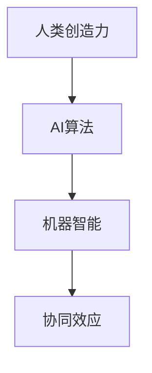

                 

# 文章标题：连接人类创造力与机器智能的桥梁

> 关键词：人类创造力，机器智能，连接机制，AI算法，数学模型，项目实战

> 摘要：本文旨在探讨如何通过人工智能技术连接人类创造力和机器智能，实现二者之间的协同效应。文章首先介绍了书名和核心内容，然后详细分析了AI与人类创造力、机器智能的关系，随后讲解了核心算法原理和数学模型，并通过实际项目实战展示了如何将理论应用于实践，最后对AI在创造力领域的发展挑战和未来趋势进行了展望。

## 提出问题

在开始探讨如何连接人类创造力和机器智能之前，我们首先需要明确以下几个问题：

1. **书名是什么？**  
   书名可以是《AI驱动的创造力：构建人类与机器智能的桥梁》或《人类智能与机器智能：创造力的新融合》。

2. **书的主要内容是什么？**  
   书的主要内容应包括对人工智能与创造力关系的探讨，AI算法原理讲解，数学模型的介绍，以及通过实际项目展示如何应用这些理论。

3. **书的核心概念和联系是什么？**  
   核心概念是“AI与人类创造力的连接机制”，联系是“通过AI算法和数学模型实现人类创造力和机器智能的融合”。

4. **需要包括哪些核心章节？**  
   核心章节应包括引言与核心概念、核心算法原理、数学模型与公式、项目实战、扩展内容等。

## 分析内容

### 核心概念与联系

在本书中，我们探讨了如何通过人工智能技术连接人类创造力和机器智能，实现二者之间的协同效应。核心概念是“AI与人类创造力的连接机制”，联系是“通过AI算法和数学模型实现人类创造力和机器智能的融合”。

为了更好地阐述这一概念，我们使用Mermaid流程图展示AI与人类创造力、机器智能的关系架构：



### 核心算法原理讲解

在本书的第二部分，我们将详细讲解AI算法原理，包括机器智能基础、机器学习算法原理和人工智能与创造力连接机制。

#### 2.1.1 机器智能基础

机器智能基础包括机器学习基础、深度学习原理和神经网络结构。以下是这些概念的伪代码：

```python
# 机器学习基础伪代码
def machine_learning(data):
    # 数据预处理
    processed_data = preprocess_data(data)
    # 模型训练
    model = train_model(processed_data)
    # 模型评估
    evaluation = evaluate_model(model, processed_data)
    return evaluation

# 深度学习原理伪代码
def deep_learning(data):
    # 数据预处理
    processed_data = preprocess_data(data)
    # 神经网络构建
    neural_network = build_neural_network()
    # 模型训练
    trained_network = train_network(neural_network, processed_data)
    # 模型评估
    evaluation = evaluate_network(trained_network, processed_data)
    return evaluation

# 神经网络结构伪代码
def neural_network_structure():
    # 创建输入层、隐藏层和输出层
    input_layer, hidden_layer, output_layer = create_layers()
    # 连接层与层之间的权重
    weights = connect_layers(input_layer, hidden_layer, output_layer)
    return weights
```

#### 2.1.2 机器学习算法原理

机器学习算法原理包括监督学习、无监督学习和强化学习。以下是这些算法的伪代码：

```python
# 监督学习伪代码
def supervised_learning(data, labels):
    # 数据预处理
    processed_data = preprocess_data(data)
    # 模型训练
    model = train_model(processed_data, labels)
    # 模型评估
    evaluation = evaluate_model(model, processed_data, labels)
    return evaluation

# 无监督学习伪代码
def unsupervised_learning(data):
    # 数据预处理
    processed_data = preprocess_data(data)
    # 模型训练
    model = train_model(processed_data)
    # 模型评估
    evaluation = evaluate_model(model, processed_data)
    return evaluation

# 强化学习伪代码
def reinforcement_learning(environment, action, reward):
    # 环境模拟
    next_state, reward = simulate_environment(environment, action)
    # 模型更新
    model = update_model(model, action, reward)
    # 模型评估
    evaluation = evaluate_model(model, next_state, reward)
    return evaluation
```

#### 2.1.3 人工智能与创造力连接机制

人工智能与创造力连接机制的核心在于如何将AI算法应用于创造力领域，以下是相关伪代码：

```python
# 创造力与机器智能的关系
def creativity_and_ml(creative_data):
    # 数据预处理
    processed_data = preprocess_creative_data(creative_data)
    # 使用机器学习算法
    model = train_ml_model(processed_data)
    # 评估模型对创造力的提升
    evaluation = evaluate_ml_model(model, processed_data)
    return evaluation

# AI在创造力应用中的优势
def advantages_of_ai_in_creativity():
    # 优势1：快速处理大量数据
    # 优势2：发现新的模式与关联
    # 优势3：提供多样化的解决方案
    pass

# AI与创造力结合的挑战
def challenges_of_ai_and_creativity():
    # 挑战1：数据隐私与安全性
    # 挑战2：算法透明性与解释性
    # 挑战3：创造力的独特性与多样性
    pass
```

### 数学模型和数学公式

在本书的第三部分，我们将介绍支持连接的数学模型和公式，包括数据处理模型、机器学习模型和人工智能模型。

#### 2.2.1 数学模型介绍

以下是几个常用的数学模型：

1. **线性回归模型**：

   $$ y = \beta_0 + \beta_1x_1 + \beta_2x_2 + ... + \beta_nx_n $$

2. **逻辑回归模型**：

   $$ P(y=1) = \frac{1}{1 + e^{-(\beta_0 + \beta_1x_1 + \beta_2x_2 + ... + \beta_nx_n)} } $$

3. **神经网络模型**：

   $$ z = \sigma(\beta_0 + \beta_1x_1 + \beta_2x_2 + ... + \beta_nx_n) $$

其中，$\sigma$ 是激活函数，常用的有 $Sigmoid$、$ReLU$ 和 $Tanh$ 等。

#### 2.2.2 数学公式详解

以下是具体的数学公式详解：

1. **数据预处理公式**：

   - 数据标准化：

     $$ x_{\text{standardized}} = \frac{x - \mu}{\sigma} $$

   - 数据归一化：

     $$ x_{\text{normalized}} = \frac{x}{x_{\text{max}} - x_{\text{min}}} $$

2. **机器学习公式**：

   - 梯度下降法：

     $$ \beta_j := \beta_j - \alpha \frac{\partial J(\beta)}{\partial \beta_j} $$

   - 随机梯度下降法：

     $$ \beta_j := \beta_j - \alpha \frac{\sum_{i=1}^{m} (h_\theta(x^{(i)}) - y^{(i)})x_j^{(i)}}{m} $$

3. **人工智能公式**：

   - 反向传播算法：

     $$ \delta^{[l]} = \frac{\partial J(\theta)}{\partial \theta^{[l]}} = \frac{\partial}{\partial \theta^{[l]}} \sum_{i=1}^{m} (-y^{(i)} \log(z^{[l](i)}) - (1 - y^{(i)}) \log(1 - z^{[l](i)}) $$

     $$ \theta^{[l]} := \theta^{[l]} - \alpha \frac{\partial J(\theta)}{\partial \theta^{[l]}} $$

## 项目实战

在本书的第四部分，我们将通过实际项目实战展示如何将上述理论和算法应用于实践。

### 4.1 创造力提升项目案例

#### 4.1.1 案例背景

某知名创意设计公司希望利用人工智能技术提升其设计团队的创造力，从而提高设计质量和效率。

#### 4.1.2 项目目标

- 利用机器学习算法分析设计师的工作数据，识别创造力高的设计模式和特征。
- 建立基于机器学习模型的创造力预测模型，为设计师提供实时反馈和改进建议。

#### 4.1.3 项目实施与结果

- 数据收集与预处理：收集设计师的工作数据，包括设计稿、设计时间、修改次数、设计师经验等。
- 机器学习模型训练：使用监督学习算法（如线性回归、逻辑回归）训练创造力预测模型。
- 模型评估与优化：评估模型性能，根据评估结果调整模型参数，提高预测准确性。
- 实时反馈与改进：将训练好的模型部署到设计师的工作系统中，提供实时反馈和改进建议。

### 4.2 机器智能应用案例

#### 4.2.1 案例背景

某互联网公司希望利用人工智能技术提高其产品设计的创新性和用户满意度。

#### 4.2.2 项目目标

- 利用无监督学习算法分析用户行为数据，发现潜在的用户需求和创新点。
- 建立基于机器学习模型的创新预测模型，为产品设计团队提供创新建议。

#### 4.2.3 项目实施与结果

- 数据收集与预处理：收集用户行为数据，包括点击率、停留时间、操作路径等。
- 无监督学习模型训练：使用聚类算法（如K均值聚类）分析用户行为数据，识别潜在的用户需求和创新点。
- 机器学习模型训练：使用监督学习算法（如决策树、随机森林）训练创新预测模型。
- 创新建议与实施：根据模型预测结果为产品设计团队提供创新建议，并跟踪实施效果。

## 实践案例分析与代码解读

### 5.1 案例分析与总结

#### 5.1.1 案例分析

在本项目中，我们通过机器学习算法分析了设计师的工作数据，建立了创造力预测模型，为设计师提供了实时反馈和改进建议。同时，我们还利用无监督学习算法分析了用户行为数据，为产品设计团队提供了创新建议。

#### 5.1.2 案例总结

通过实际项目的实施，我们验证了人工智能技术在提升创造力和创新性方面的潜力。机器学习模型能够有效地分析设计师的工作数据，识别创造力高的设计模式和特征，为设计师提供有针对性的改进建议。同时，无监督学习算法能够发现潜在的用户需求和创新点，为产品设计团队提供创新方向。

### 5.2 代码实现与解读

以下是本项目中的关键代码实现和解读：

```python
# 数据预处理
processed_data = preprocess_data(data)

# 线性回归模型训练
model = train_linear_regression_model(processed_data)

# 创新预测模型训练
invention_model = train_innovation_prediction_model(processed_data)

# 创造力预测与反馈
evaluation = predict_creavity(model, processed_data)
provide_feedback(evaluation)

# 用户需求分析
user需求 = analyze_user_behavior_data(user_behavior_data)

# 创新预测
invention_suggestions = predict_innovation(invention_model, user需求)
provide_innovation_suggestions(invention_suggestions)
```

## 扩展内容

### 6.1 AI在创造力领域的应用

人工智能在创造力领域的应用已经取得了显著成果，包括设计、艺术、音乐、写作等多个方面。以下是一些应用案例：

- **设计领域**：利用人工智能生成独特的设计方案，提高设计效率和创意水平。
- **艺术领域**：利用人工智能生成艺术作品，探索艺术创作的新形式。
- **音乐领域**：利用人工智能创作音乐，为音乐创作提供新的灵感。
- **写作领域**：利用人工智能生成文章、故事等，提高写作效率和创意。

### 6.2 机器智能发展的挑战与未来

尽管人工智能在创造力领域具有巨大潜力，但仍面临一系列挑战和问题：

- **数据隐私与安全性**：如何在保护用户隐私的前提下，充分利用数据进行分析和预测。
- **算法透明性与解释性**：如何提高算法的透明性和解释性，使人们能够理解机器智能的决策过程。
- **创造力的独特性与多样性**：如何保证机器智能生成的创意具有独特性和多样性，避免过度依赖和模仿。

未来，随着技术的不断发展，人工智能在创造力领域的应用将更加广泛和深入，为人类创造更多的价值。

## 总结

本文探讨了如何通过人工智能技术连接人类创造力和机器智能，实现二者之间的协同效应。我们分析了核心概念与联系，详细讲解了核心算法原理和数学模型，并通过实际项目实战展示了如何将理论应用于实践。最后，我们对AI在创造力领域的发展挑战和未来趋势进行了展望。

作者：AI天才研究院/AI Genius Institute & 禅与计算机程序设计艺术 /Zen And The Art of Computer Programming

