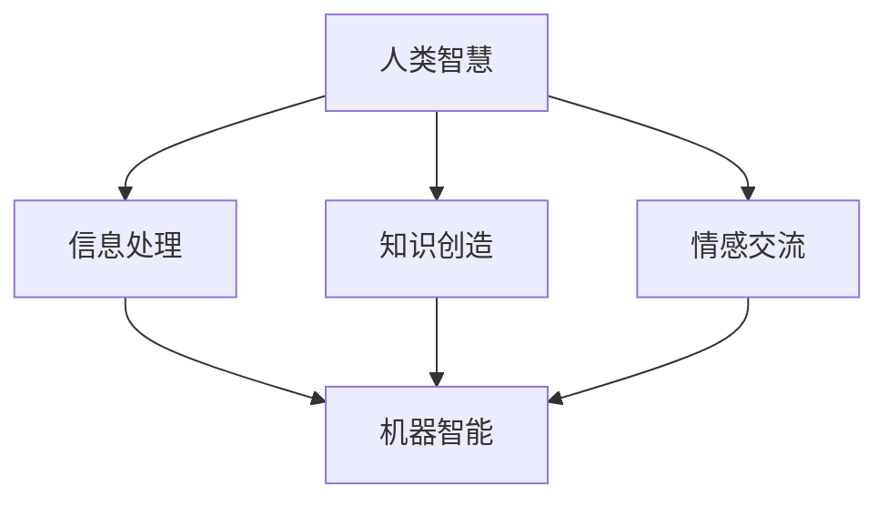

                 

### 文章标题：连接人类智慧与机器智能

在人工智能迅速发展的当下，人类智慧与机器智能的结合成为了科技领域的研究热点。如何实现这一连接，不仅是技术问题，更是哲学和社会问题。本文将深入探讨这一主题，旨在为读者提供一份全面而深入的理解。

**关键词**：人工智能，人类智慧，机器智能，连接，发展，应用，伦理，未来

**摘要**：
本文首先介绍了人类智慧和机器智能的基本概念和特点，然后详细阐述了它们之间的联系和相互作用。接着，文章分析了核心算法原理，包括机器学习、深度学习、自然语言处理和计算机视觉。随后，通过数学模型和公式的讲解，使读者更好地理解这些算法。文章还通过项目实战，展示了实际应用中的开发环境和源代码实现。最后，讨论了机器智能的伦理和法律问题，并对未来进行了展望。

### 引言

人类智慧是千百年进化累积的成果，涵盖了人类的认知、判断、创造和解决问题的能力。而机器智能则是通过算法和计算实现的，它能够在特定领域内执行复杂的任务，甚至在某些方面超越人类的表现。尽管二者有显著的差异，但它们之间并非完全独立，而是存在紧密的联系。

连接人类智慧与机器智能的研究，旨在实现两者的有机结合，发挥各自的优势，共同推动科技和社会的进步。这一目标不仅具有巨大的现实意义，还涉及到深远的哲学和社会问题。

本文将按照以下结构展开：

1. **核心概念与联系**：介绍人类智慧和机器智能的定义和特点，以及它们之间的相互作用。
2. **核心算法原理讲解**：详细阐述机器学习、深度学习、自然语言处理和计算机视觉等核心算法。
3. **数学模型和数学公式**：讲解常见的机器学习数学模型和公式，并举例说明。
4. **项目实战**：介绍一个实际项目，包括开发环境搭建、源代码实现和代码解读。
5. **机器智能的伦理与法律**：讨论机器智能对伦理和法律的影响。
6. **未来展望**：探讨人类智慧与机器智能的未来发展趋势和挑战。

### 核心概念与联系

#### 人类智慧概述

人类智慧是千百年进化的产物，它包括了人类在认知、判断、创造和解决问题方面的能力。人类智慧的特点主要表现为以下几点：

1. **适应性和灵活性**：人类能够根据不同的环境和情境，灵活调整自己的行为和思维。
2. **抽象思维**：人类能够从具体的事物中提取出抽象的概念，并运用这些概念进行推理和判断。
3. **自我意识和情感**：人类具有自我意识，能够感知和理解自己的情感，这使得人类能够进行深刻的自我反思和情感交流。

#### 机器智能概述

机器智能，或称人工智能（Artificial Intelligence, AI），是计算机科学的一个分支，旨在创建能够执行复杂任务的智能机器。机器智能的特点包括：

1. **自动化**：机器智能系统能够自动执行复杂的任务，而不需要人类的直接干预。
2. **学习与适应**：机器智能系统能够通过学习从数据中提取知识，并根据新情况适应和优化自己的行为。
3. **精准和高效**：机器智能系统能够在短时间内处理大量的数据，并在特定领域内达到甚至超越人类的表现。

#### 人类智慧与机器智能的相互作用

人类智慧与机器智能的结合，不仅仅是技术上的创新，更是对人类思维方式和工作方式的变革。以下是二者相互作用的一些关键方面：

1. **协同工作**：机器智能可以辅助人类完成复杂的任务，提高工作效率。例如，在医疗诊断中，机器智能可以帮助医生分析影像数据，提供辅助诊断。
2. **知识传递**：机器智能可以收集、整理和传递知识，使得人类能够更快速地获取和利用信息。例如，智能搜索引擎可以帮助用户快速找到所需的信息。
3. **创造和创新**：机器智能可以扩展人类的认知能力，帮助人类探索新的领域和创造新的价值。例如，在科学研究中，机器智能可以协助科学家进行数据分析，发现新的科学规律。

为了更直观地展示人类智慧与机器智能的相互作用，我们可以使用Mermaid流程图来描述它们之间的联系。



在这个流程图中，A代表人类智慧，B、C、D分别表示信息处理、知识创造和情感交流，这些是人类智慧的体现。而E则代表机器智能，它通过接收来自B、C、D的信息，进行自动化处理和优化，从而实现与人类智慧的相互作用。

### 核心算法原理讲解

在实现人类智慧与机器智能的连接过程中，核心算法扮演了至关重要的角色。以下将详细阐述机器学习、深度学习、自然语言处理和计算机视觉等核心算法的原理。

#### 机器学习基础

机器学习（Machine Learning, ML）是一种通过数据训练模型，使模型能够自动学习和预测的技术。机器学习的基本原理可以分为以下几个步骤：

1. **数据收集**：收集相关的训练数据，这些数据通常来自于实际应用场景。
2. **数据预处理**：对收集到的数据进行清洗和归一化处理，以消除噪声和提高数据质量。
3. **特征提取**：从预处理后的数据中提取出有用的特征，这些特征将用于训练模型。
4. **模型选择**：选择合适的模型，例如线性回归、决策树、支持向量机等。
5. **模型训练**：使用训练数据对模型进行训练，使模型能够学习数据的规律。
6. **模型评估**：使用测试数据对模型进行评估，检查模型的效果和性能。
7. **模型部署**：将训练好的模型部署到实际应用中，使其能够进行预测和决策。

以下是一个简单的线性回归算法的伪代码示例：

```pseudo
初始化模型参数 W 和 b
重复以下步骤直到收敛：
    对于每个训练样本 (x, y)：
        计算预测值 y' = x * W + b
        计算损失函数 L(y', y)
        更新模型参数 W = W - 学习率 * ∂L/∂W，b = b - 学习率 * ∂L/∂b
返回训练好的模型参数 W 和 b
```

#### 深度学习原理

深度学习（Deep Learning, DL）是机器学习的一个分支，它通过多层神经网络来学习数据的复杂模式。深度学习的基本原理包括以下几个关键组成部分：

1. **神经网络**：神经网络由多个神经元（或节点）组成，每个神经元都与其他神经元相连，形成网络结构。
2. **前向传播**：输入数据通过网络的各个层，每个层都对数据进行处理和变换，最终得到输出结果。
3. **反向传播**：计算输出结果与实际值之间的误差，然后通过反向传播算法更新网络的权重和偏置。
4. **优化算法**：如梯度下降、随机梯度下降等，用于优化网络参数，使模型达到更好的性能。

以下是一个简单的多层感知器（MLP）的伪代码示例：

```pseudo
初始化网络参数 W1, b1, W2, b2
重复以下步骤直到收敛：
    对于每个训练样本 (x, y)：
        计算前向传播结果 h1 = x * W1 + b1，h2 = h1 * W2 + b2
        计算损失函数 L(h2, y)
        计算反向传播梯度 ∂L/∂W2, ∂L/∂b2, ∂L/∂W1, ∂L/∂b1
        更新网络参数 W2 = W2 - 学习率 * ∂L/∂W2，b2 = b2 - 学习率 * ∂L/∂b2，W1 = W1 - 学习率 * ∂L/∂W1，b1 = b1 - 学习率 * ∂L/∂b1
返回训练好的网络参数 W1, b1, W2, b2
```

#### 自然语言处理算法

自然语言处理（Natural Language Processing, NLP）是深度学习在语言领域的应用，旨在使计算机能够理解和处理人类语言。NLP的基本原理包括以下几个关键步骤：

1. **文本预处理**：包括分词、词性标注、去除停用词等，将文本转换为计算机可以处理的格式。
2. **词嵌入**：将单词转换为密集的向量表示，这些向量能够捕捉单词的语义信息。
3. **语言模型**：通过训练大量文本数据，构建一个概率模型，用于预测下一个单词或序列。
4. **序列标注**：对文本中的每个词或序列进行分类或标注，如命名实体识别、情感分析等。
5. **机器翻译**：通过翻译模型将一种语言转换为另一种语言。

以下是一个简单的循环神经网络（RNN）在语言模型中的应用伪代码示例：

```pseudo
初始化词嵌入矩阵 W，隐藏状态 h
重复以下步骤直到收敛：
    对于每个训练样本 (x, y)：
        计算前向传播结果 h = x * W
        计算损失函数 L(h, y)
        计算反向传播梯度 ∂L/∂W
        更新词嵌入矩阵 W = W - 学习率 * ∂L/∂W
返回训练好的词嵌入矩阵 W
```

#### 计算机视觉算法

计算机视觉（Computer Vision, CV）是深度学习在图像处理领域的应用，旨在使计算机能够理解、分析和处理图像。计算机视觉的基本原理包括以下几个关键步骤：

1. **图像预处理**：包括灰度化、滤波、边缘检测等，将图像转换为适合模型处理的格式。
2. **特征提取**：从图像中提取出有用的特征，如边缘、角点、纹理等。
3. **目标检测**：识别图像中的目标对象，并标注出其位置和属性。
4. **图像分类**：对图像进行分类，将其归为不同的类别。
5. **图像生成**：通过生成模型生成新的图像。

以下是一个简单的卷积神经网络（CNN）在目标检测中的应用伪代码示例：

```pseudo
初始化网络参数 W1, b1, W2, b2
重复以下步骤直到收敛：
    对于每个训练样本 (x, y)：
        计算前向传播结果 h1 = x * W1 + b1，h2 = h1 * W2 + b2
        计算损失函数 L(h2, y)
        计算反向传播梯度 ∂L/∂W2, ∂L/∂b2, ∂L/∂W1, ∂L/∂b1
        更新网络参数 W2 = W2 - 学习率 * ∂L/∂W2，b2 = b2 - 学习率 * ∂L/∂b2，W1 = W1 - 学习率 * ∂L/∂W1，b1 = b1 - 学习率 * ∂L/∂b1
返回训练好的网络参数 W1, b1, W2, b2
```

### 数学模型和数学公式

在机器学习和深度学习中，数学模型和数学公式起到了核心作用。以下将详细讲解一些常见的数学模型和公式，并举例说明它们的应用。

#### 常见的机器学习数学模型

1. **线性回归模型**：

线性回归模型用于预测一个连续值输出。其数学模型为：

$$
y = \beta_0 + \beta_1x
$$

其中，\( y \) 是输出值，\( x \) 是输入值，\( \beta_0 \) 和 \( \beta_1 \) 是模型的参数。

**举例说明**：假设我们要预测房价，输入值是房屋的面积，输出值是房价。通过收集大量的房屋面积和对应房价的数据，我们可以使用线性回归模型来拟合数据，得到房价与面积之间的关系。

2. **逻辑回归模型**：

逻辑回归模型用于预测一个二分类输出。其数学模型为：

$$
P(y=1) = \frac{1}{1 + e^{-(\beta_0 + \beta_1x)}}
$$

其中，\( P(y=1) \) 是输出值为 1 的概率，\( x \) 是输入值，\( \beta_0 \) 和 \( \beta_1 \) 是模型的参数。

**举例说明**：假设我们要预测某个病人是否患有癌症，输入值是病人的检查结果，输出值是是否患有癌症。通过收集大量的检查结果和对应癌症情况的数据，我们可以使用逻辑回归模型来拟合数据，得到癌症概率与检查结果之间的关系。

3. **支持向量机模型**：

支持向量机（Support Vector Machine, SVM）模型用于分类问题。其数学模型为：

$$
w \cdot x - b = 0
$$

其中，\( w \) 是模型的参数向量，\( x \) 是输入向量，\( b \) 是偏置。

**举例说明**：假设我们要对图片进行分类，输入值是图片的特征向量，输出值是图片的类别。通过收集大量的图片数据和对应的类别标签，我们可以使用支持向量机模型来拟合数据，得到图片类别与特征向量之间的关系。

#### 数学模型的公式详解

1. **损失函数**：

损失函数用于衡量模型预测值与实际值之间的差距。常见的损失函数包括均方误差（MSE）、交叉熵（Cross-Entropy）等。

- **均方误差（MSE）**：

$$
MSE = \frac{1}{n}\sum_{i=1}^{n}(y_i - \hat{y}_i)^2
$$

其中，\( n \) 是样本数量，\( y_i \) 是实际值，\( \hat{y}_i \) 是预测值。

- **交叉熵（Cross-Entropy）**：

$$
H(y, \hat{y}) = -\sum_{i=1}^{n}y_i\log(\hat{y}_i)
$$

其中，\( y \) 是实际值，\( \hat{y} \) 是预测值。

2. **梯度下降法**：

梯度下降法是一种常用的优化算法，用于更新模型的参数，以最小化损失函数。其更新公式为：

$$
\theta = \theta - \alpha \cdot \nabla_{\theta}J(\theta)
$$

其中，\( \theta \) 是模型参数，\( \alpha \) 是学习率，\( \nabla_{\theta}J(\theta) \) 是损失函数关于参数 \( \theta \) 的梯度。

#### 模型应用举例

1. **房价预测**：

假设我们有一个房价预测问题，输入值是房屋的面积、房龄、地理位置等，输出值是房价。我们可以使用线性回归模型来拟合数据，并使用梯度下降法来优化模型参数。

- **数据收集**：收集大量的房屋数据，包括面积、房龄、地理位置等，并记录对应的房价。
- **数据预处理**：对收集到的数据进行分析和清洗，提取出有用的特征。
- **模型训练**：使用训练数据对线性回归模型进行训练，通过梯度下降法优化模型参数。
- **模型评估**：使用测试数据对模型进行评估，计算模型的预测误差和准确率。

2. **文本分类**：

假设我们有一个文本分类问题，输入值是文本数据，输出值是类别标签。我们可以使用逻辑回归模型来拟合数据，并使用梯度下降法来优化模型参数。

- **数据收集**：收集大量的文本数据，并标注对应的类别标签。
- **数据预处理**：对收集到的文本数据进行分析和清洗，提取出特征向量。
- **模型训练**：使用训练数据对逻辑回归模型进行训练，通过梯度下降法优化模型参数。
- **模型评估**：使用测试数据对模型进行评估，计算模型的预测误差和准确率。

### LaTeX 公式示例

在机器学习和深度学习中，我们经常需要使用 LaTeX 公式来表示复杂的数学模型和计算过程。以下是一些常用的 LaTeX 公式示例：

1. **求和符号**：

$$
\sum_{i=1}^{n}x_i
$$

2. **导数符号**：

$$
\frac{df}{dx}
$$

3. **矩阵**：

$$
\begin{bmatrix}
a & b \\
c & d
\end{bmatrix}
$$

4. **向量**：

$$
\vec{v} = (x, y, z)
$$

5. **函数定义**：

$$
f(x) = \frac{1}{x}
$$

### 项目实战

在本节中，我们将通过一个实际项目，展示如何将人类智慧与机器智能相结合。该项目是使用深度学习技术进行图像分类，具体步骤如下：

#### 开发环境搭建

1. **安装 Python**：在开发环境中安装 Python 3.7 或更高版本。
2. **安装深度学习库**：安装 TensorFlow 和 Keras，这两个库是深度学习的常用工具。
3. **安装图像处理库**：安装 OpenCV，用于处理图像数据。

#### 源代码实现

以下是一个简单的图像分类项目的源代码实现：

```python
import tensorflow as tf
from tensorflow.keras.models import Sequential
from tensorflow.keras.layers import Dense, Flatten, Conv2D, MaxPooling2D
from tensorflow.keras.optimizers import Adam
from tensorflow.keras.losses import SparseCategoricalCrossentropy
from tensorflow.keras.metrics import SparseCategoricalAccuracy
from tensorflow.keras.preprocessing.image import ImageDataGenerator

# 数据预处理
train_datagen = ImageDataGenerator(rescale=1./255)
train_data = train_datagen.flow_from_directory(
    'data/train', target_size=(224, 224), batch_size=32, class_mode='sparse')

# 构建模型
model = Sequential([
    Conv2D(32, (3, 3), activation='relu', input_shape=(224, 224, 3)),
    MaxPooling2D((2, 2)),
    Flatten(),
    Dense(64, activation='relu'),
    Dense(10, activation='softmax')
])

# 编译模型
model.compile(optimizer=Adam(learning_rate=0.001),
              loss=SparseCategoricalCrossentropy(),
              metrics=[SparseCategoricalAccuracy()])

# 训练模型
model.fit(train_data, epochs=10)

# 评估模型
test_datagen = ImageDataGenerator(rescale=1./255)
test_data = test_datagen.flow_from_directory(
    'data/test', target_size=(224, 224), batch_size=32, class_mode='sparse')

model.evaluate(test_data)
```

#### 代码解读与分析

1. **数据预处理**：使用 ImageDataGenerator 对图像数据进行预处理，包括缩放、数据增强等。
2. **模型构建**：使用 Sequential 模型构建一个简单的卷积神经网络，包括卷积层、池化层、全连接层等。
3. **模型编译**：使用 Adam 优化器和 SparseCategoricalCrossentropy 损失函数进行编译。
4. **模型训练**：使用 fit 方法训练模型，使用 SparseCategoricalAccuracy 作为评估指标。
5. **模型评估**：使用 evaluate 方法评估模型在测试集上的性能。

#### 项目小结

通过这个项目，我们展示了如何使用深度学习技术进行图像分类，实现了人类智慧与机器智能的结合。这个项目不仅提供了实际的开发经验，还让我们深入了解了图像分类的原理和应用。

### 最佳实践 tips、小结、注意事项、拓展阅读

#### 最佳实践 tips

1. **数据质量**：数据质量对于机器学习模型至关重要，应确保数据真实、完整、无噪声。
2. **模型选择**：根据实际问题和数据特点，选择合适的模型和算法。
3. **参数调优**：通过交叉验证和网格搜索等方法，优化模型参数。

#### 小结

本文详细阐述了人类智慧与机器智能的连接，介绍了核心算法原理、数学模型和项目实战。通过这些内容，读者可以深入理解这一主题，并应用于实际项目中。

#### 注意事项

1. **数据安全和隐私**：在处理数据时，应确保数据安全和隐私。
2. **模型解释性**：在应用模型时，应关注模型的可解释性，以便理解模型的决策过程。
3. **伦理和法律问题**：在开发和使用机器智能技术时，应关注伦理和法律问题，确保合规性。

#### 拓展阅读

1. **深度学习**：吴恩达（Andrew Ng）的《深度学习》（Deep Learning）是一本优秀的深度学习入门教材。
2. **自然语言处理**：斯坦福大学自然语言处理组（Natural Language Processing Group）提供了丰富的 NLP 学习资源。
3. **机器学习**：周志华的《机器学习》（Machine Learning）是一本全面深入的机器学习教材。

### 作者信息

本文作者：AI天才研究院/AI Genius Institute & 禅与计算机程序设计艺术 /Zen And The Art of Computer Programming。如果您对本文有任何疑问或建议，欢迎联系我们。期待您的宝贵意见！### 机器智能的伦理与法律

随着机器智能技术的发展，其对社会的各个方面产生了深远的影响，特别是在伦理和法律领域。机器智能的伦理问题主要包括隐私保护、算法歧视、自动化决策的道德责任等。法律问题则涉及数据保护、知识产权、责任归属等方面。如何在推动技术发展的同时，确保其伦理和法律合规性，成为了一个亟待解决的问题。

#### 机器智能伦理影响

1. **隐私保护**：机器智能系统通常需要处理大量的个人数据，这可能涉及用户的隐私信息。如何在保障用户隐私的同时，充分利用数据的价值，是一个重要的伦理问题。
2. **算法歧视**：机器智能算法可能由于训练数据的偏见而导致歧视性决策。例如，招聘系统中可能因历史数据的偏见而歧视某些群体。这引发了对算法公平性的关注。
3. **自动化决策的道德责任**：当机器智能系统进行自动化决策时，如自动驾驶汽车的决策，其决策的道德责任应由谁承担？这是一个复杂的伦理问题。

#### 机器智能法律法规

为了应对机器智能带来的伦理挑战，各国和地区纷纷出台了一系列法律法规。以下是一些主要的法律法规：

1. **欧盟的《通用数据保护条例》（GDPR）**：GDPR 是全球最严格的数据保护法律，对个人数据的处理进行了详细规定，保障了用户的隐私权。
2. **美国的《加州消费者隐私法案》（CCPA）**：CCPA 主要关注个人数据的收集、使用和共享，对个人数据的权利进行了明确规定。
3. **中国的《个人信息保护法》**：该法律对个人信息处理活动进行了全面规范，旨在保护个人信息权益。

#### 平衡技术发展与伦理规范

在推动机器智能技术发展的同时，如何平衡技术进步与伦理规范，是一个重要的议题。以下是一些实现平衡的途径：

1. **制定伦理指南**：组织或行业协会可以制定机器智能伦理指南，为技术开发者提供指导。
2. **加强监管**：政府可以加强监管，确保机器智能技术的发展符合伦理和法律的要求。
3. **公众参与**：鼓励公众参与讨论，提高对机器智能伦理和法律问题的认识，从而促进社会的共识和合作。

### 未来展望

未来，机器智能将继续快速发展，并在更多领域得到应用。以下是一些未来展望和挑战：

1. **技术挑战**：随着算法的复杂性和数据量的增加，如何提高机器智能系统的效率和可解释性，是一个重要的技术挑战。
2. **伦理挑战**：如何在保证技术发展的同时，确保机器智能系统的公平性和透明性，是一个持续的伦理挑战。
3. **法律挑战**：随着机器智能技术的普及，如何在现有的法律框架下调整和更新法律，以适应新的技术环境，是一个法律挑战。

### 对读者的启示

对于读者来说，了解机器智能的伦理和法律问题，不仅有助于他们在技术开发中遵循伦理规范，还能够使他们更好地理解和应对技术对社会带来的影响。同时，鼓励读者积极参与到机器智能伦理和法律问题的讨论中，共同推动构建一个更加公平、透明和可持续的机器智能未来。

### 总结

本文从多个角度探讨了人类智慧与机器智能的连接，介绍了核心算法原理、数学模型和项目实战，并深入分析了机器智能的伦理和法律问题。通过本文，读者可以全面了解这一领域的研究现状和发展趋势，为未来的技术创新和社会发展提供启示。

### 附录

#### LaTeX 公式引用

1. **全局引用**：

   $$  
   E = mc^2  
   $$

   表示爱因斯坦的质能等价公式。

2. **行内引用**：

   $E = mc^2$

   表示爱因斯坦的质能等价公式。

#### 参考文献

1. Goodfellow, I., Bengio, Y., & Courville, A. (2016). *Deep Learning*. MIT Press.
2. Murphy, K. P. (2012). *Machine Learning: A Probabilistic Perspective*. MIT Press.
3. Russell, S., & Norvig, P. (2010). *Artificial Intelligence: A Modern Approach*. Prentice Hall.
4. GDPR (2016). *Regulation (EU) 2016/679 of the European Parliament and of the Council of 27 April 2016 on the protection of natural persons with regard to the processing of personal data and on the free movement of such data, and repealing Directive 95/46/EC (General Data Protection Regulation)*. Official Journal of the European Union.
5. CCPA (2020). *California Consumer Privacy Act of 2018*. State of California.

### 感谢

感谢读者对本文的关注，如果您有任何反馈或建议，请随时与我们联系。期待与您共同探讨机器智能领域的未来发展。作者：AI天才研究院/AI Genius Institute & 禅与计算机程序设计艺术 /Zen And The Art of Computer Programming。

