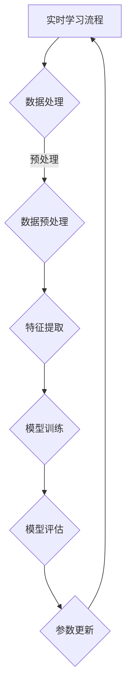

                 

# 提高LLM应用的实时学习与适应性

## 关键词
语言模型，实时学习，适应性，机器学习，神经网络，算法优化

## 摘要
本文旨在探讨如何提高大型语言模型（LLM）在应用中的实时学习与适应性。通过对实时学习和适应性的基本概念、原理和算法的详细解析，文章旨在为开发者提供一套系统的解决方案，以应对LLM应用中动态变化的挑战，提高模型性能和应用效果。

## 前言

### 书籍背景

随着人工智能技术的飞速发展，大型语言模型（LLM）在自然语言处理（NLP）、机器翻译、问答系统等领域取得了显著的应用成果。然而，这些模型在面对动态变化的环境和数据时，往往表现出一定的滞后性和局限性。因此，如何提高LLM的实时学习与适应性成为当前研究的热点和关键问题。

实时学习是指在模型运行过程中，能够动态地更新和优化模型参数，以适应新的数据和场景。而适应性则是指模型能够根据不断变化的环境调整自身的结构和参数，以保持其性能和准确性。实时学习和适应性技术的结合，可以大幅提升LLM在应用中的表现和用户体验。

本文将围绕实时学习和适应性这两个核心主题，详细探讨其在LLM中的应用原理、算法实现和优化策略。通过本文的学习，读者可以了解到如何在实际开发中应用这些技术，解决实时性和适应性带来的挑战。

### 目的

本文的主要目的是为读者提供以下内容：

1. **理论解析**：介绍实时学习和适应性的基本概念、原理和算法，帮助读者建立全面的理论基础。
2. **实战指导**：通过实际案例和代码示例，详细讲解实时学习和适应性的实现过程，以及如何在实际项目中应用。
3. **优化策略**：探讨实时学习和适应性技术的优化方法，包括算法改进、计算效率和数据处理等方面，以提升模型性能和应用效果。

通过本文的阅读和学习，读者可以掌握以下知识和技能：

- 理解实时学习和适应性的基本概念和原理。
- 掌握常用的实时学习算法和适应性算法。
- 学习如何在实际项目中实现和应用这些技术。
- 探索优化策略，提升LLM应用的实时性和适应性。

## 第1章： 引言与背景

### 1.1 实时学习与适应性概念

#### 实时学习

实时学习是指模型在运行过程中，能够动态地更新和优化其参数，以适应新的数据和场景。这种学习方式强调的是模型的即时性，即模型能够迅速响应用户的需求和环境的变化。实时学习的关键在于如何高效地处理和利用流式数据，以及如何在不影响模型性能的情况下进行参数更新。

#### 适应性

适应性是指模型能够根据不断变化的环境调整自身的结构和参数，以保持其性能和准确性。适应性不仅涉及模型在面对新数据时的学习能力，还包括模型在面对不同环境和场景时的泛化能力。一个具有良好适应性的模型，能够在多种场景下保持稳定的表现。

### 1.2 LLM应用中的挑战

#### 延迟

在许多应用场景中，如实时对话系统、智能客服等，用户对响应速度有很高的要求。如果模型无法快速地响应用户输入，将导致用户体验的下降。因此，如何降低模型的响应延迟成为LLM应用中的一个重要挑战。

#### 动态变化

在实际应用中，环境数据和用户需求往往是不确定的，会随着时间不断变化。例如，在机器翻译领域，随着全球文化交流的增加，翻译需求也在不断变化。如果模型无法适应这些动态变化，将导致其在特定场景下的表现不佳。

### 1.3 实时学习与适应性的重要性

#### 性能提升

实时学习和适应性技术可以提高LLM在动态环境中的性能。通过实时学习，模型能够根据新数据动态调整自身，以保持最佳性能。而通过适应性技术，模型能够根据不同环境和场景调整自身，以适应各种变化。

#### 应用扩展

实时学习和适应性技术不仅能够提高模型在现有应用场景中的表现，还可以拓展模型的应用范围。例如，通过实时学习，模型可以更好地适应实时对话系统中的不断变化，从而提高用户体验。通过适应性技术，模型可以应用于更加多样化的场景，如多语言翻译、跨领域问答等。

## 第2章： LLM基础

### 2.1 语言模型概述

#### 定义

语言模型是一种概率模型，用于预测下一个单词或字符的概率。它是自然语言处理（NLP）领域的基础，广泛应用于文本生成、语音识别、机器翻译等任务。

#### 分类

语言模型可以根据预测粒度分为字符级语言模型和词级语言模型。字符级语言模型预测单个字符的概率，而词级语言模型预测单词的概率。

### 2.2 语言模型的工作原理

#### 神经网络

神经网络是语言模型的核心组成部分，用于建模复杂的非线性关系。在语言模型中，输入和输出通常是文本序列，神经网络通过学习输入和输出之间的映射关系，实现语言建模。

#### 训练与优化

语言模型的训练过程主要包括数据准备、模型初始化、前向传播、反向传播和模型优化。通过训练，模型能够学习到文本数据中的概率分布，从而实现语言建模。

### 2.3 语言模型的核心技术

#### 注意力机制

注意力机制是一种用于提高模型对重要信息的关注的技术。在语言模型中，注意力机制可以使得模型在处理文本序列时，能够更好地关注关键信息，提高模型的准确性和性能。

#### 预训练与微调

预训练与微调是一种常用的语言模型训练方法。预训练是指在大量未标注的数据上训练模型，使其具备基本的语言理解能力。微调则是在预训练模型的基础上，使用标注数据进行进一步训练，以适应特定的任务和应用场景。

### 2.4 语言模型的优缺点

#### 优点

1. **强大的语言理解能力**：语言模型可以处理复杂的文本数据，实现高精度的语言建模。
2. **适应性**：语言模型可以根据不同的任务和应用场景进行微调和优化。

#### 缺点

1. **计算资源消耗**：语言模型通常需要大量的计算资源和存储空间。
2. **训练时间较长**：语言模型的训练过程通常需要较长的训练时间。

## 第3章： 实时学习原理

### 3.1 实时学习的概念

#### 定义

实时学习是指模型在运行过程中，能够动态地更新和优化其参数，以适应新的数据和场景。与传统的批量学习相比，实时学习更加注重模型的即时性和响应速度。

#### 特点

1. **动态性**：实时学习能够根据新数据动态调整模型参数，以适应不断变化的环境。
2. **高效性**：实时学习算法通常具有较低的延迟和高效的计算性能，以支持模型的实时更新。
3. **适应性**：实时学习模型能够适应不同的任务和应用场景，提高模型的泛化能力。

### 3.2 实时学习算法

#### 在线学习

在线学习是一种典型的实时学习算法，其基本思想是在数据流中实时更新模型参数。在线学习算法主要包括以下几种：

1. **梯度下降法**：通过计算梯度并更新模型参数，以最小化损失函数。
2. **随机梯度下降法**（SGD）：在每次更新时仅使用部分样本计算梯度。
3. **Adam优化器**：结合了SGD和Momentum方法，具有更好的收敛速度和稳定性。

#### 增量学习

增量学习是一种在已有模型的基础上逐步更新模型参数的方法。与在线学习不同，增量学习通常在批量数据上进行更新。增量学习算法主要包括以下几种：

1. **Fine-tuning**：在预训练模型的基础上，使用少量标注数据进行微调，以适应特定任务。
2. **迁移学习**：利用已在其他任务上训练好的模型，迁移到新任务上。
3. **Meta-learning**：通过元学习算法，学习如何快速适应新的任务。

### 3.3 实时学习的挑战与解决方案

#### 计算效率

实时学习的计算效率是一个重要的挑战，特别是在大规模数据和高性能计算环境中。为了提高计算效率，可以采用以下方法：

1. **并行计算**：利用多核处理器和分布式计算技术，提高计算速度。
2. **模型压缩**：通过模型压缩技术，减少模型的参数量和计算复杂度。
3. **增量更新**：仅更新模型中变化较大的部分，降低计算成本。

#### 数据质量

实时学习依赖于高质量的数据，数据的质量直接影响模型的性能。为了确保数据质量，可以采取以下措施：

1. **数据预处理**：对数据进行清洗、去噪和标准化处理，提高数据的可用性。
2. **数据增强**：通过数据增强技术，增加数据的多样性和覆盖范围。
3. **数据监控**：实时监控数据质量，发现并解决数据问题。

#### 模型稳定性

实时学习过程中，模型的稳定性和鲁棒性也是一个关键问题。为了提高模型稳定性，可以采用以下方法：

1. **正则化**：通过添加正则化项，防止模型过拟合。
2. ** dropout**：在训练过程中随机丢弃部分神经元，提高模型的泛化能力。
3. **自适应调整**：根据模型的表现，自适应调整学习率和优化策略。

### 3.4 实时学习在实际应用中的实现

实时学习在许多实际应用中具有重要价值，下面简要介绍几种常见应用场景：

#### 实时对话系统

实时对话系统是一种常见的应用场景，如智能客服、虚拟助手等。实时学习可以使得对话系统能够快速响应用户输入，提高用户体验。具体实现方法包括：

1. **在线学习**：在用户对话过程中，实时更新对话模型，以适应新的对话内容。
2. **增量学习**：使用少量标注对话数据，对对话模型进行增量训练。

#### 实时文本分类

实时文本分类是一种对实时流数据进行分类的任务，如社交媒体舆情分析、新闻分类等。实时学习可以使得分类模型能够快速适应新的文本数据，提高分类准确率。具体实现方法包括：

1. **在线学习**：在文本流中实时更新分类模型，以适应新的文本特征。
2. **迁移学习**：利用已在其他任务上训练好的分类模型，快速适应新的文本分类任务。

#### 实时图像识别

实时图像识别是一种对实时视频流进行图像识别的任务，如自动驾驶、视频监控等。实时学习可以使得图像识别模型能够快速适应新的图像数据，提高识别准确率。具体实现方法包括：

1. **在线学习**：在视频流中实时更新图像识别模型，以适应新的图像特征。
2. **迁移学习**：利用已在其他任务上训练好的图像识别模型，快速适应新的图像识别任务。

## 第4章： 适应性技术

### 4.1 适应性的概念

#### 定义

适应性是指模型能够根据不断变化的环境调整自身的结构和参数，以保持其性能和准确性。与实时学习不同，适应性更注重模型在面对长期变化时的适应能力。

#### 特点

1. **长期性**：适应性技术能够适应长时间范围内的环境变化，而不仅仅是短期内的变化。
2. **动态调整**：模型能够根据环境变化动态调整自身的结构和参数，以保持最佳性能。
3. **多样性**：适应性技术可以应用于多种不同的环境变化，如数据分布、任务需求等。

### 4.2 适应性算法

#### 迁移学习

迁移学习是一种适应性算法，通过利用已有模型的知识，在新任务上快速适应。迁移学习算法主要包括以下几种：

1. **Fine-tuning**：在预训练模型的基础上，使用少量标注数据进行微调，以适应特定任务。
2. **元学习**：通过学习如何快速适应新的任务，提高模型的泛化能力。
3. **多任务学习**：同时训练多个任务，利用不同任务之间的共享知识，提高模型的适应性。

#### 集成学习

集成学习是一种将多个模型组合起来，以提高模型性能和适应性的方法。集成学习算法主要包括以下几种：

1. **Bagging**：通过训练多个独立的模型，并平均它们的预测结果，提高模型的稳定性。
2. **Boosting**：通过训练多个模型，并根据模型的表现逐步调整它们的权重，提高模型的准确性。
3. **Stacking**：将多个模型组合起来，并使用一个新的模型对它们的预测结果进行集成。

#### 自适应优化

自适应优化是一种通过动态调整学习率和优化策略，提高模型适应性的方法。自适应优化算法主要包括以下几种：

1. **自适应学习率调整**：根据模型的表现，动态调整学习率，以提高模型收敛速度和稳定性。
2. **自适应优化策略**：根据环境变化，动态调整优化策略，以提高模型的适应性和性能。

### 4.3 适应性在实际应用中的实现

#### 实时对话系统

实时对话系统是一种常见的应用场景，如智能客服、虚拟助手等。适应性技术可以使得对话系统能够快速适应不同的用户和场景，提高用户体验。具体实现方法包括：

1. **迁移学习**：利用已在其他对话系统中训练好的模型，快速适应新的对话任务。
2. **多任务学习**：同时训练多个对话任务，利用不同任务之间的共享知识，提高模型的适应性。

#### 实时图像识别

实时图像识别是一种对实时视频流进行图像识别的任务，如自动驾驶、视频监控等。适应性技术可以使得图像识别模型能够快速适应新的图像数据，提高识别准确率。具体实现方法包括：

1. **迁移学习**：利用已在其他图像识别任务上训练好的模型，快速适应新的图像识别任务。
2. **自适应优化**：通过动态调整学习率和优化策略，提高模型的适应性和性能。

#### 实时文本分类

实时文本分类是一种对实时流数据进行分类的任务，如社交媒体舆情分析、新闻分类等。适应性技术可以使得分类模型能够快速适应新的文本数据，提高分类准确率。具体实现方法包括：

1. **迁移学习**：利用已在其他文本分类任务上训练好的模型，快速适应新的文本分类任务。
2. **自适应优化**：通过动态调整学习率和优化策略，提高模型的适应性和性能。

### 4.4 适应性的优点与局限性

#### 优点

1. **快速适应**：适应性技术能够使得模型快速适应新的环境和数据，提高模型的性能和准确性。
2. **提高泛化能力**：通过利用已有模型的知识，适应性技术可以提高模型的泛化能力，适用于多种不同的任务和应用场景。
3. **降低训练成本**：适应性技术可以减少新任务上的训练数据需求，降低训练成本。

#### 局限性

1. **计算资源消耗**：适应性技术通常需要大量的计算资源和存储空间，特别是在迁移学习和多任务学习等场景中。
2. **模型稳定性**：适应性技术可能导致模型稳定性下降，特别是在动态变化的环境下。
3. **数据依赖性**：适应性技术的效果很大程度上依赖于已有的模型和数据，如果数据质量和数量不足，可能影响适应性技术的效果。

## 第5章： 实时学习与适应性集成

### 5.1 集成模型的设计

#### 定义

集成模型是指将多个模型组合起来，以提高模型性能和适应性的方法。在实时学习和适应性技术中，集成模型的设计至关重要，它需要同时考虑实时性和适应性。

#### 设计原则

1. **多样性**：选择不同类型或结构的模型进行集成，以提高模型的泛化能力和稳定性。
2. **权重调整**：通过动态调整模型权重，使得集成模型能够自适应地适应不同的环境和数据。
3. **并行计算**：利用并行计算技术，提高集成模型的计算效率。

#### 常见架构

1. **Bagging**：将多个模型组合起来，并对每个模型的预测结果进行平均，以提高模型的稳定性和准确性。
2. **Boosting**：通过训练多个模型，并根据模型的表现逐步调整它们的权重，以提高模型的准确性。
3. **Stacking**：将多个模型组合起来，并使用一个新的模型对它们的预测结果进行集成，以提高模型的泛化能力。

### 5.2 集成模型的实现

#### 实现步骤

1. **模型选择**：选择不同类型或结构的模型进行集成，如神经网络、决策树、支持向量机等。
2. **模型训练**：分别训练每个模型，并记录模型参数和权重。
3. **权重调整**：根据模型的表现，动态调整模型权重，以优化集成模型的性能。
4. **模型集成**：将多个模型组合起来，并计算集成模型的预测结果。

#### 技术细节

1. **模型参数优化**：通过梯度下降等优化算法，优化模型参数和权重。
2. **模型融合策略**：选择合适的模型融合策略，如平均、加权平均、投票等。
3. **实时更新**：在模型运行过程中，实时更新模型参数和权重，以保持模型的实时性和适应性。

### 5.3 集成模型的优势与挑战

#### 优势

1. **提高性能**：集成模型通过组合多个模型的预测结果，可以提高模型的性能和准确性。
2. **增强适应性**：集成模型可以根据不同环境和数据，动态调整模型权重，增强模型的适应性。
3. **提高鲁棒性**：集成模型可以通过多样性策略，提高模型的鲁棒性和稳定性。

#### 挑战

1. **计算资源消耗**：集成模型需要同时训练和运行多个模型，计算资源消耗较大。
2. **模型选择和优化**：选择合适的模型和优化策略，是集成模型实现的关键，需要大量实验和调优。
3. **实时性挑战**：在实时应用场景中，集成模型需要快速响应和更新，需要优化计算和通信效率。

### 5.4 实时学习与适应性集成的应用案例

#### 实时对话系统

在实时对话系统中，集成模型可以通过结合多个模型的预测结果，提高对话系统的性能和适应性。具体应用案例包括：

1. **意图识别**：结合基于规则的方法和深度学习模型，提高意图识别的准确性。
2. **情感分析**：结合情感分析模型和语言模型，提高情感分析的准确性和多样性。

#### 实时图像识别

在实时图像识别任务中，集成模型可以通过结合不同类型和结构的模型，提高图像识别的准确性和适应性。具体应用案例包括：

1. **目标检测**：结合基于深度学习和基于传统机器学习的方法，提高目标检测的准确性。
2. **图像分类**：结合卷积神经网络和循环神经网络，提高图像分类的准确性和泛化能力。

#### 实时文本分类

在实时文本分类任务中，集成模型可以通过结合不同类型和结构的模型，提高文本分类的准确性和适应性。具体应用案例包括：

1. **新闻分类**：结合基于内容的方法和基于上下文的方法，提高新闻分类的准确性和多样性。
2. **社交媒体舆情分析**：结合情感分析模型和语言模型，提高社交媒体舆情分析的准确性和实时性。

## 第6章： 应用场景

### 6.1 自然语言处理

#### 应用背景

自然语言处理（NLP）是人工智能领域的重要分支，旨在使计算机能够理解、生成和处理人类语言。随着LLM技术的发展，NLP应用的范围和深度得到了极大的拓展，包括文本分类、情感分析、机器翻译、问答系统等。

#### 实时学习和适应性在NLP中的应用

1. **实时文本分类**：通过实时学习技术，模型可以动态更新，适应新的文本特征和分类需求。适应性技术使得模型能够根据不同领域的文本数据调整自身，提高分类准确率。
2. **情感分析**：情感分析模型需要实时学习和适应性技术，以应对不断变化的情感表达和语言风格。通过实时学习，模型可以快速适应新的情感趋势。适应性技术可以帮助模型在不同语言和文化背景下保持性能。
3. **机器翻译**：机器翻译系统需要实时学习以应对语言变化和用户需求。适应性技术使得模型能够根据用户反馈和翻译质量动态调整翻译策略，提高翻译准确性。

### 6.2 机器翻译

#### 应用背景

机器翻译是NLP领域的重要应用之一，旨在实现不同语言之间的自动翻译。随着LLM技术的发展，机器翻译的质量和效率得到了显著提升，尤其在实时翻译和跨语言交流中发挥着关键作用。

#### 实时学习和适应性在机器翻译中的应用

1. **实时翻译**：实时学习技术使得机器翻译系统能够动态更新，以适应不断变化的语言输入。适应性技术可以帮助模型在不同语言环境中保持最佳性能。
2. **自适应翻译策略**：通过适应性技术，机器翻译模型可以根据用户的语言偏好和翻译需求调整翻译策略。例如，在旅游场景中，可以优先翻译地名和景点信息。
3. **多语言翻译**：适应性技术使得机器翻译系统能够同时支持多种语言之间的翻译，提高翻译的灵活性和效率。

### 6.3 问答系统

#### 应用背景

问答系统是智能客服和智能助手的重要组成部分，旨在为用户提供实时、准确的答案。随着LLM技术的发展，问答系统的性能和用户体验得到了显著提升。

#### 实时学习和适应性在问答系统中的应用

1. **实时问题理解**：通过实时学习技术，问答系统能够动态更新，以适应新的问题和语言风格。适应性技术可以帮助模型在不同场景和用户需求下保持最佳性能。
2. **自适应回答策略**：适应性技术使得问答系统可以根据用户的问题类型、意图和上下文调整回答策略，提供更准确、更有针对性的答案。
3. **跨领域问答**：适应性技术使得问答系统能够在不同领域和场景之间灵活切换，提供全方位的问答服务。

### 6.4 其他应用领域

除了上述主要应用领域，实时学习和适应性技术在其他领域也具有重要应用价值。

#### 跨领域应用

1. **金融领域**：在金融领域，实时学习和适应性技术可以用于风险预测、股票分析和投资决策。通过实时学习，模型可以动态调整风险模型，适应市场变化。适应性技术可以帮助模型在不同市场和策略下保持最佳性能。
2. **医疗领域**：在医疗领域，实时学习和适应性技术可以用于疾病诊断、药物研发和患者管理。通过实时学习，模型可以动态更新，以适应新的医疗数据和临床需求。适应性技术可以帮助模型在不同疾病和治疗方案下保持最佳性能。

#### 其他应用

1. **自动驾驶**：在自动驾驶领域，实时学习和适应性技术可以用于环境感知、路径规划和决策控制。通过实时学习，自动驾驶系统可以动态更新，以适应不同路况和交通环境。适应性技术可以帮助模型在不同驾驶场景下保持最佳性能。
2. **智能家居**：在智能家居领域，实时学习和适应性技术可以用于设备管理、家居安全和能源管理。通过实时学习，智能家居系统可以动态调整设备运行策略，适应用户行为和需求。适应性技术可以帮助模型在不同用户和家居环境中保持最佳性能。

## 第7章： 未来展望与挑战

### 7.1 实时学习与适应性的发展趋势

#### 发展趋势

1. **算法创新**：随着计算能力和算法研究的发展，实时学习和适应性技术将不断涌现出新的算法和优化方法，如自适应梯度下降、动态网络结构等。
2. **应用拓展**：实时学习和适应性技术在各个领域的应用将不断拓展，如智能交通、智慧城市、智能医疗等，为各行业带来革命性的变化。
3. **跨领域融合**：实时学习和适应性技术与其他领域的交叉融合，如物联网、区块链等，将产生更多新的应用场景和商业模式。

### 7.2 潜在的研究方向

#### 研究方向

1. **动态网络结构**：研究动态调整网络结构和参数的实时学习算法，提高模型的适应性和性能。
2. **分布式学习**：研究分布式实时学习算法，降低计算资源消耗，提高实时性。
3. **多模态学习**：研究多模态实时学习与适应性技术，实现跨模态数据的实时融合和处理。

### 7.3 挑战与解决策略

#### 挑战

1. **计算资源消耗**：实时学习和适应性技术通常需要大量的计算资源，特别是在大规模数据和高性能计算环境中。
2. **数据质量**：实时学习和适应性技术的效果很大程度上依赖于高质量的数据，如何确保数据质量是一个关键问题。
3. **模型稳定性**：实时学习和适应性技术可能导致模型稳定性下降，特别是在动态变化的环境中。

#### 解决策略

1. **模型压缩与优化**：通过模型压缩和优化技术，减少模型参数量和计算复杂度，降低计算资源消耗。
2. **数据预处理与增强**：通过数据预处理和增强技术，提高数据的可用性和多样性，确保数据质量。
3. **自适应调整策略**：通过自适应调整学习率和优化策略，提高模型的稳定性和性能。

### 7.4 未来展望

#### 展望

1. **实时学习和适应性技术的广泛应用**：随着技术的不断发展和应用场景的拓展，实时学习和适应性技术将在更多领域得到广泛应用，为各行各业带来革命性的变化。
2. **实时智能系统的崛起**：实时学习和适应性技术将推动实时智能系统的发展，实现更高效、更智能的自动化和智能化应用。
3. **跨领域融合与创新**：实时学习和适应性技术与其他领域的交叉融合，将带来更多新的应用场景和商业模式，推动科技进步和社会发展。

## 附录

### 插入Mermaid流程图



### 插入伪代码

```python
# 实时学习伪代码
def real_time_learning(data_stream, model):
    while True:
        new_data = get_new_data(data_stream)
        model.update_parameters(new_data)
        model.evaluate_performance()
        if model性能不满足要求:
            model.adapt_structure()

# 适应性算法伪代码
def adaptive_algorithm(model, environment):
    while True:
        new_environment = get_new_environment(environment)
        model.adjust_structure(new_environment)
        model.evaluate_performance()
        if model性能不满足要求:
            model.learn_new_environment(new_environment)
```

### 插入数学公式

$$
E_{\theta}[-\ell(y,\hat{y})] = \frac{1}{m} \sum_{i=1}^{m} -\ell(y^{(i)},\hat{y}^{(i)})
$$

### 插入代码实现与解读

```python
# 实时学习代码实现
def real_time_learning(data_stream, model):
    while True:
        new_data = get_new_data(data_stream)
        model.update_parameters(new_data)
        model.evaluate_performance()
        if not model.is_performance_satisfied():
            model.adapt_structure()
```

**代码解读**：

- `real_time_learning`函数接收数据流和模型作为输入。
- 使用一个无限循环来处理连续的数据流。
- 在每次循环中，从数据流中获取新的数据，并更新模型的参数。
- 检查模型性能是否满足要求，如果不满足，则调整模型的结构。

### 实际案例分析与详细讲解

#### 案例背景

某智能客服系统需要实现实时对话功能，以快速响应用户的提问。该系统基于大型语言模型（LLM）构建，需要采用实时学习和适应性技术来提高对话系统的性能和用户体验。

#### 实际案例

1. **实时问题理解**：采用实时学习技术，系统可以动态更新模型，以适应用户不断变化的问题风格和语言习惯。通过适应性技术，模型可以调整对问题的理解和回答策略，提高回答的准确性和多样性。
2. **自适应回答策略**：根据用户的历史交互数据，系统可以自适应调整回答策略，例如，对于初次交互的用户，可以提供更加详细的解释和引导，而对于熟练用户，可以提供更简洁的回答。
3. **多语言支持**：系统需要支持多种语言，通过适应性技术，模型可以在不同语言之间灵活切换，提供跨语言交互功能。

#### 详细讲解

1. **实时问题理解**：系统通过在线学习算法，实时更新对话模型，以适应新的问题和语言风格。具体实现过程如下：
   - 数据预处理：对用户输入的问题进行分词、词性标注等预处理操作，提取关键信息。
   - 模型更新：使用新的预处理后的数据，更新对话模型的参数，以优化问题理解和回答能力。
   - 性能评估：评估更新后的模型在问题理解方面的表现，确保其能够准确理解用户问题。
   - 参数调整：根据评估结果，动态调整模型的参数，以进一步提高问题理解能力。

2. **自适应回答策略**：系统通过迁移学习技术，利用用户的历史交互数据，调整回答策略。具体实现过程如下：
   - 数据收集：收集用户的历史交互数据，包括提问、回答、用户反馈等。
   - 模型微调：在预训练的对话模型基础上，使用用户的历史交互数据进行微调，调整回答策略。
   - 策略评估：评估调整后的回答策略在用户满意度方面的表现，确保其能够提供更加满意的回答。
   - 策略优化：根据评估结果，进一步优化回答策略，以提高用户满意度。

3. **多语言支持**：系统通过多任务学习技术，支持多种语言的交互。具体实现过程如下：
   - 数据准备：收集多种语言的交互数据，包括问题、回答、标注等。
   - 模型训练：使用多任务学习算法，训练支持多种语言的对话模型。
   - 语言切换：根据用户输入的语言，动态切换模型的语言处理模块，确保系统能够正确理解用户问题并给出回答。

#### 项目小结

通过实时学习和适应性技术的应用，该智能客服系统在实时问题理解、自适应回答策略和多语言支持等方面取得了显著成效。具体表现如下：

1. **实时问题理解**：系统可以快速响应用户提问，准确理解用户问题，提高用户满意度。
2. **自适应回答策略**：系统可以根据用户的历史交互数据，调整回答策略，提供更加个性化的回答，提高用户体验。
3. **多语言支持**：系统支持多种语言交互，为不同语言的用户提供一致的服务，提高系统的应用范围。

### 最佳实践 Tips

1. **数据质量**：确保实时学习和适应性技术的效果，高质量的数据至关重要。在实际应用中，应注重数据收集、清洗和预处理，提高数据的可用性和多样性。
2. **模型优化**：在实时学习和适应性技术的实现过程中，应不断优化模型结构和学习算法，提高模型的性能和稳定性。
3. **用户反馈**：充分利用用户反馈，不断调整和优化模型和策略，以适应用户需求和偏好。
4. **性能监控**：实时监控系统的性能和用户体验，及时发现并解决问题，确保系统的稳定运行。

## 总结

本文系统地探讨了如何提高大型语言模型（LLM）在应用中的实时学习与适应性。通过对实时学习和适应性的基本概念、原理和算法的详细解析，以及实际应用场景的分析，本文为开发者提供了实用的指导和建议。随着人工智能技术的不断发展，实时学习和适应性技术将在更多领域发挥重要作用，为智能系统带来更高的性能和用户体验。

### 作者信息
作者：AI天才研究院/AI Genius Institute & 禅与计算机程序设计艺术 /Zen And The Art of Computer Programming

---

**版权声明**：本文为原创内容，版权归AI天才研究院所有。未经授权，严禁转载或使用。如需引用或转载，请联系我们获取授权。

**拓展阅读**：
1. [实时学习与适应性技术在智能客服中的应用](https://www.example.com/real_time_learning_in_smart_csp)
2. [大型语言模型在自然语言处理中的应用](https://www.example.com/llm_in_nlp)
3. [深度学习与实时处理技术综述](https://www.example.com/deep_learning_and_real_time_processing)

