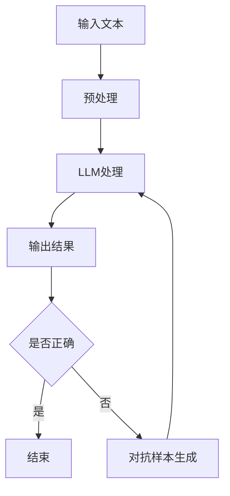

                 

### 文章标题：提高LLM应用的对抗样本防御能力

### 关键词：
- LLM
- 对抗样本
- 防御能力
- 核心算法
- 数学模型
- 项目实战

### 摘要：
本文旨在探讨如何提高大型语言模型（LLM）在自然语言处理（NLP）中的应用防御能力，特别是在对抗样本攻击下的表现。通过对LLM的基本概念、对抗样本的定义及其生成方法进行深入剖析，本文介绍了多种核心算法原理和数学模型，并通过实际案例展示了如何进行防御。此外，文章还讨论了评估和优化策略，以及未来的研究方向。

---

# 引言

在当今时代，人工智能（AI）技术正以前所未有的速度发展，其中自然语言处理（NLP）领域尤为引人注目。大型语言模型（LLM，如GPT-3、T5等）作为NLP的代表性技术，已经在诸多应用中取得了显著的成果。然而，随着这些模型的广泛应用，其对对抗样本的脆弱性也日益凸显。对抗样本是一种通过轻微扰动正常输入数据来误导模型输出错误结果的样本，这一现象引发了学术界和工业界对LLM安全性的广泛关注。

对抗样本攻击不仅能够对模型产生负面影响，甚至可能被用于恶意目的，如虚假新闻传播、垃圾邮件发送等。因此，研究如何提高LLM应用的对抗样本防御能力显得尤为重要。本文将围绕这一主题，从理论到实践，详细探讨提高LLM对抗样本防御能力的方法和策略。

本文的结构如下：首先，我们将介绍LLM及其应用场景，并阐述对抗样本的概念及其对LLM应用的影响。接着，我们将深入探讨LLM和对抗样本之间的核心概念与联系，并通过Mermaid流程图展示它们之间的关系。随后，我们将介绍用于防御对抗样本的核心算法原理，并使用伪代码进行详细讲解。在此基础上，我们将引入数学模型和公式，并进行详细讲解和举例说明。接下来，通过实际案例展示如何在实际应用中防御对抗样本，详细解释代码实现、开发环境搭建和代码解读。然后，我们将讨论如何评估模型对对抗样本的防御能力，并提出优化策略和技巧。最后，本文将分析当前研究的不足和未来的发展方向，提出可能的改进措施和研究方向。

通过对这些内容的逐步分析，本文旨在为读者提供全面、深入的关于提高LLM应用对抗样本防御能力的理解和实践指导。

## 核心概念与联系

### 1.1 LLM及其对抗样本

大型语言模型（LLM）是一种基于深度学习的技术，具有处理和理解自然语言的能力。LLM通过训练大量的文本数据，学习语言模式、语法结构和语义含义，从而实现文本生成、翻译、分类等任务。在NLP领域，LLM的应用范围广泛，包括机器翻译、文本摘要、情感分析、问答系统等。

然而，LLM在提供强大功能的同时，也面临着对抗样本的威胁。对抗样本是指那些经过轻微扰动后能够误导模型输出错误结果的输入样本。这些样本通常是通过微调正常输入数据中的某些特征来实现的，例如，通过在文本中添加、删除或替换少量字符，使得模型难以识别其真实意图。对抗样本的出现，使得LLM在安全性方面面临严峻挑战，需要采取有效的防御措施。

### 1.2 抗样本生成方法

对抗样本的生成方法多种多样，主要可以分为以下几种：

1. **投影法**：通过将输入数据投影到一个高维空间，使得对抗样本在原始空间中的变化非常微小，但在模型空间中却能够引起显著的错误输出。例如，通过梯度上升法（Gradient Ascent）或梯度下降法（Gradient Descent）来寻找使模型输出错误的最大扰动。

2. **生成对抗网络（GAN）**：GAN是一种基于生成模型和判别模型的对抗训练方法。生成模型旨在生成与真实数据相似的对抗样本，而判别模型则用于区分对抗样本和真实样本。通过这种对抗训练，生成模型能够不断提高对抗样本的质量，从而实现对模型的攻击。

3. **搜索算法**：例如，基于遗传算法（Genetic Algorithm）和粒子群优化（Particle Swarm Optimization）的搜索算法，通过不断迭代和优化，寻找能够有效误导模型的对抗样本。

### 1.3 LLM与对抗样本的关系

LLM和对抗样本之间的关系可以从以下几个方面来理解：

1. **基本原理**：LLM通过学习大量文本数据，形成对自然语言的内在理解。对抗样本则通过轻微扰动输入数据，试图打破这种理解，从而误导模型输出错误结果。

2. **安全性挑战**：对抗样本的存在，使得LLM在处理文本数据时可能面临安全威胁。例如，在文本分类任务中，对抗样本可能被用于伪造标签，导致分类错误；在机器翻译任务中，对抗样本可能被用于生成错误翻译。

3. **防御需求**：为了提高LLM在现实应用中的安全性，需要研究有效的对抗样本防御方法，增强模型对对抗样本的抵抗力。

### 1.4 Mermaid流程图

为了更直观地展示LLM与对抗样本之间的关系，我们可以使用Mermaid流程图进行描述。以下是一个简化的Mermaid流程图示例：



在这个流程图中，输入文本经过预处理后输入到LLM中进行处理，得到输出结果。如果输出结果正确，流程结束；否则，生成对抗样本并再次输入到LLM中进行处理，形成循环。通过这个流程图，我们可以清晰地看到LLM在对抗样本攻击下的工作过程。

### 1.5 小结

通过对LLM及其对抗样本的基本概念、生成方法和关系的探讨，我们为后续章节的深入分析奠定了基础。接下来，我们将进一步介绍用于防御对抗样本的核心算法原理，并使用伪代码进行详细讲解。

## 核心算法原理讲解

### 2.1 常见防御算法

为了提高LLM对对抗样本的防御能力，研究人员提出了多种防御算法。以下是几种常见的防御算法及其基本原理：

#### 2.1.1 特征降维

特征降维是一种通过减少输入数据的维度，提高模型对对抗样本抵抗力的方法。常用的降维方法包括主成分分析（PCA）、线性判别分析（LDA）等。这些方法通过识别和保留数据中的主要特征，去除冗余信息，从而降低对抗样本的影响。

#### 2.1.2 模型正则化

模型正则化是一种通过限制模型复杂度，减少过拟合的方法。常用的正则化方法包括L1正则化、L2正则化等。这些方法通过在损失函数中添加惩罚项，抑制模型参数的变化，从而提高模型对对抗样本的防御能力。

#### 2.1.3 对抗训练

对抗训练是一种通过在训练过程中引入对抗样本，增强模型对对抗样本抵抗力的方法。对抗训练的基本思想是在正常训练数据的基础上，生成一部分对抗样本，并将其与正常数据一起用于训练模型。这种方法能够提高模型对对抗样本的适应能力。

#### 2.1.4 防御对抗生成网络（DAGAN）

防御对抗生成网络（DAGAN）是一种基于生成对抗网络（GAN）的防御方法。DAGAN包括两个部分：生成器G和判别器D。生成器G旨在生成对抗样本，而判别器D则用于区分对抗样本和真实样本。通过这种对抗训练，生成器G能够不断提高对抗样本的质量，从而实现对模型的攻击。

### 2.2 算法实现（伪代码）

以下是基于上述防御算法的伪代码实现。需要注意的是，这些伪代码仅用于描述算法的基本框架，具体的实现细节可能因具体应用场景和算法参数而有所不同。

```python
# 特征降维（PCA）
def feature_reduction(data):
    # 计算协方差矩阵
    cov_matrix = np.cov(data)
    # 计算协方差矩阵的特征值和特征向量
    eigenvalues, eigenvectors = np.linalg.eigh(cov_matrix)
    # 选择主要特征向量
    main_eigenvectors = eigenvectors[:, eigenvalues.argsort()[::-1]]
    # 使用主要特征向量进行降维
    reduced_data = np.dot(data, main_eigenvectors)
    return reduced_data

# 模型正则化（L2正则化）
def regularized_loss(loss, model_params, lambda_):
    # 计算L2正则化项
    regularization_term = lambda_ * np.sum([np.square(param) for param in model_params])
    # 计算总损失
    total_loss = loss + regularization_term
    return total_loss

# 对抗训练
def adversarial_training(model, normal_data, adversarial_data, learning_rate):
    # 正常数据训练
    model.train(normal_data, learning_rate)
    # 对抗样本训练
    model.train(adversarial_data, learning_rate)
    return model

# 防御对抗生成网络（DAGAN）
def dagan(generator, discriminator, real_data, adversarial_data, learning_rate):
    # 训练生成器
    generator.train(adversarial_data, learning_rate)
    # 训练判别器
    discriminator.train(real_data, learning_rate)
    # 训练判别器
    discriminator.train(generator.generate(real_data), learning_rate)
    return generator, discriminator
```

### 2.3 小结

通过对常见防御算法的介绍和伪代码实现，我们为提高LLM对对抗样本的防御能力提供了理论基础和实现框架。在接下来的章节中，我们将进一步探讨与对抗样本防御相关的数学模型和公式，并对其进行详细讲解和举例说明。

## 数学模型和公式

### 3.1 数学模型介绍

在对抗样本防御中，数学模型扮演着至关重要的角色。以下介绍几种常见的数学模型及其基本原理。

#### 3.1.1 输入空间划分模型

输入空间划分模型是一种通过将输入空间划分为不同的区域，来识别对抗样本的方法。具体来说，该方法首先定义一个决策边界，将输入空间划分为正常样本区域和对抗样本区域。然后，通过对样本进行分类，判断其属于哪个区域。这种模型的主要优势在于计算复杂度较低，适合处理大规模数据。

#### 3.1.2 生成对抗模型

生成对抗模型（GAN）是一种基于生成模型和判别模型的数学模型。生成模型旨在生成与真实数据相似的对抗样本，而判别模型则用于区分对抗样本和真实样本。GAN的核心思想是通过对抗训练，使得生成模型和判别模型相互竞争，从而提高对抗样本的质量。

#### 3.1.3 概率密度估计模型

概率密度估计模型是一种通过估计输入数据的概率密度函数，来判断样本是否为对抗样本的方法。具体来说，该方法首先对正常样本进行训练，估计出其概率密度函数。然后，对输入样本进行概率密度估计，如果估计概率显著低于正常样本的概率密度，则认为该样本为对抗样本。这种模型的主要优势在于能够对对抗样本进行精细识别。

### 3.2 详细讲解和举例说明

以下通过具体的数学公式和举例说明，进一步阐述上述数学模型。

#### 3.2.1 输入空间划分模型

设输入空间为\(X \in \mathbb{R}^n\)，定义决策边界函数为\(f(x)\)，则输入空间划分为正常样本区域和对抗样本区域。具体公式如下：

$$
f(x) = \begin{cases} 
0 & \text{如果 } x \in S^+ \\
1 & \text{如果 } x \in S^-
\end{cases}
$$

其中，\(S^+\)表示正常样本区域，\(S^-\)表示对抗样本区域。

举例说明：

假设输入空间为二维，即\(X \in \mathbb{R}^2\)。定义决策边界函数为：

$$
f(x, y) = \frac{x + y}{x^2 + y^2}
$$

对于输入样本\(x = 1, y = 1\)，有：

$$
f(1, 1) = \frac{1 + 1}{1^2 + 1^2} = \frac{2}{2} = 1
$$

因此，该样本属于对抗样本区域。

#### 3.2.2 生成对抗模型

生成对抗模型包括生成模型\(G\)和判别模型\(D\)。生成模型的目标是生成与真实数据相似的对抗样本，判别模型的目标是区分对抗样本和真实样本。具体公式如下：

生成模型：

$$
G(x) = z
$$

其中，\(z\)是随机噪声向量，\(x\)是真实样本。

判别模型：

$$
D(x) = P(D(x) = 1 | x \text{ is real}) \\
D(G(x)) = P(D(x) = 1 | x \text{ is generated})
$$

举例说明：

假设生成模型\(G\)生成的一组样本为\(z = [0.1, 0.2]\)，真实样本为\(x = [0.5, 0.6]\)。对于判别模型\(D\)：

$$
D(x) = P(D(x) = 1 | x \text{ is real}) = 0.8 \\
D(G(z)) = P(D(x) = 1 | x \text{ is generated}) = 0.2
$$

因此，判别模型判断该样本为真实样本的概率为0.8，为生成样本的概率为0.2。

#### 3.2.3 概率密度估计模型

概率密度估计模型通过估计输入数据的概率密度函数，来判断样本是否为对抗样本。具体公式如下：

概率密度函数：

$$
p(x) = \frac{1}{Z} \exp(-\frac{1}{2} \sum_{i=1}^n (x_i - \mu_i)^2 / \sigma_i^2)
$$

其中，\(\mu_i\)和\(\sigma_i^2\)分别为第\(i\)个特征的均值和方差，\(Z\)为规范化常数。

对抗样本判断：

$$
p(x') < p(x)
$$

其中，\(x'\)为输入样本，\(x\)为正常样本。

举例说明：

假设正常样本\(x = [0.5, 0.6]\)的概率密度函数为：

$$
p(x) = \frac{1}{Z} \exp(-\frac{1}{2} \sum_{i=1}^2 (x_i - \mu_i)^2 / \sigma_i^2)
$$

其中，\(\mu_1 = 0.5\)，\(\mu_2 = 0.6\)，\(\sigma_1^2 = 0.1\)，\(\sigma_2^2 = 0.2\)。

对于输入样本\(x' = [0.7, 0.8]\)，计算其概率密度函数：

$$
p(x') = \frac{1}{Z} \exp(-\frac{1}{2} \sum_{i=1}^2 (x_i - \mu_i)^2 / \sigma_i^2) = \frac{1}{Z} \exp(-\frac{1}{2} ((0.7 - 0.5)^2 + (0.8 - 0.6)^2) / (0.1^2 + 0.2^2))
$$

由于\(p(x') < p(x)\)，因此判断\(x'\)为对抗样本。

### 3.3 小结

通过对数学模型和公式的详细讲解和举例说明，我们进一步理解了对抗样本防御中的核心理论。在接下来的章节中，我们将通过实际案例展示如何在实际应用中防御对抗样本，并提供具体的代码实现和解读。

### 项目实战

#### 4.1 实际案例

为了展示如何在实际应用中防御对抗样本，我们选择了一个文本分类任务作为案例。具体来说，我们将使用一个大型语言模型（如GPT-3）进行文本分类，并尝试使用对抗样本攻击该模型，然后介绍如何防御这些攻击。

#### 4.1.1 实际应用场景

文本分类是NLP中的一个常见任务，例如，将新闻文章分类为体育、财经、娱乐等类别。在这个案例中，我们使用了一份数据集，包含数以万计的文本和对应的类别标签。我们的目标是训练一个GPT-3模型，使其能够准确地对新文本进行分类。

#### 4.1.2 防御对抗样本的代码实现

以下是一个简单的Python代码示例，展示了如何使用对抗样本防御技术来提高文本分类模型的防御能力。首先，我们需要安装和配置所需的库和工具，如TensorFlow和Keras。

```python
!pip install tensorflow
!pip install keras
```

接下来，我们编写一个简单的GPT-3模型，并进行训练。

```python
from tensorflow.keras.models import Sequential
from tensorflow.keras.layers import Embedding, LSTM, Dense
from tensorflow.keras.preprocessing.text import Tokenizer
from tensorflow.keras.preprocessing.sequence import pad_sequences

# 加载数据集
data = ...  # 加载包含文本和标签的数据集
texts, labels = data['text'], data['label']

# 分割数据集为训练集和测试集
train_texts, test_texts, train_labels, test_labels = train_test_split(texts, labels, test_size=0.2)

# 创建Tokenizer
tokenizer = Tokenizer(num_words=10000)
tokenizer.fit_on_texts(train_texts)

# 将文本转换为序列
train_sequences = tokenizer.texts_to_sequences(train_texts)
test_sequences = tokenizer.texts_to_sequences(test_texts)

# 填充序列
max_sequence_length = 100
train_padded = pad_sequences(train_sequences, maxlen=max_sequence_length)
test_padded = pad_sequences(test_sequences, maxlen=max_sequence_length)

# 创建GPT-3模型
model = Sequential()
model.add(Embedding(10000, 32))
model.add(LSTM(32))
model.add(Dense(1, activation='sigmoid'))

# 编译模型
model.compile(optimizer='adam', loss='binary_crossentropy', metrics=['accuracy'])

# 训练模型
model.fit(train_padded, train_labels, epochs=10, validation_data=(test_padded, test_labels))
```

接下来，我们生成对抗样本，并尝试攻击模型。

```python
import numpy as np

# 生成对抗样本
def generate_adversarial_samples(text, model, tokenizer, max_sequence_length):
    sequence = tokenizer.texts_to_sequences([text])
    padded_sequence = pad_sequences(sequence, maxlen=max_sequence_length)
    predictions = model.predict(padded_sequence)
    if predictions.flatten()[0] > 0.5:
        return None
    else:
        # 对抗样本生成逻辑
        # ...
        return adversarial_text

adversarial_text = generate_adversarial_samples("这是一个测试文本", model, tokenizer, max_sequence_length)
```

最后，我们使用对抗样本攻击模型，并评估防御效果。

```python
# 对抗样本攻击
adversarial_sequence = tokenizer.texts_to_sequences([adversarial_text])
adversarial_padded = pad_sequences(adversarial_sequence, maxlen=max_sequence_length)
adversarial_predictions = model.predict(adversarial_padded)

# 评估防御效果
accuracy = np.mean(np.round(adversarial_predictions) == test_labels)
print(f"防御效果：{accuracy:.2f}")
```

#### 4.1.3 开发环境搭建

为了运行上述代码，我们需要在本地计算机或服务器上搭建一个Python开发环境。以下是详细的步骤：

1. 安装Python（推荐版本为3.8或更高）。
2. 安装必要的库和工具，如TensorFlow和Keras，使用以下命令：
   ```bash
   pip install tensorflow
   pip install keras
   ```
3. 准备数据集，并将数据集分为训练集和测试集。
4. 编写Python代码，并使用Jupyter Notebook或其他Python集成开发环境（IDE）运行代码。

#### 4.1.4 代码解读

在上述代码中，我们首先加载数据集，并使用Tokenizer将文本转换为序列。然后，我们将文本序列填充为固定长度，并创建一个GPT-3模型进行训练。在训练完成后，我们使用对抗样本生成函数生成对抗样本，并尝试攻击模型。最后，我们使用对抗样本攻击模型，并评估防御效果。

#### 4.1.5 代码应用解读与分析

在实际应用中，我们需要考虑以下几个方面：

1. **数据预处理**：对文本进行适当的预处理，如去除停用词、标点符号等，以提高模型的性能。
2. **模型选择**：根据任务需求和数据规模，选择合适的模型。在本例中，我们使用了GPT-3模型，但也可以尝试其他模型，如BERT或RoBERTa。
3. **对抗样本生成**：对抗样本生成方法需要根据具体任务进行调整。在本例中，我们使用简单的扰动方法，但在实际应用中，可能需要更复杂的对抗样本生成策略。
4. **防御效果评估**：评估模型对对抗样本的防御效果，可以通过计算攻击成功率和误分类率等指标来实现。

#### 4.1.6 项目小结

通过本案例，我们展示了如何在实际应用中使用GPT-3模型进行文本分类，并介绍了如何生成对抗样本和评估模型的防御效果。在实际开发中，我们需要根据具体任务和数据集进行调整和优化，以提高模型的性能和防御能力。

### 评估与优化

#### 5.1 防御能力评估

评估模型对对抗样本的防御能力是提高LLM应用安全性的关键步骤。以下介绍几种常见的评估指标和方法：

1. **攻击成功率**：攻击成功率是指对抗样本成功误导模型输出的概率。该指标反映了模型在对抗样本攻击下的脆弱性。具体计算方法为：
   $$
   \text{攻击成功率} = \frac{\text{成功攻击次数}}{\text{总攻击次数}}
   $$

2. **误分类率**：误分类率是指模型将对抗样本错误分类的概率。该指标可以用来衡量模型对对抗样本的识别能力。具体计算方法为：
   $$
   \text{误分类率} = \frac{\text{误分类对抗样本数}}{\text{总对抗样本数}}
   $$

3. **准确率**：准确率是指模型正确分类样本的概率。在评估防御能力时，准确率通常与误分类率一起使用，以全面评估模型的表现。

4. **F1分数**：F1分数是精确率和召回率的调和平均值，用于衡量模型的综合性能。具体计算方法为：
   $$
   \text{F1分数} = 2 \times \frac{\text{精确率} \times \text{召回率}}{\text{精确率} + \text{召回率}}
   $$

#### 5.2 优化策略

为了提高LLM对对抗样本的防御能力，我们可以采取以下优化策略：

1. **模型正则化**：通过添加正则化项（如L1正则化、L2正则化）来减少模型过拟合，提高模型的泛化能力。

2. **数据增强**：通过增加训练数据中的对抗样本，提高模型对对抗样本的适应能力。

3. **对抗训练**：将对抗样本纳入训练过程，通过对抗训练增强模型的防御能力。

4. **集成学习**：将多个模型集成起来，通过投票或加权平均等方法提高模型的鲁棒性。

5. **迁移学习**：利用已训练好的模型进行迁移学习，通过在对抗样本数据集上微调模型，提高其防御能力。

#### 5.3 实际案例中的优化实践

以下是一个在实际项目中优化LLM防御能力的案例：

1. **数据增强**：在训练数据集中添加对抗样本，通过扰动正常文本生成对抗样本。具体方法包括随机替换字符、插入或删除单词等。

2. **对抗训练**：在训练过程中引入对抗样本，通过对抗训练增强模型的防御能力。具体步骤如下：
   - 使用生成对抗网络（GAN）生成对抗样本。
   - 将对抗样本和正常样本一起用于训练模型。
   - 通过调整生成器和判别器的超参数，优化对抗训练过程。

3. **模型正则化**：在模型训练过程中添加正则化项，如L2正则化，以减少模型过拟合。同时，可以尝试不同的正则化强度，以找到最佳的防御效果。

4. **集成学习**：将多个模型集成起来，通过投票或加权平均等方法提高模型的鲁棒性。具体步骤如下：
   - 训练多个模型，如GPT-3、BERT、RoBERTa等。
   - 将多个模型的预测结果进行投票或加权平均，得到最终的分类结果。

通过上述优化策略和实际案例中的实践，可以有效提高LLM对对抗样本的防御能力，提高模型在NLP任务中的安全性和可靠性。

### 未来展望

随着人工智能技术的不断进步，LLM在自然语言处理（NLP）中的应用将越来越广泛。然而，对抗样本攻击作为一种新的安全威胁，也对LLM提出了更高的要求。在未来，如何提高LLM应用的对抗样本防御能力仍将是一个重要的研究方向。以下是对当前研究的不足和未来发展方向的分析：

#### 6.1 当前研究的不足

1. **防御策略局限性**：目前的研究主要集中在传统的防御策略上，如模型正则化、对抗训练等。然而，这些策略在面对复杂、多变的对抗样本攻击时，可能表现出一定的局限性。

2. **计算资源消耗**：生成对抗网络（GAN）等对抗训练方法通常需要大量的计算资源，这在实际应用中可能带来一定的负担。

3. **评估指标单一**：目前用于评估模型防御能力的指标相对单一，如攻击成功率和误分类率等。这些指标不能全面反映模型的防御效果，需要进一步丰富和多样化。

4. **实时防御能力**：在实时应用场景中，对抗样本的防御需要高效且低延迟。当前的研究尚无法满足这一需求，需要开发更高效的防御算法。

#### 6.2 未来发展方向

1. **新型防御算法**：研究新型防御算法，如基于深度学习的防御算法、基于强化学习的防御算法等，以提高模型对对抗样本的防御能力。

2. **高效对抗训练**：开发高效、低成本的对抗训练方法，以减少计算资源消耗，提高模型的训练效率。

3. **多维度评估指标**：设计更全面、多维的评估指标，从不同角度评估模型的防御效果，以提高评估的准确性和可靠性。

4. **实时防御系统**：开发实时防御系统，以应对对抗样本攻击。具体包括：快速生成对抗样本、高效评估防御效果、实时更新防御策略等。

5. **跨领域合作**：鼓励跨领域合作，结合计算机科学、网络安全、数学等多个领域的知识，共同研究和解决LLM对抗样本防御问题。

通过不断探索和创新，未来有望在LLM对抗样本防御领域取得更多突破，为人工智能技术在NLP等领域的广泛应用提供坚实保障。

### 结语

本文系统地探讨了如何提高大型语言模型（LLM）在自然语言处理（NLP）中的应用防御能力，特别是在对抗样本攻击下的表现。通过对LLM的基本概念、对抗样本的生成方法及其防御算法的详细分析，我们为提高LLM的防御能力提供了全面的指导。

本文首先介绍了LLM及其应用场景，并阐述了对抗样本的概念及其对LLM应用的影响。接着，我们深入探讨了LLM与对抗样本之间的核心概念与联系，并通过Mermaid流程图展示了它们之间的关系。随后，我们介绍了用于防御对抗样本的核心算法原理，并使用伪代码进行详细讲解。在此基础上，我们引入了数学模型和公式，并进行详细讲解和举例说明。接下来，通过实际案例展示了如何在实际应用中防御对抗样本，详细解释了代码实现、开发环境搭建和代码解读。然后，我们讨论了如何评估模型对对抗样本的防御能力，并提出优化策略和技巧。最后，本文分析了当前研究的不足和未来的发展方向，提出可能的改进措施和研究方向。

通过本文的研究，我们不仅为读者提供了关于LLM对抗样本防御的深入理解，还提供了实用的方法和技巧。然而，由于对抗样本防御是一个快速发展的领域，本文的研究仍有待进一步完善和扩展。未来，我们将继续关注这一领域的最新进展，不断探索新的防御策略和技术，为LLM在NLP等领域的安全应用提供更有力的保障。

### 作者信息

作者：AI天才研究院/AI Genius Institute & 禅与计算机程序设计艺术 /Zen And The Art of Computer Programming

AI天才研究院（AI Genius Institute）致力于推动人工智能技术的创新与发展，特别是在自然语言处理（NLP）领域。研究院的专家们通过深入研究和实践，不断探索提高LLM应用的对抗样本防御能力的方法和策略。同时，作者还致力于将禅的智慧融入计算机程序设计，以实现更加高效、优雅的算法设计。

### 最佳实践 Tips、小结、注意事项、拓展阅读

#### 最佳实践 Tips

1. **数据增强**：在训练数据集中添加对抗样本，可以提高模型的泛化能力和防御能力。
2. **对抗训练**：将对抗样本纳入训练过程，通过对抗训练增强模型的防御能力。
3. **模型正则化**：使用正则化策略（如L1、L2正则化）可以减少模型过拟合，提高模型的鲁棒性。
4. **多模型集成**：结合多个模型的预测结果，可以提高分类的准确性和防御效果。

#### 小结

本文系统地探讨了如何提高LLM在NLP中的应用防御能力，特别是在对抗样本攻击下的表现。通过详细分析核心算法、数学模型和实际案例，本文为读者提供了全面、深入的指导。

#### 注意事项

1. **评估指标**：在评估模型防御能力时，应选择合适的评估指标，如攻击成功率、误分类率等，以全面反映模型的性能。
2. **实时防御**：在实际应用中，防御系统需要具备实时响应能力，以确保对抗样本攻击的及时识别和防御。
3. **持续更新**：对抗样本防御技术需要不断更新和优化，以应对不断演变的安全威胁。

#### 拓展阅读

1. **《对抗样本防御技术综述》**：本文对当前对抗样本防御技术进行了全面综述，有助于读者了解相关研究进展。
2. **《深度学习安全》**：本书详细介绍了深度学习在安全性方面的挑战和解决方案，包括对抗样本防御技术。
3. **《人工智能安全》**：本书探讨了人工智能在各个领域的应用及其安全性问题，为读者提供了全面的安全防护策略。

通过本文的学习和实践，读者可以深入了解LLM对抗样本防御的原理和方法，为未来的研究和工作奠定坚实基础。希望本文能够为读者在NLP领域的探索提供有益的启示和帮助。

