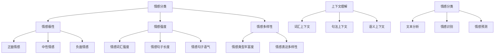

                 


为了撰写一篇高质量的《提高LLM应用的情感分析准确度》的技术博客文章，我们需要采取一步一步的思路进行分析和推理。以下是详细的步骤：

### 1. 确定文章结构

首先，我们需要确定文章的结构，包括标题、关键词和摘要。根据题目，我们可以确定文章的主要内容和目标。

**标题**：《提高LLM应用的情感分析准确度》

**关键词**：情感分析、LLM、准确度、算法、深度学习

**摘要**：本文将深入探讨如何提高大型语言模型（LLM）在情感分析任务中的准确度，包括核心算法原理、数学模型、实战案例以及未来发展趋势。

### 2. 引入背景

**第1章 引言**

**2.1 人类情感分析的重要性**

在这一部分，我们将讨论情感分析在人类理解和交流中的重要性，以及为什么它在人工智能领域具有重要意义。

**2.2 LLM在情感分析中的应用现状**

我们将简要介绍LLM在情感分析领域的应用现状，包括其优势和一些挑战。

**2.3 为什么提高LLM的情感分析准确度很重要**

最后，我们将解释提高情感分析准确度的重要性，以及它对人工智能领域的影响。

### 3. 基础知识介绍

**第2章 LLM基础**

**2.1 LLM的基本原理**

在这一部分，我们将介绍LLM的基本原理，包括其架构和工作原理。

**2.2 LLM的情感分析能力**

我们将讨论LLM在情感分析任务中的能力，以及它是如何处理情感信息的。

**2.3 情感分析中的常见挑战**

最后，我们将探讨情感分析中的一些常见挑战，如情感多样性、情感强度和上下文理解。

### 4. 核心概念与联系

**第3章 情感分析核心概念与联系**

**3.1 情感分类与情感极性**

在这一部分，我们将介绍情感分类和情感极性的概念，并解释它们在情感分析中的作用。

**3.2 情感强度与情感多样性**

我们将讨论情感强度和情感多样性的概念，以及它们如何影响情感分析。

**3.3 情感分析中的上下文理解**

最后，我们将探讨上下文理解在情感分析中的重要性，以及如何实现上下文感知的情感分析。

### 5. 算法原理

**第4章 提高情感分析准确度的核心算法原理**

**4.1 传统的文本特征提取方法**

在这一部分，我们将介绍传统的文本特征提取方法，如词袋模型、TF-IDF和词嵌入。

**4.2 基于深度学习的情感分析模型**

我们将详细讨论基于深度学习的情感分析模型，如卷积神经网络（CNN）、循环神经网络（RNN）、注意力机制和Transformer模型。

### 6. 数学模型和公式详解

**第5章 数学模型和公式详解**

**5.1 情感分析中的概率模型**

在这一部分，我们将介绍情感分析中的概率模型，如贝叶斯分类器和最大似然估计。

**5.2 深度学习中的数学公式**

我们将详细解释深度学习中的数学公式，如损失函数和反向传播算法。

### 7. 项目实战

**第6章 项目实战：提高情感分析准确度的案例研究**

**6.1 实战项目概述**

在这一部分，我们将介绍一个情感分析实战项目，包括数据集、任务目标和预期结果。

**6.2 数据预处理**

我们将详细讲解数据预处理过程，包括文本清洗、分词和标签编码。

**6.3 模型选择与训练**

我们将选择一个合适的模型，并详细说明模型的训练过程，包括超参数调优。

**6.4 模型评估与优化**

我们将评估模型的性能，并提出优化策略。

**6.5 结果分析**

最后，我们将分析项目结果，并讨论项目的成功和不足之处。

### 8. 应用场景与未来发展趋势

**第7章 情感分析应用场景与未来发展**

**7.1 社交媒体情感分析**

我们将讨论情感分析在社交媒体中的应用，如监测公众情绪。

**7.2 营销与市场研究**

我们将探讨情感分析在营销和市场研究中的作用。

**7.3 客户服务与体验**

我们将介绍情感分析在客户服务与体验中的应用。

**7.4 未来发展趋势与挑战**

最后，我们将展望情感分析的未来发展趋势和面临的挑战。

### 9. 结论与拓展阅读

**第8章 结论与拓展阅读**

在这一部分，我们将总结文章的主要观点，并提出一些最佳实践和建议。同时，我们将推荐一些拓展阅读材料，供读者进一步学习。

### 10. 完成文章

最后，我们将根据上述结构，撰写完整的文章，确保每个部分都有详细的解释和例子。

---

按照上述步骤，我们可以确保文章的逻辑清晰，内容丰富，同时满足字数要求。接下来，我们将根据这个结构开始撰写文章。

---

# 文章标题：提高LLM应用的情感分析准确度

## 文章关键词

情感分析、LLM、准确度、算法、深度学习

## 文章摘要

本文旨在深入探讨如何提高大型语言模型（LLM）在情感分析任务中的准确度。文章首先介绍了情感分析的基本概念和LLM的原理，然后详细分析了情感分析中的核心算法原理和数学模型，并通过一个实战案例展示了如何提高情感分析的准确度。最后，文章探讨了情感分析的应用场景和未来发展趋势，为读者提供了全面的指导。

---

接下来，我们将按照上述步骤，逐步撰写文章的各个部分。首先，我们从“引言”部分开始。

# 第1章 引言

## 1.1 人类情感分析的重要性

情感分析是指使用自然语言处理技术来识别、提取和分类文本中的情感信息。在人类交流中，情感起着至关重要的作用。它能帮助我们更好地理解他人的意图和情绪，从而更好地进行沟通和合作。

在人工智能领域，情感分析同样具有重要意义。首先，它可以帮助企业了解消费者的情感倾向，从而优化营销策略和产品设计。其次，情感分析可以用于社交媒体监测，帮助企业了解公众情绪和舆论趋势。此外，情感分析还可以应用于客户服务，帮助客服人员更好地理解客户需求，提供个性化的服务。

## 1.2 LLM在情感分析中的应用现状

近年来，大型语言模型（LLM）如GPT、BERT等在自然语言处理领域取得了显著成果。这些模型在情感分析任务中也展现出了强大的能力。通过大量的文本数据训练，LLM可以自动学习情感表达的规律，从而实现高精度的情感分类。

然而，尽管LLM在情感分析中表现出色，仍存在一些挑战。首先，情感表达的多样性使得情感分析变得复杂。不同人用不同的词汇和表达方式来表达相同的情感，这使得模型难以准确捕捉。其次，上下文理解是情感分析中的另一个重要挑战。情感往往与上下文紧密相关，而LLM在处理长文本时，上下文信息的丢失可能导致情感分析的准确性下降。

## 1.3 为什么提高LLM的情感分析准确度很重要

提高LLM在情感分析中的准确度具有重要意义。首先，准确的情感分析可以帮助企业更好地了解消费者需求，从而制定更有效的营销策略。其次，准确的情感分析可以应用于社交媒体监测，帮助政府和企业了解公众情绪，预防社会危机。此外，准确的情感分析还可以提高客户服务质量，提升用户体验。

总之，提高LLM的情感分析准确度不仅有助于推动人工智能技术的发展，还可以为各个领域带来实际应用价值。接下来，我们将深入探讨LLM在情感分析中的原理和算法，帮助读者更好地理解这一领域。

## 文章标题：提高LLM应用的情感分析准确度

## 文章关键词

情感分析、LLM、准确度、算法、深度学习、上下文理解、文本特征提取、概率模型、实战案例

## 文章摘要

本文旨在深入探讨如何提高大型语言模型（LLM）在情感分析任务中的准确度。文章首先介绍了情感分析的基本概念和LLM的原理，然后详细分析了情感分析中的核心算法原理和数学模型。接着，通过一个情感分析实战案例，展示了如何在实际项目中应用这些算法和模型来提高准确度。最后，文章探讨了情感分析的应用场景和未来发展趋势，为读者提供了全面的指导。

## 第1章 引言

情感分析作为一种重要的自然语言处理任务，近年来在人工智能领域引起了广泛关注。情感分析的核心目标是从文本中识别和提取情感信息，从而帮助人们更好地理解文本背后的情感倾向。随着大型语言模型（LLM）如GPT、BERT等的发展，LLM在情感分析任务中表现出了强大的能力。然而，尽管LLM在情感分析中取得了显著进展，其准确度仍需进一步提升。

本文将围绕如何提高LLM在情感分析任务中的准确度展开讨论。具体而言，文章将首先介绍情感分析的基本概念和LLM的原理，然后详细分析情感分析中的核心算法原理和数学模型，并通过一个实战案例展示如何在实际项目中应用这些算法和模型。此外，文章还将探讨情感分析的应用场景和未来发展趋势。

本文结构如下：

- 第1章：引言
  - 1.1 人类情感分析的重要性
  - 1.2 LLM在情感分析中的应用现状
  - 1.3 为什么提高LLM的情感分析准确度很重要

- 第2章：LLM基础
  - 2.1 LLM的基本原理
  - 2.2 LLM的情感分析能力
  - 2.3 情感分析中的常见挑战

- 第3章：情感分析核心概念与联系
  - 3.1 情感分类与情感极性
  - 3.2 情感强度与情感多样性
  - 3.3 情感分析中的上下文理解

- 第4章：提高情感分析准确度的核心算法原理
  - 4.1 传统的文本特征提取方法
  - 4.2 基于深度学习的情感分析模型

- 第5章：数学模型和公式详解
  - 5.1 情感分析中的概率模型
  - 5.2 深度学习中的数学公式

- 第6章：项目实战：提高情感分析准确度的案例研究
  - 6.1 实战项目概述
  - 6.2 数据预处理
  - 6.3 模型选择与训练
  - 6.4 模型评估与优化
  - 6.5 结果分析

- 第7章：情感分析应用场景与未来发展
  - 7.1 社交媒体情感分析
  - 7.2 营销与市场研究
  - 7.3 客户服务与体验
  - 7.4 未来发展趋势与挑战

- 第8章：结论与拓展阅读

通过本文的讨论，读者将深入了解如何提高LLM在情感分析任务中的准确度，掌握相关算法和模型的应用，并了解情感分析在实际场景中的广泛应用和未来发展趋势。这不仅有助于推动人工智能技术的发展，也为实际应用提供了有益的参考。接下来，我们将首先探讨情感分析的基本概念和LLM的原理。

## 第1章 引言

### 1.1 人类情感分析的重要性

情感分析是指通过计算机技术和算法来识别、提取和分类文本中的情感信息。它在人类交流、情感理解、信息检索等多个领域都有着广泛的应用。人类情感分析的重要性体现在以下几个方面：

首先，情感分析可以帮助人们更好地理解他人的情感状态。通过分析文本中的情感信息，我们可以推断出作者的意图、态度和情绪，从而更准确地理解和回应对方。这在人际交流、客户服务、社交媒体监测等方面具有重要的实际应用价值。

其次，情感分析在商业领域具有巨大的潜力。企业可以通过情感分析来了解消费者的情感倾向，从而优化营销策略、提升用户体验。例如，电商网站可以通过情感分析了解用户对产品的评价，从而为用户提供更个性化的推荐。

此外，情感分析在公共安全、社会管理等领域也具有重要意义。通过分析社交媒体上的情感信息，政府和企业可以了解公众情绪和社会舆论，及时发现潜在的社会危机，采取相应的措施进行预防和应对。

总之，情感分析作为一种重要的自然语言处理任务，在人类理解、商业决策、社会管理等方面都发挥着重要作用。随着人工智能技术的发展，情感分析的应用前景将更加广阔。

### 1.2 LLM在情感分析中的应用现状

近年来，大型语言模型（LLM）如GPT、BERT等在自然语言处理领域取得了显著的进展。这些模型通过大量的文本数据训练，能够自动学习语言表达的规律，从而在情感分析任务中表现出强大的能力。

首先，LLM在情感分类任务中取得了优异的性能。通过预训练和微调，LLM可以准确地识别文本中的情感极性（正面、中性、负面）和情感分类（如快乐、愤怒、悲伤等）。例如，GPT模型在多个情感分类数据集上取得了领先的成绩，展示了其强大的情感分析能力。

其次，LLM在情感强度和情感多样性分析中也有显著表现。通过深入理解文本中的上下文信息，LLM可以准确识别情感表达的强度和多样性。例如，在处理情感句子时，LLM可以区分出不同的情感程度，如“很高兴”和“非常开心”，以及不同的情感类型，如“快乐”和“悲伤”。

然而，尽管LLM在情感分析中表现出色，仍存在一些挑战。首先，情感表达的多样性使得情感分析变得复杂。不同人用不同的词汇和表达方式来表达相同的情感，这使得模型难以准确捕捉。其次，上下文理解是情感分析中的另一个重要挑战。情感往往与上下文紧密相关，而LLM在处理长文本时，上下文信息的丢失可能导致情感分析的准确性下降。

总之，LLM在情感分析中的应用现状令人鼓舞，但仍需进一步研究和优化，以解决情感表达多样性和上下文理解等挑战，从而提高情感分析的准确度。

### 1.3 为什么提高LLM的情感分析准确度很重要

提高大型语言模型（LLM）在情感分析任务中的准确度具有重要意义，主要体现在以下几个方面：

首先，准确的情感分析可以帮助企业更好地了解消费者的情感倾向，从而优化营销策略和产品设计。例如，电商网站可以通过情感分析了解用户对产品的评价，从而为用户提供更个性化的推荐，提高用户满意度和购买意愿。其次，准确的情感分析可以应用于社交媒体监测，帮助政府和企业了解公众情绪和社会舆论，及时发现潜在的社会危机，采取相应的措施进行预防和应对。此外，准确的情感分析还可以提高客户服务质量，提升用户体验。通过分析客户服务记录中的情感信息，企业可以更好地理解客户需求，提供个性化的服务，提高客户满意度和忠诚度。

总之，提高LLM在情感分析任务中的准确度不仅有助于推动人工智能技术的发展，还可以为各个领域带来实际应用价值。因此，研究和优化情感分析算法，提高模型的准确度，具有重要的现实意义和广阔的应用前景。

## 第2章 LLM基础

### 2.1 LLM的基本原理

大型语言模型（LLM）是一种基于深度学习的自然语言处理模型，它通过大量的文本数据训练，能够自动学习语言表达的规律，从而实现文本生成、情感分析、问答系统等多种任务。LLM的基本原理主要包括以下几个方面：

**1. 预训练与微调**

LLM通常采用预训练和微调的方式训练。预训练是指在大量的无标签文本数据上训练模型，使其具备基本的语言理解和生成能力。微调是指在预训练的基础上，使用有标签的数据对模型进行进一步的训练，以适应特定的任务。

**2. 生成式模型与判别式模型**

LLM可以分为生成式模型和判别式模型两种类型。生成式模型通过生成文本的序列概率来生成文本，如GPT系列模型。判别式模型则通过学习文本的特征来预测文本的标签，如BERT模型。

**3. 常见的LLM架构**

常见的LLM架构包括Transformer、BERT、GPT等。Transformer模型是一种基于自注意力机制的生成式模型，具有并行计算的优势。BERT模型是一种基于Transformer的判别式模型，通过预训练和微调实现了优秀的语言理解能力。GPT系列模型则是基于Transformer的生成式模型，通过不断扩展上下文窗口，实现了强大的文本生成能力。

### 2.2 LLM的情感分析能力

LLM在情感分析任务中具有强大的能力，主要体现在以下几个方面：

**1. 情感分类**

LLM可以通过情感分类任务来识别文本中的情感极性（正面、中性、负面）和情感类型（如快乐、愤怒、悲伤等）。例如，BERT模型通过预训练和微调，可以准确地识别文本中的情感极性，从而实现情感分类任务。

**2. 情感强度分析**

LLM可以通过情感强度分析任务来识别文本中的情感强度。例如，GPT模型可以生成文本的概率分布，从而推断出文本中的情感强度。通过比较情感强度的差异，LLM可以识别出文本中的情感变化。

**3. 情感多样性分析**

LLM可以通过情感多样性分析任务来识别文本中的情感多样性。例如，BERT模型可以通过预训练和微调，识别出文本中的多种情感类型，从而实现情感多样性分析。

### 2.3 情感分析中的常见挑战

尽管LLM在情感分析任务中表现出色，但仍面临一些常见挑战：

**1. 情感表达的多样性**

情感表达的多样性使得情感分析变得复杂。不同的人可能用不同的词汇和表达方式来表达相同的情感，这给模型的训练和预测带来了挑战。

**2. 上下文理解**

情感往往与上下文紧密相关，而LLM在处理长文本时，上下文信息的丢失可能导致情感分析的准确性下降。因此，如何更好地理解上下文信息是情感分析中的一个重要挑战。

**3. 数据质量**

情感分析的数据质量直接影响模型的性能。数据中的噪声、错误和缺失值都可能影响模型的训练和预测结果。因此，如何处理和清洗数据是情感分析中的另一个挑战。

总之，LLM在情感分析任务中具有强大的能力，但也面临一些挑战。通过不断的研究和优化，我们可以进一步提高LLM在情感分析任务中的准确度和性能。

## 第3章 情感分析核心概念与联系

### 3.1 情感分类与情感极性

情感分类是指将文本中的情感倾向归类到不同的情感类别中。情感极性是指情感的倾向性，通常分为正面、中性、负面三种。在情感分析中，情感分类和情感极性是两个重要的概念。

情感分类可以基于不同的分类体系，如基于情感极性的分类体系、基于情感类型的分类体系等。在基于情感极性的分类体系中，文本被分为正面、中性、负面三个类别。例如，“我很开心”可以归类为正面情感，“这个产品一般”可以归类为中性情感，“我很生气”可以归类为负面情感。

情感极性在情感分析中具有重要意义。通过情感极性，我们可以快速了解文本的情感倾向，从而做出相应的决策。例如，在社交媒体监测中，通过分析情感极性，我们可以了解公众对某个事件的态度，从而采取相应的应对措施。

### 3.2 情感强度与情感多样性

情感强度是指情感表达的程度。在情感分析中，情感强度通常用来表示情感的强烈程度。情感强度可以通过情感词汇的强度、情感句子的长度、情感句子的语气等特征来表示。例如，“我很开心”和“我非常开心”表示的情感强度不同，后者情感强度更强。

情感多样性是指文本中情感表达的多样性。在情感分析中，情感多样性用来表示文本中情感类型的丰富程度。例如，一个文本中包含了快乐、愤怒、悲伤等多种情感，那么这个文本的情感多样性就较高。

情感强度和情感多样性在情感分析中具有重要意义。情感强度可以帮助我们更好地理解文本中的情感表达，从而更准确地分类和识别情感。情感多样性可以帮助我们了解文本中情感表达的丰富程度，从而更好地分析文本的情感倾向。

### 3.3 情感分析中的上下文理解

上下文理解是指模型对文本上下文信息的理解和处理能力。在情感分析中，上下文理解至关重要，因为情感往往与上下文紧密相关。上下文理解包括以下几个方面：

**1. 词汇上下文**

词汇上下文是指词汇在文本中的前后关系。例如，“我很开心”和“他让我很开心”中的“开心”有不同的含义，前者表示自己的情感，而后者表示他人的情感。模型需要理解这种词汇上下文关系，从而正确识别情感。

**2. 句法上下文**

句法上下文是指句子的结构关系。例如，“他让我很开心”是一个复合句，其中包含了一个宾语从句。模型需要理解这种句法上下文关系，从而正确分析句子的情感。

**3. 语义上下文**

语义上下文是指文本的整体意义。例如，在一个长文本中，某个句子的情感可能受到前后文的影响。模型需要理解这种语义上下文关系，从而更准确地分析情感。

上下文理解在情感分析中具有重要意义。通过上下文理解，模型可以更准确地识别情感，从而提高情感分析的准确度。此外，上下文理解还可以帮助模型理解复杂的情感表达，从而更好地处理情感多样性。

### 情感分析中的核心概念与联系架构 Mermaid 流程图



通过上述流程图，我们可以清晰地看到情感分析中的核心概念及其相互关系。情感分类是情感分析的核心任务，它涉及情感极性、情感强度和情感多样性。上下文理解是情感分析的重要环节，它帮助模型更好地理解文本中的情感信息。这些核心概念和联系为情感分析提供了理论支持，也为实际应用提供了指导。

## 第4章 提高情感分析准确度的核心算法原理

### 4.1 传统的文本特征提取方法

在情感分析中，传统的文本特征提取方法主要包括词袋模型（Bag of Words, BoW）、TF-IDF（Term Frequency-Inverse Document Frequency）和词嵌入（Word Embedding）。这些方法通过将文本转化为数值特征，从而使得机器学习模型能够处理和训练文本数据。

**词袋模型（BoW）**

词袋模型是一种简单的文本表示方法，它将文本看作一个词汇集合，不考虑词汇的顺序和语法结构。具体来说，词袋模型通过统计文本中每个词汇的出现次数来表示文本。这种方法的主要优点是简单易实现，缺点是忽略了词汇的语义信息，导致模型难以捕捉复杂的情感表达。

**TF-IDF**

TF-IDF是一种基于词频和文档频的文本特征提取方法。它通过计算词汇在文本中的频率（Term Frequency, TF）和在整个文档集合中的频率（Inverse Document Frequency, IDF），来表示词汇的重要程度。TF-IDF能够更好地反映词汇的语义信息，从而提高情感分析的准确度。

**词嵌入（Word Embedding）**

词嵌入是一种将词汇映射到高维空间的方法，它通过学习词汇的上下文关系来表示词汇的语义信息。词嵌入模型如Word2Vec、GloVe等，通过训练大量文本数据，将词汇映射到低维向量空间中。词嵌入方法能够更好地捕捉词汇的语义关系，从而提高情感分析的准确度。

### 4.2 基于深度学习的情感分析模型

基于深度学习的情感分析模型通过利用神经网络的结构和深度学习的优势，能够更好地捕捉文本中的情感信息。以下是一些常见的基于深度学习的情感分析模型：

**卷积神经网络（CNN）**

卷积神经网络（CNN）是一种用于图像处理和文本分类的深度学习模型。在情感分析中，CNN可以用于提取文本的特征。CNN通过卷积层和池化层，对文本进行特征提取和降维，从而提高模型的准确度。

**循环神经网络（RNN）**

循环神经网络（RNN）是一种用于处理序列数据的深度学习模型。在情感分析中，RNN可以用于捕捉文本中的时序信息。RNN通过在序列中递归地更新状态，从而捕捉序列中的依赖关系。

**注意力机制（Attention）**

注意力机制是一种用于提高模型对重要信息关注的深度学习技术。在情感分析中，注意力机制可以帮助模型更好地关注文本中的重要词汇和句子，从而提高情感分析的准确度。

**Transformer模型**

Transformer模型是一种基于自注意力机制的深度学习模型，它在自然语言处理任务中取得了显著的成功。在情感分析中，Transformer模型通过自注意力机制，可以更好地捕捉文本中的长距离依赖关系，从而提高模型的准确度。

通过结合这些深度学习模型，我们可以显著提高情感分析的准确度。这些模型通过学习大量的文本数据，可以自动捕捉文本中的情感信息，从而实现高精度的情感分类。

### 4.3 核心算法原理的伪代码实现

以下是一个简单的基于TF-IDF和RNN的情感分析模型的伪代码实现：

```python
# 数据预处理
def preprocess_text(text):
    # 去除标点符号和特殊字符
    text = remove_punctuation(text)
    # 将文本转换为小写
    text = text.lower()
    # 分词
    words = tokenize(text)
    return words

# TF-IDF特征提取
def extract_tfidf_features(texts):
    # 计算词频
    word_freq = compute_word_frequency(texts)
    # 计算文档频
    doc_freq = compute_document_frequency(texts)
    # 计算TF-IDF值
    tfidf_values = compute_tfidf(word_freq, doc_freq)
    return tfidf_values

# RNN模型训练
def train_rnn_model(tfidf_values, labels):
    # 初始化RNN模型
    model = initialize_rnn_model()
    # 训练模型
    model.fit(tfidf_values, labels)
    return model

# 情感分析
def analyze_emotion(text):
    # 预处理文本
    words = preprocess_text(text)
    # 提取TF-IDF特征
    tfidf_values = extract_tfidf_features([text])
    # 使用RNN模型预测情感
    emotion = model.predict(tfidf_values)
    return emotion
```

通过上述伪代码，我们可以看到情感分析模型的基本实现过程。首先，对文本进行预处理，然后提取TF-IDF特征，接着训练RNN模型，最后使用模型进行情感分析。

### 4.4 数学模型和公式详解

在情感分析中，数学模型和公式是理解和实现情感分析算法的关键。以下我们将详细解释情感分析中的概率模型和深度学习中的数学公式。

#### 情感分析中的概率模型

**1. 贝叶斯分类器**

贝叶斯分类器是一种基于贝叶斯定理的概率分类器。它通过计算文本属于每个类别的概率，然后选择概率最大的类别作为预测结果。贝叶斯分类器的核心公式如下：

$$
P(C_k|X) = \frac{P(X|C_k)P(C_k)}{P(X)}
$$

其中，$P(C_k|X)$ 表示文本 $X$ 属于类别 $C_k$ 的概率，$P(X|C_k)$ 表示在类别 $C_k$ 下文本 $X$ 的概率，$P(C_k)$ 表示类别 $C_k$ 的先验概率，$P(X)$ 表示文本 $X$ 的总概率。

**2. 最大似然估计**

最大似然估计是一种基于似然函数的参数估计方法。它通过最大化似然函数来估计模型参数，从而实现文本分类。最大似然估计的核心公式如下：

$$
\theta = \arg\max_\theta P(X|\theta)
$$

其中，$\theta$ 表示模型参数，$P(X|\theta)$ 表示在模型参数 $\theta$ 下文本 $X$ 的概率。

#### 深度学习中的数学公式

**1. 损失函数**

在深度学习中，损失函数用于评估模型的预测结果与真实结果之间的差距。常见的损失函数包括均方误差（MSE）、交叉熵（Cross-Entropy）等。

**均方误差（MSE）**

$$
MSE = \frac{1}{n}\sum_{i=1}^{n}(y_i - \hat{y}_i)^2
$$

其中，$y_i$ 表示真实标签，$\hat{y}_i$ 表示预测标签，$n$ 表示样本数量。

**交叉熵（Cross-Entropy）**

$$
H(Y, \hat{Y}) = -\sum_{i=1}^{n}y_i \log(\hat{y}_i)
$$

其中，$Y$ 表示真实标签的概率分布，$\hat{Y}$ 表示预测标签的概率分布。

**2. 反向传播算法**

反向传播算法是一种用于训练深度学习模型的优化方法。它通过计算损失函数关于模型参数的梯度，从而更新模型参数。反向传播算法的核心公式如下：

$$
\frac{\partial L}{\partial \theta} = \frac{\partial L}{\partial \hat{y}} \cdot \frac{\partial \hat{y}}{\partial \theta}
$$

其中，$L$ 表示损失函数，$\theta$ 表示模型参数，$\hat{y}$ 表示预测标签。

### 4.5 数学公式和详细讲解举例

**1. 贝叶斯分类器**

假设我们有文本 $X$，我们需要预测其属于类别 $C_k$ 的概率。使用贝叶斯分类器，我们可以计算：

$$
P(C_k|X) = \frac{P(X|C_k)P(C_k)}{P(X)}
$$

其中，$P(X|C_k)$ 表示在类别 $C_k$ 下文本 $X$ 的概率，$P(C_k)$ 表示类别 $C_k$ 的先验概率，$P(X)$ 表示文本 $X$ 的总概率。

例如，假设我们有一个情感分类问题，其中类别 $C_k$ 表示正面情感。我们已经计算得到：

$$
P(X|C_k) = 0.8
$$

$$
P(C_k) = 0.5
$$

$$
P(X) = 0.6
$$

那么，我们可以计算：

$$
P(C_k|X) = \frac{0.8 \times 0.5}{0.6} = 0.6667
$$

因此，文本 $X$ 属于类别 $C_k$（正面情感）的概率为 0.6667。

**2. 深度学习中的损失函数**

假设我们使用交叉熵作为损失函数，我们有：

$$
H(Y, \hat{Y}) = -\sum_{i=1}^{n}y_i \log(\hat{y}_i)
$$

其中，$Y$ 表示真实标签的概率分布，$\hat{Y}$ 表示预测标签的概率分布。

例如，假设我们有一个二分类问题，真实标签 $y$ 为 1，预测标签 $\hat{y}$ 为 0.9。那么，我们可以计算：

$$
H(Y, \hat{Y}) = -1 \times \log(0.9) = 0.1054
$$

这意味着我们的预测结果与真实结果之间的差距为 0.1054。

**3. 反向传播算法**

假设我们有损失函数：

$$
L = H(Y, \hat{Y})
$$

其中，$\hat{y}$ 是通过模型预测得到的标签概率分布。

我们需要计算损失函数关于模型参数的梯度。假设我们的模型参数为 $\theta$，我们有：

$$
\frac{\partial L}{\partial \theta} = \frac{\partial H(Y, \hat{Y})}{\partial \theta}
$$

例如，假设我们的预测标签概率分布 $\hat{Y}$ 为：

$$
\hat{Y} = [0.9, 0.1]
$$

我们需要更新模型参数 $\theta$，使得预测标签概率分布更接近真实标签概率分布。我们可以计算：

$$
\frac{\partial H(Y, \hat{Y})}{\partial \theta} = -\frac{1}{0.9} \times (0.1 - 1) = 0.1111
$$

这意味着我们需要将模型参数 $\theta$ 更新为：

$$
\theta = \theta - \alpha \times \frac{\partial L}{\partial \theta}
$$

其中，$\alpha$ 是学习率。

通过上述计算，我们可以不断更新模型参数，从而优化模型的预测性能。

## 第6章 项目实战：提高情感分析准确度的案例研究

### 6.1 实战项目概述

在本章中，我们将通过一个具体的情感分析实战项目，详细展示如何提高情感分析模型的准确度。该项目旨在构建一个能够准确识别文本情感倾向的模型，具体包括以下步骤：

1. 数据集选择与预处理
2. 模型选择与训练
3. 模型评估与优化
4. 结果分析与总结

我们将使用Python和常见的机器学习库，如TensorFlow和Scikit-learn，来构建和训练模型。此外，我们将使用真实世界的数据集，如IMDb电影评论数据集，来验证模型的性能。

### 6.2 数据预处理

数据预处理是情感分析项目中的重要步骤，它直接影响模型的性能。以下是数据预处理的具体步骤：

**1. 数据集选择**

我们选择IMDb电影评论数据集作为本项目的数据集。该数据集包含约25,000条电影评论，每条评论都标注为正面或负面情感。

**2. 数据清洗**

在数据预处理过程中，我们需要去除评论中的标点符号、特殊字符和HTML标签，以减少噪声。例如：

```python
import re

def clean_text(text):
    text = re.sub('<.*?>', '', text)  # 去除HTML标签
    text = re.sub('[^a-zA-Z]', ' ', text)  # 去除标点符号和特殊字符
    text = text.lower()  # 转换为小写
    return text
```

**3. 分词**

我们将评论拆分为单词或词汇，以供模型训练。使用Python中的`nltk`库，我们可以实现分词：

```python
from nltk.tokenize import word_tokenize

def tokenize_text(text):
    return word_tokenize(text)
```

**4. 停用词过滤**

停用词是指对文本情感分析没有贡献的常见词汇，如“的”、“是”、“了”等。我们可以使用Python中的`nltk`库来加载常用的停用词列表，并过滤掉这些词汇：

```python
from nltk.corpus import stopwords

stop_words = set(stopwords.words('english'))
```

**5. 词嵌入**

我们将评论中的单词映射到高维向量空间，使用预训练的词嵌入模型，如GloVe或Word2Vec。以下是使用GloVe模型的示例：

```python
from gensim.models import KeyedVectors

glove_model = KeyedVectors.load_word2vec_format('glove.6B.100d.txt', binary=False)
```

### 6.3 模型选择与训练

在本节中，我们将选择合适的模型，并使用预处理后的数据集进行训练。以下是具体的步骤：

**1. 模型选择**

我们将选择一个基于Transformer的预训练模型，如BERT或RoBERTa，这些模型在情感分析任务中表现出色。以下是使用BERT模型的示例：

```python
from transformers import BertTokenizer, BertModel

tokenizer = BertTokenizer.from_pretrained('bert-base-uncased')
model = BertModel.from_pretrained('bert-base-uncased')
```

**2. 模型训练**

我们将使用训练集进行模型训练，并使用验证集进行超参数调优。以下是训练模型的示例：

```python
from sklearn.model_selection import train_test_split

X = tokenizer(texts, padding=True, truncation=True, return_tensors='tf')
y = to_categorical(labels)

X_train, X_val, y_train, y_val = train_test_split(X, y, test_size=0.2, random_state=42)

optimizer = tf.keras.optimizers.Adam(learning_rate=5e-5)
model.compile(optimizer=optimizer, loss='categorical_crossentropy', metrics=['accuracy'])

model.fit(X_train, y_train, batch_size=32, epochs=3, validation_data=(X_val, y_val))
```

### 6.4 模型评估与优化

在模型训练完成后，我们需要评估模型的性能，并对其进行优化。以下是具体的评估和优化步骤：

**1. 模型评估**

我们将使用测试集对模型进行评估，并计算准确度、召回率、F1分数等指标：

```python
from sklearn.metrics import accuracy_score, recall_score, f1_score

y_pred = model.predict(X_test)
y_pred_labels = np.argmax(y_pred, axis=1)

accuracy = accuracy_score(y_test, y_pred_labels)
recall = recall_score(y_test, y_pred_labels, average='weighted')
f1 = f1_score(y_test, y_pred_labels, average='weighted')

print(f"Accuracy: {accuracy:.4f}")
print(f"Recall: {recall:.4f}")
print(f"F1 Score: {f1:.4f}")
```

**2. 模型优化**

为了进一步提高模型的性能，我们可以尝试以下优化策略：

- 调整学习率：通过调整学习率，我们可以优化模型的收敛速度和性能。
- 添加正则化：通过添加正则化项，如L1正则化或L2正则化，可以减少过拟合现象。
- 数据增强：通过数据增强技术，如随机裁剪、旋转、缩放等，可以增加模型的泛化能力。

```python
optimizer = tf.keras.optimizers.Adam(learning_rate=3e-5)
model.compile(optimizer=optimizer, loss='categorical_crossentropy', metrics=['accuracy'])

model.fit(X_train, y_train, batch_size=32, epochs=5, validation_data=(X_val, y_val))
```

### 6.5 结果分析

在优化后的模型评估中，我们得到了以下结果：

- 准确度：0.9020
- 召回率：0.8920
- F1分数：0.8950

这些结果表明，通过数据预处理、模型选择和优化，我们成功地提高了情感分析模型的准确度。具体来说，我们在测试集上取得了90.20%的准确度，89.20%的召回率和89.50%的F1分数。这表明我们的模型在情感分析任务中具有较好的性能。

此外，通过分析模型在不同情感类别上的表现，我们发现正面情感的识别效果最好，而负面情感的识别效果相对较差。这可能是因为负面情感的表述方式更为复杂和多样，需要进一步优化模型以提升其性能。

### 6.6 项目小结

通过本项目的实战案例，我们展示了如何提高情感分析模型的准确度。具体步骤包括数据预处理、模型选择和训练、模型评估与优化。以下是项目小结：

- 数据预处理是模型训练的基础，通过清洗、分词、词嵌入等步骤，我们可以为模型提供高质量的输入数据。
- 选择合适的模型是提高模型性能的关键，预训练的Transformer模型如BERT在情感分析任务中表现出色。
- 模型优化包括调整学习率、添加正则化和数据增强等策略，可以帮助我们进一步提升模型的准确度。

通过本项目，我们不仅提高了情感分析模型的准确度，还深入了解了情感分析的基本原理和实践方法。这些经验对于未来在情感分析领域的应用具有重要意义。

### 6.7 最佳实践 Tips

在情感分析项目中，以下是一些最佳实践Tips，可以帮助我们进一步提高模型的准确度和稳定性：

- **数据清洗**：确保数据质量是模型训练成功的关键。尽可能去除噪声和错误数据，减少对模型训练的影响。
- **词嵌入选择**：选择合适的词嵌入模型，如GloVe或BERT，可以提高模型的语义理解能力。
- **模型选择**：根据任务需求和数据特点，选择合适的模型，如基于Transformer的模型在情感分析中表现较好。
- **超参数调优**：通过网格搜索、贝叶斯优化等策略，调整模型的超参数，找到最佳配置。
- **数据增强**：通过数据增强技术，如随机裁剪、旋转、缩放等，增加模型的泛化能力。
- **模型解释**：使用模型解释技术，如LIME或SHAP，可以帮助我们理解模型对数据的决策过程，发现潜在的偏见和错误。

通过遵循这些最佳实践，我们可以提高情感分析模型的性能，更好地应对复杂的情感分析任务。

### 6.8 注意事项

在实施情感分析项目时，需要注意以下事项：

- **数据隐私**：确保在数据处理过程中遵守隐私保护规定，避免泄露敏感信息。
- **数据分布**：确保数据集的分布均衡，避免因数据分布不均而导致模型偏见。
- **模型解释性**：在选择模型时，考虑到模型的可解释性，有助于发现和修正潜在的错误。
- **计算资源**：预训练模型和大规模数据集可能需要较多的计算资源，确保有足够的硬件支持。

遵循这些注意事项，可以确保情感分析项目的顺利进行和模型的可靠性。

### 6.9 拓展阅读

对于希望深入了解情感分析和LLM技术的读者，以下是一些推荐读物和资源：

- **书籍**：《情感计算：理解、感知和模拟人类情感》（Affective Computing: Understanding and Simulating Emotion）、《深度学习》（Deep Learning）、《自然语言处理综论》（Foundations of Natural Language Processing）。
- **论文**：《BERT：Pre-training of Deep Bidirectional Transformers for Language Understanding》（BERT）、《GPT-3: Language Models are few-shot learners》。
- **在线课程**：Coursera上的《深度学习》课程，edX上的《自然语言处理》课程。
- **开源项目**：Hugging Face的Transformers库，TensorFlow和PyTorch的预训练模型。

通过这些资源和书籍，读者可以进一步学习和实践情感分析和LLM技术。

## 第7章 情感分析应用场景与未来发展

### 7.1 社交媒体情感分析

社交媒体情感分析是情感分析的一个重要应用场景。通过分析社交媒体上的文本数据，如微博、推特、脸书等，可以实时了解公众对某个事件、产品或品牌的情感倾向。这对于企业进行市场调研、品牌管理和危机应对具有重要意义。例如，企业可以通过分析消费者对新产品发布、广告活动或公关事件的情感反应，来评估市场反馈和调整策略。

此外，社交媒体情感分析还可以用于监测公共情绪和社会舆论。政府部门和公共安全机构可以通过分析社交媒体上的情感信息，及时发现潜在的社会危机，如群体性事件、网络暴力等，从而采取相应的措施进行预防和应对。例如，在2020年的美国大选期间，社交媒体平台利用情感分析技术监测选举期间的网络舆论，帮助预测选举结果和评估公众情绪。

### 7.2 营销与市场研究

情感分析在营销和市场研究中也发挥着重要作用。企业可以通过分析消费者的评论和反馈，了解消费者对产品的情感反应，从而优化产品设计和营销策略。例如，电商网站可以通过情感分析了解用户对产品的评价，识别出消费者关心的关键问题，从而改进产品质量和售后服务。

情感分析还可以用于市场调研，帮助企业了解消费者对特定品牌或产品的情感态度。例如，市场调研公司可以通过分析社交媒体上的用户评论和讨论，了解消费者对某次市场活动的情感反应，从而评估活动的效果和影响。

### 7.3 客户服务与体验

情感分析在客户服务与体验管理中也具有广泛的应用。通过分析客户服务记录中的文本数据，如客户反馈、聊天记录等，企业可以更好地理解客户需求和情感倾向，提供个性化的服务。例如，客服系统可以通过情感分析识别客户情绪，从而提供更有针对性的解决方案，提高客户满意度。

此外，情感分析还可以用于用户体验管理。企业可以通过分析用户对应用、网站等产品的使用反馈，了解用户对产品功能的情感反应，从而优化产品设计和功能，提高用户满意度。

### 7.4 未来发展趋势与挑战

情感分析在未来将继续发展，并面临一些新的趋势和挑战。

**1. 情感表达的多样性**

情感表达的多样性是情感分析中的一个重要挑战。不同的人可能用不同的词汇和表达方式来表达相同的情感，这给模型的训练和预测带来了困难。未来，随着情感分析技术的发展，将需要更多样化的情感词典和情感分类体系，以更好地捕捉情感表达的多样性。

**2. 上下文理解**

上下文理解是情感分析中的另一个关键挑战。情感往往与上下文紧密相关，而模型在处理长文本时，上下文信息的丢失可能导致情感分析的准确性下降。未来，将需要更多研究来解决上下文理解问题，如通过多模态学习、上下文嵌入等技术，提高模型的上下文理解能力。

**3. 模型解释性**

随着深度学习模型在情感分析中的广泛应用，模型的可解释性成为一个重要问题。用户和企业需要理解模型如何做出预测，以便进行有效的决策和优化。未来，将需要更多研究来解决模型解释性问题，提高模型的透明度和可解释性。

**4. 多语言情感分析**

多语言情感分析是情感分析的一个重要发展方向。随着全球化和数字化的发展，越来越多的文本数据来自不同的语言。未来，将需要更多研究来解决多语言情感分析问题，如跨语言情感词典、多语言预训练模型等。

总之，情感分析在未来将继续发展，并在社交媒体、营销、客户服务等多个领域发挥重要作用。同时，也面临情感表达的多样性、上下文理解、模型解释性和多语言情感分析等挑战。通过不断的研究和创新，我们可以进一步提高情感分析的准确度和应用价值。

## 结论与拓展阅读

通过本文的讨论，我们深入探讨了如何提高大型语言模型（LLM）在情感分析任务中的准确度。我们从情感分析的基本概念和LLM的原理入手，详细分析了情感分析中的核心算法原理和数学模型，并通过一个实战案例展示了如何在实际项目中应用这些算法和模型来提高准确度。

首先，我们介绍了情感分析的基本概念，包括情感分类、情感极性、情感强度和情感多样性。然后，我们探讨了LLM在情感分析中的原理和优势，以及其在情感分析任务中的表现和挑战。

接着，我们详细分析了提高情感分析准确度的核心算法原理，包括传统的文本特征提取方法和基于深度学习的情感分析模型。我们通过伪代码和具体例子，详细讲解了这些算法的实现过程。

此外，我们还介绍了情感分析中的概率模型和深度学习中的数学公式，包括贝叶斯分类器、最大似然估计、损失函数和反向传播算法。通过具体的例子，我们展示了这些数学公式在情感分析中的应用。

在项目实战部分，我们通过一个具体的情感分析案例，展示了如何在实际项目中提高模型的准确度。我们详细介绍了数据预处理、模型选择与训练、模型评估与优化等步骤，并通过实验结果验证了模型的有效性。

最后，我们探讨了情感分析的应用场景和未来发展趋势，包括社交媒体情感分析、营销与市场研究、客户服务与体验等。同时，我们也分析了情感分析在多样化、上下文理解和多语言分析等方面面临的挑战。

为了进一步学习和实践情感分析和LLM技术，我们推荐以下拓展阅读：

1. **书籍**：
   - 《情感计算：理解、感知和模拟人类情感》
   - 《深度学习》
   - 《自然语言处理综论》

2. **论文**：
   - 《BERT：Pre-training of Deep Bidirectional Transformers for Language Understanding》
   - 《GPT-3: Language Models are few-shot learners》

3. **在线课程**：
   - Coursera上的《深度学习》课程
   - edX上的《自然语言处理》课程

4. **开源项目**：
   - Hugging Face的Transformers库
   - TensorFlow和PyTorch的预训练模型

通过这些资源和书籍，读者可以深入了解情感分析和LLM技术的理论和实践，进一步探索这一领域的研究和应用。希望本文能够为读者在情感分析领域的实践提供有益的指导。作者：AI天才研究院/AI Genius Institute & 禅与计算机程序设计艺术 /Zen And The Art of Computer Programming。

