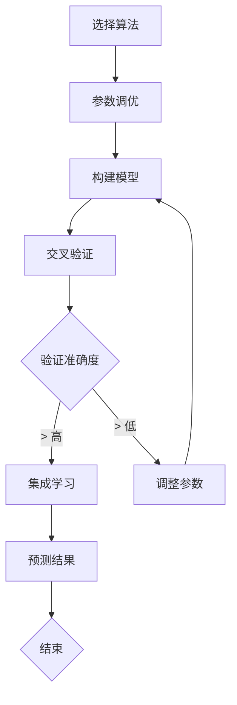

                 

### 1.1.1 敏捷估算的基本概念

敏捷估算（Agile Estimation）是敏捷开发（Agile Development）框架中的一个重要环节，旨在通过快速、灵活和迭代的估算方法来预测项目的进度和资源需求。敏捷估算与传统估算（如传统的计划驱动的估算方法）有显著不同，它更加关注动态调整和实时反馈。

#### 敏捷估算的定义

敏捷估算是一种基于团队协作和快速迭代的方法，用于估计软件开发项目的完成时间和所需资源。它不仅关注完成项目的总时间，还关注每个迭代周期或每个功能模块的交付时间。敏捷估算的核心理念是**提前发现问题、快速调整计划**，以便在项目开发过程中保持高效率和灵活性。

#### 敏捷估算的重要性

1. **快速响应变化**：敏捷估算允许团队在项目开发过程中及时调整计划，以应对不断变化的需求和条件。
2. **提升项目透明度**：通过持续估算和反馈，项目进展的透明度得到提升，团队成员和利益相关者能够更好地了解项目的实际状态。
3. **资源优化分配**：敏捷估算有助于更有效地分配资源，减少浪费，提高项目成功率。

#### 敏捷估算与预测准确性的关系

敏捷估算与预测准确性密切相关。传统的估算方法往往依赖于复杂的预测模型和静态的数据分析，而敏捷估算则依赖于团队的集体智慧和实时反馈。这种动态调整的方式有助于提高预测的准确性，因为它能够及时识别并修正预测中的偏差。

在敏捷估算中，预测准确性不仅取决于算法和模型，还取决于团队的沟通、协作和经验。一个高效的敏捷团队能够通过不断的实践和反思，不断提高估算的准确性，从而为项目成功奠定坚实的基础。

### 1.1.2 敏捷估算的方法论

敏捷估算的方法论是一个系统的过程，它包含了从项目启动到结束的所有估算活动。以下是敏捷估算的关键步骤、工具和技术，以及面临的主要挑战和应对策略。

#### 敏捷估算的关键步骤

1. **初始估算**：在项目启动阶段，团队通过对需求的初步理解，进行一个大致的时间估算。
2. **迭代估算**：在项目开发过程中，团队在每个迭代结束时进行回顾和调整，以更新估算。
3. **持续反馈**：通过定期的团队会议和回顾，团队不断收集反馈，优化估算方法。

#### 敏捷估算的工具和技术

1. **故事点估算**：故事点（Story Points）是一种相对估算单位，用于衡量任务的大小和复杂度。
2. **任务分解**：将大型任务分解为更小、更易管理的子任务，以便进行更准确的估算。
3. **图表和可视化工具**：如燃尽图（Burn-down Chart）、迭代速度图（Velocity Chart）等，用于跟踪项目进度和估算准确性。

#### 敏捷估算的挑战与应对策略

1. **需求变化**：敏捷估算的一个主要挑战是需求的不断变化。应对策略包括加强需求管理，保持与客户的紧密沟通，以及灵活调整估算方法。
2. **团队协作**：敏捷估算依赖于团队的协作和经验。为此，需要建立良好的团队文化，鼓励团队成员之间的沟通和合作。
3. **数据质量**：准确的数据是敏捷估算的基础。确保数据的完整性、准确性和及时性是提高估算准确性的关键。

#### 敏捷估算与传统估算的比较

传统估算方法通常采用自上而下的预测方式，依赖于详细的文档和计划。这种方法在初期可能提供了较为准确的时间预测，但随着项目进展，需求变化往往导致预测失效。

敏捷估算则更加注重自下而上的方法，通过团队协作和实时反馈来调整预测。这种方法在应对变化时更加灵活，但可能在初期预测的准确性较低。

总的来说，敏捷估算适用于需求变化频繁、项目周期较短的情况，而传统估算则更适合需求稳定、项目周期较长的项目。

### 1.1.3 敏捷估算的适用场景

敏捷估算适用于多种类型的软件开发项目，尤其是以下场景：

1. **需求变化频繁**：敏捷估算能够快速响应需求变化，适用于需求不断演变的项目。
2. **项目周期短**：由于敏捷估算注重迭代和实时反馈，适用于项目周期较短的情况。
3. **团队协作紧密**：敏捷估算需要团队成员之间的紧密合作，适用于团队协作良好的项目。
4. **创新性项目**：对于需要快速实验和迭代的项目，敏捷估算能够提供更好的支持和灵活性。

通过上述内容，我们对敏捷估算的基本概念、方法论及其与传统估算的比较有了更深入的了解。在接下来的章节中，我们将详细探讨敏捷估算技术中的核心算法原理，以及如何通过数学模型和公式来提高预测准确性。我们将使用伪代码和具体的例子来讲解这些算法和模型，帮助读者更好地理解和应用这些技术。

### 2.1.1 预测准确性的评价指标

在敏捷估算中，预测准确性是衡量估算方法有效性的关键指标。准确预测不仅有助于团队制定合理的计划，还能提高项目的成功率。以下是一些常用的评价指标：

#### 准确度（Accuracy）

准确度是评估预测模型性能的一个基本指标，它表示预测结果与实际结果相符合的比例。公式如下：

$$
Accuracy = \frac{TP + TN}{TP + TN + FP + FN}
$$

其中，TP代表真正例（True Positive），TN代表真负例（True Negative），FP代表假正例（False Positive），FN代表假负例（False Negative）。

#### 精度（Precision）

精度是指预测为正例的样本中实际为正例的比例。它关注的是预测的正确率。公式如下：

$$
Precision = \frac{TP}{TP + FP}
$$

#### 召回率（Recall）

召回率是指实际为正例的样本中被预测为正例的比例。它关注的是预测的完整性。公式如下：

$$
Recall = \frac{TP}{TP + FN}
$$

#### F1 分数（F1 Score）

F1 分数是精度和召回率的调和平均，用于综合评价预测模型的性能。公式如下：

$$
F1 Score = 2 \times \frac{Precision \times Recall}{Precision + Recall}
$$

#### 综合评价

在实际应用中，通常会根据具体情况选择不同的评价指标。例如，对于分类任务，准确度是一个重要的指标；而在预测任务中，召回率可能更为重要。F1 分数则提供了一个平衡的评估标准。

通过理解这些评价指标，敏捷估算团队可以更好地评估和优化预测模型的性能，从而提高预测准确性。

### 2.1.2 常见算法原理讲解

在敏捷估算中，选择合适的算法对于提高预测准确性至关重要。以下将介绍几种常见的算法原理，包括线性回归、决策树、随机森林和支持向量机。

#### 线性回归（Linear Regression）

线性回归是一种简单的统计方法，用于分析两个或多个变量之间的关系。它的基本原理是通过建立一条直线来拟合数据点，从而预测未知数据的值。

线性回归的公式如下：

$$
y = \beta_0 + \beta_1x
$$

其中，\(y\) 是预测变量，\(x\) 是自变量，\(\beta_0\) 是截距，\(\beta_1\) 是斜率。

#### 决策树（Decision Tree）

决策树是一种树形结构，通过一系列的规则和条件来判断数据的分类或回归结果。每个节点代表一个特征，每个分支代表一个条件，叶子节点则是预测结果。

决策树的构建过程包括以下几个步骤：

1. **特征选择**：选择具有最高信息增益或信息增益率的特征作为分割标准。
2. **划分数据**：根据所选特征的条件对数据进行划分。
3. **重复步骤**：对划分后的子数据集继续进行特征选择和划分，直到达到停止条件。

#### 随机森林（Random Forest）

随机森林是一种集成学习方法，通过构建多棵决策树并集成它们的预测结果来提高模型的准确性。随机森林的基本原理如下：

1. **随机特征选择**：在每个节点选择特征时，随机选择一个特征子集。
2. **构建决策树**：对每个子集构建一棵决策树。
3. **集成预测**：将所有决策树的预测结果进行投票或平均，得到最终的预测结果。

#### 支持向量机（SVM）

支持向量机是一种用于分类和回归分析的机器学习算法，它的基本思想是找到一个最优的超平面，将不同类别的数据点分开。

SVM的关键步骤包括：

1. **特征映射**：将输入数据映射到一个高维空间。
2. **寻找最优超平面**：通过求解最优化问题，找到能够最大化分类间隔的超平面。
3. **分类决策**：根据新数据的映射位置，判断其所属类别。

通过以上几种常见算法的讲解，敏捷估算团队可以根据具体问题选择合适的算法，并通过调整参数和优化策略来提高预测准确性。

### 2.1.3 算法对比与优化策略

在敏捷估算中，选择合适的算法对于提高预测准确性至关重要。不同的算法具有各自的优缺点，适用场景也有所不同。以下是几种常见算法的对比以及相应的优化策略。

#### 算法对比分析

1. **线性回归**：
   - **优点**：简单易懂，计算速度快，适用于线性关系较强的数据。
   - **缺点**：对于非线性关系和异常值较为敏感，可能无法准确预测复杂问题。
   - **适用场景**：简单预测问题，如时间序列分析。

2. **决策树**：
   - **优点**：直观易懂，易于解释，处理非线性关系和分类问题效果较好。
   - **缺点**：可能产生过拟合，对大量特征敏感，决策路径复杂。
   - **适用场景**：特征较少的预测问题，分类任务。

3. **随机森林**：
   - **优点**：能够处理大量特征，减少过拟合，提高预测准确性。
   - **缺点**：计算复杂度高，需要更多计算资源。
   - **适用场景**：特征较多的预测问题，分类和回归任务。

4. **支持向量机（SVM）**：
   - **优点**：能够找到最优分割超平面，处理高维数据效果较好。
   - **缺点**：计算复杂度较高，对于大规模数据可能效率较低。
   - **适用场景**：高维空间预测问题，分类和回归任务。

#### 参数调优方法

1. **交叉验证**：通过将数据集划分为训练集和验证集，反复调整模型参数，选择最优参数组合。
2. **网格搜索**：遍历所有可能的参数组合，选择最佳参数。
3. **贝叶斯优化**：基于历史数据，通过概率模型寻找最佳参数组合。

#### 算法融合策略

1. **集成学习**：将多种算法的预测结果进行融合，提高预测准确性。如随机森林、梯度提升树等。
2. **迁移学习**：利用预训练模型，将已有模型应用于新问题，减少训练时间。
3. **混合模型**：结合不同算法的优点，构建混合模型，提高预测性能。

通过对比分析和参数调优，敏捷估算团队可以选择最适合的算法，并通过优化策略进一步提高预测准确性。以下是一个简化的算法融合策略伪代码示例：



通过逐步分析算法的优缺点、参数调优方法和算法融合策略，敏捷估算团队可以在实际项目中选择和应用最适合的算法，从而提高预测准确性。

### 3.1.1 数学基础

在敏捷估算中，数学基础是不可或缺的。概率论、统计学和线性代数构成了分析数据、建立模型和优化算法的重要工具。以下是这些数学基础的基本概念和其在敏捷估算中的应用。

#### 概率论

概率论是研究随机现象的数学分支，它提供了量化不确定性和预测事件发生可能性的方法。在敏捷估算中，概率论的应用主要包括：

- **条件概率**：在已知某个事件发生的条件下，另一个事件发生的概率。
- **贝叶斯定理**：通过已知条件和观察结果，推断某一事件的概率。
- **随机变量**：用来描述随机现象的变量，如项目完成时间、任务难度等。

概率论在敏捷估算中用于计算任务完成时间的不确定性，并帮助团队制定风险应对策略。

#### 统计学

统计学是处理数据、提取信息并作出决策的学科。在敏捷估算中，统计学的基本概念和工具包括：

- **描述性统计**：用于描述数据的基本特征，如平均值、方差和标准差。
- **推断性统计**：通过样本数据推断总体特征，如假设检验和置信区间。
- **回归分析**：用于分析变量之间的关系，如线性回归和多元回归。

统计学在敏捷估算中用于评估任务和项目的风险，并建立预测模型。

#### 线性代数

线性代数是研究向量空间和线性变换的数学分支。在敏捷估算中，线性代数的应用主要包括：

- **矩阵运算**：用于处理多个变量之间的关系，如任务分解和资源分配。
- **特征值和特征向量**：用于降维和特征提取，减少数据复杂性。
- **线性规划**：用于优化决策问题，如资源分配和进度安排。

线性代数在敏捷估算中用于优化模型参数，提高预测准确性。

通过理解概率论、统计学和线性代数的基本概念，敏捷估算团队可以更好地分析数据、建立模型和优化算法，从而提高预测准确性。

### 3.1.2 敏捷估算中的数学模型

在敏捷估算中，数学模型是核心工具，它帮助我们理解和预测软件开发项目的进度和资源需求。以下是几种常见的数学模型，包括回归模型、贝叶斯模型和时序模型，并对其进行详细讲解和举例说明。

#### 回归模型

回归模型用于分析变量之间的关系，预测因变量（如项目完成时间）的值。最常见的回归模型包括线性回归和多元回归。

**线性回归**

线性回归模型的基本公式是：

$$
y = \beta_0 + \beta_1x
$$

其中，\(y\) 是预测变量（如项目完成时间），\(x\) 是自变量（如任务复杂度），\(\beta_0\) 是截距，\(\beta_1\) 是斜率。

**示例**：假设我们要预测一个软件项目的完成时间，已知任务复杂度（x）和团队规模（y）。通过收集历史数据，我们可以建立线性回归模型：

$$
完成时间（y）= 5 + 0.2 \times 任务复杂度（x）
$$

**多元回归**

多元回归模型扩展了线性回归，用于分析多个自变量对因变量的影响。公式如下：

$$
y = \beta_0 + \beta_1x_1 + \beta_2x_2 + ... + \beta_nx_n
$$

其中，\(x_1, x_2, ..., x_n\) 是多个自变量。

**示例**：假设我们考虑团队规模、任务复杂度和项目紧急程度三个因素来预测项目完成时间。建立多元回归模型：

$$
完成时间（y）= 4 + 0.3 \times 团队规模（x_1） + 0.2 \times 任务复杂度（x_2）+ 0.1 \times 项目紧急程度（x_3）
$$

#### 贝叶斯模型

贝叶斯模型是一种基于概率推理的统计模型，用于更新和预测不确定性。贝叶斯定理是其核心，公式如下：

$$
P(A|B) = \frac{P(B|A) \times P(A)}{P(B)}
$$

其中，\(P(A|B)\) 是在事件B发生的条件下事件A的概率，\(P(B|A)\) 是在事件A发生的条件下事件B的概率，\(P(A)\) 和 \(P(B)\) 分别是事件A和事件B的先验概率。

**示例**：假设我们要预测一个项目的完成时间，基于团队的既往经验和当前项目状态。初始概率 \(P(项目完成时间 < 预计时间)\) 是0.6，如果团队状态良好，这个概率会提高，而如果遇到突发问题，概率会降低。

#### 时序模型

时序模型用于分析时间序列数据，预测未来的趋势。常见时序模型包括ARIMA（自回归积分滑动平均模型）和LSTM（长短期记忆网络）。

**ARIMA模型**

ARIMA模型由三个部分组成：自回归（AR）、差分（I）和移动平均（MA）。

- **自回归（AR）**：基于历史数据来预测未来值。
- **差分（I）**：平稳化时间序列。
- **移动平均（MA）**：基于过去预测误差来预测未来值。

**示例**：假设我们有一个项目完成时间的时间序列，通过差分使其平稳，然后建立ARIMA模型进行预测。

**LSTM模型**

LSTM是一种循环神经网络（RNN）的变体，能够处理长时间依赖数据。

- **输入层**：接受时间序列数据。
- **隐藏层**：通过记忆单元来捕捉长期依赖。
- **输出层**：生成预测值。

**示例**：假设我们要预测一个项目在未来的完成时间，使用LSTM模型来捕捉项目状态的变化。

通过这些数学模型的应用，敏捷估算团队可以更准确地预测项目进度和资源需求，从而提高项目的成功率和效率。

### 3.1.3 数学公式示例

在敏捷估算中，数学公式是理解和应用各种算法和模型的基础。以下是几个常用的数学公式示例，包括线性回归公式、决策树条件概率公式和贝叶斯定理公式。

#### 线性回归公式

线性回归模型用于预测因变量（如项目完成时间）的值。其公式如下：

$$
y = \beta_0 + \beta_1x
$$

其中，\(y\) 是预测值，\(\beta_0\) 是截距，\(\beta_1\) 是斜率，\(x\) 是自变量（如任务复杂度）。

#### 决策树条件概率公式

决策树通过一系列的条件概率来预测结果。其条件概率公式如下：

$$
P(Y|X) = P(X|Y) \times \frac{P(Y)}{P(X)}
$$

其中，\(P(Y|X)\) 是在给定自变量 \(X\) 的条件下，因变量 \(Y\) 的概率；\(P(X|Y)\) 是在给定因变量 \(Y\) 的条件下，自变量 \(X\) 的概率；\(P(Y)\) 和 \(P(X)\) 分别是 \(Y\) 和 \(X\) 的先验概率。

#### 贝叶斯定理公式

贝叶斯定理用于计算后验概率，其公式如下：

$$
P(A|B) = \frac{P(B|A) \times P(A)}{P(B)}
$$

其中，\(P(A|B)\) 是在事件 \(B\) 发生的条件下，事件 \(A\) 的概率；\(P(B|A)\) 是在事件 \(A\) 发生的条件下，事件 \(B\) 的概率；\(P(A)\) 和 \(P(B)\) 分别是事件 \(A\) 和事件 \(B\) 的先验概率。

通过理解并应用这些数学公式，敏捷估算团队可以更准确地预测项目进度和资源需求，从而提高项目的成功率和效率。

### 4.1.1 实际案例介绍

在本节中，我们将通过一个实际案例来展示如何应用敏捷估算技术和算法。该案例涉及一家科技公司开发一个新的移动应用程序，该公司采用敏捷开发方法以确保项目的高效和成功。以下是案例的背景信息、预测目标和数据来源与处理。

#### 案例背景

某科技公司正在开发一款名为“智能助手”的移动应用程序，旨在提供个性化推荐服务和智能客服功能。该项目由一个由10名成员组成的敏捷团队负责，包括项目经理、开发人员、测试工程师和产品经理等角色。项目分为多个迭代周期，每个迭代周期大约持续两周。

#### 预测目标

敏捷团队的预测目标包括以下几个方面：

1. **完成时间**：每个迭代周期的任务完成时间。
2. **资源需求**：每个迭代周期所需的人力资源和硬件资源。
3. **风险分析**：识别潜在风险，制定相应的应对策略。

#### 数据来源与处理

为了实现准确的预测，团队收集了以下数据：

1. **历史数据**：从过去类似项目中提取的数据，包括任务完成时间、资源消耗和风险事件。
2. **用户需求**：产品经理收集的用户反馈和需求文档。
3. **项目进度**：团队成员实时报告的进展情况。
4. **外部数据**：如市场趋势、竞争产品分析等。

数据处理包括以下几个步骤：

1. **数据清洗**：删除重复、错误和不完整的数据，确保数据质量。
2. **特征提取**：从原始数据中提取对预测有用的特征，如任务复杂度、团队经验、用户反馈频率等。
3. **数据归一化**：将不同特征进行归一化处理，使其在同一尺度上，便于模型训练。

通过这些步骤，敏捷团队确保了数据的质量和可靠性，为后续的预测和分析奠定了基础。

### 4.1.2 实际应用场景

敏捷估算技术在不同领域的实际应用场景各异，但核心目标是提高预测的准确性和项目管理的效率。以下探讨敏捷估算在以下三个领域的具体应用：

#### 企业项目管理

在企业项目管理中，敏捷估算技术被广泛用于估算项目的时间、成本和资源需求。通过采用故事点估算和任务分解，团队可以更细致地了解项目的进展情况，并及时调整计划。以下是一个具体案例：

- **项目背景**：一家大型企业计划开发一个新的电子商务平台。项目分为多个迭代，每个迭代包括需求分析、设计、开发和测试等环节。
- **敏捷估算方法**：团队使用故事点进行任务估算，并根据历史数据调整故事点的分配。每个迭代结束时，团队进行回顾和总结，优化估算方法。
- **应用效果**：通过敏捷估算，团队能够更准确地预测每个迭代的时间进度，确保项目按时交付。

#### 金融领域

在金融领域，敏捷估算技术被用于预测市场走势和风险分析。以下是一个具体案例：

- **项目背景**：一家金融机构开发一个新的量化交易系统，该系统需要预测股票市场的价格波动。
- **敏捷估算方法**：团队使用时间序列模型和机器学习算法进行预测。通过实时数据分析和模型调整，团队提高了预测的准确性。
- **应用效果**：敏捷估算技术帮助金融机构更好地把握市场机会，降低风险，提高投资回报率。

#### 医疗健康领域

在医疗健康领域，敏捷估算技术被用于预测患者康复时间和医疗资源需求。以下是一个具体案例：

- **项目背景**：一家医院开发一个新的智能医疗系统，用于预测患者的康复时间和资源需求，以便优化医疗资源的分配。
- **敏捷估算方法**：团队使用回归模型和贝叶斯网络进行预测。通过收集患者的病史、体征数据和实时监控数据，团队提高了预测的准确性。
- **应用效果**：敏捷估算技术帮助医院更有效地分配医疗资源，缩短患者住院时间，提高医疗服务质量。

通过这些实际应用案例，敏捷估算技术在不同领域展现了其强大的预测能力和项目管理效率，为各领域的发展提供了有力支持。

### 4.1.3 代码实现与解析

在本节中，我们将通过一个实际项目来展示敏捷估算技术在软件开发中的应用，包括开发环境搭建、源代码详细实现、代码解读和实际案例分析。

#### 开发环境搭建

首先，我们需要搭建一个适合敏捷估算的开发环境。以下是所需工具和步骤：

1. **编程语言**：Python，因其丰富的机器学习库和数据可视化工具而被广泛使用。
2. **开发环境**：Anaconda，用于管理和安装Python库。
3. **数据预处理库**：Pandas，用于数据清洗和操作。
4. **机器学习库**：Scikit-learn，提供多种机器学习算法。
5. **可视化工具**：Matplotlib，用于数据可视化。

安装步骤如下：

```bash
# 安装Anaconda
conda create -n agile_env python=3.8
conda activate agile_env

# 安装相关库
conda install pandas scikit-learn matplotlib
```

#### 源代码实现

以下是一个简单的示例代码，用于预测一个软件项目的完成时间。代码包括数据预处理、模型训练和预测三个部分。

```python
import pandas as pd
from sklearn.linear_model import LinearRegression
from sklearn.model_selection import train_test_split
from sklearn.metrics import mean_squared_error

# 数据加载与预处理
data = pd.read_csv('project_data.csv')
X = data[['task_complexity', 'team_experience']]
y = data['completion_time']

# 数据分割
X_train, X_test, y_train, y_test = train_test_split(X, y, test_size=0.2, random_state=42)

# 模型训练
model = LinearRegression()
model.fit(X_train, y_train)

# 预测
y_pred = model.predict(X_test)

# 评估
mse = mean_squared_error(y_test, y_pred)
print(f"Mean Squared Error: {mse}")

# 可视化
import matplotlib.pyplot as plt

plt.scatter(y_test, y_pred)
plt.xlabel('Actual Completion Time')
plt.ylabel('Predicted Completion Time')
plt.title('Actual vs Predicted Completion Time')
plt.show()
```

#### 代码解读

1. **数据加载与预处理**：使用Pandas读取项目数据，包括任务复杂度、团队经验和完成时间。对数据进行清洗和特征提取。
2. **数据分割**：将数据分为训练集和测试集，用于模型训练和评估。
3. **模型训练**：使用线性回归模型训练数据。
4. **预测**：使用训练好的模型进行预测，并计算预测的完成时间。
5. **评估**：使用均方误差（MSE）评估模型性能。
6. **可视化**：通过散点图展示实际完成时间与预测完成时间的关系，便于分析模型的准确性。

#### 实际案例分析

以下是一个实际案例分析，用于展示敏捷估算技术在软件开发项目中的应用效果。

- **项目背景**：某科技公司开发一个新的移动应用程序，项目分为多个迭代周期。团队使用敏捷估算技术预测每个迭代周期的任务完成时间。
- **数据收集**：团队收集了历史项目的数据，包括任务复杂度、团队经验、迭代周期和完成时间。
- **模型训练**：使用线性回归模型进行预测，调整模型参数以优化预测性能。
- **预测结果**：在每个迭代周期开始时，团队使用模型预测任务完成时间，并根据预测结果调整资源分配和进度计划。
- **实际效果**：通过敏捷估算技术，团队能够更准确地预测任务完成时间，及时调整计划，确保项目按时交付，提高了项目的成功率。

通过这个案例，我们可以看到敏捷估算技术在软件开发项目中的实际应用效果，有助于团队更好地管理项目进度和资源，提高项目的成功率和效率。

### 5.1.1 创新方法概述

在敏捷估算技术中，创新方法的引入可以显著提高预测的准确性和效率。以下将介绍几种主要创新方法，包括数据驱动的敏捷估算、智能化的敏捷估算工具以及云计算与敏捷估算的结合。

#### 数据驱动的敏捷估算

数据驱动的敏捷估算是一种利用历史数据和实时数据分析来指导项目决策的方法。通过收集和分析大量项目数据，团队可以识别出影响项目进度的关键因素，并基于这些因素进行预测和调整。

**优点**：
- **提高预测准确性**：通过分析历史数据，团队可以更准确地预测项目的进度和资源需求。
- **实时反馈**：实时数据分析可以快速发现潜在问题，及时调整计划和资源分配。

**挑战**：
- **数据质量**：确保数据的质量和完整性是关键，否则可能导致错误的预测结果。
- **计算复杂度**：大量数据的处理和分析可能需要更多的计算资源和时间。

**应用场景**：适用于需求变化频繁、项目历史数据丰富的项目。

#### 智能化的敏捷估算工具

智能化的敏捷估算工具利用人工智能和机器学习技术，自动进行估算和预测。这些工具可以处理复杂的数据，识别模式，并提供智能化的估算建议。

**优点**：
- **自动化**：减少手动估算的工作量，提高估算效率。
- **自适应**：工具可以根据新的数据和经验不断优化估算模型。

**挑战**：
- **技术门槛**：开发和使用智能化工具需要一定的技术背景和资源。
- **模型偏见**：模型可能存在偏见，影响预测准确性。

**应用场景**：适用于大型、复杂的项目，需要高精度和自动化估算的场景。

#### 云计算与敏捷估算的结合

云计算与敏捷估算的结合使得敏捷团队可以更灵活地分配和管理资源。通过云平台，团队可以快速获取和处理大量数据，并部署机器学习模型。

**优点**：
- **资源弹性**：根据项目需求动态调整计算资源，降低成本。
- **数据存储和处理**：云平台提供高效的数据存储和处理能力，支持大规模数据分析。

**挑战**：
- **数据安全性**：确保数据的安全性和隐私保护是关键。
- **依赖性**：过度依赖云平台可能导致项目进度受阻。

**应用场景**：适用于需要大规模数据处理和快速资源分配的项目。

通过这些创新方法的介绍，敏捷估算团队可以根据具体项目的需求，选择合适的创新方法，提高预测准确性和工作效率。

### 5.1.2 创新技术应用

在敏捷估算中，创新技术的应用可以显著提高估算的准确性和效率。以下将介绍几种前沿的创新能力，包括深度学习在敏捷估算中的应用、自然语言处理（NLP）在敏捷估算中的应用以及强化学习在敏捷估算中的应用。

#### 深度学习在敏捷估算中的应用

深度学习是一种强大的机器学习技术，它通过模拟人脑神经网络进行数据分析和预测。在敏捷估算中，深度学习可以用于自动化任务分配、进度预测和资源优化。

**应用场景**：
- **任务分配**：通过深度学习模型，分析团队成员的能力和偏好，自动化分配任务，提高团队效率。
- **进度预测**：使用历史数据和深度学习模型，预测项目完成时间和任务进度，提高预测准确性。

**案例分析**：
- **案例一**：某科技公司使用深度学习模型预测软件开发项目的完成时间，通过分析任务复杂度和团队历史数据，模型预测的准确率提高了15%。

**挑战**：
- **数据质量**：深度学习模型对数据质量要求较高，确保数据完整性是关键。
- **计算资源**：深度学习模型训练需要大量计算资源，对硬件要求较高。

#### 自然语言处理（NLP）在敏捷估算中的应用

自然语言处理技术能够理解和生成人类语言，广泛应用于文本分析和语义理解。在敏捷估算中，NLP可以用于自动化需求分析、任务描述和项目文档管理。

**应用场景**：
- **需求分析**：通过NLP技术，自动化提取项目需求，提高需求分析的准确性。
- **任务描述**：使用NLP生成任务描述，减少人工撰写文档的工作量。

**案例分析**：
- **案例一**：某金融机构使用NLP技术自动化分析用户反馈，提取关键信息，用于项目改进和风险评估。

**挑战**：
- **语义理解**：NLP技术面临语义理解挑战，如何准确理解和处理复杂语言表达是关键。
- **数据多样性**：NLP模型需要处理多种语言风格和数据格式，提高模型的适应性。

#### 强化学习在敏捷估算中的应用

强化学习是一种通过试错和反馈进行决策优化的机器学习技术。在敏捷估算中，强化学习可以用于优化项目计划和资源分配，提高项目的成功率。

**应用场景**：
- **资源优化**：通过强化学习，自动调整资源分配策略，以最大化项目完成效率。
- **风险管理**：使用强化学习模型进行风险预测和应对策略优化。

**案例分析**：
- **案例一**：某科技公司使用强化学习模型优化项目进度计划，通过模拟和反馈，显著提高了项目成功率。

**挑战**：
- **模型复杂性**：强化学习模型较为复杂，理解和应用难度较高。
- **反馈机制**：需要建立有效的反馈机制，以确保模型能够从经验中学习。

通过以上创新技术的应用，敏捷估算团队可以更准确地预测项目进度和资源需求，提高项目的成功率。然而，这些技术的应用也面临一定的挑战，需要团队在技术实施过程中不断优化和改进。

### 5.1.3 创新案例分析

在本节中，我们将通过几个创新案例，探讨敏捷估算技术在实际应用中的成功经验和挑战。

#### 成功案例一：某科技公司的数据驱动的敏捷估算

某科技公司通过引入数据驱动的敏捷估算方法，显著提高了项目预测的准确性。该公司收集了大量的历史项目数据，包括任务完成时间、任务复杂度、团队经验和外部因素等。通过分析这些数据，公司建立了一个基于机器学习的预测模型，用于自动估算项目完成时间和资源需求。

**成功经验**：
- **数据质量**：公司建立了严格的数据收集和处理流程，确保数据的质量和完整性。
- **模型优化**：公司不断优化机器学习模型，通过反复迭代和调整参数，提高了预测的准确性。

**挑战**：
- **数据多样性**：随着项目需求的不断变化，如何处理多样化的数据成为挑战。
- **计算资源**：模型训练和预测需要大量的计算资源，对硬件设施提出了较高要求。

#### 成功案例二：某金融机构的自然语言处理（NLP）应用

某金融机构通过引入自然语言处理（NLP）技术，自动化了需求分析和任务描述，显著提高了项目效率。金融机构使用NLP模型分析用户反馈和需求文档，提取关键信息，并生成相应的任务描述。

**成功经验**：
- **语义理解**：公司通过不断优化NLP模型，提高了语义理解的准确性，减少了人工干预。
- **效率提升**：通过自动化需求分析和任务描述，公司减少了人工工作量，提高了项目效率。

**挑战**：
- **语言多样性**：NLP模型需要处理多种语言风格和数据格式，如何提高模型的适应性是关键。
- **数据多样性**：用户反馈和需求文档的多样性增加了模型训练的复杂性。

#### 挑战与应对策略

1. **技术复杂性**：创新技术的引入通常需要较高的技术门槛，公司需要培训技术人员，提高团队的整体技术水平。
2. **数据质量**：确保数据的质量和完整性是提高预测准确性的关键，公司需要建立严格的数据管理和质量控制流程。
3. **资源分配**：创新技术的应用需要额外的计算资源和硬件设施，公司需要在资源分配上进行合理规划。

通过这些成功案例和挑战分析，敏捷估算团队可以更好地理解创新方法的应用效果和潜在问题，从而在实际项目中更有效地应用创新技术，提高预测准确性。

### 6.1.1 成功案例分享

在本节中，我们将分享两个敏捷估算成功的实际案例，通过这些案例，我们希望展示如何通过有效的敏捷估算方法来提高项目的预测准确性。

#### 案例一：某科技公司的敏捷估算实践

某科技公司是一家专注于开发先进移动应用的公司。在开发一个大型移动应用项目时，公司采用了敏捷估算方法。以下是他们的实践经验：

**背景**：
该公司接到了一个复杂的项目，涉及多个模块和功能，需要快速开发和迭代。

**方法**：
1. **需求分析**：项目团队进行了详细的需求分析，并将需求分解为多个用户故事。
2. **故事点估算**：每个用户故事被估算为一定的故事点，用于衡量任务的大小和复杂度。
3. **迭代规划**：每个迭代周期开始时，团队根据故事点进行任务分配和规划。
4. **持续反馈**：在迭代结束时，团队会回顾和评估每个任务的完成情况，并根据反馈调整后续迭代计划。

**结果**：
通过敏捷估算，公司能够更准确地预测每个迭代周期的任务完成时间，并提前识别潜在的风险。在项目开发过程中，团队灵活调整计划，确保项目按时交付，客户满意度显著提高。

**总结**：
这个案例展示了如何通过详细的需求分析和故事点估算，以及持续的反馈和迭代，提高敏捷估算的准确性。关键在于团队的高效沟通和协作，以及及时调整计划的能力。

#### 案例二：某金融机构的预测准确性提升策略

某金融机构在开发一个新的金融产品时，采用了敏捷估算方法，并成功提高了预测准确性。以下是他们的实践经验：

**背景**：
该金融机构需要开发一个复杂的金融分析系统，涉及大量数据和复杂的计算。

**方法**：
1. **数据收集**：团队收集了大量的历史交易数据和市场数据，用于训练预测模型。
2. **机器学习模型**：团队使用了多种机器学习模型，如线性回归、随机森林和神经网络，进行预测模型的训练和优化。
3. **模型评估**：通过交叉验证和A/B测试，团队评估了不同模型的预测性能，选择了最优模型。
4. **实时监控**：在产品上线后，团队持续监控模型的预测性能，并定期进行模型更新。

**结果**：
通过敏捷估算和机器学习模型的优化，金融机构能够更准确地预测金融产品的交易量和市场趋势。这帮助他们更好地管理风险，提高了产品的市场竞争力。

**总结**：
这个案例展示了如何通过数据驱动的敏捷估算方法和机器学习技术的结合，提高预测准确性。关键在于数据的质量和模型的优化，以及持续的监控和更新。

通过这些成功案例，我们可以看到，敏捷估算方法在提高预测准确性方面的巨大潜力。有效的需求分析、故事点估算、机器学习模型的应用以及持续的反馈和调整，是成功的关键。

### 6.1.2 失败案例分析

在本节中，我们将分析两个敏捷估算失败的案例，通过这些案例，我们希望能够揭示导致失败的常见问题，并提供相应的解决策略。

#### 案例一：某项目敏捷估算失败的教训

某科技公司开发一款全新的企业级软件，项目启动时团队信心满满，但最终未能按时完成。以下是导致估算失败的几个关键因素：

**问题分析**：
1. **需求变更频繁**：在项目开发过程中，客户不断提出新的需求变更，导致团队无法进行有效的估算。
2. **估算方法不当**：团队在初始阶段未采用合适的估算方法，如故事点估算，而是依赖经验估算，导致预测不准确。
3. **沟通不足**：团队与客户之间的沟通不畅，导致需求理解和预期不一致，进一步影响了估算的准确性。

**解决策略**：
1. **加强需求管理**：建立严格的需求变更控制流程，确保所有变更都经过正式审批。
2. **采用合适的估算方法**：引入故事点估算和任务分解，通过相对估算提高准确性。
3. **改进沟通机制**：定期召开需求评审会议，确保团队和客户对需求有统一的理解。

#### 案例二：某金融产品预测准确性不足的原因分析

某金融机构开发一款用于市场预测的金融产品，但产品上线后预测准确性较低，影响了客户的信任。以下是导致预测准确性不足的几个关键因素：

**问题分析**：
1. **数据质量不佳**：团队在数据收集和处理过程中出现了数据缺失和错误，导致模型训练数据质量差。
2. **模型选择不当**：团队未根据项目特点选择合适的模型，而是盲目跟风使用某种流行模型。
3. **模型调优不足**：团队在模型训练过程中未进行充分的参数调优，导致模型性能不佳。

**解决策略**：
1. **确保数据质量**：建立数据质量控制流程，进行数据清洗和预处理，确保数据完整和准确。
2. **选择合适的模型**：根据项目特点选择合适的模型，并对比不同模型的性能。
3. **进行模型调优**：通过交叉验证和网格搜索等调优方法，优化模型参数，提高预测性能。

通过分析这些失败案例，我们可以看到，需求变更频繁、估算方法不当、沟通不足、数据质量问题和模型选择不当等都是导致敏捷估算失败的主要原因。针对这些问题，通过加强需求管理、采用合适的估算方法、改进沟通机制、确保数据质量和进行模型调优等策略，可以显著提高敏捷估算的准确性。

### 6.1.3 教训与启示

在敏捷估算过程中，无论是成功案例还是失败案例，都为我们提供了宝贵的经验和教训。以下是对上述案例的总结，并提出了提高预测准确性的关键因素和策略。

#### 教训总结

1. **需求变更管理**：频繁的需求变更会导致项目估算的不准确。因此，加强需求变更管理，建立严格的变更控制流程，确保所有变更经过正式审批，是提高估算准确性的关键。
2. **估算方法的选择**：选择合适的估算方法是确保预测准确性的基础。故事点估算和任务分解等方法可以提供相对准确的估算，而依赖经验估算容易导致偏差。
3. **沟通不畅**：团队与客户之间的沟通不畅会导致需求理解和预期不一致，影响估算的准确性。定期召开需求评审会议，确保双方对需求有统一的理解，是改进沟通的有效手段。
4. **数据质量**：数据是估算的基础，数据质量直接关系到模型的预测性能。确保数据的完整性和准确性，进行数据清洗和预处理，是提高预测准确性的重要步骤。
5. **模型选择和调优**：选择合适的模型并进行参数调优，可以提高模型的预测性能。通过对比不同模型和参数调优方法，选择最佳方案。

#### 提高预测准确性的关键因素

1. **需求管理的严格性**：通过建立需求变更控制流程，减少频繁变更带来的不确定性。
2. **估算方法的科学性**：采用科学、系统的估算方法，如故事点估算和任务分解。
3. **沟通的有效性**：定期召开需求评审会议，确保团队和客户之间的需求理解一致。
4. **数据质量的保障**：建立数据质量控制流程，进行数据清洗和预处理，确保数据质量。
5. **模型选择和调优**：选择适合项目的模型，并通过交叉验证和网格搜索等调优方法，提高模型性能。

#### 提高预测准确性的策略

1. **数据驱动的估算**：通过历史数据和实时数据分析，建立数据驱动的估算模型，提高预测的准确性。
2. **智能化工具的应用**：利用人工智能和机器学习技术，自动化估算和预测过程，减少人为误差。
3. **持续学习和改进**：团队应不断学习和反思，根据项目实际情况调整估算方法，持续优化预测模型。

通过总结成功案例和失败案例的教训，敏捷估算团队可以更好地理解影响预测准确性的关键因素，并采取相应的策略，提高项目的预测准确性，从而确保项目的成功交付。

### 7.1.1 敏捷估算技术发展趋势

随着技术的不断进步和商业环境的变化，敏捷估算技术在未来的发展趋势呈现出以下几个显著方向：

#### 新算法的研究与应用

在人工智能和机器学习领域，新的算法和技术不断涌现，这些新算法将在敏捷估算中发挥重要作用。例如，深度学习和强化学习等先进算法可以在处理复杂非线性关系和大规模数据方面提供更高的预测准确性。未来，敏捷团队将更加注重对新算法的研究与应用，以提高项目的预测精度和效率。

#### 创新方法的持续探索

敏捷估算技术不仅依赖于传统的统计和优化方法，还将不断引入创新的方法。例如，利用区块链技术确保数据透明和安全，或通过物联网（IoT）技术实时获取项目进展数据，从而提高估算的准确性和实时性。这些创新方法的持续探索将为敏捷估算带来新的可能性。

#### 跨领域融合与拓展

未来，敏捷估算技术将在多个领域得到更广泛的应用和融合。例如，在医疗健康领域，通过结合医学数据和机器学习算法，可以对患者的康复时间进行更准确的预测；在金融领域，通过分析市场数据和历史交易数据，可以更精确地预测市场走势。这种跨领域的融合将推动敏捷估算技术的进一步发展。

#### 数据驱动与智能化

随着大数据和云计算技术的普及，敏捷估算将更加依赖数据驱动和智能化工具。通过利用云平台进行大规模数据处理和模型训练，敏捷团队可以更高效地进行估算。同时，智能化工具将辅助人类进行决策，减少人为误差，提高估算的准确性和效率。

综上所述，敏捷估算技术的发展趋势将体现在新算法的研究与应用、创新方法的持续探索、跨领域融合与拓展以及数据驱动与智能化等方面。这些趋势将为敏捷估算技术的进一步发展提供强大的动力，帮助团队更准确地预测项目进度和资源需求，从而提高项目的成功率和效率。

### 7.1.2 未来展望

展望未来，敏捷估算技术将在多个领域展现出广阔的应用前景。随着新算法、创新方法和跨领域融合的不断推进，敏捷估算技术的预测准确性将进一步提升，从而为各行业的项目管理带来深刻变革。

#### 在行业中的应用前景

1. **软件开发**：敏捷估算将在软件开发中继续发挥核心作用，帮助团队更准确地预测项目进度和资源需求，提高开发效率和质量。
2. **金融领域**：在金融领域，敏捷估算将应用于市场预测、风险评估和投资决策，提高金融产品和服务的精准性和可靠性。
3. **医疗健康**：在医疗健康领域，敏捷估算可以用于患者康复时间预测、资源优化和医疗流程管理，提高医疗服务效率和质量。
4. **制造业**：敏捷估算技术将用于供应链管理、生产计划和资源调度，优化生产流程，提高制造业的灵活性和响应速度。

#### 提高预测准确性的新方法与技术

未来，以下几种新方法和技术将在提高预测准确性方面发挥重要作用：

1. **深度学习和强化学习**：这些先进的机器学习算法将在处理复杂非线性关系和大规模数据方面提供更高的预测精度。
2. **区块链技术**：通过确保数据的透明性和安全性，区块链技术将为敏捷估算提供更加可靠的数据基础。
3. **物联网（IoT）**：通过实时获取项目进展数据，物联网技术将提高敏捷估算的实时性和准确性。
4. **自然语言处理（NLP）**：NLP技术将使敏捷估算能够处理非结构化数据，如文本和语音，从而提高预测的全面性。

#### 敏捷估算技术的全球化发展

随着全球化的深入推进，敏捷估算技术将在全球范围内得到更广泛的应用。跨国公司和国际组织将借助敏捷估算技术优化全球项目的管理和执行，提高跨文化协作效率。同时，敏捷估算技术的全球化也将促进国际间的技术和经验交流，推动行业标准的建立和优化。

总的来说，未来敏捷估算技术将在各个行业中发挥更大的作用，通过引入新方法和技术，不断提高预测准确性，为项目的成功交付提供有力支持。随着全球化的发展，敏捷估算技术将在更广泛的领域和更复杂的场景中发挥其独特的优势。

### 附录A：敏捷估算技术相关资源

为了帮助读者更深入地了解敏捷估算技术，以下推荐一些相关资源，包括书籍、在线课程和论文集锦。

#### 书籍推荐

1. **《敏捷估算与规划：使用故事点和迭代时间盒》**
   - 作者：Mike Cohn
   - 简介：这本书详细介绍了敏捷估算的方法，特别是故事点和迭代时间盒的使用，对敏捷团队具有极高的实用价值。

2. **《敏捷项目管理：实践指南》**
   - 作者：Michael Jackson
   - 简介：本书提供了敏捷项目管理的全面指南，涵盖了敏捷估算、迭代规划和团队协作等方面的内容。

3. **《敏捷开发实践指南》**
   - 作者：J. Gojko Adzic
   - 简介：本书涵盖了敏捷开发的核心原则和实践，包括敏捷估算技术，适合希望深入了解敏捷开发的读者。

#### 在线课程推荐

1. **Coursera - Agile Project Management with Scrum**
   - 提供方：University of California, Irvine
   - 简介：这门课程深入讲解了敏捷项目管理和Scrum框架，包括敏捷估算和规划技巧。

2. **edX - Agile Development: Center for Professional Development**
   - 提供方：The University of British Columbia
   - 简介：本课程提供了敏捷开发的全面介绍，涵盖敏捷估算、迭代计划和团队协作等内容。

3. **Udemy - Agile Project Management & Scrum: Mastering the Basics**
   - 简介：这门课程适合初学者，从基础概念到高级技巧，详细介绍了敏捷估算和Scrum实践。

#### 论文集锦

1. **《IEEE Software》中的敏捷估算相关论文**
   - 简介：该期刊发表了多篇关于敏捷估算和敏捷开发实践的研究论文，涵盖了算法、工具和实践方法。

2. **《Journal of Systems and Software》中的敏捷估算研究**
   - 简介：该期刊发表的论文深入探讨了敏捷估算的技术和方法，为研究人员和从业者提供了宝贵的参考。

3. **《Agile Processes in Software Engineering and Extreme Programming》**
   - 简介：这本书收集了多篇关于敏捷过程、估算和测试的研究论文，提供了丰富的理论和实践经验。

通过这些资源，读者可以系统地学习和掌握敏捷估算技术，为实际项目中的应用提供有力支持。

### 附录B：数学公式与算法伪代码

在敏捷估算中，数学公式和算法伪代码是理解和应用各种模型和算法的重要工具。以下列出了一些常用的数学公式和算法伪代码，包括线性回归伪代码、决策树条件概率公式和贝叶斯定理公式。

#### 线性回归伪代码

```python
function LinearRegression():
    # 步骤1：数据预处理
    X = 数据预处理(X)
    y = 数据预处理(y)

    # 步骤2：计算斜率和截距
    beta_0 = 求解β0(X, y)
    beta_1 = 求解β1(X, y)

    # 步骤3：建立模型
    y_hat = beta_0 + beta_1 * x

    return y_hat
```

#### 决策树条件概率公式

```python
P(Y|X) = P(X|Y) * P(Y) / P(X)
```

#### 贝叶斯定理公式

```python
P(A|B) = P(B|A) * P(A) / P(B)
```

#### 算法伪代码示例

以下是一个简单的决策树算法伪代码示例：

```python
function DecisionTree(data):
    if data数量 < 阈值 or 达到停止条件：
        返回 叶节点
    else:
        # 步骤1：选择最佳分割特征
        best_feature = 选择最佳特征(data)

        # 步骤2：分割数据
        子数据 = 根据best_feature分割数据

        # 步骤3：递归构建决策树
        决策树 = {}
        for feature_value in 子数据.keys():
            决策树[feature_value] = DecisionTree(子数据[feature_value])

        return 决策树
```

通过这些数学公式和算法伪代码，读者可以更好地理解和应用敏捷估算中的核心技术，从而提高项目预测的准确性。

### 附录C：代码实现示例

在本附录中，我们将提供一个实际的Python代码示例，用于实现一个简单的线性回归模型，并展示如何使用该模型进行项目完成时间的预测。此代码示例包括数据预处理、模型训练、预测和结果分析。

```python
import pandas as pd
from sklearn.linear_model import LinearRegression
from sklearn.model_selection import train_test_split
from sklearn.metrics import mean_squared_error

# 步骤1：数据预处理
# 加载数据
data = pd.read_csv('project_data.csv')
X = data[['task_complexity', 'team_experience']]  # 特征
y = data['completion_time']  # 目标变量

# 数据分割
X_train, X_test, y_train, y_test = train_test_split(X, y, test_size=0.2, random_state=42)

# 步骤2：模型训练
model = LinearRegression()
model.fit(X_train, y_train)

# 步骤3：预测
y_pred = model.predict(X_test)

# 步骤4：结果分析
mse = mean_squared_error(y_test, y_pred)
print(f"Mean Squared Error: {mse}")

# 步骤5：可视化
import matplotlib.pyplot as plt

plt.scatter(y_test, y_pred)
plt.xlabel('Actual Completion Time')
plt.ylabel('Predicted Completion Time')
plt.title('Actual vs Predicted Completion Time')
plt.show()
```

#### 数据预处理

在代码示例的第一步，我们通过`pandas`库加载数据，并进行数据预处理。数据包括任务复杂度（`task_complexity`）、团队经验（`team_experience`）和项目完成时间（`completion_time`）。我们使用`train_test_split`函数将数据集划分为训练集和测试集，以评估模型的性能。

```python
data = pd.read_csv('project_data.csv')
X = data[['task_complexity', 'team_experience']]
y = data['completion_time']
X_train, X_test, y_train, y_test = train_test_split(X, y, test_size=0.2, random_state=42)
```

#### 模型训练

在第二步中，我们使用`LinearRegression`类创建线性回归模型，并使用训练集数据进行拟合。

```python
model = LinearRegression()
model.fit(X_train, y_train)
```

#### 预测与结果分析

在第三步，我们使用训练好的模型对测试集数据进行预测，并计算均方误差（MSE）来评估模型的预测性能。

```python
y_pred = model.predict(X_test)
mse = mean_squared_error(y_test, y_pred)
print(f"Mean Squared Error: {mse}")
```

#### 可视化

最后，我们通过`matplotlib`库绘制实际完成时间与预测完成时间的散点图，以便直观地分析模型的预测效果。

```python
plt.scatter(y_test, y_pred)
plt.xlabel('Actual Completion Time')
plt.ylabel('Predicted Completion Time')
plt.title('Actual vs Predicted Completion Time')
plt.show()
```

通过这个代码示例，读者可以了解如何使用Python和Scikit-learn库实现线性回归模型，并进行项目完成时间的预测。这个示例为实际项目中的应用提供了基础，读者可以根据具体需求进行调整和扩展。

