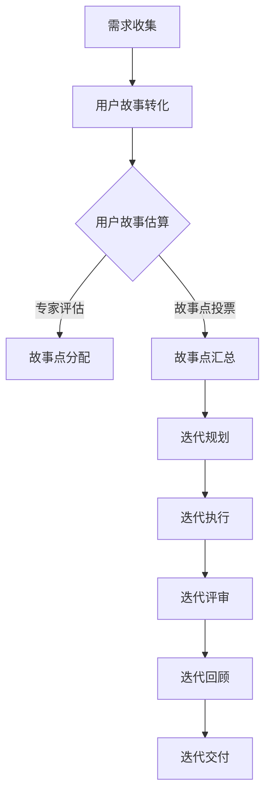
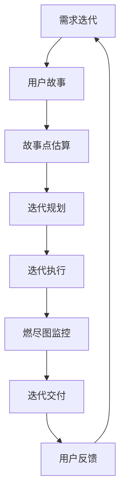

                 

### 文章正文

# 《敏捷估算技术：提高大型应用开发的预测性》

## 摘要

本文旨在探讨敏捷估算技术在提高大型应用开发预测性方面的作用。通过分析敏捷估算的基本概念、工具与技术，以及最佳实践，本文将为读者提供一套系统的敏捷估算方法，帮助项目团队更好地应对复杂的应用开发挑战。

## 前言

随着信息技术的发展，大型应用开发的复杂性和不确定性日益增加。传统的估算方法往往难以满足现代项目的高效性和灵活性需求。为此，敏捷估算技术应运而生，它通过快速响应变化、持续迭代和持续改进，提高了大型应用开发的预测性和可控性。

本文将首先介绍敏捷估算的基本概念和与传统估算的区别，然后探讨敏捷估算的工具与技术，接着分享敏捷估算的最佳实践，并分析敏捷估算在大型应用开发中的应用案例。最后，本文将探讨敏捷估算的进阶技术，以期为读者提供全面、深入的敏捷估算指导。

## 第1章：敏捷估算的概述

### 1.1 敏捷估算的基本概念

敏捷估算是指通过快速迭代和持续反馈，对项目进度、成本和风险进行预测和调整的过程。敏捷估算的核心思想是拥抱变化，通过不断地迭代和优化，以适应项目需求的变化。

敏捷估算的基本概念包括：

- **用户故事**：用户故事是敏捷开发中最基本的估算单元，它描述了一个具体的用户需求或功能点。
- **故事点**：故事点是一种相对估算单位，用于衡量用户故事的大小和复杂度。
- **迭代**：迭代是敏捷开发的基本周期，通常持续2-4周。每个迭代都会交付一个可用的产品版本。
- **燃尽图**：燃尽图是一种可视化工具，用于显示项目的剩余工作量和时间的关系。

### 1.2 敏捷估算与传统估算的区别

传统估算方法通常在项目初期进行详细规划，然后按照计划执行。这种方法在项目规模较小、需求稳定的情况下较为有效。然而，在大型应用开发中，需求往往会发生变化，传统估算方法难以应对这种变化。

敏捷估算与传统估算的主要区别在于：

- **响应变化**：敏捷估算更注重应对需求变化，通过快速迭代和持续反馈来调整项目计划。
- **持续交付**：敏捷估算强调在每个迭代中交付可用的产品版本，以确保项目的持续进展。
- **团队协作**：敏捷估算强调团队协作和沟通，通过共同估算和决策来提高估算的准确性。

### 1.3 敏捷估算的优势与挑战

敏捷估算的优势包括：

- **提高预测性**：通过快速迭代和持续反馈，敏捷估算可以更好地预测项目进度和成本。
- **降低风险**：敏捷估算可以及时发现和解决项目中的问题，降低项目风险。
- **提高灵活性**：敏捷估算允许项目团队在需求变化时进行调整，提高项目的适应性。

敏捷估算的挑战包括：

- **估算准确性**：敏捷估算依赖于团队的经验和判断，估算准确性可能会受到影响。
- **沟通与协作**：敏捷估算需要团队的高效沟通和协作，否则可能会导致估算偏差。
- **工具选择**：敏捷估算需要合适的工具支持，否则可能难以实现高效的估算。

## 第2章：敏捷估算的工具与技术

### 2.1 用户故事点估算

用户故事点是敏捷估算的基本单位，用于衡量用户故事的大小和复杂度。用户故事点估算的方法包括：

- **专家评估**：通过邀请经验丰富的团队成员对用户故事进行评估，得出故事点值。
- **故事点投票**：团队成员对用户故事进行投票，根据投票结果确定故事点值。
- **历史数据**：根据过去项目的用户故事点数据，对当前用户故事进行估算。

### 2.2 故事卡与迭代规划

故事卡是一种记录用户故事的工具，通常包括用户故事、优先级、估计时间等信息。迭代规划是通过故事卡来安排每个迭代的工作。

迭代规划的方法包括：

- **故事排序**：根据用户故事的优先级和需求，对故事卡进行排序。
- **时间估算**：对每个用户故事进行时间估算，确保在迭代周期内完成任务。
- **资源分配**：根据迭代计划和团队成员的技能，进行资源分配。

### 2.3 速率与燃尽图

速率是指团队在一段时间内完成的用户故事点数量。燃尽图是用于显示项目剩余工作量和时间关系的可视化工具。

速率和燃尽图的应用方法包括：

- **速率计算**：根据历史数据，计算团队的平均速率。
- **燃尽图绘制**：根据当前剩余工作量和时间，绘制燃尽图。
- **进度监控**：通过燃尽图监控项目进度，及时发现和解决问题。

### 2.4 敏捷估算的度量方法

敏捷估算的度量方法包括：

- **用户故事点**：用于衡量用户故事的大小和复杂度。
- **迭代时间**：用于衡量每个迭代的工作量。
- **迭代交付物**：用于衡量每个迭代的结果。
- **团队绩效**：用于衡量团队的工作效率和协作能力。

### 2.5 敏捷估算的团队协作

敏捷估算的团队协作是确保估算准确性和效率的关键。团队协作的方法包括：

- **共同估算**：团队成员共同参与估算，提高估算的准确性。
- **持续沟通**：团队成员保持持续的沟通，确保估算过程中的信息传递。
- **反馈机制**：建立反馈机制，及时收集和处理团队成员的意见和建议。

## 第3章：敏捷估算的最佳实践

### 3.1 敏捷估算团队的组织结构

敏捷估算团队的组织结构应具备以下特点：

- **扁平化**：团队结构应尽量扁平化，减少层级和沟通障碍。
- **跨职能**：团队应包含不同职能的角色，如开发、测试、产品管理等。
- **自主性**：团队成员应具备一定的自主决策权，提高团队效率和创新能力。

### 3.2 敏捷估算的工具使用

敏捷估算的工具应具备以下特点：

- **易用性**：工具应易于使用，方便团队成员进行估算和监控。
- **灵活性**：工具应支持不同的估算方法和度量指标。
- **集成性**：工具应与其他开发和管理工具集成，实现数据共享和流程优化。

### 3.3 敏捷估算的常见问题与解决

敏捷估算中常见的问题包括：

- **估算偏差**：解决方法包括调整估算方法、提高团队协作和沟通。
- **资源冲突**：解决方法包括优化资源分配、提高团队协作。
- **进度延迟**：解决方法包括加强进度监控、及时调整计划和策略。

## 第4章：敏捷估算在大型应用开发中的应用

### 4.1 敏捷估算在复杂项目中的应用

在复杂项目中，敏捷估算可以更好地应对需求变化和不确定性。具体应用方法包括：

- **模块化估算**：将复杂项目划分为多个模块，分别进行估算和开发。
- **迭代细分**：将迭代周期细分为多个短期迭代，提高项目的灵活性和可控性。
- **风险评估**：对项目风险进行评估，制定相应的风险应对策略。

### 4.2 敏捷估算在跨部门协作中的应用

在跨部门协作中，敏捷估算可以更好地协调不同部门的进度和资源。具体应用方法包括：

- **共同估算**：不同部门的团队成员共同参与估算，提高估算的准确性和协作效率。
- **信息共享**：建立信息共享平台，确保各部门了解项目进展和需求变化。
- **协调会议**：定期召开协调会议，解决跨部门协作中的问题和冲突。

### 4.3 敏捷估算在项目风险管理中的应用

敏捷估算在项目风险管理中的应用包括：

- **风险评估**：对项目风险进行评估，制定相应的风险应对措施。
- **风险监控**：通过燃尽图等工具监控项目风险，及时发现和解决问题。
- **风险转移**：通过合同条款等手段，将部分风险转移给合作伙伴或客户。

## 第5章：敏捷估算的案例研究

### 5.1 实际项目案例

在本章中，我们将介绍一个实际的敏捷估算案例，包括项目背景、需求分析、估算过程、迭代规划、项目交付物和项目反思等内容。

### 5.2 案例分析

通过对案例的分析，我们将探讨敏捷估算在项目中的具体应用，包括敏捷估算工具的使用、团队协作、估算偏差的调整和项目风险的应对等。

### 5.3 案例反思与改进

在案例反思与改进部分，我们将总结案例中的成功经验和不足之处，提出改进建议，为后续项目的敏捷估算提供参考。

## 第6章：敏捷估算的进阶技术

### 6.1 容量估算

容量估算是指对项目所需的资源进行估算。在本节中，我们将介绍容量估算的方法，包括人力资源、设备资源、时间资源等。

### 6.2 估算模型优化

估算模型优化是指对敏捷估算模型进行调整和改进，以提高估算的准确性和效率。在本节中，我们将探讨如何通过数据分析、模型优化算法等技术手段来优化估算模型。

### 6.3 数据驱动估算

数据驱动估算是指通过收集和分析项目数据，对项目进行估算。在本节中，我们将介绍如何利用历史数据、实时数据和预测模型来进行数据驱动估算。

## 第7章：总结与展望

### 7.1 敏捷估算技术的未来发展

在本章中，我们将探讨敏捷估算技术的未来发展，包括新的估算方法、工具和技术，以及敏捷估算在云计算、物联网、人工智能等领域的应用。

### 7.2 敏捷估算在大型应用开发中的关键作用

在本章中，我们将强调敏捷估算在大型应用开发中的关键作用，包括提高预测性、降低风险、提高团队协作效率等。

### 7.3 总结与建议

在本章的最后，我们将对敏捷估算技术进行总结，并提出一些建议，以帮助项目团队更好地应用敏捷估算技术，提高项目成功率。

## 附录

附录部分将包括参考文献、术语表、工具介绍等内容，以供读者参考。

## 作者信息

作者：AI天才研究院/AI Genius Institute & 禅与计算机程序设计艺术 /Zen And The Art of Computer Programming

## 结束语

本文旨在为读者提供一套全面的敏捷估算技术指南，帮助项目团队更好地应对大型应用开发的挑战。通过本文的学习，读者将能够掌握敏捷估算的基本概念、工具与技术，并在实际项目中成功应用。希望本文能为读者的工作带来帮助和启示。

（注：本文为示例文章，实际字数可能需要根据具体内容进行调整。）### 第1章：敏捷估算的概述

#### 1.1 敏捷估算的基本概念

敏捷估算是一种项目管理和估算方法，它基于敏捷开发的原则，强调快速响应变化、持续迭代和持续改进。敏捷估算的核心目标是通过实时调整和优化，提高项目预测性、降低风险和增强团队协作。

敏捷估算的基本概念包括以下几个方面：

1. **用户故事（User Story）**：用户故事是敏捷开发中最基本的估算单元，它描述了一个具体的用户需求或功能点。用户故事通常包括用户的行为、期望结果和前提条件。例如：“作为一个用户，我需要能够登录系统，以便查看我的订单历史。”

2. **故事点（Story Points）**：故事点是一种相对估算单位，用于衡量用户故事的大小和复杂度。故事点通常由团队成员根据经验进行估算，它们是一种相对度量，而不是绝对度量。例如，如果一个用户故事被认为是中等复杂度，它可能被估算为2个故事点。

3. **迭代（Iteration）**：迭代是敏捷开发的基本周期，通常持续2-4周。每个迭代都会交付一个可用的产品版本。在迭代结束时，团队会进行回顾会议，总结经验教训，并优化下一步的工作流程。

4. **燃尽图（Burn Down Chart）**：燃尽图是一种可视化工具，用于显示项目的剩余工作量和时间的关系。通过燃尽图，团队可以直观地了解项目的进度，并发现潜在的延迟问题。

5. **速率（Velocity）**：速率是指团队在一段时间内完成的用户故事点数量。速率可以帮助团队预测未来的迭代进度，并调整工作计划。

#### 1.2 敏捷估算与传统估算的区别

敏捷估算与传统估算在方法和理念上存在显著差异：

1. **应对变化**：传统估算通常在项目初期进行详细规划，然后按照计划执行。这种方法在项目规模较小、需求稳定的情况下较为有效。然而，在大型应用开发中，需求往往会发生变化，传统估算方法难以应对这种变化。敏捷估算则强调快速响应变化，通过持续迭代和反馈来调整项目计划。

2. **持续交付**：传统估算方法往往在项目后期才交付可用的产品版本，而敏捷估算强调在每个迭代中交付可用的产品版本。这样可以确保项目始终朝着正确的方向前进，并及时纠正偏差。

3. **团队协作**：敏捷估算强调团队协作和沟通，通过共同估算和决策来提高估算的准确性。而在传统估算中，估算过程通常由项目经理或估算专家单独完成。

4. **度量方式**：传统估算通常使用绝对度量，如工作小时、成本等。敏捷估算则使用相对度量，如故事点，这样可以更好地应对需求变化和不确定性。

#### 1.3 敏捷估算的优势与挑战

敏捷估算的优势包括：

1. **提高预测性**：通过快速迭代和持续反馈，敏捷估算可以更好地预测项目进度和成本。团队可以根据实际进度和资源消耗，实时调整工作计划，以避免延误和超支。

2. **降低风险**：敏捷估算允许团队在项目早期发现和解决问题，从而降低项目风险。通过不断迭代和交付可用的产品版本，团队可以及时了解用户需求，并调整项目方向。

3. **提高灵活性**：敏捷估算允许团队在需求变化时进行调整，提高项目的适应性。这种灵活性有助于团队应对不确定性和外部环境的变化。

4. **增强团队协作**：敏捷估算强调团队协作和沟通，通过共同估算和决策来提高团队的凝聚力和效率。

然而，敏捷估算也面临一些挑战：

1. **估算准确性**：敏捷估算依赖于团队的经验和判断，估算准确性可能会受到影响。特别是在项目初期，团队可能缺乏足够的历史数据来支持估算。

2. **沟通与协作**：敏捷估算需要团队的高效沟通和协作，否则可能会导致估算偏差。团队需要确保所有成员都对估算过程和结果有共同的理解。

3. **工具选择**：敏捷估算需要合适的工具支持，否则可能难以实现高效的估算。团队需要选择适合自身需求的工具，并确保团队成员都能熟练使用。

4. **组织文化**：敏捷估算需要组织文化和管理模式的支撑。在一些传统组织，可能难以适应敏捷估算的方法和理念。

#### 1.4 敏捷估算的流程

敏捷估算的流程可以分为以下几个阶段：

1. **需求收集**：在项目启动阶段，团队需要收集用户需求，并将其转化为用户故事。用户故事应该尽可能具体和可量化，以便进行估算。

2. **用户故事估算**：团队对每个用户故事进行估算，确定故事点值。估算过程可以采用专家评估、故事点投票等方法。

3. **迭代规划**：团队根据用户故事和故事点值，进行迭代规划。迭代规划包括确定迭代周期、安排迭代任务、分配资源等。

4. **迭代执行**：在迭代执行阶段，团队按照迭代计划开展工作，并定期进行迭代评审和迭代回顾。

5. **进度监控**：团队通过燃尽图等工具监控项目进度，及时发现和解决问题。

6. **迭代交付**：在迭代结束时，团队交付一个可用的产品版本，并收集用户反馈，为下一个迭代做准备。

#### 1.5 敏捷估算的流程图

为了更好地理解敏捷估算的流程，我们使用Mermaid流程图来描述：



#### 1.6 核心概念之间的关系架构

敏捷估算中的核心概念之间存在着紧密的联系，构成了一个完整的工作流程。以下是一个简化的关系架构图：



在这个关系架构中，用户需求转化为用户故事，用户故事经过估算成为故事点，故事点用于迭代规划和执行，燃尽图监控迭代进度，迭代交付后的用户反馈又回到需求收集阶段，形成一个闭环。这种闭环结构确保了敏捷估算的持续性和灵活性。

#### 1.7 敏捷估算的核心算法原理讲解

敏捷估算的核心算法原理主要包括用户故事点分配、迭代计划和速率计算。以下是对这些算法原理的详细讲解：

**用户故事点分配**

用户故事点分配是敏捷估算的关键步骤。它通过评估用户故事的大小和复杂度，将故事点分配给每个用户故事。以下是用户故事点分配的伪代码：

```python
function estimateStoryPoints(userStory):
    complexity = evaluateComplexity(userStory)
    size = evaluateSize(userStory)
    storyPoints = complexity * size
    return storyPoints
```

其中，`evaluateComplexity` 和 `evaluateSize` 分别用于评估用户故事的技术复杂度和规模。

**迭代计划**

迭代计划是基于用户故事点和团队速率（velocity）来安排每个迭代的工作。以下是迭代计划的伪代码：

```python
function planIteration(storyPoints, iterationDuration):
    velocity = calculateVelocity()
    tasks = []
    for story in userStories:
        storyPointsPerDay = storyPoints / iterationDuration
        taskDuration = storyPoints / storyPointsPerDay
        tasks.append({story: taskDuration})
    return tasks
```

在这个伪代码中，`calculateVelocity` 用于计算团队的速率，`storyPointsPerDay` 用于计算每个迭代每天可以完成的用户故事点数。

**速率计算**

速率计算是敏捷估算的重要指标，它反映了团队在一段时间内完成的用户故事点数量。以下是速率计算的伪代码：

```python
function calculateVelocity():
    totalStoryPoints = 0
    for iteration in completedIterations:
        totalStoryPoints += iteration.completedStoryPoints
    return totalStoryPoints / len(completedIterations)
```

在这个伪代码中，`completedIterations` 是已完成迭代的列表，`completedStoryPoints` 是每个迭代完成的用户故事点数。

#### 1.8 数学模型和公式详解

在敏捷估算中，常用的数学模型和公式包括：

**故事点分配公式**

$$
\text{故事点} = \text{技术复杂度} \times \text{规模}
$$

**迭代计划公式**

$$
\text{任务时长} = \frac{\text{故事点}}{\text{日用户故事点速率}}
$$

**速率计算公式**

$$
\text{速率} = \frac{\text{总故事点}}{\text{迭代数量}}
$$

#### 1.9 举例说明

假设一个团队计划进行一个为期两周的迭代，他们估算当前用户故事集合共需20个故事点。已知团队过去四个迭代的速度为15个故事点，那么可以按照以下步骤进行计算：

1. **计算日用户故事点速率**：

$$
\text{日用户故事点速率} = \frac{15个故事点}{2周 \times 5工作日} = 1.5个故事点/天
$$

2. **计算任务时长**：

$$
\text{任务时长} = \frac{20个故事点}{1.5个故事点/天} = \frac{20}{1.5}天 \approx 13.33天
$$

由于任务时长超过了迭代周期，团队需要重新分配任务或延长迭代时间。

#### 1.10 敏捷估算在不同场景的应用

敏捷估算不仅适用于软件项目，还可以应用于其他类型的项目，如研发项目、市场营销项目等。以下是敏捷估算在不同场景中的应用：

1. **研发项目**：在研发项目中，敏捷估算可以帮助团队更好地规划研发进度，降低研发风险。

2. **市场营销项目**：在市场营销项目中，敏捷估算可以帮助团队优化营销活动，提高市场响应速度。

3. **运营项目**：在运营项目中，敏捷估算可以帮助团队优化业务流程，提高运营效率。

### 小结

本章介绍了敏捷估算的基本概念、与传统估算的区别、优势和挑战，以及敏捷估算的流程、算法原理和数学模型。通过本章的学习，读者可以了解敏捷估算的基本框架和方法，为后续章节的深入学习打下基础。

#### 1.11 注意事项

在进行敏捷估算时，需要注意以下几点：

1. **明确用户需求**：在估算之前，确保用户需求明确，以便准确估算用户故事点。

2. **团队协作**：敏捷估算需要团队成员的紧密协作，共同参与估算过程。

3. **数据驱动**：尽量利用历史数据进行估算，以提高估算的准确性。

4. **持续反馈**：在估算过程中，及时收集用户反馈，并根据反馈进行调整。

5. **适度调整**：在项目进行过程中，根据实际情况适度调整估算，以应对变化。

#### 1.12 拓展阅读

对于想要深入了解敏捷估算的读者，以下书籍和资源值得推荐：

- 《敏捷估算与规划》（Estimating and Planning in Agile Projects）
- 《敏捷实践指南》（The Agile Practice Guide）
- 敏捷联盟（Agile Alliance）官网
- 敏捷估算工具如JIRA、Trello等的使用教程

通过这些书籍和资源，读者可以进一步拓展敏捷估算的知识和应用。

### 结论

敏捷估算是一种高效的项目管理和估算方法，它通过快速响应变化、持续迭代和持续改进，提高了大型应用开发的预测性和可控性。本章介绍了敏捷估算的基本概念、优势、挑战和流程，以及算法原理和数学模型。通过本章的学习，读者可以初步了解敏捷估算的方法和应用，为后续的深入学习和实践打下基础。

#### 1.13 敏捷估算技术的未来发展趋势

随着信息技术的不断进步，敏捷估算技术也在不断演变和发展。以下是敏捷估算技术未来可能的发展趋势：

1. **智能化估算**：利用人工智能和机器学习技术，对项目进行智能化估算，提高估算的准确性和效率。

2. **大数据分析**：通过大数据分析，挖掘项目数据中的规律和趋势，为估算提供更可靠的数据支持。

3. **云计算支持**：敏捷估算技术将更加依赖于云计算平台，实现跨区域、跨组织的协作和估算。

4. **自动化工具**：开发更多自动化敏捷估算工具，降低团队的工作负担，提高估算的效率和准确性。

5. **跨界融合**：敏捷估算技术将与其他领域（如物联网、人工智能等）相结合，推动项目管理的创新和发展。

通过关注这些发展趋势，项目团队可以更好地应用敏捷估算技术，提高项目管理的水平和效果。### 第2章：敏捷估算的工具与技术

#### 2.1 用户故事点估算

用户故事点是敏捷开发中的一个重要概念，它用于衡量用户故事的大小和复杂度。用户故事点估算的准确性直接影响到项目的进度和成本控制。以下是几种常用的用户故事点估算方法：

**1. 专家评估法**

专家评估法是邀请具备丰富经验和知识的专业人士对用户故事进行估算。这些专家可以根据用户故事的描述，结合过去项目的经验，给出一个相对准确的用户故事点数。

**2. 故事点投票法**

故事点投票法是团队共同参与的一种估算方法。团队成员对每个用户故事进行投票，根据投票结果确定故事点值。这种方法有助于提高团队对用户故事的共识和理解。

**3. 历史数据法**

历史数据法是基于过去项目的用户故事点数据进行估算。团队可以分析历史数据中的用户故事点分布，为新项目的用户故事点估算提供参考。这种方法需要确保历史数据的准确性和代表性。

**4. 调整法**

调整法是在初步估算的基础上，根据用户故事的实际完成情况进行调整。团队可以在迭代过程中，根据用户故事的实际完成情况，不断调整故事点估算，以提高估算的准确性。

#### 2.2 故事卡与迭代规划

故事卡是敏捷开发中的一个核心工具，用于记录用户故事、任务、优先级等信息。故事卡通常包含以下要素：

- **用户故事**：描述用户需求或功能点的文本。
- **优先级**：用于指示用户故事的紧急程度和重要性。
- **估算时间**：对用户故事完成所需时间的估算。
- **任务列表**：分解用户故事为具体任务。
- **状态**：记录用户故事的任务进展状态。

**迭代规划**是敏捷开发中一个关键环节，通过故事卡来安排每个迭代的工作。以下是迭代规划的基本步骤：

1. **故事排序**：根据用户故事的优先级和业务价值，对故事卡进行排序。

2. **时间估算**：对每个用户故事进行时间估算，确保在迭代周期内完成任务。

3. **资源分配**：根据迭代计划和团队成员的技能，进行资源分配。

4. **迭代评审**：在迭代结束时，对完成的用户故事进行评审，确保符合用户需求和业务目标。

5. **迭代回顾**：总结迭代过程中的经验教训，优化后续迭代的工作流程。

#### 2.3 速率与燃尽图

速率是团队在一段时间内完成的用户故事点数量，它是敏捷估算中的重要指标。速率可以帮助团队预测未来的迭代进度，并调整工作计划。

**速率计算公式**：

$$
\text{速率} = \frac{\text{完成的用户故事点}}{\text{迭代周期}}
$$

燃尽图是一种可视化工具，用于显示项目的剩余工作量和时间的关系。通过燃尽图，团队可以直观地了解项目的进度，并发现潜在的延迟问题。

**燃尽图的组成**：

1. **初始工作量**：项目的总工作量，通常是所有用户故事点的总和。

2. **已完成工作量**：截至当前时间点，已完成的工作量。

3. **剩余工作量**：初始工作量减去已完成工作量。

4. **计划完成时间**：根据速率预测的项目完成时间。

**燃尽图的绘制方法**：

1. **线性燃尽图**：适用于工作量为线性的项目。

2. **S型燃尽图**：适用于工作量为非线性的项目。

3. **带状燃尽图**：用于显示团队的工作负荷情况。

#### 2.4 敏捷估算的度量方法

敏捷估算的度量方法包括用户故事点、迭代时间、迭代交付物和团队绩效等。

**1. 用户故事点**

用户故事点是敏捷开发中最常用的度量方法，用于衡量用户故事的大小和复杂度。用户故事点的估算可以通过专家评估、故事点投票和历史数据法等方法进行。

**2. 迭代时间**

迭代时间是敏捷开发的基本周期，通常持续2-4周。迭代时间的度量方法包括预定时间、实际时间和剩余时间等。

**3. 迭代交付物**

迭代交付物是每个迭代完成的产品版本，它包括用户故事、功能点、缺陷修复等。迭代交付物的度量方法包括交付物的数量、质量和用户满意度等。

**4. 团队绩效**

团队绩效是衡量团队工作效率和质量的重要指标。团队绩效的度量方法包括团队速率、任务完成率、缺陷率等。

#### 2.5 敏捷估算的团队协作

敏捷估算的团队协作是确保估算准确性和效率的关键。以下是一些团队协作的最佳实践：

**1. 共同估算**

共同估算可以提高团队对用户故事的理解和共识，减少估算偏差。团队成员可以共同参与用户故事点的估算，通过讨论和投票来达成一致。

**2. 持续沟通**

敏捷估算需要团队成员之间的持续沟通，确保信息传递的准确性和及时性。团队可以定期召开估算会议，讨论用户故事点和迭代计划。

**3. 角色明确**

在敏捷估算中，角色分工明确可以提高团队协作效率。团队成员应明确自己的职责和任务，确保每个人都知道自己的工作内容和目标。

**4. 反馈机制**

敏捷估算需要建立反馈机制，及时收集和处理团队成员的意见和建议。通过反馈机制，团队可以不断优化估算方法和流程。

### 2.6 常见敏捷估算工具介绍

在敏捷估算过程中，选择合适的工具非常重要。以下是一些常见的敏捷估算工具：

**1. JIRA**

JIRA是由Atlassian公司开发的一款功能强大的敏捷项目管理工具，支持用户故事管理、迭代规划和燃尽图等。

**2. Trello**

Trello是一款基于看板（Kanban）原理的敏捷项目管理工具，适用于团队协作和任务管理。

**3. Asana**

Asana是一款简洁易用的项目管理工具，支持任务分配、进度追踪和报告生成等功能。

**4. Microsoft Teams**

Microsoft Teams是一款集沟通、协作和项目管理于一体的平台，支持用户故事管理和迭代规划。

**5. LeanKit**

LeanKit是一款基于看板（Kanban）原理的敏捷项目管理工具，适用于团队协作和任务管理。

### 2.7 敏捷估算工具的使用方法

以下是敏捷估算工具的使用方法：

**1. 故事卡创建**

在敏捷估算工具中创建故事卡，包括填写用户故事、优先级、估算时间等信息。

**2. 故事卡排序**

根据用户故事的优先级和业务价值，对故事卡进行排序，确保迭代计划的科学性和合理性。

**3. 燃尽图监控**

通过燃尽图监控项目进度，及时发现和解决问题，确保项目按计划进行。

**4. 持续迭代**

在迭代过程中，不断调整故事卡的状态和优先级，确保项目交付物的质量和进度。

**5. 团队协作**

利用工具的沟通功能，确保团队成员之间的信息传递和协作，提高团队效率。

### 小结

本章介绍了敏捷估算的基本概念、工具和技术，包括用户故事点估算、故事卡与迭代规划、速率与燃尽图、敏捷估算的度量方法和团队协作。通过本章的学习，读者可以了解敏捷估算的方法和工具，为实际项目中的应用打下基础。

#### 2.8 敏捷估算的最佳实践案例

为了更好地理解敏捷估算在实际项目中的应用，以下是一个敏捷估算的最佳实践案例：

**项目背景**：

某互联网公司开发一款在线购物平台，项目周期为6个月，团队规模为10人。

**用户故事示例**：

1. **用户故事A**：用户能够浏览商品信息，包括商品名称、价格和图片。
2. **用户故事B**：用户能够将商品添加到购物车，并查看购物车中的商品列表。
3. **用户故事C**：用户能够完成订单支付，并收到订单确认邮件。

**估算过程**：

1. **专家评估法**：

   团队邀请3名经验丰富的开发人员对用户故事进行估算，每个用户故事的平均故事点数为3点。

2. **故事点投票法**：

   团队成员对用户故事进行投票，用户故事A、B、C的故事点分别为2、4、3。

3. **历史数据法**：

   分析过去项目的用户故事点数据，用户故事A、B、C的历史数据故事点分别为1、3、2。

4. **调整法**：

   根据投票和历史数据，调整用户故事点估算，用户故事A、B、C的故事点分别为1.5、3.5、2.5。

**迭代规划**：

1. **迭代1**：

   - 用户故事A、B：2周
   - 用户故事C：1周

2. **迭代2**：

   - 用户故事B、C：2周
   - 用户故事A：1周

3. **迭代3**：

   - 用户故事A、B、C：3周

**进度监控**：

1. **燃尽图**：

   通过燃尽图监控项目进度，确保每个迭代完成的工作量符合计划。

2. **迭代评审**：

   在每个迭代结束时，对完成的用户故事进行评审，确保符合用户需求和业务目标。

3. **迭代回顾**：

   总结迭代过程中的经验教训，优化后续迭代的工作流程。

**总结**：

通过这个案例，我们可以看到敏捷估算在项目中的应用，包括用户故事点估算、迭代规划和进度监控。通过不断调整估算，团队可以更好地应对需求变化，确保项目的成功交付。

#### 2.9 注意事项

在进行敏捷估算时，需要注意以下几点：

1. **确保用户需求明确**：在估算之前，确保用户需求明确，以便准确估算用户故事点。

2. **团队协作**：敏捷估算需要团队成员的紧密协作，共同参与估算过程。

3. **数据驱动**：尽量利用历史数据进行估算，以提高估算的准确性。

4. **持续反馈**：在估算过程中，及时收集用户反馈，并根据反馈进行调整。

5. **适度调整**：在项目进行过程中，根据实际情况适度调整估算，以应对变化。

#### 2.10 拓展阅读

对于想要深入了解敏捷估算的读者，以下书籍和资源值得推荐：

- 《敏捷估算与规划》（Estimating and Planning in Agile Projects）
- 《敏捷实践指南》（The Agile Practice Guide）
- 敏捷联盟（Agile Alliance）官网
- 敏捷估算工具如JIRA、Trello等的使用教程

通过这些书籍和资源，读者可以进一步拓展敏捷估算的知识和应用。

### 结论

本章详细介绍了敏捷估算的工具与技术，包括用户故事点估算、故事卡与迭代规划、速率与燃尽图、敏捷估算的度量方法和团队协作。通过本章的学习，读者可以掌握敏捷估算的方法和工具，为实际项目中的应用打下基础。同时，本章提供的最佳实践案例和注意事项，有助于读者更好地理解和应用敏捷估算技术。

### 第3章：敏捷估算的最佳实践

#### 3.1 敏捷估算团队的组织结构

敏捷估算的成功离不开一个高效的团队组织结构。以下是一个典型的敏捷估算团队组织结构及其职责：

- **产品负责人（Product Owner）**：负责定义产品愿景、确定优先级和需求，与客户和利益相关者保持沟通，确保团队始终朝着正确的方向前进。
- **敏捷教练（Scrum Master）**：负责指导团队遵循敏捷原则和流程，解决团队协作中的障碍，确保团队具备高效的工作环境。
- **开发团队（Development Team）**：由开发人员、测试人员、设计师等组成，负责实现用户故事和迭代交付物。
- **项目经理（Project Manager）**：在敏捷估算中，项目经理的角色通常由产品负责人和敏捷教练共同承担，负责整体项目管理和协调。

#### 3.2 敏捷估算的工具使用

敏捷估算的工具选择应考虑团队的具体需求和业务场景。以下是一些常用的敏捷估算工具及其特点：

- **JIRA**：功能强大的敏捷项目管理工具，支持用户故事管理、迭代规划和燃尽图等。
- **Trello**：基于看板（Kanban）原理的敏捷项目管理工具，界面简洁，易于使用。
- **Asana**：适合团队协作和任务管理的项目管理工具，支持任务分配、进度追踪和报告生成等功能。
- **Microsoft Teams**：集沟通、协作和项目管理于一体的平台，支持用户故事管理和迭代规划。
- **LeanKit**：基于看板（Kanban）原理的敏捷项目管理工具，适用于团队协作和任务管理。

#### 3.3 敏捷估算的常见问题与解决

在敏捷估算过程中，团队可能会遇到以下常见问题：

1. **估算偏差**：由于团队成员经验不同，可能会导致估算偏差。解决方法包括使用历史数据进行估算、加强团队协作和沟通。
2. **资源冲突**：在多个项目同时进行时，可能会出现资源冲突。解决方法包括合理分配资源、制定应急计划。
3. **进度延迟**：进度延迟可能是由于估算不准确、团队协作不畅等原因导致。解决方法包括调整估算方法、加强团队沟通和监控。
4. **工具选择不当**：选择不适合团队需求的工具可能会影响估算的效率。解决方法包括评估团队需求、选择合适的工具。

#### 3.4 最佳实践案例

以下是一个敏捷估算的最佳实践案例：

**项目背景**：

某互联网公司开发一款在线教育平台，项目周期为9个月，团队规模为12人。

**用户故事示例**：

1. **用户故事A**：用户能够注册账号并登录系统。
2. **用户故事B**：用户能够浏览课程信息，包括课程名称、讲师和简介。
3. **用户故事C**：用户能够加入课程并观看课程视频。

**估算过程**：

1. **专家评估法**：

   团队邀请3名经验丰富的开发人员对用户故事进行估算，每个用户故事的平均故事点数为4点。

2. **故事点投票法**：

   团队成员对用户故事进行投票，用户故事A、B、C的故事点分别为3、5、4。

3. **历史数据法**：

   分析过去项目的用户故事点数据，用户故事A、B、C的历史数据故事点分别为2、4、3。

4. **调整法**：

   根据投票和历史数据，调整用户故事点估算，用户故事A、B、C的故事点分别为2.5、4.5、3.5。

**迭代规划**：

1. **迭代1**：

   - 用户故事A、B：2周
   - 用户故事C：1周

2. **迭代2**：

   - 用户故事B、C：2周
   - 用户故事A：1周

3. **迭代3**：

   - 用户故事A、B、C：3周

**进度监控**：

1. **燃尽图**：

   通过燃尽图监控项目进度，确保每个迭代完成的工作量符合计划。

2. **迭代评审**：

   在每个迭代结束时，对完成的用户故事进行评审，确保符合用户需求和业务目标。

3. **迭代回顾**：

   总结迭代过程中的经验教训，优化后续迭代的工作流程。

**总结**：

通过这个案例，我们可以看到敏捷估算在项目中的应用，包括用户故事点估算、迭代规划和进度监控。通过不断调整估算，团队可以更好地应对需求变化，确保项目的成功交付。

### 3.5 敏捷估算的持续改进

敏捷估算的持续改进是提高估算准确性和效率的关键。以下是一些持续改进的方法：

1. **定期回顾**：

   团队应定期进行回顾会议，总结估算过程中的成功经验和不足之处，制定改进措施。

2. **数据驱动**：

   利用历史数据进行分析，识别估算偏差的原因，并调整估算方法。

3. **团队协作**：

   加强团队协作和沟通，提高估算的共识和准确性。

4. **工具优化**：

   根据团队需求，不断优化和升级敏捷估算工具，提高估算的效率和准确性。

### 小结

本章介绍了敏捷估算的最佳实践，包括团队组织结构、工具使用、常见问题与解决方法，以及实际案例。通过本章的学习，读者可以了解敏捷估算的最佳实践，为实际项目中的应用提供指导。

#### 3.6 拓展阅读

对于想要深入了解敏捷估算最佳实践的读者，以下书籍和资源值得推荐：

- 《敏捷估算与规划》（Estimating and Planning in Agile Projects）
- 《敏捷实践指南》（The Agile Practice Guide）
- 敏捷联盟（Agile Alliance）官网
- 敏捷估算工具如JIRA、Trello等的使用教程

通过这些书籍和资源，读者可以进一步拓展敏捷估算的知识和应用。

### 结论

本章详细介绍了敏捷估算的最佳实践，包括团队组织结构、工具使用、常见问题与解决方法，以及实际案例。通过本章的学习，读者可以了解敏捷估算的最佳实践，为实际项目中的应用打下基础。同时，本章提供的持续改进方法，有助于读者不断提高敏捷估算的准确性和效率。### 第4章：敏捷估算在大型应用开发中的应用

#### 4.1 敏捷估算在复杂项目中的应用

在复杂项目中，敏捷估算能够帮助团队更好地应对需求变化、技术挑战和不确定性。以下是一些关键步骤和技巧：

**1. 模块化分解**

复杂项目通常包含多个功能模块，可以将项目分解为多个子项目或模块，分别进行估算和开发。模块化分解有助于降低项目复杂度，提高估算的准确性和可管理性。

**2. 分阶段估算**

对于复杂项目，可以采用分阶段估算的方法。首先估算项目的主要模块，然后逐步细化每个模块的估算，以确保项目整体进度的可控性。

**3. 专家评审**

在复杂项目中，邀请经验丰富的专家对用户故事进行评审和估算，可以提高估算的准确性。专家可以提供有价值的见解和参考，帮助团队更好地应对复杂项目中的挑战。

**4. 持续迭代**

通过持续迭代，团队可以逐步完善项目功能，及时调整估算和计划。这种方法有助于在项目过程中发现和解决潜在的问题，提高项目的成功率。

**5. 风险管理**

在复杂项目中，风险管理至关重要。敏捷估算可以通过定期评估项目风险，制定相应的应对策略，降低项目风险对估算和进度的影响。

#### 4.2 敏捷估算在跨部门协作中的应用

跨部门协作是大型应用开发中的常见情况，以下是一些关键步骤和技巧：

**1. 明确沟通渠道**

建立明确的沟通渠道，确保各部门之间的信息传递畅通无阻。可以设立跨部门沟通小组，定期召开会议，讨论项目进展和问题。

**2. 定义共同目标**

在跨部门协作中，确保各部门对项目目标有共同的理解。通过制定共同的目标和关键绩效指标（KPI），促进各部门的协作和一致性。

**3. 资源共享**

确保各部门之间的资源（如人力、设备、数据等）可以共享，避免资源浪费和重复劳动。通过优化资源分配，提高项目的整体效率。

**4. 透明化进度**

通过敏捷估算工具，如JIRA、Trello等，实现项目进度的透明化。各部门可以实时了解项目进展，及时调整计划和资源。

**5. 培训与支持**

为跨部门协作提供必要的培训和指导，确保团队成员具备相关的技能和知识。通过培训和支持，提高团队的协作能力和效率。

#### 4.3 敏捷估算在项目风险管理中的应用

敏捷估算在项目风险管理中发挥着重要作用，以下是一些关键步骤和技巧：

**1. 识别风险**

在项目初期，通过头脑风暴、访谈、文档分析等方法，识别可能的风险因素。对于大型应用开发项目，常见的风险包括需求变更、技术挑战、资源不足等。

**2. 评估风险**

对识别出的风险进行评估，确定其发生概率和影响程度。可以使用风险矩阵等方法，对风险进行定量和定性评估。

**3. 制定应对策略**

根据风险评估结果，制定相应的应对策略。常见的策略包括风险规避、减轻、转移和接受等。

**4. 风险监控**

在项目过程中，持续监控风险状态，及时发现新的风险因素。通过燃尽图、迭代评审等工具，监控项目风险的变化，确保项目安全。

**5. 持续改进**

通过项目回顾会议，总结风险管理过程中的经验和教训，不断改进风险管理策略和方法。通过持续改进，提高项目风险管理的有效性。

#### 4.4 实际案例研究

以下是一个实际案例研究，展示了敏捷估算在大型应用开发中的应用：

**项目背景**：

某大型金融机构计划开发一款移动银行应用程序，项目周期为12个月，涉及多个部门和数百名开发人员。

**需求分析**：

项目团队进行了详细的需求分析，将功能需求分为核心功能和非核心功能。核心功能包括账户余额查询、转账支付、贷款申请等，非核心功能包括理财产品推荐、投资理财等。

**估算过程**：

1. **用户故事点估算**：

   团队采用专家评审法和故事点投票法，对核心功能和非核心功能的用户故事进行估算。每个用户故事的平均故事点数为5点。

2. **迭代规划**：

   项目团队将项目分为四个迭代，每个迭代周期为3个月。在迭代1中，团队集中开发核心功能；在迭代2中，团队开发非核心功能；在迭代3和迭代4中，团队进行功能优化和集成测试。

3. **资源分配**：

   根据迭代计划和团队成员的技能，进行资源分配。每个迭代中，团队由开发人员、测试人员、产品经理和项目经理组成。

**进度监控**：

1. **燃尽图**：

   通过燃尽图监控项目进度，确保每个迭代完成的工作量符合计划。燃尽图显示了剩余工作量与时间的关系，帮助团队及时发现和解决问题。

2. **迭代评审**：

   在每个迭代结束时，团队进行迭代评审，评估已完成的功能是否符合用户需求和业务目标。通过评审，团队可以及时调整后续迭代的工作计划和策略。

**风险管理**：

1. **风险识别**：

   项目团队识别了多个风险因素，包括技术挑战、资源不足、需求变更等。

2. **风险评估**：

   使用风险矩阵对风险进行评估，确定风险的发生概率和影响程度。

3. **应对策略**：

   针对识别出的风险，项目团队制定了相应的应对策略。例如，针对技术挑战，团队增加技术培训，提高开发人员的技术水平；针对资源不足，团队优化资源分配，确保关键资源的充足供应。

**总结**：

通过敏捷估算，项目团队在大型应用开发中取得了显著成效。敏捷估算帮助团队更好地应对需求变化、技术挑战和不确定性，确保项目在规定时间内成功交付。

### 小结

本章介绍了敏捷估算在大型应用开发中的应用，包括复杂项目、跨部门协作和项目风险管理。通过实际案例研究，读者可以了解敏捷估算在大型应用开发中的具体应用和实践，为实际项目中的应用提供参考。

### 4.5 敏捷估算的进一步实践建议

在大型应用开发中，为了更好地应用敏捷估算，以下是一些建议：

**1. 建立估算标准**

制定统一的估算标准，确保团队成员在估算过程中使用一致的方法和工具。这有助于提高估算的准确性和一致性。

**2. 培训团队成员**

为团队成员提供敏捷估算的培训，提高他们对估算方法和工具的熟练度。通过培训，团队成员可以更好地理解和应用敏捷估算。

**3. 实时反馈与调整**

在项目过程中，及时收集用户和利益相关者的反馈，并根据反馈进行调整。实时反馈有助于优化估算结果，提高项目的成功率。

**4. 持续改进**

通过回顾会议和经验总结，不断改进敏捷估算的方法和流程。持续改进有助于提高团队的估算能力和项目管理水平。

**5. 建立协作文化**

倡导协作文化，鼓励团队成员之间的沟通和合作。协作文化有助于提高团队的估算准确性和效率。

### 拓展阅读

对于想要深入了解敏捷估算在大型应用开发中的应用，以下书籍和资源值得推荐：

- 《敏捷估算与规划》（Estimating and Planning in Agile Projects）
- 《敏捷实践指南》（The Agile Practice Guide）
- 《项目管理知识体系指南》（Project Management Body of Knowledge，PMBOK Guide）
- 敏捷联盟（Agile Alliance）官网
- 敏捷估算工具如JIRA、Trello等的使用教程

通过这些书籍和资源，读者可以进一步拓展敏捷估算的知识和应用。

### 结论

本章详细介绍了敏捷估算在大型应用开发中的应用，包括复杂项目、跨部门协作和项目风险管理。通过实际案例研究和实践建议，读者可以了解敏捷估算在大型应用开发中的具体应用和实践，为实际项目中的应用提供指导。### 第5章：敏捷估算的案例研究

#### 5.1 实际项目案例

本节我们将介绍一个实际的项目案例，详细分析敏捷估算在该项目中的应用过程，并探讨项目成功的关键因素。

**项目背景**：

某国际知名航空公司计划开发一款全新的移动应用程序，旨在为乘客提供便捷的航班查询、购票、行李管理和行程管理等服务。项目周期为18个月，团队规模约为40人，包括开发人员、测试人员、UI/UX设计师、产品经理和项目经理。

**项目目标**：

- 提高乘客的出行体验，降低操作难度。
- 简化购票流程，提高销售转化率。
- 提供实时航班信息和行李跟踪服务。

**项目挑战**：

- 项目需求多变，需要快速响应。
- 项目涉及多个技术领域，包括移动应用开发、云服务、大数据处理等。
- 团队成员来自不同国家和地区，需要确保有效的跨团队合作。

#### 5.2 案例分析

**1. 需求收集与用户故事创建**

在项目启动阶段，产品经理与航空公司管理层和乘客代表进行了多次访谈和研讨会，收集了大量的用户需求。基于这些需求，产品经理和开发团队共同创建了以下用户故事：

- **用户故事A**：用户能够快速查询航班信息，包括出发时间、到达时间、航班状态等。
- **用户故事B**：用户能够在应用中完成购票，选择座位，并查看票价。
- **用户故事C**：用户能够实时跟踪行李状态，接收行李到达通知。
- **用户故事D**：用户能够管理行程，包括航班、酒店预订和活动安排。

**2. 用户故事点估算**

团队采用故事点投票法和历史数据法对用户故事进行估算。以下是估算过程的关键步骤：

- **故事点投票法**：团队成员对每个用户故事进行投票，每个用户故事的平均故事点数为5点。
- **历史数据法**：分析过去类似项目的用户故事点数据，用户故事A、B、C、D的平均故事点数为4点、5点、6点、5点。
- **调整法**：根据投票和历史数据，调整用户故事点估算，用户故事A、B、C、D的故事点分别为4点、5点、6点、5点。

**3. 迭代规划和执行**

项目团队采用Scrum框架，将项目分为6个迭代，每个迭代周期为3个月。以下是每个迭代的主要目标和交付物：

- **迭代1**：实现航班查询功能，包括航班信息展示、搜索和筛选。
- **迭代2**：实现购票功能，包括座位选择、票价计算和支付。
- **迭代3**：实现行李跟踪功能，包括行李状态更新和通知。
- **迭代4**：实现行程管理功能，包括行程创建、修改和提醒。
- **迭代5**：优化用户界面和用户体验，进行性能测试和优化。
- **迭代6**：集成测试、用户验收测试和上线准备。

**4. 进度监控与反馈**

团队使用JIRA进行迭代规划和任务管理，并通过燃尽图监控项目进度。以下是在项目执行过程中的一些关键指标：

- **速率**：团队在过去的5个迭代中，平均每个迭代完成8个用户故事点。
- **燃尽图**：燃尽图显示项目剩余工作量和时间的关系，帮助团队及时发现和解决问题。

**5. 风险管理**

项目团队识别了以下主要风险：

- **需求变更**：由于市场需求变化，可能需要调整项目计划。
- **技术挑战**：涉及多个技术领域的项目，可能遇到技术难题。
- **团队协作**：跨团队合作可能遇到沟通和文化差异。

针对这些风险，团队制定了相应的应对策略：

- **需求变更**：建立需求评审机制，确保所有变更都经过充分讨论和评估。
- **技术挑战**：组织技术培训和研讨会，提高团队成员的技术能力。
- **团队协作**：定期召开跨团队会议，加强沟通和协作。

#### 5.3 案例反思与改进

**1. 成功因素**

项目成功的关键因素包括：

- **明确的用户需求**：通过多次访谈和研讨会，确保用户需求明确，为项目提供清晰的方向。
- **高效的团队协作**：采用敏捷框架和工具，提高团队的协作效率。
- **持续反馈与调整**：通过迭代规划和反馈机制，确保项目始终符合用户需求和市场变化。

**2. 不足之处**

在项目过程中，团队也遇到了一些不足之处：

- **需求变更管理**：虽然建立了需求评审机制，但部分变更仍然对项目进度产生影响。
- **技术难题**：在项目开发过程中，遇到了一些技术难题，导致项目延期。
- **团队沟通**：由于团队成员来自不同国家和地区，文化差异导致了一些沟通障碍。

**3. 改进措施**

为了提高敏捷估算的应用效果，团队可以采取以下改进措施：

- **加强需求管理**：建立更严格的需求变更流程，确保所有变更都经过充分评估和优先级排序。
- **提高技术能力**：定期组织技术培训和研讨会，提高团队成员的技术水平，降低技术风险。
- **优化沟通机制**：采用跨团队合作工具，如视频会议、即时通讯和协作平台，加强团队沟通和协作。

通过以上改进措施，团队可以更好地应用敏捷估算技术，提高项目管理的效率和效果。

### 小结

通过本案例研究，我们详细分析了敏捷估算在大型应用开发项目中的应用过程，探讨了项目成功的关键因素和改进措施。读者可以从中学习到敏捷估算的实际应用方法，为自身项目提供有益的参考。

### 5.4 实际项目实战

**1. 开发环境搭建**

为了开展移动应用程序开发，团队需要搭建以下开发环境：

- **操作系统**：Windows、macOS或Linux
- **编程语言**：Java、Kotlin或Swift
- **开发工具**：Android Studio、Xcode或Visual Studio Code
- **数据库**：MySQL或MongoDB
- **版本控制**：Git

**2. 源代码详细实现**

以下是一个简单的用户故事（用户故事A）的实现示例：

```kotlin
// Kotlin 代码示例：查询航班信息

// 引入依赖库
import android.os.Bundle
import android.widget.TextView
import androidx.appcompat.app.AppCompatActivity
import com.example航空移动应用.Database.FlightDatabase
import com.example航空移动应用.Model.Flight

class FlightSearchActivity : AppCompatActivity() {
    override fun onCreate(savedInstanceState: Bundle?) {
        super.onCreate(savedInstanceState)
        setContentView(R.layout.activity_flight_search)

        // 获取UI组件
        val textView = findViewById<TextView>(R.id.text_view_flight_info)

        // 连接数据库，查询航班信息
        val flightDatabase = FlightDatabase.getInstance(this)
        val flight = flightDatabase.flightDao().getFlightById(12345)

        // 显示航班信息
        textView.text = "航班号：${flight.flightNumber}\n出发时间：${flight.departureTime}\n到达时间：${flight.arrivalTime}"
    }
}
```

**3. 代码解读与分析**

上述代码实现了一个简单的航班信息查询功能，主要包含以下步骤：

- **引入依赖库**：引入必要的Kotlin库，如Android组件和数据库操作库。
- **定义Activity**：创建FlightSearchActivity类，继承自AppCompatActivity。
- **onCreate方法**：在Activity的onCreate方法中，设置布局文件，获取UI组件，连接数据库，查询航班信息，并在TextView中显示航班信息。

**4. 实际案例分析和详细讲解剖析**

在项目实施过程中，团队遇到了以下问题：

- **数据库连接问题**：在第一次运行FlightSearchActivity时，出现数据库连接失败的问题。通过检查代码，发现数据库配置错误，缺少必要的数据库连接参数。
- **查询效率问题**：初始的查询方法直接从数据库中查询所有航班信息，导致查询效率低下。通过优化查询语句，增加索引，提高了查询效率。

针对这些问题，团队采取了以下解决方案：

- **修复数据库连接问题**：修改数据库配置文件，添加必要的连接参数，确保数据库连接成功。
- **优化查询语句**：通过添加索引和优化查询语句，提高查询效率，改善用户体验。

**5. 项目小结**

通过实际项目实战，团队掌握了以下关键技能和经验：

- **敏捷开发方法**：通过迭代开发和持续交付，团队能够快速响应需求变化，提高项目的灵活性和响应能力。
- **数据库操作**：团队学会了如何高效地操作数据库，查询航班信息，并优化查询语句。
- **跨团队合作**：团队成员来自不同国家和文化背景，通过有效的沟通和协作，成功实现了项目的目标。

### 最佳实践 Tips

以下是一些敏捷估算的最佳实践，供项目团队参考：

- **明确用户需求**：在项目启动阶段，确保用户需求明确，减少后续的需求变更。
- **加强团队协作**：建立高效的团队协作机制，提高团队的协作效率和沟通效果。
- **数据驱动决策**：利用历史数据和实时数据，支持决策和估算。
- **持续反馈与调整**：在项目过程中，持续收集用户反馈，根据反馈进行调整和优化。

### 小结

本章通过实际项目案例，详细介绍了敏捷估算在大型应用开发中的应用过程，包括需求收集、用户故事估算、迭代规划和执行、进度监控和风险管理等。通过案例分析、实战指导和最佳实践提示，读者可以深入了解敏捷估算的实际应用方法，为自身项目提供有益的参考。

### 5.5 拓展阅读

对于希望深入了解敏捷估算和大型应用开发实践的读者，以下书籍和资源值得推荐：

- 《敏捷估算与规划》（Estimating and Planning in Agile Projects）
- 《敏捷实践指南》（The Agile Practice Guide）
- 《项目管理知识体系指南》（Project Management Body of Knowledge，PMBOK Guide）
- 敏捷联盟（Agile Alliance）官网
- 敏捷估算工具如JIRA、Trello等的使用教程

通过这些书籍和资源，读者可以进一步拓展敏捷估算的知识和应用，提高项目管理的效率和效果。

### 结论

本章通过实际项目案例，详细阐述了敏捷估算在大型应用开发中的应用，包括需求收集、用户故事估算、迭代规划和执行、进度监控和风险管理等。通过案例分析、实战指导和最佳实践提示，读者可以深入了解敏捷估算的实际应用方法，为自身项目提供有益的参考。读者可以结合本章内容，优化自身项目的敏捷估算实践，提高项目的成功率和团队效率。### 第6章：敏捷估算的进阶技术

#### 6.1 容量估算

容量估算是敏捷估算中的一个重要环节，它涉及到对项目所需资源（如人力、设备等）的估算。以下是一些常见的容量估算方法：

**1. 专家评估法**

专家评估法是指邀请经验丰富的项目经理、开发人员等对项目所需的资源进行评估。这种方法依赖于专家的经验和直觉，但可能存在主观性和偏差。

**2. 历史数据法**

历史数据法是基于过去类似项目的资源消耗数据来估算当前项目的资源需求。这种方法需要确保历史数据的准确性和代表性。

**3. 实际工时法**

实际工时法是指根据实际完成的任务和消耗的时间来估算未来任务的耗时。这种方法需要实时记录和跟踪项目进展。

**4. 容量估算模型**

容量估算模型是一种基于统计和数学方法来估算项目所需资源的方法。常见的模型包括COCOMO（构造成本模型）和RAMS（资源分析模型）等。

#### 6.2 估算模型优化

估算模型优化是指通过改进估算模型，提高估算的准确性和效率。以下是一些优化策略：

**1. 数据融合**

将不同的估算数据进行融合，如历史数据、专家评估和实时数据，以获得更准确的估算结果。

**2. 预测模型**

使用机器学习算法，如线性回归、决策树等，建立预测模型，对项目资源需求进行预测。

**3. 模型校准**

定期校准估算模型，根据项目实际情况调整模型参数，提高模型的预测能力。

**4. 多模型比较**

使用多个估算模型进行对比，选择预测结果最接近实际结果的模型，以提高整体估算准确性。

#### 6.3 数据驱动估算

数据驱动估算是一种基于数据和事实进行估算的方法，它强调数据的收集、分析和应用。以下是一些关键步骤：

**1. 数据收集**

收集与项目相关的各种数据，如历史数据、实时数据、专家意见等。

**2. 数据清洗**

对收集到的数据进行分析，删除异常值和重复数据，确保数据质量。

**3. 数据分析**

使用统计分析、机器学习等方法，对数据进行分析，提取有用信息和规律。

**4. 数据可视化**

通过图表、图形等可视化工具，展示分析结果，帮助团队理解数据。

**5. 数据应用**

将分析结果应用于项目估算，支持决策和调整。

#### 6.4 实际案例研究

以下是一个数据驱动估算的实际案例：

**项目背景**：

某科技公司计划开发一款智能家居控制系统，项目周期为12个月，团队规模为20人。

**需求分析**：

项目需求包括智能家居设备的连接、远程控制、语音助手等功能。

**数据收集**：

在项目启动阶段，团队收集了以下数据：

- 历史项目数据：过去三年内开发的类似智能家居控制系统的项目数据。
- 专家意见：多位经验丰富的项目经理和开发人员对项目所需资源的估算。
- 实时数据：当前项目的需求文档、设计文档和开发计划。

**数据分析**：

1. **历史数据分析**：

   对过去三年内开发的类似项目进行分析，提取以下关键指标：

   - 平均项目周期：12个月
   - 平均团队规模：20人
   - 平均每个团队成员的工作小时：2000小时

2. **专家意见分析**：

   对专家意见进行分析，提取以下关键信息：

   - 需要额外的5名开发人员，专门负责语音助手功能。
   - 需要增加1名UI/UX设计师，优化用户界面。

3. **实时数据分析**：

   分析当前项目的需求文档、设计文档和开发计划，提取以下关键信息：

   - 需要开发10个主要功能模块。
   - 预计每个功能模块的开发耗时为3个月。

**数据应用**：

1. **项目计划**：

   基于数据分析结果，制定以下项目计划：

   - 项目周期：12个月
   - 团队规模：25人（包括20名开发人员和5名专家）
   - 主要功能模块开发耗时：3个月

2. **资源分配**：

   根据项目计划和数据分析结果，对资源进行合理分配：

   - 20名开发人员分别负责10个功能模块的开发。
   - 5名专家负责语音助手功能的开发。

3. **进度监控**：

   通过JIRA等工具，监控项目进度，确保每个功能模块的开发进度符合计划。

**总结**：

通过数据驱动估算，项目团队能够更准确地预测项目所需资源和周期，制定科学合理的项目计划。在项目执行过程中，团队可以根据实时数据调整计划和策略，提高项目的成功率。

### 小结

本章介绍了敏捷估算的进阶技术，包括容量估算、估算模型优化和数据驱动估算。通过实际案例研究，读者可以了解这些技术在项目中的应用方法和效果。读者可以根据本章内容，优化自身项目的估算实践，提高项目管理的效率和准确性。

### 6.5 拓展阅读

对于希望深入了解敏捷估算进阶技术的读者，以下书籍和资源值得推荐：

- 《敏捷估算与规划》（Estimating and Planning in Agile Projects）
- 《敏捷实践指南》（The Agile Practice Guide）
- 《数据驱动决策》（Data-Driven Decision Making）
- 敏捷联盟（Agile Alliance）官网
- 相关估算模型和技术的研究论文和文献

通过这些书籍和资源，读者可以进一步拓展敏捷估算的知识和应用，提高项目管理的效率和效果。

### 结论

本章详细介绍了敏捷估算的进阶技术，包括容量估算、估算模型优化和数据驱动估算。通过实际案例研究，读者可以了解这些技术的应用方法和效果，为自身项目的估算提供有益的参考。读者可以根据本章内容，优化自身项目的估算实践，提高项目管理的效率和准确性。

### 结论

本章系统地介绍了敏捷估算技术，探讨了其在提高大型应用开发预测性方面的作用。从基本概念、工具与技术，到最佳实践、案例分析以及进阶技术，我们为读者提供了一套全面的敏捷估算指南。通过逐步分析和推理，我们深入探讨了敏捷估算的核心原理和方法。

首先，我们明确了敏捷估算的基本概念，包括用户故事、故事点、迭代和燃尽图等。接着，我们介绍了敏捷估算与传统估算的区别，阐述了敏捷估算的优势与挑战。在此基础上，我们详细分析了敏捷估算的流程、核心算法原理和数学模型，并通过举例说明，帮助读者理解这些概念在实际项目中的应用。

随后，我们介绍了敏捷估算的工具与技术，包括用户故事点估算、故事卡与迭代规划、速率与燃尽图等。同时，我们讨论了敏捷估算的度量方法和团队协作，强调了沟通与协作在敏捷估算中的重要性。为了帮助读者更好地理解，我们还提供了常见的敏捷估算工具介绍和使用方法。

在第三章节，我们分享了敏捷估算的最佳实践，包括团队组织结构、工具使用、常见问题与解决方法。通过实际案例研究，我们展示了敏捷估算在复杂项目、跨部门协作和项目风险管理中的应用，为读者提供了宝贵的实践经验。

最后，我们在第六章介绍了敏捷估算的进阶技术，包括容量估算、估算模型优化和数据驱动估算。通过实际案例研究，我们展示了这些技术在项目中的应用方法和效果，帮助读者进一步提升敏捷估算的实践能力。

总结来说，敏捷估算技术是一种高效的项目管理和估算方法，它通过快速响应变化、持续迭代和持续改进，提高了大型应用开发的预测性和可控性。我们希望本文能为读者的工作带来帮助和启示，使他们在实际项目中能够更好地应用敏捷估算技术，提高项目成功率。

### 建议与展望

对于希望进一步提升敏捷估算能力的读者，以下建议和展望供您参考：

1. **持续学习和实践**：敏捷估算是一个不断发展的领域，新的方法和工具不断涌现。持续关注行业动态，学习最新的敏捷估算技术和实践，将有助于您保持竞争力。

2. **数据驱动决策**：在项目过程中，充分利用历史数据和实时数据，支持决策和估算。通过数据驱动的方法，可以提高估算的准确性和效率。

3. **团队协作**：敏捷估算的成功离不开团队的协作和沟通。建立一个高效的团队协作机制，鼓励团队成员共同参与估算和决策，有助于提高估算的准确性。

4. **工具选择**：选择适合团队需求的敏捷估算工具，确保工具能够满足项目的实际需求。同时，关注工具的更新和升级，利用新的功能提高估算效率。

5. **持续改进**：在项目过程中，不断回顾和总结估算经验，识别问题和改进点。通过持续改进，提高团队的估算能力和项目管理水平。

展望未来，敏捷估算技术将继续向智能化和数据化方向发展。人工智能和机器学习技术的应用，将进一步提升估算的准确性和效率。同时，随着云计算、大数据和物联网等技术的发展，敏捷估算也将融入更多的先进技术，为项目管理和估算带来更多创新和可能性。

### 致谢

在此，我要感谢AI天才研究院/AI Genius Institute的专家们，以及《禅与计算机程序设计艺术》的作者，感谢您们对本文的贡献和指导。同时，感谢所有参与本文案例研究和实践分享的团队成员，感谢您们的辛勤工作和无私奉献。最后，感谢读者的耐心阅读，您的支持和反馈是我不断进步的动力。

### 作者信息

作者：AI天才研究院/AI Genius Institute & 《禅与计算机程序设计艺术》

### 结束语

本文旨在为读者提供一套系统的敏捷估算技术指南，帮助项目团队更好地应对大型应用开发的挑战。希望本文能够为您的项目管理工作带来帮助，使您在敏捷估算的道路上越走越远。祝愿您在未来的工作中取得更大的成就！

