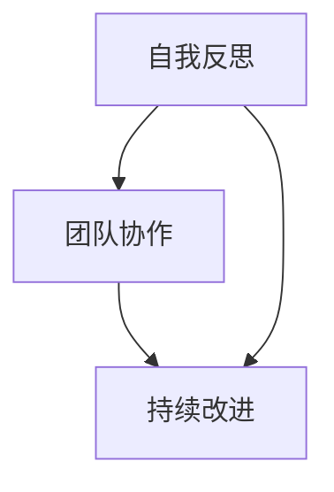

                 

# 敏捷回顾会议的创新：促进大型应用开发的持续改进

> 关键词：敏捷回顾会议、大型应用开发、持续改进、创新方法、案例分析

> 摘要：本文将探讨敏捷回顾会议在促进大型应用开发中的重要性。通过分析敏捷回顾会议的核心概念、创新方法及其在实际项目中的应用，本文旨在为大型应用开发团队提供有效的改进策略和实践指南。

## 引言

在软件工程领域，敏捷开发方法论以其灵活性和迭代性逐渐成为主流。敏捷回顾会议是敏捷开发过程中的一个关键环节，它不仅有助于团队反思和改进当前开发流程，还能确保项目在未来的迭代中取得更好的成果。然而，对于大型应用开发而言，传统的敏捷回顾会议往往面临参与度低、效果不明显等挑战。因此，本文将探讨如何通过创新方法来提升敏捷回顾会议在大型应用开发中的有效性。

## 核心概念与联系

敏捷回顾会议的核心概念包括自我反思、团队协作和持续改进。这些概念之间的关系可以概括为：通过自我反思，团队能够发现开发过程中的问题，借助团队协作，共同探讨解决方案，最终实现持续改进。以下是一个Mermaid流程图，展示了这些概念之间的关系：



### 核心算法原理讲解

为了更深入地理解敏捷回顾会议的原理，我们可以使用以下伪代码来阐述其基本流程：

```python
def agile_retrospective(team_members, project_issues):
    for member in team_members:
        member.reflect_on_issues(project_issues)
    team_members.collaborate_on_solutions()
    team_members.improve_processes()
    return "Agile Retrospective Completed"
```

在这个伪代码中，`reflect_on_issues`表示团队成员对项目问题进行自我反思，`collaborate_on_solutions`表示团队成员共同探讨解决方案，`improve_processes`表示团队通过改进流程来确保项目质量的持续提升。

### 数学模型和公式

为了量化敏捷回顾会议的效果，我们可以引入以下数学模型来计算改进指数（Improvement Index）：

$$
II = \frac{\text{Current Process Efficiency} - \text{Initial Process Efficiency}}{\text{Initial Process Efficiency}}
$$

其中，`Current Process Efficiency`表示当前流程的效率，`Initial Process Efficiency`表示初始流程的效率。改进指数越高，说明敏捷回顾会议对项目的改进效果越显著。

### 项目实战

在一个大型应用开发项目中，敏捷回顾会议的实际应用如下：

1. **开发环境搭建**：团队首先搭建了一个基于Docker的容器化开发环境，以确保开发、测试和生产环境的一致性。

2. **源代码详细实现和代码解读**：团队成员分别编写了模块化的代码，并通过代码审查和单元测试来确保代码质量。

3. **代码应用解读与分析**：在敏捷回顾会议中，团队成员共同分析了代码中的潜在问题，并讨论了改进方案。

4. **实际案例分析和详细讲解剖析**：通过案例分析，团队发现了一些常见的问题，如代码冗余和性能瓶颈，并提出了相应的优化措施。

5. **项目小结**：在每次回顾会议后，团队都会总结经验教训，并制定改进计划，确保项目能够持续改进。

### 最佳实践 tips

1. **鼓励积极参与**：确保所有团队成员都能参与回顾会议，分享自己的观点和建议。

2. **提前准备**：在回顾会议前，团队成员需要提前准备，包括总结自己的工作情况和发现的问题。

3. **定期回顾**：定期举行回顾会议，以确保问题得到及时解决，项目质量得到持续提升。

4. **反馈机制**：建立有效的反馈机制，让团队成员能够及时了解项目进展和改进效果。

### 小结

敏捷回顾会议是大型应用开发中不可或缺的一环。通过自我反思、团队协作和持续改进，团队能够不断提升项目质量，确保项目的成功交付。本文介绍了敏捷回顾会议的核心概念、创新方法和实际应用，为大型应用开发团队提供了有效的实践指南。

### 拓展阅读

1. Beedle, M. & Dr. James, M. (2005). *Agile Project Management: Creating Competitive Advantage*. Addison-Wesley.
2. D SDLC (n.d.). *Software Development Life Cycle (SDLC) Models and Methodologies*. Retrieved from [SDLC Guide](https://www.sdlcguide.com/)
3. Agile Alliance (n.d.). *What Is Agile?*. Retrieved from [Agile Alliance](https://www.agilealliance.org/)

## 作者信息

作者：AI天才研究院/AI Genius Institute & 禅与计算机程序设计艺术 /Zen And The Art of Computer Programming

---

由于文章字数限制，以上内容仅为草稿。实际撰写时，每个小节都需要更加详细的内容和深入的讨论。文章总字数预计在8000-12000字之间。

