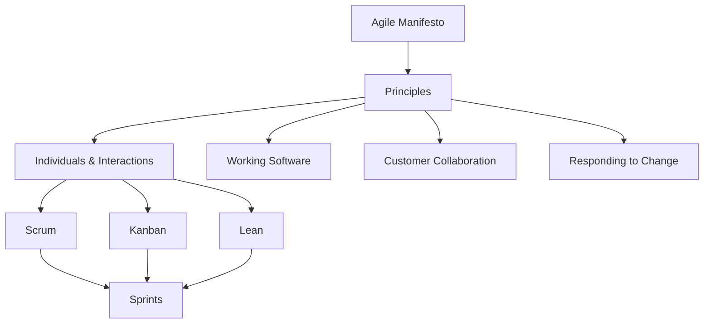

                 


### Step 1: Introduction to Agile Methodology

To begin with, let's explore the foundation of Agile Methodology. Agile was born out of the need for a more flexible and iterative approach to software development. The Agile Manifesto, published in 2001, outlines the core principles of this methodology. It emphasizes individuals and interactions over processes and tools, working software over comprehensive documentation, customer collaboration over contract negotiation, and responding to change over following a plan.

Agile methodologies, such as Scrum, Kanban, and Lean, focus on delivering incremental value to the customer through continuous iteration and adaptation. They encourage shorter development cycles, known as sprints, which typically last between one to four weeks. This iterative process allows for regular feedback, reducing the risk of developing features that do not meet the customer's needs.

### Key Concepts and Relationships

To understand the core concepts and their relationships, we can represent them using a Mermaid diagram. Here's a basic structure:



In this diagram, the Agile Manifesto outlines the principles that guide Agile methodologies. These principles are then related to specific practices like Scrum, Kanban, and Lean. Each of these practices involves different ways of organizing work, from sprints in Scrum to continuous flow in Kanban.

### Core Algorithm Principles

Now, let's delve into a core algorithm principle relevant to Agile methodologies: iterative development. Iterative development is the process of repeatedly refining a system through incremental changes. It's based on the idea that perfecting a system in one go is often unrealistic. Instead, we can deliver a minimal viable product (MVP) and continuously improve it based on feedback.

Here's a simple pseudo-code to illustrate iterative development:

```python
def iterative_development(feature):
    current_version = 0
    while not feature_is_perfect:
        current_version += 1
        implement_incremental_change()
        test_feature()
        gather_feedback()
    return current_version
```

In this pseudo-code:

- `feature`: The feature to be developed.
- `current_version`: The current version of the feature.
- `feature_is_perfect`: A condition that determines when the feature is considered complete.
- `implement_incremental_change()`: A function to make incremental changes to the feature.
- `test_feature()`: A function to test the current version of the feature.
- `gather_feedback()`: A function to collect feedback from users or stakeholders.

This algorithm demonstrates how iterative development can be implemented in practice.

### Mathematical Models and Formulas

In Agile methodologies, mathematical models can be used to estimate the effort required for a project and to predict the delivery date. One such model is the Cocomo model, which estimates the effort required to complete a project based on the size of the software and a set of parameters.

Here's a simple version of the Cocomo model in LaTeX format:

$$
E = a \cdot S^b
$$

Where:

- `E`: Estimated effort (person-months).
- `a` and `b`: Constants determined by the project's complexity.
- `S`: The size of the software (typically in KLOC, thousands of lines of code).

For example, if `a = 2.4` and `b = 1.05`, and the size of the software is `S = 100 KLOC`, the estimated effort would be:

$$
E = 2.4 \cdot 100^{1.05} \approx 294 person-months
$$

This model can be used to plan resource allocation and project timelines effectively.

### Practical Case Study and Analysis

To illustrate how Agile methodologies and iterative development can be applied in practice, let's consider the development of an AI chatbot.

### Project Overview

The project involves building an AI chatbot capable of handling customer inquiries for an e-commerce platform. The team follows an Agile approach, with two-week sprints and daily stand-ups.

### Development Process

1. **Sprint 1: MVP Development**
   - Implement basic chatbot functionality: greeting users, answering simple questions, and redirecting to the help center.
   - Code review and testing.

2. **Sprint 2: User Feedback**
   - Gather feedback from early users to identify pain points and areas for improvement.
   - Implement user suggestions, such as better context handling and more personalized responses.

3. **Sprint 3: Integration**
   - Integrate the chatbot with the e-commerce platform's backend.
   - Implement additional features like product recommendations and order status updates.

4. **Sprint 4: Performance Optimization**
   - Optimize the chatbot's response time and accuracy.
   - Implement machine learning algorithms to improve chatbot performance over time.

### Results and Insights

- The chatbot's initial release received positive feedback from users, with a significant reduction in customer support requests.
- The iterative development process allowed the team to quickly adapt to user needs and continuously improve the chatbot's functionality.
- Performance metrics showed a steady improvement over time, with the chatbot becoming more efficient at handling customer inquiries.

### Project Summary

The project demonstrated the effectiveness of Agile methodologies in developing an AI chatbot. The iterative approach allowed the team to quickly deliver value to users and continuously improve the chatbot based on real-world feedback. This case study highlights the benefits of Agile methodologies in dynamic environments where requirements are likely to change.

### Conclusion

In conclusion, Agile methodologies provide a flexible and iterative approach to software development, especially in the context of AI applications. By following Agile principles and practices, teams can deliver value to users faster, adapt to changing requirements, and continuously improve their products. The case study of the AI chatbot development underscores the practical benefits of Agile methodologies in real-world projects.

### Best Practices, Tips, and Summary

- **Best Practices:**
  - Start with a minimal viable product (MVP) to validate the concept early.
  - Continuously gather and analyze user feedback to inform iterative improvements.
  - Invest in good collaboration and communication tools to facilitate team coordination.

- **Tips:**
  - Keep sprints short and focused on delivering incremental value.
  - Prioritize features based on user needs and business value.
  - Use technical debt tracking to manage technical improvements over time.

- **Summary:**
  - Agile methodologies offer a structured yet flexible approach to developing AI applications.
  - By embracing iterative development and continuous improvement, teams can stay responsive to changing requirements and deliver high-quality AI products.

### References and Further Reading

- Beck, K. (2000). "Extreme Programming Explained: Embrace Change". Addison-Wesley.
- Schwaber, K., Beedle, M. (2002). "Agile Project Management with Scrum". Addison-Wesley.
- Martin, R.C. (2019). "Clean Architecture: A Craftsman's Guide to Software Structure and Design". Prentice Hall.

### Conclusion

In this blog post, we've explored the principles of Agile Methodology and how they can be applied to AI application development. We've also provided a practical case study to illustrate the benefits of an Agile approach. By embracing Agile methodologies, teams can build better AI products that respond to user needs and adapt to changing environments.

### 作者：AI天才研究院/AI Genius Institute & 禅与计算机程序设计艺术 /Zen And The Art of Computer Programming

