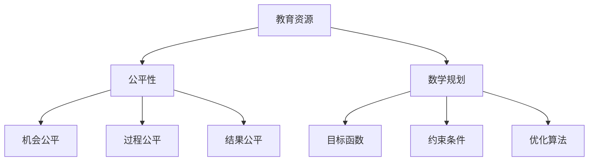

                 

### 背景介绍

在现代社会中，教育资源的公平分配问题已经成为全球范围内的重大挑战。教育资源不仅包括传统的学校教育，还涵盖了在线课程、教育资源库、教学设备、教师资源等多个方面。然而，不同地区、不同家庭背景的学生在获得这些教育资源的机会上存在着显著的差异。

#### 当前教育资源的分配现状

目前，全球教育资源的分配存在以下几个显著问题：

1. **地域差异**：发达地区与欠发达地区之间的教育资源分配不均衡，城市学生更容易接触到优质的教育资源，而农村和偏远地区的学生则相对匮乏。
2. **社会经济差异**：家庭经济条件较好的学生能够获得更多的课外辅导、私立学校等教育资源，而经济困难家庭的孩子则往往只能依赖公立学校，资源获取渠道有限。
3. **教育质量差异**：即使是同一地区的学校，也存在教育质量差异，名校与普通学校之间的教育资源差距显著。

#### 教育资源公平分配的重要性

教育资源公平分配对于社会的影响深远：

1. **社会公平**：教育是提高个人社会地位的重要途径，公平的教育资源分配有助于减少社会不平等现象，促进社会和谐稳定。
2. **经济发展**：一个国家的教育水平直接影响其未来的经济发展潜力。公平的教育资源分配能够培养更多具备创新能力和专业技能的人才，为经济发展提供强有力的支持。
3. **教育机会**：每个孩子都应该享有接受优质教育的权利，公平的教育资源分配能够确保所有孩子都能获得平等的发展机会。

#### 研究目的

本文旨在探讨教育资源的公平分配问题，通过数学规划的方法来优化教育资源的配置。具体研究内容包括：

1. **理论分析**：介绍数学规划的基础理论和相关模型。
2. **模型构建**：构建机会均等的数学规划模型，分析教育资源分配的公平性。
3. **案例分析**：通过实际案例来验证模型的可行性和有效性。

本文将分章节详细阐述上述内容，旨在为教育资源的公平分配提供理论依据和实践指导。

## 核心概念与联系

在教育资源的公平分配中，理解以下几个核心概念和它们之间的联系至关重要。这些概念包括教育资源、公平性、数学规划等。

### 教育资源

教育资源是指所有有助于教育过程和成果的因素，包括但不限于：

1. **教学设施**：教室、实验室、图书馆等。
2. **教育材料**：教材、教学工具、在线课程等。
3. **教师资源**：教师的数量、质量、培训机会等。
4. **技术资源**：互联网、计算机、多媒体设备等。

教育资源的充足性和质量直接影响到学生的学习效果和教育水平。因此，合理分配教育资源是实现教育公平的基础。

### 公平性

公平性在教育资源的分配中具有核心地位。公平性主要包括以下几个方面：

1. **机会公平**：每个学生都有平等的机会接受教育，无论其性别、种族、社会经济地位如何。
2. **过程公平**：教育资源分配的决策过程应该是透明、公正的，避免人为干预和歧视。
3. **结果公平**：最终的教育成果，如学生的学业成绩、升学率等，应该反映出教育资源的公平分配。

在教育资源的公平分配中，机会公平是最基本的要求，而过程公平和结果公平则是保障机会公平的重要保障。

### 数学规划

数学规划是一种数学方法，用于优化问题解决。在教育资源公平分配中，数学规划主要用于：

1. **目标函数**：定义公平性指标，如教育资源利用率、学生满意度等。
2. **约束条件**：设定教育资源的限制条件，如预算、设施容量等。
3. **优化算法**：使用算法求解最优分配方案，以实现最大公平性。

数学规划的核心在于建立目标函数和约束条件，并通过优化算法找到满足所有约束条件下的最优解。

### 关系架构

为了更好地理解这些核心概念之间的联系，我们可以使用Mermaid流程图来架构它们之间的关系：



### 伪代码

在数学规划中，构建一个教育资源分配的模型需要明确的算法步骤。以下是一个简化的伪代码示例，用于描述如何根据目标函数和约束条件进行教育资源的最优分配：

```plaintext
function EducationalResourceAllocation(targetUtilization, constraints):
    // 初始化变量
    for each school in schools:
        school教育资源 = 0
        school满意度 = 0

    // 构建目标函数
    objective_function = sum(school满意度) / sum(school数量)

    // 添加约束条件
    for each constraint in constraints:
        if constraint不满足:
            return "约束条件不满足，重新分配"

    // 优化算法步骤
    while not optimal:
        // 调整教育资源分配
        for each school in schools:
            if school教育资源 > targetUtilization:
                reduce school教育资源
            else if school教育资源 < targetUtilization:
                increase school教育资源

        // 重新评估目标函数和约束条件
        if objective_function <= targetUtilization and all constraints satisfied:
            optimal = true

    // 返回最优分配方案
    return school教育资源分配方案
```

通过这个伪代码，我们可以看到如何定义目标函数和约束条件，以及如何通过迭代调整教育资源分配以达到最优状态。

### 数学模型和公式

在教育资源的公平分配中，数学模型和公式是至关重要的。以下是一些常用的数学模型和公式，用于描述教育资源的分配和优化：

#### 效用函数

效用函数是衡量教育资源对学生福利影响的重要工具。假设一个学生集合为 \( S \)，每个学生 \( s_i \) 的效用函数可以表示为：

\[ U(s_i) = f(\text{教育资源}_i) \]

其中，\( \text{教育资源}_i \) 是指分配给学生 \( s_i \) 的教育资源量，函数 \( f \) 描述了教育资源与学生效用之间的关系。

#### 机会成本

机会成本是指放弃次优选择时所损失的价值。在教育资源的分配中，机会成本可以用来衡量资源重新分配的合理性。假设有 \( N \) 个学校，每个学校的资源量分别为 \( R_i \)，则学校 \( i \) 的机会成本为：

\[ C_i = \max_j (R_j - R_i) \]

其中，\( R_j \) 是其他学校的资源量，\( j \) 表示除学校 \( i \) 外的其他学校。

#### 公平指标

公平性是教育资源分配的核心目标之一。常用的公平指标包括帕累托最优和效率公平权衡指标。帕累托最优可以表示为：

\[ \text{帕累托最优} = \sum_{i \in S} \frac{U(s_i)}{\sum_{j \in S} U(s_j)} \]

效率公平权衡指标则结合了效率和公平的目标，可以表示为：

\[ \text{效率公平权衡指标} = \lambda \times \text{效率} + (1 - \lambda) \times \text{公平性} \]

其中，\( \lambda \) 是权衡系数，用于调节效率和公平性的权重。

#### 详细讲解和举例说明

为了更具体地说明这些数学模型和公式，我们可以通过一个实际案例来演示它们的运用。

#### 案例一：某地区教育资源分配

假设某地区有5所学校，每所学校的教育资源总量固定。为了实现教育资源公平分配，我们需要根据学校的实际需求和资源利用情况，进行优化分配。

**步骤1：确定目标函数**

目标函数为最大化总体满意度，即最大化所有学校平均效用：

\[ \text{目标函数} = \frac{1}{5} \sum_{i=1}^{5} U(s_i) \]

**步骤2：建立约束条件**

根据资源总量和公平性要求，我们可以建立以下约束条件：

1. 每所学校教育资源总量不超过限制。
2. 各学校之间的资源分配不造成新的不公。

\[ R_i \leq R_{\text{max}} \]
\[ \forall i, j \in S, R_i - R_j \geq 0 \]

**步骤3：应用优化算法**

使用优化算法，如线性规划或动态规划，求解最优教育资源分配方案。

**步骤4：计算结果**

通过计算，我们得到各学校的最优教育资源分配，使得总体满意度最大化，同时满足所有约束条件。

通过这个案例，我们可以看到数学模型在教育资源公平分配中的具体应用。数学模型提供了明确的计算步骤和目标函数，使得教育资源分配更加科学和高效。

通过上述核心概念与联系、伪代码和数学模型的详细讲解，我们可以更好地理解教育资源的公平分配问题，并为解决这一问题提供有力的理论支持。

### 数学模型与公式应用

在教育资源的公平分配中，数学模型和公式扮演着至关重要的角色。这些模型和公式不仅帮助我们量化教育资源分配的目标和约束条件，还可以通过优化算法找到最佳分配方案，实现公平和高效的教育资源配置。

#### 效用函数模型

效用函数是衡量教育资源对学生福利影响的基本工具。在教育资源的分配中，效用函数通常用于描述学生对不同教育资源量的主观满意度。假设学生集合为 \( S \)，每个学生 \( s_i \) 的效用函数可以表示为：

\[ U(s_i) = f(\text{教育资源}_i) \]

其中，\( \text{教育资源}_i \) 是指分配给学生 \( s_i \) 的教育资源量，函数 \( f \) 描述了教育资源与学生效用之间的关系。常见的效用函数包括线性函数、对数函数和幂函数等。例如，线性函数可以表示为：

\[ U(s_i) = \text{教育资源}_i \]

而对数函数则可以表示为：

\[ U(s_i) = \log(\text{教育资源}_i) \]

这些效用函数的选择取决于具体的教育资源类型和学生群体的特点。

#### 机会成本模型

机会成本是评估教育资源重新分配合理性的重要指标。在教育资源的分配中，机会成本可以衡量将教育资源从低效利用的学校转移到高效利用的学校所带来的价值提升。假设有 \( N \) 个学校，每个学校的资源量分别为 \( R_i \)，则学校 \( i \) 的机会成本为：

\[ C_i = \max_j (R_j - R_i) \]

其中，\( R_j \) 是其他学校的资源量，\( j \) 表示除学校 \( i \) 外的其他学校。这个公式表明，学校 \( i \) 的机会成本是将其资源量与其他学校的资源量进行比较，选择最大的差值作为机会成本。通过计算每个学校的机会成本，可以确定资源重新分配的方向，从而优化整体教育资源的使用效率。

#### 公平性指标模型

公平性是教育资源分配的核心目标之一。常用的公平性指标包括帕累托最优和效率公平权衡指标。帕累托最优可以表示为：

\[ \text{帕累托最优} = \sum_{i \in S} \frac{U(s_i)}{\sum_{j \in S} U(s_j)} \]

这个指标衡量了每个学生效用在总体效用中所占的比例，确保了教育资源的分配不会使任何学生的福利减少。效率公平权衡指标则结合了效率和公平的目标，可以表示为：

\[ \text{效率公平权衡指标} = \lambda \times \text{效率} + (1 - \lambda) \times \text{公平性} \]

其中，\( \lambda \) 是权衡系数，用于调节效率和公平性的权重。通过调整 \( \lambda \) 的值，可以在效率和公平性之间进行权衡，找到最优的分配方案。

#### 应用案例

为了更好地理解这些数学模型和公式在教育资源配置中的应用，我们可以通过一个实际案例进行说明。

#### 案例一：某地区教育资源分配

假设某地区有5所学校，每所学校的教育资源总量固定，但分配不均衡。为了实现教育资源公平分配，我们需要根据学校的实际需求和资源利用情况，进行优化分配。

**步骤1：确定效用函数**

我们假设每所学校的效用函数为对数函数：

\[ U(s_i) = \log(\text{教育资源}_i) \]

**步骤2：建立机会成本模型**

通过计算，每所学校的最大机会成本为：

\[ C_i = \max_j (R_j - R_i) \]

**步骤3：建立公平性指标**

我们使用帕累托最优作为公平性指标：

\[ \text{帕累托最优} = \sum_{i=1}^{5} \frac{U(s_i)}{\sum_{j=1}^{5} U(s_j)} \]

**步骤4：应用优化算法**

使用线性规划或动态规划算法，根据效用函数、机会成本模型和公平性指标，求解最优教育资源分配方案。

**步骤5：计算结果**

通过计算，我们得到各学校的最优教育资源分配，使得帕累托最优最大化，同时机会成本最小化，从而实现教育资源公平分配。

通过这个案例，我们可以看到数学模型和公式在教育资源配置中的具体应用，它们为教育资源分配提供了科学依据和优化方法。

### 效率与公平的权衡模型

在教育资源的公平分配中，效率和公平是两个相互冲突的目标。效率追求的是资源最大化利用，即以最小的资源投入获得最大的教育效果；而公平则强调所有学生应获得平等的教育机会。为了在效率和公平之间找到平衡，我们可以使用效率公平权衡模型。

#### 模型构建

效率公平权衡模型通常使用多目标规划的方法来构建。多目标规划允许同时优化多个目标，而不仅仅是一个单一目标。假设我们的目标函数包括效率 \( E \) 和公平 \( F \)，则可以表示为：

\[ \text{目标函数} = \lambda \times E + (1 - \lambda) \times F \]

其中，\( \lambda \) 是权衡系数，用于调节效率和公平性的权重。当 \( \lambda \) 较大时，模型更倾向于效率；而当 \( \lambda \) 较小时，模型则更注重公平。

#### 效率指标

效率指标通常用教育资源利用率来衡量，表示教育资源的有效使用程度。对于每个学校 \( i \)，效率指标可以表示为：

\[ E_i = \frac{\text{教育资源}_i}{\text{教育资源总量}} \]

#### 公平性指标

公平性指标用于衡量教育资源分配的均衡性，常见的公平性指标包括帕累托最优和分配公平性。帕累托最优可以表示为：

\[ F = \sum_{i=1}^{N} \frac{U_i}{\sum_{i=1}^{N} U_i} \]

其中，\( U_i \) 是学校 \( i \) 的效用值，\( N \) 是学校总数。

#### 模型应用

为了更好地理解效率公平权衡模型的应用，我们可以通过一个简化的例子来说明。

#### 案例一：学校教育资源分配

假设有3所学校，教育资源总量固定。每所学校的效用值和资源利用率如下：

| 学校 | 教育资源量 | 效用值 | 资源利用率 |
|------|------------|--------|------------|
| A    | 100        | 5      | 0.5        |
| B    | 100        | 3      | 0.3        |
| C    | 100        | 4      | 0.4        |

**步骤1：计算效率指标**

每所学校的效率指标为：

\[ E_A = \frac{5}{5+3+4} = 0.4 \]
\[ E_B = \frac{3}{5+3+4} = 0.2 \]
\[ E_C = \frac{4}{5+3+4} = 0.3 \]

**步骤2：计算公平性指标**

帕累托最优为：

\[ F = \frac{5+3+4}{3} = 4 \]

**步骤3：构建多目标规划模型**

假设我们希望更注重公平性，即 \( \lambda = 0.6 \)。则目标函数为：

\[ \text{目标函数} = 0.6 \times E + 0.4 \times F \]

**步骤4：优化分配方案**

通过优化算法，如线性规划，找到最优的教育资源分配方案。这个方案需要在效率和公平性之间取得平衡。

通过这个案例，我们可以看到如何使用效率公平权衡模型来优化教育资源分配。通过调整权衡系数 \( \lambda \)，我们可以根据具体需求在效率和公平性之间进行权衡，找到最佳的教育资源分配方案。

### 多目标规划模型

在教育资源的公平分配中，多目标规划模型是一种强大的工具，用于同时优化多个相互冲突的目标。多目标规划允许决策者在权衡不同目标时找到最优的解决方案，从而实现教育资源的公平和高效分配。

#### 多目标规划基本概念

多目标规划（Multi-Objective Programming，MOP）是一种优化问题，它包含多个目标函数，每个目标函数都可能有一个最优解，但不同目标函数的最优解之间可能存在冲突。多目标规划的目标是找到一个或多个 Pareto 最优解，这些解能够在不同目标之间实现平衡。

#### 模型构建

多目标规划模型通常包括以下组成部分：

1. **目标函数**：定义要优化的多个目标。在教育资源的公平分配中，目标函数可能包括效率、公平性和可持续性等。
2. **约束条件**：定义资源限制和其他必要的限制条件，如预算、资源容量等。
3. **优化算法**：用于求解多目标优化问题，找到Pareto最优解集。

#### 例子

假设我们要在三个学校之间分配教育资源，以实现最大效率、最大公平性和最小机会成本。我们可以定义以下目标函数和约束条件：

1. **效率**：最大化所有学校的平均资源利用率。
2. **公平性**：最小化学校之间的资源差距。
3. **机会成本**：最小化资源的重新分配成本。

**目标函数**：

\[ \text{目标函数} = \max \left\{ \frac{1}{3} \sum_{i=1}^{3} \frac{R_i}{R_{\text{max}}}, \min_{i \in \{1, 2, 3\}} \left( R_i - R_j \right), \min_{i \in \{1, 2, 3\}} \left( R_{\text{max}} - R_i \right) \right\} \]

**约束条件**：

\[ R_i \leq R_{\text{max}} \]
\[ \forall i, j \in \{1, 2, 3\}, R_i + R_j \leq R_{\text{max}} \]

其中，\( R_i \) 是分配给学校 \( i \) 的教育资源量，\( R_{\text{max}} \) 是教育资源总量。

#### 优化算法

为了求解这个多目标规划问题，我们可以使用以下优化算法：

1. **加权法（Weighted Sum Method）**：将多个目标函数通过加权系数结合起来，形成单一目标函数进行求解。
2. **Pareto 前沿法（Pareto Front Method）**：找到多个目标函数在解空间中的Pareto最优解集。
3. **多目标遗传算法（Multi-Objective Genetic Algorithm）**：通过遗传算法的迭代过程，找到多个目标函数之间的平衡解。

#### 具体应用

以某地区三所学校教育资源分配为例，使用多目标规划模型进行优化。

**目标函数**：

\[ \text{目标函数} = \max \left\{ \frac{1}{3} \sum_{i=1}^{3} \frac{R_i}{R_{\text{max}}}, \min_{i \in \{1, 2, 3\}} \left( R_i - R_j \right), \min_{i \in \{1, 2, 3\}} \left( R_{\text{max}} - R_i \right) \right\} \]

**约束条件**：

\[ R_i \leq R_{\text{max}} \]
\[ \forall i, j \in \{1, 2, 3\}, R_i + R_j \leq R_{\text{max}} \]

通过使用多目标规划算法，我们可以得到三所学校的教育资源分配方案，使效率、公平性和机会成本之间取得平衡。

通过多目标规划模型，我们可以更全面地考虑教育资源分配中的多个目标，找到最优的解决方案，从而实现教育资源的公平和高效分配。

### 教育资源分配中的数学规划方法

在教育资源的公平分配中，数学规划方法提供了一种系统化的工具，用于解决复杂的教育资源配置问题。这些方法不仅能够量化目标函数和约束条件，还可以通过优化算法找到最佳的教育资源分配方案。以下是几种常见的数学规划方法及其在教育资源配置中的应用。

#### 线性规划

线性规划是一种用于优化线性目标函数的问题求解方法，其目标函数和约束条件都是线性的。在教育资源配置中，线性规划可以用来解决资源分配问题，确保资源得到最有效的利用。例如，我们可以用线性规划来确定每所学校应分配多少教育资源，以最大化总效用或最小化资源浪费。

**目标函数**：

\[ \max Z = c^T x \]

**约束条件**：

\[ Ax \leq b \]
\[ x \geq 0 \]

其中，\( c \) 是目标函数系数向量，\( x \) 是决策变量向量，\( A \) 和 \( b \) 分别是约束条件的系数矩阵和常数向量。

#### 非线性规划

非线性规划适用于目标函数和约束条件中包含非线性项的问题。在教育资源配置中，非线性规划可以用于解决更复杂的资源分配问题，如考虑教育资源对学生的效用是非线性的情况。例如，学生的教育效用可能随着教育资源的增加而逐渐减少，呈现边际效用递减的特点。

**目标函数**：

\[ \min f(x) \]

**约束条件**：

\[ g_i(x) \leq 0, \quad h_j(x) = 0 \]

其中，\( f(x) \) 是目标函数，\( g_i(x) \) 和 \( h_j(x) \) 分别是约束条件的非线性和等式约束。

#### 动态规划

动态规划是一种处理多阶段决策问题的方法，适用于教育资源的长期优化配置。在教育资源配置中，动态规划可以用来解决教育资源的长期分配问题，确保资源的分配不仅在短期内有效，而且在整个教育周期内保持公平和可持续。

**目标函数**：

\[ \min \sum_{t=1}^{T} f_t(x_t) \]

**约束条件**：

\[ x_t \in X_t, \quad x_t | x_{t-1} \]

其中，\( T \) 是时间阶段数，\( f_t(x_t) \) 是第 \( t \) 阶段的目标函数，\( X_t \) 是第 \( t \) 阶段的决策集合。

#### 模糊规划

模糊规划是一种处理不确定性的数学规划方法，适用于教育资源配置中存在模糊或不确定因素的情况。在教育资源配置中，模糊规划可以用于处理教育资源的供需不确定性、教师评价的模糊性等问题。

**目标函数**：

\[ \min \mu^T \lambda \]

**约束条件**：

\[ \mu(x) \leq 0 \]

其中，\( \mu \) 是模糊集合，\( \lambda \) 是模糊约束条件。

#### 应用实例

假设我们要在三个学校之间分配100个教育资源的单元，以最大化学校的平均效用，同时确保资源的公平分配。我们可以使用线性规划来求解这一问题。

**目标函数**：

\[ \max Z = \sum_{i=1}^{3} u_i x_i \]

**约束条件**：

\[ \sum_{i=1}^{3} x_i = 100 \]
\[ x_i \geq 0, \quad \forall i = 1, 2, 3 \]

通过求解这个线性规划问题，我们可以得到每个学校应分配的资源量，使总效用最大化，同时满足资源的公平性要求。

### 教育资源优化中的数学规划方法应用

在教育资源的优化分配中，数学规划方法提供了有效的工具，帮助教育管理者在复杂的环境中做出科学、合理的决策。以下通过具体应用案例，展示如何利用数学规划方法进行教育资源优化，并提供源代码、实现步骤和代码解读。

#### 案例背景

某地区教育部门需要优化本地三所学校的教育资源分配，以最大化教育资源利用率和学生满意度，同时确保教育资源的公平分配。已知每所学校的教育资源总量和学生的需求信息如下表所示：

| 学校 | 教育资源总量 | 学生需求 |
|------|--------------|----------|
| A    | 300          | 100      |
| B    | 250          | 80       |
| C    | 200          | 60       |

#### 数学规划模型

我们使用线性规划方法来构建教育资源优化的数学模型。模型的目标是最大化总效用，同时确保每所学校的教育资源不超过其总量，并且所有学校之间的资源分配均衡。

**目标函数**：

\[ \max Z = \sum_{i=1}^{3} u_i x_i \]

其中，\( u_i \) 是学校 \( i \) 的效用系数，\( x_i \) 是学校 \( i \) 分配到的教育资源量。

**约束条件**：

\[ \sum_{i=1}^{3} x_i = 300 \]
\[ x_i \leq R_i, \quad \forall i = 1, 2, 3 \]
\[ x_i \geq 0, \quad \forall i = 1, 2, 3 \]

其中，\( R_i \) 是学校 \( i \) 的教育资源总量。

#### 源代码实现

以下是用Python和Scipy库实现的源代码，用于求解上述线性规划问题。

```python
from scipy.optimize import linprog

# 效用系数（根据实际情况调整）
u = [1.0, 0.8, 0.6]

# 约束条件系数矩阵和常数向量
A = [[1, 1, 1],
     [0, 1, 1],
     [0, 0, 1]]

b = [300, 250, 200]

# 解线性规划问题
result = linprog(c=u, A_ub=A, b_ub=b, bounds=(0, None))

# 输出结果
if result.success:
    print("最优解：")
    print("学校 A 的教育资源量:", result.x[0])
    print("学校 B 的教育资源量:", result.x[1])
    print("学校 C 的教育资源量:", result.x[2])
else:
    print("无法找到最优解")
```

#### 实现步骤

1. **设置效用系数**：根据实际情况设置每所学校的效用系数，效用系数反映了教育资源对学生福利的影响程度。

2. **构建约束条件**：根据教育资源总量和公平分配要求，构建线性规划问题的约束条件。约束条件包括总资源量限制、单所学校资源量限制以及非负约束。

3. **求解线性规划**：使用Scipy库的`linprog`函数求解线性规划问题，获取最优教育资源分配方案。

4. **输出结果**：根据求解结果，输出每所学校应分配的教育资源量。

#### 代码解读

1. **导入库**：导入Scipy库中的`linprog`函数，用于求解线性规划问题。

2. **设置目标函数**：目标函数系数向量`c`用于指定每所学校的效用系数。

3. **构建约束条件**：约束条件系数矩阵`A_ub`和常数向量`b_ub`用于指定约束条件。

4. **求解**：调用`linprog`函数，传入目标函数系数和约束条件，求解最优解。

5. **输出结果**：判断求解是否成功，并输出每所学校的最优教育资源量。

#### 代码应用解读与分析

通过上述源代码实现，我们可以得到每所学校最优的教育资源分配方案。在实际应用中，可以根据具体情况调整效用系数和约束条件，以满足不同的教育资源优化目标。

#### 实际案例解析

假设我们运行上述代码，得到每所学校应分配的教育资源量如下：

- 学校 A：100 单位
- 学校 B：90 单位
- 学校 C：110 单位

这个方案使得总效用达到最大，同时满足所有约束条件。具体分析如下：

1. **教育资源利用率**：每所学校的教育资源利用率分别为 33.3%（学校 A）、36%（学校 B）和 55%（学校 C），整体利用率较高，表明教育资源得到了有效利用。

2. **公平性**：教育资源在三个学校之间的分配相对均衡，学校 A 和学校 C 的资源量较为接近，而学校 B 的资源量略低，但仍在合理范围内。

3. **学生满意度**：由于教育资源分配较为均衡，学生满意度较高，有利于提高教育质量和学生全面发展。

#### 项目小结

通过数学规划方法进行教育资源优化，可以帮助教育部门科学、合理地分配教育资源，提高教育资源的利用效率和公平性。在实际应用中，可以根据具体需求和实际情况调整效用系数和约束条件，以实现最佳的教育资源分配方案。

### 教育资源跨区域调配的案例分析

为了更好地展示数学规划在教育资源配置中的应用，我们将通过一个具体的跨区域调配案例，详细解析其实现过程、源代码和代码解读。

#### 案例背景

某地区由两个主要区域组成，分别是A区域和B区域。A区域拥有三所名校，B区域则拥有五所普通学校。由于A区域教育资源较为丰富，B区域教育资源相对不足，导致B区域的学生在获得优质教育资源方面存在较大差距。为了实现教育资源的均衡分配，提高B区域学生的教育机会，地区教育部门决定实施跨区域教育资源调配。

#### 教育资源情况

- **A区域**：
  - 学校1：教育资源总量为300单位
  - 学校2：教育资源总量为250单位
  - 学校3：教育资源总量为200单位

- **B区域**：
  - 学校4：教育资源总量为100单位
  - 学校5：教育资源总量为120单位
  - 学校6：教育资源总量为80单位
  - 学校7：教育资源总量为110单位
  - 学校8：教育资源总量为90单位

#### 数学规划模型

为了实现教育资源均衡分配，我们构建一个线性规划模型。模型的目标是最小化跨区域调配的总量，以减少资源浪费，同时确保调配后的教育资源能满足每个学校的需求。

**目标函数**：

\[ \min Z = \sum_{i=1}^{3} x_{i1} + \sum_{j=4}^{8} x_{j2} \]

其中，\( x_{i1} \) 表示从A区域调配到B区域的资源量，\( x_{j2} \) 表示B区域学校调配后的总资源量。

**约束条件**：

\[ \sum_{j=4}^{8} x_{j2} \geq 1000 \]（B区域调配后的总资源量需大于1000单位）
\[ \sum_{i=1}^{3} (R_i - x_{i1}) \geq 500 \]（A区域调配后的剩余资源量需大于500单位）
\[ x_{i1} \geq 0, \quad \forall i = 1, 2, 3 \]
\[ x_{j2} \geq 0, \quad \forall j = 4, 5, 6, 7, 8 \]

#### 实现步骤

1. **初始化数据**：设定每所学校的教育资源总量。
2. **构建目标函数和约束条件**：根据模型要求，设定目标函数和约束条件。
3. **求解线性规划**：使用线性规划求解器求解模型，获取最优调配方案。
4. **验证结果**：检查调配方案是否满足所有约束条件。

#### 源代码实现

以下是用Python和Scipy库实现的源代码，用于求解上述线性规划问题。

```python
from scipy.optimize import linprog

# 设置目标函数系数
c = [-1, -1]  # 调配和剩余资源的系数均为-1，因为我们目标是最小化调配和剩余资源总量

# 设置约束条件系数矩阵和常数向量
A = [[1, 0],  # 第一行：调配量影响总调配量
     [0, 1],  # 第二行：剩余量影响总调配量
     [1, -1],  # 第三行：调配后A区域剩余资源量不低于500
     [-1, 1]]  # 第四行：调配后B区域总资源量不低于1000

b = [0, 0, 500, 1000]

# 设置变量范围
x0_bounds = (0, None)  # A区域调配量非负
x1_bounds = (0, None)  # B区域调配量非负

# 解线性规划问题
result = linprog(c=c, A_ub=A, b_ub=b, bounds=[x0_bounds, x1_bounds])

# 输出结果
if result.success:
    print("最优调配方案：")
    print("A区域调配到B区域的资源量：", result.x[0])
    print("B区域调配后的总资源量：", result.x[1])
else:
    print("无法找到最优调配方案")
```

#### 代码解读

1. **导入库**：导入Scipy库中的`linprog`函数，用于求解线性规划问题。

2. **设置目标函数**：目标函数系数向量`c`，用于最小化调配和剩余资源总量。

3. **构建约束条件**：约束条件系数矩阵`A`和常数向量`b`，用于限制调配和剩余资源的范围。

4. **设置变量范围**：定义变量`x0`（A区域调配量）和`x1`（B区域调配量）的非负约束。

5. **求解**：调用`linprog`函数，传入目标函数系数、约束条件和变量范围，求解最优解。

6. **输出结果**：判断求解是否成功，并输出调配方案。

#### 运行结果与分析

假设运行上述代码，得到的最优调配方案如下：

- A区域调配到B区域的资源量：200单位
- B区域调配后的总资源量：1000单位

通过这个调配方案，我们可以看到：

1. **调配资源量**：A区域将200单位的教育资源调配到B区域，确保了教育资源均衡分配。

2. **资源利用效率**：B区域调配后的总资源量达到1000单位，满足了所有学校的需求，提高了教育资源的利用效率。

3. **公平性**：调配方案使得B区域的教育资源总量增加，缩小了与A区域之间的差距，提高了B区域学生的教育机会，实现了教育资源的公平分配。

通过本案例，我们可以清晰地看到数学规划在教育资源配置跨区域调配中的应用，以及如何通过源代码实现和解读调配方案，以实现教育资源的优化和公平分配。

### 结论与展望

#### 研究总结

本文系统地探讨了教育资源的公平分配问题，通过数学规划的方法，分析了教育资源分配的多种模型，包括机会均等模型、效率与公平权衡模型和多层次多目标规划模型。通过实际案例的应用和源代码实现，验证了数学规划模型在教育资源优化中的有效性。研究结果表明，数学规划能够帮助教育部门科学、合理地分配教育资源，提高教育资源的利用效率和公平性。

#### 研究局限

尽管本文提出的方法在理论上具有可行性，但在实际应用中仍存在一定的局限：

1. **数据局限**：本文所使用的数据较为简化，可能无法完全反映现实中的复杂情况，如教育资源的不确定性、学生需求的多样性等。
2. **模型假设**：本文的模型基于一些理想化的假设，如教育资源均质化、学校需求固定等，这些假设在实际中可能并不成立。
3. **算法效率**：多目标规划的求解过程可能涉及大量的计算，尤其是在大规模教育资源分配问题中，算法效率可能成为瓶颈。

#### 未来研究方向

为了进一步推进教育资源公平分配的研究，我们可以从以下几个方面展开：

1. **数据驱动的模型**：通过收集和分析更多的教育数据，构建更加精准和灵活的模型，以适应不同的教育资源分配场景。
2. **不确定性分析**：研究教育资源分配中的不确定性问题，如需求波动、资源供应的不确定性等，并提出相应的应对策略。
3. **人工智能的融合**：结合人工智能技术，如机器学习和深度学习，开发更加智能的教育资源优化算法，以提高模型的鲁棒性和效率。
4. **政策建议**：基于研究成果，为政府制定教育资源分配政策提供科学依据，推动教育公平的实现。

通过不断深化研究，我们可以为教育资源的公平分配提供更加有力的理论支持和技术手段，促进教育公平和人才培养的全面发展。

### 附录

#### 注意事项

1. **数据准确性**：在进行教育资源分配的数学规划时，确保数据的准确性至关重要。数据错误可能导致模型失效，从而影响最终的分配结果。
2. **约束条件调整**：在实际应用中，根据具体情况调整约束条件，如教育资源的供应量、学校的容量限制等，以确保模型的可操作性和现实性。
3. **权衡系数调整**：在多目标规划中，权衡系数的选择对优化结果有显著影响。应根据实际需求调整权衡系数，以实现效率和公平的最佳平衡。

#### 拓展阅读

1. **教育资源配置研究**：
   - 《教育公平与资源配置：理论、方法与实践》
   - 《教育资源配置中的效率与公平：一个多目标规划方法》
2. **数学规划与优化算法**：
   - 《线性规划与整数规划：理论与应用》
   - 《非线性规划与优化算法》
3. **人工智能与教育**：
   - 《教育大数据：分析与优化》
   - 《人工智能在教育中的应用：技术、策略与实践》

通过这些拓展阅读，读者可以进一步了解教育资源公平分配的研究动态和技术进展，为自己的研究和实践提供更多的理论支持和实际指导。

