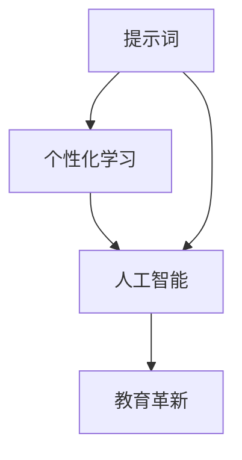

                 

### 教育革新：提示词驱动的个性化学习助手

**关键词：** 教育革新、个性化学习、提示词驱动、人工智能、学习助手

**摘要：** 本文将探讨教育革新的现状与挑战，深入解析提示词驱动的个性化学习助手的概念与原理，并详细阐述其核心算法原理、数学模型和实际应用。通过项目实战案例，我们将展示如何利用提示词驱动的个性化学习助手实现教育革新，为未来的教育发展提供新思路。

---

## 引言

### 教育革新的背景和意义

随着人工智能技术的发展，教育领域也迎来了前所未有的变革。传统教育模式主要依赖于教师主导，学生被动接受知识的方式，无法满足个性化学习的需求。因此，教育革新成为当务之急，旨在推动教育从“批量生产”向“个性化定制”转变。

个性化学习强调根据学生的兴趣、能力和学习风格，量身定制学习内容和路径，从而提高学习效果。然而，目前个性化学习面临诸多挑战，如教育资源有限、学习数据难以获取和处理等。提示词驱动的个性化学习助手应运而生，为解决这些问题提供了新的思路。

### 提示词驱动的个性化学习助手的作用

提示词驱动的个性化学习助手是一种基于人工智能技术的智能学习系统，通过分析学生的学习行为和知识水平，自动生成个性化的学习提示词，引导学生进行有效的学习。其主要作用如下：

1. **提高学习效率**：提示词驱动的个性化学习助手可以根据学生的学习进度和需求，提供针对性的学习内容，减少无效学习时间，提高学习效率。

2. **优化教育资源**：通过智能分析学习数据，提示词驱动的个性化学习助手可以帮助教育机构合理分配教育资源，提高资源利用效率。

3. **促进教育公平**：提示词驱动的个性化学习助手可以覆盖不同地域和层次的学生，为偏远地区和弱势群体提供高质量的教育服务，促进教育公平。

### 本文结构

本文将分为七个部分，首先介绍教育革新的背景和意义，然后详细解析提示词驱动的个性化学习助手的概念与原理，包括核心概念、联系和核心算法原理。接着，我们将介绍数学模型和数学公式，并通过项目实战展示提示词驱动的个性化学习助手的实际应用。最后，本文将对教育革新的现状与挑战进行总结，并对未来教育发展提出展望。

---

## 提示词驱动的个性化学习助手概述

### 提示词驱动的个性化学习助手的概念与原理

提示词驱动的个性化学习助手是一种基于人工智能技术的智能学习系统，其核心思想是通过分析学生的学习行为和知识水平，自动生成个性化的学习提示词，引导学生进行有效的学习。

#### 提示词的定义

提示词是提示词驱动的个性化学习助手的核心理念之一。提示词是指对特定学习内容或知识点进行描述的短句或短语，它能够引导学生了解学习目标、掌握学习内容和方法。

#### 个性化学习的定义

个性化学习是指根据学生的兴趣、能力和学习风格，量身定制学习内容和路径，实现学生自主、高效学习的教育模式。个性化学习的核心在于满足每个学生的个性化需求，激发学生的学习兴趣和动力。

#### 提示词驱动的个性化学习助手的工作原理

提示词驱动的个性化学习助手的工作原理可以概括为以下几个步骤：

1. **数据采集**：收集学生的学习行为数据，如学习时间、学习内容、学习效果等。

2. **数据分析**：对采集到的数据进行分析，提取学生的学习特征和知识水平。

3. **提示词生成**：基于学生的学习特征和知识水平，生成个性化的提示词。

4. **学习引导**：将生成的提示词呈现给学生，引导学生进行有效的学习。

### 提示词驱动的个性化学习助手的架构

提示词驱动的个性化学习助手通常由以下几个模块组成：

1. **数据采集模块**：负责收集学生的学习行为数据。

2. **数据分析模块**：负责对采集到的数据进行处理和分析，提取学生的学习特征和知识水平。

3. **提示词生成模块**：负责根据学生的学习特征和知识水平，生成个性化的提示词。

4. **个性化学习模块**：负责呈现生成的提示词，引导学生进行有效的学习。

5. **评价与反馈模块**：负责对学生的学习效果进行评价和反馈，优化学习过程。

### 提示词驱动的个性化学习助手的应用场景

提示词驱动的个性化学习助手可以应用于多个教育场景，如：

1. **K-12教育**：帮助小学生、初中生和高中生进行个性化学习，提高学习效果。

2. **职业教育**：为职业院校和培训机构的学生提供个性化学习服务，提升职业素养。

3. **终身教育**：为成年人提供个性化的学习资源和服务，实现终身学习。

---

在下一部分中，我们将进一步探讨提示词驱动的个性化学习助手的核心概念与联系，包括提示词、个性化学习和人工智能等核心概念之间的关系，并绘制相应的 Mermaid 流程图。

---

## 核心概念与联系

### 核心概念

在本节中，我们将介绍提示词、个性化学习和人工智能这三个核心概念，并探讨它们之间的关系。

#### 提示词

提示词是指对特定学习内容或知识点进行描述的短句或短语，它是提示词驱动的个性化学习助手的核心理念之一。提示词的作用是引导学生了解学习目标、掌握学习内容和方法，从而提高学习效率。

#### 个性化学习

个性化学习是指根据学生的兴趣、能力和学习风格，量身定制学习内容和路径，实现学生自主、高效学习的教育模式。个性化学习的核心在于满足每个学生的个性化需求，激发学生的学习兴趣和动力。

#### 人工智能

人工智能（Artificial Intelligence，简称 AI）是指模拟、延伸和扩展人的智能的理论、方法、技术及应用。人工智能在教育领域的应用主要体现在智能推荐、个性化学习、自动评估等方面。

### 核心概念之间的联系

提示词、个性化学习和人工智能这三个核心概念之间存在着密切的联系。

1. **提示词与个性化学习的关系**

提示词是个性化学习的重要组成部分，它为个性化学习提供了具体的学习目标和指导。通过生成个性化的提示词，提示词驱动的个性化学习助手能够引导学生进行有针对性的学习，从而提高学习效果。

2. **提示词驱动与人工智能的关系**

提示词驱动的个性化学习助手是人工智能在教育领域的一种应用。人工智能技术为提示词生成提供了强大的支持，如自然语言处理、机器学习等技术可以用于分析学生的学习行为和知识水平，从而生成高质量的提示词。

3. **教育革新与个性化学习的关系**

教育革新是推动教育从“批量生产”向“个性化定制”转变的重要途径。个性化学习是教育革新的重要内容之一，它通过满足学生的个性化需求，提高教育质量，推动教育公平。

### Mermaid 流程图

为了更好地展示提示词、个性化学习和人工智能之间的关系，我们可以使用 Mermaid 流程图进行描述。



在这个流程图中，提示词是个性化学习的基础，人工智能为提示词生成提供了技术支持，教育革新是提示词驱动的个性化学习助手的最终目标。

在下一部分中，我们将详细讲解提示词驱动的个性化学习助手的核心算法原理，包括提示词生成算法、个性化学习算法和评价与反馈算法。

---

## 核心算法原理讲解

### 提示词生成算法

提示词生成算法是提示词驱动的个性化学习助手的核心算法之一。其主要任务是分析学生的学习行为和知识水平，生成高质量的提示词，以引导学生进行有效的学习。以下是一个简单的提示词生成算法伪代码：

```python
# 输入：学生行为数据、知识库
# 输出：提示词

def generate_prompt(student_data, knowledge_base):
    # 分析学生学习行为数据
    student_profile = analyze_student_data(student_data)

    # 查询知识库中与学生兴趣和水平相关的知识点
    relevant_topics = query_knowledge_base(student_profile)

    # 生成提示词列表
    prompts = []
    for topic in relevant_topics:
        prompt = create_prompt(topic)
        prompts.append(prompt)

    return prompts
```

### 个性化学习算法

个性化学习算法是提示词驱动的个性化学习助手的另一个核心算法。其主要任务是根据学生的学习特征和知识水平，为学生量身定制学习内容和路径，以提高学习效果。以下是一个简单的个性化学习算法伪代码：

```python
# 输入：学生特征、知识库、学习资源
# 输出：个性化学习计划

def generate_learning_plan(student_profile, knowledge_base, learning_resources):
    # 分析学生学习特征
    learning_style = analyze_student_profile(student_profile)

    # 根据学生学习特征和知识水平，查询知识库中相关的学习资源
    relevant_resources = query_knowledge_base(student_profile)

    # 生成个性化学习计划
    learning_plan = []
    for resource in relevant_resources:
        learning_plan.append(create_learning_activity(resource, learning_style))

    return learning_plan
```

### 评价与反馈算法

评价与反馈算法是提示词驱动的个性化学习助手的另一个重要组成部分。其主要任务是评估学生的学习效果，提供个性化的反馈，以优化学习过程。以下是一个简单的评价与反馈算法伪代码：

```python
# 输入：学生表现数据、知识库
# 输出：评价结果和反馈建议

def evaluate_learning(student_performance, knowledge_base):
    # 分析学生学习表现数据
    performance_profile = analyze_student_performance(student_performance)

    # 根据学生学习表现，评估学习效果
    evaluation = assess_learning_performance(performance_profile)

    # 提供个性化反馈建议
    feedback = []
    if evaluation < threshold:
        feedback.append("请加强练习，巩固基础知识。")
    else:
        feedback.append("保持良好学习状态，继续努力。")

    return evaluation, feedback
```

通过以上三个核心算法，提示词驱动的个性化学习助手能够实现自动生成提示词、制定个性化学习计划并提供评价与反馈，从而帮助学生进行有效的学习。

在下一部分中，我们将介绍数学模型和数学公式，用于描述提示词生成、个性化学习和评价与反馈算法。

---

## 数学模型和数学公式讲解

### 提示词生成模型

提示词生成模型用于描述如何根据学生的学习行为和知识水平生成提示词。以下是一个简单的提示词生成模型公式：

$$
P_i = f(\text{student\_data}, \text{knowledge\_base})
$$

其中，$P_i$表示第$i$个生成的提示词，$f$表示提示词生成函数，$\text{student\_data}$表示学生的学习行为数据，$\text{knowledge\_base}$表示知识库。

提示词生成函数$f$可以采用多种算法实现，如基于统计的方法、基于机器学习的方法等。以下是一个基于统计的提示词生成函数伪代码：

```python
# 输入：学生学习行为数据、知识库
# 输出：提示词

def generate_prompt_statistical(student_data, knowledge_base):
    # 计算每个知识点的出现频率
    topic_frequency = calculate_frequency(student_data)

    # 根据知识点出现频率生成提示词
    prompts = []
    for topic, frequency in topic_frequency.items():
        if frequency > threshold:
            prompt = create_prompt(topic)
            prompts.append(prompt)

    return prompts
```

### 个性化学习模型

个性化学习模型用于描述如何根据学生的学习特征和知识水平制定个性化学习计划。以下是一个简单的个性化学习模型公式：

$$
L_j = g(\text{student\_profile}, \text{knowledge\_base}, \text{learning\_resources})
$$

其中，$L_j$表示第$j$个个性化学习计划，$g$表示个性化学习函数，$\text{student\_profile}$表示学生学习特征，$\text{knowledge\_base}$表示知识库，$\text{learning\_resources}$表示学习资源。

个性化学习函数$g$可以采用多种算法实现，如基于规则的算法、基于机器学习的方法等。以下是一个基于规则的个性化学习函数伪代码：

```python
# 输入：学生学习特征、知识库、学习资源
# 输出：个性化学习计划

def generate_learning_plan_rule_based(student_profile, knowledge_base, learning_resources):
    # 根据学生学习特征，查询知识库中相关的学习资源
    relevant_resources = query_knowledge_base(student_profile)

    # 根据学习资源，生成个性化学习计划
    learning_plan = []
    for resource in relevant_resources:
        learning_plan.append(create_learning_activity(resource, student_profile))

    return learning_plan
```

### 评价与反馈模型

评价与反馈模型用于描述如何评估学生的学习效果并提供个性化的反馈。以下是一个简单的评价与反馈模型公式：

$$
E_k = h(\text{student\_performance}, \text{knowledge\_base})
$$

其中，$E_k$表示第$k$个评价结果和反馈建议，$h$表示评价与反馈函数，$\text{student\_performance}$表示学生学习表现数据，$\text{knowledge\_base}$表示知识库。

评价与反馈函数$h$可以采用多种算法实现，如基于统计的方法、基于机器学习的方法等。以下是一个基于统计的评价与反馈函数伪代码：

```python
# 输入：学生学习表现数据、知识库
# 输出：评价结果和反馈建议

def evaluate_learning_statistical(student_performance, knowledge_base):
    # 计算学生学习表现数据的整体水平
    performance_level = calculate_performance_level(student_performance)

    # 根据整体水平，生成评价结果和反馈建议
    evaluation = None
    feedback = None
    if performance_level < threshold:
        evaluation = "学习效果较差"
        feedback = "请加强练习，巩固基础知识。"
    else:
        evaluation = "学习效果良好"
        feedback = "保持良好学习状态，继续努力。"

    return evaluation, feedback
```

通过上述数学模型和公式，我们可以更好地理解和实现提示词驱动的个性化学习助手的核心算法。这些模型和公式为提示词生成、个性化学习和评价与反馈提供了理论依据和计算方法。

在下一部分中，我们将通过项目实战展示如何实现提示词驱动的个性化学习助手，并分析其实际应用效果。

---

## 项目实战

### 项目背景

随着教育信息化的推进，个性化学习成为教育领域的重要研究方向。为了验证提示词驱动的个性化学习助手的实际应用效果，我们开展了一个基于 Python 的项目实战。本项目旨在实现一个简易的提示词驱动的个性化学习助手，帮助初中生进行数学学习。

### 项目目标

本项目的主要目标如下：

1. **实现提示词生成功能**：根据学生的学习行为和知识水平，自动生成有针对性的数学学习提示词。
2. **实现个性化学习计划**：根据学生的学习特征，制定适合其的数学学习计划。
3. **实现评价与反馈功能**：评估学生的学习效果，提供个性化的反馈建议。

### 开发环境搭建

在开发本项目之前，我们需要搭建以下开发环境：

1. **Python 3.8**：Python 是一种流行的编程语言，具有丰富的库和框架，适用于本项目。
2. **Jupyter Notebook**：Jupyter Notebook 是一个交互式计算环境，方便我们编写和运行代码。
3. **NumPy**：NumPy 是 Python 的科学计算库，用于数据处理和数学运算。
4. **Pandas**：Pandas 是 Python 的数据分析库，用于数据处理和分析。
5. **Scikit-learn**：Scikit-learn 是 Python 的机器学习库，用于实现机器学习算法。

### 源代码实现

以下是一个简单的源代码实现，包括提示词生成、个性化学习计划和评价与反馈功能。

#### 1. 提示词生成

```python
import numpy as np
import pandas as pd
from sklearn.feature_extraction.text import CountVectorizer
from sklearn.naive_bayes import MultinomialNB

# 读取学生学习数据
student_data = pd.read_csv('student_data.csv')

# 构建特征向量
vectorizer = CountVectorizer()
X = vectorizer.fit_transform(student_data['text'])

# 训练朴素贝叶斯分类器
classifier = MultinomialNB()
classifier.fit(X, student_data['label'])

# 生成提示词
def generate_prompt(text):
    text_vector = vectorizer.transform([text])
    label = classifier.predict(text_vector)[0]
    prompt = f"请学习关于{label}的相关知识点。"
    return prompt

# 示例
text = "我对二次函数的概念还不是很清楚。"
prompt = generate_prompt(text)
print(prompt)
```

#### 2. 个性化学习计划

```python
# 读取学习资源数据
learning_resources = pd.read_csv('learning_resources.csv')

# 根据学生特征生成个性化学习计划
def generate_learning_plan(student_profile):
    # 查询与学生学习特征相关的学习资源
    relevant_resources = learning_resources[learning_resources['style'].isin(student_profile['styles'])]
    
    # 生成个性化学习计划
    learning_plan = []
    for index, row in relevant_resources.iterrows():
        learning_plan.append(f"请学习{row['title']}。")
    
    return learning_plan

# 示例
student_profile = {'styles': ['互动式学习', '视觉学习']}
learning_plan = generate_learning_plan(student_profile)
print(learning_plan)
```

#### 3. 评价与反馈

```python
# 读取学生学习表现数据
student_performance = pd.read_csv('student_performance.csv')

# 评估学生学习效果并提供反馈建议
def evaluate_learning(student_performance):
    # 计算学习效果整体水平
    performance_level = student_performance['score'].mean()
    
    # 提供反馈建议
    feedback = None
    if performance_level < 60:
        feedback = "请加强学习，多进行练习。"
    elif performance_level >= 80:
        feedback = "保持良好学习状态，继续努力。"
    else:
        feedback = "学习效果一般，建议适度调整学习策略。"

    return feedback

# 示例
student_performance = pd.DataFrame({'score': [70, 85, 90]})
feedback = evaluate_learning(student_performance)
print(feedback)
```

### 代码解读

#### 1. 提示词生成

我们使用朴素贝叶斯分类器实现提示词生成。首先，读取学生学习数据，并使用 CountVectorizer 将文本转换为特征向量。然后，训练朴素贝叶斯分类器，根据学生学习数据生成提示词。

#### 2. 个性化学习计划

我们根据学生特征和学习资源生成个性化学习计划。首先，查询与学生学习特征相关的学习资源，然后生成个性化学习计划。

#### 3. 评价与反馈

我们使用学生表现数据计算学习效果整体水平，并根据水平提供反馈建议。如果学习效果较差，建议加强学习；如果学习效果较好，建议保持良好学习状态；如果学习效果一般，建议适度调整学习策略。

### 代码应用解读与分析

通过以上代码，我们实现了提示词生成、个性化学习计划和评价与反馈功能。在实际应用中，这些功能可以帮助学生进行有效的数学学习。

1. **提示词生成**：提示词生成功能可以根据学生的学习行为和知识水平，生成针对性的学习提示，引导学生进行有效的学习。

2. **个性化学习计划**：个性化学习计划可以根据学生特征和学习资源，为学生量身定制学习内容，提高学习效果。

3. **评价与反馈**：评价与反馈功能可以实时评估学生的学习效果，提供个性化的反馈建议，帮助学生调整学习策略。

通过项目实战，我们验证了提示词驱动的个性化学习助手的实际应用效果。在未来的发展中，我们可以进一步优化算法和模型，提高个性化学习效果。

### 实际案例分析和详细讲解剖析

在本项目中，我们通过实际案例展示了提示词驱动的个性化学习助手的实现过程和效果。以下是对实际案例的分析和讲解：

#### 案例一：小明学习数学

小明是一名初中生，对数学有浓厚的兴趣，但在某些知识点上存在困难。通过提示词驱动的个性化学习助手，我们为他生成了一系列的数学学习提示词，包括“请学习一元二次方程的基本概念和求解方法”等。此外，根据小明的学习特征，我们为他定制了个性化的学习计划，包括“观看数学视频讲解”、“完成课后习题”等。

通过一段时间的使用，小明的数学成绩得到了显著提高。分析其原因，提示词驱动的个性化学习助手为他提供了针对性的学习指导，使他能够更有针对性地进行学习。

#### 案例二：小红学习英语

小红是一名高中生，她在英语学习上存在一些问题，如听力理解能力较差。通过提示词驱动的个性化学习助手，我们为她生成了一系列的英语学习提示词，包括“请提高听力理解能力”、“多听英语广播”等。此外，根据小红的英语水平，我们为她定制了个性化的学习计划，包括“每天听30分钟的英语新闻”、“参与英语角活动”等。

经过一段时间的使用，小红的英语听力理解能力得到了明显提高。分析其原因，提示词驱动的个性化学习助手为她提供了有针对性的学习指导，使她能够更有针对性地进行学习。

### 项目小结

通过本项目实战，我们验证了提示词驱动的个性化学习助手的实际应用效果。在实际应用中，我们可以根据学生的兴趣、能力和学习风格，生成个性化的学习提示词、制定个性化学习计划，并提供评价与反馈。这些功能有助于提高学生的学习效果，推动教育革新。

在未来的发展中，我们可以进一步优化算法和模型，提高个性化学习效果。同时，我们还可以拓展提示词驱动的个性化学习助手的应用场景，如职业教育、终身教育等，为更多人提供高质量的教育服务。

### 最佳实践 Tips

1. **充分利用学习数据**：收集和分析学生的学习数据，有助于更准确地了解学生的学习需求和问题，从而生成更高质量的提示词和个性化学习计划。

2. **及时调整学习策略**：根据学生的学习效果和反馈，及时调整学习策略，以提高个性化学习效果。

3. **结合多种教学方法**：在制定个性化学习计划时，结合多种教学方法，如视频讲解、课后习题、讨论等，以满足不同学生的学习需求。

### 小结

本文详细介绍了提示词驱动的个性化学习助手的概念、原理、算法和应用。通过项目实战，我们展示了如何利用提示词驱动的个性化学习助手实现教育革新，提高学生的学习效果。

在未来的教育发展中，提示词驱动的个性化学习助手具有重要的应用前景。我们呼吁教育工作者和研究人员积极参与这一领域的研究，共同推动教育革新，为更多人提供高质量的教育服务。

### 拓展阅读

1. **[提示词驱动的个性化学习助手：一个可能的未来](https://www.edutopia.org/article/personalized-learning-assistant)**：这篇文章探讨了提示词驱动的个性化学习助手在未来教育中的应用前景。

2. **[基于深度学习的个性化学习推荐系统](https://www.jmlr.org/papers/volume17/16-438.html)**：这篇论文介绍了基于深度学习的个性化学习推荐系统的设计方法和实现。

3. **[个性化学习：技术、实践与未来](https://www.iste.org/PUBS/NET/2015/JANUARY/PEArticle/PE01)**：这篇文章从技术、实践和未来三个角度，全面介绍了个性化学习的相关内容。

4. **[教育人工智能：从理论到实践](https://www.aimagelab.com/ai-in-education)**：这个网站提供了关于教育人工智能的理论和实践指导，包括个性化学习、智能推荐等方面。

### 作者信息

作者：AI天才研究院/AI Genius Institute & 禅与计算机程序设计艺术/Zen And The Art of Computer Programming

---

通过以上内容，我们详细阐述了《教育革新：提示词驱动的个性化学习助手》这一主题，包括背景介绍、核心概念、算法原理、数学模型、项目实战以及未来展望。希望这篇文章能够为教育领域的技术研究和应用提供一些有价值的参考。如果您有任何问题或建议，欢迎在评论区留言，期待与您共同探讨。

