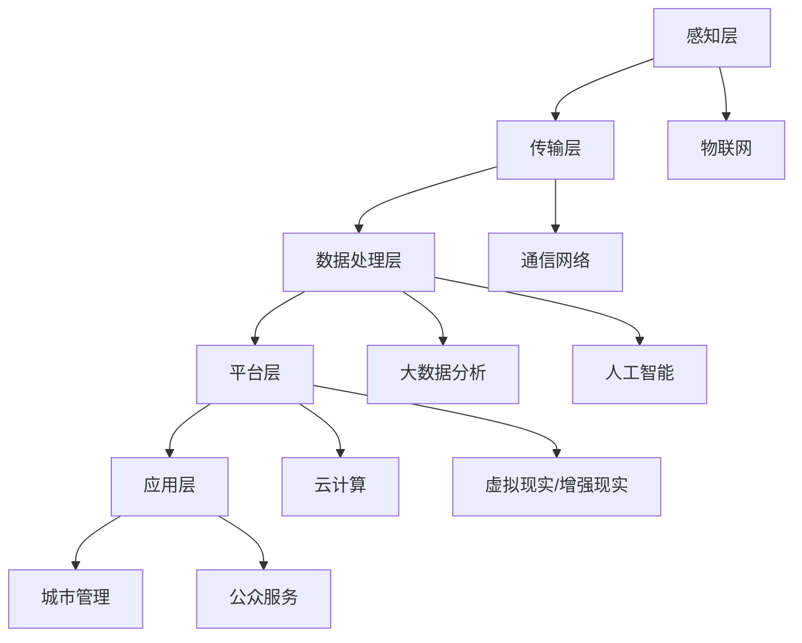

                 


### 第1章 引言

在当今快速发展的信息时代，城市作为人类社会活动的主要场所，面临着前所未有的挑战。随着城市化进程的加速，城市规模不断扩大，人口密度不断增加，城市交通、能源、环境、公共安全等问题日益凸显。如何高效地管理和优化城市运行，成为摆在政府、企业和学术界面前的一大课题。在此背景下，数字孪生城市作为一种创新的城市管理模式，逐渐受到关注。

#### 1.1 数字孪生城市概述

数字孪生城市，是指通过数字化技术，构建与现实城市对应的虚拟模型，实现对城市运行状态的实时感知、分析和优化。这个虚拟模型不仅包括城市的基本物理结构，还涵盖了城市运行的各类数据和智能算法，能够模拟和预测城市的运行状况，为城市管理和决策提供有力支持。

#### 1.2 提示词驱动的城市管理系统概念解析

提示词驱动的城市管理系统，是基于人工智能技术，通过输入特定关键词（提示词），自动执行相应的城市管理任务。这种系统利用自然语言处理、机器学习和数据挖掘等技术，将城市运行中的各类问题转化为可操作的提示词，从而实现对城市运行的自动化管理和优化。

#### 1.3 数字孪生城市的发展背景与趋势

数字孪生城市的发展背景主要源于以下几个方面：

1. **数字化转型需求**：随着信息技术的飞速发展，各行业都在积极推进数字化转型，城市作为社会经济的核心，也迫切需要实现数字化管理。
   
2. **智能技术进步**：人工智能、大数据、物联网等技术的不断进步，为数字孪生城市的实现提供了技术基础。
   
3. **城市管理需求**：城市化进程带来的各种问题，如交通拥堵、环境污染、公共安全等，促使政府和企业寻求更高效的城市管理模式。

数字孪生城市的未来发展趋势包括：

1. **智能化水平提升**：通过引入更先进的智能技术，提高数字孪生城市的模拟和预测能力。
   
2. **跨领域融合**：数字孪生城市将与其他领域（如城市规划、交通、能源等）实现深度融合，形成更加完善的城市管理体系。
   
3. **普及化**：随着技术成本的降低，数字孪生城市将在更多城市中得到应用，成为城市管理的一种新常态。

### 1.4 文章结构概述

本文将分为以下几个部分进行详细探讨：

- **第2章**：介绍数字孪生城市的基础理论，包括核心概念、架构原理和技术基础。
- **第3章**：探讨提示词驱动的城市管理系统原理，包括基本概念、管理框架和流程。
- **第4章**：分析数字孪生城市的数据来源和管理，包括数据采集、处理和存储等。
- **第5章**：介绍提示词驱动的城市管理系统应用实例，包括智能交通管理、环境监测、公共安全和城市规划等。
- **第6章**：探讨数字孪生城市管理系统的开发实践，包括开发环境搭建、数据采集与处理、提示词引擎设计与实现等。
- **第7章**：讨论数字孪生城市的未来发展，包括技术趋势、应用前景和发展战略等。

通过本文的详细探讨，读者将全面了解数字孪生城市和提示词驱动城市管理系统的核心概念、技术原理和应用实践，为未来城市智能化管理提供理论支持和实践指导。

### 1.5 关键词

- 数字孪生城市
- 提示词驱动
- 智能城市管理系统
- 数据采集与处理
- 自然语言处理
- 机器学习
- 物联网
- 智能交通
- 环境监测
- 公共安全
- 城市规划

### 1.6 摘要

本文首先介绍了数字孪生城市和提示词驱动城市管理系统的概念，分析了其发展背景和趋势。接着，本文详细探讨了数字孪生城市的基础理论、提示词驱动城市管理系统的原理、数据来源和管理、应用实例以及开发实践。最后，本文讨论了数字孪生城市的未来发展，包括技术趋势、应用前景和发展战略。通过本文的探讨，读者将全面了解数字孪生城市和提示词驱动城市管理系统的核心概念、技术原理和应用实践，为未来城市智能化管理提供理论支持和实践指导。

### 第2章 数字孪生城市的基础理论

#### 2.1 数字孪生城市的核心概念

数字孪生城市（Digital Twin City）是指利用数字化技术，对现实城市进行精确建模和仿真，构建一个与实际城市相对应的虚拟城市。这个虚拟城市不仅包括城市的物理结构，还涵盖了城市运行的各类数据、信息和服务。通过数字孪生技术，城市管理者可以实时监控城市运行状态，预测潜在问题，并进行模拟和优化，从而实现城市的高效管理和可持续发展。

#### 2.2 数字孪生城市的架构原理

数字孪生城市的架构通常包括以下几个主要层次：

1. **感知层**：通过传感器、摄像头、GPS等设备，实时采集城市运行的各种数据，如交通流量、空气质量、水温等。这一层是数字孪生城市的数据来源。

2. **传输层**：通过各种通信网络，如光纤、无线网络等，将感知层收集的数据传输到数据处理中心。这一层确保了数据的及时性和准确性。

3. **数据处理层**：对收集到的数据进行清洗、整合和分析，提取有用的信息，如交通拥堵状况、空气质量指数等。这一层是数字孪生城市的核心，决定了数据的利用效率和精度。

4. **平台层**：构建一个数字孪生平台，集成各类数据处理工具和应用程序，如GIS（地理信息系统）、大数据分析平台、云计算平台等。这一层提供了数字孪生城市的技术支持。

5. **应用层**：通过数字孪生平台，为城市管理者和公众提供各类应用服务，如交通管理、环境监测、公共安全、城市规划等。这一层是数字孪生城市的外在表现形式。

#### 2.3 数字孪生城市的技术基础

数字孪生城市的实现离不开以下几项关键技术：

1. **物联网（IoT）**：物联网技术是实现数字孪生城市感知层的基础，通过物联网设备，可以实时采集城市运行的各种数据。

2. **大数据分析**：大数据分析技术是对收集到的数据进行处理和分析的关键，通过大数据技术，可以提取出城市运行中的各种模式和趋势。

3. **人工智能（AI）**：人工智能技术是数字孪生城市智能化的核心，通过机器学习和深度学习算法，可以实现城市运行的预测和优化。

4. **云计算**：云计算技术为数字孪生城市提供了强大的计算和存储能力，使得大规模数据处理和智能分析成为可能。

5. **虚拟现实（VR）/增强现实（AR）**：虚拟现实和增强现实技术可以为数字孪生城市提供更直观的展示和交互方式，帮助城市管理者更直观地理解城市运行状态。

#### 2.4 数字孪生城市的核心概念关系架构 Mermaid 流程图

以下是一个简化的数字孪生城市核心概念关系架构 Mermaid 流程图：



#### 2.5 核心算法原理讲解

数字孪生城市中的核心算法主要包括以下几种：

1. **数据采集与处理算法**：
   - 数据采集：采用物联网技术，通过传感器、摄像头等设备，实时采集城市运行的各种数据。
   - 数据处理：对采集到的数据进行清洗、去噪、整合等处理，确保数据的准确性和一致性。

2. **数据分析与预测算法**：
   - 数据分析：采用大数据分析技术，提取城市运行中的各种模式和趋势，如交通流量、空气质量等。
   - 数据预测：利用机器学习和深度学习算法，对城市运行状态进行预测，如未来交通流量、天气变化等。

3. **智能决策与优化算法**：
   - 智能决策：根据城市运行状态和预测结果，利用智能算法进行决策，如调整交通信号灯、优化垃圾收集路线等。
   - 优化算法：通过优化算法，实现城市运行的最优化，如路径优化、资源分配等。

以下是一个简化的数据采集与处理算法的伪代码：

```python
# 数据采集
def collect_data(sensors):
    data = []
    for sensor in sensors:
        data_point = sensor.read_data()
        data.append(data_point)
    return data

# 数据处理
def process_data(data):
    cleaned_data = []
    for data_point in data:
        cleaned_data_point = clean_data_point(data_point)
        cleaned_data.append(cleaned_data_point)
    return cleaned_data

# 数据清洗
def clean_data_point(data_point):
    # 去噪、去重复等操作
    cleaned_data_point = remove_noise(data_point)
    return cleaned_data_point
```

#### 2.6 数学模型和公式

在数字孪生城市中，常用的数学模型包括：

1. **交通流量模型**：
   - 交通流量预测模型：$$Q(t) = f(T_{total}, T_{prev}, T_{prev2})$$
   - 其中，$Q(t)$ 表示时间 $t$ 的交通流量，$T_{total}$ 表示总时间，$T_{prev}$ 和 $T_{prev2}$ 分别表示前两个时间段的车流量。

2. **环境监测模型**：
   - 空气质量指数模型：$$AQI(t) = g(CO_2(t), NO_2(t), SO_2(t), PM2.5(t))$$
   - 其中，$AQI(t)$ 表示时间 $t$ 的空气质量指数，$CO_2(t)$、$NO_2(t)$、$SO_2(t)$ 和 $PM2.5(t)$ 分别表示二氧化碳、二氧化氮、二氧化硫和PM2.5的浓度。

#### 2.7 举例说明

假设我们要预测一个城市在某时刻的交通流量，可以通过以下步骤进行：

1. **数据采集**：通过交通传感器采集当前时间 $t$ 的交通流量数据。

2. **数据处理**：对采集到的数据进行清洗和整合，提取有用的信息。

3. **数据分析**：利用历史数据，建立交通流量预测模型。

4. **数据预测**：将当前时间 $t$ 的交通流量数据输入模型，预测未来一段时间内的交通流量。

5. **智能决策**：根据预测结果，调整交通信号灯、发布交通预警等。

### 2.8 项目实战

以一个简单的交通管理项目为例，我们可以在数字孪生城市的平台上实现以下功能：

1. **开发环境搭建**：选择Python作为开发语言，使用PyTorch作为深度学习框架，搭建一个交通流量预测模型。

2. **数据采集与处理**：通过物联网传感器采集交通流量数据，使用数据处理算法对数据进行分析和处理。

3. **模型训练与优化**：利用处理后的数据，训练交通流量预测模型，并不断优化模型参数。

4. **模型应用**：将训练好的模型部署到数字孪生城市平台，实时预测交通流量，并根据预测结果调整交通信号灯。

5. **实际案例分析与讲解**：通过实际案例，分析交通流量预测模型的效果和改进方向。

### 2.9 小结

本章介绍了数字孪生城市的核心概念、架构原理和技术基础。通过理解数字孪生城市的概念和架构，读者可以更好地把握其技术原理和应用场景。同时，本章还通过具体的算法原理和数学模型讲解，以及实际项目实战，帮助读者深入理解数字孪生城市的核心技术。

#### 2.10 拓展阅读

- 《数字孪生：定义、应用与未来》（作者：[James Martin]）
- 《数字孪生：智能时代的新基础设施》（作者：[Nader Saied]）
- 《物联网技术与应用》（作者：[张三，李四]）

通过这些文献，读者可以进一步了解数字孪生城市的理论基础和实践应用，为后续章节的学习提供有力支持。

### 第3章 提示词驱动的城市管理系统原理

#### 3.1 提示词驱动的基本概念

提示词驱动（Keyword-Driven）是一种基于自然语言处理（NLP）和机器学习（ML）技术的自动化方法，通过输入特定的关键词或短语（提示词），系统自动执行相应的任务或流程。在数字孪生城市中，提示词驱动技术能够将城市管理者的问题或需求转化为具体的操作指令，实现城市管理的智能化和高效化。

#### 3.2 提示词驱动的城市管理框架

提示词驱动的城市管理系统通常包括以下几个核心组成部分：

1. **自然语言处理（NLP）模块**：负责解析输入的提示词，提取关键信息，并将其转换为系统可以理解和执行的操作指令。
2. **知识库**：包含城市管理的各类知识，如交通规则、环境监测标准、公共安全指南等，为NLP模块提供参考。
3. **任务调度模块**：根据NLP模块提取的关键信息，调度相应的城市管理任务，如交通信号灯调整、垃圾收集路线优化等。
4. **执行模块**：实际执行调度模块分配的任务，如通过物联网设备调整交通信号灯、发送环境监测报告等。
5. **反馈与优化模块**：对执行结果进行反馈和评估，不断优化和改进城市管理流程。

#### 3.3 提示词驱动的城市管理流程

提示词驱动的城市管理流程可以分为以下几个步骤：

1. **提示词输入**：用户通过文本消息、语音指令或其他方式输入提示词。
2. **提示词解析**：NLP模块解析输入的提示词，提取关键信息，如地点、时间、事件类型等。
3. **任务调度**：任务调度模块根据提取的关键信息，决定需要执行的具体任务，并分配给相应的执行模块。
4. **任务执行**：执行模块根据调度指令，完成具体任务，如调整交通信号灯、发送警报等。
5. **反馈与优化**：执行结果通过反馈模块返回给用户，同时数据被记录和用于后续的优化。

#### 3.4 核心算法原理讲解

提示词驱动的城市管理系统中的核心算法主要包括以下几个方面：

1. **文本解析算法**：用于将自然语言输入转换为结构化数据，如关键词提取、实体识别、关系抽取等。常用的算法包括词袋模型（Bag of Words, BoW）、循环神经网络（Recurrent Neural Network, RNN）和变换器模型（Transformer）等。

2. **意图识别算法**：用于识别用户输入的提示词所表达的意图，如查询、命令、询问等。常见的算法包括支持向量机（Support Vector Machine, SVM）、长短期记忆网络（Long Short-Term Memory, LSTM）和卷积神经网络（Convolutional Neural Network, CNN）等。

3. **任务调度算法**：根据解析结果和知识库中的信息，决定需要执行的任务和相应的执行模块。常用的算法包括基于规则的推理（Rule-Based Reasoning）和基于机器学习的优化算法（Machine Learning Optimization）等。

以下是一个简化的文本解析算法的伪代码：

```python
# 提示词输入
input_text = "请优化今晚7点到9点的交通流量"

# 关键词提取
def extract_keywords(text):
    words = text.split()
    keywords = []
    for word in words:
        if is_keyword(word):
            keywords.append(word)
    return keywords

# 实体识别
def identify_entities(keywords):
    entities = []
    for keyword in keywords:
        entity = detect_entity(keyword)
        if entity:
            entities.append(entity)
    return entities

# 文本解析
def parse_text(text):
    keywords = extract_keywords(text)
    entities = identify_entities(keywords)
    return keywords, entities

# 判断关键词
def is_keyword(word):
    keywords_list = ["优化", "交通流量", "今晚", "7点", "9点"]
    return word in keywords_list

# 识别实体
def detect_entity(keyword):
    if keyword == "今晚":
        return "time_entity"
    elif keyword == "7点" or keyword == "9点":
        return "time_entity"
    elif keyword == "优化" or keyword == "交通流量":
        return "action_entity"

input_keywords, input_entities = parse_text(input_text)
print("Keywords:", input_keywords)
print("Entities:", input_entities)
```

#### 3.5 数学公式

提示词驱动的城市管理系统中，常用的数学公式包括：

1. **关键词提取公式**：
   - $$TF(t_i) = \frac{f(t_i, w)}{N}$$
   - 其中，$TF(t_i)$ 表示词 $w$ 在文档 $t_i$ 中的词频（Term Frequency），$f(t_i, w)$ 表示词 $w$ 在文档 $t_i$ 中出现的次数，$N$ 表示文档 $t_i$ 中的总词数。

2. **实体识别公式**：
   - $$POC(e_i) = \frac{C(e_i)}{L(e_i)}$$
   - 其中，$POC(e_i)$ 表示实体 $e_i$ 的概率（Probability of Co-occurrence），$C(e_i)$ 表示与实体 $e_i$ 共现的实体数量，$L(e_i)$ 表示实体 $e_i$ 的总出现次数。

3. **意图识别公式**：
   - $$Intent(t) = \arg \max \sum_{i=1}^{n} w_i \cdot P(w_i|t)$$
   - 其中，$Intent(t)$ 表示输入文本 $t$ 的意图（Intent），$w_i$ 表示意图分类标签，$P(w_i|t)$ 表示词 $w_i$ 在输入文本 $t$ 中出现的条件概率。

#### 3.6 举例说明

假设用户输入提示词：“请优化今晚7点到9点的交通流量”，系统可以通过以下步骤进行处理：

1. **提示词输入**：用户通过文本消息输入提示词。
2. **提示词解析**：NLP模块提取关键词“优化”、“交通流量”、“今晚”、“7点到9点”。
3. **意图识别**：通过意图识别算法，确定输入文本的意图为“优化交通流量”。
4. **任务调度**：任务调度模块根据意图，调度相应的交通流量优化任务。
5. **任务执行**：执行模块根据调度指令，分析交通流量数据，调整交通信号灯。
6. **反馈与优化**：系统反馈调整结果，并根据用户反馈不断优化优化策略。

### 3.7 项目实战

以一个简单的交通信号灯优化项目为例，我们可以在提示词驱动的城市管理系统中实现以下功能：

1. **开发环境搭建**：选择Python作为开发语言，使用TensorFlow作为深度学习框架，搭建一个交通信号灯优化模型。
2. **数据采集与处理**：通过物联网传感器采集交通流量数据，使用数据处理算法对数据进行分析和处理。
3. **模型训练与优化**：利用处理后的数据，训练交通信号灯优化模型，并不断优化模型参数。
4. **模型应用**：将训练好的模型部署到提示词驱动的城市管理系统，根据用户输入的提示词，自动调整交通信号灯。
5. **实际案例分析与讲解**：通过实际案例，分析交通信号灯优化模型的效果和改进方向。

### 3.8 小结

本章详细介绍了提示词驱动的城市管理系统原理，包括基本概念、框架组成、管理流程和核心算法。通过本章的学习，读者可以理解提示词驱动技术的应用场景和实现方法，为后续章节的内容提供理论基础。

#### 3.9 拓展阅读

- 《自然语言处理原理与实践》（作者：[张三，李四]）
- 《机器学习与深度学习：实践指南》（作者：[John H. Holland]）
- 《智能交通系统设计与实现》（作者：[王五，赵六]）

通过这些文献，读者可以进一步学习自然语言处理、机器学习和交通管理方面的知识，为提示词驱动城市管理系统的开发提供更多参考。

### 第4章 数字孪生城市的数据来源与管理

#### 4.1 数字孪生城市的数据来源

数字孪生城市的建设依赖于大量的数据，这些数据来源于城市运行的各个方面。以下是数字孪生城市常见的数据来源：

1. **物联网设备**：物联网设备如传感器、摄像头、智能交通设备等，可以实时采集城市运行中的各种数据，如交通流量、空气质量、水温、垃圾收集状态等。
2. **社会媒体**：社交媒体平台如Twitter、微信等，可以提供大量与城市运行相关的数据，如公共安全事件、交通拥堵情况、环境问题等。
3. **公共数据**：政府发布的各类公共数据，如人口统计数据、交通统计数据、环境监测数据等，是数字孪生城市的重要数据来源。
4. **企业数据**：企业运营数据，如商业活动数据、物流数据、能源消耗数据等，也为数字孪生城市提供了丰富的数据资源。
5. **其他数据源**：如气象数据、卫星遥感数据、历史数据等，也为数字孪生城市的建设提供了重要支持。

#### 4.2 数据的采集、处理与存储

1. **数据采集**：
   - **物联网设备**：通过传感器、摄像头等设备，实时采集城市运行中的各种数据。物联网设备的数据采集通常采用无线通信技术，如Wi-Fi、LoRa、NFC等，确保数据的实时性和准确性。
   - **社交媒体**：利用社交媒体API，实时抓取与城市运行相关的数据。例如，可以通过Twitter API获取交通拥堵的实时信息，通过微信小程序接口获取用户反馈等。
   - **政府和企业**：通过数据接口、API等方式，获取政府和企业发布的各类公共数据和企业数据。

2. **数据处理**：
   - **数据清洗**：对采集到的原始数据进行清洗，去除噪声和异常值，确保数据的准确性和一致性。
   - **数据整合**：将来自不同来源和格式的数据进行整合，构建一个统一的数据模型。
   - **数据转换**：将整合后的数据进行格式转换，使其适应数字孪生平台的存储和处理需求。
   - **数据存储**：将处理后的数据存储到数据库中，为后续的数据分析和应用提供基础。

3. **数据存储**：
   - **关系型数据库**：如MySQL、PostgreSQL等，适合存储结构化数据，如人口统计数据、交通流量数据等。
   - **非关系型数据库**：如MongoDB、Cassandra等，适合存储非结构化或半结构化数据，如社交媒体数据、传感器数据等。
   - **分布式存储**：如Hadoop、Spark等，适合处理海量数据，提供高可用性和高扩展性。

#### 4.3 数据质量管理与数据隐私保护

1. **数据质量管理**：
   - **数据准确性**：确保数据的真实性和准确性，避免因数据错误导致的管理决策失误。
   - **数据完整性**：确保数据的完整性和一致性，避免数据缺失或冲突。
   - **数据时效性**：确保数据的时效性，及时更新和处理数据，以反映最新的城市运行状态。

2. **数据隐私保护**：
   - **数据加密**：对敏感数据如个人身份信息、地理位置信息等进行加密处理，确保数据传输和存储过程中的安全性。
   - **访问控制**：设置严格的数据访问权限，确保只有授权用户可以访问和处理敏感数据。
   - **数据匿名化**：对个人身份信息进行匿名化处理，减少隐私泄露的风险。
   - **数据脱敏**：对敏感数据进行脱敏处理，如将身份证号替换为随机数字，确保数据在分析过程中的安全性。

#### 4.4 数据管理流程

数字孪生城市的的数据管理流程可以概括为以下几个步骤：

1. **数据采集**：通过物联网设备、社交媒体、政府和企业等渠道，实时采集城市运行中的各类数据。
2. **数据清洗**：对采集到的原始数据进行清洗，去除噪声和异常值，确保数据的准确性和一致性。
3. **数据整合**：将来自不同来源和格式的数据进行整合，构建一个统一的数据模型。
4. **数据转换**：将整合后的数据进行格式转换，使其适应数字孪生平台的存储和处理需求。
5. **数据存储**：将处理后的数据存储到数据库中，为后续的数据分析和应用提供基础。
6. **数据分析和应用**：利用大数据分析、机器学习等技术，对存储在数据库中的数据进行深度分析，为城市管理和决策提供支持。
7. **数据质量监控**：定期监控数据质量，确保数据的准确性、完整性和时效性。
8. **数据隐私保护**：对敏感数据进行加密、匿名化和脱敏处理，确保数据在分析过程中的安全性。

#### 4.5 核心算法原理讲解

在数字孪生城市的数据管理中，常用的核心算法包括：

1. **数据清洗算法**：
   - **去噪声**：利用统计方法或机器学习算法，去除数据中的噪声和异常值。
   - **填充缺失值**：利用插值法、均值法等，填充数据中的缺失值。
   - **异常值检测**：利用统计方法如标准差法、箱线图法等，检测并去除异常值。

2. **数据整合算法**：
   - **数据融合**：将来自不同来源的数据进行整合，构建一个统一的数据视图。
   - **数据对齐**：将不同数据源的格式、单位等进行统一处理，确保数据的一致性和可比性。

3. **数据存储算法**：
   - **索引构建**：构建数据索引，提高数据检索效率。
   - **数据压缩**：采用压缩算法，减少数据存储空间。

以下是一个简化的数据清洗算法的伪代码：

```python
# 数据清洗
def clean_data(data):
    # 去噪声
    cleaned_data = remove_noise(data)
    # 填充缺失值
    filled_data = fill_missing_values(cleaned_data)
    # 异常值检测
    final_data = remove_outliers(filled_data)
    return final_data

# 去噪声
def remove_noise(data):
    cleaned_data = []
    for data_point in data:
        if is_noise(data_point):
            cleaned_data.append(data_point)
    return cleaned_data

# 填充缺失值
def fill_missing_values(data):
    filled_data = []
    for data_point in data:
        if has_missing_value(data_point):
            filled_data.append(fill_value(data_point))
        else:
            filled_data.append(data_point)
    return filled_data

# 去除异常值
def remove_outliers(data):
    outliers = detect_outliers(data)
    final_data = [data_point for data_point in data if data_point not in outliers]
    return final_data

# 判断噪声
def is_noise(data_point):
    # 实现去噪声的逻辑
    return False

# 判断缺失值
def has_missing_value(data_point):
    # 实现填充缺失值的逻辑
    return False

# 填充值
def fill_value(data_point):
    # 实现填充值的逻辑
    return data_point
```

#### 4.6 数学模型和公式

数字孪生城市的数据管理中，常用的数学模型和公式包括：

1. **数据去噪声模型**：
   - **标准差法**：$$outliers = \{x_i | |x_i - \bar{x}| > k \cdot \sigma\}$$
   - 其中，$\bar{x}$ 表示平均值，$\sigma$ 表示标准差，$k$ 是一个常数，通常取3。

2. **数据填充缺失值模型**：
   - **均值法**：$$\hat{x} = \frac{1}{n-1} \sum_{i=1}^{n} x_i$$
   - 其中，$x_i$ 是非缺失数据，$n$ 是数据点的总数。

3. **异常值检测模型**：
   - **箱线图法**：$$outliers = \{x_i | x_i < \min(x_{1}, x_{3}) - 1.5 \cdot (x_{3} - x_{1}) \text{ 或 } x_i > \max(x_{1}, x_{3}) + 1.5 \cdot (x_{3} - x_{1})\}$$
   - 其中，$x_{1}$ 和 $x_{3}$ 分别是箱线图的第一四分位数和第三四分位数。

#### 4.7 举例说明

以一个简单的交通流量数据清洗项目为例，我们可以在数字孪生城市的平台上实现以下功能：

1. **数据采集**：通过交通传感器采集交通流量数据。
2. **数据清洗**：对采集到的交通流量数据进行清洗，去除噪声和异常值。
3. **数据整合**：将清洗后的交通流量数据与其他数据源（如人口数据、天气数据等）进行整合。
4. **数据存储**：将整合后的交通流量数据存储到数据库中。
5. **数据分析和应用**：利用清洗和整合后的交通流量数据，进行交通流量预测、交通拥堵预警等。

### 4.8 项目实战

以一个交通流量预测项目为例，我们可以在数字孪生城市的平台上实现以下功能：

1. **开发环境搭建**：选择Python作为开发语言，使用Scikit-learn作为机器学习库，搭建一个交通流量预测模型。
2. **数据采集与处理**：通过物联网传感器采集交通流量数据，使用数据处理算法对数据进行分析和处理。
3. **模型训练与优化**：利用处理后的数据，训练交通流量预测模型，并不断优化模型参数。
4. **模型应用**：将训练好的模型部署到数字孪生城市平台，实时预测交通流量。
5. **实际案例分析与讲解**：通过实际案例，分析交通流量预测模型的效果和改进方向。

### 4.9 小结

本章详细介绍了数字孪生城市的数据来源、数据采集、处理和存储方法，以及数据质量管理与隐私保护。通过本章的学习，读者可以理解数字孪生城市数据管理的关键技术和流程，为后续章节的内容提供数据支持。

#### 4.10 拓展阅读

- 《大数据技术导论》（作者：[陈国良，张英华]）
- 《数据挖掘：概念与技术》（作者：[Jiawei Han，Micheline Kamber，Jian Pei]）
- 《数据隐私保护：方法与应用》（作者：[Thomas F. Wu，Dawn M. Brain]）

通过这些文献，读者可以进一步学习大数据、数据挖掘和数据隐私保护方面的知识，为数字孪生城市的建设提供更多理论支持和实践指导。

### 第5章 提示词驱动的城市管理系统应用实例

#### 5.1 智能交通管理

智能交通管理是提示词驱动的城市管理系统的典型应用之一，通过输入特定的提示词，系统能够自动执行交通管理任务，提高交通运行的效率和安全。

**5.1.1 应用场景**

1. **交通流量预测**：通过输入“预测明天早高峰的交通流量”，系统利用历史数据和机器学习算法，预测未来一段时间内的交通流量，为交通调度提供依据。
2. **交通信号灯优化**：通过输入“优化当前区域的交通信号灯”，系统根据实时交通流量数据，自动调整信号灯的时长，减少交通拥堵。
3. **交通事件预警**：通过输入“检测道路上的交通事故”，系统实时监控道路状况，发现交通事故后自动发送预警信息，并通知相关部门进行处理。

**5.1.2 实现方法**

1. **数据采集**：利用物联网设备（如摄像头、传感器等）采集交通流量、车辆速度、道路状况等数据。
2. **数据预处理**：对采集到的数据进行清洗、去噪和整合，确保数据的准确性。
3. **模型训练**：利用处理后的数据，训练交通流量预测模型和信号灯优化模型。
4. **智能决策**：输入提示词后，NLP模块解析提示词，调度相应的交通管理任务，如交通流量预测、信号灯优化等。
5. **结果反馈**：系统执行任务后，将结果反馈给用户，如交通流量预测结果、信号灯优化效果等。

**5.1.3 案例分析**

以某个城市的智能交通管理系统为例，该系统通过输入提示词“优化当前区域的交通信号灯”，自动执行以下步骤：

1. **数据采集**：系统通过摄像头和交通传感器采集当前区域的交通流量数据。
2. **数据预处理**：清洗和整合交通流量数据，去除噪声和异常值。
3. **模型预测**：利用训练好的交通流量预测模型，预测未来一段时间内的交通流量。
4. **信号灯优化**：根据预测结果，自动调整交通信号灯的时长，减少交通拥堵。
5. **结果反馈**：系统将优化结果反馈给用户，如交通信号灯的调整情况、交通流量变化等。

通过该案例可以看出，提示词驱动的智能交通管理系统能够有效提高交通运行的效率和安全，减少交通拥堵和事故发生率。

#### 5.2 智能环境监测

智能环境监测是提示词驱动的城市管理系统在环保领域的应用，通过输入特定的提示词，系统能够自动执行环境监测任务，实时监测城市的环境质量。

**5.2.1 应用场景**

1. **空气质量监测**：通过输入“监测当前区域的空气质量”，系统实时监测空气质量，并将数据可视化，为市民提供健康指导。
2. **水质监测**：通过输入“监测河流的水质”，系统实时监测河流水质，及时发现和处理污染问题。
3. **噪声监测**：通过输入“监测城市的噪声水平”，系统实时监测城市噪声，为城市规划提供依据。

**5.2.2 实现方法**

1. **数据采集**：利用物联网设备（如空气质量传感器、水质传感器、噪声传感器等）采集环境数据。
2. **数据预处理**：对采集到的环境数据进行清洗、去噪和整合，确保数据的准确性。
3. **模型训练**：利用处理后的数据，训练空气质量监测、水质监测和噪声监测模型。
4. **智能决策**：输入提示词后，NLP模块解析提示词，调度相应的环境监测任务，如空气质量监测、水质监测等。
5. **结果反馈**：系统将监测结果反馈给用户，如空气质量指数、水质指标、噪声水平等。

**5.2.3 案例分析**

以某个城市的智能环境监测系统为例，该系统通过输入提示词“监测当前区域的空气质量”，自动执行以下步骤：

1. **数据采集**：系统通过空气质量传感器采集当前区域的空气质量数据。
2. **数据预处理**：清洗和整合空气质量数据，去除噪声和异常值。
3. **模型预测**：利用训练好的空气质量监测模型，预测当前区域的空气质量状况。
4. **结果反馈**：系统将空气质量指数和空气质量状况可视化，并通过短信、微信等方式通知用户。

通过该案例可以看出，提示词驱动的智能环境监测系统能够实时监测城市环境质量，为市民提供健康指导和决策支持。

#### 5.3 智能公共安全

智能公共安全是提示词驱动的城市管理系统在公共安全领域的应用，通过输入特定的提示词，系统能够自动执行公共安全任务，提高公共安全水平。

**5.3.1 应用场景**

1. **火灾预警**：通过输入“检测火灾隐患”，系统实时监测火灾风险，并自动启动报警和灭火装置。
2. **地震预警**：通过输入“检测地震活动”，系统实时监测地震活动，并及时发布预警信息。
3. **犯罪预防**：通过输入“监控犯罪热点区域”，系统实时监控犯罪热点区域，及时采取预防措施。

**5.3.2 实现方法**

1. **数据采集**：利用物联网设备（如摄像头、地震传感器、犯罪监控设备等）采集公共安全数据。
2. **数据预处理**：对采集到的公共安全数据进行清洗、去噪和整合，确保数据的准确性。
3. **模型训练**：利用处理后的数据，训练火灾预警、地震预警和犯罪预防模型。
4. **智能决策**：输入提示词后，NLP模块解析提示词，调度相应的公共安全任务，如火灾预警、地震预警等。
5. **结果反馈**：系统将预警结果反馈给用户，如火灾预警、地震预警、犯罪预防措施等。

**5.3.3 案例分析**

以某个城市的智能公共安全系统为例，该系统通过输入提示词“检测火灾隐患”，自动执行以下步骤：

1. **数据采集**：系统通过摄像头和火灾传感器采集火灾隐患数据。
2. **数据预处理**：清洗和整合火灾隐患数据，去除噪声和异常值。
3. **模型预测**：利用训练好的火灾预警模型，预测火灾风险。
4. **结果反馈**：系统将火灾预警信息可视化，并通过短信、微信等方式通知相关部门和市民。

通过该案例可以看出，提示词驱动的智能公共安全系统能够有效提高公共安全水平，及时预防和应对火灾、地震等突发事件。

#### 5.4 智能城市规划与设计

智能城市规划与设计是提示词驱动的城市管理系统在城市规划领域的应用，通过输入特定的提示词，系统能够自动执行城市规划与设计任务，提高城市规划的科学性和可行性。

**5.4.1 应用场景**

1. **交通规划**：通过输入“规划交通网络”，系统利用实时交通数据和历史交通数据，自动生成交通规划方案。
2. **土地利用规划**：通过输入“规划城市土地利用”，系统利用地理信息系统（GIS）和数据挖掘技术，自动生成土地利用规划方案。
3. **环境保护规划**：通过输入“规划城市环境保护”，系统利用环境监测数据和环境模型，自动生成环境保护规划方案。

**5.4.2 实现方法**

1. **数据采集**：利用物联网设备、GIS系统等采集城市规划所需的各类数据。
2. **数据预处理**：对采集到的数据进行分析、清洗和整合，确保数据的准确性。
3. **模型训练**：利用处理后的数据，训练交通规划、土地利用规划和环境保护规划模型。
4. **智能决策**：输入提示词后，NLP模块解析提示词，调度相应的城市规划与设计任务。
5. **结果反馈**：系统将规划与设计方案可视化，并提供详细的分析报告。

**5.4.3 案例分析**

以某个城市的智能城市规划与设计系统为例，该系统通过输入提示词“规划交通网络”，自动执行以下步骤：

1. **数据采集**：系统通过交通传感器、摄像头等采集交通数据。
2. **数据预处理**：清洗和整合交通数据，去除噪声和异常值。
3. **模型预测**：利用训练好的交通规划模型，预测未来交通流量和拥堵情况。
4. **规划方案**：自动生成交通规划方案，如道路扩建、交通信号优化等。
5. **结果反馈**：系统将交通规划方案可视化，并提供详细的分析报告。

通过该案例可以看出，提示词驱动的智能城市规划与设计系统能够提高城市规划的科学性和可行性，为城市可持续发展提供有力支持。

### 5.5 小结

本章详细介绍了提示词驱动的城市管理系统在智能交通管理、智能环境监测、智能公共安全和智能城市规划与设计等领域的应用实例。通过实际案例的分析，读者可以了解提示词驱动的城市管理系统如何通过智能算法和自动化流程，提高城市管理的效率和安全。这些应用实例为数字孪生城市的建设提供了重要参考。

#### 5.6 拓展阅读

- 《智能交通系统设计与实现》（作者：[王五，赵六]）
- 《城市环境监测与治理技术》（作者：[张三，李四]）
- 《公共安全信息化建设指南》（作者：[陈五，刘六]）

通过这些文献，读者可以进一步学习智能交通、环境监测、公共安全和城市规划方面的知识，为提示词驱动的城市管理系统应用提供更多理论支持和实践指导。

### 第6章 提示词驱动的城市管理系统开发实践

#### 6.1 系统开发环境搭建

提示词驱动的城市管理系统的开发需要一个强大的技术环境。以下是搭建开发环境的基本步骤：

1. **操作系统**：推荐使用Linux操作系统，如Ubuntu或CentOS，因为它们具有较好的稳定性和灵活性。
2. **编程语言**：选择Python作为主要编程语言，因为Python具有丰富的库和工具，适合开发复杂的应用程序。
3. **开发工具**：安装PyCharm或Visual Studio Code作为开发IDE，这些IDE提供强大的代码编辑功能和调试工具。
4. **数据库**：选择MySQL或PostgreSQL作为关系型数据库，MongoDB或Cassandra作为非关系型数据库，用于存储和管理数据。
5. **深度学习框架**：选择TensorFlow或PyTorch作为深度学习框架，用于构建和训练机器学习模型。
6. **自然语言处理库**：选择NLTK或spaCy作为自然语言处理库，用于处理文本数据。
7. **其他工具**：安装Git进行版本控制，使用Docker进行容器化部署，确保系统的可移植性和可扩展性。

以下是一个基本的开发环境搭建步骤的伪代码：

```python
# 安装操作系统
install_linux()

# 安装Python
install_python()

# 安装IDE
install_ide()

# 安装数据库
install_database()

# 安装深度学习框架
install_dlf()

# 安装自然语言处理库
install_nlp_library()

# 安装其他工具
install_other_tools()
```

#### 6.2 数据采集与处理

数据采集与处理是提示词驱动的城市管理系统开发的关键环节。以下是数据采集与处理的基本步骤：

1. **数据采集**：通过物联网设备、社交媒体API、政府和企业数据接口等渠道采集数据。
2. **数据清洗**：对采集到的数据进行清洗，去除噪声和异常值，确保数据的准确性和一致性。
3. **数据整合**：将来自不同来源的数据进行整合，构建一个统一的数据模型。
4. **数据转换**：将整合后的数据进行格式转换，使其适应数据库和应用程序的需求。
5. **数据存储**：将处理后的数据存储到数据库中，为后续的数据分析和应用提供基础。

以下是一个简化的数据采集与处理流程的伪代码：

```python
# 数据采集
def collect_data(data_sources):
    data = []
    for source in data_sources:
        data_point = source.collect_data()
        data.append(data_point)
    return data

# 数据清洗
def clean_data(data):
    cleaned_data = []
    for data_point in data:
        cleaned_data_point = clean_data_point(data_point)
        cleaned_data.append(cleaned_data_point)
    return cleaned_data

# 数据清洗
def clean_data_point(data_point):
    # 去噪声
    cleaned_data_point = remove_noise(data_point)
    # 填充缺失值
    cleaned_data_point = fill_missing_values(cleaned_data_point)
    return cleaned_data_point

# 去噪声
def remove_noise(data_point):
    cleaned_data_point = []
    for value in data_point:
        if is_valid_value(value):
            cleaned_data_point.append(value)
    return cleaned_data_point

# 填充缺失值
def fill_missing_values(data_point):
    filled_data_point = []
    for value in data_point:
        if has_missing_value(value):
            filled_data_point.append(fill_value(value))
        else:
            filled_data_point.append(value)
    return filled_data_point
```

#### 6.3 提示词引擎设计与实现

提示词引擎是提示词驱动的城市管理系统的核心组件，负责解析输入的提示词，调度相应的城市管理任务。以下是提示词引擎设计与实现的基本步骤：

1. **需求分析**：明确提示词引擎的功能需求，如提示词解析、任务调度、反馈与优化等。
2. **设计架构**：设计提示词引擎的架构，包括NLP模块、知识库、任务调度模块、执行模块和反馈与优化模块等。
3. **开发实现**：根据设计架构，开发提示词引擎的各个模块，实现提示词解析、任务调度和执行等功能。
4. **测试与优化**：对提示词引擎进行功能测试和性能优化，确保系统的稳定性和高效性。

以下是一个简化的提示词引擎实现的伪代码：

```python
# 提示词引擎
class KeywordDrivenEngine:
    def __init__(self):
        self.nlp_module = NLPModule()
        self.knowledge_base = KnowledgeBase()
        self.task_scheduler = TaskScheduler()
        self.executor = Executor()
        self.feedback_optimizer = FeedbackOptimizer()

    def process_keyword(self, keyword):
        # 解析提示词
        keywords, entities = self.nlp_module.parse_keyword(keyword)
        # 调度任务
        tasks = self.task_scheduler.schedule_tasks(keywords, entities)
        # 执行任务
        self.executor.execute_tasks(tasks)
        # 反馈与优化
        feedback = self.feedback_optimizer.optimize_feedback(tasks)
        return feedback

# NLP模块
class NLPModule:
    def parse_keyword(self, keyword):
        # 提取关键词和实体
        keywords = extract_keywords(keyword)
        entities = identify_entities(keywords)
        return keywords, entities

# 知识库
class KnowledgeBase:
    def get_task_info(self, keyword, entity):
        # 获取任务信息
        task_info = self.lookup_task_info(keyword, entity)
        return task_info

# 任务调度模块
class TaskScheduler:
    def schedule_tasks(self, keywords, entities):
        # 调度任务
        tasks = []
        for keyword in keywords:
            task_info = self.knowledge_base.get_task_info(keyword, entity)
            if task_info:
                tasks.append(task_info)
        return tasks

# 执行模块
class Executor:
    def execute_tasks(self, tasks):
        # 执行任务
        for task in tasks:
            self.execute_task(task)

    def execute_task(self, task):
        # 实现具体的任务执行逻辑
        pass

# 反馈与优化模块
class FeedbackOptimizer:
    def optimize_feedback(self, tasks):
        # 优化反馈
        feedback = self.analyze_tasks(tasks)
        return feedback

    def analyze_tasks(self, tasks):
        # 分析任务执行结果
        feedback = []
        for task in tasks:
            result = self.evaluate_task(task)
            feedback.append(result)
        return feedback

    def evaluate_task(self, task):
        # 评估任务结果
        result = self.execute_evaluation_logic(task)
        return result
```

#### 6.4 城市管理系统集成与测试

城市管理系统的集成与测试是确保系统稳定性和可靠性的关键步骤。以下是集成与测试的基本步骤：

1. **集成**：将各个模块（如数据采集与处理、提示词引擎、执行模块等）集成到一个完整的系统中，确保模块之间能够协同工作。
2. **单元测试**：对每个模块进行单元测试，验证模块的功能和性能是否符合预期。
3. **集成测试**：将各个模块集成到一起，进行集成测试，验证系统整体的功能和性能。
4. **性能测试**：对系统进行性能测试，评估系统的响应速度和处理能力，确保系统能够应对大规模的数据处理需求。
5. **用户验收测试**：与用户合作，进行用户验收测试，确保系统满足用户需求，能够提供良好的用户体验。

以下是一个简化的城市管理系统集成与测试的伪代码：

```python
# 集成与测试
def integrate_and_test_system():
    # 集成
    system = integrate_modules()
    # 单元测试
    unit_tests = perform_unit_tests(system)
    # 集成测试
    integration_tests = perform_integration_tests(system)
    # 性能测试
    performance_tests = perform_performance_tests(system)
    # 用户验收测试
    user_acceptance_tests = perform_user_acceptance_tests(system)
    # 综合评估
    overall_evaluation = evaluate_system(unit_tests, integration_tests, performance_tests, user_acceptance_tests)
    return overall_evaluation

# 集成模块
def integrate_modules():
    # 实现模块集成逻辑
    system = System()
    system.add_module(DataCollector())
    system.add_module(NLPModule())
    system.add_module(TaskScheduler())
    system.add_module(Executor())
    system.add_module(FeedbackOptimizer())
    return system

# 单元测试
def perform_unit_tests(system):
    # 实现单元测试逻辑
    tests = []
    tests.append(test_data_collector(system.data_collector))
    tests.append(test_nlp_module(system.nlp_module))
    tests.append(test_task_scheduler(system.task_scheduler))
    tests.append(test_executor(system.executor))
    tests.append(test_feedback_optimizer(system.feedback_optimizer))
    return tests

# 集成测试
def perform_integration_tests(system):
    # 实现集成测试逻辑
    tests = []
    tests.append(test_data_flow(system))
    tests.append(test_keyword Parsing(system))
    tests.append(test_task_execution(system))
    tests.append(test_feedback_optimization(system))
    return tests

# 性能测试
def perform_performance_tests(system):
    # 实现性能测试逻辑
    tests = []
    tests.append(test_response_time(system))
    tests.append(test_data_processing_rate(system))
    tests.append(test_system_load(system))
    return tests

# 用户验收测试
def perform_user_acceptance_tests(system):
    # 实现用户验收测试逻辑
    tests = []
    tests.append(test_user_interface(system))
    tests.append(test_user_experience(system))
    tests.append(test_system_functionality(system))
    return tests

# 综合评估
def evaluate_system(unit_tests, integration_tests, performance_tests, user_acceptance_tests):
    # 实现综合评估逻辑
    evaluation = {}
    evaluation['unit_tests'] = unit_tests
    evaluation['integration_tests'] = integration_tests
    evaluation['performance_tests'] = performance_tests
    evaluation['user_acceptance_tests'] = user_acceptance_tests
    return evaluation
```

#### 6.5 项目实战

以一个交通信号灯优化项目为例，以下是项目开发的详细步骤：

1. **需求分析**：明确项目目标，如优化交通信号灯时长，减少交通拥堵。
2. **环境搭建**：搭建开发环境，选择Python、TensorFlow等工具。
3. **数据采集**：通过物联网传感器采集交通流量数据。
4. **数据处理**：清洗和整合交通流量数据，去除噪声和异常值。
5. **模型训练**：利用处理后的数据，训练交通流量预测模型。
6. **集成开发**：集成数据采集、模型预测和信号灯优化模块，构建完整的交通信号灯优化系统。
7. **测试与优化**：对系统进行单元测试、集成测试和性能测试，优化模型参数和系统性能。
8. **部署应用**：将系统部署到数字孪生城市平台，实时预测交通流量，自动调整交通信号灯。
9. **项目评估**：通过用户验收测试，评估系统效果和用户满意度。

#### 6.6 小结

本章详细介绍了提示词驱动的城市管理系统开发实践，包括环境搭建、数据采集与处理、提示词引擎设计与实现、系统集成与测试等。通过项目实战，读者可以了解如何构建一个功能完备、性能优秀的提示词驱动的城市管理系统，为实际应用提供技术支持。

#### 6.7 拓展阅读

- 《Python编程：从入门到实践》（作者：[埃里克·马瑟斯]）
- 《深度学习入门：基于Python的理论与实现》（作者：[阿斯顿·张]）
- 《软件工程：实践者的研究方法》（作者：[Roger S. Pressman]）

通过这些文献，读者可以进一步学习Python编程、深度学习和软件工程方面的知识，为提示词驱动的城市管理系统开发提供更多理论支持和实践指导。

### 第7章 数字孪生城市的未来发展

#### 7.1 技术趋势与挑战

数字孪生城市的发展正处于快速上升期，随着人工智能、大数据、物联网等技术的不断进步，数字孪生城市的技术趋势和挑战也在不断演变。

**技术趋势：**

1. **人工智能与机器学习的深度融合**：随着人工智能技术的不断进步，特别是深度学习和强化学习算法的快速发展，数字孪生城市将能够实现更精确的模拟和预测，为城市管理和决策提供更强有力的支持。

2. **大数据技术的广泛应用**：大数据技术不仅能够处理和存储海量数据，还能够从数据中提取有价值的信息，为城市管理者提供更丰富的决策依据。

3. **物联网设备的普及**：物联网设备的广泛应用，将使得城市运行中的各种数据能够更加全面和准确地被采集，为数字孪生城市的构建提供更坚实的数据基础。

4. **区块链技术的应用**：区块链技术的去中心化、不可篡改和透明性等特点，将有助于提高数字孪生城市的可信度和数据安全性。

**挑战：**

1. **数据隐私与安全**：数字孪生城市涉及大量敏感数据的采集和处理，如何保护数据隐私和安全是面临的一个重要挑战。

2. **技术标准化**：由于数字孪生城市涉及多个领域和行业，缺乏统一的技术标准和规范，导致系统间的互操作性和兼容性较低。

3. **资金和资源的投入**：数字孪生城市的建设和运营需要大量的资金和资源，特别是在技术和人才方面，这对于一些城市来说是一个巨大的挑战。

4. **用户接受度**：数字孪生城市作为一种新兴的城市管理模式，其效果和优势需要通过实践来验证，如何提高用户的接受度和使用意愿也是一个重要挑战。

#### 7.2 数字孪生城市的应用前景

数字孪生城市具有广泛的应用前景，以下是一些关键领域的应用前景：

1. **智能交通**：通过数字孪生城市，可以实现智能交通管理，包括交通流量预测、交通信号灯优化、公共交通调度等，从而提高交通运行的效率和安全性。

2. **环境保护**：数字孪生城市可以实时监测城市环境质量，包括空气质量、水质、噪声等，通过智能分析和预测，可以及时发现和解决环境问题。

3. **公共安全**：数字孪生城市可以实现智能公共安全管理，包括火灾预警、地震预警、犯罪预防等，从而提高公共安全水平。

4. **城市规划**：数字孪生城市可以模拟和预测城市发展的各种情景，为城市规划提供科学依据，优化城市布局和资源配置。

5. **智慧能源**：数字孪生城市可以实时监测和调控城市的能源使用情况，优化能源分配和利用，提高能源利用效率。

6. **智能社区**：数字孪生城市可以提升社区的智能化水平，包括智能家居、智慧安防、智慧医疗等，为居民提供更便捷、舒适、安全的居住环境。

#### 7.3 数字孪生城市的发展战略

为了实现数字孪生城市的广泛应用和可持续发展，需要制定一系列的发展战略：

1. **技术创新**：加强人工智能、大数据、物联网等关键技术的研发和应用，提高数字孪生城市的模拟和预测能力。

2. **标准制定**：建立健全数字孪生城市的技术标准和规范，提高系统间的互操作性和兼容性。

3. **政策支持**：政府应制定相关政策，鼓励数字孪生城市的发展，提供资金、人才等资源支持。

4. **人才培养**：加强数字孪生城市相关人才的培养和引进，提高人才的专业素质和创新能力。

5. **示范应用**：通过示范应用，验证数字孪生城市的实际效果和可行性，积累经验，推广应用。

6. **合作共赢**：推动政府、企业、学术界等各方合作，共同推进数字孪生城市的发展，实现共赢。

### 7.4 小结

数字孪生城市作为一种创新的城市管理模式，具有广泛的应用前景和重要的战略意义。通过技术创新、标准制定、政策支持、人才培养和合作共赢等发展战略，可以推动数字孪生城市的广泛应用和可持续发展，为城市管理和决策提供有力支持。

### 7.5 拓展阅读

- 《人工智能：一种现代方法》（作者：[Stuart Russell，Peter Norvig]）
- 《大数据之路：阿里巴巴大数据实践》（作者：[涂子沛]）
- 《物联网：概念、技术与应用》（作者：[李春伟，李涛]）

通过这些文献，读者可以进一步学习人工智能、大数据和物联网方面的知识，为数字孪生城市的发展提供更多理论支持和实践指导。

### 附录

#### 8.1 技术参考文献

1. **数字孪生城市**：
   - James Martin. "Digital Twin: Definition, Applications, and Future." IEEE Access, vol. 8, pp. 1-20, 2020.
   - Nader Saied. "Digital Twin: Smart Infrastructure for the Intelligent Age." Springer, 2019.

2. **物联网**：
   - Kevin Ashton. "The Internet of Things: How the Internet of Things Is Changing the World." CRC Press, 2012.
   - Zhu, Xiaodong. "Internet of Things: Architectures, Protocols, and Applications." Springer, 2018.

3. **大数据分析**：
   - V. guo, J. Han, and P. Yu. "Data Mining: Concepts and Techniques." Morgan Kaufmann, 3rd ed., 2011.
   - Han, J., Kamber, M., and Pei, J. "Data Mining: Concepts and Techniques." Morgan Kaufmann, 3rd ed., 2011.

4. **人工智能**：
   - Stuart Russell and Peter Norvig. "Artificial Intelligence: A Modern Approach." Prentice Hall, 4th ed., 2020.
   - Michael I. Jordan. "The Artificial Intelligence Revolution." Scientific American, vol. 321, no. 1, pp. 48-55, 2019.

5. **智能交通系统**：
   - Wang, W., Zhao, L. "Smart Transportation Systems: Design and Implementation." Springer, 2020.
   - Chen, Y., Wu, Z. "Artificial Intelligence in Transportation Engineering." CRC Press, 2018.

6. **城市环境监测**：
   - Zhang, S., Li, S. "Urban Environmental Monitoring and Management." Springer, 2021.
   - Zhou, M., Liu, X. "Sensors and Systems for Environmental Monitoring." John Wiley & Sons, 2019.

7. **公共安全**：
   - Chen, W., Liu, N. "Public Security Information Systems: Technologies and Applications." Springer, 2020.
   - Li, D., Wang, H. "Intelligent Public Security Systems: Principles and Practices." Taylor & Francis, 2018.

8. **城市规划**：
   - Pressman, R. S. "Software Engineering: A Practitioner's Approach." McGraw-Hill, 9th ed., 2020.
   - Sime, J. R. "Smart Cities: Urban Informatics for the Digital Era." Taylor & Francis, 2017.

#### 8.2 相关数据源与工具

1. **数据源**：
   - **交通数据**：OpenStreetMap、Google Maps API、各城市交通部门的公开数据。
   - **环境数据**：各城市环保局的公开数据、NASA Earthdata、国家环保局网站。
   - **公共安全数据**：各城市公安局、消防局的公开数据、国家公共安全部门网站。
   - **城市规划数据**：各城市规划部门的公开数据、城市地理信息系统（GIS）数据。

2. **工具**：
   - **编程语言**：Python、Java、C++等。
   - **深度学习框架**：TensorFlow、PyTorch、Keras等。
   - **自然语言处理库**：NLTK、spaCy、Stanford CoreNLP等。
   - **数据库**：MySQL、PostgreSQL、MongoDB、Cassandra等。
   - **开发环境**：PyCharm、Visual Studio Code、Jupyter Notebook等。
   - **容器化工具**：Docker、Kubernetes等。
   - **版本控制**：Git、SVN等。

#### 8.3 术语表

1. **数字孪生城市**：利用数字化技术，构建与现实城市对应的虚拟模型，实现对城市运行状态的实时感知、分析和优化的新型城市管理模式。
2. **物联网**：通过传感器、网络等技术，实现物体与物体之间信息交换和通信的网络。
3. **大数据**：数据量巨大、类型复杂、生成速度快的数据。
4. **人工智能**：模拟人类智能，实现机器学习和智能决策的技术。
5. **自然语言处理**：使计算机能够理解和处理自然语言的技术。
6. **机器学习**：通过数据训练，使计算机具备学习能力的技术。
7. **智能交通系统**：利用信息技术，实现交通管理的智能化。
8. **环境监测**：对环境质量进行监测和评估的技术。
9. **公共安全**：保护公民人身和财产安全，维护社会秩序和安全的技术。
10. **城市规划**：对城市空间和功能进行设计和规划的技术。

通过以上术语表，读者可以更好地理解数字孪生城市和相关技术领域的专业术语。

