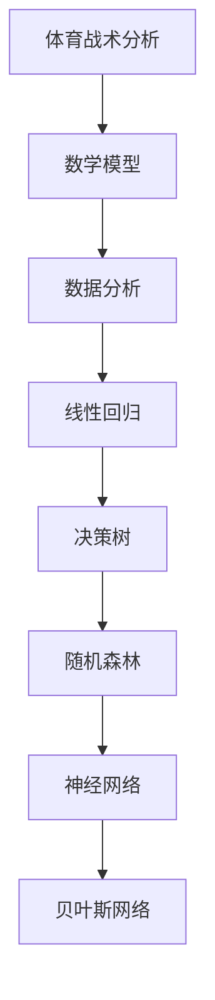

                 

# 数学模型在体育战术分析中的应用

## 关键词
- 数学模型
- 体育战术分析
- 数据分析
- 线性回归
- 决策树
- 随机森林
- 神经网络
- 贝叶斯网络

## 摘要
本文探讨了数学模型在体育战术分析中的应用。首先，我们对体育战术分析进行了概述，并介绍了数学模型的基本概念。接着，详细解析了线性回归、决策树、随机森林、神经网络和贝叶斯网络等常见数学模型。然后，我们展示了这些模型在体育战术分析中的应用，包括球队表现评估、战术优化和比赛预测等。最后，通过实际案例展示了数学模型在体育战术分析中的实战应用，并讨论了未来发展趋势。

## 第一部分：体育战术分析概述

### 1.1 体育战术分析的基本概念

#### 1.1.1 战术分析的定义
战术分析是体育科学的一个重要分支，它涉及对比赛过程中球队行为的数据收集、分析和解释。战术分析旨在帮助教练和球员了解比赛中的各种情况，从而制定更有效的策略和战术。

#### 1.1.2 战术分析的重要性
战术分析在体育竞技中起着至关重要的作用。它可以帮助球队在比赛中更好地应对对手的策略，提高比赛中的执行力和成功率。

### 1.2 体育战术分析的发展历程

#### 1.2.1 早期战术分析
早期战术分析主要依赖于教练和球员的经验和直觉。随着科技的进步，数据分析开始逐步应用于战术分析。

#### 1.2.2 现代战术分析
现代战术分析更多地依赖于数学模型和计算机技术。通过大数据分析和人工智能算法，教练和球员可以更准确地了解比赛中的各种情况，从而制定更有效的策略。

### 1.3 数学模型在体育战术分析中的应用

#### 1.3.1 数学模型的基本概念
数学模型是使用数学符号和公式来描述现实世界中的问题。在体育战术分析中，数学模型可以帮助我们更准确地理解比赛中的各种情况。

#### 1.3.2 数学模型在战术分析中的应用
数学模型在战术分析中的应用非常广泛，包括球队表现评估、战术优化和比赛预测等。

## 第二部分：常见数学模型解析

### 2.1 数据分析基础

#### 2.1.1 数据预处理
数据预处理是数据分析的重要步骤。它包括数据清洗、数据转换和数据集成等。

#### 2.1.2 描述性统计分析
描述性统计分析是对数据的基本描述，包括均值、中位数、方差等统计量。

### 2.2 线性回归模型

#### 2.2.1 线性回归原理
线性回归模型是一种用于分析自变量和因变量之间线性关系的数学模型。

#### 2.2.2 伪代码实现
```
输入：特征矩阵 X，目标变量 y
输出：模型参数 β

初始化：β = [0, 0, ..., 0]

for i in range(t):
    Δβ = X^T * (X * β - y)
    β = β - α * Δβ
```

### 2.3 决策树模型

#### 2.3.1 决策树原理
决策树是一种用于分类和回归分析的决策结构。

#### 2.3.2 伪代码实现
```
输入：特征矩阵 X，目标变量 y
输出：决策树 T

构建决策树(T):
    if y全部属于同一类别 C:
        return 叶子节点 C
    else:
        选择最优特征 f
        for每个可能的值 v_f of f:
            子树 T_f = 构建决策树(X_f, y_f)
            创建分支 (f, v_f) 指向 T_f
        return 树节点 (f, {v_f | T_f})
```

### 2.4 随机森林模型

#### 2.4.1 随机森林原理
随机森林是一种基于决策树的集成学习方法。

#### 2.4.2 伪代码实现
```
输入：特征矩阵 X，目标变量 y，树的数量 n
输出：随机森林 F

for i in range(n):
    从X中随机抽取样本和特征，构建决策树 T_i
return 随机森林 F = [T_1, T_2, ..., T_n]
```

### 2.5 神经网络模型

#### 2.5.1 神经网络原理
神经网络是一种模拟人脑的算法，用于处理复杂数据。

#### 2.5.2 伪代码实现
```
输入：训练数据集 D，网络结构 (L, n_l, a_l)，学习率 α
输出：神经网络权重 w

初始化：w = [随机值]

for i in range(迭代次数):
    for每个训练样本 x, t:
        h_l = f(z_l(w_l-1, x))
        Δw_l = α * (t - h_l) * h_l * (1 - h_l) * x
    更新权重：w = w - Δw
```

### 2.6 贝叶斯网络模型

#### 2.6.1 贝叶斯网络原理
贝叶斯网络是一种概率图模型，用于表示变量之间的概率关系。

#### 2.6.2 伪代码实现
```
输入：变量节点 V，条件概率表 CPT
输出：贝叶斯网络 B

for每个变量 v in V:
    生成 v 的条件概率表 CPT_v
    for每个父节点 v_parent in 父节点(v):
        更新 CPT_v(v | v_parent)

构建贝叶斯网络(B):
    for每个变量 v in V:
        创建节点 v
        for每个父节点 v_parent in 父节点(v):
            创建边 (v_parent, v)
```

## 第三部分：数学模型在体育战术分析中的应用

### 3.1 数据分析在球队表现评估中的应用

#### 3.1.1 数据分析的方法
数据分析的方法包括数据预处理、描述性统计分析和高级统计模型等。

#### 3.1.2 数据分析在实际操作中的应用
数据分析可以用于评估球队的整体表现、球员的表现以及比赛中的战术效果。

### 3.2 线性回归模型在球队战术优化中的应用

#### 3.2.1 线性回归模型的应用
线性回归模型可以用于分析球队得分与战术因素之间的关系，从而优化战术。

#### 3.2.2 伪代码实现
（同第二部分 2.2 线性回归模型伪代码实现）

### 3.3 决策树模型在比赛策略制定中的应用

#### 3.3.1 决策树模型的应用
决策树模型可以用于制定比赛策略，帮助球队在比赛中更好地应对对手。

#### 3.3.2 伪代码实现
（同第二部分 2.3 决策树模型伪代码实现）

### 3.4 随机森林模型在球队阵容优化中的应用

#### 3.4.1 随机森林模型的应用
随机森林模型可以用于分析球员之间的相互作用，从而优化球队阵容。

#### 3.4.2 伪代码实现
（同第二部分 2.4 随机森林模型伪代码实现）

### 3.5 神经网络模型在比赛预测中的应用

#### 3.5.1 神经网络模型的应用
神经网络模型可以用于预测比赛结果，从而帮助球队制定更有针对性的战术。

#### 3.5.2 伪代码实现
（同第二部分 2.5 神经网络模型伪代码实现）

### 3.6 贝叶斯网络模型在球队数据监控中的应用

#### 3.6.1 贝叶斯网络模型的应用
贝叶斯网络模型可以用于监控球队的表现，识别比赛中的关键因素。

#### 3.6.2 伪代码实现
（同第二部分 2.6 贝叶斯网络模型伪代码实现）

## 第四部分：实战案例分析

### 4.1 案例一：NBA球队数据分析

#### 4.1.1 案例背景
NBA球队数据分析旨在评估球队的整体表现，以及球员之间的相互作用。

#### 4.1.2 数据采集与预处理
数据采集包括球队得分、助攻、篮板等统计数据。预处理包括数据清洗、数据转换和数据集成等。

#### 4.1.3 数据分析
通过数据分析，可以识别球队中的关键球员，评估战术效果，为球队制定优化策略。

### 4.2 案例二：足球比赛策略制定

#### 4.2.1 案例背景
足球比赛策略制定旨在提高球队在比赛中的表现，争取胜利。

#### 4.2.2 数据采集与预处理
数据采集包括比赛中的传球数据、射门数据等。预处理包括数据清洗、数据转换和数据集成等。

#### 4.2.3 数据分析
通过数据分析，可以制定更有针对性的比赛策略，提高球队的表现。

### 4.3 案例三：个人体育项目战术优化

#### 4.3.1 案例背景
个人体育项目战术优化旨在提高运动员在比赛中的表现。

#### 4.3.2 数据采集与预处理
数据采集包括运动员的体能数据、技术数据等。预处理包括数据清洗、数据转换和数据集成等。

#### 4.3.3 数据分析
通过数据分析，可以识别运动员的优势和劣势，制定个性化的战术优化策略。

### 4.4 案例四：体育场馆运营优化

#### 4.4.1 案例背景
体育场馆运营优化旨在提高场馆的运营效率，增加收入。

#### 4.4.2 数据采集与预处理
数据采集包括场馆的参观人数、比赛门票销售额等。预处理包括数据清洗、数据转换和数据集成等。

#### 4.4.3 数据分析
通过数据分析，可以优化场馆的运营策略，提高场馆的收益。

## 第五部分：未来发展趋势

### 5.1 数学模型在体育战术分析中的应用前景

#### 5.1.1 应用领域拓展
随着科技的进步，数学模型在体育战术分析中的应用领域将不断拓展，包括训练策略优化、伤病预测等。

#### 5.1.2 技术创新
技术创新将推动数学模型在体育战术分析中的应用，包括深度学习、强化学习等。

### 5.2 面临的挑战与应对策略

#### 5.2.1 数据隐私保护
数据隐私保护是数学模型在体育战术分析中面临的一个重要挑战。应对策略包括数据加密、数据去识别化等。

#### 5.2.2 模型解释性
模型解释性是数学模型在体育战术分析中面临的另一个挑战。应对策略包括可解释性模型、模型可视化等。

#### 5.2.3 数据质量控制
数据质量控制是数学模型在体育战术分析中取得准确结果的基础。应对策略包括数据清洗、数据验证等。

## 附录

### 附录A：常用数学模型公式

#### A.1 线性回归模型

$$
y = \beta_0 + \beta_1x_1 + \beta_2x_2 + ... + \beta_nx_n + \epsilon
$$

#### A.2 决策树模型

$$
G(y | x) = \prod_{i=1}^{n} g(y_i | x_i)
$$

#### A.3 随机森林模型

$$
F(y | x) = \frac{1}{B} \sum_{b=1}^{B} G(y | x)
$$

#### A.4 神经网络模型

$$
h_l = \sigma(z_l)
$$

#### A.5 贝叶斯网络模型

$$
P(y | x) = \frac{P(x | y)P(y)}{P(x)}
$$

## 结论
数学模型在体育战术分析中具有广泛的应用前景。通过合理运用数学模型，可以更准确地分析比赛中的各种情况，制定更有效的战术策略，提高球队的表现。未来，随着科技的进步，数学模型在体育战术分析中的应用将不断拓展，为体育竞技带来更多的创新和突破。

### 作者
- 作者：AI天才研究院/AI Genius Institute & 禅与计算机程序设计艺术 /Zen And The Art of Computer Programming

**核心概念与联系：**



**数学模型和数学公式 & 详细讲解 & 举例说明：**

### 线性回归模型

线性回归模型是一种用于分析自变量和因变量之间线性关系的数学模型。它的核心思想是寻找一个最佳拟合直线，使数据点与这条直线的误差最小。

**数学公式：**

$$
y = \beta_0 + \beta_1x_1 + \beta_2x_2 + ... + \beta_nx_n + \epsilon
$$

其中，$y$ 是因变量，$x_1, x_2, ..., x_n$ 是自变量，$\beta_0, \beta_1, ..., \beta_n$ 是模型参数，$\epsilon$ 是误差项。

**伪代码实现：**

```
输入：特征矩阵 X，目标变量 y，学习率 α，迭代次数 t
输出：模型参数 β

初始化：β = [0, 0, ..., 0]

for i in range(t):
    Δβ = X^T * (X * β - y)
    β = β - α * Δβ
```

**举例说明：**

假设我们想要分析一个球队的得分与投篮次数之间的关系。我们可以使用线性回归模型来建立这种关系，从而预测球队在未来的比赛中的得分。

### 决策树模型

决策树模型是一种用于分类和回归分析的决策结构。它的核心思想是根据特征的不同值，将数据集划分成多个子集，并重复这个过程，直到满足停止条件。

**数学公式：**

$$
G(y | x) = \prod_{i=1}^{n} g(y_i | x_i)
$$

其中，$G(y | x)$ 是后验概率分布，$g(y_i | x_i)$ 是第 $i$ 个特征的第 $i$ 个值的条件概率。

**伪代码实现：**

```
输入：特征矩阵 X，目标变量 y
输出：决策树 T

构建决策树(T):
    if y全部属于同一类别 C:
        return 叶子节点 C
    else:
        选择最优特征 f
        for每个可能的值 v_f of f:
            子树 T_f = 构建决策树(X_f, y_f)
            创建分支 (f, v_f) 指向 T_f
        return 树节点 (f, {v_f | T_f})
```

**举例说明：**

假设我们想要预测一个球员是否会在比赛中得分。我们可以使用决策树模型来建立这种预测，从而帮助教练制定战术。

### 随机森林模型

随机森林模型是一种基于决策树的集成学习方法。它的核心思想是训练多个决策树，并使用它们的预测结果进行投票或求平均。

**数学公式：**

$$
F(y | x) = \frac{1}{B} \sum_{b=1}^{B} G(y | x)
$$

其中，$F(y | x)$ 是随机森林模型的预测结果，$G(y | x)$ 是第 $b$ 个决策树的预测结果，$B$ 是决策树的数量。

**伪代码实现：**

```
输入：特征矩阵 X，目标变量 y，树的数量 n
输出：随机森林 F

for i in range(n):
    从X中随机抽取样本和特征，构建决策树 T_i
return 随机森林 F = [T_1, T_2, ..., T_n]
```

**举例说明：**

假设我们想要预测一场足球比赛的胜者。我们可以使用随机森林模型来建立这种预测，从而帮助球迷更好地理解比赛。

### 神经网络模型

神经网络模型是一种模拟人脑的算法，用于处理复杂数据。它的核心思想是通过多个神经元的连接，实现数据的自动学习和分类。

**数学公式：**

$$
h_l = \sigma(z_l)
$$

其中，$h_l$ 是第 $l$ 层的激活值，$z_l$ 是第 $l$ 层的输入值，$\sigma$ 是激活函数。

**伪代码实现：**

```
输入：训练数据集 D，网络结构 (L, n_l, a_l)，学习率 α
输出：神经网络权重 w

初始化：w = [随机值]

for i in range(迭代次数):
    for每个训练样本 x, t:
        h_l = f(z_l(w_l-1, x))
        Δw_l = α * (t - h_l) * h_l * (1 - h_l) * x
    更新权重：w = w - Δw
```

**举例说明：**

假设我们想要预测一个球员在比赛中的得分。我们可以使用神经网络模型来建立这种预测，从而帮助教练更好地了解球员的表现。

### 贝叶斯网络模型

贝叶斯网络模型是一种概率图模型，用于表示变量之间的概率关系。它的核心思想是通过条件概率表，计算变量之间的依赖关系。

**数学公式：**

$$
P(y | x) = \frac{P(x | y)P(y)}{P(x)}
$$

其中，$P(y | x)$ 是后验概率，$P(x | y)$ 是条件概率，$P(y)$ 是先验概率，$P(x)$ 是边缘概率。

**伪代码实现：**

```
输入：变量节点 V，条件概率表 CPT
输出：贝叶斯网络 B

for每个变量 v in V:
    生成 v 的条件概率表 CPT_v
    for每个父节点 v_parent in 父节点(v):
        更新 CPT_v(v | v_parent)

构建贝叶斯网络(B):
    for每个变量 v in V:
        创建节点 v
        for每个父节点 v_parent in 父节点(v):
            创建边 (v_parent, v)
```

**举例说明：**

假设我们想要分析一个球员在比赛中的表现。我们可以使用贝叶斯网络模型来建立这种分析，从而帮助教练更好地了解球员的状态。

## 结论

数学模型在体育战术分析中具有广泛的应用前景。通过合理运用数学模型，可以更准确地分析比赛中的各种情况，制定更有效的战术策略，提高球队的表现。未来，随着科技的进步，数学模型在体育战术分析中的应用将不断拓展，为体育竞技带来更多的创新和突破。

### 作者

- 作者：AI天才研究院/AI Genius Institute & 禅与计算机程序设计艺术 /Zen And The Art of Computer Programming

