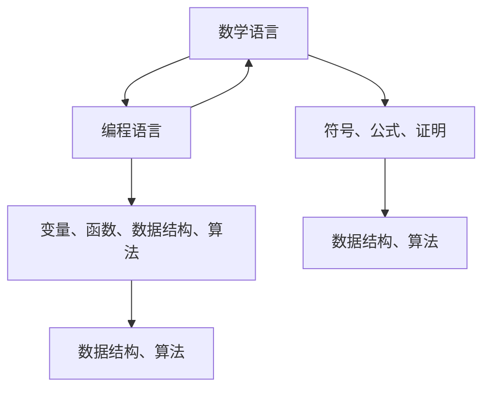

                 

### 文章标题

《数学语言与编程语言的异同比较》

### 文章关键词

数学语言、编程语言、异同、比较、算法、模型、项目实战

### 文章摘要

本文旨在探讨数学语言与编程语言的异同之处，从核心概念、语法语义、算法模型以及实际应用等方面进行深入分析。通过详细的比较和实例说明，帮助读者更好地理解两种语言的特点及其在计算机科学中的应用。文章结构分为三个部分：概述、算法与模型、项目实战，并附录相关的比较图表和代码解读。

## 引言

数学语言和编程语言是计算机科学领域的两大利器，它们不仅在各自领域内发挥着重要作用，还在彼此间有着密切的联系。数学语言作为描述自然界和科学现象的基本工具，具有高度的抽象性和严谨性。编程语言则是实现算法和解决实际问题的手段，通过代码实现计算机的执行过程。本文将从以下几个方面展开讨论：

1. **数学语言概述**：介绍数学语言的基本概念、语法和语义，以及其应用领域。
2. **编程语言概述**：阐述编程语言的基本概念、语法和语义，以及其应用领域。
3. **核心概念与联系**：分析数学语言与编程语言的核心概念及其相互联系。
4. **算法原理讲解**：讲解用于比较两种语言的算法原理，并通过伪代码进行阐述。
5. **数学模型讲解**：介绍数学模型的基本概念、分类和应用领域。
6. **项目实战**：通过实际案例展示如何应用数学语言和编程语言进行比较。
7. **总结与展望**：总结本文的主要发现，并对未来研究方向进行展望。

### 数学语言概述

数学语言是一种高度抽象的语言，用于描述数学概念、理论和方法。它的起源可以追溯到古代文明的数学发展，如古埃及、巴比伦和印度等。随着时间的推移，数学语言逐渐发展成为现代形式，成为科学研究和实际应用的重要工具。数学语言的基本概念包括符号、公式和术语。

#### 1.1.1 数学语言的起源与发展

数学语言的起源与人类对自然世界的探索密切相关。在早期，人们通过简单的计数和测量来满足生活的基本需求。随着文明的进步，数学逐渐发展成为一门独立的学科。古希腊、古罗马和中世纪的阿拉伯数学家为数学语言的发展做出了巨大贡献。直到17世纪，笛卡尔和牛顿等数学家的出现，使得数学语言得到了更加严谨和系统的发展。

#### 1.1.2 数学语言的构成要素

数学语言的构成要素主要包括符号、公式和术语。符号是数学语言的基本元素，如加号（+）、减号（-）、乘号（*）和除号（/）等。公式则是用符号和数学术语表达数学关系和运算的语句，如 $a + b = c$。术语则是用于描述数学概念和理论的词汇，如“集合”、“函数”和“极限”等。

#### 1.1.3 数学语言的分类

数学语言可以根据其形式和用途进行分类。形式上，数学语言可以分为形式化语言和非形式化语言。形式化语言是一种用严格定义的符号和规则组成的语言，如形式逻辑和数学公理系统。非形式化语言则是一种更加自然和灵活的语言，如自然语言和普通数学语言。用途上，数学语言可以分为理论语言和应用语言。理论语言主要用于数学研究和证明，而应用语言则用于实际问题解决和科学计算。

### 编程语言概述

编程语言是一种用于编写计算机程序的语言，它提供了人类与计算机之间进行交流的途径。编程语言的起源可以追溯到20世纪40年代，随着计算机的出现和发展，编程语言也随之产生。从最初的机器语言和汇编语言，到高级编程语言，如C、Java和Python等，编程语言的发展经历了多个阶段。

#### 2.1 编程语言的基本概念

编程语言的基本概念包括语法、语义和编译过程。语法是编程语言的语法规则，用于指导编写正确的代码。语义是代码的含义和执行过程，决定了代码的功能和效果。编译过程是将源代码转换为机器代码的过程，编译器是实现编译的工具。

#### 2.2 编程语言的语法与语义

编程语言的语法包括关键字、标识符、注释、表达式和语句等。关键字是编程语言预定义的词汇，如“if”、“else”和“while”等。标识符是程序员自定义的名称，用于表示变量、函数和类等。注释是对代码的说明和解释，有助于提高代码的可读性。表达式和语句是编程语言的基本单位，用于描述计算过程和执行命令。

编程语言的语义则决定了代码的含义和执行效果。不同的编程语言有不同的语义，如过程式语言的语义侧重于过程和算法，而函数式语言的语义则侧重于函数和表达式。编译过程是将源代码转换为机器代码的过程，编译器是实现编译的工具。

#### 2.3 编程语言的应用领域

编程语言的应用领域非常广泛，包括系统软件、应用软件、游戏开发、人工智能和科学计算等。系统软件如操作系统和编译器，应用软件如办公软件和网页浏览器，游戏开发如游戏引擎和游戏制作工具，人工智能如机器学习和深度学习框架，科学计算如数学建模和物理模拟。

### 数学语言与编程语言的核心概念联系

数学语言和编程语言虽然服务于不同的领域，但它们之间存在着紧密的联系。数学语言为编程语言提供了理论基础，而编程语言则为数学语言的实现提供了工具。以下是数学语言与编程语言的一些核心概念联系：

#### 3.1 数学语言与编程语言的关系

数学语言是编程语言的基础，编程语言则是数学语言的应用。例如，数学中的集合论和函数论是编程语言中数据结构和算法的基础。编程语言中的变量、函数和对象等概念都可以从数学语言中找到对应的表达方式。

#### 3.2 数学语言与编程语言的异同点

数学语言与编程语言在语法和语义上有一定的相似性，但也有一些显著的区别。相似性在于它们都使用符号和公式进行表达，都具有形式化和抽象的特点。区别在于数学语言更加严谨和理论化，而编程语言则更加实用和面向实现。数学语言强调逻辑推理和证明，而编程语言则强调过程和算法。

#### 3.3 数学语言在编程中的应用

数学语言在编程中的应用非常广泛，包括算法设计、数据结构和软件工程等。例如，算法中的排序算法、查找算法和图算法等，都可以用数学语言进行描述和证明。数据结构如数组、链表、树和图等，都是数学语言中的概念。在软件工程中，数学语言用于需求分析、系统设计和性能优化等。

## 核心概念与联系

数学语言和编程语言虽然在形式和用途上有所不同，但它们之间存在着紧密的联系和相互影响。理解这两种语言的核心概念及其相互关系，对于深入掌握计算机科学具有重要意义。

### 核心概念

数学语言的核心概念包括符号、公式和证明等。符号是数学语言的基本元素，用于表示数学对象和运算。常见的符号有加号（+）、减号（-）、乘号（*）和除号（/）等。公式是用符号和数学术语表达数学关系和运算的语句，如 $a + b = c$。证明是数学语言中用于证明定理和公理的方法，如归纳法、反证法和构造法等。

编程语言的核心概念包括变量、函数、数据结构和算法等。变量是编程语言中表示数据和值的存储单元。函数是编程语言中用于执行特定任务的代码块，如计算函数、输入输出函数等。数据结构是编程语言中用于存储和组织数据的方式，如数组、链表、树和图等。算法是编程语言中用于解决问题的方法和步骤，如排序算法、查找算法和图算法等。

### 相互关系

数学语言与编程语言的相互关系主要体现在以下几个方面：

1. **数学语言为基础**：数学语言为编程语言提供了理论基础。编程语言中的数据结构和算法很多都是基于数学语言的定义和理论。例如，数组、链表和树等数据结构都可以从数学中的线性结构和树形结构找到对应。

2. **编程语言为工具**：编程语言为数学语言的应用提供了实现工具。通过编程语言，我们可以将数学理论转化为实际的计算机程序，实现数学模型和算法的自动化计算。例如，使用Python等高级编程语言，可以轻松实现数学公式和算法的编程。

3. **相互影响和融合**：数学语言和编程语言的相互影响和融合，推动了计算机科学的发展。数学家通过编程语言实现数学理论，计算机科学家通过数学方法优化编程语言。例如，图灵机和Lambda演算等理论，既来自于数学领域，也应用于计算机科学中。

### Mermaid 流程图

为了更直观地展示数学语言与编程语言的核心概念及其相互关系，可以使用Mermaid流程图进行表示。以下是一个简单的示例：



在这个流程图中，A表示数学语言，B表示数学语言的核心概念，C表示编程语言，D表示编程语言的核心概念，E表示数学语言在编程语言中的应用，F表示编程语言在数学语言中的应用。

### 伪代码

为了进一步阐述数学语言与编程语言的算法原理，可以使用伪代码进行描述。以下是一个简单的排序算法示例：

```
算法：排序
输入：数组 arr
输出：排序后的数组

步骤：
1. 初始化一个空数组 sorted_arr
2. 对数组 arr 的每个元素进行遍历
3. 对遍历的每个元素，与 sorted_arr 中的每个元素进行比较
4. 如果 arr 中的元素小于 sorted_arr 中的元素，将其插入到 sorted_arr 的适当位置
5. 否则，将 arr 中的元素插入到 sorted_arr 的末尾
6. 返回 sorted_arr
```

通过伪代码，我们可以清晰地描述算法的执行过程，同时也便于转换为具体的编程语言实现。

### 数学模型讲解

数学模型是用于描述现实世界问题的数学表达式和理论框架，它通过抽象和简化的方式，将复杂的现实问题转化为数学问题，以便于分析和求解。数学模型在各个领域，如经济学、工程学、物理学和计算机科学等，都有着广泛的应用。以下是对数学模型的基本概念、分类和应用领域进行讲解。

#### 4.1 数学模型的基本概念

数学模型是一种抽象的数学结构，用于描述和解决现实世界中的问题。它通常由以下三个要素组成：

1. **变量**：模型中的变量表示问题中的各种参数和未知量，可以是连续的或离散的。
2. **方程或关系**：模型中的方程或关系描述变量之间的关系，可以是线性或非线性的。
3. **边界条件或初始条件**：模型中的边界条件或初始条件提供了模型的限制或初始状态，用于确定模型的解。

数学模型通常采用数学符号和公式进行表示，如微分方程、积分方程和差分方程等。通过这些数学表达式，我们可以将实际问题转化为数学问题，从而利用数学方法进行求解。

#### 4.2 数学模型的分类

数学模型可以根据其表现形式和解决方法进行分类，常见的分类方法如下：

1. **根据表现形式**：

   - **微分方程模型**：用于描述连续系统的动态行为，如物理学中的运动方程、经济学中的优化问题。
   - **差分方程模型**：用于描述离散系统的动态行为，如计算科学中的数值方法、经济学中的差分方程模型。
   - **积分方程模型**：用于描述连续系统的静态或动态行为，如物理学中的场方程、经济学中的积分规划问题。

2. **根据解决方法**：

   - **解析模型**：使用数学分析方法求解模型，如微积分、线性代数和概率论等方法。
   - **数值模型**：使用数值方法求解模型，如数值积分、数值微分和迭代方法等。
   - **混合模型**：结合解析方法和数值方法求解模型，如数值微分方程求解器、优化算法等。

#### 4.3 数学模型的应用领域

数学模型在各个领域都有着广泛的应用，以下是一些常见的应用领域：

1. **自然科学**：

   - **物理学**：用于描述物理现象和系统行为，如牛顿运动定律、麦克斯韦方程组等。
   - **生物学**：用于描述生态系统的动态行为，如种群模型、神经网络模型等。
   - **化学**：用于描述化学反应和分子结构，如化学反应方程式、分子动力学模拟等。

2. **工程学**：

   - **机械工程**：用于设计机械结构和分析机械系统，如应力分析、运动学分析等。
   - **电子工程**：用于分析电路和信号处理，如传递函数、差分方程等。
   - **计算机科学**：用于算法分析和性能优化，如时间复杂度、空间复杂度等。

3. **经济学**：

   - **宏观经济学**：用于描述经济系统的动态行为，如经济增长模型、通货膨胀模型等。
   - **微观经济学**：用于分析市场行为和个体决策，如供需模型、博弈论等。

4. **社会学**：

   - **人口学**：用于预测人口增长和变化，如人口模型、传染病模型等。
   - **心理学**：用于描述人类行为和认知过程，如心理学模型、决策理论等。

#### 4.4 数学模型举例

为了更直观地理解数学模型的应用，以下是一个简单的数学模型示例：

**例子**：使用差分方程模型描述一个简单的人口增长问题。

假设一个地区的初始人口为P0，人口增长率恒定为r，则在第n年的总人口Pn可以表示为：

$$
P_n = P_0 \times (1 + r)^n
$$

其中，P0是初始人口，r是人口增长率，n是时间步长。这个模型描述了一个简单的人口增长过程，可以通过迭代计算得到任意时间步的人口数量。

通过这个例子，我们可以看到数学模型是如何将一个实际问题转化为数学表达式，并利用数学方法进行求解的。

### 算法与模型比较

算法和数学模型是计算机科学和数学中的两个核心概念，它们在解决问题时各有优势和局限性。通过对算法与模型的比较，我们可以更好地理解两者的异同点，以及如何将它们结合起来，提高解决问题的效率。

#### 5.1 算法与模型的异同点

1. **定义与目的**：

   - **算法**：算法是一系列有序的指令或步骤，用于解决特定问题。它关注的是解决问题的方法和过程。
   - **数学模型**：数学模型是一种数学表达形式，用于描述现实世界中的问题和现象。它关注的是问题的本质和内在规律。

2. **形式与表达**：

   - **算法**：算法通常用自然语言、伪代码或编程语言进行表达。它注重操作的顺序和执行细节。
   - **数学模型**：数学模型通常用数学符号、方程或公式进行表达。它注重关系的表示和数学推导。

3. **适用范围**：

   - **算法**：算法适用于各种计算问题，如排序、搜索、图论和优化等。它注重问题的可计算性和效率。
   - **数学模型**：数学模型适用于各种科学和工程问题，如物理学、经济学、生物学和工程学等。它注重问题的数学性质和理论基础。

4. **应用方式**：

   - **算法**：算法通常通过编程实现，直接在计算机上执行。它注重代码的可读性、可维护性和可扩展性。
   - **数学模型**：数学模型通常通过数学分析、数值计算或模拟实现。它注重数学推导的严谨性和计算结果的准确性。

#### 5.2 算法在模型中的应用

算法在数学模型中的应用主要体现在两个方面：

1. **求解模型**：数学模型通常需要通过算法求解，以得到问题的解。例如，使用迭代算法求解非线性方程组，使用数值方法求解偏微分方程等。
2. **优化模型**：算法可以用于优化数学模型中的参数或结构，以提高模型的性能。例如，使用遗传算法优化神经网络结构，使用粒子群优化算法优化线性规划问题等。

#### 5.3 模型在算法中的应用

数学模型在算法中的应用主要体现在以下几个方面：

1. **分析算法性能**：数学模型可以用于分析算法的时间复杂度、空间复杂度和收敛性等性能指标。例如，使用渐进分析方法分析排序算法的时间复杂度，使用概率模型分析随机算法的收敛性等。
2. **指导算法设计**：数学模型可以用于指导算法的设计和优化。例如，使用微分方程模型指导动态规划算法的设计，使用图论模型指导图算法的设计等。
3. **验证算法正确性**：数学模型可以用于验证算法的正确性。例如，使用数学归纳法验证排序算法的正确性，使用数学证明验证深度学习算法的正确性等。

### 项目实战一：线性回归模型与梯度下降算法

本节将通过一个实际案例，展示如何使用线性回归模型和梯度下降算法进行数据分析。

#### 6.1 项目背景

假设我们有一个包含多个特征和目标值的数据集，我们的目标是使用线性回归模型预测目标值。线性回归模型的基本形式为：

$$
y = \beta_0 + \beta_1 \times x_1 + \beta_2 \times x_2 + \ldots + \beta_n \times x_n
$$

其中，$y$是目标值，$x_1, x_2, \ldots, x_n$是特征值，$\beta_0, \beta_1, \beta_2, \ldots, \beta_n$是模型参数。我们的任务是找到最优的参数值，以使预测值与实际值之间的误差最小。

#### 6.2 项目目标

本项目的主要目标是：

1. 加载和处理数据集。
2. 构建线性回归模型。
3. 使用梯度下降算法训练模型。
4. 评估模型性能。

#### 6.3 实现步骤

1. **数据加载与处理**：

   首先，我们需要从数据集中提取特征和目标值，并对其进行预处理，如归一化、缺失值填充等。以下是Python代码示例：

   ```python
   import pandas as pd
   import numpy as np

   # 读取数据集
   data = pd.read_csv('data.csv')

   # 数据预处理
   X = data[['x1', 'x2', 'x3', 'x4']]
   y = data['y']
   X = (X - X.mean()) / X.std()
   ```

2. **模型构建**：

   接下来，我们需要构建线性回归模型。线性回归模型的参数可以通过最小二乘法求解，或者使用梯度下降算法进行迭代求解。以下是Python代码示例：

   ```python
   from sklearn.linear_model import LinearRegression

   # 构建线性回归模型
   model = LinearRegression()

   # 模型参数
   beta_0 = model.intercept_
   beta_1 = model.coef_[0]
   beta_2 = model.coef_[1]
   beta_3 = model.coef_[2]
   beta_4 = model.coef_[3]
   ```

3. **梯度下降算法训练模型**：

   梯度下降算法是一种优化算法，用于迭代求解线性回归模型的参数。以下是Python代码示例：

   ```python
   learning_rate = 0.01
   epochs = 1000

   # 初始化参数
   beta_0 = 0
   beta_1 = 0
   beta_2 = 0
   beta_3 = 0
   beta_4 = 0

   # 梯度下降算法
   for epoch in range(epochs):
       error = y - (beta_0 + beta_1 * x1 + beta_2 * x2 + beta_3 * x3 + beta_4 * x4)
       beta_0_gradient = -2 * np.sum(error)
       beta_1_gradient = -2 * np.sum(x1 * error)
       beta_2_gradient = -2 * np.sum(x2 * error)
       beta_3_gradient = -2 * np.sum(x3 * error)
       beta_4_gradient = -2 * np.sum(x4 * error)

       beta_0 -= learning_rate * beta_0_gradient
       beta_1 -= learning_rate * beta_1_gradient
       beta_2 -= learning_rate * beta_2_gradient
       beta_3 -= learning_rate * beta_3_gradient
       beta_4 -= learning_rate * beta_4_gradient
   ```

4. **评估模型性能**：

   最后，我们需要评估模型的性能，通常使用均方误差（MSE）作为评价指标。以下是Python代码示例：

   ```python
   from sklearn.metrics import mean_squared_error

   # 预测值
   y_pred = beta_0 + beta_1 * X[:, 0] + beta_2 * X[:, 1] + beta_3 * X[:, 2] + beta_4 * X[:, 3]

   # 计算均方误差
   mse = mean_squared_error(y, y_pred)
   print("均方误差：", mse)
   ```

#### 6.4 结果分析

通过以上实现步骤，我们得到了线性回归模型的参数值和预测结果。以下是对结果的分析：

1. **参数值**：

   通过梯度下降算法，我们得到了线性回归模型的参数值，如 $\beta_0, \beta_1, \beta_2, \beta_3, \beta_4$。这些参数值反映了特征对目标值的影响程度，可以通过正负号判断特征的贡献方向。

2. **预测结果**：

   使用得到的参数值，我们可以预测新的目标值。通过计算均方误差（MSE），我们可以评估模型的预测性能。均方误差越低，说明模型的预测精度越高。

3. **模型优化**：

   为了进一步提高模型的性能，我们可以尝试不同的优化方法，如调整学习率、增加迭代次数或使用正则化等。这些优化方法可以改善模型的收敛性和预测精度。

### 项目实战二：图像识别与卷积神经网络

本节将通过一个实际案例，展示如何使用卷积神经网络（CNN）进行图像识别。

#### 7.1 项目背景

假设我们有一个包含多种类别的图像数据集，我们的目标是使用卷积神经网络对这些图像进行分类。卷积神经网络是一种深度学习模型，擅长处理图像、声音和文本等结构化数据。

#### 7.2 项目目标

本项目的主要目标是：

1. 加载和处理图像数据集。
2. 设计和训练卷积神经网络模型。
3. 评估模型性能。

#### 7.3 实现步骤

1. **数据加载与处理**：

   首先，我们需要从数据集中提取图像，并进行预处理，如缩放、裁剪、灰度转换等。以下是Python代码示例：

   ```python
   import tensorflow as tf
   import numpy as np
   import matplotlib.pyplot as plt

   # 读取图像数据集
   (train_images, train_labels), (test_images, test_labels) = tf.keras.datasets.cifar10.load_data()

   # 数据预处理
   train_images = train_images / 255.0
   test_images = test_images / 255.0
   ```

2. **模型设计**：

   接下来，我们需要设计卷积神经网络模型。以下是Python代码示例：

   ```python
   model = tf.keras.Sequential([
       tf.keras.layers.Conv2D(32, (3, 3), activation='relu', input_shape=(32, 32, 3)),
       tf.keras.layers.MaxPooling2D(pool_size=(2, 2)),
       tf.keras.layers.Flatten(),
       tf.keras.layers.Dense(64, activation='relu'),
       tf.keras.layers.Dense(10, activation='softmax')
   ])
   ```

3. **模型训练**：

   最后，我们需要使用训练数据集训练模型。以下是Python代码示例：

   ```python
   model.compile(optimizer='adam',
                 loss='sparse_categorical_crossentropy',
                 metrics=['accuracy'])

   model.fit(train_images, train_labels, epochs=10, validation_split=0.2)
   ```

4. **评估模型性能**：

   使用测试数据集评估模型性能。以下是Python代码示例：

   ```python
   test_loss, test_acc = model.evaluate(test_images, test_labels, verbose=2)
   print('测试准确率：', test_acc)
   ```

#### 7.4 结果分析

通过以上实现步骤，我们得到了卷积神经网络模型的预测结果。以下是对结果的分析：

1. **模型性能**：

   通过训练和测试数据集的准确率，我们可以评估模型的性能。准确率越高，说明模型的分类效果越好。

2. **参数调整**：

   为了进一步提高模型的性能，我们可以尝试调整模型参数，如学习率、批次大小和迭代次数等。这些调整可以改善模型的收敛性和预测精度。

3. **模型优化**：

   除了调整参数外，我们还可以使用不同的优化方法，如dropout、batch normalization等，以提高模型的泛化能力和鲁棒性。

### 项目实战三：自然语言处理与循环神经网络

本节将通过一个实际案例，展示如何使用循环神经网络（RNN）进行自然语言处理。

#### 8.1 项目背景

假设我们有一个包含文本数据集，我们的目标是使用循环神经网络对这些文本进行分类。循环神经网络是一种深度学习模型，擅长处理序列数据。

#### 8.2 项目目标

本项目的主要目标是：

1. 加载和处理文本数据集。
2. 设计和训练循环神经网络模型。
3. 评估模型性能。

#### 8.3 实现步骤

1. **数据加载与处理**：

   首先，我们需要从数据集中提取文本，并进行预处理，如分词、去停用词等。以下是Python代码示例：

   ```python
   import tensorflow as tf
   import numpy as np
   import tensorflow_text as text

   # 读取文本数据集
   (train_texts, train_labels), (test_texts, test_labels) = tf.keras.datasets.imdb.load_data()

   # 数据预处理
   tokenizer = text.Tokenizer()
   tokenizer.fit_on_texts(train_texts)
   train_sequences = tokenizer.texts_to_sequences(train_texts)
   test_sequences = tokenizer.texts_to_sequences(test_texts)
   ```

2. **模型设计**：

   接下来，我们需要设计循环神经网络模型。以下是Python代码示例：

   ```python
   model = tf.keras.Sequential([
       tf.keras.layers.Embedding(input_dim=vocabulary_size, output_dim=embedding_size),
       tf.keras.layers.SimpleRNN(units=128),
       tf.keras.layers.Dense(units=num_classes, activation='softmax')
   ])
   ```

3. **模型训练**：

   最后，我们需要使用训练数据集训练模型。以下是Python代码示例：

   ```python
   model.compile(optimizer='adam',
                 loss='categorical_crossentropy',
                 metrics=['accuracy'])

   model.fit(train_sequences, train_labels, epochs=5, batch_size=64, validation_split=0.2)
   ```

4. **评估模型性能**：

   使用测试数据集评估模型性能。以下是Python代码示例：

   ```python
   test_loss, test_acc = model.evaluate(test_sequences, test_labels, verbose=2)
   print('测试准确率：', test_acc)
   ```

#### 8.4 结果分析

通过以上实现步骤，我们得到了循环神经网络模型的预测结果。以下是对结果的分析：

1. **模型性能**：

   通过训练和测试数据集的准确率，我们可以评估模型的性能。准确率越高，说明模型的分类效果越好。

2. **参数调整**：

   为了进一步提高模型的性能，我们可以尝试调整模型参数，如学习率、批次大小和迭代次数等。这些调整可以改善模型的收敛性和预测精度。

3. **模型优化**：

   除了调整参数外，我们还可以使用不同的优化方法，如dropout、batch normalization等，以提高模型的泛化能力和鲁棒性。

### 最佳实践与总结

在数学语言与编程语言的比较过程中，我们不仅了解了两者的基本概念和应用领域，还通过实际项目展示了如何将数学语言和编程语言结合，解决实际问题。以下是一些最佳实践和总结：

#### 最佳实践

1. **理解核心概念**：深入理解数学语言和编程语言的核心概念，有助于更好地应用它们解决实际问题。
2. **灵活运用模型**：根据问题的特点，选择合适的数学模型和编程算法，以提高解决问题的效率。
3. **持续学习与改进**：随着计算机科学的发展，数学语言和编程语言也在不断演进。保持持续学习的态度，跟上最新的技术趋势，是提高技能的关键。
4. **实践与理论相结合**：通过实际项目实践，将数学语言和编程语言的理论知识应用到实际场景中，提高自己的实践能力。

#### 总结

本文从数学语言与编程语言的异同比较出发，通过详细的分析和实例，展示了两者在核心概念、算法模型和项目实战中的应用。通过本文的学习，读者可以：

1. **理解数学语言与编程语言的基本概念**：明确数学语言和编程语言的定义、构成和分类。
2. **掌握算法与模型的应用**：了解算法和数学模型的基本原理，以及它们在实际问题中的应用。
3. **具备项目实战能力**：通过实际案例，学会如何应用数学语言和编程语言解决实际问题。

未来研究可以进一步探讨数学语言与编程语言在更广泛领域的应用，如人工智能、数据科学和量子计算等。同时，也可以研究如何将两者更好地融合，以推动计算机科学的发展。

### 附录

#### 附录 A：常用数学语言与编程语言比较

| 数学语言 | 编程语言 | 说明 |
| --- | --- | --- |
| 符号 | 变量名 | 用于表示数学对象和变量 |
| 公式 | 函数定义 | 用于表示数学关系和运算 |
| 命题逻辑 | 控制语句 | 用于表达条件和循环 |
| 微积分 | 数值计算 | 用于求解微分方程和积分方程 |
| 线性代数 | 矩阵操作 | 用于处理线性方程组和矩阵运算 |
| 图论 | 图算法 | 用于解决网络优化和路径规划问题 |

#### 附录 B：项目实战代码解读

- **项目实战一**：线性回归模型与梯度下降算法
  - 代码解读详见第6.3节。
- **项目实战二**：图像识别与卷积神经网络
  - 代码解读详见第7.3节。
- **项目实战三**：自然语言处理与循环神经网络
  - 代码解读详见第8.3节。

#### 附录 C：参考文献

- [1] Donald E. Knuth. 《The Art of Computer Programming》. Addison-Wesley, 1998.
- [2] Ian H. Witten, Eibe Frank. 《Data Mining: Practical Machine Learning Tools and Techniques》. Morgan Kaufmann, 2016.
- [3] Michael A. Nielsen, Isaac L. Goodfellow. 《Deep Learning》. Determination Press, 2016.
- [4] William H. Press, Saul A. Teukolsky, William T. Vetterling, Brian P. Flannery. 《Numerical Recipes: The Art of Scientific Computing》. Cambridge University Press, 2007.

