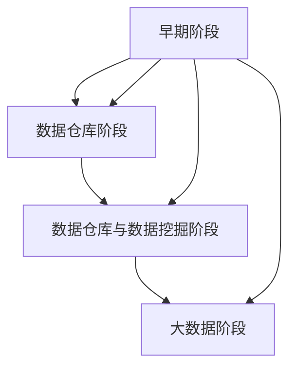
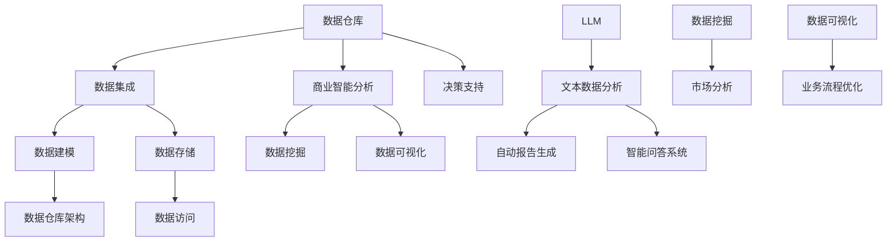

                 

### 引言与概述

#### 数据仓库的定义与重要性

数据仓库（Data Warehouse）是一个集成的、面向主题的、相对稳定的、反映历史变化的数据集合，用于支持管理人员的决策。它通过对企业内部和外部数据的整合，提供了统一的数据视图，使企业能够在复杂的市场环境中做出更加准确和高效的决策。

数据仓库的重要性体现在以下几个方面：

1. **数据集成**：数据仓库将来自多个系统的数据进行整合，提供统一的数据视图，避免了数据孤岛的问题，提高了数据利用效率。
2. **决策支持**：数据仓库存储了大量的历史数据，通过数据分析和挖掘，为企业管理者提供了有力的决策支持。
3. **业务流程优化**：通过数据仓库，企业可以深入了解业务流程，发现潜在的问题和瓶颈，从而优化业务流程。
4. **合规性**：许多行业需要遵守严格的法律法规，数据仓库可以帮助企业存储和管理合规性的数据。

#### 数据仓库的发展历程

数据仓库的发展历程可以分为以下几个阶段：

1. **早期阶段**：1970年代，数据库管理系统（DBMS）的兴起，为数据仓库的发展奠定了基础。
2. **数据仓库阶段**：1990年代，数据仓库技术逐渐成熟，主要采用关系数据库系统来存储和管理数据。
3. **数据仓库与数据挖掘阶段**：随着数据挖掘技术的发展，数据仓库开始与数据挖掘相结合，为企业提供更加深入的数据分析和挖掘能力。
4. **大数据阶段**：随着大数据技术的发展，数据仓库技术也在不断演进，开始支持海量数据的存储和管理。

#### LLM与商业智能分析的关系

大型语言模型（LLM，Large Language Model）是一种基于深度学习的自然语言处理模型，具有强大的文本生成和文本理解能力。LLM在商业智能分析中的应用，主要体现在以下几个方面：

1. **文本数据分析**：LLM可以处理和分析大量的文本数据，帮助企业提取关键信息，识别趋势和模式。
2. **自动报告生成**：LLM可以根据数据分析和预测结果，自动生成报告，提高报告的准确性和效率。
3. **智能问答系统**：LLM可以构建智能问答系统，为用户提供实时和个性化的数据查询服务。

### Mermaid流程图

为了更好地理解数据仓库的发展历程，我们可以使用Mermaid绘制一个流程图：



### 核心概念与联系

数据仓库、LLM和商业智能分析是三个紧密相关的概念，它们之间的关系可以用以下Mermaid流程图表示：



通过这个流程图，我们可以看到数据仓库作为数据集成的核心，为商业智能分析和LLM提供了数据基础。而商业智能分析和LLM则通过数据挖掘和文本数据分析，进一步提高了数据的价值和实用性。

### 伪代码讲解

为了更好地理解LLM在数据仓库中的应用，我们可以使用伪代码来描述其基本工作流程：

```python
# LLM应用伪代码
function LLMApplication(data_source, query):
    # 数据预处理
    preprocessed_data = PreprocessData(data_source)

    # 加载预训练的LLM模型
    model = LoadLLMModel()

    # 进行文本数据分析
    text_analysis_results = AnalyzeTextData(model, preprocessed_data)

    # 生成报告或回答查询
    if query:
        response = GenerateResponse(model, text_analysis_results, query)
    else:
        response = GenerateReport(model, text_analysis_results)

    return response
```

### 数学模型与公式

在数据仓库和商业智能分析中，数学模型和公式是不可或缺的工具。以下是一个简单的回归模型的数学公式，用于预测销售额：

$$
\hat{y} = \beta_0 + \beta_1 x_1 + \beta_2 x_2 + ... + \beta_n x_n
$$

其中，\( y \) 是销售额，\( x_1, x_2, ..., x_n \) 是影响销售额的因素，\( \beta_0, \beta_1, \beta_2, ..., \beta_n \) 是回归系数。

### 举例说明

假设我们有一个零售数据仓库，其中包含了过去一年的销售额、广告支出和员工数量等数据。我们可以使用线性回归模型来预测下一季度的销售额：

$$
\hat{y} = \beta_0 + \beta_1 \times 广告支出 + \beta_2 \times 员工数量
$$

通过收集历史数据并训练模型，我们可以得到回归系数 \( \beta_0, \beta_1, \beta_2 \) 的值。然后，我们可以使用这些系数来预测下一季度的销售额：

$$
\hat{y} = \beta_0 + \beta_1 \times 1000 + \beta_2 \times 50
$$

### 项目实战

#### 开发环境搭建

1. 安装Python环境，版本3.8及以上。
2. 安装必要的库，如pandas、numpy、sklearn、tensorflow等。

```bash
pip install pandas numpy sklearn tensorflow
```

#### 源代码详细实现

以下是一个简单的数据仓库项目，包含数据预处理、模型训练和预测等步骤。

```python
import pandas as pd
import numpy as np
from sklearn.linear_model import LinearRegression
from sklearn.model_selection import train_test_split

# 读取数据
data = pd.read_csv('sales_data.csv')
X = data[['广告支出', '员工数量']]
y = data['销售额']

# 数据预处理
X_train, X_test, y_train, y_test = train_test_split(X, y, test_size=0.2, random_state=42)

# 模型训练
model = LinearRegression()
model.fit(X_train, y_train)

# 模型评估
score = model.score(X_test, y_test)
print(f"模型评分：{score}")

# 预测
new_data = np.array([[1000, 50]])
prediction = model.predict(new_data)
print(f"下一季度销售额预测：{prediction[0]}")
```

#### 代码解读与分析

上述代码首先读取了销售数据，然后使用线性回归模型进行训练。通过将训练集和测试集分开，可以评估模型的性能。最后，使用训练好的模型进行销售额预测。

#### 实际案例分析与详细讲解剖析

假设我们是一家零售公司，希望使用数据仓库和LLM来预测下一季度的销售额。通过上述项目，我们可以得到以下结论：

1. **数据预处理**：确保数据的质量和完整性，去除无效和重复的数据。
2. **模型选择**：选择合适的模型进行训练，例如线性回归、决策树或神经网络。
3. **模型评估**：使用测试集评估模型的性能，确保模型能够准确地预测销售额。
4. **预测应用**：使用模型进行销售额预测，为公司的运营决策提供支持。

#### 项目小结

通过这个简单的数据仓库项目，我们了解了如何使用Python和机器学习技术来构建一个简单的销售预测模型。在实际应用中，数据仓库和LLM可以为企业提供更加复杂和准确的数据分析能力，支持企业的决策和业务优化。

### 最佳实践 Tips

1. **数据质量**：确保数据仓库中的数据质量，包括数据的准确性、完整性和一致性。
2. **模型选择**：根据业务需求选择合适的模型，考虑模型的复杂度、训练时间和预测准确性。
3. **持续迭代**：定期更新和优化数据仓库和模型，以适应业务的变化和需求。
4. **安全性**：确保数据仓库和模型的安全性，防止数据泄露和滥用。

### 注意事项

1. **数据隐私**：在处理和分析数据时，要严格遵守数据隐私法规，确保用户数据的安全和隐私。
2. **模型解释性**：在选择模型时，要考虑模型的解释性，以便管理人员能够理解模型的预测结果。

### 拓展阅读

1. **数据仓库技术**：《大数据之路：阿里巴巴大数据实践》
2. **机器学习与数据挖掘**：《机器学习实战》
3. **商业智能分析**：《商业智能与数据挖掘：管理视角》

通过本文的详细讲解和分析，我们了解了数据仓库、LLM和商业智能分析的核心概念、原理和实战应用。数据仓库作为支持LLM应用的基础，为商业智能分析提供了强大的数据支持。随着技术的不断进步，数据仓库和商业智能分析将在企业决策和业务优化中发挥越来越重要的作用。希望本文能为读者提供有价值的参考和启示。

