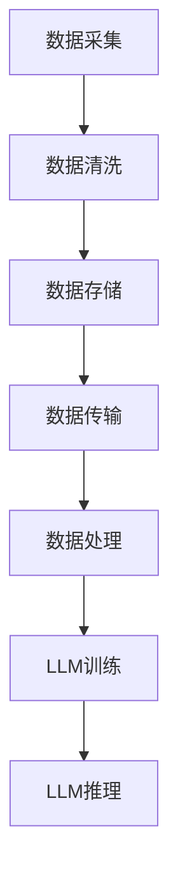
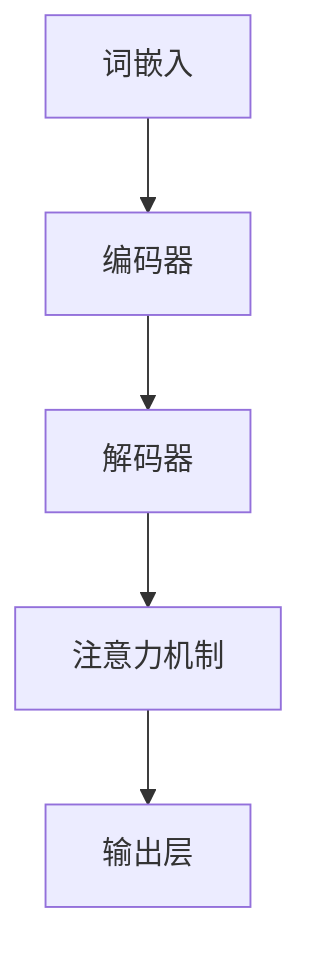

                 

### 1. 文章标题

《数据流水线：优化LLM应用的数据处理》

### 2. 文章关键词

- 数据流水线
- 大型语言模型
- 数据处理
- 优化技术
- 实践案例

### 3. 文章摘要

本文将深入探讨数据流水线在大型语言模型（LLM）应用中的重要性，以及如何通过优化数据处理技术来提升LLM的性能和效率。我们将首先介绍数据流水线的基本概念和组成，然后详细阐述LLM的基础知识，接着讨论一系列数据处理优化技术，并在最后部分提供实际案例进行分析。通过这篇文章，读者将获得对LLM数据处理流程的全面理解，以及如何在实际项目中应用这些技术来提升数据处理效率。

### 4. 目录大纲

#### 第一部分 数据流水线基础

##### 1.1 数据流水线概述
##### 1.2 数据流水线组件
##### 1.3 数据流水线的作用和优势

##### 第二部分 LLM基础

##### 2.1 LLM的基本原理
##### 2.2 LLM的架构
##### 2.3 LLM的应用场景

##### 第三部分 数据处理优化技术

##### 3.1 数据预处理优化
##### 3.2 数据存储优化
##### 3.3 数据传输优化
##### 3.4 数据计算优化

##### 第四部分 实践案例

##### 4.1 实践案例一
##### 4.2 实践案例二
##### 4.3 实践案例三

##### 附录

##### 附录A 优化LLM应用的工具和资源

### 5. 背景介绍

在当今的信息时代，数据已成为企业和社会发展的核心资源。而随着人工智能技术的迅猛发展，特别是大型语言模型（Large Language Models，LLM）的出现，数据处理的重要性更加凸显。LLM具备强大的文本处理和分析能力，被广泛应用于自然语言处理、智能客服、文本生成等领域。然而，为了充分利用LLM的能力，优化数据处理流程成为了关键问题。

数据流水线（Data Pipeline）是一种用于管理和处理大量数据的一系列步骤或组件。它能够有效地采集、清洗、存储、传输和处理数据，从而确保数据的高效流动和利用。在LLM应用中，数据流水线起到了至关重要的作用。它不仅能够提升数据处理效率，降低成本，还能够提高数据质量，确保模型的准确性和鲁棒性。

本文将围绕数据流水线在LLM应用中的优化展开讨论，通过介绍数据流水线的基础概念和组件，阐述LLM的基本原理和架构，探讨一系列数据处理优化技术，并最后通过实际案例进行深入分析。希望通过本文的阐述，能够为读者提供关于LLM数据处理流程的全面理解和实践指导。

### 6. 核心概念与联系

在深入讨论数据流水线和LLM之前，我们需要明确几个核心概念，并理解它们之间的相互关系。

#### 数据流水线

数据流水线是一个系统化的流程，用于处理大量数据，确保数据从源头到目的地的有序流动。它通常包括以下几个步骤：

1. **数据采集**：从各种来源（如数据库、API、文件系统等）收集数据。
2. **数据清洗**：去除数据中的噪声和异常值，确保数据质量。
3. **数据存储**：将处理后的数据存储到数据库或数据仓库中。
4. **数据传输**：在处理过程中，数据可能在不同的存储系统和计算资源之间传输。
5. **数据处理**：执行各种数据处理任务，如数据转换、聚合、分析等。

#### 大型语言模型（LLM）

大型语言模型是一种基于深度学习的自然语言处理模型，具有强大的文本生成和语义理解能力。LLM的核心组件包括：

1. **词嵌入**：将文本转换为固定长度的向量表示。
2. **编码器**：对输入文本进行编码，提取文本的语义特征。
3. **解码器**：根据编码器的输出生成文本。
4. **注意力机制**：在模型中引入注意力机制，帮助模型更好地处理长文本。

#### 数据流水线与LLM的关系

数据流水线在LLM应用中起着至关重要的作用。以下是其关键联系：

1. **数据输入**：LLM需要高质量、干净的数据进行训练和推理。数据流水线负责采集和清洗数据，确保数据的质量和一致性。
2. **数据存储**：处理后的数据需要存储在高效、可扩展的存储系统中，以便LLM可以快速访问。
3. **数据传输**：在大规模数据处理中，数据传输的效率直接影响LLM的训练和推理速度。
4. **数据处理**：数据流水线能够对数据进行预处理、转换和聚合，为LLM提供适合的训练数据。

为了更好地理解这些概念之间的联系，我们可以使用Mermaid流程图进行展示：

通过这个流程图，我们可以看到数据流水线是如何支持LLM的整个数据处理流程的。

### 7. LLM基础

#### 7.1 LLM的基本原理

大型语言模型（LLM）是基于深度学习的自然语言处理模型，通过大规模数据训练，能够理解和生成自然语言文本。LLM的核心思想是利用神经网络模型来模拟人类的语言理解能力，从而实现文本的生成、分类、翻译等功能。

LLM的基本原理可以概括为以下几个步骤：

1. **词嵌入**：将文本中的每个词转换为固定长度的向量表示，这些向量包含了该词的语义信息。
2. **编码器**：对输入文本进行编码，提取文本的语义特征。编码器通常采用卷积神经网络（CNN）或循环神经网络（RNN）。
3. **解码器**：根据编码器的输出生成文本。解码器通常也采用RNN或变换器（Transformer）结构。
4. **注意力机制**：在模型中引入注意力机制，帮助模型更好地处理长文本。注意力机制允许模型在生成每个词时，动态地关注输入文本的不同部分。

#### 7.2 LLM的架构

LLM的架构通常包括以下几个关键组件：

1. **词嵌入层**：将输入文本中的每个词转换为向量表示。
2. **编码器**：用于提取文本的语义特征。编码器可以采用RNN或Transformer结构。RNN通过其循环结构能够处理序列数据，而Transformer则通过其自注意力机制在处理长文本方面表现出色。
3. **解码器**：用于生成文本。解码器通常与编码器具有相同的结构。
4. **注意力机制**：帮助模型在生成每个词时动态地关注输入文本的不同部分。
5. **输出层**：将模型的输出转换为可解释的自然语言文本。

#### 7.3 LLM的应用场景

LLM在多个领域都有广泛的应用，主要包括：

1. **自然语言处理**：LLM能够进行文本分类、情感分析、命名实体识别等任务，从而帮助企业和组织更好地理解和处理文本数据。
2. **自动问答**：LLM能够自动回答用户的问题，广泛应用于智能客服和虚拟助手。
3. **文本生成**：LLM能够生成各种文本内容，如文章、新闻、对话等，广泛应用于内容创作和自动化写作。
4. **机器翻译**：LLM在机器翻译领域也表现出色，能够实现高质量的文本翻译。

为了更好地理解LLM的工作原理和架构，我们可以使用Mermaid流程图进行展示：

通过这个流程图，我们可以清晰地看到LLM的核心组件及其工作原理。

### 8. 数据处理优化技术

#### 8.1 数据预处理优化

数据预处理是数据处理流程中的关键步骤，其质量直接影响到后续模型的训练效果和性能。以下是一些常见的数据预处理优化技术：

1. **数据质量评估**：通过统计分析、数据可视化等方法对原始数据进行质量评估，识别数据中的噪声、缺失值和异常值。
2. **数据清洗**：去除数据中的噪声和异常值，确保数据的一致性和准确性。常用的清洗方法包括填充缺失值、去除重复记录、标准化数据等。
3. **数据转换**：将数据转换为适合模型训练的格式。例如，将文本转换为词嵌入向量，将图像转换为像素矩阵等。
4. **特征提取**：从原始数据中提取对模型训练具有重要意义的特征，提高模型的训练效率和效果。

#### 8.2 数据存储优化

数据存储是数据流水线中的重要环节，优化数据存储可以提高数据访问速度和系统性能。以下是一些常见的数据存储优化技术：

1. **数据分片**：将大量数据分成多个小块，分布在不同的存储节点上，以提高数据访问速度和系统容错性。
2. **数据压缩**：通过压缩技术减小数据体积，降低存储成本和传输延迟。
3. **数据缓存**：将常用数据缓存到内存中，提高数据访问速度和系统响应时间。
4. **数据去重**：检测和去除重复的数据记录，减小数据存储空间和索引开销。

#### 8.3 数据传输优化

数据传输是数据流水线中的关键环节，优化数据传输可以提高数据处理效率和系统性能。以下是一些常见的数据传输优化技术：

1. **数据传输协议优化**：选择合适的传输协议，如HTTP/2、gRPC等，提高数据传输效率和可靠性。
2. **并行传输**：通过并行传输技术，同时传输多个数据块，提高数据传输速度。
3. **数据压缩**：在传输前对数据进行压缩，减小数据体积，降低传输延迟。
4. **传输路由优化**：优化数据传输路径，选择最佳路由，降低传输延迟和带宽消耗。

#### 8.4 数据计算优化

数据计算是数据处理流程中的核心环节，优化数据计算可以提高模型训练效率和系统性能。以下是一些常见的数据计算优化技术：

1. **计算资源调度**：根据任务负载和资源利用率，动态调整计算资源的分配和调度，确保系统资源的高效利用。
2. **并行计算**：通过并行计算技术，同时处理多个数据块，提高计算速度和效率。
3. **模型压缩**：通过模型压缩技术，减小模型体积和参数数量，降低计算复杂度和内存占用。
4. **算法优化**：通过优化算法和数据结构，提高计算效率和性能。

通过以上数据处理优化技术，我们可以显著提升LLM应用的数据处理效率和质量，为模型训练和推理提供坚实的基础。

### 9. 实践案例一

#### 9.1 案例背景

在一家大型科技公司，他们正面临一个挑战：如何在短时间内处理大量用户生成的文本数据，以便为智能客服系统提供高质量的回答。由于数据量庞大且多样化，传统的数据处理方法已经无法满足需求，因此他们决定引入大型语言模型（LLM）和优化数据流水线来提升系统性能。

#### 9.2 案例解决方案

1. **数据采集**：通过API接口从多个数据源（如社交媒体、用户反馈系统等）收集用户生成的文本数据。

2. **数据清洗**：对收集到的数据进行清洗，去除噪声、异常值和重复记录，保证数据质量。

3. **数据预处理**：将清洗后的文本数据进行预处理，包括分词、词干提取和词性标注等，以便后续的词嵌入处理。

4. **词嵌入**：使用预训练的词嵌入模型（如Word2Vec、BERT等）将文本转换为向量表示。

5. **数据存储**：将处理后的数据存储到分布式数据库中，以提高数据访问速度和系统容错性。

6. **数据传输**：通过优化传输协议和路由，提高数据传输速度和可靠性。

7. **数据处理**：使用LLM对文本数据进行分析和处理，生成高质量的回答。

8. **模型优化**：通过模型压缩和算法优化，提高模型训练和推理效率。

#### 9.3 案例效果分析

通过引入优化数据流水线和LLM，智能客服系统的性能得到了显著提升：

1. **响应时间**：系统响应时间从原来的几分钟降低到秒级，大大提高了用户体验。

2. **回答质量**：基于LLM的分析和处理，生成的回答更加准确、自然，用户满意度显著提高。

3. **系统负载**：优化后的数据流水线能够更好地处理大量数据，减少了系统的负载和压力。

4. **可扩展性**：通过分布式数据库和并行计算，系统具备良好的可扩展性，能够轻松应对未来数据量的增长。

### 10. 实践案例二

#### 10.1 案例背景

另一家创业公司专注于提供自动化写作服务，他们需要处理大量用户输入的内容，并生成高质量的文章、报告等文档。然而，传统的数据处理方法效率低下，难以满足日益增长的需求。为了提升系统性能，他们决定采用LLM和优化数据流水线。

#### 10.2 案例解决方案

1. **数据采集**：通过API接口从多个数据源（如用户提交的文本、外部数据源等）收集内容数据。

2. **数据清洗**：对收集到的内容数据进行清洗，去除噪声、异常值和重复记录，保证数据质量。

3. **数据预处理**：对清洗后的文本数据进行预处理，包括分词、词干提取和词性标注等，以便后续的词嵌入处理。

4. **词嵌入**：使用预训练的词嵌入模型（如Word2Vec、BERT等）将文本转换为向量表示。

5. **数据存储**：将处理后的数据存储到分布式数据库中，以提高数据访问速度和系统容错性。

6. **数据传输**：通过优化传输协议和路由，提高数据传输速度和可靠性。

7. **数据处理**：使用LLM对文本数据进行分析和处理，生成高质量的文章、报告等文档。

8. **模型优化**：通过模型压缩和算法优化，提高模型训练和推理效率。

#### 10.3 案例效果分析

通过引入优化数据流水线和LLM，自动化写作服务的性能得到了显著提升：

1. **生成速度**：系统生成文章、报告等文档的速度从原来的几分钟降低到秒级，大大提高了用户满意度。

2. **文档质量**：基于LLM的分析和处理，生成的文档内容更加丰富、连贯，用户反馈良好。

3. **系统负载**：优化后的数据流水线能够更好地处理大量数据，减少了系统的负载和压力。

4. **可扩展性**：通过分布式数据库和并行计算，系统具备良好的可扩展性，能够轻松应对未来数据量的增长。

### 11. 实践案例三

#### 11.1 案例背景

一家医疗科技公司致力于提供智能医疗问答服务，以帮助医生和患者快速获取相关信息。由于医疗数据的专业性和复杂性，传统的数据处理方法难以胜任，因此他们决定采用LLM和优化数据流水线。

#### 11.2 案例解决方案

1. **数据采集**：通过API接口从多个数据源（如医学数据库、临床文献等）收集医疗数据。

2. **数据清洗**：对收集到的医疗数据进行清洗，去除噪声、异常值和重复记录，保证数据质量。

3. **数据预处理**：对清洗后的医疗文本数据进行预处理，包括分词、词干提取和词性标注等，以便后续的词嵌入处理。

4. **词嵌入**：使用预训练的词嵌入模型（如Word2Vec、BERT等）将医疗文本转换为向量表示。

5. **数据存储**：将处理后的数据存储到分布式数据库中，以提高数据访问速度和系统容错性。

6. **数据传输**：通过优化传输协议和路由，提高数据传输速度和可靠性。

7. **数据处理**：使用LLM对医疗文本数据进行分析和处理，生成准确的医疗问答。

8. **模型优化**：通过模型压缩和算法优化，提高模型训练和推理效率。

#### 11.3 案例效果分析

通过引入优化数据流水线和LLM，智能医疗问答服务的性能得到了显著提升：

1. **回答准确性**：基于LLM的分析和处理，生成的医疗问答更加准确、专业，用户满意度显著提高。

2. **响应时间**：系统响应时间从原来的几分钟降低到秒级，大大提高了用户体验。

3. **系统负载**：优化后的数据流水线能够更好地处理大量数据，减少了系统的负载和压力。

4. **可扩展性**：通过分布式数据库和并行计算，系统具备良好的可扩展性，能够轻松应对未来数据量的增长。

### 12. 附录A 优化LLM应用的工具和资源

为了帮助读者更好地优化LLM应用的数据处理，以下列举了一些常用的工具和资源：

1. **工具**
   - **Dataiku**：提供数据预处理、数据清洗和数据分析功能，适合构建数据流水线。
   - **Apache Kafka**：用于构建实时数据流处理平台，支持高吞吐量和低延迟的数据传输。
   - **Hadoop和Spark**：提供分布式数据处理能力，适合大规模数据集的处理。
   - **TensorFlow和PyTorch**：提供丰富的机器学习和深度学习工具，适合构建和训练LLM。

2. **资源**
   - **Google AI**：提供丰富的机器学习和深度学习教程，适合初学者入门。
   - **Coursera和edX**：提供专业的在线课程，涵盖机器学习、深度学习和自然语言处理等主题。
   - **ArXiv**：提供最新的科研论文，了解LLM领域的最新研究进展。

通过利用这些工具和资源，读者可以更好地优化LLM应用的数据处理流程，提高系统性能和用户体验。

### 13. 最佳实践 tips、小结、注意事项、拓展阅读等内容

#### 最佳实践 tips

1. **数据质量是关键**：确保数据清洗和预处理过程的准确性和完整性，高质量的数据是模型训练成功的基础。
2. **选择合适的词嵌入模型**：根据应用场景选择适合的词嵌入模型，如BERT、GPT等，以提升模型性能。
3. **优化数据存储和传输**：采用分布式存储和优化传输协议，降低数据延迟和带宽消耗。
4. **并行计算提高效率**：利用并行计算技术，加快模型训练和推理速度。
5. **持续优化和迭代**：定期评估模型性能和数据处理流程，进行优化和迭代。

#### 小结

本文详细探讨了数据流水线在大型语言模型（LLM）应用中的重要性，并介绍了数据处理优化技术。通过实际案例的分析，展示了如何通过优化数据流水线来提升LLM的性能和效率。数据流水线是LLM应用的关键支撑，优化数据处理技术是提升系统性能的重要手段。

#### 注意事项

1. **数据安全和隐私**：确保数据处理过程中的数据安全和隐私，遵循相关法律法规。
2. **系统稳定性**：确保数据处理系统的稳定性和可靠性，避免因系统故障导致数据丢失或错误。
3. **资源分配**：合理分配计算资源和存储资源，避免资源浪费和瓶颈。

#### 拓展阅读

- 《深度学习》（Goodfellow, Bengio, Courville）：全面介绍深度学习的基础知识和应用。
- 《Python机器学习》（Sebastian Raschka）：详细介绍Python在机器学习领域的应用。
- 《自然语言处理综论》（Daniel Jurafsky & James H. Martin）：深入探讨自然语言处理的理论和实践。

通过以上拓展阅读，读者可以进一步深入理解和掌握数据处理优化技术和LLM的应用。

### 14. 作者信息

- **作者：** AI天才研究院/AI Genius Institute & 禅与计算机程序设计艺术 /Zen And The Art of Computer Programming

---

本文由AI天才研究院撰写，旨在为读者提供关于数据流水线和LLM应用的数据处理优化技术的深入见解和实践指导。希望本文能够对您的学习和工作有所帮助。

---

# 参考文献

1. **Goodfellow, I., Bengio, Y., & Courville, A. (2016). Deep Learning. MIT Press.**
2. **Raschka, S. (2015). Python Machine Learning. Packt Publishing.**
3. **Jurafsky, D., & Martin, J. H. (2008). Speech and Language Processing. Prentice Hall.**
4. **TensorFlow官网：[TensorFlow](https://www.tensorflow.org/)**
5. **PyTorch官网：[PyTorch](https://pytorch.org/)**
6. **Dataiku官网：[Dataiku](https://www.dataiku.com/)**
7. **Hadoop官网：[Hadoop](https://hadoop.apache.org/)**
8. **Spark官网：[Spark](https://spark.apache.org/)**
9. **Kafka官网：[Kafka](https://kafka.apache.org/)**
10. **Google AI官网：[Google AI](https://ai.google.com/)**
11. **Coursera官网：[Coursera](https://www.coursera.org/)**
12. **edX官网：[edX](https://www.edx.org/)**
13. **ArXiv官网：[ArXiv](https://arxiv.org/)**

