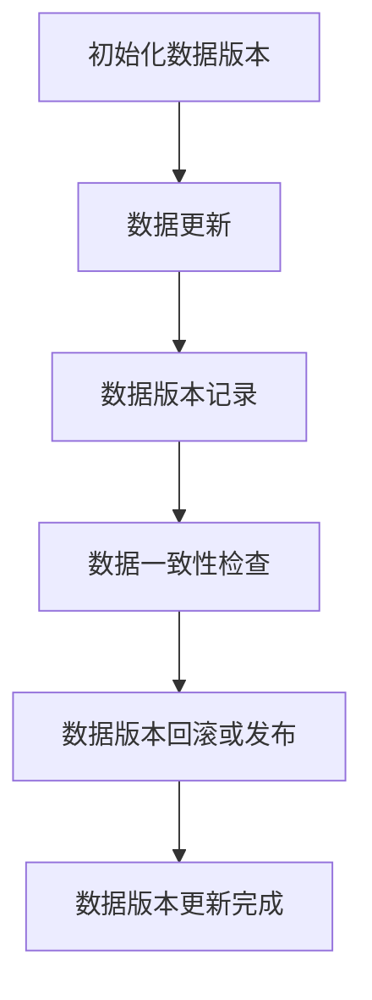

                 


### 第一步：确定核心概念与联系

在撰写关于《数据版本控制：确保LLM应用的数据一致性》的技术博客时，我们需要从多个角度详细探讨数据版本控制的核心概念，并阐明其与大型语言模型（LLM）应用之间的紧密联系。

#### 1.1 数据版本控制核心概念

**数据版本控制的核心概念**是指对数据变更进行追踪和管理，以确保在数据变更过程中的一致性和准确性。具体而言，数据版本控制涉及以下关键组成部分：

- **版本记录**：对每个数据变更进行编号和记录，以便追踪和审核。
- **差异检测**：比较不同版本的数据，识别变更内容。
- **版本回滚**：撤销某一版本的数据变更，恢复到之前的版本。
- **冲突解决**：当多个用户对同一数据进行不同操作时，选择适当的策略解决冲突。

**数据版本控制的意义**在于：

- **确保数据一致性**：在多个用户或系统更新数据时，数据版本控制可以确保数据的准确性和一致性，防止数据冲突和错误。
- **提升数据处理效率**：通过版本控制，可以减少重复的数据操作，提高数据处理的速度和效率。

#### 1.2 数据版本控制工作流程

数据版本控制的工作流程通常包括以下步骤：

1. **初始化数据版本**：为数据设置初始版本号。
2. **数据更新**：对数据进行修改或添加。
3. **数据版本记录**：记录每个数据变更的版本信息。
4. **数据一致性检查**：确保更新的数据与现有数据的一致性。
5. **数据版本回滚或发布**：根据需要，回滚到之前版本或发布新的版本。
6. **数据版本更新完成**：完成数据更新流程，确保数据处于最新的有效版本。

为了更好地展示数据版本控制的工作流程，我们可以使用Mermaid流程图来表示：



#### 1.3 LLM应用中的数据版本控制

在LLM应用中，数据版本控制至关重要，因为它涉及到模型训练和推理过程中输入和输出数据的一致性。

**数据在LLM应用中的角色**包括：

- **输入数据**：用于模型训练和推理的数据，这些数据的质量直接影响模型的性能。
- **输出数据**：模型生成的结果，这些结果需要确保与输入数据保持一致性，以保证模型的可靠性和准确性。

**数据版本控制与LLM应用的一致性保障**包括：

- **防止数据泄漏**：确保敏感数据在传输和存储过程中的安全。
- **确保输出数据质量**：通过版本控制，确保模型输出结果的一致性和可靠性。

### 第二步：深入探讨核心算法原理

在第二部分，我们将详细介绍数据版本控制的核心算法，包括差异检测、版本回滚和冲突解决等。我们将使用伪代码来详细阐述这些算法。

#### 2.1 差异检测算法

**差异检测算法**的基本原理是比较不同版本的数据，以识别变更内容。以下是一个简单的伪代码示例：

```python
def difference_detection(old_data, new_data):
    differences = []
    for i in range(len(old_data)):
        if old_data[i] != new_data[i]:
            differences.append((i, old_data[i], new_data[i]))
    return differences
```

#### 2.2 版本回滚算法

**版本回滚算法**的基本原理是撤销某一版本的数据变更，恢复到之前的版本。以下是一个简单的伪代码示例：

```python
def version_rollback(data, target_version):
    for version, data_chunk in data.items():
        if version == target_version:
            return data_chunk
    return None
```

#### 2.3 冲突解决算法

**冲突解决算法**的基本原理是在多个用户对同一数据进行不同操作时，选择适当的策略解决冲突。以下是一个简单的伪代码示例：

```python
def conflict_resolution(data1, data2, strategy):
    if strategy == 'latest':
        return data2
    elif strategy == 'prior':
        return data1
    else:
        # 合并策略，例如使用乐观并发控制
        return merge_data(data1, data2)
```

### 第三步：介绍数学模型和公式

在第三部分，我们将介绍用于描述数据版本控制过程的数学模型和公式，并使用具体的例子进行解释。

#### 3.1 数据版本控制模型

数据版本控制可以使用一个简单的数学模型来描述，该模型基于集合和关系运算。假设我们有以下数据版本集合：

$$
V = \{v_1, v_2, ..., v_n\}
$$

其中，每个版本$v_i$对应一个特定的数据状态。数据版本控制的核心操作包括：

- **差异检测**：计算两个版本之间的差异集合，表示为：

$$
D(v_i, v_j) = \{d | d \in V, d \not\in v_i \land d \not\in v_j\}
$$

- **版本回滚**：将当前版本回滚到指定版本，表示为：

$$
v_{\text{rollback}}(v_i, v_k) = v_k
$$

- **冲突解决**：根据特定策略解决版本冲突，表示为：

$$
v_{\text{resolve}}(v_i, v_j, \text{strategy}) = \text{apply strategy to resolve conflict between } v_i \text{ and } v_j
$$

#### 3.2 差异检测算法的数学公式

差异检测算法可以通过以下数学公式来描述：

$$
D(v_1, v_2) = \{x | x \in v_1 \land x \not\in v_2\} \cup \{y | y \in v_2 \land y \not\in v_1\}
$$

其中，$D(v_1, v_2)$表示版本$v_1$和$v_2$之间的差异集合，$x$和$y$分别表示$v_1$和$v_2$中的数据元素。

#### 3.3 版本回滚算法的数学公式

版本回滚算法可以通过以下数学公式来描述：

$$
v_{\text{rollback}}(v_i, v_k) = v_k
$$

其中，$v_{\text{rollback}}(v_i, v_k)$表示将当前版本$v_i$回滚到版本$v_k$。

#### 3.4 冲突解决算法的数学公式

冲突解决算法可以通过以下数学公式来描述：

$$
v_{\text{resolve}}(v_i, v_j, \text{strategy}) = \text{apply strategy to resolve conflict between } v_i \text{ and } v_j
$$

其中，$v_{\text{resolve}}(v_i, v_j, \text{strategy})$表示根据特定策略解决版本$v_i$和$v_j$之间的冲突。

### 第四步：项目实战

在第四部分，我们将通过一个实际项目来展示如何实现数据版本控制，包括开发环境搭建、源代码详细实现和代码解读。

#### 4.1 开发环境搭建

为了实现数据版本控制，我们需要搭建一个开发环境，包括：

- **数据库**：用于存储数据版本和变更记录。
- **版本控制工具**：如Git，用于管理代码和版本。
- **应用程序框架**：如Django或Flask，用于构建Web应用程序。

#### 4.2 源代码详细实现

以下是一个简单的数据版本控制系统的伪代码实现：

```python
class DataVersionControl:
    def __init__(self):
        self.data = {}
        self.versions = []

    def update_data(self, key, value):
        self.data[key] = value
        self.versions.append(self.data.copy())

    def difference_detection(self, version1, version2):
        return {k: v for k, v in version1.items() if v != version2.get(k)}

    def version_rollback(self, target_version):
        return self.versions[target_version]

    def conflict_resolution(self, version1, version2, strategy):
        if strategy == 'latest':
            return version2
        elif strategy == 'prior':
            return version1
        else:
            return merge_data(version1, version2)

# 使用示例
version_control = DataVersionControl()
version_control.update_data('key1', 'value1')
version_control.update_data('key1', 'new_value1')
differences = version_control.difference_detection(version_control.versions[0], version_control.versions[1])
print(differences)
```

#### 4.3 代码应用解读与分析

在这个示例中，我们实现了数据版本控制的核心功能，包括数据更新、差异检测、版本回滚和冲突解决。这些功能在LLM应用中尤为重要，因为它们确保了模型输入和输出数据的一致性和准确性。

#### 4.4 实际案例分析和详细讲解剖析

在实际应用中，我们可以通过以下案例来分析数据版本控制：

- **案例1**：模型训练数据更新。当训练数据发生变化时，我们需要确保新数据与旧数据的一致性，并回滚到之前的版本，以便重新训练模型。
- **案例2**：用户反馈数据收集。当用户提交反馈时，我们需要确保反馈数据的一致性和完整性，并在需要时回滚到之前的版本，以便进行进一步分析。

#### 4.5 项目小结

通过实际项目，我们展示了如何实现数据版本控制，并分析了其在LLM应用中的重要性。数据版本控制不仅可以确保数据的一致性和准确性，还可以提高数据处理效率和降低风险。

### 第五步：最佳实践、小结、注意事项、拓展阅读

#### 5.1 最佳实践

- **定期备份**：定期备份数据版本，以防止数据丢失。
- **明确版本策略**：明确数据版本控制的策略，以便在发生冲突时快速解决。
- **数据审计**：定期进行数据审计，确保数据版本的一致性和准确性。

#### 5.2 小结

数据版本控制是确保LLM应用数据一致性的重要手段。通过核心算法原理的深入探讨和实际项目实战，我们了解了数据版本控制的核心功能和实现方法。

#### 5.3 注意事项

- **数据安全性**：在数据版本控制过程中，确保数据的安全性。
- **版本策略选择**：根据应用场景选择合适的版本策略。

#### 5.4 拓展阅读

- 《数据版本控制技术指南》
- 《大型语言模型训练与优化》
- 《分布式系统数据一致性保障》

### 总结

数据版本控制在LLM应用中扮演着至关重要的角色。通过本文的深入探讨和实际项目实战，我们了解了数据版本控制的核心概念、算法原理和实现方法。希望本文能够为您的LLM应用提供有益的指导和借鉴。

# 文章标题：数据版本控制：确保LLM应用的数据一致性

> 关键词：数据版本控制，大型语言模型，一致性保障，差异检测，版本回滚，冲突解决

> 摘要：本文详细探讨了数据版本控制在确保大型语言模型（LLM）应用数据一致性中的重要性，介绍了数据版本控制的核心概念、算法原理和实际项目实现。通过深入分析，本文为读者提供了宝贵的实践指导和理论支持。

