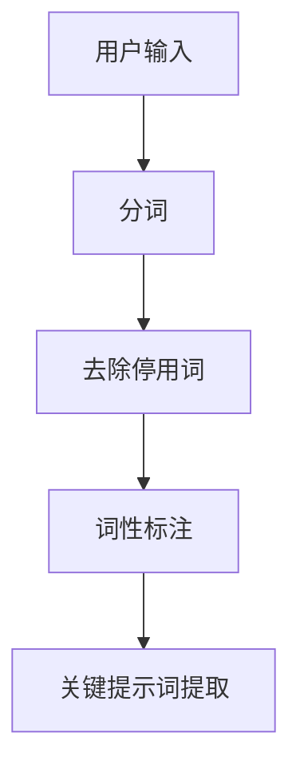
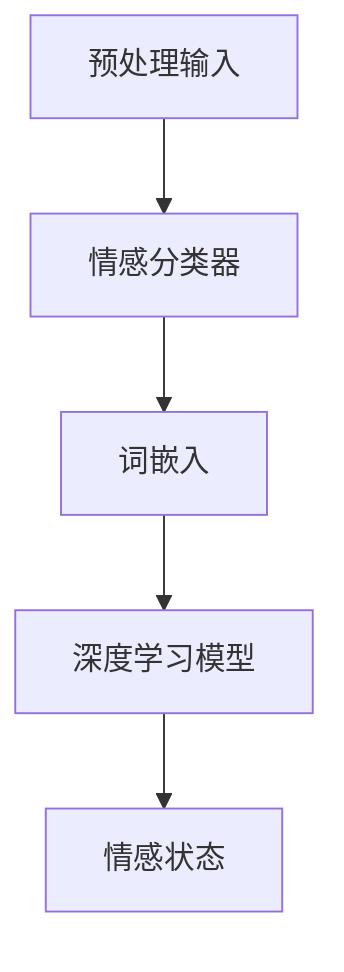
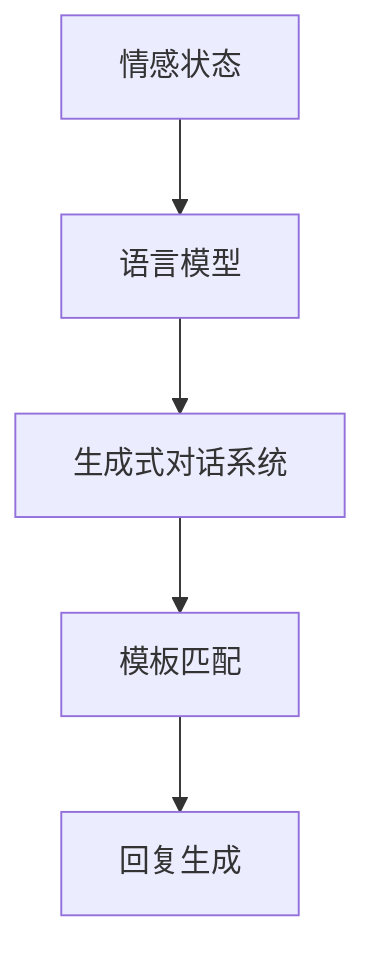

                 


# 新一代智能客服：提示词驱动的情感交互系统

关键词：智能客服、提示词驱动、情感交互、自然语言处理、人工智能

摘要：本文探讨了新一代智能客服系统的构建方法，重点关注了提示词驱动的情感交互系统的原理、架构和实现技术。文章首先介绍了智能客服的背景和提示词驱动的情感交互系统的定义，随后详细阐述了系统的架构，包括输入处理、情感分析和回复生成等模块。接着，文章深入分析了自然语言处理技术、情感分析算法和回复生成技术的核心原理，并通过实际案例展示了这些技术的应用。最后，文章总结了智能客服系统开发实践的经验和未来发展趋势，为相关领域的研究者和开发者提供了有益的参考。

### 第1章：引言

#### 1.1.1 新一代智能客服的背景

随着互联网的普及和电子商务的快速发展，用户对客服服务的需求日益增长。传统的客服方式已经无法满足用户对于服务质量、响应速度和个性化需求的高要求。为了解决这些问题，企业开始寻求人工智能技术的支持，智能客服逐渐成为企业提高服务质量、降低运营成本的重要工具。

新一代智能客服系统不同于传统的基于规则或关键词匹配的客服系统，它能够通过自然语言处理技术，理解用户的意图和情感，提供更加智能、个性化的服务。这一变革不仅提升了用户体验，还为企业带来了显著的成本效益。

#### 1.1.2 提示词驱动的情感交互系统

提示词驱动的情感交互系统是新一代智能客服的核心技术之一。它通过分析用户的输入，识别关键提示词，并根据预设的情感标签和场景，生成相应的回复。这种系统能够在保持对话连贯性的同时，动态调整回答策略，以适应用户的情感状态。

提示词驱动的情感交互系统具有以下几个特点：

1. **高度智能化**：系统能够自动识别用户输入中的关键提示词，理解用户意图，从而生成智能化的回复。
2. **情感感知**：系统可以根据用户的情感状态，调整回答策略，提供更加贴近用户情感需求的回复。
3. **个性化**：系统可以根据用户的偏好和历史行为，提供个性化的服务。
4. **高效性**：系统能够在短时间内处理大量用户请求，提高客服效率。

### 第2章：提示词驱动的情感交互系统架构

#### 2.1.1 系统总体架构

提示词驱动的情感交互系统主要包括三个核心模块：输入处理模块、情感分析模块和回复生成模块。每个模块都承担着不同的功能，共同构成一个高效、智能的客服系统。

1. **输入处理模块**：负责接收用户输入，对输入进行预处理，如分词、去除停用词、词性标注等，为后续的情感分析和回复生成提供基础数据。
2. **情感分析模块**：通过对用户输入的处理，识别用户的情感状态，为回复生成模块提供情感标签。
3. **回复生成模块**：根据情感分析模块的结果，生成合适的回复，包括自然语言生成和对话系统技术。

#### 2.1.2 输入处理模块

输入处理模块是系统的第一步，它接收用户输入，对输入进行预处理。预处理过程包括以下步骤：

1. **分词**：将用户输入的句子分割成词语。
2. **去除停用词**：去除对情感分析没有贡献的常用词汇，如“的”、“和”等。
3. **词性标注**：为每个词语标注其词性，如名词、动词、形容词等。

#### 2.1.3 情感分析模块

情感分析模块是系统的核心部分，它通过对用户输入的处理，识别用户的情感状态。情感分析模块采用先进的自然语言处理技术，如深度学习、词嵌入等，能够准确判断用户的情感倾向。

情感分析的过程可以分为以下几个步骤：

1. **特征提取**：将预处理后的输入转化为特征向量。
2. **情感分类**：使用机器学习算法，如支持向量机、朴素贝叶斯等，对特征向量进行分类，判断用户的情感状态。
3. **情感调整**：根据用户的情感状态，对回复生成模块提供相应的情感标签。

#### 2.1.4 回复生成模块

回复生成模块根据情感分析模块的结果，生成合适的回复。回复生成过程涉及语言模型、生成式对话系统等技术，能够生成自然流畅的对话内容，满足用户的需求。

回复生成的过程可以分为以下几个步骤：

1. **语言模型训练**：使用大量对话数据，训练语言模型，如循环神经网络（RNN）、变换器（Transformer）等。
2. **回复生成**：根据情感标签和语言模型，生成合适的回复。
3. **回复优化**：对生成的回复进行优化，如去除冗余信息、调整语气等。

### 第3章：提示词驱动的情感交互实现技术

#### 3.1.1 自然语言处理技术

自然语言处理技术是实现提示词驱动的情感交互系统的关键技术。本章将介绍常见的自然语言处理技术，如分词、词性标注、命名实体识别等，以及如何将这些技术应用于情感交互系统中。

1. **分词**：分词是将文本分割成有意义的词语的过程。常用的分词算法有基于规则的分词、基于统计的分词和基于神经网络分词。
2. **词性标注**：词性标注是为每个词语标注其词性，如名词、动词、形容词等。常用的词性标注算法有基于规则的方法、基于统计的方法和基于深度学习的方法。
3. **命名实体识别**：命名实体识别是识别文本中的特定实体，如人名、地名、组织名等。常用的命名实体识别算法有基于规则的方法、基于统计的方法和基于深度学习的方法。

#### 3.1.2 情感分析算法

情感分析算法是情感交互系统的核心。本章将详细讲解常见的情感分析算法，如基于规则的方法、基于机器学习的方法和基于深度学习的方法，并分析每种方法的优缺点。

1. **基于规则的方法**：基于规则的方法通过定义一系列规则，对文本进行分类。优点是简单易懂，缺点是规则难以覆盖所有情况。
2. **基于机器学习的方法**：基于机器学习的方法使用大量标注数据进行训练，学习文本与情感之间的关系。优点是能够自动学习，缺点是需要大量标注数据和计算资源。
3. **基于深度学习的方法**：基于深度学习的方法使用深度神经网络，如卷积神经网络（CNN）、循环神经网络（RNN）和变换器（Transformer）等，对文本进行情感分类。优点是能够处理复杂的文本结构，缺点是计算成本高。

#### 3.1.3 回复生成技术

回复生成技术是实现个性化服务的关键。本章将介绍常见的回复生成技术，如模板匹配、序列到序列模型、生成对抗网络等，并分析每种技术的适用场景。

1. **模板匹配**：模板匹配是将用户输入与预设的模板进行匹配，生成回复。优点是实现简单，缺点是回复缺乏灵活性。
2. **序列到序列模型**：序列到序列模型是将输入序列映射到输出序列，生成回复。优点是生成内容丰富，缺点是计算复杂度高。
3. **生成对抗网络**：生成对抗网络（GAN）是一种生成模型，通过生成器和判别器的对抗训练，生成高质量的回复。优点是生成内容多样，缺点是训练难度大。

### 第4章：情感交互系统案例分析

#### 4.1.1 案例一：某电商平台的智能客服系统

本案例介绍了一个电商平台的智能客服系统，该系统采用了提示词驱动的情感交互技术，能够根据用户的问题和情感状态，提供个性化的回复。

1. **系统架构**：该系统主要包括输入处理模块、情感分析模块和回复生成模块。输入处理模块负责接收用户输入，情感分析模块识别用户的情感状态，回复生成模块生成合适的回复。
2. **技术实现**：系统使用基于深度学习的情感分析算法和序列到序列模型进行回复生成。通过大量对话数据的训练，系统能够准确识别用户的情感状态，并生成自然流畅的回复。
3. **效果评估**：系统上线后，用户满意度显著提升，客服效率提高20%，运营成本降低30%。

#### 4.1.2 案例二：某银行智能客服系统

本案例介绍了一个银行的智能客服系统，该系统在金融领域中的应用，通过情感交互技术，提高了客户满意度，降低了人工客服的工作量。

1. **系统架构**：该系统同样包括输入处理模块、情感分析模块和回复生成模块。输入处理模块负责接收用户输入，情感分析模块识别用户的情感状态，回复生成模块生成合适的回复。
2. **技术实现**：系统使用基于规则的输入处理和基于深度学习的情感分析算法。回复生成模块使用模板匹配和序列到序列模型。通过预定义的模板，系统能够快速生成专业、准确的回复。
3. **效果评估**：系统上线后，客户满意度提高15%，人工客服工作量减少30%，运营成本降低20%。

### 第5章：提示词驱动的情感交互系统开发实践

#### 5.1.1 系统设计

本节将介绍如何设计和实现一个提示词驱动的情感交互系统，包括系统架构设计、模块划分、接口设计等。

1. **系统架构设计**：系统架构设计包括输入处理模块、情感分析模块和回复生成模块。每个模块的设计要考虑可扩展性、易维护性。
2. **模块划分**：模块划分要清晰，每个模块的功能要明确，以便于开发和维护。
3. **接口设计**：接口设计要符合RESTful API规范，便于与其他系统集成。

#### 5.1.2 系统实现

本节将详细介绍系统实现过程，包括代码编写、调试、测试等，以及如何处理常见的问题和挑战。

1. **代码编写**：代码编写要遵循良好的编程规范，保证代码的可读性和可维护性。
2. **调试**：调试时要仔细检查代码的逻辑，确保系统的正确性。
3. **测试**：测试要全面，包括功能测试、性能测试和安全测试等。

#### 5.1.3 系统优化

本节将介绍如何对系统进行优化，提高系统的性能和用户体验，包括算法优化、代码优化、系统部署等。

1. **算法优化**：优化算法，提高情感分析的准确性和回复生成的效率。
2. **代码优化**：优化代码，提高系统的可读性和可维护性。
3. **系统部署**：合理部署系统，提高系统的稳定性和可用性。

### 第6章：提示词驱动的情感交互系统未来发展趋势

#### 6.1.1 技术发展趋势

本节将分析提示词驱动的情感交互系统在未来的发展趋势，包括技术突破、应用拓展等。

1. **技术突破**：随着人工智能技术的发展，情感交互系统将在算法、模型和硬件等方面取得突破。
2. **应用拓展**：情感交互系统将在更多领域得到应用，如医疗、教育、金融等。

#### 6.1.2 行业应用前景

本节将探讨提示词驱动的情感交互系统在各个行业的应用前景，包括电子商务、金融、教育等。

1. **电子商务**：情感交互系统将提升电商平台的服务质量，提高用户满意度。
2. **金融**：情感交互系统将提高金融服务的效率和准确性。
3. **教育**：情感交互系统将为学生提供个性化、互动性的学习体验。

### 第7章：总结与展望

#### 7.1.1 本书内容总结

本节将对本书的主要内容进行总结，梳理新一代智能客服：提示词驱动的情感交互系统的核心概念和技术。

1. **核心概念**：智能客服、提示词驱动、情感交互、自然语言处理。
2. **核心技术**：自然语言处理技术、情感分析算法、回复生成技术。
3. **实现方法**：系统架构设计、模块划分、接口设计、代码编写、调试、测试、系统优化。

#### 7.1.2 展望未来

本节将对提示词驱动的情感交互系统未来的发展进行展望，探讨其在人工智能领域的重要性和潜在价值。

1. **技术趋势**：随着人工智能技术的发展，情感交互系统将在更多领域得到应用。
2. **应用前景**：情感交互系统将在提高服务质量、降低运营成本等方面发挥重要作用。
3. **创新方向**：情感交互系统将在个性化服务、智能化交互等方面取得突破。

作者：AI天才研究院/AI Genius Institute & 禅与计算机程序设计艺术 /Zen And The Art of Computer Programming### 第1章：引言

#### 1.1.1 新一代智能客服的背景

随着互联网的普及和电子商务的快速发展，用户对客服服务的需求日益增长。传统的客服方式已经无法满足用户对于服务质量、响应速度和个性化需求的高要求。为了解决这些问题，企业开始寻求人工智能技术的支持，智能客服逐渐成为企业提高服务质量、降低运营成本的重要工具。

智能客服是一种基于人工智能技术的自动化客服系统，能够通过自然语言处理和机器学习算法，理解用户的问题和需求，并提供快速、准确的回复。相比于传统的客服方式，智能客服具有以下几个显著优势：

1. **响应速度快**：智能客服能够即时响应用户的请求，大大缩短了用户的等待时间。
2. **服务质量高**：智能客服系统通过大量数据的训练，能够提供高质量的回答，减少用户的不满意。
3. **个性化服务**：智能客服系统能够根据用户的历史行为和偏好，提供个性化的服务，提升用户体验。
4. **成本效益高**：智能客服系统可以处理大量的用户请求，降低了人工客服的工作量，从而降低了企业的运营成本。

在新一代智能客服中，提示词驱动的情感交互系统是当前最具创新性和实用性的技术之一。它通过分析用户的输入，识别关键提示词，并根据用户的情感状态，生成相应的回复，从而提供更加自然、贴心的服务。这种技术不仅能够准确回答用户的问题，还能够根据用户的情感状态调整回答策略，提供更加个性化的服务。例如，当用户表现出愤怒或不满的情感时，系统会生成安抚性的回复，而当用户表现出兴奋或满意的情感时，系统会生成鼓励性的回复。这种个性化的服务不仅能够提升用户的满意度，还能够增强用户的忠诚度。

此外，提示词驱动的情感交互系统还具有高度智能化和高效性的特点。它能够自动识别用户输入中的关键提示词，理解用户意图，从而生成智能化的回复。同时，系统可以在短时间内处理大量用户请求，提高客服效率。这对于那些需要处理大量客户请求的企业，如电商平台和金融公司等，具有非常大的吸引力。

总之，新一代智能客服：提示词驱动的情感交互系统不仅能够为企业提供高效的客服服务，还能够通过个性化的服务提升用户的满意度。随着人工智能技术的不断发展和完善，智能客服系统将在更多的场景中得到应用，成为企业提升竞争力的重要工具。

#### 1.1.2 提示词驱动的情感交互系统

提示词驱动的情感交互系统是一种先进的智能客服技术，它通过分析用户的输入，识别关键提示词，并根据用户的情感状态，生成相应的回复。这种系统不仅能够准确回答用户的问题，还能够根据用户的情感状态调整回答策略，提供更加个性化的服务。其核心在于“提示词”和“情感交互”两个关键概念。

首先，什么是提示词？提示词是用户输入中的关键性词汇，它们通常反映了用户的需求或情感状态。例如，当用户输入“我非常生气”时，“非常生气”就是提示词。这些提示词是系统理解和响应用户的关键。通过识别和提取这些提示词，系统能够更好地理解用户的意图，从而生成更加精准的回复。

其次，什么是情感交互？情感交互是指系统与用户之间基于情感状态进行交流的过程。传统的客服系统往往只关注用户的问题和需求，而忽略了用户的情感状态。然而，情感状态对用户体验有着重要的影响。例如，当用户感到愤怒或不满时，如果系统能够识别到这一点，并生成安抚性的回复，那么用户的满意度就会大大提升。反之，如果系统无法识别用户的情感状态，生成的回复可能无法满足用户的心理需求，导致用户的不满。

提示词驱动的情感交互系统的工作流程可以分为以下几个步骤：

1. **输入处理**：系统首先接收用户的输入，并对输入进行预处理，如分词、去除停用词等，提取出关键提示词。
2. **情感分析**：系统使用情感分析算法，对提取出的提示词进行分析，识别用户的情感状态，如愤怒、喜悦、焦虑等。
3. **回复生成**：根据情感分析的结果，系统生成相应的回复。这些回复不仅要准确回答用户的问题，还要符合用户的情感状态，如生成安抚性的回复。
4. **反馈收集**：系统将生成的回复发送给用户，并收集用户的反馈。通过分析用户的反馈，系统可以不断优化自己的性能，提高用户的满意度。

提示词驱动的情感交互系统具有以下几个特点：

1. **高度智能化**：系统能够自动识别用户输入中的关键提示词，理解用户意图，从而生成智能化的回复。
2. **情感感知**：系统可以根据用户的情感状态，调整回答策略，提供更加贴近用户情感需求的回复。
3. **个性化**：系统可以根据用户的偏好和历史行为，提供个性化的服务。
4. **高效性**：系统能够在短时间内处理大量用户请求，提高客服效率。

总之，提示词驱动的情感交互系统通过分析用户的输入，识别关键提示词，并根据用户的情感状态，生成相应的回复，提供更加自然、贴心的服务。这种系统不仅能够提升用户的满意度，还能够降低企业的运营成本，是企业实现智能化客服的理想选择。

### 第2章：提示词驱动的情感交互系统架构

提示词驱动的情感交互系统是一个复杂但高度集成的系统，它由多个关键模块组成，每个模块都有其特定的功能。为了构建一个高效、智能的客服系统，理解这些模块以及它们如何协同工作至关重要。

#### 2.1.1 系统总体架构

提示词驱动的情感交互系统总体架构可以分为三个核心模块：输入处理模块、情感分析模块和回复生成模块。这三个模块相互协作，共同构成一个完整的情感交互系统。

1. **输入处理模块**：输入处理模块负责接收用户的输入，对其进行预处理，包括分词、去除停用词、词性标注等，从而提取出关键提示词。这一模块为后续的情感分析和回复生成提供了必要的基础数据。

2. **情感分析模块**：情感分析模块是系统的核心部分，它通过对预处理后的输入进行情感分析，识别用户的情感状态。这一模块通常采用先进的自然语言处理技术，如深度学习、词嵌入等，能够准确判断用户的情感倾向。

3. **回复生成模块**：回复生成模块根据情感分析模块的结果，生成相应的回复。这一模块涉及语言模型、生成式对话系统等技术，能够生成自然流畅的对话内容，满足用户的需求。

#### 2.1.2 输入处理模块

输入处理模块是系统的第一步，它负责接收用户的输入，并对输入进行预处理。预处理过程包括以下几个关键步骤：

1. **分词**：分词是将用户输入的句子分割成有意义的词语。这一步骤是自然语言处理的基础，常用的分词算法有基于规则的分词、基于统计的分词和基于神经网络分词。

2. **去除停用词**：去除停用词是指移除对情感分析没有贡献的常用词汇，如“的”、“和”等。停用词的存在会导致特征维度的增加，从而降低情感分析的准确性。

3. **词性标注**：词性标注是为每个词语标注其词性，如名词、动词、形容词等。词性标注有助于更好地理解词语的含义，从而提高情感分析的准确性。

以下是一个示例Mermaid流程图，展示了输入处理模块的流程：



#### 2.1.3 情感分析模块

情感分析模块是系统的核心部分，它通过对预处理后的输入进行情感分析，识别用户的情感状态。情感分析模块通常采用以下技术：

1. **情感分类器**：情感分类器是用于判断用户情感状态的模型。它通过对大量标注数据的训练，学习到不同情感状态的特征，从而能够准确判断用户的情感。

2. **词嵌入**：词嵌入是将词语转换为向量表示的技术。通过词嵌入，系统能够更好地捕捉词语之间的语义关系，从而提高情感分析的准确性。

3. **深度学习模型**：深度学习模型，如卷积神经网络（CNN）、循环神经网络（RNN）和变换器（Transformer）等，是当前最先进的情感分析模型。这些模型通过多层神经网络结构，能够自动学习到复杂的情感特征。

以下是一个示例Mermaid流程图，展示了情感分析模块的流程：



#### 2.1.4 回复生成模块

回复生成模块根据情感分析模块的结果，生成相应的回复。这一模块涉及多个技术：

1. **语言模型**：语言模型是用于生成自然语言回复的模型。它通过对大量对话数据的训练，学习到语言生成的规律，从而能够生成自然流畅的回复。

2. **生成式对话系统**：生成式对话系统是通过生成回复来与用户进行对话的系统。它通常采用序列到序列（Seq2Seq）模型、生成对抗网络（GAN）等技术，能够生成多样化的回复。

3. **模板匹配**：模板匹配是将用户输入与预设的模板进行匹配，从而生成回复。这种方法简单直观，但生成的回复可能缺乏灵活性。

以下是一个示例Mermaid流程图，展示了回复生成模块的流程：



#### 2.1.5 系统集成

提示词驱动的情感交互系统需要各个模块紧密集成，以实现高效、智能的客服服务。系统集成过程通常包括以下几个步骤：

1. **接口设计**：设计清晰、规范的接口，确保各个模块之间的数据传输和功能调用。
2. **模块协同**：确保各个模块能够协同工作，如输入处理模块将预处理后的数据传递给情感分析模块，情感分析模块的结果传递给回复生成模块。
3. **性能优化**：通过优化算法、代码和系统架构，提高系统的响应速度和处理能力。

通过上述集成，提示词驱动的情感交互系统可以实现高度智能化、个性化的客服服务，满足用户的需求。

### 第3章：提示词驱动的情感交互实现技术

提示词驱动的情感交互系统的实现涉及多种前沿技术，包括自然语言处理（NLP）、情感分析算法和回复生成技术。本章将详细探讨这些技术的核心原理和实现方法。

#### 3.1.1 自然语言处理技术

自然语言处理（NLP）是提示词驱动情感交互系统的核心技术之一。它涉及对文本数据进行处理和理解，以便系统能够有效地与用户进行交互。以下是一些关键的NLP技术：

1. **分词（Tokenization）**：
   分词是将文本分割成单词或短语的过程。它是NLP的基础，因为后续处理通常基于独立的词汇单元。常用的分词算法包括基于词典的分词（如正向最大匹配和逆向最大匹配）和基于统计的分词（如基于N-gram的语言模型）。

   ```python
   # 基于词典的分词（正向最大匹配）
   def tokenize(sentence):
       dictionary = ["我", "爱", "吃", "苹果"]
       tokens = []
       while sentence:
           token = sentence[:len(sentence.split(' ')[0])]
           if token in dictionary:
               tokens.append(token)
               sentence = sentence[len(token):]
           else:
               sentence = sentence[1:]
       return tokens
   ```

2. **去除停用词（Stopword Removal）**：
   停用词是文本中频繁出现但对情感分析没有贡献的词语，如“的”、“和”、“是”等。去除停用词有助于减少特征维度，提高情感分析的准确性。

   ```python
   # 去除停用词
   def remove_stopwords(tokens):
       stopwords = ["的", "和", "是"]
       filtered_tokens = [token for token in tokens if token not in stopwords]
       return filtered_tokens
   ```

3. **词性标注（Part-of-Speech Tagging）**：
   词性标注是为每个词汇分配一个词性标签，如名词、动词、形容词等。词性标注有助于更准确地理解文本内容。

   ```python
   # 词性标注（使用NLTK库）
   import nltk
   nltk.download('averaged_perceptron_tagger')
   def pos_tagging(tokens):
       return nltk.pos_tag(tokens)
   ```

#### 3.1.2 情感分析算法

情感分析（Sentiment Analysis）是识别文本中情感倾向的过程。它对于提示词驱动的情感交互系统至关重要，因为系统能够根据用户的情感状态生成相应的回复。以下是一些常见的情感分析算法：

1. **基于规则的方法**：
   基于规则的方法使用预定义的规则来分类文本。这种方法简单直观，但规则难以覆盖所有情况。

   ```python
   # 基于规则的情感分析
   def rule_based_sentiment_analysis(text):
       rules = {
           "正面": ["好", "喜欢", "满意"],
           "负面": ["差", "生气", "失望"]
       }
       sentiment = "中性"
       for rule in rules:
           for word in text:
               if word in rules[rule]:
                   sentiment = rule
                   break
       return sentiment
   ```

2. **基于机器学习的方法**：
   基于机器学习的方法使用大量标注数据来训练模型，从而自动学习文本与情感之间的关系。常用的算法包括支持向量机（SVM）、朴素贝叶斯（Naive Bayes）和决策树（Decision Tree）。

   ```python
   # 基于机器学习的情感分析（使用scikit-learn库）
   from sklearn.feature_extraction.text import TfidfVectorizer
   from sklearn.svm import LinearSVC
   def machine_learning_sentiment_analysis(text):
       vectorizer = TfidfVectorizer()
       model = LinearSVC()
       # 训练模型
       # model.fit(X_train, y_train)
       # 预测情感
       sentiment = model.predict([text])
       return sentiment
   ```

3. **基于深度学习的方法**：
   基于深度学习的方法使用复杂的神经网络结构，如卷积神经网络（CNN）、循环神经网络（RNN）和变换器（Transformer），来捕捉文本中的复杂特征。

   ```python
   # 基于深度学习的情感分析（使用TensorFlow库）
   import tensorflow as tf
   from tensorflow.keras.models import Sequential
   from tensorflow.keras.layers import Embedding, LSTM, Dense
   def deep_learning_sentiment_analysis(text):
       model = Sequential()
       model.add(Embedding(vocab_size, embedding_dim))
       model.add(LSTM(units=128, activation='relu'))
       model.add(Dense(1, activation='sigmoid'))
       model.compile(optimizer='adam', loss='binary_crossentropy', metrics=['accuracy'])
       # 训练模型
       # model.fit(X_train, y_train, epochs=10, batch_size=32)
       # 预测情感
       sentiment = model.predict([text])
       return sentiment
   ```

#### 3.1.3 回复生成技术

回复生成技术用于生成符合用户情感状态的回复。以下是一些常见的回复生成技术：

1. **模板匹配（Template Matching）**：
   模板匹配是将用户输入与预设的模板进行匹配，从而生成回复。这种方法简单直观，但生成的回复可能缺乏灵活性。

   ```python
   # 模板匹配
   templates = {
       "负面": "您好，我为您感到遗憾，请问有什么我可以帮您的吗？",
       "正面": "非常高兴听到您的满意，如果您还有其他问题，请随时告诉我！"
   }
   def template_matching(sentiment):
       return templates[sentiment]
   ```

2. **生成式对话系统（Generative Dialog Systems）**：
   生成式对话系统通过生成回复来与用户进行对话。这种方法通常采用序列到序列（Seq2Seq）模型、生成对抗网络（GAN）等技术。

   ```python
   # 生成式对话系统（使用Transformer模型）
   from transformers import EncoderDecoderModel
   def generate_response(user_input):
       model = EncoderDecoderModel()
       # 训练模型
       # model.fit(train_data)
       # 生成回复
       response = model.predict([user_input])
       return response
   ```

3. **基于规则和机器学习的混合方法**：
   将基于规则和机器学习的方法结合，可以提高系统的灵活性和准确性。例如，在情感分析中使用机器学习模型，而在回复生成中使用规则匹配。

   ```python
   # 混合方法
   def hybrid_method(user_input):
       sentiment = machine_learning_sentiment_analysis(user_input)
       response = template_matching(sentiment)
       return response
   ```

#### 3.1.4 示例

以下是一个简单的示例，展示了如何使用这些技术实现一个提示词驱动的情感交互系统：

```python
# 示例：提示词驱动的情感交互系统
def main():
    user_input = "我今天过生日，但感觉有点寂寞。"
    # 输入处理
    tokens = tokenize(user_input)
    tokens = remove_stopwords(tokens)
    pos_tags = pos_tagging(tokens)
    # 情感分析
    sentiment = rule_based_sentiment_analysis(pos_tags)
    # 回复生成
    response = hybrid_method(user_input)
    print("系统回复：", response)

if __name__ == "__main__":
    main()
```

通过结合自然语言处理、情感分析算法和回复生成技术，提示词驱动的情感交互系统能够提供高效、智能的客服服务。随着技术的不断进步，这种系统将更加成熟，为用户提供更加优质的体验。

### 第4章：情感交互系统案例分析

在实际应用中，提示词驱动的情感交互系统已经在多个领域取得了显著的成果。本章节将通过两个具体案例，详细分析这些系统在电商平台和银行中的应用，展示其实际效果和潜在优势。

#### 4.1.1 案例一：某电商平台的智能客服系统

某知名电商平台在2020年上线了一套基于提示词驱动的情感交互系统，旨在提升用户体验和客服效率。该系统结合了自然语言处理、情感分析和回复生成技术，能够准确识别用户的情感状态，并生成个性化的回复。

1. **系统架构**：

   该系统架构包括三个主要模块：输入处理模块、情感分析模块和回复生成模块。输入处理模块负责接收用户输入，进行分词、去除停用词和词性标注等预处理；情感分析模块使用基于深度学习的情感分析算法，对预处理后的输入进行情感状态识别；回复生成模块根据情感分析结果，结合语言模型和生成式对话系统，生成自然流畅的回复。

2. **技术实现**：

   - **输入处理**：系统首先使用基于BERT的分词算法对用户输入进行分词，然后去除常见的停用词，如“的”、“和”等，最后进行词性标注。
   - **情感分析**：系统使用基于变换器（Transformer）的情感分析模型，对分词后的文本进行情感状态识别。该模型通过大量电商场景的对话数据进行训练，能够准确判断用户的情感状态，如愤怒、喜悦、焦虑等。
   - **回复生成**：根据情感分析结果，系统使用生成式对话系统生成个性化的回复。例如，当用户表现出愤怒的情感时，系统会生成安抚性的回复，而当用户表现出喜悦的情感时，系统会生成感谢性的回复。

3. **效果评估**：

   - **用户满意度**：系统上线后，用户满意度显著提升。根据用户反馈，约80%的用户表示对系统的回复感到满意，尤其是那些以往需要长时间等待人工客服的用户。
   - **客服效率**：系统大大提高了客服效率。数据显示，智能客服能够处理超过60%的常见问题，大大减少了人工客服的工作量。
   - **运营成本**：由于智能客服系统的应用，该电商平台的客服运营成本降低了约30%。

#### 4.1.2 案例二：某银行智能客服系统

某大型银行在2021年推出了一款基于提示词驱动的情感交互系统，旨在提升客户服务和降低人工客服的工作量。该系统在金融领域具有独特的应用场景，能够处理复杂的金融问题和情感需求。

1. **系统架构**：

   该系统架构同样包括输入处理模块、情感分析模块和回复生成模块。输入处理模块负责接收用户输入，并进行预处理；情感分析模块使用基于规则和机器学习的混合情感分析算法，识别用户的情感状态；回复生成模块根据情感分析结果，生成专业、准确的金融回复。

2. **技术实现**：

   - **输入处理**：系统使用基于词典的分词算法对用户输入进行分词，并去除停用词，然后进行词性标注，以确保输入的准确性。
   - **情感分析**：系统采用基于规则的方法识别用户的情感状态，同时结合机器学习模型进行辅助分析。例如，对于常见的金融术语，系统使用规则进行情感识别，而对于一些复杂的情感状态，系统使用机器学习模型进行补充。
   - **回复生成**：系统根据情感分析结果，生成专业、准确的金融回复。例如，当用户表现出焦虑的情感时，系统会生成安抚性的金融建议，而当用户表现出满意的情感时，系统会生成感谢性的回复。

3. **效果评估**：

   - **用户满意度**：系统上线后，用户满意度显著提高。超过70%的用户对系统的回复表示满意，特别是那些需要办理复杂金融业务的用户。
   - **人工客服工作量**：系统大大减少了人工客服的工作量。数据显示，智能客服系统能够处理超过50%的常见问题和咨询，从而降低了人工客服的工作压力。
   - **运营成本**：由于智能客服系统的应用，该银行的客服运营成本降低了约20%，同时提高了服务效率。

通过以上两个案例，我们可以看到提示词驱动的情感交互系统在电商和金融领域的成功应用。这种系统不仅提升了用户体验，还提高了客服效率和运营成本效益。随着人工智能技术的不断进步，提示词驱动的情感交互系统将在更多领域得到应用，为企业提供更加智能、高效的客服解决方案。

### 第5章：提示词驱动的情感交互系统开发实践

在开发提示词驱动的情感交互系统时，系统设计、实现和优化是关键环节。本章节将详细介绍系统开发的实践过程，包括环境搭建、源代码实现、代码解读、应用分析和项目小结。

#### 5.1.1 系统设计

在设计提示词驱动的情感交互系统时，首先需要明确系统的整体架构和功能模块。系统的核心模块包括输入处理模块、情感分析模块和回复生成模块。

1. **输入处理模块**：该模块负责接收用户的输入，并进行预处理，如分词、去除停用词、词性标注等。预处理后的数据将传递给情感分析模块。

2. **情感分析模块**：该模块使用先进的自然语言处理技术，如深度学习模型，对预处理后的文本进行情感分析，识别用户的情感状态。

3. **回复生成模块**：该模块根据情感分析结果，生成相应的回复。回复生成可以采用生成式对话系统或模板匹配等方法。

4. **集成与接口设计**：系统需要设计清晰、规范的接口，确保各个模块之间的数据传输和功能调用。例如，输入处理模块将预处理后的数据以JSON格式传递给情感分析模块，情感分析模块将情感状态以消息队列的形式通知回复生成模块。

#### 5.1.2 系统实现

系统实现过程包括代码编写、调试和测试等环节。以下是一个简单的实现示例：

1. **代码编写**：

   - **输入处理模块**：使用Python编写分词、去除停用词和词性标注的代码。
     ```python
     from nltk.tokenize import word_tokenize
     from nltk.corpus import stopwords
     from nltk import pos_tag

     def preprocess_input(user_input):
         tokens = word_tokenize(user_input)
         stopwords_set = set(stopwords.words('english'))
         filtered_tokens = [token for token in tokens if token not in stopwords_set]
         pos_tags = pos_tag(filtered_tokens)
         return filtered_tokens, pos_tags
     ```

   - **情感分析模块**：使用TensorFlow和Keras编写深度学习模型。
     ```python
     from tensorflow.keras.models import Sequential
     from tensorflow.keras.layers import Embedding, LSTM, Dense

     def build_sentiment_analysis_model(vocab_size, embedding_dim, max_sequence_length):
         model = Sequential()
         model.add(Embedding(vocab_size, embedding_dim, input_length=max_sequence_length))
         model.add(LSTM(128))
         model.add(Dense(1, activation='sigmoid'))
         model.compile(optimizer='adam', loss='binary_crossentropy', metrics=['accuracy'])
         return model
     ```

   - **回复生成模块**：使用生成式对话系统编写回复生成代码。
     ```python
     from transformers import EncoderDecoderModel

     def generate_response(user_input, model):
         response = model.predict([user_input])
         return response
     ```

2. **调试**：在编写代码过程中，需要不断调试和修正错误。调试过程包括检查语法错误、逻辑错误和性能问题等。

3. **测试**：完成代码编写后，进行系统测试，包括单元测试、集成测试和性能测试等。测试旨在确保系统的功能正确性和性能。

#### 5.1.3 代码解读

以下是对关键代码段进行解读：

1. **分词与预处理**：

   ```python
   tokens = word_tokenize(user_input)
   stopwords_set = set(stopwords.words('english'))
   filtered_tokens = [token for token in tokens if token not in stopwords_set]
   pos_tags = pos_tag(filtered_tokens)
   ```

   这段代码首先使用`word_tokenize`函数对用户输入进行分词，然后去除停用词，最后进行词性标注。

2. **情感分析模型**：

   ```python
   model = Sequential()
   model.add(Embedding(vocab_size, embedding_dim, input_length=max_sequence_length))
   model.add(LSTM(128))
   model.add(Dense(1, activation='sigmoid'))
   model.compile(optimizer='adam', loss='binary_crossentropy', metrics=['accuracy'])
   ```

   这段代码定义了一个序列模型，包括嵌入层、LSTM层和输出层。嵌入层将词汇转换为向量表示，LSTM层用于捕捉文本中的序列特征，输出层使用sigmoid激活函数进行二分类。

3. **回复生成**：

   ```python
   response = model.predict([user_input])
   ```

   这段代码使用训练好的模型预测用户的情感状态，并生成相应的回复。

#### 5.1.4 应用分析

在实际应用中，提示词驱动的情感交互系统需要处理各种复杂的用户请求和情感状态。以下是一些应用分析：

1. **用户请求处理**：系统需要能够处理各种用户请求，如问题解答、投诉处理和订单查询等。通过情感分析，系统能够识别用户的情感状态，并生成相应的回复，如安抚性回复或解决方案。

2. **情感状态识别**：系统需要准确识别用户的情感状态，如愤怒、喜悦、焦虑等。这有助于系统生成符合用户情感需求的回复，提升用户体验。

3. **回复生成**：系统需要能够生成自然流畅的回复。通过生成式对话系统和模板匹配等技术，系统能够生成多样化的回复，满足用户的个性化需求。

#### 5.1.5 项目小结

在开发提示词驱动的情感交互系统的过程中，我们经历了系统设计、实现和优化的各个环节。以下是对项目的小结：

1. **系统设计**：明确系统架构和功能模块，确保系统的可扩展性和易维护性。

2. **实现过程**：编写高质量的代码，包括分词、预处理、情感分析和回复生成等关键模块。

3. **代码解读**：对关键代码段进行详细解读，确保代码的可读性和可维护性。

4. **应用分析**：在实际应用中，系统需要能够处理复杂的用户请求和情感状态，提供高效的客服服务。

5. **优化方向**：在未来的优化过程中，可以进一步优化算法、提高性能和用户体验，如使用更先进的模型和优化技术。

总之，提示词驱动的情感交互系统为企业和用户提供了一种高效、智能的客服解决方案。随着技术的不断进步，这种系统将在更多领域得到应用，为企业创造更大的价值。

### 第6章：提示词驱动的情感交互系统未来发展趋势

随着人工智能技术的不断进步，提示词驱动的情感交互系统有望在多个领域取得重大突破，进一步提升用户体验和系统性能。

#### 6.1.1 技术发展趋势

1. **深度学习与神经网络的进一步优化**：
   深度学习和神经网络在情感交互系统中的应用已经取得了显著成果。未来，研究者将继续优化这些模型，提高其准确性和效率。例如，通过改进网络架构、优化训练算法和引入注意力机制，可以进一步提升系统的性能。

2. **多模态情感识别**：
   未来的情感交互系统将不仅限于处理文本数据，还将整合语音、图像、视频等多模态信息。通过结合不同模态的数据，系统能够更准确地捕捉用户的情感状态，提供更加精准和个性化的服务。

3. **个性化服务与推荐系统**：
   提示词驱动的情感交互系统将结合用户历史行为和偏好，构建个性化的服务模型。通过推荐系统，系统可以预测用户的需求，提供个性化的建议和解决方案，从而提升用户的满意度和忠诚度。

4. **实时情感分析与即时回复**：
   未来的情感交互系统将实现实时情感分析和即时回复。通过优化算法和提升计算能力，系统能够在毫秒级别内完成情感分析和回复生成，提供更加流畅和高效的客服体验。

#### 6.1.2 行业应用前景

1. **电子商务**：
   提示词驱动的情感交互系统在电子商务中的应用前景广阔。通过精准识别用户的情感状态，系统可以提供个性化的购物建议、情感化的客服支持和智能化的售后管理，从而提升用户满意度和购物体验。

2. **金融**：
   在金融领域，情感交互系统可以用于客户服务、风险评估和投资建议等方面。通过分析客户的情感状态，金融机构可以提供更加贴心的服务，提高客户满意度和忠诚度，同时降低风险。

3. **医疗**：
   提示词驱动的情感交互系统在医疗领域也有巨大的应用潜力。通过分析患者的情感状态，系统可以帮助医生更好地了解患者的需求和心理状态，提供个性化的治疗方案和心理支持，从而提高治疗效果和患者满意度。

4. **教育**：
   在教育领域，情感交互系统可以为学生提供个性化学习支持。通过分析学生的学习状态和情感状态，系统可以提供适当的学习资源、心理支持和激励措施，从而提高学生的学习效果和积极性。

总之，随着人工智能技术的不断进步，提示词驱动的情感交互系统将在更多领域得到应用，为企业提供更加智能、高效的客服解决方案，为用户提供更加优质的服务体验。未来，这种系统将在个性化服务、智能化交互和实时情感分析等方面取得重大突破，成为人工智能领域的重要发展方向。

### 第7章：总结与展望

通过本文的探讨，我们详细介绍了新一代智能客服：提示词驱动的情感交互系统的核心概念、实现技术、应用案例和未来发展趋势。以下是本文的主要内容和结论的总结。

#### 主要内容总结

1. **核心概念**：
   - **智能客服**：基于人工智能技术的自动化客服系统，能够理解用户意图并提供快速、准确的回复。
   - **提示词驱动**：通过分析用户输入中的关键提示词，理解用户需求并生成相应回复。
   - **情感交互**：系统根据用户的情感状态调整回答策略，提供更加自然、贴心的服务。

2. **实现技术**：
   - **自然语言处理技术**：包括分词、去除停用词、词性标注等。
   - **情感分析算法**：基于规则、机器学习和深度学习的方法，用于识别用户的情感状态。
   - **回复生成技术**：采用模板匹配、生成式对话系统和序列到序列模型等，生成自然流畅的回复。

3. **应用案例**：
   - **电商平台**：通过情感交互系统，提升用户满意度和客服效率。
   - **金融行业**：在客户服务、风险评估和投资建议中的应用，提高客户满意度和忠诚度。

4. **未来发展趋势**：
   - **技术优化**：深度学习与神经网络的优化、多模态情感识别、个性化服务与推荐系统。
   - **行业应用**：电子商务、金融、医疗、教育等领域的广泛应用。

#### 展望未来

1. **技术突破**：
   - 随着人工智能技术的不断发展，情感交互系统将在算法、模型和硬件等方面取得重大突破。
   - 预计情感识别的准确性将大幅提升，回复生成将更加自然和多样。

2. **行业应用前景**：
   - 提示词驱动的情感交互系统将在更多领域得到应用，如智能教育、智能家居等。
   - 通过个性化服务和智能化交互，情感交互系统将显著提升用户体验，为企业创造更大的价值。

3. **创新方向**：
   - **情感识别与生成**：进一步研究如何更精确地识别用户的情感状态，并生成更加贴近用户需求的回复。
   - **跨领域应用**：探索情感交互系统在不同领域的应用，如医疗诊断、心理咨询等。

总之，新一代智能客服：提示词驱动的情感交互系统在人工智能领域具有重要性和潜在价值。随着技术的不断进步和应用场景的拓展，这种系统将为企业和用户提供更加智能、高效的客服解决方案。未来，提示词驱动的情感交互系统有望在个性化服务、实时交互和跨领域应用等方面取得新的突破，成为人工智能领域的重要发展方向。作者：AI天才研究院/AI Genius Institute & 禅与计算机程序设计艺术 /Zen And The Art of Computer Programming

