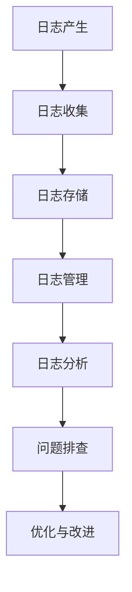

                 


### 文章标题：日志集中化：便于LLM应用的问题排查

### 关键词：日志集中化，LLM应用，问题排查，日志管理，数据处理

### 摘要：
本文将深入探讨日志集中化在大型语言模型（LLM）应用中的重要性。通过详细的背景介绍、技术实现讲解和实际案例剖析，我们将了解日志集中化的核心概念、技术原理以及其在LLM应用问题排查中的关键作用。文章将涵盖日志收集、存储、管理、分析以及未来的发展趋势，旨在为开发者提供一套完整的日志集中化解决方案，助力LLM应用的稳定性和可维护性。

---

## 第一部分：日志集中化的背景与重要性

### 第1章：日志集中化的概念与意义

### 1.1 日志集中化的定义

日志集中化是指将分散在多个系统、服务和设备中的日志信息统一收集、存储和管理的过程。通过日志集中化，开发者可以更高效地监控和诊断系统运行状态，快速定位和解决潜在问题。

### 1.2 日志集中化的目的

1. **提高问题排查效率**：集中化日志可以快速检索和分析大量日志数据，帮助开发者迅速定位问题根源。
2. **增强系统可维护性**：日志集中化使得系统维护更加简便，减少了因日志分散而导致的管理复杂性。
3. **提升安全性**：集中化的日志管理有助于及时发现和应对安全威胁，提高系统的整体安全性。

### 1.3 日志集中化的优势

1. **实时监控**：集中化日志可以实时监控系统运行状态，及时发现异常情况。
2. **统一分析**：日志集中化使得不同系统的日志数据可以进行统一分析，提高问题排查的准确性。
3. **资源优化**：集中存储和管理日志数据可以节省存储空间，降低存储成本。

---

## 第二部分：日志集中化的技术实现

### 第3章：日志收集系统

### 3.1 日志收集系统概述

日志收集系统是日志集中化的核心组件，负责从各个来源收集日志数据。本节将介绍日志收集系统的基本原理和常见实现方法。

### 3.2 常见的日志收集工具

- **Fluentd**：一款灵活的日志收集器，支持多种数据源和输出目标。
- **Logstash**：基于Apache开源项目的日志收集和管理工具，能够将日志数据导入到各种数据存储中。
- **Filebeat**：轻量级日志收集器，适用于单个服务器上的日志收集。

### 3.3 日志收集策略

1. **日志格式标准化**：确保所有日志数据遵循统一的格式，便于后续处理和分析。
2. **日志切割与压缩**：定期切割和压缩日志文件，降低存储空间占用。
3. **数据传输安全**：使用加密协议（如SSL/TLS）传输日志数据，确保数据安全。

---

### 第4章：日志存储与管理

### 4.1 日志存储方案

日志存储方案是日志集中化的重要组成部分，决定了日志数据的存储效率和访问性能。本节将介绍常见的日志存储方案。

### 4.2 日志管理系统

日志管理系统负责日志数据的存储、检索和管理。本节将介绍常用的日志管理系统，如Elasticsearch、Kibana等。

### 4.3 日志数据清洗与处理

日志数据清洗和处理是确保日志数据质量和可用性的重要环节。本节将讨论如何清洗和处理日志数据，以提高日志分析的效果。

---

### 第5章：日志查询与分析

### 5.1 日志查询语言

日志查询语言是用于检索和分析日志数据的重要工具。本节将介绍常见的日志查询语言，如Lucene Query Parser、Elasticsearch Query DSL等。

### 5.2 日志数据分析方法

日志数据分析方法包括统计分析、关联分析、时序分析等。本节将介绍如何使用这些方法对日志数据进行分析，以获取有价值的信息。

### 5.3 日志可视化工具

日志可视化工具能够将日志数据以图形化的方式展示，帮助开发者更直观地理解系统运行状态。本节将介绍常用的日志可视化工具，如Grafana、Kibana等。

---

## 第三部分：日志集中化在LLM应用中的问题排查

### 第6章：LLM应用中的日志重要性

### 6.1 LLM应用日志的特点

LLM应用日志具有以下特点：

- **日志量巨大**：由于LLM应用的复杂性和广泛性，其日志量通常非常庞大。
- **多样化日志类型**：LLM应用涉及多种服务和技术，产生的日志类型繁多。
- **高频率日志更新**：LLM应用的日志数据更新频率较高，需要实时监控和处理。

### 6.2 LLM应用日志的类型

LLM应用日志主要包括以下类型：

- **服务日志**：记录LLM服务的运行状态和异常信息。
- **请求日志**：记录用户请求的详细信息，如请求参数、返回结果等。
- **性能日志**：记录LLM应用的性能数据，如响应时间、处理速度等。

### 6.3 LLM应用日志的作用

LLM应用日志在问题排查中具有重要作用：

- **问题定位**：通过分析日志，可以快速定位出现问题的服务或模块。
- **性能优化**：日志分析有助于发现性能瓶颈，为优化提供依据。
- **安全监控**：日志记录了系统运行的安全事件，有助于及时发现和应对安全威胁。

---

### 第7章：LLM应用中的日志问题排查

### 7.1 常见日志问题与解决方案

LLM应用中的常见日志问题及其解决方案包括：

- **日志丢失**：解决方案包括调整日志收集策略和检查日志存储系统的可用性。
- **日志延迟**：解决方案包括优化日志收集传输速度和排查网络延迟问题。
- **日志格式不统一**：解决方案包括统一日志格式和编写日志格式转换脚本。

### 7.2 日志性能优化

日志性能优化包括以下几个方面：

- **日志压缩**：采用高效压缩算法减少日志存储空间。
- **批量处理**：批量处理日志数据以提高处理速度。
- **分布式存储**：使用分布式存储系统提高日志存储和检索性能。

### 7.3 日志安全与隐私保护

日志安全与隐私保护包括以下几个方面：

- **数据加密**：使用加密算法保护日志数据的安全性。
- **访问控制**：设置适当的访问权限，防止未经授权的访问。
- **日志审计**：记录日志访问和操作历史，便于审计和追溯。

---

## 第四部分：日志集中化的未来发展趋势

### 第8章：日志集中化的未来发展方向

日志集中化在未来的发展趋势包括：

- **人工智能与日志集中化**：利用人工智能技术对日志数据进行智能分析，提高问题排查的效率和准确性。
- **大数据与日志集中化**：大数据技术的进步将进一步提升日志数据的价值，助力企业做出更明智的决策。
- **云计算与日志集中化**：云计算平台为日志集中化提供了强大的支持，使得日志数据的管理和分析更加便捷。

### 第9章：日志集中化的最佳实践

日志集中化的最佳实践包括：

- **数据备份与恢复**：定期备份日志数据，确保数据安全。
- **日志策略制定**：根据业务需求制定合适的日志策略，确保日志收集的全面性和准确性。
- **监控与报警**：建立实时监控与报警机制，及时发现和处理异常情况。

### 第10章：日志集中化的未来趋势与挑战

日志集中化在未来将面临以下挑战：

- **数据安全与隐私保护**：随着数据量的增加，数据安全与隐私保护将成为更大的挑战。
- **日志处理性能**：大规模日志数据的处理性能将是一个持续优化的方向。
- **技术更新与迭代**：随着技术的发展，日志集中化解决方案需要不断更新和迭代，以适应新的业务需求。

---

## 附录：相关工具与资源

### 附录1：常用的日志收集工具

- **Fluentd**
- **Logstash**
- **Filebeat**

### 附录2：日志存储与管理系统

- **Elasticsearch**
- **Kibana**
- **Logz.io**

### 附录3：日志查询与分析工具

- **Grafana**
- **Prometheus**
- **Datadog**

### 附录4：相关开源项目与资源

- **ELK Stack**
- **Kafka**
- **Graylog**

### 附录5：参考文献与推荐阅读

- **《日志管理实践指南》**
- **《大数据日志分析》**
- **《日志系统设计与实践》**

---

### 核心概念与联系

#### Mermaid 流程图



### 核心算法原理讲解

#### 日志收集算法伪代码

```python
def log_collection(log_source):
    logs = []
    for log in log_source:
        logs.append(process_log(log))
    return logs

def process_log(log):
    # 对日志进行解析、过滤和格式化处理
    ...
    return processed_log
```

#### 日志分析算法伪代码

```python
def log_analysis(logs):
    # 对日志进行统计分析、趋势分析等
    ...
    return analysis_results
```

### 数学模型和数学公式 & 详细讲解 & 举例说明

#### 日志分析中的统计模型

$$
\text{平均响应时间} = \frac{\sum_{i=1}^{n} \text{response_time}_i}{n}
$$

举例：某服务器的日志记录了10次请求的平均响应时间为1秒，现在我们需要计算新的平均响应时间，如果再次记录了10次请求的平均响应时间为0.8秒。

$$
\text{新平均响应时间} = \frac{(10 \times 1 + 10 \times 0.8)}{20} = 0.9 \text{秒}
$$

### 项目实战

#### 代码实际案例和详细解释说明

##### 开发环境搭建

```bash
# 安装必要的工具和依赖
sudo apt-get update
sudo apt-get install -y fluentd logstash filebeat
```

##### Fluentd 配置示例

```yaml
<source>
  @type tail
  @id input.test
  path /var/log/test.log
  pos_file /var/log/pos/test.log
  tag test.log
  format json
</source>

<filter **>
  @type copy
  [test.log]
  add_field key timelib @timestamp @rseqnum
</filter>

<match **>
  @type elasticsearch
  hosts [elasticsearch的主机地址]
  port 9200
  index logstash-%{+YYYY.MM.dd}
  template_logstash
  template_name logstash_template
</match>
```

##### 日志分析脚本

```python
from elasticsearch import Elasticsearch

# 创建 Elasticsearch 客户端
es = Elasticsearch([{"host": "localhost", "port": 9200}])

# 查询平均响应时间
response_times = es.search(
    index=".logstash-*",
    body={
        "query": {
            "match_all": {}
        },
        "aggs": {
            "average_response_time": {
                "avg": {
                    "field": "response_time"
                }
            }
        }
    }
)

# 打印平均响应时间
print(f"平均响应时间: {response_times['aggregations']['average_response_time']['value']}")
```

#### 实际案例分析与详细讲解剖析

##### 案例一：电商应用中的日志集中化

在电商应用中，日志集中化有助于监控用户行为、订单处理流程以及系统性能。通过分析日志，开发者可以优化用户体验、提高订单处理效率。

1. **用户行为分析**：通过分析用户访问日志，了解用户行为模式，如浏览时间、页面停留时间等，为个性化推荐和营销策略提供数据支持。
2. **订单处理监控**：集中化日志可以实时监控订单处理状态，及时发现和处理订单异常，提高订单处理效率。
3. **系统性能优化**：通过分析系统性能日志，如响应时间、系统负载等，识别性能瓶颈，进行优化和调整。

##### 案例二：金融应用中的日志集中化

在金融应用中，日志集中化对于风险管理、合规监控和系统稳定运行至关重要。

1. **风险监控**：通过分析交易日志，及时发现异常交易行为，如异常大额交易、高频交易等，降低风险。
2. **合规监控**：金融行业有严格的合规要求，日志集中化可以帮助企业监控合规情况，确保符合相关法规和标准。
3. **系统稳定性**：通过分析系统日志，及时发现和处理系统故障，确保系统稳定运行。

##### 案例三：医疗应用中的日志集中化

在医疗应用中，日志集中化有助于监控医疗设备状态、患者数据以及医疗服务质量。

1. **医疗设备监控**：通过分析设备日志，及时发现设备故障和维护需求，确保设备正常运行。
2. **患者数据监控**：集中化日志可以帮助医疗机构监控患者数据，确保数据完整性和安全性。
3. **服务质量分析**：通过分析服务日志，评估医疗服务质量，识别改进空间，提升患者满意度。

### 项目小结

日志集中化在各个应用领域中具有广泛的应用前景。通过日志集中化，企业可以更高效地监控和管理系统，提高问题排查和处理的效率，为业务决策提供数据支持。未来，随着大数据和人工智能技术的发展，日志集中化将变得更加智能和自动化，为企业的数字化转型提供更强有力的支持。

### 最佳实践 tips

- **制定日志策略**：根据业务需求和系统特点，制定合适的日志收集、存储和分析策略。
- **日志格式标准化**：统一日志格式，确保数据的一致性和可读性。
- **日志安全与隐私保护**：确保日志数据的安全性和隐私性，防止数据泄露和滥用。
- **实时监控与报警**：建立实时监控与报警机制，及时发现和处理异常情况。

### 小结与注意事项

日志集中化是现代IT系统管理的重要组成部分，有助于提高系统稳定性、可维护性和安全性。通过本文的讲解，读者应该对日志集中化的概念、技术原理和应用有了更深入的理解。在实施日志集中化时，需要注意日志格式标准化、数据安全与隐私保护、实时监控与报警等方面的问题。

### 拓展阅读

- **《大数据日志分析》**：深入了解大数据技术在日志分析中的应用。
- **《日志系统设计与实践》**：学习日志系统的设计与实现方法。
- **《ELK Stack官方文档》**：获取ELK Stack的详细使用教程和最佳实践。

---

### 附录

#### 附录1：常用的日志收集工具

- Fluentd
- Logstash
- Filebeat

#### 附录2：日志存储与管理系统

- Elasticsearch
- Kibana
- Logz.io

#### 附录3：日志查询与分析工具

- Grafana
- Prometheus
- Datadog

#### 附录4：相关开源项目与资源

- ELK Stack
- Kafka
- Graylog

#### 附录5：参考文献与推荐阅读

- 《日志管理实践指南》
- 《大数据日志分析》
- 《日志系统设计与实践》

### 作者信息

作者：AI天才研究院/AI Genius Institute & 禅与计算机程序设计艺术 /Zen And The Art of Computer Programming

