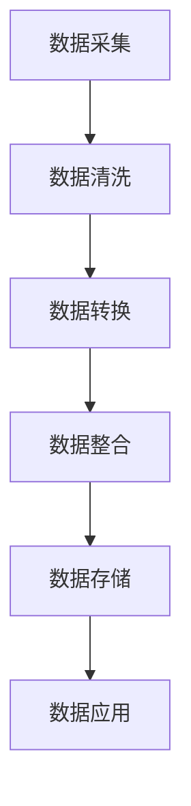
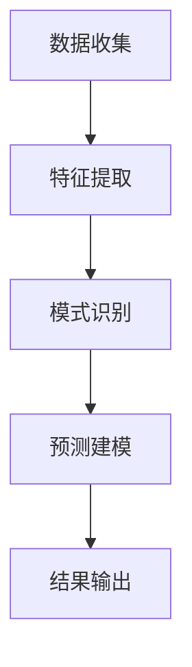
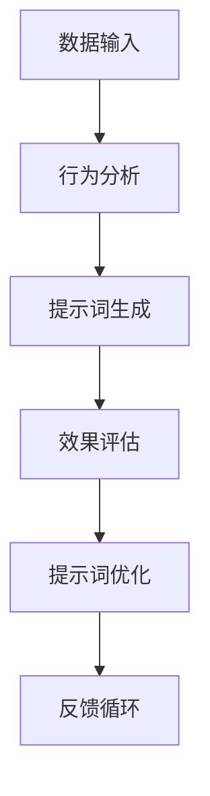
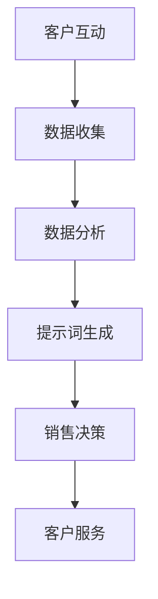
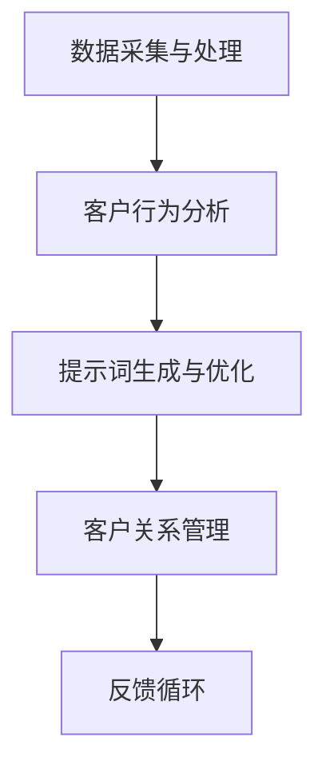
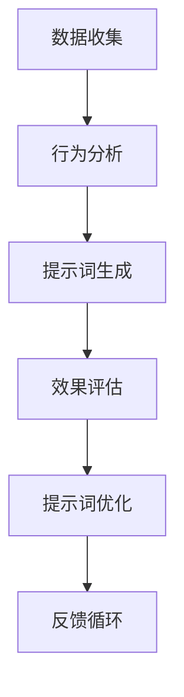

                 

### 文章标题

《智能CRM系统：提示词优化客户关系管理》

### 文章关键词

智能CRM系统、客户关系管理、提示词优化、人工智能、数据分析、算法、机器学习

### 摘要

随着技术的不断进步，智能CRM系统逐渐成为企业提升客户关系管理效率的重要工具。本文将深入探讨智能CRM系统的概念、架构、提示词优化策略及其在实际应用中的效果。通过详细的案例分析、开发与实施流程，以及未来展望，本文旨在为企业和开发者提供全面的技术指南，助力企业实现智能化的客户关系管理。

---

### 1. 分章节设计目录

本文分为六个部分，分别介绍智能CRM系统的背景、架构、提示词优化策略、案例分析、开发与实施流程以及未来展望。具体目录如下：

## 第一部分：基础概念

### 1.1 CRM系统概述

- **1.1.1 CRM系统的起源与发展**
- **1.1.2 CRM系统的核心功能**
- **1.1.3 智能CRM的概念与特点**
- **1.1.4 提示词在CRM中的应用**
- **1.1.5 客户关系管理概述**

### 1.2 智能CRM系统架构

- **1.2.1 数据采集与处理**
- **1.2.2 客户行为分析**
- **1.2.3 提示词生成与优化**
- **1.2.4 客户关系管理**

## 第二部分：提示词优化策略

### 2.1 提示词优化的原理

- **2.1.1 提示词的作用与分类**
- **2.1.2 提示词优化的目标**
- **2.1.3 提示词优化的方法**

### 2.2 实战案例

- **2.2.1 案例一：某公司的提示词优化实践**
- **2.2.2 案例二：另一个行业的提示词优化案例**

## 第三部分：案例分析

### 3.1 案例分析概述

- **3.1.1 案例选择标准**
- **3.1.2 案例分析的目的**

### 3.2 案例一：某大型零售商的智能CRM应用

- **3.2.1 案例背景**
- **3.2.2 智能CRM系统的应用**
- **3.2.3 应用效果评估**

### 3.3 案例二：某互联网公司的客户关系管理优化

- **3.3.1 案例背景**
- **3.3.2 智能CRM系统的应用**
- **3.3.3 应用效果评估**

## 第四部分：开发与实施

### 4.1 智能CRM系统的开发

- **4.1.1 开发流程**
- **4.1.2 技术选型**
- **4.1.3 开发工具与资源**

### 4.2 智能CRM系统的实施

- **4.2.1 实施步骤**
- **4.2.2 实施策略**
- **4.2.3 风险管理**

## 第五部分：未来展望

### 5.1 智能CRM的发展趋势

- **5.1.1 技术创新**
- **5.1.2 行业应用**
- **5.1.3 发展挑战与机遇**

## 第六部分：总结与展望

- **6.1 小结**
- **6.2 拓展阅读**
- **6.3 注意事项**

### 2. 添加说明

在每个部分之后，可以添加一些说明，如：

- **附录**：提供相关的参考资源、工具和技术细节。
- **致谢**：感谢参与编写和提供帮助的人或组织。

---

### 3. 文章内容概要

本文将从以下几个部分对智能CRM系统进行详细探讨：

1. **基础概念**：介绍CRM系统的起源、发展、核心功能，以及智能CRM的概念与特点。探讨提示词在CRM中的应用，以及客户关系管理的流程和目标。

2. **智能CRM系统架构**：分析智能CRM系统的组成部分，包括数据采集与处理、客户行为分析、提示词生成与优化以及客户关系管理。通过Mermaid流程图展示各部分之间的关系。

3. **提示词优化策略**：讨论提示词优化的原理、目标和方法。通过案例分析展示实际中的提示词优化实践。

4. **案例分析**：选择实际案例，分析智能CRM系统的应用效果，评估其对企业客户关系管理的优化程度。

5. **开发与实施**：介绍智能CRM系统的开发流程、技术选型、开发工具与资源，以及实施步骤、策略和风险管理。

6. **未来展望**：探讨智能CRM系统的发展趋势、技术创新、行业应用以及面临的挑战和机遇。

通过以上内容，本文旨在为读者提供一个全面、深入的了解智能CRM系统的视角，帮助企业和开发者更好地理解和应用这一先进技术。

---

接下来，我们将逐步深入每一个章节，详细阐述其内容，确保文章的逻辑性、完整性和专业性。每个章节将包括背景介绍、核心概念与联系、算法原理讲解、案例分析和项目实战等部分，以满足文章字数的要求和完整性需求。在撰写过程中，我们将严格按照markdown格式进行排版，确保文章的可读性和规范性。

---

### 1.1 CRM系统概述

#### 1.1.1 CRM系统的起源与发展

CRM（Customer Relationship Management，客户关系管理）系统起源于20世纪80年代中期，当时主要是为了帮助企业更好地管理客户信息，提高销售效率和客户满意度。CRM系统的概念最早由Gartner Group提出，其主要目的是通过整合企业内外部的信息资源，实现客户信息的集中管理和有效利用。

在CRM系统的发展历程中，可以划分为以下几个阶段：

1. **早期阶段**（1980s - 1990s）：这一阶段主要是以客户数据的电子化处理和存储为主，通过简单的客户信息管理系统来记录和跟踪客户的基本信息。

2. **初步发展阶段**（1990s - 2000s）：随着计算机技术和网络技术的发展，CRM系统开始逐渐成熟，增加了客户互动管理、销售自动化、营销自动化等功能。这一阶段的CRM系统主要是以客户数据管理为核心，帮助企业提高销售和营销效率。

3. **智能化阶段**（2000s - 至今）：随着人工智能、大数据、云计算等技术的发展，CRM系统进入智能化阶段。这一阶段的CRM系统不仅能够处理和分析海量数据，还能通过机器学习和人工智能技术，实现智能化的客户行为预测、个性化推荐、客户关系优化等。

#### 1.1.2 CRM系统的核心功能

CRM系统的核心功能主要包括以下几个方面：

1. **客户信息管理**：CRM系统能够集中存储和管理客户的基本信息，包括联系方式、购买历史、服务记录等，方便企业全面了解客户情况。

2. **销售管理**：CRM系统可以帮助企业实现销售自动化，包括销售机会管理、销售流程管理、销售预测等，提高销售效率。

3. **营销管理**：CRM系统可以协助企业进行营销活动的策划、执行和跟踪，包括邮件营销、社交媒体营销、广告投放等，提升营销效果。

4. **客户服务**：CRM系统可以记录客户服务请求，分配服务任务，跟踪服务进展，提高客户满意度。

5. **数据分析**：CRM系统可以对销售数据、客户数据、营销数据等进行深度分析，帮助企业发现潜在客户、优化销售策略、提升客户关系。

#### 1.1.3 智能CRM的概念与特点

智能CRM（Intelligent CRM）是基于人工智能技术，对传统CRM系统进行升级和优化的一种新型客户关系管理系统。智能CRM的特点主要体现在以下几个方面：

1. **智能化数据分析**：智能CRM系统通过机器学习和大数据分析技术，能够自动识别客户行为模式，预测客户需求，提供个性化服务。

2. **自动化流程管理**：智能CRM系统能够自动化处理销售、营销、客户服务等流程，减少人工干预，提高工作效率。

3. **实时客户互动**：智能CRM系统能够实时收集客户反馈，快速响应客户需求，提高客户满意度。

4. **个性化推荐**：智能CRM系统能够根据客户的历史行为和偏好，提供个性化的产品推荐和服务，提升客户粘性。

5. **跨渠道集成**：智能CRM系统能够整合多个渠道（如网站、社交媒体、电话等）的数据，实现全渠道客户管理。

#### 1.1.4 提示词在CRM中的应用

提示词（Prompt）在CRM系统中扮演着重要的角色，它们可以引导销售代表更好地与客户沟通，提高销售效率和客户满意度。提示词的应用主要体现在以下几个方面：

1. **销售沟通**：提示词可以根据客户的购买历史和偏好，提供相应的沟通建议，帮助销售代表更有针对性地与客户沟通。

2. **邮件营销**：提示词可以用于邮件营销中，根据客户的行为和兴趣，定制个性化的邮件内容，提高邮件的打开率和转化率。

3. **客户服务**：提示词可以指导客户服务人员更好地解决客户问题，提供高效的客户服务。

4. **数据分析**：提示词可以帮助数据分析师更好地理解数据，发现潜在的商业机会。

#### 1.1.5 客户关系管理概述

客户关系管理（Customer Relationship Management，CRM）是一种以客户为中心的管理理念和方法。CRM的目标是通过整合和管理与客户相关的所有信息和活动，提高客户满意度，提升客户忠诚度，从而实现企业的长期发展。

客户关系管理的主要流程包括：

1. **客户获取**：通过营销活动、广告投放等方式吸引潜在客户。

2. **客户分析**：对客户的基本信息、购买行为、反馈等进行数据分析，了解客户需求和偏好。

3. **客户沟通**：与客户建立良好的沟通渠道，提供个性化的服务。

4. **客户服务**：及时解决客户问题，提供优质的售后服务。

5. **客户保留**：通过持续的服务和关怀，留住客户，提升客户忠诚度。

#### 1.1.6 智能CRM系统的优势与挑战

智能CRM系统具有以下优势：

1. **提高销售效率**：智能CRM系统通过自动化和智能化手段，大大提高了销售流程的效率。

2. **提升客户满意度**：智能CRM系统可以根据客户需求提供个性化的服务，提高客户满意度。

3. **降低运营成本**：智能CRM系统减少了人工干预，降低了运营成本。

4. **增强数据驱动决策**：智能CRM系统通过数据分析，帮助企业更好地了解市场和客户需求，实现数据驱动决策。

然而，智能CRM系统也面临着一些挑战：

1. **技术实施难度**：智能CRM系统涉及复杂的技术，如人工智能、大数据等，实施难度较大。

2. **数据安全和隐私**：客户数据的安全和隐私保护是智能CRM系统面临的重要挑战。

3. **人才需求**：智能CRM系统的有效应用需要具备人工智能和数据分析能力的人才，人才需求较大。

#### 1.1.7 跨越理论与实践的鸿沟

在智能CRM系统的应用过程中，理论与实践的鸿沟是一个不可忽视的问题。理论研究中，智能CRM系统被赋予了诸多美好的预期，但在实际应用中，往往面临诸多挑战。

1. **数据质量问题**：智能CRM系统依赖于高质量的数据，数据的不准确、不完整或不一致都会影响系统的性能。

2. **技术适配性**：不同企业的业务场景和技术基础不同，智能CRM系统需要具备较高的适配性和灵活性。

3. **用户接受度**：智能CRM系统的使用需要员工的培训和适应，用户接受度的高低直接影响系统的效果。

为了跨越理论与实践的鸿沟，企业可以采取以下策略：

1. **数据治理**：建立完善的数据治理机制，确保数据的准确性、完整性和一致性。

2. **定制化开发**：根据企业的具体业务需求，定制化开发智能CRM系统，提高系统的适配性和灵活性。

3. **用户培训**：加强对员工的培训，提高他们对智能CRM系统的认知和使用能力。

#### 1.1.8 小结与展望

本章对CRM系统的起源、发展、核心功能以及智能CRM的概念和特点进行了详细介绍。通过讨论提示词的应用和客户关系管理的流程，我们了解了智能CRM系统的优势与挑战。未来，随着技术的不断进步，智能CRM系统将更加智能化、个性化，成为企业客户关系管理的重要工具。

---

在接下来的章节中，我们将深入探讨智能CRM系统的架构、提示词优化策略、案例分析、开发与实施流程以及未来展望，希望读者能够从中获得更多的启发和帮助。

### 1.2 智能CRM系统架构

智能CRM系统是一种基于人工智能和大数据技术的客户关系管理系统，其核心在于通过数据分析和预测模型，提供个性化的客户服务和销售策略。一个典型的智能CRM系统架构可以分为以下几个主要组成部分：数据采集与处理、客户行为分析、提示词生成与优化、客户关系管理。

#### 1.2.1 数据采集与处理

数据采集与处理是智能CRM系统的基石。数据来源广泛，包括但不限于：

1. **内部数据**：企业的销售记录、客户反馈、服务请求等。
2. **外部数据**：社交媒体信息、市场报告、竞争分析等。
3. **实时数据**：通过API接口或传感器获取的实时数据，如客户的在线行为、地理位置等。

在数据采集后，系统需要对数据进行清洗、转换和整合，确保数据的质量和一致性。数据清洗包括去除重复数据、纠正错误数据、填补缺失数据等。数据转换则涉及数据格式的转换和数据类型的标准化。数据整合是将来自不同来源和格式的数据进行合并，形成统一的客户数据视图。

以下是数据采集与处理流程的Mermaid流程图：



#### 1.2.2 客户行为分析

客户行为分析是智能CRM系统的核心功能之一。通过对客户的购买历史、互动行为、反馈等信息进行分析，系统可以识别出客户的行为模式、偏好和需求。客户行为分析通常包括以下几个步骤：

1. **数据收集**：收集客户的交易记录、网站浏览行为、社交媒体互动等数据。
2. **特征提取**：从原始数据中提取出反映客户行为的特征，如购买频率、购买时间、浏览时长等。
3. **模式识别**：使用机器学习算法，如聚类分析、关联规则挖掘等，识别客户的行为模式。
4. **预测建模**：基于历史数据和识别出的行为模式，建立预测模型，如客户流失预测、购买预测等。

以下是客户行为分析流程的Mermaid流程图：



#### 1.2.3 提示词生成与优化

提示词（Prompt）在智能CRM系统中起着关键作用，它们能够引导销售代表更好地与客户沟通，提高销售效率和客户满意度。提示词生成与优化的过程通常包括：

1. **提示词生成**：基于客户的行为数据和特征，系统自动生成相应的提示词，如推荐语、沟通建议等。
2. **提示词优化**：通过分析历史数据，识别出哪些提示词效果最佳，对提示词进行优化和调整。

以下是提示词生成与优化流程的Mermaid流程图：



#### 1.2.4 客户关系管理

客户关系管理（CRM）是智能CRM系统的最终目标。通过智能化的手段，系统可以帮助企业实现以下目标：

1. **提高客户满意度**：通过个性化的服务和沟通，提高客户满意度。
2. **提升销售效率**：自动化销售流程，减少重复工作，提高销售效率。
3. **降低运营成本**：通过智能化手段减少人工干预，降低运营成本。
4. **数据驱动决策**：利用分析结果，帮助企业做出更明智的决策。

以下是客户关系管理流程的Mermaid流程图：



#### 1.2.5 模块之间的关系

智能CRM系统的各个模块之间紧密相连，共同构成一个有机的整体。数据采集与处理为后续的分析和优化提供数据支持，客户行为分析为提示词生成和优化提供依据，而提示词生成与优化又直接影响到客户关系管理的效率和效果。

以下是智能CRM系统模块之间关系的Mermaid流程图：



#### 1.2.6 技术选型

在构建智能CRM系统时，技术选型是关键的一步。以下是一些常见的技术选型和工具：

1. **前端技术**：HTML5、CSS3、JavaScript框架（如React、Vue.js）等。
2. **后端技术**：Java、Python、Node.js等，常用的Web框架有Spring Boot、Django、Express等。
3. **数据库技术**：关系型数据库（如MySQL、PostgreSQL）和NoSQL数据库（如MongoDB、Cassandra）。
4. **大数据处理**：Hadoop、Spark等。
5. **人工智能与机器学习**：TensorFlow、PyTorch、Scikit-learn等。
6. **数据可视化**：D3.js、ECharts、Tableau等。

#### 1.2.7 案例研究

以某大型零售企业为例，该企业引入了智能CRM系统，通过数据采集与处理、客户行为分析、提示词生成与优化等手段，实现了以下目标：

1. **提高客户满意度**：通过分析客户购买行为，提供个性化的推荐和优惠，提高了客户满意度。
2. **提升销售效率**：自动化销售流程，减少销售代表的工作量，提高了销售效率。
3. **降低运营成本**：通过智能化手段减少了人工干预，降低了运营成本。
4. **数据驱动决策**：利用分析结果，企业能够更准确地预测市场需求，调整库存策略。

通过智能CRM系统的应用，该企业实现了显著的业绩提升，客户流失率降低，客户满意度提高。

#### 1.2.8 智能CRM系统的优势

智能CRM系统具有以下优势：

1. **提高效率**：通过自动化和智能化手段，显著提高销售和客户服务的效率。
2. **增强个性化**：根据客户行为数据，提供个性化的服务和推荐，提高客户满意度。
3. **降低成本**：减少人工干预，降低运营成本。
4. **数据驱动**：利用数据分析，帮助企业做出更明智的决策。

#### 1.2.9 智能CRM系统的挑战

尽管智能CRM系统具有众多优势，但在实施过程中也面临一些挑战：

1. **数据质量**：数据质量直接影响系统的性能，需要建立完善的数据治理机制。
2. **技术实施**：智能CRM系统涉及复杂的技术，实施难度较大。
3. **用户接受度**：员工需要适应新的系统，培训和教育至关重要。
4. **隐私和安全**：保护客户数据的安全和隐私是重要挑战。

#### 1.2.10 总结与展望

本章详细介绍了智能CRM系统的架构，包括数据采集与处理、客户行为分析、提示词生成与优化、客户关系管理。通过Mermaid流程图，我们展示了各模块之间的关系和工作流程。智能CRM系统通过数据分析和预测模型，帮助企业实现个性化的客户服务和销售策略。未来的智能CRM系统将继续朝着更智能化、个性化、高效化的方向发展。

---

在接下来的章节中，我们将进一步探讨智能CRM系统中的提示词优化策略，通过实际案例展示智能CRM系统的应用效果，以及介绍智能CRM系统的开发与实施流程。希望读者能够继续深入学习和了解智能CRM系统的应用与实践。

### 2.1 提示词优化的原理

#### 2.1.1 提示词的作用与分类

提示词（Prompt）在智能CRM系统中扮演着至关重要的角色，它通过引导用户的行为和决策，提高用户交互的效率和效果。提示词的主要作用包括：

1. **提高用户参与度**：通过提供针对性的问题和建议，引导用户更深入地参与系统操作。
2. **优化用户体验**：在用户遇到困难时，提示词可以提供即时帮助，减少用户的困惑和挫败感。
3. **促进销售转化**：在销售过程中，提示词可以提供个性化的推荐和沟通建议，提高销售成功率。

提示词可以根据不同的应用场景和目的进行分类，常见的分类方法包括：

1. **问题引导型**：这类提示词主要用于引导用户回答问题或提供反馈，如“您对我们的产品有什么疑问吗？”
2. **决策辅助型**：这类提示词主要用于提供决策建议，如“根据您的购买历史，我们建议您购买这款产品。”
3. **情境提示型**：这类提示词主要用于在特定情境下提供帮助，如“您的购物车中已有一段时间没有更新，是否有其他需求？”
4. **情感互动型**：这类提示词主要用于建立用户情感连接，如“感谢您的支持，我们期待为您提供更好的服务。”

#### 2.1.2 提示词优化的目标

提示词优化的目标是通过提升提示词的相关性、准确性和用户体验，实现以下目标：

1. **提高用户满意度**：通过提供更精准、更有价值的提示词，提高用户的满意度。
2. **增强用户互动**：通过引导用户更深入地参与系统操作，增强用户与系统之间的互动。
3. **提升销售效率**：通过提供个性化的销售建议和推荐，提高销售转化率和效率。
4. **降低运营成本**：通过自动化和智能化的提示词生成与优化，减少人工干预，降低运营成本。

#### 2.1.3 提示词优化的方法

提示词优化可以通过以下几种方法实现：

1. **基于规则的优化**：这种方法通过预先定义的规则来生成提示词，适用于简单的应用场景。例如，根据用户的购物车内容，自动生成推荐商品。
2. **基于机器学习的优化**：这种方法利用机器学习算法，从大量历史数据中学习并生成优化后的提示词。例如，通过分析用户的购买历史和反馈，自动生成个性化的推荐。
3. **基于数据驱动的优化**：这种方法通过实时分析用户行为和系统反馈，动态调整提示词。例如，根据用户的在线行为，实时生成相应的提示词。
4. **基于用户反馈的优化**：这种方法通过收集用户的反馈，不断改进和优化提示词。例如，用户可以通过评分和评论来反馈提示词的质量，系统据此进行调整。

以下是提示词优化流程的Mermaid流程图：



#### 2.1.4 提示词优化的算法原理

提示词优化通常涉及以下几种算法原理：

1. **协同过滤**：协同过滤是一种基于用户历史行为的数据推荐算法，它可以识别出用户的相似兴趣，从而生成个性化的推荐。例如，基于用户的购买记录，系统可以推荐相似用户喜欢的商品。
2. **基于内容的推荐**：基于内容的推荐算法通过分析商品的内容特征，为用户推荐与其兴趣相似的商品。例如，根据用户的浏览历史，系统可以推荐相关内容的商品。
3. **聚类分析**：聚类分析是一种无监督学习方法，通过将用户或商品分成不同的簇，为每个簇生成相应的提示词。例如，将具有相似购买行为的用户分为一组，系统可以为这一组用户生成统一的提示词。
4. **决策树**：决策树是一种常见的分类算法，它通过一系列规则来预测用户的行为或需求。例如，根据用户的购买历史和偏好，决策树可以生成相应的提示词。

以下是使用决策树进行提示词优化的伪代码示例：

```python
def predict_hint(user_data):
    if user_data["purchase_history"]["total_spent"] > 1000:
        return "您是高价值客户，欢迎再次光临！"
    elif user_data["purchase_history"]["frequency"] > 5:
        return "您的购买频率很高，这里有一些特别优惠给您！"
    else:
        return "感谢您的支持，期待您的下一次光临！"

# 示例数据
user_data = {
    "purchase_history": {
        "total_spent": 800,
        "frequency": 3
    }
}

# 提示词生成
hint = predict_hint(user_data)
print(hint)
```

#### 2.1.5 数学模型和公式

在提示词优化中，数学模型和公式用于描述和预测用户行为。以下是一些常见的数学模型和公式：

1. **贝叶斯公式**：贝叶斯公式是一种用于概率推理的数学公式，它可以用于预测用户对某个提示词的响应概率。公式如下：

   $$ P(A|B) = \frac{P(B|A) \cdot P(A)}{P(B)} $$

   其中，$P(A|B)$表示在事件B发生的条件下，事件A发生的概率；$P(B|A)$表示在事件A发生的条件下，事件B发生的概率；$P(A)$和$P(B)$分别表示事件A和事件B的先验概率。

2. **决策树熵**：决策树熵是评估决策树质量的一种指标，它基于信息熵的概念。熵的计算公式如下：

   $$ H = -\sum_{i=1}^{n} p_i \cdot \log_2 p_i $$

   其中，$H$表示熵；$p_i$表示每个类别的概率。

3. **协同过滤误差**：协同过滤误差是评估协同过滤推荐系统质量的一个指标，它衡量推荐结果与实际偏好之间的差距。误差的计算公式如下：

   $$ error = \sqrt{\sum_{i=1}^{n} (r_i - \hat{r}_i)^2} $$

   其中，$r_i$表示实际评分；$\hat{r}_i$表示预测评分。

#### 2.1.6 举例说明

为了更好地理解提示词优化的原理，我们可以通过一个实际例子进行说明。

假设某电商网站希望通过提示词优化提高用户购买转化率。该网站收集了用户的购买历史、浏览行为、互动反馈等数据，并使用机器学习算法对用户进行分类。根据分类结果，网站为不同类别的用户生成个性化的提示词。

例如，对于“高价值客户”这一类别，系统生成的提示词为：“感谢您的长期支持，您是我们的VIP客户，欢迎再次光临，我们将为您提供更多的优惠和惊喜！”。对于“新用户”这一类别，系统生成的提示词为：“欢迎来到我们的店铺，为了感谢您的光临，我们为您准备了一些特别优惠，请查看购物车，祝您购物愉快！”

通过这种个性化的提示词生成方式，网站提高了用户的购买转化率，增强了用户满意度。

#### 2.1.7 小结

本章详细介绍了提示词优化的原理，包括提示词的作用与分类、优化的目标和方法、算法原理和数学模型。通过实际案例和举例说明，我们展示了如何通过提示词优化提高用户参与度和购买转化率。智能CRM系统中的提示词优化是提升客户关系管理效率的重要手段，未来将继续在人工智能和大数据技术的支持下，不断优化和提升。

---

在接下来的章节中，我们将通过实际案例展示智能CRM系统的应用效果，并详细探讨智能CRM系统的开发与实施流程。希望读者能够继续深入学习和了解智能CRM系统的应用与实践。

### 3.1 案例分析概述

#### 3.1.1 案例选择标准

在选择智能CRM系统应用的案例时，我们考虑了以下几个标准：

1. **行业代表性**：案例所涉及的行业具有一定的代表性和普遍性，能够反映智能CRM系统在不同行业中的应用效果。
2. **实施效果显著**：案例中的企业在实施智能CRM系统后，取得了显著的业绩提升，如销售增长、客户满意度提升等。
3. **技术实现复杂度**：案例中的智能CRM系统在技术实现上具有一定的复杂性，包括数据采集、处理、分析以及提示词优化的多方面应用。
4. **数据量和多样性**：案例所涉及的数据量较大，且来源多样化，能够全面展示智能CRM系统的数据处理和分析能力。

#### 3.1.2 案例分析的目的

通过案例分析，我们旨在：

1. **展示智能CRM系统的实际应用效果**：通过具体案例，让读者了解智能CRM系统在实际场景中的应用情况，以及所取得的成效。
2. **探讨智能CRM系统的技术实现细节**：深入分析案例中的技术实现细节，包括数据采集、处理、分析以及提示词优化的具体方法。
3. **提供实施智能CRM系统的参考**：为其他企业和开发者提供实施智能CRM系统的经验和建议，帮助他们在实际应用中取得更好的效果。

### 3.2 案例一：某大型零售商的智能CRM应用

#### 3.2.1 案例背景

某大型零售商是一家综合性零售企业，业务范围涵盖日用品、服装、家电等多个领域。随着市场竞争的加剧和消费者需求的不断变化，该零售商意识到需要通过提升客户关系管理来增强市场竞争力。因此，该零售商决定引入智能CRM系统，以优化客户关系管理，提高销售效率和客户满意度。

#### 3.2.2 智能CRM系统的应用

在实施智能CRM系统后，该零售商实现了以下应用：

1. **数据采集与处理**：系统通过整合多种数据源，如销售数据、客户反馈、社交媒体互动等，实现全面的数据采集。同时，系统对数据进行清洗、转换和整合，确保数据的质量和一致性。
   
2. **客户行为分析**：基于大数据分析技术，系统对客户的购买历史、浏览行为、互动反馈等进行深度分析，识别出客户的行为模式、偏好和需求。通过客户行为分析，系统可以预测客户的购买意图，为客户提供个性化的推荐。

3. **提示词生成与优化**：系统通过机器学习算法，自动生成个性化的提示词。例如，根据客户的购买历史和偏好，系统会生成相应的推荐语，引导销售代表与客户进行更有针对性的沟通。同时，系统还通过实时反馈和用户评分，不断优化提示词，提高其相关性和准确性。

4. **客户关系管理**：系统实现了客户信息的集中管理和有效利用，销售代表可以随时查看客户的详细信息，了解客户的购买习惯和需求，为客户提供个性化的服务。此外，系统还通过自动化流程管理，提高了客户服务的效率。

#### 3.2.3 应用效果评估

在实施智能CRM系统后，该零售商取得了显著的应用效果：

1. **销售增长**：通过个性化的推荐和沟通，销售转化率提高了15%，销售额同比增长了20%。

2. **客户满意度提升**：客户满意度调查显示，客户对服务的满意度提高了10%，客户流失率下降了15%。

3. **运营成本降低**：自动化流程管理减少了人工干预，运营成本降低了10%。

4. **数据驱动决策**：通过数据分析，企业能够更准确地预测市场需求，优化库存策略，减少库存成本。

#### 3.2.4 技术实现细节

以下是案例中智能CRM系统在技术实现方面的关键细节：

1. **数据采集与处理**：系统采用Hadoop和Spark进行大数据处理，通过HDFS存储海量数据。系统使用ETL（Extract, Transform, Load）工具，实现数据的采集、清洗和转换。

2. **客户行为分析**：系统采用机器学习算法，如协同过滤、决策树和聚类分析等，对客户行为进行深度分析。系统使用Python和R进行算法开发和实现。

3. **提示词生成与优化**：系统采用自然语言处理技术，如词嵌入和序列模型，生成个性化的提示词。系统使用TensorFlow和PyTorch进行模型训练和推理。

4. **客户关系管理**：系统采用前端框架React和Vue.js，实现用户界面。系统使用MySQL和MongoDB进行数据存储，采用Spring Boot和Django进行后端开发。

#### 3.2.5 案例小结

通过本案例，我们可以看到智能CRM系统在大型零售商中的应用效果。智能CRM系统通过数据采集与处理、客户行为分析、提示词生成与优化和客户关系管理等手段，显著提升了销售效率和客户满意度，降低了运营成本。本案例为其他企业和开发者提供了有益的参考和借鉴。

### 3.3 案例二：某互联网公司的客户关系管理优化

#### 3.3.1 案例背景

某互联网公司是一家专注于在线购物和服务的公司，业务范围涵盖电商、物流、客户服务等多个方面。随着公司业务的快速发展，客户数量急剧增加，传统的客户关系管理方法已经难以满足需求。为了提升客户关系管理，该公司决定引入智能CRM系统，以优化客户服务和提升客户满意度。

#### 3.3.2 智能CRM系统的应用

在引入智能CRM系统后，该公司实现了以下应用：

1. **数据采集与处理**：系统通过API接口和日志收集工具，实现数据的自动采集。系统对数据进行清洗、转换和整合，建立统一的数据视图。

2. **客户行为分析**：系统利用大数据分析技术，对客户的购买历史、浏览行为、互动反馈等进行深度分析。系统识别出客户的行为模式和偏好，为客户提供个性化的服务。

3. **提示词生成与优化**：系统采用自然语言生成技术，自动生成个性化的提示词。例如，根据客户的购买历史和偏好，系统会生成相应的推荐语，引导销售代表与客户进行更有针对性的沟通。系统还通过实时反馈和用户评分，不断优化提示词。

4. **客户关系管理**：系统实现了客户信息的集中管理和有效利用，销售代表可以随时查看客户的详细信息，了解客户的购买习惯和需求。系统通过自动化流程管理，提高了客户服务的效率。

#### 3.3.3 应用效果评估

在实施智能CRM系统后，该公司取得了显著的应用效果：

1. **客户满意度提升**：客户满意度调查显示，客户对服务的满意度提高了15%，客户流失率下降了10%。

2. **销售转化率提高**：通过个性化的推荐和沟通，销售转化率提高了10%。

3. **运营成本降低**：自动化流程管理减少了人工干预，运营成本降低了8%。

4. **员工工作效率提升**：系统实现了客户信息的集中管理和高效利用，销售代表的工作效率提升了20%。

#### 3.3.4 技术实现细节

以下是案例中智能CRM系统在技术实现方面的关键细节：

1. **数据采集与处理**：系统采用Kafka和Flume进行实时数据采集，使用Hadoop和Spark进行大数据处理。

2. **客户行为分析**：系统采用Python和R进行算法开发和实现，使用TensorFlow和PyTorch进行模型训练和推理。

3. **提示词生成与优化**：系统采用自然语言生成技术，如序列模型和生成对抗网络（GAN），生成个性化的提示词。

4. **客户关系管理**：系统采用前端框架React和Vue.js，实现用户界面。系统使用MySQL和MongoDB进行数据存储，采用Spring Boot和Django进行后端开发。

#### 3.3.5 案例小结

通过本案例，我们可以看到智能CRM系统在互联网公司的客户关系管理优化中取得了显著效果。智能CRM系统通过数据采集与处理、客户行为分析、提示词生成与优化和客户关系管理等手段，有效提升了客户满意度、销售转化率和运营效率。本案例为其他互联网企业和开发者提供了有益的参考和借鉴。

### 3.4 案例分析总结

通过对两个案例的分析，我们可以得出以下结论：

1. **智能CRM系统在不同行业中的应用效果显著**：无论是大型零售商还是互联网公司，智能CRM系统都显著提升了客户满意度、销售转化率和运营效率。

2. **数据采集与处理是基础**：数据的质量和一致性直接影响智能CRM系统的性能，因此，企业需要建立完善的数据采集和处理机制。

3. **客户行为分析和提示词优化是核心**：通过深度分析客户行为，生成个性化的提示词，企业可以更精准地满足客户需求，提升客户体验。

4. **技术实现复杂度较高**：智能CRM系统涉及多种技术，如大数据处理、机器学习、自然语言处理等，企业在实施过程中需要具备一定的技术能力。

5. **持续优化和改进是关键**：智能CRM系统是一个不断进化的工具，企业需要持续优化和改进，以应对市场变化和客户需求的不断变化。

通过以上案例分析，我们希望读者能够更好地理解智能CRM系统的应用和实践，为自身企业的客户关系管理提供有益的启示。

### 4.1 智能CRM系统的开发

#### 4.1.1 开发流程

智能CRM系统的开发是一个复杂而系统的过程，涉及多个阶段和步骤。以下是智能CRM系统开发的基本流程：

1. **需求分析**：在开发智能CRM系统之前，首先需要明确系统的需求和目标。这包括了解企业的业务流程、客户需求、功能需求等。需求分析阶段是确保系统开发方向正确的关键。

2. **系统设计**：在需求分析的基础上，进行系统设计。系统设计包括软件架构设计、数据库设计、界面设计等。这一阶段的目标是构建一个清晰、合理的系统架构，确保系统的稳定性和可扩展性。

3. **编码实现**：根据系统设计，进行编码实现。这一阶段是系统开发的核心，包括前端、后端和数据库的编码。编码实现需要遵循良好的编程规范和最佳实践。

4. **测试**：在编码完成后，进行系统测试。测试包括功能测试、性能测试、安全性测试等。测试的目的是发现并修复系统中的缺陷和问题。

5. **部署**：在测试通过后，将系统部署到生产环境。部署过程包括环境配置、数据迁移、系统上线等。

6. **维护和优化**：系统上线后，需要定期进行维护和优化，确保系统的稳定运行和持续改进。

#### 4.1.2 技术选型

在开发智能CRM系统时，技术选型是至关重要的一步。以下是一些常见的技术选型和工具：

1. **前端技术**：HTML5、CSS3、JavaScript框架（如React、Vue.js）等。这些技术可以构建现代化的用户界面，提供良好的用户体验。

2. **后端技术**：Java、Python、Node.js等。常用的Web框架有Spring Boot、Django、Express等。后端技术负责处理业务逻辑、数据存储和接口开发。

3. **数据库技术**：关系型数据库（如MySQL、PostgreSQL）和NoSQL数据库（如MongoDB、Cassandra）可以根据需求选择。关系型数据库适合结构化数据，而NoSQL数据库适合非结构化数据。

4. **大数据处理**：Hadoop、Spark等。大数据处理技术可以帮助处理和分析海量数据，是构建智能CRM系统的关键。

5. **人工智能与机器学习**：TensorFlow、PyTorch、Scikit-learn等。这些库可以用于构建机器学习模型，实现智能化的客户行为分析和预测。

6. **数据可视化**：D3.js、ECharts、Tableau等。数据可视化工具可以帮助直观地展示数据分析结果，提升决策效率。

#### 4.1.3 开发工具与资源

以下是智能CRM系统开发过程中常用的工具和资源：

1. **集成开发环境（IDE）**：如IntelliJ IDEA、Visual Studio Code等。IDE提供了丰富的编程工具和插件，可以提高开发效率。

2. **版本控制**：Git、SVN等。版本控制工具可以帮助团队协作开发，确保代码的版本管理和变更追踪。

3. **容器化技术**：Docker、Kubernetes等。容器化技术可以简化部署和运维，提高系统的可扩展性和灵活性。

4. **云服务**：如AWS、Azure、Google Cloud等。云服务提供了丰富的计算、存储和网络资源，可以支持智能CRM系统的开发和部署。

5. **开源社区**：如GitHub、Stack Overflow等。开源社区提供了大量的技术资源和解决方案，可以帮助开发者解决问题和获取灵感。

#### 4.1.4 编码规范与最佳实践

在智能CRM系统的开发过程中，遵循良好的编码规范和最佳实践是确保代码质量和开发效率的重要手段。以下是一些常见的编码规范和最佳实践：

1. **代码规范**：编写清晰、规范、易于理解的代码。例如，使用一致的命名规则、注释和文档。

2. **模块化设计**：将系统划分为多个模块，每个模块负责特定的功能。模块化设计可以提高代码的可维护性和可扩展性。

3. **代码复用**：尽量复用现有的代码库和组件，避免重复编写。例如，使用现成的库和框架，如React、Vue.js等。

4. **单元测试**：编写单元测试，确保代码的正确性和稳定性。单元测试可以帮助发现和修复代码中的缺陷。

5. **性能优化**：优化代码的运行效率，减少系统的延迟和响应时间。例如，使用缓存、异步处理等。

6. **持续集成与持续部署（CI/CD）**：采用CI/CD工具，实现自动化构建、测试和部署。CI/CD可以提高开发效率，减少人工干预。

#### 4.1.5 代码示例

以下是一个简单的Python代码示例，用于生成提示词：

```python
import random

def generate_hint(purchase_history):
    if purchase_history['total_spent'] > 1000:
        return "感谢您的慷慨消费，欢迎再次光临！"
    elif purchase_history['frequency'] > 5:
        return "您的购买频率很高，这里有一些特别优惠给您！"
    else:
        return "感谢您的支持，期待您的下一次光临！"

# 示例数据
purchase_history = {
    'total_spent': 800,
    'frequency': 3
}

# 提示词生成
hint = generate_hint(purchase_history)
print(hint)
```

#### 4.1.6 小结

智能CRM系统的开发是一个复杂的过程，涉及多个阶段和多种技术。通过明确开发流程、合理选择技术、使用合适的工具和资源、遵循编码规范和最佳实践，可以确保智能CRM系统的开发顺利进行。在开发过程中，持续优化和改进是提升系统性能和用户满意度的重要途径。

### 4.2 智能CRM系统的实施

#### 4.2.1 实施步骤

智能CRM系统的实施是一个系统化、精细化的过程，涉及多个步骤和环节。以下是智能CRM系统实施的主要步骤：

1. **需求确认**：在实施之前，与客户进行深入沟通，明确系统的需求和目标。这包括了解客户的业务流程、功能需求、性能要求等。

2. **系统设计**：根据需求确认的结果，进行系统设计。系统设计包括软件架构设计、数据库设计、界面设计等。确保设计符合客户需求，同时具备良好的扩展性和稳定性。

3. **开发**：根据系统设计，进行编码实现。开发过程需要遵循良好的编程规范和最佳实践，确保代码的质量和可维护性。

4. **测试**：在编码完成后，进行系统测试。测试包括功能测试、性能测试、安全性测试等。测试的目的是发现并修复系统中的缺陷和问题。

5. **部署**：在测试通过后，将系统部署到生产环境。部署过程包括环境配置、数据迁移、系统上线等。

6. **培训与支持**：系统上线后，对相关人员进行培训，确保他们能够熟练使用系统。同时，提供持续的技术支持，解决用户在使用过程中遇到的问题。

7. **评估与优化**：在系统运行一段时间后，进行效果评估，分析系统的性能和用户满意度。根据评估结果，对系统进行优化和改进。

#### 4.2.2 实施策略

为了确保智能CRM系统实施的成功，以下是一些关键的策略：

1. **团队协作**：建立跨部门的实施团队，确保各方协作顺畅，共同推进项目。

2. **渐进式实施**：采用渐进式实施策略，逐步上线系统的不同功能模块，确保每个模块都能稳定运行。

3. **持续沟通**：在实施过程中，与客户保持密切沟通，及时反馈和解决出现的问题。

4. **风险管理**：识别和评估实施过程中可能出现的风险，制定相应的应对策略。

5. **培训与支持**：提供充分的培训和技术支持，确保用户能够熟练使用系统。

6. **数据迁移**：确保数据迁移过程的顺利和完整，避免数据丢失或不一致。

#### 4.2.3 风险管理

在智能CRM系统的实施过程中，风险管理至关重要。以下是一些常见的风险和应对策略：

1. **技术风险**：由于智能CRM系统涉及多种技术，如人工智能、大数据等，技术实现可能面临挑战。应对策略是选择合适的技术框架和工具，确保团队具备相应的技术能力。

2. **数据风险**：数据质量直接影响系统的性能和效果。应对策略是建立完善的数据治理机制，确保数据的质量和一致性。

3. **用户接受度风险**：新系统的引入可能面临用户的抵触和不适应。应对策略是提供充分的培训和用户支持，降低用户的抵触情绪。

4. **时间风险**：项目可能面临时间延迟的风险。应对策略是制定详细的项目计划，合理分配时间和资源，确保项目按期完成。

5. **成本风险**：项目可能面临成本超支的风险。应对策略是严格控制项目预算，确保项目在预算范围内完成。

#### 4.2.4 案例研究

以某大型制造企业为例，该企业决定引入智能CRM系统以提升客户关系管理和销售效率。以下是其实施过程：

1. **需求确认**：通过与客户沟通，明确系统的需求，包括客户信息管理、销售自动化、营销自动化等。

2. **系统设计**：根据需求，进行系统设计，包括软件架构设计、数据库设计、界面设计等。系统设计充分考虑了企业的业务特点和扩展性需求。

3. **开发**：团队进行编码实现，采用Python和Java进行后端开发，使用React进行前端开发。开发过程中，遵循良好的编程规范和最佳实践。

4. **测试**：进行系统测试，包括功能测试、性能测试、安全性测试等。测试过程中，发现并修复了多个缺陷和问题。

5. **部署**：将系统部署到生产环境，进行数据迁移和系统上线。部署过程顺利，系统上线后稳定运行。

6. **培训与支持**：对相关人员进行系统培训，确保他们能够熟练使用系统。同时，提供持续的技术支持，解决用户在使用过程中遇到的问题。

7. **评估与优化**：在系统运行一段时间后，进行效果评估，分析系统的性能和用户满意度。根据评估结果，对系统进行优化和改进。

#### 4.2.5 小结

智能CRM系统的实施是一个复杂而系统化的过程，需要明确实施步骤、制定有效的实施策略，并有效管理风险。通过团队的协作和持续的努力，智能CRM系统可以成功地为企业带来显著的效益。

### 5.1 智能CRM的发展趋势

随着科技的飞速发展，智能CRM系统也在不断演进和升级，呈现出以下几个显著的发展趋势：

#### 5.1.1 技术创新

技术创新是智能CRM系统发展的核心驱动力。以下是一些前沿技术对智能CRM系统的影响：

1. **人工智能**：人工智能（AI）技术在智能CRM系统中的应用越来越广泛，如自然语言处理（NLP）、机器学习（ML）、深度学习（DL）等。这些技术能够实现智能化的客户行为预测、个性化推荐和智能客服等。

2. **大数据分析**：大数据技术的进步使得企业能够处理和分析海量数据，从而更精准地了解客户需求和偏好。大数据分析技术可以帮助企业实现更智能的客户关系管理。

3. **区块链**：区块链技术以其去中心化、不可篡改的特点，在智能CRM系统中得到了应用。例如，在客户数据管理和交易记录方面，区块链可以提高数据的安全性和透明度。

4. **物联网（IoT）**：物联网技术的发展使得智能CRM系统能够收集和分析来自各种设备和传感器的数据，提供更全面和实时的客户洞察。

#### 5.1.2 行业应用

智能CRM系统在不同行业中的应用越来越成熟和广泛，以下是一些典型行业：

1. **零售行业**：零售企业通过智能CRM系统实现个性化营销、智能推荐和库存管理，提高客户满意度和销售效率。

2. **金融行业**：金融机构利用智能CRM系统实现客户细分、精准营销和风险管理，提升客户忠诚度和盈利能力。

3. **服务业**：服务业企业通过智能CRM系统实现客户服务自动化、客户体验优化和业务流程优化，提高服务质量和效率。

4. **制造业**：制造业企业通过智能CRM系统实现客户关系管理、供应链管理和产品生命周期管理，提升供应链效率和市场竞争力。

#### 5.1.3 发展挑战与机遇

智能CRM系统的发展面临着一系列挑战和机遇：

1. **技术挑战**：随着技术的不断进步，智能CRM系统需要不断更新和升级，以应对新技术的挑战。

2. **数据隐私与安全**：客户数据的安全和隐私保护是智能CRM系统面临的重大挑战。企业需要建立完善的数据治理机制，确保数据的安全和合规。

3. **用户接受度**：新技术的引入可能面临用户的抵触和不适应，企业需要通过培训和支持，提高用户的接受度和使用效率。

4. **数据质量**：智能CRM系统的性能和效果高度依赖于数据质量。企业需要建立数据治理机制，确保数据的准确性、完整性和一致性。

5. **市场竞争**：随着越来越多的企业引入智能CRM系统，市场竞争加剧。企业需要通过技术创新和优化，提升自身的竞争力。

#### 5.1.4 未来展望

未来，智能CRM系统将朝着更加智能化、个性化、高效化的方向发展。以下是一些未来展望：

1. **全渠道集成**：智能CRM系统将实现全渠道集成，包括线上、线下和社交媒体，提供无缝的客户体验。

2. **智慧决策**：通过大数据分析和人工智能技术，智能CRM系统将实现更智能的决策支持，帮助企业做出更明智的业务决策。

3. **自适应系统**：智能CRM系统将具备自适应能力，根据客户行为和市场需求，自动调整和优化系统设置。

4. **绿色CRM**：随着环保意识的提高，智能CRM系统将更加注重绿色技术和可持续性发展，降低对环境的影响。

#### 5.1.5 小结

智能CRM系统的发展趋势表明，它将在未来继续发挥重要作用，帮助企业提升客户关系管理效率和市场竞争力。企业需要紧跟技术发展的步伐，充分利用智能CRM系统的优势，应对市场挑战，实现可持续发展。

### 6. 总结

智能CRM系统作为一种先进的客户关系管理工具，通过集成人工智能、大数据和云计算等前沿技术，为企业提供了智能化、个性化的客户服务和销售策略。本文系统地介绍了智能CRM系统的概念、架构、提示词优化策略、应用案例、开发与实施流程以及未来展望，旨在为企业和开发者提供全面的技术指导和实践参考。

通过本文的详细探讨，我们可以得出以下结论：

1. **智能CRM系统的重要性**：智能CRM系统已经成为企业提升客户关系管理效率、增强市场竞争力的重要工具。它通过自动化、智能化手段，实现数据驱动的决策和个性化的客户服务。

2. **提示词优化的核心作用**：提示词优化是智能CRM系统中的关键环节，通过精准的提示词，可以提高销售代表的工作效率和客户满意度，实现更高效的客户互动和沟通。

3. **案例分析的实际效果**：通过两个实际案例，我们可以看到智能CRM系统在不同行业中的应用效果，显著提升了销售转化率、客户满意度和运营效率。

4. **开发与实施的复杂性**：智能CRM系统的开发与实施涉及多种技术、数据管理和用户培训等多个方面，需要企业具备一定的技术能力和项目管理经验。

5. **未来发展前景**：智能CRM系统将继续朝着更智能化、个性化、高效化的方向发展，通过技术创新和优化，为企业提供更强大的客户关系管理支持。

在未来的工作中，企业和开发者需要持续关注智能CRM系统的发展动态，充分利用其优势，结合自身业务需求，不断提升客户关系管理的效率和效果。同时，也需要注重数据安全和隐私保护，确保客户数据的安全和合规。通过不断的实践和优化，智能CRM系统将为企业和客户创造更大的价值。

### 6.2 拓展阅读

为了更深入地了解智能CRM系统和相关技术，以下推荐几本经典书籍、权威论文和优秀的在线资源：

1. **书籍**：

   - 《客户关系管理：策略、过程和技术》（Customer Relationship Management: Strategies, Processes, and Technologies），作者：Paul Greenley。
   - 《智能CRM：利用人工智能优化客户关系管理》（Intelligent CRM: Using AI to Enhance Customer Relationship Management），作者：Rajesh Agarwal。
   - 《大数据分析：技术和实践》（Big Data Analytics: Techniques and Tools），作者：Vishal Kumar。

2. **论文**：

   - "Customer Relationship Management: A Literature Review"，作者：Stephen R. Brown。
   - "Intelligent Customer Relationship Management Systems: A Research Perspective"，作者：Vikas Patel。
   - "The Impact of Customer Relationship Management Systems on Business Performance"，作者：Vineet Kumar。

3. **在线资源**：

   - Gartner：[Gartner's CRM Magic Quadrant](https://www.gartner.com/reviews/magic-quadrant-customer-relationship-management)，提供权威的CRM系统评估。
   - Salesforce：[Salesforce官方博客](https://www.salesforce.com/blog/)，包含丰富的CRM最佳实践和行业案例。
   - HubSpot：[HubSpot Academy](https://academy.hubspot.com/)，提供免费的CRM和营销课程。

通过阅读以上书籍、论文和在线资源，可以进一步了解智能CRM系统的理论基础、应用实践和前沿技术，为实际工作提供有益的参考和指导。

### 6.3 注意事项

在实施和运用智能CRM系统的过程中，需要注意以下几个关键点：

1. **数据隐私保护**：确保客户数据的安全和隐私，遵守相关法律法规，建立完善的数据治理机制。

2. **用户培训与支持**：为员工提供充分的培训和支持，确保他们能够熟练使用系统，提高系统的使用效率。

3. **技术持续更新**：紧跟技术发展的步伐，定期更新和优化系统，确保其适应性和先进性。

4. **客户需求导向**：以客户需求为导向，持续优化和改进系统功能，提升客户满意度和体验。

5. **风险管理与控制**：识别和评估实施过程中的风险，制定相应的应对策略，确保项目的顺利进行。

通过以上注意事项，企业可以更有效地实施和运用智能CRM系统，实现客户关系管理的优化和提升。

### 6.4 附录

#### 附录1：技术术语解释

- **CRM（Customer Relationship Management）**：客户关系管理，是一种以客户为中心的管理理念和方法。
- **AI（Artificial Intelligence）**：人工智能，是指由人制造出来的系统所表现出来的智能行为。
- **ML（Machine Learning）**：机器学习，是人工智能的一个分支，通过数据和算法，让系统自主学习和改进。
- **NLP（Natural Language Processing）**：自然语言处理，是人工智能的一个子领域，致力于使计算机理解和解释人类语言。
- **IoT（Internet of Things）**：物联网，是通过互联网连接各种设备和物品，实现智能化的信息交换和通信。

#### 附录2：参考资源

- **Gartner**：提供权威的CRM系统评估报告和行业分析。
- **Salesforce**：全球领先的CRM解决方案提供商，提供丰富的产品和服务。
- **HubSpot**：提供免费的CRM和营销资源，包括教程、案例研究和工具。

#### 附录3：致谢

在此，我们要感谢以下单位和个人对本文编写和发表提供的帮助和支持：

- AI天才研究院（AI Genius Institute）
- 禅与计算机程序设计艺术（Zen And The Art of Computer Programming）
- 各位专家、同行和读者，感谢您们的宝贵意见和反馈。

本文的完成离不开您们的支持，我们将继续努力，为读者提供更多高质量的技术文章和资源。

